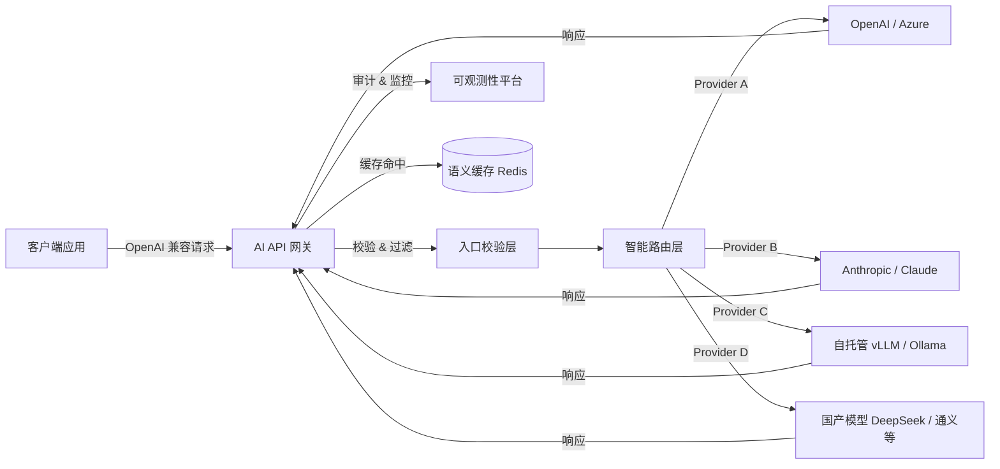
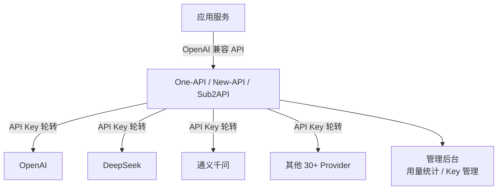
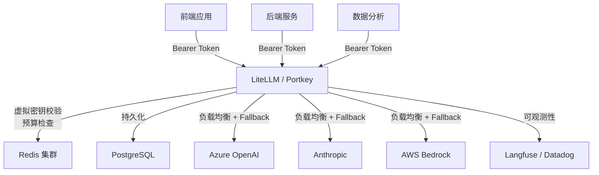
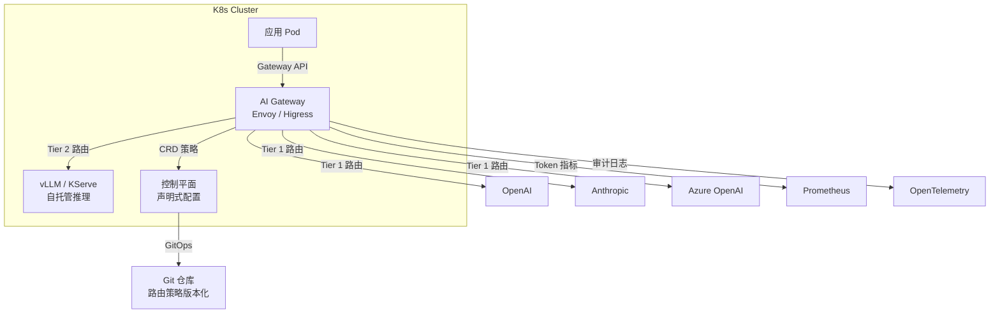
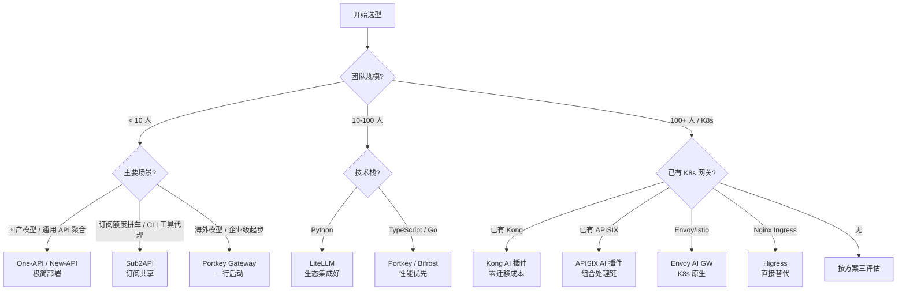

## AI API 网关：开源项目深度分析与落地方案

> 调研日期：2026-07-17 | 涵盖 10+ 开源项目、8+ 行业文章

---

## 一、为什么需要 AI API 网关

当企业从"试一试大模型"走向"大规模生产调用"，会迅速撞上一系列工程问题：数十个团队各自拿着不同厂商的 API Key、调用量与成本无人可见、模型切换需要改代码、敏感数据可能在 Prompt 中被发送到外部服务、某个 Provider 限流时整个系统雪崩……

AI API 网关（也叫 LLM Gateway / AI Gateway）正是为解决这些问题而生的基础设施层。它部署在应用与后端模型之间，作为所有 AI 流量的统一入口，向下屏蔽异构模型的 API 差异，向上为应用提供标准化调用接口。正如 Envoy 社区所言——"AI 本质上是 API 的一种新用例"，AI 网关是传统 API 基础设施为适应大模型流量特性而自然演进的产物。

引入 AI 网关的核心收益可以归纳为四个方面：**成本可控**（Token 级计量与预算、语义缓存减少重复调用）、**安全可靠**（虚拟密钥、PII 脱敏、Prompt 注入防护）、**高可用**（多 Provider 故障转移、负载均衡）、**可观测**（全链路审计日志、多维度用量追踪）。

---

## 二、AI 网关的核心能力与架构设计

### 2.1 架构总览

典型的 AI 网关以反向代理形式部署在客户端与后端模型之间，核心工作流为：

关键设计要点包括：无状态数据平面支持水平扩展、Redis 集群承载限流计数与缓存、PostgreSQL 持久化策略配置、全局控制平面统一同步路由规则。

### 2.2 六大核心能力

**智能路由与负载均衡**：AI 网关不依赖传统 HTTP 路径路由，而是基于语义特征（模型名称、任务类型、成本目标）进行智能调度。高级实现支持延迟感知（latency-based）、最少连接（least-busy）、成本最优（lowest-cost）等算法，以及优先级队列（前端交互请求优先于后台批处理）。当主 Provider 异常时自动触发断路器，无缝切换至备用模型，恢复后渐进式回流避免惊群效应。

**Token 级限流与预算控制**：突破传统按请求次数计数的局限，按实际 Token 消耗量（含 input + output + reasoning tokens）进行精细化计量。可为每个团队、应用、虚拟密钥设置 Token 预算窗口，超限时自动拦截。部分实现还支持 CEL 表达式对不同 Token 类型加权计费。

**语义缓存**：利用向量嵌入计算 Prompt 相似度，对语义重复的查询直接返回缓存结果。这不仅大幅降低 API 成本（重复查询可达 80%+ 节省），还显著改善响应延迟。

**安全与内容审查**：请求与响应双向内容审查，包括 PII（个人隐私信息）自动脱敏、Prompt 注入检测、有害内容拦截、虚拟 API 密钥管理（真实 Provider 凭证集中托管于 Vault，开发团队仅使用网关签发的虚拟密钥）。

**可观测性**：多维指标监控（P95 延迟、各团队 Token 消耗、缓存命中率、错误分布、回退路由激活频率）、全链路审计日志（完整记录 Prompt、响应内容、消耗 Token 数、模型身份与调用者）、集成 OpenTelemetry 标准。

**MCP（Model Context Protocol）支持**：这是 2025-2026 年的新兴热点，多个网关已开始提供 MCP Gateway 能力，为 AI Agent 架构提供统一的工具调用入口、认证与可观测性。

---

## 三、主流开源项目深度分析

### 3.1 LiteLLM — 社区最活跃的 Python 网关

| 维度 | 详情 |
|------|------|
| GitHub Stars | ~53,800 |
| 技术栈 | Python (FastAPI) + PostgreSQL + Redis |
| 许可证 | 自定义（有商业限制） |
| 仓库 | [BerriAI/litellm](https://github.com/BerriAI/litellm) |

LiteLLM 的核心理念是"万物皆 OpenAI 格式"——所有请求统一为 OpenAI API 协议，由网关翻译后分发到 100+ Provider。它提供 6 种负载均衡算法（延迟优先、成本优先、最少连接等），四级限流（全局/密钥/用户/团队），以及完善的费用追踪与虚拟密钥管理。

优势在于 Provider 覆盖面最广、Python 生态深度集成（LangChain、LlamaIndex 无缝衔接）、社区极其活跃。劣势是 Python GIL 导致高并发下性能天花板明显（对比 Go 网关延迟差约 50 倍），生产部署需 PostgreSQL + Redis 配置较复杂，开源版 Guardrails 功能基础。

适合 Python 技术栈团队、需要频繁在 Azure/Bedrock/Anthropic 等多 Provider 间切换的场景、以及对自托管有强需求且追求社区支持的团队。

### 3.2 Portkey Gateway — TypeScript 高性能之选

| 维度 | 详情 |
|------|------|
| GitHub Stars | ~12,500 |
| 技术栈 | TypeScript (Node.js) |
| 许可证 | MIT |
| 仓库 | [Portkey-AI/gateway](https://github.com/Portkey-AI/gateway) |

Portkey 定位"企业级 AI 网关"，1,600+ 模型支持，内置 50+ AI Guardrails（PII 检测、毒性过滤、Prompt 注入防护），支持语义缓存。Node.js 异步 I/O 模型使其在高并发下延迟表现显著优于 Python 方案。MIT 许可意味着无任何商业限制。

优势是性能优异、开箱即用（`npx @portkey-ai/gateway` 一行启动）、内置安全护栏丰富、许可宽松。劣势是社区规模小于 LiteLLM，负载均衡策略不如 LiteLLM 丰富（无延迟感知/最少连接等算法），部分高级可观测性功能依赖托管云服务。

适合生产环境对延迟和吞吐量要求高的场景、需要 HIPAA 合规等安全敏感部署（医疗/金融）、以及追求低运维成本希望托管服务的团队。

### 3.3 Bifrost — 极致性能的 Go 网关

| 维度 | 详情 |
|------|------|
| GitHub Stars | ~6,600 |
| 技术栈 | Go |
| 许可证 | Apache 2.0 |
| 仓库 | [maximhq/bifrost](https://github.com/maximhq/bifrost) |

Bifrost 主打极致性能，官方基准测试显示每请求仅 11 微秒额外开销（对比 LiteLLM ~8ms、Kong ~2-5ms），5,000 RPS 下 100% 成功率。支持 23+ Provider、双层语义缓存、四层预算层级、MCP Client/Server 双向支持。Go 的并发模型赋予它结构性吞吐量优势。

优势是延迟行业领先、零代码改动接入（只需改 endpoint URL）、语义缓存与 MCP 支持完善。劣势是 Provider 覆盖不如 LiteLLM（23+ vs 100+），社区尚小，企业级集群功能需配合 Maxim 商业平台。

适合对网关延迟极其敏感的生产环境、Go 技术栈团队（可嵌入 SDK 使用）、以及构建 AI Agent 应用需要 MCP 协议支持的场景。

### 3.4 One-API / New-API — 中文生态最受欢迎的轻量方案

| 维度 | One-API | New-API |
|------|---------|---------|
| GitHub Stars | ~35,800 | ~10,000+（快速增长） |
| 技术栈 | Go + React | Go + React |
| 许可证 | MIT | MIT |
| 仓库 | [songquanpeng/one-api](https://github.com/songquanpeng/one-api) | [QuantumNous/new-api](https://github.com/QuantumNous/new-api) |

One-API 是国内 AI 社区最广泛使用的 LLM API 管理系统，单二进制文件即可运行，支持 30+ 国内外 Provider（百度、阿里、腾讯、智谱、讯飞、月之暗面、字节等覆盖完整），核心功能是 API Key 管理、用量统计和统一代理。

New-API 是其最活跃演进版本，在保持数据库完全兼容的基础上新增了协议转换（OpenAI ↔ Claude ↔ Gemini 跨格式翻译）、多模态路由（Midjourney 图片、Suno 音频）、内置支付计费（EPay/Stripe）等能力，UI 也大幅升级。

优势是部署极简（SQLite 即可运行零依赖）、国内模型覆盖完整、中文社区活跃。劣势是缺乏 K8s 原生支持、无可观测性深度集成（无 OpenTelemetry）、无内置 Prompt 安全审查。

适合国内中小团队快速上手、个人开发者管理多模型 API Key、以及需要覆盖国产大模型的内部工具。

### 3.5 Envoy AI Gateway — Kubernetes 原生深度集成

| 维度 | 详情 |
|------|------|
| GitHub Stars | ~1,800 |
| 技术栈 | Go/C++（基于 Envoy + K8s Gateway API） |
| 许可证 | Apache 2.0 |
| 仓库 | [envoyproxy/ai-gateway](https://github.com/envoyproxy/ai-gateway) |

Envoy AI Gateway 是 CNCF 生态的 AI 网关方案，深度扩展 Kubernetes Gateway API，新增 `AIServiceBackend` 等 CRD。采用两层网关架构：Tier 1 集中处理外部流量入口，Tier 2 管理自托管模型推理集群的入口。Token 级限流能力最为精细（支持 CEL 表达式加权、usage budget、shadow mode），MCP Gateway 支持 OAuth 认证。

优势是 K8s 原生体验（声明式 YAML + GitOps）、Token 限流最成熟、多租户能力强、与 Prometheus/OpenTelemetry 无缝集成。劣势是仅支持 K8s 部署（无简单 docker-compose 方案）、学习曲线陡、项目尚年轻（2025.02 首发）。

适合已有大规模 K8s 基础设施的企业、混合 AI 架构（云 Provider + 自托管 vLLM/KServe）、以及追求 GitOps 管理 AI 路由策略的平台团队。

### 3.6 Apache APISIX — 传统网关的 AI 扩展

| 维度 | 详情 |
|------|------|
| GitHub Stars | ~16,900 |
| 技术栈 | Lua/Nginx (OpenResty) + etcd |
| 许可证 | Apache 2.0 |
| 仓库 | [apache/apisix](https://github.com/apache/apisix) |

APISIX 本身是成熟的云原生 API 网关，通过插件体系扩展 AI 能力：ai-proxy 插件统一多 LLM 路由，prompt-guard 拦截危险输入，prompt-decorator 注入系统提示词，ai-rag 集成向量数据库做检索增强，content-moderation 过滤输出。所有插件可自由组合形成链式处理（Prompt Guard → AI Proxy → Content Moderation → Logging）。

优势是性能极高（NGINX/LuaJIT 底座久经考验）、插件生态最丰富（100+ 插件可与 AI 插件组合）、支持多语言插件开发（Lua/Go/Java/Python/Wasm）、热更新零停机。劣势是 etcd 运维复杂度高、AI 功能较新且不如专用网关深入、纯 AI 场景配置偏重。

适合已在运行 APISIX 的团队直接扩展 AI 能力、需要传统 API + AI 流量统一管理的场景、以及对吞吐量要求极高的大规模部署。

### 3.7 Kong AI Gateway — 企业级全能选手

| 维度 | 详情 |
|------|------|
| GitHub Stars | ~43,800（Kong 整体） |
| 技术栈 | Lua/Nginx (OpenResty) + PostgreSQL |
| 许可证 | Apache 2.0（核心）；AI 高级功能需企业版 |
| 仓库 | [Kong/kong](https://github.com/Kong/kong) |

Kong 在成熟的 API 网关基础上叠加了 60+ AI 专用插件：AI Proxy Advanced（多 Provider 动态 fallback）、AI Prompt Compressor（压缩 Token）、AI RAG Injector（网关层自动注入向量检索结果）、PII Sanitization（20+ 类别、12 种语言的 PII 脱敏，在私有容器中运行满足合规要求）。还支持 MCP 流量治理。

优势是生态最成熟（全球大量企业用户）、插件最丰富、PII 处理能力业界领先。劣势是高级 AI 功能往往锁在付费企业版（年费常超 $50,000）、额外延迟 2-5ms、对纯 AI 场景而言架构偏重。

适合已有 Kong 基础设施的大型企业、需要传统 API + AI 统一治理、合规要求严格（金融/医疗）的场景。

### 3.8 Higress — 阿里巴巴的 CNCF 新星

| 维度 | 详情 |
|------|------|
| GitHub Stars | ~8,900 |
| 技术栈 | C++ (Envoy) + Istio 控制面 + Wasm 插件 |
| 许可证 | Apache 2.0 |
| 仓库 | [alibaba/higress](https://github.com/alibaba/higress) |

Higress 2026 年 3 月加入 CNCF Sandbox，诞生于阿里内部解决 Tengine reload 连接中断问题，演进为以 AI 为"一等公民"的云原生网关。基于 Envoy/Istio，配置变更通过 xDS 协议毫秒级生效。支持 100+ 国内外模型、Token 级限流、语义缓存、API Key 池轮转、MCP Server 托管、Prompt 注入检测。Wasm 插件系统支持 Go/Rust/JS 编写，沙箱隔离且热更新。

优势是 AI 原生架构（非后装）、Envoy/Istio 底座性能优秀、CNCF 项目厂商中立、国内模型生态支持好（通义千问、DeepSeek 等一等支持）、可作为 Nginx Ingress 的直接替代。劣势是全球社区不如 Kong、C++ 核心调试门槛高、英文文档质量仍在追赶。

适合已在 K8s/Envoy/Istio 生态的团队、需要覆盖国产模型的企业、以及想用 AI 就绪网关替代 Nginx Ingress 的场景。

### 3.9 Sub2API — 订阅额度聚合与拼车共享网关

| 维度 | 详情 |
|------|------|
| GitHub Stars | ~32,800 |
| 技术栈 | Go (Gin + Ent) + Vue 3 + PostgreSQL 15+ + Redis 7+ |
| 许可证 | 未明确说明（需查看仓库） |
| 仓库 | [Wei-Shaw/sub2api](https://github.com/Wei-Shaw/sub2api) |

Sub2API 是一个定位非常独特的 AI 网关：它不是简单地把多家 API Key 聚合成一个入口，而是把 Claude、OpenAI、Gemini、Grok 等**订阅制额度**统一封装成平台 API Key，支持多账号拼车共享以分摊成本。它强调"原生工具无缝使用"——可以直接为 Claude Code、Codex CLI、Gemini CLI、Cursor 等工具提供代理接入。

核心功能包括：多上游账号管理（OAuth/API Key）、API Key 分发、Token 级精确计费、智能调度与会话保持、并发与速率限制、内置支付（EasyPay/支付宝/微信/Stripe）、Web 管理后台、iframe 嵌入外部系统。

优势是订阅额度利用率最大化（拼车共享）、对订阅制服务的支持非常直接、GitHub 社区热度高（32.8k stars）、部署方式简单（脚本一键安装或 Docker Compose）。劣势是定位偏消费/个人工作室场景，企业级治理能力（如 RBAC、审计、MCP、K8s 原生）不如 LiteLLM/Portkey/Higress 完善；文档和生态以中文为主，国际化程度有限。

适合以个人开发者或小型工作室为主的场景、需要把多个订阅账号额度 pooling 后分享给团队成员使用、以及主要使用 Claude Code / Cursor / Gemini CLI 等工具链的团队。

---

## 四、综合对比

| 项目 | Stars | 语言 | 许可证 | 额外延迟 | Provider 数 | K8s 原生 | Token 限流 | 语义缓存 | MCP | 复杂度 |
|------|-------|------|--------|----------|-------------|----------|------------|----------|-----|--------|
| LiteLLM | 53.8k | Python | 自定义 | ~8ms | 100+ | 否 | 是 | 是(企业版) | 是 | 中 |
| Portkey | 12.5k | TypeScript | MIT | 低 | 1600+ | 否 | 是 | 是 | 否 | 低 |
| Bifrost | 6.6k | Go | Apache 2.0 | ~11μs | 23+ | 否 | 是 | 是 | 是 | 低 |
| One-API | 35.8k | Go | MIT | 极低 | 30+ | 否 | 基础额度 | 否 | 否 | 极低 |
| New-API | 10k+ | Go | MIT | 极低 | 30+多模态 | 否 | 基础额度 | 否 | 否 | 低 |
| Sub2API | 32.8k | Go | 未明确 | 极低 | 订阅制为主 | 否 | 是 | 否 | 否 | 低 |
| Envoy AI GW | 1.8k | Go/C++ | Apache 2.0 | 极低 | 16+ | 是(深度) | 是(CEL) | 是 | 是 | 高 |
| Apache APISIX | 16.9k | Lua | Apache 2.0 | 极低 | 多(插件) | 部分 | 是 | 否 | 是 | 中高 |
| Kong AI GW | 43.8k | Lua | Apache 2.0 | 2-5ms | 多(插件) | 部分 | 传统 | 是(插件) | 是 | 中高 |
| Higress | 8.9k | C++ | Apache 2.0 | 极低 | 100+ | 是(深度) | 是 | 是 | 是 | 中高 |

---

## 五、行业趋势（2025-2026）

**Token 经济取代请求经济**：AI 网关的限流与计费从"请求次数"全面转向"Token 消耗量"，因为同一个 API 调用消耗的计算资源差异可达千倍（一个 10 Token 的请求和一个 10,000 Token 的请求成本天差地别）。

**MCP 协议成为标配**：Model Context Protocol 作为 AI Agent 与外部工具交互的标准协议，正在被越来越多的网关原生支持（Bifrost、Envoy AI GW、Higress、Kong 均已集成），MCP Gateway 成为下一个竞争焦点。

**AI 原生 vs AI 扩展的分化**：市场正在分化为两大阵营——"AI 原生网关"（Bifrost、Higress、LiteLLM）从一开始就为 LLM 流量设计，和"AI 扩展网关"（Kong、APISIX）在传统 API 网关上叠加 AI 插件。前者性能和 AI 功能深度更优，后者在已有基础设施上的整合成本更低。Sub2API 则代表了第三条路线：围绕订阅制额度做专门优化，把 API 聚合与"拼车共享"消费场景深度结合。

**订阅制额度管理成为独立场景**：随着 Claude、OpenAI、Gemini、Grok 等越来越多服务采用订阅 + 额度模式，单纯做 API Key 转发已经不够。Sub2API 这类项目把多账号订阅额度 pooling、Token 级计费、支付变现、CLI 工具代理打包成一个完整方案，在个人开发者和小工作室中有很强的刚需属性。

**语义缓存成为差异化能力**：几乎所有主流网关都在内置语义缓存，通过向量嵌入判断 Prompt 相似性来复用已有响应，这是降低 AI 调用成本最有效的手段之一。

**安全护栏从可选变为必选**：PII 脱敏、Prompt 注入防护、输出内容审查不再是锦上添花，而是生产部署的硬性要求。Kong 的 20+ 类别 PII 识别和 Portkey 的 50+ Guardrails 代表了这一方向的最佳实践。

---

## 六、落地方案建议

### 方案一：轻量快速启动（中小团队 / 个人开发者）

**推荐选型：One-API / New-API / Sub2API**

适用条件：团队 10 人以下、调用量中等、不需要复杂的可观测性与安全审查。

选型建议：主要使用国产模型 + 部分海外模型选 One-API/New-API；主要使用 Claude / OpenAI / Gemini / Grok **订阅额度**、希望拼车共享成本、或需要为 Claude Code / Cursor / Gemini CLI 提供代理接入，选 Sub2API。

部署步骤：三者都支持 Docker 一键部署。One-API 可 SQLite 运行零依赖；Sub2API 推荐 Docker Compose（local 目录版便于备份迁移），配置上游订阅账号和平台 API Key，为团队成员分发令牌。

### 方案二：中等规模生产环境（20-100 人团队）

**推荐选型：LiteLLM 或 Portkey Gateway**

适用条件：多团队多应用共享 AI 基础设施、需要费用追踪与预算控制、需要故障转移和负载均衡、有一定的运维能力。

部署步骤：Docker Compose 部署网关 + PostgreSQL + Redis，配置多 Provider 路由策略与 fallback 规则，为每个团队创建虚拟密钥并设定 Token 预算，集成 Langfuse 或 Prometheus 做可观测性。

选择建议：Python 技术栈优先 LiteLLM（生态集成好），对延迟要求高或 TypeScript 技术栈优先 Portkey（性能优 + MIT 许可）。

### 方案三：企业级大规模部署（Kubernetes 基础设施）

**推荐选型：Envoy AI Gateway 或 Higress**

适用条件：已有 K8s 集群、需要多租户隔离、Token 级精细化成本管控、混合部署（云 Provider + 自托管推理集群）、追求 GitOps 管理体验。

部署步骤：Helm Chart 安装网关到 K8s 集群，定义 AIServiceBackend CRD 配置各 Provider 路由策略，配置 Token 级 RateLimitPolicy 与预算配额，集成 Prometheus + Grafana 仪表盘，配置 MCP Gateway（如需要 Agent 架构）。

选择建议：已在 Envoy/Istio 生态优先 Envoy AI GW（Token 限流最成熟），需要覆盖国产模型或替代 Nginx Ingress 优先 Higress（CNCF 项目，阿里生态支持好）。

### 方案四：已有传统 API 网关的企业

**推荐选型：在现有网关上扩展 AI 能力**

如果企业已在运行 Kong 或 Apache APISIX，最务实的做法是直接在现有网关上启用 AI 插件，而非引入新的网关层。

Kong 用户：启用 ai-proxy 插件做统一模型路由，ai-prompt-guard 做输入审查，配合已有的 rate-limiting、JWT auth、logging 插件形成完整链路。高级需求（PII 脱敏、RAG 注入）按需开启对应插件。

APISIX 用户：启用 ai-proxy 插件对接多 LLM，组合 prompt-guard → ai-proxy → content-moderation → logging 形成处理链。利用 APISIX 的热更新能力实现零停机配置变更。

---

## 七、选型决策树

---

## 八、关键实施建议

**从小处开始，逐步深化**：不要一开始就追求完美的全功能部署。先解决最痛的单点问题（通常是 API Key 管理和基本路由），然后根据实际运营数据决定是否需要更高级的能力（语义缓存、Token 预算、安全护栏等）。

**虚拟密钥是安全基石**：无论选择哪个方案，第一件事就是把所有 Provider 的真实 API Key 收归网关统一管理，为每个团队和应用签发虚拟密钥。这一步就能解决大部分密钥泄露和成本失控问题。

**可观测性不能后置**：至少从 Day 1 起就开启请求日志和 Token 用量追踪。"不知道谁在调用什么模型、花了多少钱"是最常见的生产事故前兆。

**关注 MCP 演进**：如果团队正在或即将构建 AI Agent 应用，选择支持 MCP 协议的网关会显著降低后续的工具集成成本。这一领域正在快速发展，2026 年下半年预计会有更多标准化落地。

---

## 参考来源

- [AI Gateway 深度解析 — jimmysong.io](https://jimmysong.io/zh/blog/ai-gateway-in-depth/)
- [Best Open Source AI Gateway 2026 — dev.to](https://dev.to/pranay_batta/best-open-source-ai-gateway-in-2026-2flb)
- [Enterprise LLM Gateway Architecture — appscale.blog](https://appscale.blog/en/blog/enterprise-llm-gateway-architecture-routing-rate-limiting-observability-2026)
- [Top API Gateways for AI Applications — dev.to](https://dev.to/hadil/top-api-gateways-for-ai-applications-and-agentic-workflows-2026-developer-guide-1e82)
- [LLM API 架构与成本优化全解 — 阿里云开发者社区](https://developer.aliyun.com/article/1704564)
- [5 Best Open-Source LLM Gateways — getmaxim.ai](https://www.getmaxim.ai/articles/5-best-open-source-llm-gateways-for-self-hosted-deployments-in-2026/)
- [6 AI Gateway Trends — kosmoy.com](https://www.kosmoy.com/resources/blog/6-ai-gateway-trends-that-will-shape-2026/)
- [LiteLLM GitHub](https://github.com/BerriAI/litellm) | [Portkey Gateway GitHub](https://github.com/Portkey-AI/gateway) | [Bifrost GitHub](https://github.com/maximhq/bifrost)
- [One-API GitHub](https://github.com/songquanpeng/one-api) | [New-API GitHub](https://github.com/QuantumNous/new-api)
- [Sub2API GitHub](https://github.com/Wei-Shaw/sub2api)
- [Envoy AI Gateway GitHub](https://github.com/envoyproxy/ai-gateway) | [Apache APISIX GitHub](https://github.com/apache/apisix)
- [Kong GitHub](https://github.com/Kong/kong) | [Higress GitHub](https://github.com/alibaba/higress)
- [AI Gateway Resources (汇总) — GitHub](https://github.com/jasonkuperberg/ai-gateway-resources)
