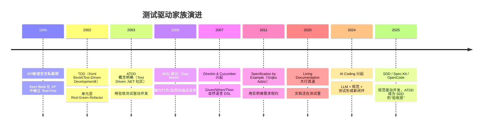
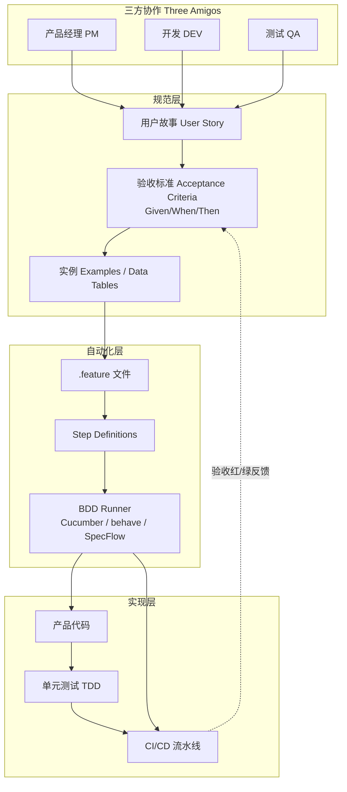
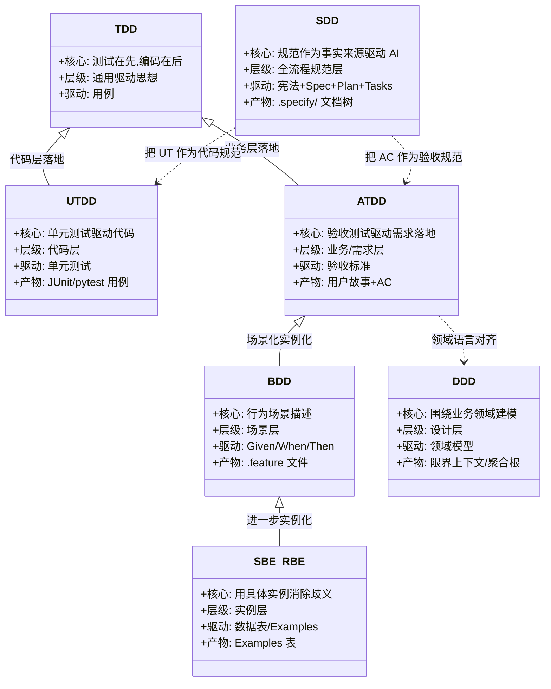
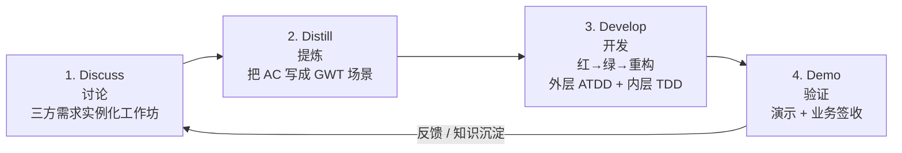
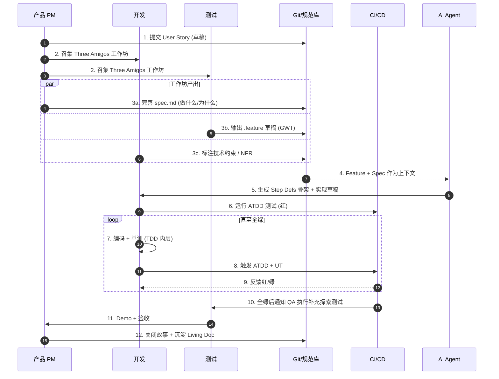
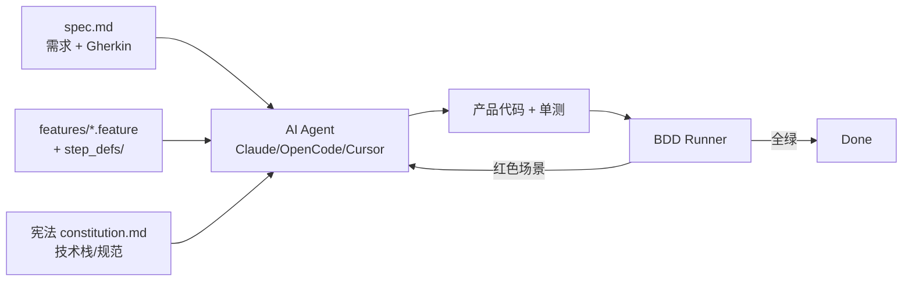
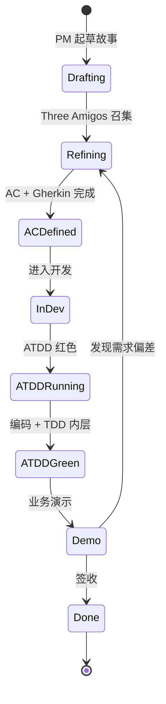
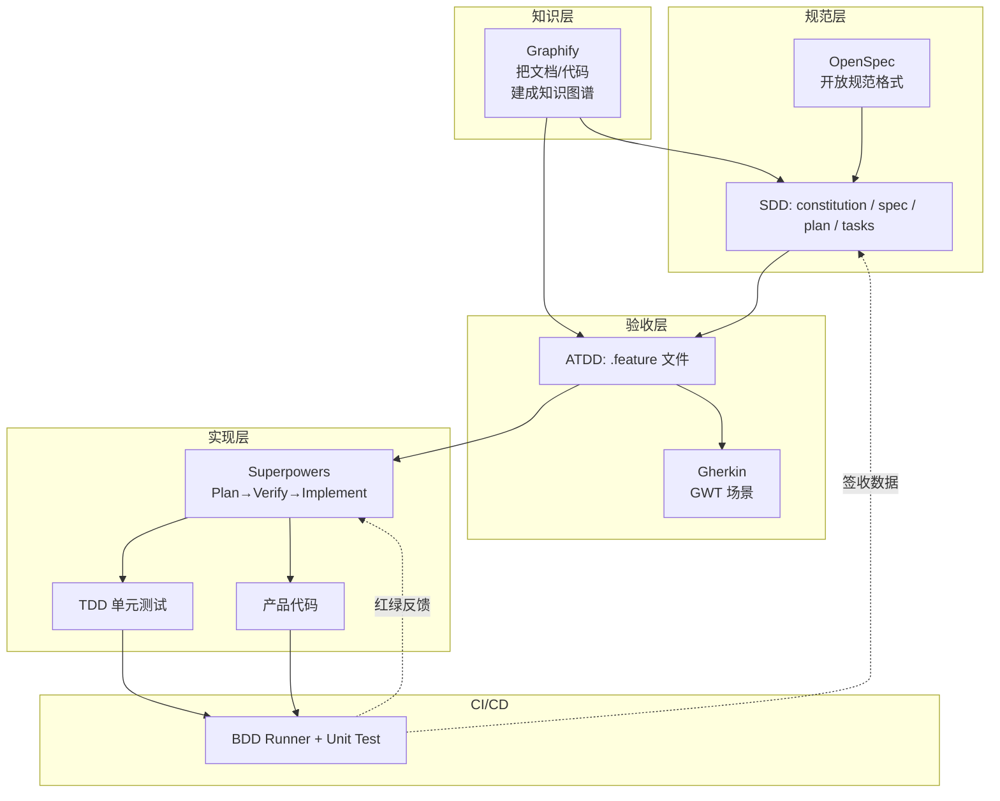
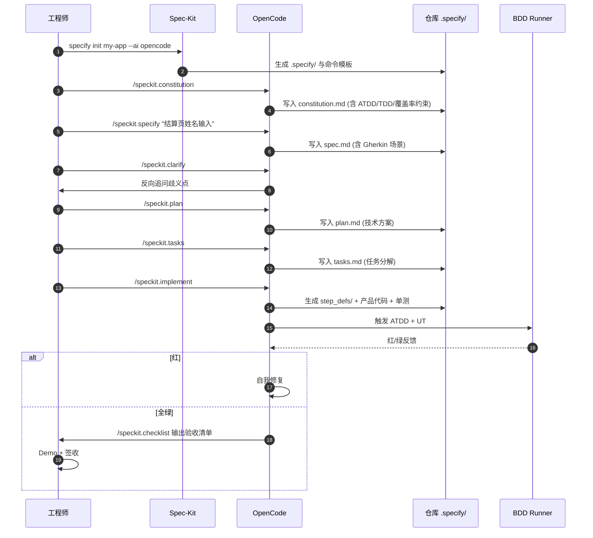
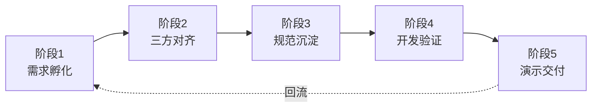

## ATDD 开发范式

> ATDD（Acceptance Test-Driven Development，验收测试驱动开发）是一种把"验收"前置到需求阶段、由业务-开发-测试三方共同参与的协作开发范式。它以 Gherkin 风格的 Given/When/Then 场景作为三方共同语言，让"验收标准 = 需求 = 测试 = 文档"四位一体，是当下 SDD（规范驱动开发）与 AI 编程时代质量内建的关键拼图。

---

### 一、ATDD 开发范式是什么

ATDD 全称 **Acceptance Test-Driven Development**，中文译为"验收测试驱动开发"。它的核心主张可以浓缩成一句话：

> **开始编码前，让产品、开发、测试三方先共同确定"完成的样子"，并把这套验收标准写成可执行的测试。**

与 TDD（侧重代码层"测试-编码-重构"循环）不同，ATDD 把测试驱动的对象从 *代码单元* 上升到 *业务行为* 与 *用户价值*。它回答的是 *"我们是不是在做正确的事？"*，而不仅仅是 *"我们有没有把事做对？"*

落到具体形态上，ATDD 通常表现为一份由 *Three Amigos*（三方角色）共同维护的 **Feature 文件**：

```gherkin
@P1 @姓名输入
Feature: 用户在结算页输入收件人姓名
  作为一名下单用户
  我希望能够在结算页输入并校验收件人姓名
  以便订单能够正确投递

  Background:
    Given 我已登录并进入结算页

  Scenario: 输入合法中文姓名
    When 我在"收件人姓名"中输入"张三"
    Then "下一步"按钮可点击
    And 不显示任何错误提示

  Scenario Outline: 非法字符校验
    When 我在"收件人姓名"中输入 "<姓名>"
    Then 应提示 "<错误>"
    And "下一步"按钮不可点击

    Examples:
      | 姓名     | 错误             |
      | 12345    | 仅支持中英文字符 |
      | @@@      | 仅支持中英文字符 |
      |          | 姓名不能为空     |
```

这份文件既是产品的"需求说明书"，也是测试的"自动化用例"，还是开发者的"接口契约"。一份产物，三种用途——这就是 ATDD 的精髓。

---

### 二、ATDD 的产生背景与发展脉络

ATDD 并非一夜之间被发明出来，它是 *测试驱动思想* 在不同抽象层级上"涨潮"的结果。



可以把这条脉络理解为 **"从代码到业务、再回到代码"** 的螺旋：

- **TDD**：开发者写单元测试驱动代码（代码层闭环）
- **ATDD**：业务/测试写验收测试驱动需求落地（业务层闭环）
- **BDD**：把 ATDD 的验收标准规范成 Given-When-Then 场景（场景层）
- **SBE/RBE**：通过具体实例消除需求歧义（实例层）
- **SDD**：把所有规范（宪法/需求/方案/任务）作为 AI 编程的"事实来源"（规范层）

ATDD 不是其中任何一层的"竞争对手"，反而是它们的 **连接器**——它向上承接业务意图，向下驱动 TDD 实现细节。

---

### 三、ATDD 开发范式的核心特性

ATDD 区别于其它范式的关键特性可以归纳为以下七点：

1. **协作前置**：在 *写代码之前*，三方对"完成的定义"达成共识，避免后期返工。
2. **业务可读**：用 Gherkin/自然语言书写，产品经理可写、测试可用、开发可读。
3. **测试即文档**：验收标准就是测试脚本，同时是活文档（Living Documentation），避免文档腐烂。
4. **执行驱动**：每一条标准都可被自动化执行，红/绿状态对应需求满足程度。
5. **缺陷预防**：质量在需求阶段就被内建（Quality is built-in），而非在测试阶段被发现。
6. **AI 友好**：结构化 GWT 场景天然适合 LLM 解析与生成代码，是 AI 编程的"边界栏"。
7. **可追溯**：从用户故事 → 验收场景 → 代码 → CI 报告，全链路可追溯。

> **一句话总结**：ATDD = "活的需求 + 活的文档 + 活的测试"。

---

### 四、ATDD 的原理与架构

ATDD 不是一个工具，而是一个 **协作流程 + 测试体系**的组合。它的内在结构可以用下图表示：



整个体系的关键约束是：

- **`.feature` 文件由三方共同维护**，不属于任何一方
- **Step Definitions 由开发与测试合作维护**，是业务语言到技术实现的桥
- **失败的验收测试 = 未完成的功能**，CI 红灯 = Definition of Done 未达成

---

### 五、SDD / BDD / TDD / UTDD / ATDD 的关系图谱

外界经常混淆这些"驱动开发"，本质上它们是 **不同抽象层级上的同一思想**：测试/规范先行。



可以这样记忆：

- **UTDD 关心"代码做对了没"**
- **ATDD 关心"做的是不是用户要的"**
- **BDD 关心"用什么语言表达 AC"**
- **SBE/RBE 关心"AC 写得够不够具体"**
- **DDD 关心"业务模型对不对"**
- **SDD 关心"AI 怎么基于规范稳定地生成代码"**

它们不是相互替代，而是 **协同共存**：在 SDD 时代，BDD/Gherkin 是 ATDD 的标准写法，ATDD 是 SDD 的验收层，TDD 是 SDD 的实现层，DDD 是 SDD 的建模层。

---

### 六、ATDD 相比其他范式的优势

| 维度 | TDD | UTDD | BDD | ATDD | DDD | SDD |
| --- | --- | --- | --- | --- | --- | --- |
| 视角 | 开发者 | 开发者 | 跨角色 | 业务/三方 | 架构师 | 全角色+AI |
| 粒度 | 单元 | 单元 | 场景 | 验收/E2E | 限界上下文 | 全栈 |
| 语言 | 代码断言 | 代码断言 | Gherkin | 自然语言/Gherkin | 通用语言/UML | 结构化文档 |
| 共识对象 | 函数行为 | 函数行为 | 场景 | "完成的样子" | 领域模型 | 整套规范 |
| 自动化 | 高 | 高 | 高 | 中-高 | 低 | 高（AI） |
| 协作度 | 低 | 低 | 中 | **高** | 中 | 高 |
| 缺陷预防 | 中 | 中 | 中-高 | **高** | 中 | 高 |
| 学习曲线 | 中 | 中 | 中 | 低-中 | 高 | 中 |

ATDD 的独特优势：

1. **三方对齐成本最低**：Gherkin 是自然语言，PM 不会拒绝。
2. **缺陷预防最强**：80% 的缺陷源于需求歧义，ATDD 直接消灭这一根。
3. **测试金字塔最稳**：验收测试稀薄、单元测试厚实，CI 速度 + 业务覆盖兼得。
4. **AI 协作友好**：GWT 场景是 LLM 最容易"看懂"的需求格式。

---

### 七、ATDD 开发范式标准流程

业界公认的 ATDD 标准流程为 **"四 D"循环**（Discuss → Distill → Develop → Demo），由 Elisabeth Hendrickson 等人推广，与 Spec by Example 高度兼容。



各阶段产出：

| 阶段 | 关键动作 | 主导角色 | 核心产物 |
| --- | --- | --- | --- |
| Discuss | 需求实例化、问题澄清、边界确认 | PM 主持 + DEV/QA 参与 | 用户故事 + 问题清单 |
| Distill | 抽象出验收场景、补全异常分支 | QA 主导 + 三方校对 | `.feature` 文件草稿 |
| Develop | 自动化场景→失败→编码→通过 | DEV 主导 + QA 协作 | Step Defs + 产品代码 |
| Demo | 真实场景演示、利益相关方签收 | PM 主持 + 三方在场 | 验收报告 + 知识库条目 |

> **关键纪律**：第 2 步未完成、第 3 步不允许开始；第 4 步未签收，故事不算 Done。

---

### 八、ATDD 在实际项目中的最佳使用流程

理想流程与现实总会有落差，结合阿里集团多个 SDD+ATDD 落地实践（营销活动平台升级、活动报名修改、商品发布校验等），下面是一套经过验证的"工程化最佳实践"。



实战中需要特别关注的"四个守则"：

1. **守则一：场景写得"具体到能跑"**。`Given 用户已登录` 含糊，`Given 用户以"vip@example.com"登录` 才能跑。
2. **守则二：主流程 : 分支 : 异常 ≈ 1 : 2 : 2**。异常通常比正常路径更多漏洞。
3. **守则三：Step Definitions 必须复用**。`When 我点击"<按钮>"` 应只有一处实现。
4. **守则四：失败截图 + 业务日志必须落盘**。便于三方共同 review。

---

### 九、在主流 AI 工具场景下跑通 ATDD

ATDD 在 AI 编程时代变得 *比以往任何时候都重要*——它给 LLM 划定了"什么算对"的边界。以下是 ATDD 在主流 AI 工具中的落地姿势：

| AI 工具 | 角色 | ATDD 接入方式 |
| --- | --- | --- |
| **Claude Code** | 终端编码代理 | 把 `.feature` 文件作为上下文，附加"先让红色场景变绿"指令；可结合 `superpowers` 插件做 plan→implement→verify |
| **Cursor** | IDE 内 AI 编辑 | 配置 `.cursorrules` 引用 spec/feature 目录；写代码前要求"先列出该故事所有 Gherkin 场景" |
| **OpenCode** | 开源 CLI 编码代理 | 配合 Spec-Kit 使用 `/speckit.specify` 生成 spec，在其中嵌入 Gherkin 场景，再 `/speckit.implement` |
| **Spec-Kit + 任意 Agent** | 规范驱动框架 | `.specify/specs/<story>/spec.md` 内嵌 GWT 场景，宪法约束 `测试覆盖 ≥ 80%、ATDD 全绿才能合并` |
| **Aider / Gemini CLI** | 终端 LLM 编辑器 | `aider --file spec.md feature/login.feature` 让 LLM 把场景翻译成代码 |
| **GitHub Copilot Chat** | IDE 助手 | `@workspace 把 features/login.feature 中失败的场景实现` |

通用接入模式：



关键经验是：**让 AI 看到的不只是 prompt，而是一整套结构化规范**——这正是 SDD+ATDD 的合力。

---

### 十、ATDD 等方法论如何保证流程合规

光有方法论而没有"护栏"，团队很容易回到"写完代码再补测试"的老路。ATDD 通过四层机制保证流程被遵守：

1. **流程门禁（Gate）**：CI 中设置 *没有 feature 文件不允许 PR*、*验收测试不绿不允许合并*。
2. **看板可视化**：Jira/Coop 工作流加入"AC 已定义""ATDD 通过"两个状态列，未到达不能流转。
3. **宪法 / Constitution 文件**：在 Spec-Kit 中将 ATDD 列为强制项，AI Agent 拒绝跳过。
4. **Definition of Done**：把"GWT 全绿 + 利益相关方签收"明确写进 DoD。



任何一个状态都对应一份"卡点产物"——没有产物，状态不流转，这就是 ATDD 治理的本质。

---

### 十一、Gherkin：ATDD 的共同语言

Gherkin 是 ATDD 的"灵魂书写体"。它由 Cucumber 引入，今天已被 SpecFlow、behave、CukeTest、Pytest-BDD 等几乎所有 BDD 框架沿用。

**关键字一览**：

| 关键字 | 作用 |
| --- | --- |
| `Feature` | 一项功能，文件顶层 |
| `Rule`（v6+） | 业务规则，介于 Feature 与 Scenario 之间 |
| `Background` | 多 Scenario 共享的前置步骤 |
| `Scenario` / `Example` | 一个具体业务场景 |
| `Scenario Outline` + `Examples` | 数据驱动场景 |
| `Given` | 前置条件（过去式） |
| `When` | 触发事件（行为） |
| `Then` | 期望结果（断言） |
| `And` / `But` | 连接同类步骤 |
| `@tag` | 分类与过滤 |
| `"""` / `|` | 文档字符串 / 数据表 |
| `#` | 行注释 |

**Gherkin 在 ATDD 中的四大作用**：

1. **共同语言**：业务、开发、测试三方 *同一份文档对齐*。
2. **可执行规约**：每条 GWT 都能跑，等价于自动化测试。
3. **数据驱动**：`Scenario Outline + Examples` 让一份场景覆盖多组输入。
4. **机器可读**：天然适合 LLM 解析，是 AI Coding 的最佳指令格式之一。

**最佳实践与反模式**：

- ✅ 一个场景 3–5 步，超过即拆。
- ✅ Given 描述"过去发生的事实"，避免动词时态错乱。
- ✅ Step 文本与关键字解耦：`Given 用户已登录` 与 `Then 用户已登录` 视为同一步。
- ✅ 使用 `@P1 @smoke @姓名输入` 等多标签做精细化筛选。
- ❌ 避免暴露 UI 实现细节：写"用户提交订单"而不是"用户点击 div#submit-btn"。
- ❌ 避免在 Given 里写"我打开页面后点击三次再滚动"，那是 UI 脚本不是规约。

---

### 十二、SDD + ATDD + Graphify + Superpowers + OpenSpec + Gherkin 如何融合

这些"驱动"在 2025 年开始呈现出"组合拳"的态势，各自承担清晰分工：



各部件分工：

- **Graphify**：把历史代码/文档/工单建成知识图谱，作为"项目记忆"，喂给 AI Agent。
- **OpenSpec**：提供一种开放的、工具中立的规范格式（类似 OpenAPI 之于接口），让 ATDD 场景跨工具流转。
- **SDD（Spec-Kit）**：作为方法论与命令体系，串联宪法-需求-方案-任务。
- **ATDD + Gherkin**：作为"验收层"的标准写法，是规范文档中的可执行部分。
- **Superpowers**：AI Agent 的工作流插件，强制"先 Plan、后 Verify、再 Implement"。
- **TDD**：在 Step Definition 实现内部用单元测试守护代码细节。

**融合公式**：

> Graphify（记忆） × OpenSpec/SDD（规范） × ATDD/Gherkin（验收） × Superpowers（工作流） × TDD（实现） × CI（守门人） = AI 时代的可信工程化交付链。

---

### 十三、基于 OpenCode 的 ATDD 流程

OpenCode 是阿里集团内常用的开源式 AI 编码 Agent。结合 Spec-Kit，ATDD 在 OpenCode 下的完整流程如下：



**关键工程要点**：

- 在 `constitution.md` 中写死："任何 PR 必须附 `.feature` 文件且全绿，否则禁止合并"。
- 在 `spec.md` 中以 ` ```gherkin ` 代码块嵌入验收场景，OpenCode 可直接读懂。
- `/speckit.clarify` 是 ATDD "Discuss" 阶段的 AI 化代偿，能有效防止 PM 写出歧义需求。
- `/speckit.tasks` 拆出的每一项任务，建议绑定一个或多个 Gherkin 场景作为完成标准。

---

### 十四、实际项目中跑通 ATDD：阶段功夫与产物清单

ATDD 不是"测试人员一个人的事"，它需要在以下五个阶段共同发力：



阶段功夫与典型产物：

| 阶段 | 主要工作 | 产物 |
| --- | --- | --- |
| 需求孵化 | 用户故事撰写、价值澄清 | User Story 草稿、北极星指标 |
| 三方对齐 | Three Amigos 工作坊、边界讨论、风险扫描 | 问题清单、风险登记表 |
| 规范沉淀 | spec.md、constitution.md、`.feature` 文件、Examples 数据表 | SDD 文档树 + Gherkin 场景集合 |
| 开发验证 | Step Definitions 实现、产品代码、单元测试 | step_defs/、源码、UT 报告 |
| 演示交付 | Demo 脚本、回归测试报告、活文档发布 | 验收报告、Living Doc 链接 |

在阿里内部最佳实践（如"营销活动平台升级 SDD+TDD 实践"、"端到端项目研发 SOP"）中，还会沉淀两类长期资产：

- **项目知识库**：将 `.feature` 与 Demo 结果归档，形成可被新成员/Agent 检索的 Living Doc。
- **测试模式库**：把常见 Step Definitions 抽象成模板（如登录、下单、风控拦截），供跨项目复用。

---

### 十五、ATDD 开源实践与学习路径

下面是国内外较有代表性的 ATDD/BDD 项目与学习资源：

- **Cucumber 系列**（https://cucumber.io ）：BDD/ATDD 鼻祖，Java/Ruby/JS/Python/Go 全覆盖。
- **behave**（Python）：Pythonic Gherkin 实现，学习曲线最缓。
- **pytest-bdd**：基于 pytest 的 BDD 插件，适合既有 pytest 项目无痛接入。
- **SpecFlow**（.NET）：微软系标准 BDD 工具。
- **CukeTest**：国内中文 BDD 工具，资料中文友好。
- **Robot Framework**：关键字驱动 + BDD 双模，适合 Web/API/移动端混合测试。
- **FitNesse**：Wiki 形态的 ATDD 工具，老牌但稳定。
- **GitHub Spec-Kit**（https://github.com/github/spec-kit ）：SDD 的参考实现，可嵌入 Gherkin。
- **OpenCode**（开源 AI 编码 Agent）：可配合 Spec-Kit 形成 ATDD-AI 闭环。

**学习路径建议**：

1. 先读《Specification by Example》（Gojko Adzic）建立观念。
2. 跟 cucumber.io 官方教程跑通一个"登录"或"取消订单"用例。
3. 用 behave 在熟悉的 Python 项目里做一次"全栈 ATDD" 改造。
4. 引入 Spec-Kit + OpenCode，尝试让 AI 帮你写 Step Definitions。
5. 把 `.feature` 文件作为团队的"Living Doc"长期维护。

---

### 十六、可落地的 Demo Case："活动报名商品支持修改"

下面以阿里内部一个真实案例的简化版做端到端演示。

**用户故事**（`spec.md` 节选）：

> 作为活动运营，我希望可以在报名截止前修改活动报名商品，以便及时纠正定价错误，避免用户投诉。

**验收标准**（`features/edit_event_goods.feature`）：

```gherkin
@P0 @活动报名 @商品修改
Feature: 活动报名商品支持修改
  作为活动运营
  我希望在报名截止前修改活动商品
  以便纠正错误并提升用户体验

  Background:
    Given 我是运营角色"OP-001"
    And 存在活动"618 大促"且报名未截止

  Scenario: 报名未截止时成功修改商品价格
    Given 活动"618 大促"包含商品"A001"，价格 100 元
    When 我把商品"A001"的价格改为 80 元
    Then 商品"A001"的价格应为 80 元
    And 已报名用户应收到"价格调整"站内信通知

  Scenario: 报名截止后禁止修改
    Given 活动"618 大促"已截止报名
    When 我尝试修改商品"A001"的价格
    Then 接口应返回错误"活动已截止，禁止修改"
    And 操作日志记录拒绝原因

  Scenario Outline: 商品字段校验
    When 我把商品"A001"的<字段>改为"<值>"
    Then 接口应返回错误"<错误信息>"

    Examples:
      | 字段 | 值     | 错误信息       |
      | 价格 | -1     | 价格必须为正数 |
      | 价格 | 0      | 价格必须为正数 |
      | 库存 | -1     | 库存必须为非负 |
      | 名称 |        | 名称不能为空   |
```

**Step Definitions 骨架**（Python + behave）：

```python
# features/steps/edit_event_goods_steps.py
from behave import given, when, then

@given('我是运营角色"{role_id}"')
def step_set_role(ctx, role_id):
    ctx.role = role_id

@given('存在活动"{name}"且报名未截止')
def step_event_open(ctx, name):
    ctx.event = ctx.client.create_event(name=name, status="OPEN")

@given('活动"{name}"包含商品"{sku}"，价格 {price:d} 元')
def step_with_goods(ctx, name, sku, price):
    ctx.client.add_goods(event=name, sku=sku, price=price)

@when('我把商品"{sku}"的价格改为 {price:d} 元')
def step_change_price(ctx, sku, price):
    ctx.resp = ctx.client.update_goods(sku=sku, price=price)

@then('商品"{sku}"的价格应为 {price:d} 元')
def step_assert_price(ctx, sku, price):
    assert ctx.client.get_goods(sku).price == price

@then('已报名用户应收到"价格调整"站内信通知')
def step_assert_notice(ctx):
    assert ctx.notice_center.has("价格调整")
```

**CI Pipeline 概念片段**（`.github/workflows/atdd.yml`）：

```yaml
name: ATDD
on: [pull_request]
jobs:
  acceptance:
    runs-on: ubuntu-latest
    steps:
      - uses: actions/checkout@v4
      - uses: actions/setup-python@v5
        with: { python-version: '3.12' }
      - run: pip install -r requirements.txt behave
      - name: Run unit tests
        run: pytest --maxfail=1
      - name: Run acceptance tests
        run: behave features/ --tags=@P0,@P1 --junit
      - name: Block merge if any failure
        if: failure()
        run: echo "ATDD red — PR blocked" && exit 1
```

**接入 AI 编程的 Prompt 模板**：

> 你将基于 `spec.md` 与 `features/edit_event_goods.feature` 实现"活动报名商品支持修改"功能。请：
> 1. 列出所有 Gherkin 场景；
> 2. 逐一生成 Step Definitions（如已存在则复用）；
> 3. 编写产品代码与单元测试；
> 4. 在 CI 上跑通 `behave features/` 与 `pytest`；
> 5. 任何不确定项使用 `/speckit.clarify` 反向澄清，禁止臆测。

---

### 十七、ATDD 的核心价值

把 ATDD 放进更大的工程文化中观察，它的核心价值可以从五个层面来看：

1. **协作价值**：让 PM 不再"扔需求过墙"、DEV 不再"猜需求"、QA 不再"事后救火"。
2. **质量价值**：让缺陷在需求阶段被"消灭在产房里"，而不是在线上"长大"。
3. **文档价值**：让文档"活在测试里"，永远与代码同步，告别 PRD 失效问题。
4. **AI 价值**：让 LLM 拥有"任务边界"和"成功定义"，从 Vibe Coding 升级为可信工程化交付。
5. **组织价值**：让"完成的定义"组织化、流程化，团队脑容量被解放出来思考"更高阶的问题"。

---

### 十八、总结与思考

ATDD 表面上是一种"测试方法"，骨子里其实是一种 **"共识工程"**：

> 它把模糊的人类语言，凝结成可以被人、机器、组织共同执行的契约。

在传统软件时代，ATDD 是少数高成熟度团队的"奢侈实践"。在 AI 编程时代，它反而 *从奢侈品变成了必需品*——没有验收场景，LLM 就没有边界；没有边界，AI 写得越快错得越多。

如果说 SDD 让 AI "懂规矩"，TDD 让代码"自己看着自己"，那么 ATDD 让团队 *"先达成共识，再相信工具"*。这是任何方法论都替代不了的——它要求人先动脑、再动手。

放到中长期：

- **短期（半年内）**：从一个故事开始，写一份 `.feature`，跑一条 CI 红绿，团队即可直观感受 ATDD 的好处。
- **中期（一年内）**：把 ATDD 沉淀进 SDD 文档树和宪法，让 AI Agent 强制遵守。
- **长期（2 年以上）**：把 `.feature` 库和 Step 模板沉淀为团队/组织级"工程资产"，AI Agent 可以基于它进行跨项目复用、知识图谱化（结合 Graphify），最终走向 **"AI 自驱、人类签收"** 的协作模式。

—— *写完代码之前，先写下"完成的定义"。这是 ATDD，也是工程文化的底色。*

---

### 参考资料

**公开技术文章**

- [TDD 明白了，ATDD 测试到底是什么？ - 知乎](https://zhuanlan.zhihu.com/p/76219278)
- [用户故事验收测试驱动开发（ATDD）的实践指南与工具包 - 腾讯云开发者社区](https://cloud.tencent.com/developer/article/2613763)
- [四种软件开发模式：TDD、BDD、ATDD 和 DDD 的概念 - CSDN](https://blog.csdn.net/Andrewniu/article/details/103891951)
- [软件测试术语分享: 验收测试驱动开发 - 掘金](https://juejin.cn/post/7614385641908437034)
- [实现 ATDD 的快速指南 - InfoQ](https://www.infoq.cn/article/quick-guide-atdd)
- [软件工程 3.0：以 UTDD/ATDD 的理念深度融入 AI 生产流程 - 博客园](https://www.cnblogs.com/yjbjingcha/p/19126091)
- [五分钟让你彻底了解 TDD、ATDD、BDD&RBE - testwo](https://www.testwo.com/article/1595)
- [Acceptance Test Driven Development - GeeksforGeeks](https://www.geeksforgeeks.org/software-engineering/acceptance-test-driven-development-atdd-in-software-engineering/)
- [Acceptance Test-Driven Development: Complete Guide - TestingXperts](https://www.testingxperts.com/blog/acceptance-test-driven-development-atdd/)
- [规范驱动开发（SDD）：用 AI 写生产级代码的完整指南 - 腾讯云](https://cloud.tencent.com/developer/article/2586438)
- [AI 规范编程：从 SDD 理念到 Spec-Kit 落地实践 - 博客园](https://www.cnblogs.com/xuxueli/p/20145203)
- [告别随性 AI 编程：Spec-Kit + OpenCode 协同实战指南 - 阿里云开发者](https://developer.aliyun.com/article/1741848)
- [BDD 之 Gherkin（小黄瓜）语法 - CSDN](https://blog.csdn.net/oscar999/article/details/136126292)
- [Cucumber 概念 - CukeTest 文档](https://cuketest.gitbooks.io/-bdd/content/cucumber/concepts.html)
- [Cucumber Gherkin 官方参考](https://cucumber.io/docs/gherkin/reference/)
