# Agent Memory 的发展和理解

> 从"上下文越塞越长"到"可演化的认知状态"——本文尝试梳理大模型 Memory 从概念、原理、架构到工程实践与未来演进的完整脉络。

---

## 一、大模型 Memory 到底是指什么

### 1.1 从 LLM 的"无状态"本质说起

大语言模型（LLM）的底层是 causal language model，其建模目标可以概括为：

$$
P(x_t \mid x_{\lt t};\theta) = \text{softmax}\!\left(W_o\cdot h_t(x_{\lt t};\theta)\right)
$$

模型本身并没有任何跨请求的持久化状态——所谓"多轮对话"，本质上只是每一轮都把历史 token 序列重新拼接后送入前向计算：

$$
\text{Response}_n = \text{LLM}\bigl(\text{concat}(\text{Sys}, U_1, A_1, \dots, U_n);\ \theta\bigr)
$$

即使有 KV-Cache，那也只是单次会话内缓存已计算的 Key/Value 向量的加速手段，会话结束即销毁。因此：**LLM 是无状态的，任何"记忆"最终都必须落回到"如何为下一次 forward 构造最合适的上下文"这一个问题上。**

### 1.2 一个更贴近本质的定义

在这个前提下，我们可以把大模型 Memory 定义为：

> 让 Agent 具备跨会话、跨任务、跨时间地保存、组织、更新、检索经验与知识的能力，使其在每一次推理前，都能将**最相关、最新鲜、最不冲突的信息**注入到有限的上下文窗口中。

Memory 不是一块存储介质，而是一整套 **"编码 → 组织 → 巩固 → 检索 → 遗忘 → 演化"** 的认知闭环。它既是数据结构，也是控制策略，更是一个持续学习的过程。

### 1.3 从人脑记忆结构中借来的思路

大模型的记忆设计几乎全部借鉴自认知科学。经典的人脑记忆分类有三种视角：

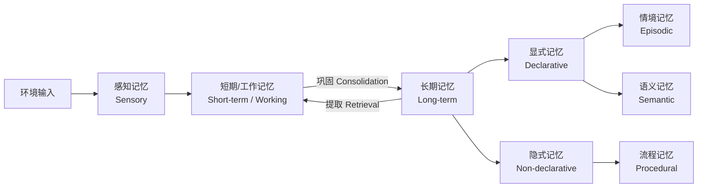

- **按存储时长**：感知记忆 → 短期/工作记忆 → 长期记忆（Atkinson-Shiffrin，1968）；
- **按内容性质**：显式记忆（可用语言描述、需有意识回忆）vs 隐式记忆（肌肉记忆式）；
- **按存储内容**：情境记忆（经历）、语义记忆（知识）、流程记忆（技能）。

Princeton 于 TMLR 2024 发表的 CoALA (Cognitive Architectures for Language Agents) 把这套分类平移到 Agent 世界，得到**四模块记忆框架**：Working / Episodic / Semantic / Procedural。这一框架已经成为学术界描述 Agent Memory 的通用坐标系。

---

## 二、Memory 是从什么时候开始出现的？——一条清晰的发展时间线

大模型 Memory 并非一夜之间冒出来。从"塞历史记录"到"独立工程子系统"，它走过了大约五个阶段：

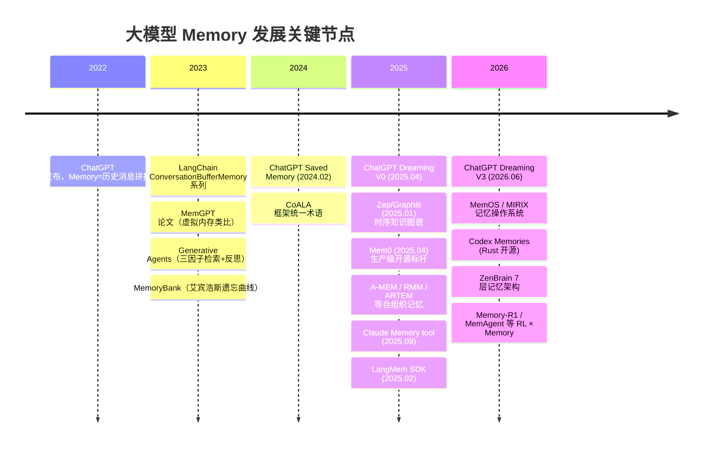

### 2.1 阶段一：朴素上下文（2022–2023）

第一代 ChatGPT 只能记住"当前对话历史"，Token 满了就截断。工程侧最早的应对是把历史消息**滑动窗口** + **摘要压缩**，代表实现是 LangChain 的 ConversationBufferWindowMemory / ConversationSummaryMemory / ConversationSummaryBufferMemory 三件套，以及基于 EntityMemory 抽取实体属性的原型。

### 2.2 阶段二：类操作系统的虚拟上下文（2023）

MemGPT (arXiv:2310.08560, UC Berkeley) 首次提出把 LLM context window 类比为 OS 的 RAM，让 Agent 通过"函数调用"自己在 Main Context 与 External Context 之间做数据换入换出。这一思路直接催生了后来商业化的 Letta 平台。

### 2.3 阶段三：生成式 Agent 与心理学启发（2023–2024）

Stanford 的 Generative Agents (UIST 2023) 让 25 个 NPC 在 Smallville 里社交，把 **Memory Stream + Retrieval + Reflection + Planning** 组合成第一个"能形成群体行为"的记忆系统，其三因子检索（Recency × Importance × Relevance）几乎成为后续所有 Agent Memory 的默认基线；MemoryBank (AAAI 2024) 引入艾宾浩斯遗忘曲线，让记忆有了"衰退"和"复习"。

### 2.4 阶段四：生产级独立子系统（2024–2025）

Mem0 (ECAI 2025) 把记忆管理抽象为 **ADD / UPDATE / DELETE / NOOP** 四操作，支持异步写入、多信号融合检索，在 LOCOMO 上超越 OpenAI Memory 26%、p95 延迟降低 91%；Zep/Graphiti (arXiv:2501.13956) 引入 **时序知识图谱**，为每条事实记录 valid_time + ingestion_time；A-MEM (NeurIPS 2025) 用 Zettelkasten 卡片笔记法让记忆"自组织"。同一时期，ChatGPT 上线 Saved Memory / Dreaming V0，Copilot / Gemini / 通义 / 豆包也陆续跟进消费级记忆功能。

### 2.5 阶段五：记忆操作系统与自我巩固（2025–2026）

MemOS 提出 **MemCube** 抽象，把记忆划分为 Plaintext / Activation / Parameter 三种形态并支持相互转换；MIRIX 用 6 组件多 Agent 架构做精细化路由；Anthropic Claude 2025.09 推出官方 Memory tool；OpenAI 在 2026.06 上线 **Dreaming V3**——首次把"闲时整理"作为架构一等公民，把记忆存储与对话日志彻底分离；Codex 则在开发者工具侧走了另一条 markdown + grep 的极简本地路线。ZenBrain 甚至给出了 7 层结构 + Simulation-Selection Sleep Loop，把神经科学的睡眠巩固机制搬到了 Agent 上。

至此，Memory 已经从"塞进 Prompt 的一段字符串"演化为一个具备完整生命周期、可评测、可治理、可跨模型热插拔的**独立工程子系统**。

---

## 三、为什么 Agent 需要记忆

在具体展开架构之前，先回答一个更本质的问题：Agent 为什么必须要有记忆？归纳起来至少有四点：

1. **持续学习能力**：LLM 参数是静态的，模型知识 cutoff 之后无法自主更新。记忆让 Agent 能从每次交互中沉淀经验、从错误中学习。
2. **上下文一致性**：拥有记忆才能保持长对话中的立场、事实和决策一致，不至于"上一秒说 Python，下一秒改口 TypeScript 却不解释"。
3. **个性化服务**：通过历史交互推断用户偏好、使用习惯、专业背景，从而给出"符合此人此刻此情境"的回答。
4. **多 Agent 协作**：多个 Agent 共同完成任务时，需要一份可审计、可共享、带溯源的公共记忆，才能协调分工而不重复劳动。

一句话：**Memory 是 Agent 从"能对话"迈向"有身份、能成长、可协作"的分水岭。**

---

## 四、大模型 Memory 的结构、原理和具体实现

### 4.1 一个统一的形式化视角

回到 §1，Memory 优化的目标可以写成：

$$
a^{\ast} = \arg\max_{a}\ P\!\bigl(a\mid q,\ \lambda^{\ast}(q;\mathcal{M});\ \theta\bigr)
$$

$$
\lambda^{\ast}(q;\mathcal{M}) = \arg\max_{\lambda\subseteq\mathcal{M}}\ \text{InfoDensity}(\lambda; q)\quad \text{s.t.}\ |\lambda|\le L_{\text{ctx}}
$$

其中 $\theta$ 是参数化记忆（模型权重）、$\lambda$ 是上下文记忆（从记忆库 $\mathcal{M}$ 中检索并注入的片段）、$L_{\text{ctx}}$ 是上下文窗口约束。**Memory 的一切工程都在优化 $\text{InfoDensity}$**——用最少的 token 传递最多的、与当前 query 相关的、与参数化记忆冲突最小的信息。

### 4.2 Forms × Functions × Dynamics 三维框架

Stanford / 复旦 / Oxford 联合发表的《Memory in the Age of AI Agents》系统综述提出一个更完整的三维分类：

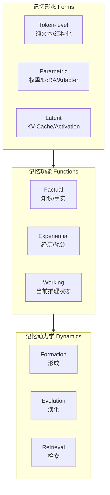

- **Forms（形态）**：Token-level 又可细分为 Flat（单条列表）/ Planar（图/表）/ Hierarchical（分层摘要）；Parametric 又分 Internal（微调进权重，如 ROME/MEMIT/MEND/MEMORYLLM）与 External（挂 LoRA/Adapter）；Latent 则包括 KV-Cache 生成、复用、变换等技术。
- **Functions（功能）**：Factual = 语义记忆，Experiential = 情境记忆，Working = 短期工作记忆。
- **Dynamics（动力学）**：Formation 关注写入/编码，Evolution 关注更新/合并/遗忘，Retrieval 关注召回/重排/融合。

任何一个具体系统，都可以映射到这个 3×3×3 的立方体中的一个或若干个格子。

### 4.3 Agent Memory 的通用结构

从工程视角看，一个"完整的 Agent Memory"通常由三层构成：

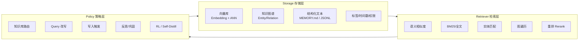

- **Storage** 决定了 Memory 能装什么、能装多少；
- **Retriever** 决定了 Memory 能被找回多少（下限）；
- **Policy** 决定了什么时候写、写什么、什么时候读、读几次（上限）。

三层缺一不可。业界共识是：**召回质量决定 Memory 的下限，Policy 决定 Memory 的上限**。

### 4.4 五个核心操作

对应人脑记忆学，Agent Memory 也提供五类操作：

1. **编码 Encode**：LLM 从对话/工具调用/观察中提取值得记忆的原子事实，做去重、结构化。
2. **存储 Store**：写入向量库 / 图 / 文本 / 参数（微调），并附加元数据。
3. **巩固 Consolidate**：短期记忆经过反思、聚类、抽象后形成长期记忆（对应 Dreaming V3、AutoDream、A-MEM Evolution）。
4. **提取 Retrieve**：三因子基线 = Recency × Importance × Relevance，进阶版加入时空、结构、权限、用户偏好等信号。
5. **遗忘 Forget**：艾宾浩斯衰减、TTL 过期、剪枝、权重降级；这一维度很多系统被低估。

### 4.5 主流实现方案的架构地图

下面把最有代表性的几套系统放在同一张地图里对照：

| 方案 | 存储模型 | 检索方式 | 写入策略 | 可解释性 | 场景侧重 |
|------|---------|---------|---------|---------|---------|
| **MemGPT / Letta** | Main + Archival，文件/向量 | Agent 自主 tool call | Agent 自主写入 | 中 | 单 Agent 长对话 |
| **MemoryBank** | 分层摘要 + 用户画像 | 关键词 + 语义 | 遗忘曲线控增长 | 中 | 陪伴型对话 |
| **A-MEM** | Zettelkasten 笔记网络 | Embedding + 链接传播 | 每次交互 create+link+evolve | 中高 | 多跳推理 |
| **Zep / Graphiti** | 时序知识图谱（Episode/Semantic/Community） | 语义 + BM25 + BFS | 实体去重 + 边失效 | 中 | 企业级时序推理 |
| **Mem0 / Mem0-G** | Vector + 内置 Entity（Graph 版加图） | 多信号融合 (Sem+BM25+Entity) | ADD/UPDATE/DELETE/NOOP | 低 | 生产级通用 |
| **MemOS** | MemCube (Plaintext + Activation + Parameter) | 混合检索 + 动态调度 | 三态互相转换 | 中 | 记忆操作系统 |
| **MIRIX** | 6 组件（Core/Episodic/Semantic/Procedural/Resource/KV） | Multi-Agent 路由 | Meta Manager + 子 Manager | 中高 | 精细化管理 |
| **OpenAI Dreaming V3** | Memory Chain（有向图 + 加权边） | 图遍历 + 权重匹配 | 后台 Idle Consolidation | 低 | 亿级 C 端消费者 |
| **OpenAI Codex Memories** | Markdown 文件 + git | 整文件加载 + grep | Rollout 抽取 + Global Consolidation | 高 | 开发者工具 |
| **Anthropic Claude** | CLAUDE.md + memory tool + 子 Agent | 文件读 + Compaction | 用户/Agent 手写 | 高 | Coding Agent |
| **NanoBot Dream** | MEMORY.md + git blame 计龄 | LLM 直读 | 每 2h 触发 Dream | 最高 | 极简可审计 |

### 4.6 三个具有代表性的实现细节

#### 4.6.1 MemGPT/Letta：虚拟内存分页

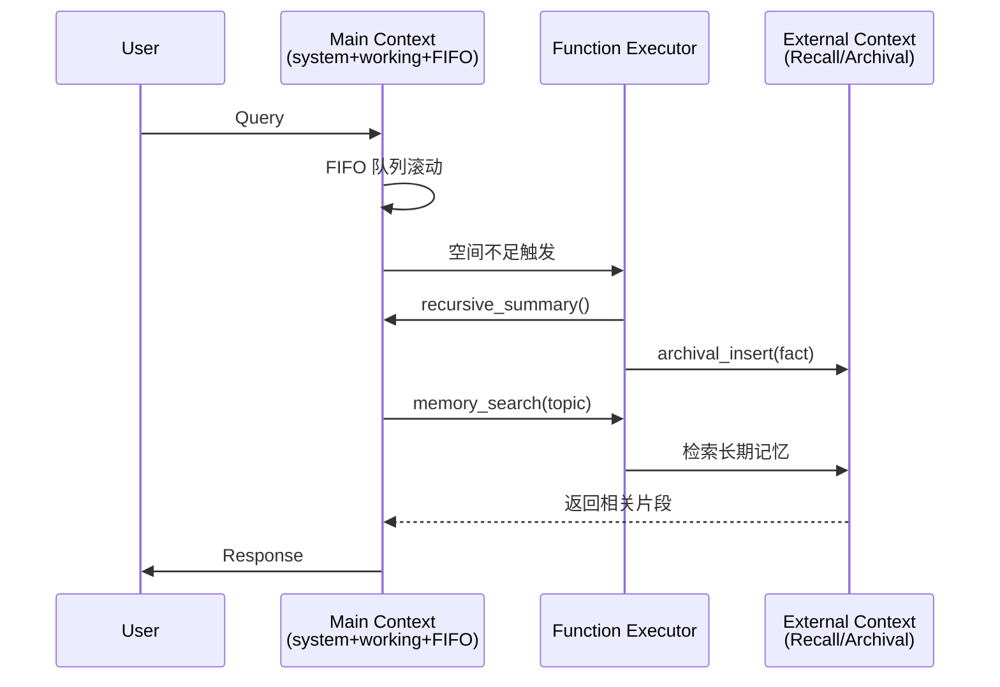

关键点：Working Context 保存关键事实和用户画像；FIFO 队列存滚动对话；当空间不足时，Agent 自己调用 tool 把老对话做递归摘要，或 archival_insert 写入长期区，需要时再 memory_search 拉回来。整套调度全部由 LLM 自主决策。

#### 4.6.2 Mem0：ADD / UPDATE / DELETE / NOOP 四操作

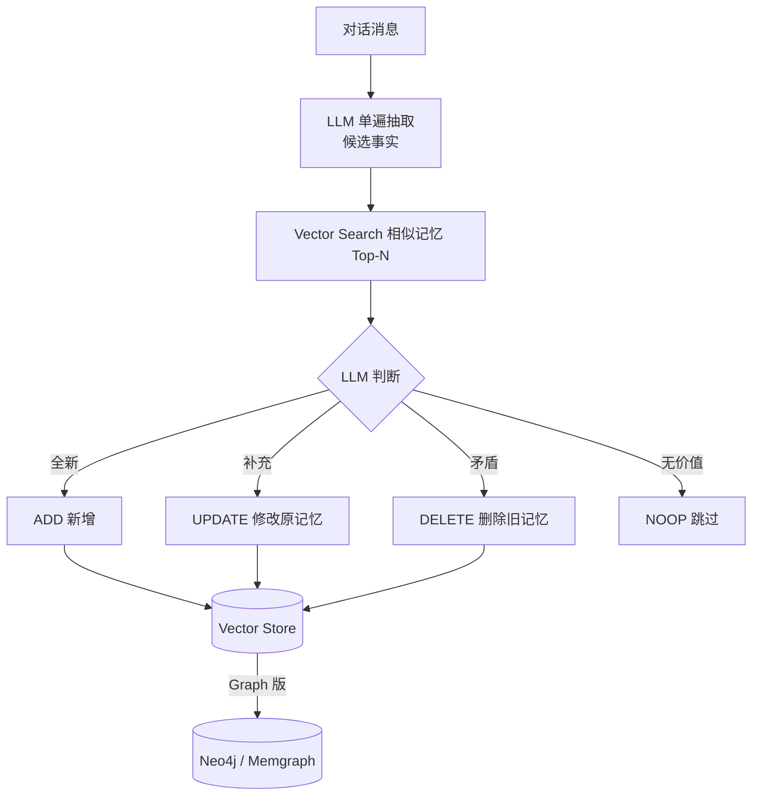

Mem0 的写入是"单遍抽取 + LLM 冲突裁判"，这是当前公认最实用的记忆更新范式。它以 6 个百分点的准确率代价换来了 91% 延迟下降和 90% token 节省。

#### 4.6.3 MemOS：MemCube + 三态转换

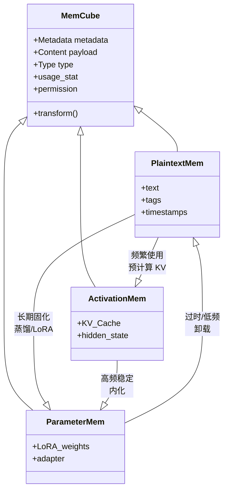

MemOS 首次把长期显式记忆（Plaintext）、短期隐式记忆（Activation/KV-Cache）、长期隐式记忆（Parameter/LoRA）统一在 MemCube 抽象下，并允许基于 usage 动态转换——这被认为是"记忆操作系统"层面的关键抽象。

---

## 五、Agent 是如何使用 Memory 的？

### 5.1 一次典型的推理循环

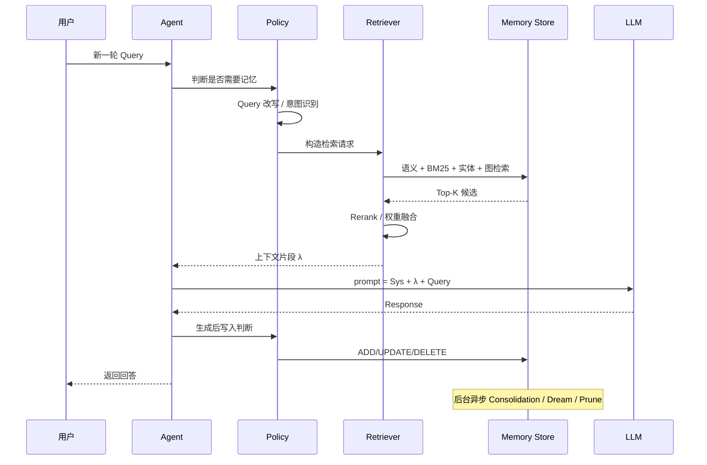

### 5.2 三条消费记忆的通道

Agent 在真正调用 LLM 前，通常会把三层作用域的记忆按优先级注入：

| 记忆层 | 作用域 | 例子 | 注入位置 |
|-------|-------|-----|---------|
| **领域/团队记忆** | 团队或业务域 | 编码规范、FAQ、领域知识库 | System Prompt 前置 |
| **用户记忆** | 单个用户 | 偏好、纠正历史、身份信息 | System Prompt 后段 |
| **会话记忆** | 单次会话 | 当前累积上下文、临时需求 | 消息序列内 |

三层之间可以有引用（用户记忆可以引用领域记忆的知识片段），但不建议合并——它们的生命周期、写入触发、删除语义完全不同。

### 5.3 一个关键推论：Memory 与模型弱耦合

$\lambda^{\ast}$ 的优化主要取决于 $q$（query）与 $\mathcal{M}$（记忆库）的匹配质量，而与底层 LLM 的 $\theta$ 只是弱相关。这带来两个工程上的好处：

- **模型可替换**：同一套 Memory 系统可以从 GPT 切到 Claude、Qwen、开源模型，无需重建；
- **迭代解耦**：模型升级不影响记忆系统，记忆改进也不需要重训模型。

因此，**Memory Agent 天然适合作为独立的中间件层**。这是 Mem0、Zep、LangMem、Tablestore OpenMemory 等产品都能横跨多家模型厂商的根本原因。

---

## 六、RAG 与记忆有什么区别？

在很多讨论中 RAG 与 Memory 会被混为一谈，但它们有本质差异：

| 维度 | 传统 RAG | Memory |
|------|---------|--------|
| 信息来源 | 预构建的静态知识库 | 用户交互中动态积累 |
| 生命周期 | 无状态，每次查询独立 | 有状态，跨会话累积 |
| 写入方 | 运维/离线管道 | Agent 运行时实时写 |
| 内容类型 | 文档/知识 | 知识 + 用户偏好 + 会话历史 + 经验 |
| 更新机制 | 定期离线重建索引 | 在线 ADD/UPDATE/DELETE + 巩固 |
| 检索特点 | 固定策略 | 动态策略 + 权限过滤 + 时序推理 |
| 冲突处理 | 通常返回多份让 LLM 融合 | 主动检测并消解矛盾 |
| 溯源需求 | 高（合规） | 高（审计 + 隐私） |

一句话：**RAG 解决"给定知识库，如何检索"；Memory 解决"在持续交互中，如何管理和利用不断增长的记忆"。** RAG 是 Memory 的一个组件（可作为检索通道），但不是全部。

---

## 七、OpenClaw、Hermes Agent、Claude Code 的 Memory 机制对比

这三者代表了 2025–2026 年"编码 Agent"记忆设计的三种典型思路。

### 7.1 三者的设计定位

- **OpenClaw**（阿里可观测团队）：面向个人办公场景的私有 Coding Agent，强调本地文件驱动 + Skill 生态 + 自定义 Ralph Loop；
- **Hermes Agent**：菜鸟系列自进化 Agent，通过 Skill 动态生成 + GRPO 强化学习实现"自进化"；
- **Claude Code**：Anthropic 官方 Coding Agent，围绕 CLAUDE.md + Sub-agent + Compaction 三策略做上下文工程。

### 7.2 记忆机制对比

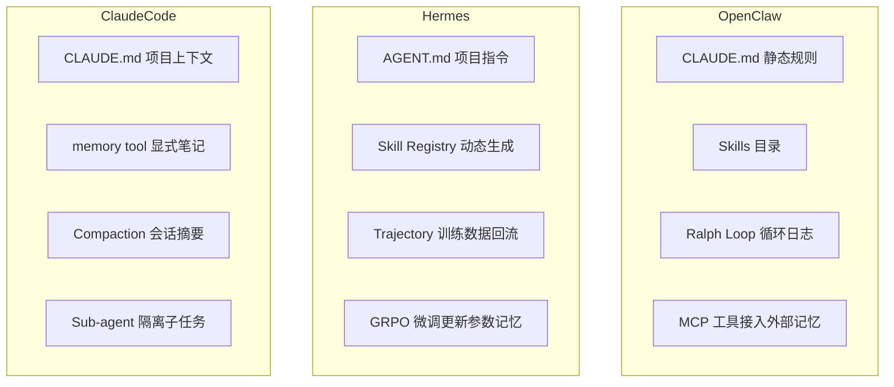

### 7.3 三者异同

| 维度 | OpenClaw | Hermes | Claude Code |
|------|----------|--------|-------------|
| **核心哲学** | 文件驱动 + 定时循环 + 用户完全掌控 | 自进化 + 参数化记忆 + 训练闭环 | 上下文工程 + 三策略 + 隔离性 |
| **静态记忆** | CLAUDE.md / Skill 描述 | AGENT.md / Skill 描述 | CLAUDE.md（分层发现） |
| **动态记忆** | Skill 产出的日志/文件 | Trajectory 存入训练库 | memory tool + note-taking |
| **记忆巩固** | 用户手工整理 | 强化学习梯度更新 | Compaction 摘要重启 |
| **多任务隔离** | 不同 Skill 目录隔离 | Skill 命名空间 | Sub-agent 独立 context |
| **参数化记忆** | 不涉及 | GRPO 训练进模型 | 不涉及 |
| **对模型透明度** | 全部可读可编辑 | Skill 可读，模型权重不透明 | 文件可读，Compaction 内部不可见 |
| **优势** | 极简、可审计、门槛低 | 能真正"变强"、把经验固化 | 三策略成熟、生态完整 |
| **短板** | 依赖用户维护、无参数演化 | 训练成本高、需要 GRPO 基础设施 | 缺少自动巩固环节 |

**共通点**：三者都拥抱了 **"手写 AGENTS.md 分层发现 + 显式笔记文件"** 的开放规范（已被 Linux Foundation Agentic AI Foundation 收编）。**分歧点**：Hermes 走"参数化 + 自进化"路线，OpenClaw/Claude Code 走"上下文工程"路线，代表了未来 Agent Memory 演进的两条主要分支。

---

## 八、当前各大 AI Agent 工具在记忆上分别是怎么处理的？

### 8.1 消费级产品

| 产品 | 上线时间 | 核心机制 | 特点 |
|------|---------|---------|------|
| **ChatGPT Saved Memory** | 2024.02 | 显式 `bio` 工具调用 | key-value 列表，需用户主动"记住" |
| **ChatGPT Dreaming V0** | 2025.04 | Reference Chat History | 后台按需检索，不做压缩 |
| **ChatGPT Dreaming V3** | 2026.06 | Memory Chain 有向图 + 4 小时闲时巩固 | 记忆与对话日志分离；主动浮出 |
| **Claude Memory tool** | 2025.09 | CLAUDE.md + Sub-agent + Compaction | 用户完全可控 |
| **Copilot Memory** | 2025 | 类似 Saved Memory | 与 M365 生态整合 |
| **Gemini Personal Context** | 2025 | 跨 Google 服务同步偏好 | 强隐私控制 |
| **通义千问 Chat Memory** | 2025 | 类似 Mem0 CRUD | 中文场景优化 |
| **豆包端侧融合** | 2025 | 端云协同 | 隐私敏感数据留端侧 |

### 8.2 开发者工具

| 工具 | 记忆位置 | 检索方式 | 特点 |
|------|---------|---------|------|
| **Cursor** | `.cursor/rules` + IDE event | 事件触发 + prompt 注入 | 细粒度采集 |
| **Aider** | AGENTS.md | 整文件读 | 极简 |
| **Codex CLI** | `~/.codex/memories/*.md` | grep + 整文件加载 | 两阶段管线 |
| **Claude Code** | CLAUDE.md（多级） | 分层发现 | Compaction |
| **Qoder / QoderWork** | `~/.qoderwork/awareness/*/MEMORY.md` + 每日日志 | 基于 memory_search 索引 | 具备 daily journal |
| **iFlow CLI** | Skill 生态 | grep + Skill 触发 | 轻量 |
| **OpenClaw** | 项目内文件 + Skill | 文件读 + MCP | 私有部署 |

### 8.3 开源框架

| 框架 | 记忆抽象 | 特色 |
|------|---------|------|
| **LangChain / LangMem** | ConversationXxxMemory / EntityMemory / semantic+procedural+episodic | 生态最全，可插拔 |
| **LlamaIndex** | Memory + IndexStore | 与文档索引融合 |
| **Mem0** | ADD/UPDATE/DELETE/NOOP + Vector+Graph | 生产级标杆 |
| **Zep / Graphiti** | 时序知识图谱 | 企业时序推理 |
| **Letta** | Main + Archival + Recall | OS 类比原型 |
| **A-MEM** | Zettelkasten 笔记网络 | 多跳推理最强 |
| **MemOS / MIRIX** | 记忆操作系统 | 多形态、多组件 |
| **NanoBot Dream** | MEMORY.md + git | 极简可审计 |
| **MemoryScope / ChatDB** | 阿里云/字节等国内实现 | 中文场景 + 结构化查询 |
| **Tablestore OpenMemory MCP** | 阿里云表格存储 + MCP 协议 | Serverless、混合检索、跨 AZ 高可用 |

**共识**：写入侧统一收敛到"LLM 结构化提取 + 冲突裁判"；存储侧向量+结构化索引成为标配；读取侧"按需召回 + LLM 二次整合"取代"全量注入"。

---

## 九、MEMORY.md 是怎么来的？——文件式记忆的兴起

### 9.1 历史脉络

MEMORY.md 并不是某一家产品发明的，它是一场"共识演化"：

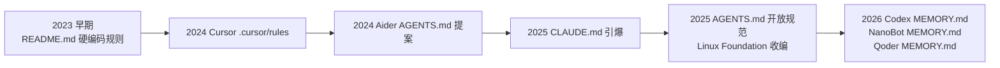

在 Linux Foundation 的 Agentic AI Foundation 下，**AGENTS.md** 成为跨工具的开放标准（Cursor、Aider、Codex、Jules、Claude Code 都支持）。它承载**静态、稳定、由用户/团队维护**的项目指令；而 **MEMORY.md** 则被广泛用来承载**动态、由 Agent 自动写入**的经验积累。两者互补：AGENTS.md 定"做什么"，MEMORY.md 记"上次做到哪 / 学到了什么"。

### 9.2 为什么是 Markdown 文件，而不是数据库？

Codex 团队的选择很有代表性：

- **Unix 哲学**：markdown 文件 + 文本搜索足够；引入 vector store 增加运维复杂度；
- **可读、可 grep、可 diff、可 git blame**：任何工程师都能打开文件看 Agent 记住了什么；
- **天然可版本化**：`cd ~/.codex/memories && git init` 就能追踪变化；
- **规模可控**：单机 codex_home 场景下几 MB 上限很难碰到；
- **对 Coding Agent 更友好**：文件名/函数名/路径在代码场景下比语义相似度更值钱。

对 Coding 场景来说，**语义检索经常召回"看起来像但不是"的东西**，而 grep 精确匹配反而更靠谱。这是 Codex 反潮流选择"整文件加载 + grep"的核心理由。

### 9.3 MEMORY.md 与其他形态并非对立

值得强调：MEMORY.md 是"文件式 Plaintext Memory"的一个典型代表，但记忆并不都需要写进 markdown。对话式产品（ChatGPT）用图谱更合适，企业级产品（Zep）用时序知识图谱更合适。**选文件还是选数据库，本质是"用户/Agent 谁负责编辑"和"是否需要图/时序推理"这两条轴的取舍**：

- 用户可编辑 + 精确匹配 → 文件（MEMORY.md、AGENTS.md）
- 全自动 + 时序推理 → 图谱（Dreaming V3、Zep）
- 全自动 + 通用检索 → 向量库（Mem0）

---

## 十、MEMORY.md 的写入和读取流程

以 OpenAI Codex 的两阶段管线为例，这是当前设计最完整的开源实现。

### 10.1 双层结构

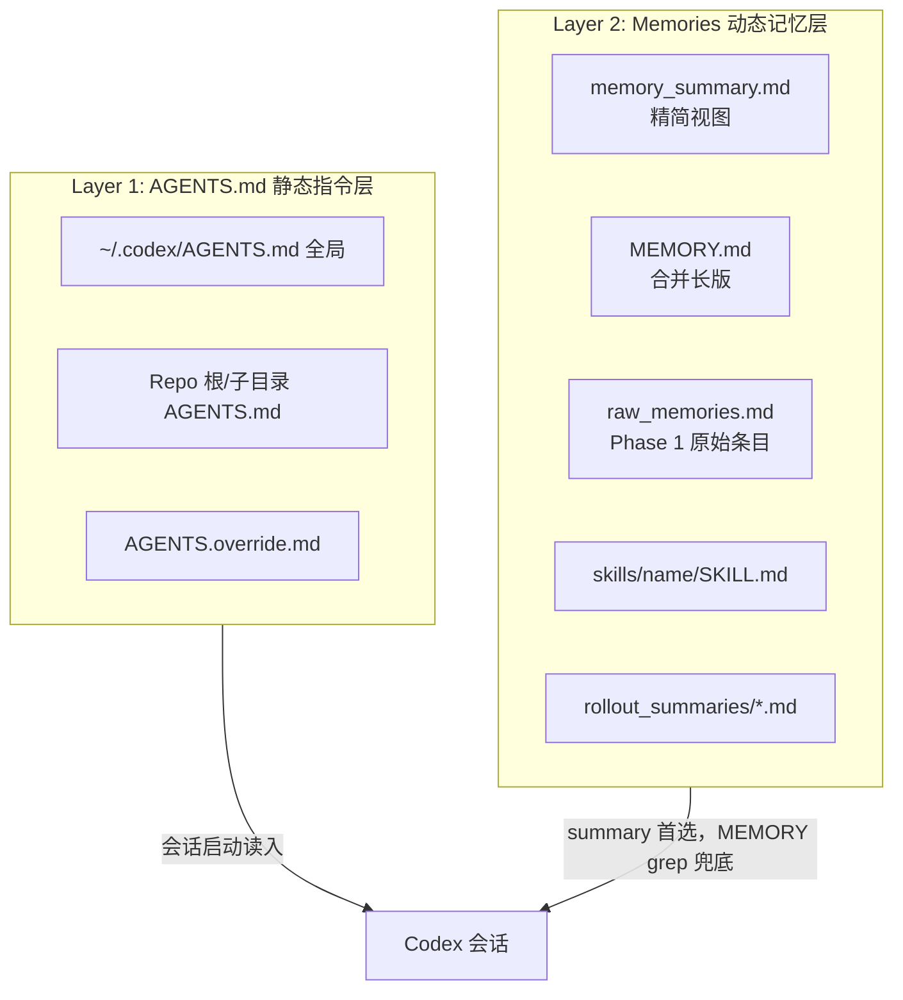

### 10.2 写入流程（两阶段异步管线）

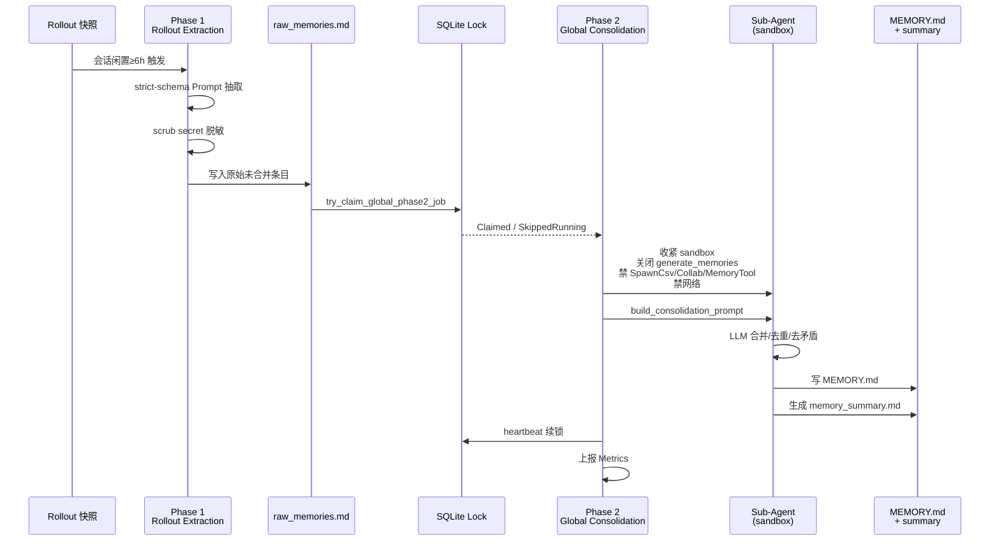

七步严格线性顺序（`phase2.rs`）：**Claim 锁 → 构造 sandbox 子 Agent 配置 → 拉取输入选择 → 同步文件系统 → Spawn Sub-agent → Heartbeat 循环 → 上报 Telemetry**。任何一步失败即退出，避免复杂状态机。

### 10.3 读取流程

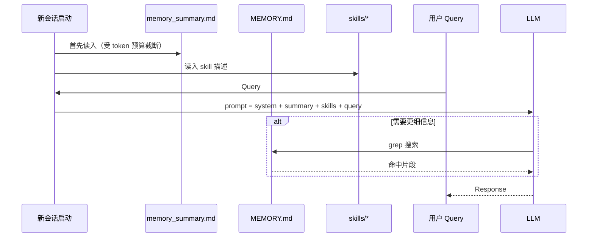

关键设计：**分级 cache**——summary 是 hot path（低 token 成本、每次 session 必读）；MEMORY.md 是 warm path（按需 grep）。**召回不走向量而走 grep**，因为对开发者场景，精确字符串匹配远比语义相似度更稳。

### 10.4 在 Agent 生命周期中的作用

| 阶段 | MEMORY.md 的角色 |
|------|-------------------|
| **冷启动** | 提供"我是谁 / 项目是什么 / 上次做到哪" |
| **单次任务** | 通过 grep 精准提供历史决策与踩坑记录 |
| **任务结束** | Rollout 存档，作为下次 Phase 1 的输入 |
| **闲时** | 触发 AutoDream/Consolidation，去重合并去矛盾 |
| **跨设备** | git 同步（Codex 目前仅本地，Dreaming V3 走账号） |

---

## 十一、设计 Agent Memory 时需要考虑什么？

综合各系统实践，可以归纳为八个核心维度：

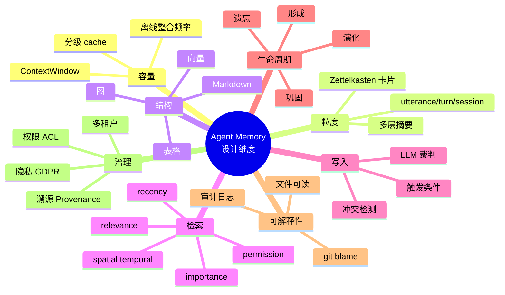

要点提示：

- **写入 ≠ 堆积**：遗忘/剪枝与存储同等重要（MemoryBank 艾宾浩斯曲线、A-MEM Prune、AutoDream 去矛盾）；
- **多信号融合**：三因子（Recency × Importance × Relevance）是基线，加时空/结构/权限收益边际递增；
- **Agent 应主动管理记忆**：从被动 tool call 到主动 self-managed（A-MEM/ARTEM），"agentic 化"是趋势；
- **结构 > 平铺**：链接、图、层级带来非线性收益（Dreaming V3 memory chain、G-Memory 三层图）；
- **离线 Consolidation**：写入是热路径（低延迟），巩固是冷路径（高质量），必须解耦；
- **权限与溯源**：多用户 Agent Team 场景下，Private/Shared 双层 + ACL + Provenance 是必需（Collaborative Memory ICML 2025）；
- **应用级评测**：LoCoMo/LongMemEval 等通用基准测不出你业务的真实性能，各团队仍需自建评测集。

---

## 十二、Agent Memory 的分层结构

### 12.1 短期 / 中期 / 长期的三段式

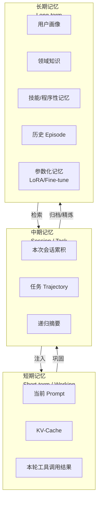

- **短期**（KV-Cache、当前 Prompt）：容量小、访问快、生命周期短；
- **中期**（会话记忆、任务轨迹）：跨轮次但不跨 session，负责本次任务的连贯性；
- **长期**（用户画像、领域库、技能、参数）：跨会话、跨天、跨版本，是 Agent 的"人格"所在。

### 12.2 为什么要分层？

- **成本梯度**：短期贵而快，长期廉但检索延迟高，分层可以做冷热分离；
- **信息密度需要蒸馏**：从"完整对话"到"事实"到"洞察"是渐进抽象，一层完成不了；
- **权限/隐私边界不同**：短期本地、中期用户可见、长期可能需要审计；
- **触发条件不同**：短期滑动窗口、中期任务结束时归档、长期后台异步巩固；
- **符合认知科学**：人脑 STM/LTM 分层结构本就有效。

### 12.3 一种更细的四层分家

Anthropic Claude 用户实践中提出更细分家法（"别让 AI 什么都记"）：

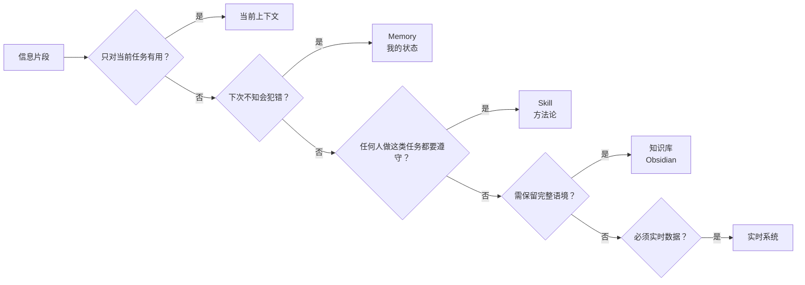

- **当前上下文**：这次怎么做；
- **Memory**：下次从哪继续（我的状态）；
- **Skill**：这类任务怎么做好（通用方法论）；
- **知识库**：未来怎么理解（完整语境）；
- **实时系统**：现在到底是什么（动态事实）。

这五类分家原则一旦确立，就避免了"Memory 越加越多、越加越乱"的常见困境。

---

## 十三、Agent Memory 的最佳实践

综合工业界与学术界共识，可以总结出以下十条最佳实践：

1. **先文档后编码**：AGENTS.md/CLAUDE.md/PROJECT_MANUAL 是最基础也最有效的记忆——静态指令永远比 AI 猜测靠谱。
2. **端到端评测优先**：LoCoMo / LongMemEval / BEAM / AMA-Bench 建立多维度指标（准确率 + 延迟 + token 成本 + 用户满意度），单点优化容易走偏。
3. **写入用 CRUD + LLM 裁判**：Mem0 的 ADD/UPDATE/DELETE/NOOP 是工程最佳范式，避免机械追加也避免过度删除。
4. **读取多信号融合**：语义 + BM25 + 实体匹配 + 时空 + 权限，三条以上并行 + rerank 融合远优于单一策略。
5. **离线 Consolidation**：闲时/夜间/N 小时后台整理，把"写入热路径"和"整理冷路径"分开；AutoDream/Dreaming V3/ZenBrain 是范例。
6. **分层缓存**：memory_summary（hot）+ MEMORY.md（warm）+ raw_memories（cold），控制注入量。
7. **Memory / Skill / 知识库 / 实时系统 分家**：见 §12.3；每类信息各归其位。
8. **Sub-agent 隔离**：详细搜索 context 隔离在子 Agent，主 Agent 只处理精炼摘要，规避 context rot。
9. **权限与溯源**：企业场景 Private/Shared 双层 + Provenance；每条记忆可追溯来源、时间、贡献者。
10. **CI 层文档一致性**：仅靠 Prompt 约束 AI 更新文档不够；应在 CI 中做代码-文档一致性检查。

**一个可复现的启动清单**（源自 Cainiao Agent Memory 项目 Harness Engineering 实践）：

- ✅ 建立 AGENTS.md（入口导航）
- ✅ 建立 PROJECT_MANUAL.md（工程说明书，AI 每次改代码后同步）
- ✅ 建立 API_MANUAL.md（跨项目对齐的接口文档）
- ✅ 引入 Sutee Spec Kit：`/requirement` → `/design` → `/task` → `/implement` 四命令
- ✅ 建立 analyze-test / auto-repair Agent Skill 闭环
- ✅ 让 AI 能自己启动服务、curl 接口、读日志（运行时可读性）
- ✅ 端到端评测数据集（LOCOMO / 自有）+ 定期跑

---

## 十四、Agent Memory 当前的问题和不足

即使 2026 年的技术已经比 2023 年成熟了一个数量级，但仍有五类核心问题没有被完美解决：

1. **时序抽象规模化**：Mem0 在 BEAM 从 1M 到 10M 的跳转中丢了约 25% 性能。当历史事实到达十万条以上，"三个月前 vs 昨天"的时序推理仍难以保证准确。
2. **跨会话身份解析**：所有方案默认稳定 user_id。匿名会话、多设备、混合认证一旦打破这个假设，记忆就"错位"。
3. **记忆过时**：一条被高频检索的高置信度记忆（用户雇主）在用户跳槽后变成"高置信度的错误"。系统难以自动识别"从正确变过时"的时刻。
4. **AI 对自己代码/记忆过于宽容**：Cainiao Agent Memory 的经典教训——AI 自己设计的方案通过功能测试却在生产暴露严重缺陷。解药是引入独立评估者（Anthropic 分离生成/评估 Agent）。
5. **应用级评测缺失**：LoCoMo 上 92.5 不代表在你的医疗/法律/金融负载上一样表现。目前评测集偏合成、缺垂类、缺中文，各家仍要自己打评测。
6. **隐私与合规不透明**：Dreaming V3 的用户"删对话不删 memory"、企业场景员工聊到内部代号仍会写入个人账号——这些都是实际部署中的暗礁。
7. **Context Rot / Lost-in-the-middle**：即使窗口扩到 1M，模型对上下文中段信息的利用率显著低于首尾（Liu et al. 2023）。塞得多不等于用得上。
8. **上下文不一定被信任（CL-bench）**：即使把所有必需信息都放进 context，10 个前沿大模型平均也只解决 17.2% 任务，GPT-5.1 只 23.7%。**Prompt is not a learning mechanism**——纯 in-context 学习并非万能。

---

## 十五、Agent Memory 的未来发展趋势

结合《Memory in the Age of AI Agents》综述、MemOS 的商业野心、以及 Anthropic/OpenAI 的产品动向，可以看到六条清晰的演进方向：

### 15.1 从上下文记忆走向参数化记忆

Token-level 记忆是 2023–2025 年的主战场，但 **Parametric Memory**（把记忆固化为 LoRA/Adapter/权重）正在快速崛起：ROME、MEMIT、MEND、MEMORYLLM、Mem-α 等工作已经证明可行。MemOS 更是明确把 Plaintext ↔ Activation ↔ Parameter 三态转换设计为一等公民。**未来 5 年，记忆会像 CPU 缓存一样分级——热的进 KV-Cache，稳定的固化到参数**。

### 15.2 记忆操作系统与市场化

MemOS 的愿景是把记忆抽象为**跨平台可调度的一等系统资源**，甚至可以进入市场交换。这意味着 Agent 记忆将从"每家自建"走向"标准化协议 + 记忆商店"（类似 App Store）。MCP 协议的普及是这条路径的先导。

### 15.3 RL × Working Memory 的深度融合

大量 2026 年论文在做"用 RL 训练 Agent 的记忆策略"：MEM1、MemAgent、Sculptor、ReSum、DeepAgent、SUPO、MemSearcher、IterResearch、Context-Folding、FoldAct、Memory-R1、Mem-α、MemBuilder、AgeMem、SUMER。核心思路是把"记什么、忘什么、什么时候检索"建模为 POMDP，用 RL 学出最优策略。**Policy 层将成为 Memory Agent 的核心竞争力。**

### 15.4 睡眠/做梦范式成为标配

AutoDream (Anthropic 2026) + ZenBrain 首次把"神经科学睡眠巩固"搬到 Agent 上。Dreaming V3 也是这条路径。未来 Agent 会普遍有"清醒态"（低延迟写入）+ "睡眠态"（离线巩固）双模式，且可能引入 Two-Factor Synaptic Model、间隔重复 FSRS、Bayesian Confidence Propagation 等更精细的机制。

### 15.5 Memory 与 Skill 的合流

安亭"别让 AI 什么都记"实践指出：Memory 记状态、Skill 记方法。Hermes Agent 的自进化更进一步——Skill 本身就是可动态生成、可训练的"程序性记忆"。**未来 Skill = 显式化的 Procedural Memory**，Memory 与 Skill 会在数据模型上统一。

### 15.6 端云协同 + 人格数字生命

豆包端侧融合、Gemini Personal Context 已经显示：**敏感记忆留端侧、协同记忆上云**是消费级产品的必然路径。再进一步，随着记忆越来越深、越来越个性化，Agent 将逐步走向"人格化"——**Memory is Identity**。这也是 2026 年"关于 Agent Memory 的一些思考"作者提出的核心洞察：**记忆是数字生命的基石**。

---

## 十六、总结

回到本文的主线：

- **LLM 是无状态的**，所有记忆最终都要落到"如何为下一次 forward 构造最合适的上下文" $\lambda^{\ast}$；
- Memory 优化的核心目标是 **InfoDensity** 最大化，且与底层模型**弱耦合**——Memory Agent 是天然的可插拔中间件；
- 从 **上下文拼接 → OS 类比 → 生成式 Reflection → 生产级 CRUD → 时序知识图谱 → 记忆操作系统** 的演进路径清晰可见；
- 主流工程范式已经收敛到 **"LLM 结构化提取 + 冲突裁判 + 多信号融合检索 + 离线 Consolidation + 分层 cache"**；
- Coding Agent 场景以 **AGENTS.md + MEMORY.md + Sub-agent + Compaction** 四件套为主流；C 端产品以 Memory Chain / 图谱为主流；
- 分家原则（Memory / Skill / 知识库 / 实时系统）是防止记忆混乱的关键；
- 未来 5 年的 Memory 将从 Token-level 走向 Parametric，从人工设计走向 RL 驱动，从存储走向操作系统，从工具能力走向数字生命的基石。

**记忆不是把过去塞进上下文，而是让 Agent 拥有一份可演化、可审计、可协作的认知状态。** 谁能把这套系统做得更好，谁就赢在下一阶段的 Agent 能力分水岭上。

---

## 参考文档

**综述与经典论文**

- [CoALA: Cognitive Architectures for Language Agents (TMLR 2024)](https://arxiv.org/abs/2309.02427)
- [Generative Agents: Interactive Simulacra of Human Behavior (UIST 2023)](https://arxiv.org/abs/2304.03442)
- [MemoryBank: Enhancing LLMs with Long-Term Memory (AAAI 2024)](https://arxiv.org/abs/2305.10250)
- [MemGPT: Towards LLMs as Operating Systems](https://arxiv.org/abs/2310.08560)
- [Zep: A Temporal Knowledge Graph Architecture for Agent Memory](https://arxiv.org/abs/2501.13956)
- [A-MEM: Agentic Memory for LLM Agents (NeurIPS 2025)](https://arxiv.org/abs/2502.12110)
- [Mem0: Building Production-Ready AI Agents with Scalable Long-Term Memory](https://arxiv.org/abs/2504.19413)
- [Memory in the Age of AI Agents (2025 Survey)](https://arxiv.org/abs/2512.13564)
- [A Survey on the Memory Mechanism of LLM Agents (ACM)](https://dl.acm.org/doi/10.1145/3748302)
- [Lost in the Middle: How Language Models Use Long Contexts (TACL 2024)](https://arxiv.org/abs/2307.03172)
- [ReAct: Synergizing Reasoning and Acting in Language Models](https://arxiv.org/abs/2210.03629)
- [Agentic Context Engineering (ACE): Evolving Contexts for Self-Improving Language Models](https://arxiv.org/abs/2510.04618)
- [Agent-Memory-Paper-List (GitHub 汇总)](https://github.com/Shichun-Liu/Agent-Memory-Paper-List)
- [一口气读完 Agent Memory 的 21 篇核心论文（AgentGuide）](https://github.com/adongwanai/AgentGuide/blob/main/resources/agent/papers/agent_memory)

**官方文档与工程博客**

- [How Claude Code remembers your project (Claude Code Memory 官方文档)](https://code.claude.com/docs/zh-CN/memory)
- [Effective context engineering for AI agents (Anthropic)](https://www.anthropic.com/engineering/effective-context-engineering-for-ai-agents)
- [ChatGPT Memory FAQ (OpenAI Help Center)](https://help.openai.com/articles/8590148-memory-faq)
- [Memory and new controls for ChatGPT (OpenAI)](https://openai.com/index/memory-and-new-controls-for-chatgpt/)
- [OpenAI Codex Memories](https://developers.openai.com/codex/memories)
- [OpenAI Codex Rust source — codex-rs/core/src/memories/](https://github.com/openai/codex/tree/main/codex-rs/core/src/memories)
- [LangGraph Persistence (Checkpointer)](https://docs.langchain.com/oss/python/langgraph/persistence)
- [LangGraph Add Memory](https://docs.langchain.com/oss/python/langgraph/add-memory)
- [Mem0 官网](https://mem0.ai/)
- [Mem0 GitHub](https://github.com/mem0ai/mem0)
- [Zep 官网 - Temporal Knowledge Graph for Agent Memory](https://www.getzep.com/)
- [Letta（原 MemGPT）GitHub](https://github.com/letta-ai/letta)
- [Letta 官网](https://www.letta.com/)
- [长期记忆（Agent Memory）- 阿里云 PolarDB 文档](https://help.aliyun.com/zh/polardb/polardb-for-mysql/polardb-agent-memory)
- [Agentic AI 基础设施实践经验系列（三）：Agent 记忆模块的最佳实践 - AWS 中国博客](https://aws.amazon.com/cn/blogs/china/agentic-ai-infrastructure-deep-practice-experience-thinking-series-three-best-practices-for-agent-memory-module/)
- [AGENTS.md 开放规范](https://agents.md/)
- [Hermes Agent GitHub (Nous Research)](https://github.com/nousresearch/hermes-agent)
- [Hermes Agent 官网](https://hermes-agent.org/)
- [Memory overview - OpenClaw Docs](https://docs.openclaw.ai/concepts/memory)
- [Memory Bank - Cline documentation](https://docs.cline.bot/best-practices/memory-bank)

**社区与解读文章**

- [万字解析 Agent Memory 实现（知乎）](https://zhuanlan.zhihu.com/p/1940091301249909899)
- [AI Agent 记忆技术浅析（知乎）](https://zhuanlan.zhihu.com/p/19511307732)
- [Agent Memory：从概念到架构的完整解析（腾讯云）](https://cloud.tencent.com/developer/article/2657648)
- [AI Agent memory 是什么？（博客园）](https://www.cnblogs.com/imust2008/p/19489547)
- [Agent Memory 产品解决方案概述（掘金）](https://juejin.cn/post/7533181176179081235)
- [AI Agent 记忆系统：从短期到长期的技术架构与实践（阿里云开发者社区）](https://developer.aliyun.com/article/1710635)
- [一文看懂 Agent 的 9 种记忆系统（PPIO）](https://ppio.com/blogs/post/yi-wen-kan-dong-agentde-9chong-ji-yi-xi-tong-aizhuan-lan)
- [深入理解 Claude Code 项目记忆机制（知乎）](https://zhuanlan.zhihu.com/p/2013213227740325799)
- [The Complete Guide to CLAUDE.md (Medium)](https://medium.com/@bijit211987/the-complete-guide-to-claude-md-memory-rules-loading-and-cross-tool-compression-97cc12ed037b)
- [CLAUDE.md, .cursorrules, AGENTS.md — How to Give Context to AI](https://sotaaz.com/post/ai-coding-rules-guide-en)
- [OpenClaude: Build a Claude Code Agent with Long-Term Memory (Vectorize)](https://hindsight.vectorize.io/blog/2026/03/23/claude-code-telegram)

---

