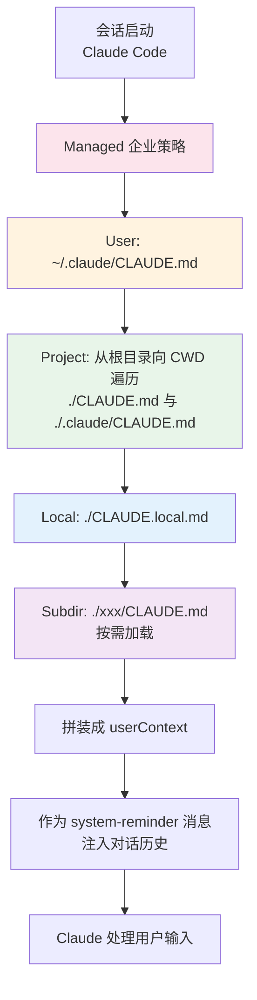
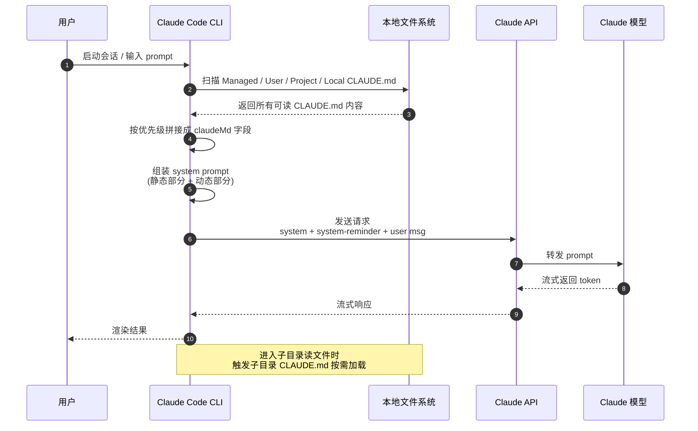
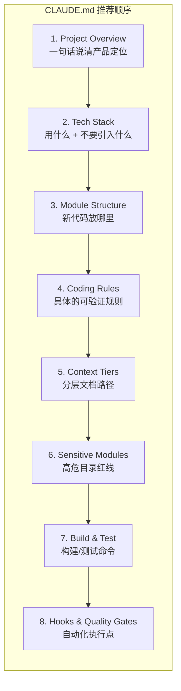
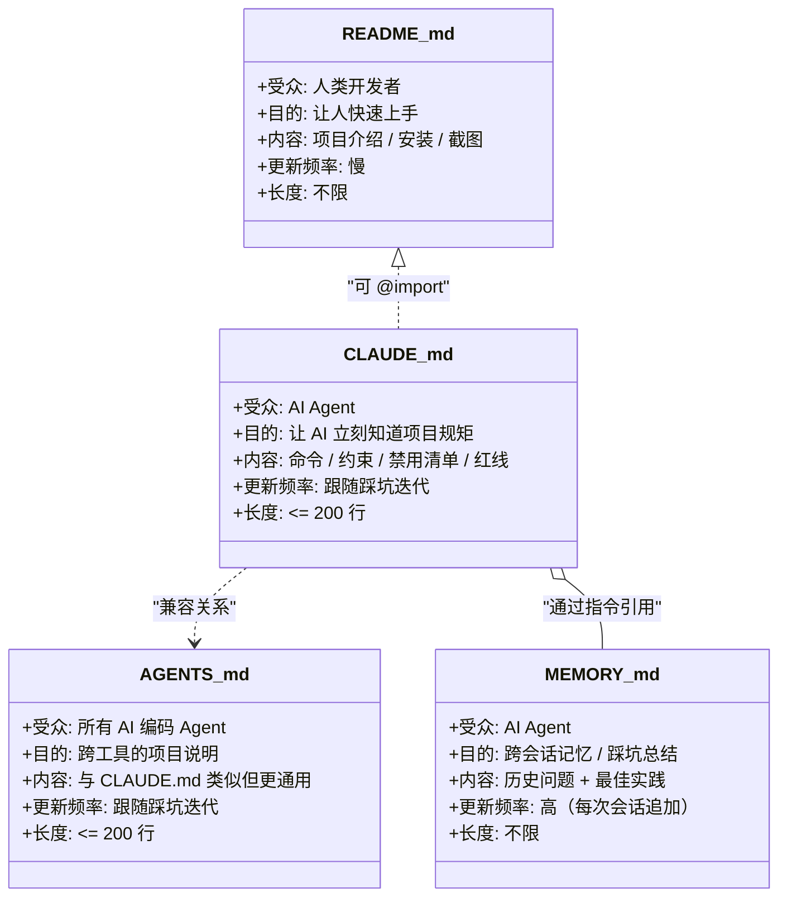
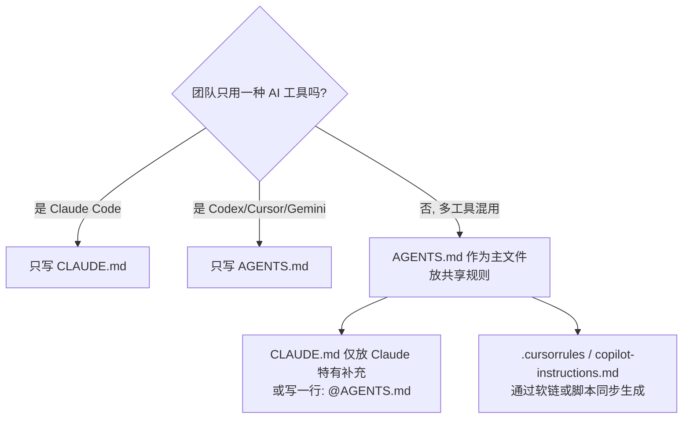
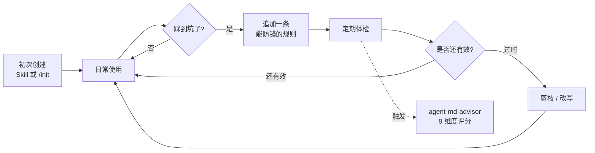

## 一句话先说清楚

CLAUDE.md 是放在仓库（或用户主目录）下、由 Claude Code 在每次会话启动时自动加载的项目说明文件。它本质上不是给人看的 README，而是写给 AI 的"协作约定"——一份让 Claude 进入项目以后就能立刻知道"用什么栈、怎么跑、改哪里要小心、什么是不能做的事"的工程契约。

写得好，可以把 Claude 的错误率从约 41% 压到 3% 左右；写得差，反而会因为上下文被废话填满，让真正重要的约束被淹没。

下面这篇文章会把 CLAUDE.md 的来龙去脉拆开讲清楚：背景、加载原理、应该写什么、怎么写、怎么和 AGENTS.md/README.md/MEMORY.md 配合、各个 AI 工具的支持情况，以及怎么持续保鲜。中间穿插几张 Mermaid 图，方便你抓住整体脉络。

---

## 一、CLAUDE.md 是什么

CLAUDE.md 是 Claude Code（Anthropic 推出的命令行 AI 编程助手）专属的项目级上下文文件，文件格式是 Markdown，文件名固定。Anthropic 官方文档对它的描述非常直接：

> "a special file that Claude reads at the start of every conversation."
> ——给 Claude 在每次对话开始时读取的特殊文件。

它通常承载这些"代码本身无法说明"的项目知识：常用 build/test/lint 命令、代码风格偏好、目录结构、新代码放哪、哪些目录不能动、团队的提交规范、踩过的坑等等。

CLAUDE.md 在以下几个层级都可以存在，作用域逐层叠加：

| 文件路径 | 作用域 | 典型用途 |
| --- | --- | --- |
| `/etc/claude-code/CLAUDE.md`（Linux）或 `/Library/Application Support/ClaudeCode/CLAUDE.md`（macOS） | 企业级 / Managed | 组织硬性合规、安全策略，用户不能 opt-out |
| `~/.claude/CLAUDE.md` | 用户级 | 个人偏好，所有项目生效（如"回复用中文"） |
| `./CLAUDE.md` 或 `./.claude/CLAUDE.md` | 项目级 | 团队共享，进入 git |
| `./CLAUDE.local.md` | 项目本地级 | 个人项目偏好，gitignore |
| `./subdir/CLAUDE.md` | 子目录级 | 仅 Claude 读取该目录文件时按需加载 |

简单记一句话："越靠近 CWD(**Current Working Directory**)，优先级越高；越接近团队，越要进 git。"

---

## 二、为什么会出现 CLAUDE.md

2026 年以前，AI 编程的常态是这样：

- 每开一个新会话，都要花五分钟解释项目"这是 Java 17、用 SOFABoot、缓存层是 ZCache 不是 Redis"；
- Claude 写出来的代码风格各异，时而 Tab 时而空格，时而 camelCase 时而 snake_case，因为它没有任何项目惯例输入；
- 关键的禁用项（"不要引入 Jackson，我们用 FastJSON"）一旦没在 prompt 里点出来，AI 会按训练数据里的"主流最佳实践"自作主张地往里塞依赖；
- 在 monorepo 里，AI 会在错误的模块里建文件，因为它不知道"facade 接口必须放在 app/biz/facade"。

Anthropic 的工程团队意识到，模型本身能力（Capability）已经够强，但缺少"项目本地知识"（Project-local Knowledge）。如果让模型每次靠 RAG 去搜，又会带来一致性和延迟问题。他们最终选择了一个工程上极简的方案：**在会话启动时，把根目录的 CLAUDE.md 作为 system-reminder 注入到上下文，让模型像读 README 一样读一遍**。

这种"项目说明书"的模式很快被验证有效，并被 OpenAI Codex 抽象成开放标准 `AGENTS.md`，社区里也长出了 `.cursorrules`、`.github/copilot-instructions.md`、`.windsurfrules` 等等同类文件。CLAUDE.md 是这股潮流里出现最早、最有代表性的那一个。

可以把它的诞生背景概括为一句话：**模型能力提上来了，剩下的瓶颈是把"项目里只有人知道的事"系统化地告诉模型。**

---

## 三、CLAUDE.md 官方解释

Anthropic 在 `code.claude.com/docs/en/best-practices` 中明确指出：

- CLAUDE.md 是一份建议性（advisory）指令文件，不是硬约束；
- Claude 在大约 80% 的场景下会遵循 CLAUDE.md 的内容；
- 超过 200 行后，遵循率会显著下降，因为关键规则会被噪音稀释；
- 应该把它当代码一样维护：审查、剪枝、迭代；
- 真正确定性的护栏（"绝不允许直接写生产配置"），需要靠 Hook 和 Managed Settings 来实现，而不是靠 CLAUDE.md。

官方推荐的最小范例如下：

```markdown
# Code style
- Use ES modules (import/export) syntax, not CommonJS (require)
- Destructure imports when possible (eg. import { foo } from 'bar')

# Workflow
- Be sure to typecheck when you're done making a series of code changes
- Prefer running single tests, and not the whole test suite, for performance
```

这份范例只有八九行，但每一条都"可被 Claude 验证、可被你 review"——这正是 Anthropic 对 CLAUDE.md 的核心定位。

---

## 四、加载和使用原理

要写好 CLAUDE.md，必须先理解它"是怎么进到模型的上下文里去的"。否则你写的每一行都像在做无源之水。

### 4.1 加载顺序（优先级递增）

Claude Code 启动时，会从最广的作用域往最具体的方向扫描所有 CLAUDE.md，依次拼接进 system prompt。后加载的优先级更高，因此可以覆盖前面的设置。



文件之间是**追加（concat）而不是覆盖**——也就是说，全局 `~/.claude/CLAUDE.md` 里写"用中文回复"，项目 `./CLAUDE.md` 不会把它覆盖掉，两条都会进上下文，只是当两条规则冲突时，靠近 CWD 的项目级规则的"优先级权重"更高，Claude 在 attention 上会更倾向遵守。

### 4.2 注入到 Prompt 的真实位置

Claude Code 内部把整段 prompt 切成"静态部分"和"动态部分"，CLAUDE.md 的内容属于动态部分，会被包装成一段 `<system-reminder>` 标签的 user message，挂在对话历史最前面，类似这样：

```
<system-reminder>
As you answer the user's questions, you can use the following context:
# claudeMd
Contents of ./CLAUDE.md (project instructions, checked into the codebase):

# CLAUDE.md — your project rules ...

# currentDate
Today's date is 2026-06-25.
</system-reminder>
```

下面这张时序图描述了完整的会话启动过程：



### 4.3 `/compact` 和缓存行为

长会话中，Claude Code 会在 token 接近窗口上限时触发 `/compact`（自动总结历史）。这里有两个关键事实你必须知道：

- **根目录 CLAUDE.md 是 memoized 的**：会被读一次后缓存，`/compact` 之后清掉缓存并重新读取。也就是说"你改了 CLAUDE.md，Claude 不会马上感知到，要等下次 compaction 或下次会话才会刷新"。
- **子目录 CLAUDE.md 会丢失**：compaction 之后子目录规范默认丢，只有 Claude 再次访问那个目录时才会再加载——这就是为什么"高危目录的红线"要写在子目录 CLAUDE.md 里的根本原因，因为这样它只在被操作时才占上下文。

### 4.4 `@path/to/file` 导入语法

CLAUDE.md 支持类似 Markdown 的 `@` 导入语法，可以把另一份文件的内容"展开"到上下文里：

```markdown
See @README.md for project overview and @package.json for available npm commands.

# Additional Instructions
- Git workflow: @docs/git-instructions.md
- Personal overrides: @~/.claude/my-project-instructions.md
```

注意几个细节：

- 相对路径相对于"声明 import 的那份 CLAUDE.md"解析；
- 最大递归深度是 4 层，避免循环导入；
- 包在 \`backtick\` 或代码围栏里的 `@path` 会被当作字面量，不会触发导入；
- 首次 import 仓库外的文件会触发审批弹窗，防止越权读取。

`@import` 的最大价值是让 CLAUDE.md 自己保持精简（200 行以内），同时通过指针把厚重文档拉进来——这就是后面会反复提到的"分层加载"思想。

---

## 五、CLAUDE.md 的结构与写法

### 5.1 顶层结构（推荐顺序）

经过多家团队的实践，比较稳定的根目录 CLAUDE.md 结构如下：



每一段都应该足够短：Project Overview 三行内说完产品定位和优化优先级；Tech Stack 列正反两组（用什么 + 不要用什么）；Module Structure 用一两行的路径示意图说清新代码放哪。

### 5.2 黄金原则：200 行红线

Anthropic 官方建议、几位高频用户在 30+ 代码库上的实测都得出了同一个结论——**单份 CLAUDE.md 的实战甜区是 100–200 行之间**，超过 200 行后合规率断崖式下降：

| 规模 | 合规率 | 表现 |
| --- | --- | --- |
| < 200 行 | ~80% | 关键约束都能被读到 |
| 200–500 行 | ~60% | 部分规则开始被忽略 |
| > 500 行 | < 30% | Claude 只能"模式匹配到有规则存在"，不再认真读 |

判断哪些行该砍掉的"5 秒验证法"：读完一条规则，5 秒内能判断"一段代码符不符合"？不能就删，因为对模型来说也无法 act on 它。

### 5.3 写法清单：什么应该写、什么不应该写

| ✅ 写进来 | ❌ 不要写 |
| --- | --- |
| Claude 不可能从代码里推出来的 build/test 命令 | 模型一眼就能从代码看出来的事 |
| 偏离社区默认的代码风格、命名规范 | "写高质量代码""遵循设计原则" |
| 必须跑的测试命令、必须遵守的提交规范 | 大段的 API 文档（用 `@docs/api.md` 链过去） |
| 团队特有的禁用清单（带原因） | 项目历史叙事、营销文案 |
| 高风险目录的红线（"不要碰 token 验证逻辑"） | 个人本机路径、私人账号 |
| 跨会话踩过的坑 → `@MEMORY.md` | 真实的 token、密钥、生产数据库连接串 |

把这条总结成一句话：**"删掉它以后，Claude 会不会更容易犯某个具体错误？"** 如果答不上，这条规则就是噪音。

### 5.4 一份可直接复制的极简模板

```markdown
# CLAUDE.md — {项目名}

## Project Overview
{一句话产品定位}，面向 {目标用户}。
核心目标：{核心目标}。
优化优先级：{优先级 1} > {优先级 2} > {优先级 3}。

## Tech Stack
- {语言/框架版本}
- {核心依赖}

Do NOT introduce unless explicitly requested:
- {禁用库 1}（{原因}）
- {禁用库 2}（{原因}）

## Module Structure
app/bootstrap → 启动入口
app/biz      → Facade 实现 + 业务编排
app/core     → 核心业务逻辑
新代码放置规则：
- RPC 接口/DTO → facade
- 业务编排 → biz/manager
- 核心逻辑 → core/service

## Coding Rules
- Facade 接口必须标注 @ZoneRoute
- 禁止 System.out.println，统一用 XDecideLogger
- 线程池必须用 SofaThreadPoolExecutor，不要用 ThreadPoolExecutor
- 变量名全拼不缩写（除 id/url/ctx/dto/bo/dao）

## Context Tiers
- Tier 1（每次加载）：本文件
- Tier 2（按需加载）：@docs/architecture.md、@docs/api.md
- Tier 3（忽略）：docs/archive/

## Sensitive Modules
- app/biz/facade/ — RPC 服务发布，影响线上调用方
- app/bootstrap/.../application-prod.properties — 生产配置

## Build & Test
- 构建：`mvn clean install -DskipTests`
- 单测：`mvn test -pl {module}`
- Lint：`mvn spotless:check`

## Hooks & Quality Gates
（由 .claude/hooks/ 强制执行）
- 编辑后自动 google-java-format
- biz 模块变更后自动跑 `mvn test -pl biz`

## Memory
`MEMORY.md` 记录跨会话的坑和最佳实践。
- 每次新任务开始前，先读取 MEMORY.md。
- 任务结束后有新发现，追加到 MEMORY.md。
```

---

## 六、应用场景

CLAUDE.md 不是"哪个项目都该有"的银弹，它在以下场景价值最大：

- **多人协作的中大型仓库**：人多手杂，需要给 AI 一份团队级共识；
- **monorepo / 大型单体**：每个子模块的规范不同，需要在子目录 CLAUDE.md 里分别表达；
- **强约束栈（金融、合规、医疗）**：很多东西必须"不能动"，需要红线列表；
- **遗留系统**：技术债重，AI 一不小心就引入新冲突，CLAUDE.md 用来"按住"它；
- **长程任务（Spec/Plan 驱动开发）**：跨多次会话的状态需要被持久化进 CLAUDE.md + MEMORY.md。

反之，几行小脚本、原型探索、一次性 toy project，不需要花心思维护 CLAUDE.md，浪费上下文反而拖慢迭代速度。

---

## 七、CLAUDE.md 和 README.md 有什么区别

很多人写 CLAUDE.md 的常见误区是"把 README 复制一份"。但二者的目标受众和承载内容完全不同：



一句话区别：**README 解决"人怎么知道这个项目"，CLAUDE.md 解决"AI 怎么参与这个项目"。** 它们之间是互补的，CLAUDE.md 可以通过 `@README.md` 复用项目背景，但不应该把 README 整段搬过来。

---

## 八、CLAUDE.md 和 AGENTS.md 等文件的区别

`AGENTS.md` 是 OpenAI Codex 提出、随后被 60,000+ 开源项目采用、目前由 Linux Foundation 旗下 Agentic AI Foundation 维护的开放标准——可以理解为"AI Agent 通用的 README"。它和 CLAUDE.md 在功能上几乎重合，区别只在"读它的工具是谁"。

### 8.1 主要 AI 工具的支持矩阵

| 文件名 | Claude Code | Codex / Copilot Coding Agent | Cursor | Qoder/Codefuse | Gemini CLI | Aider/Warp/Zed |
| --- | --- | --- | --- | --- | --- | --- |
| `CLAUDE.md` | ✅ 原生 | ⚠️ 需手动指引 | ❌ | ⚠️ 需提示词显式读 | ❌ | ❌ |
| `AGENTS.md` | ⚠️ 可通过 `@AGENTS.md` 引入 | ✅ 原生 | ✅ 自动读 | ⚠️ 需提示词显式读 | ✅ | ✅ |
| `.cursor/rules` | ❌ | ❌ | ✅ | ❌ | ❌ | ❌ |
| `.github/copilot-instructions.md` | ❌ | ✅（Copilot） | ⚠️ | ⚠️ | ❌ | ❌ |

实战中我推荐的策略是：



**核心原则：不要维护两份会慢慢漂移的副本。** 让 AGENTS.md 成为单一信源，其他文件做指针。

### 8.2 AGENTS.md 的额外能力

- 支持 `AGENTS.override.md`：临时覆盖某个目录的规则，不需要删原文件；
- 支持 `project_doc_fallback_filenames` 配置自定义文件名（如 `TEAM_GUIDE.md`）；
- 默认 32 KiB 上限，可通过 `project_doc_max_bytes` 调大；
- 子目录 AGENTS.md 自动覆盖父目录同名规则。

---

## 九、CLAUDE.md 实际使用 Demo

以一个虚构的"用户决策引擎 xdecide"为例，看一份真实的 CLAUDE.md 长什么样（已剪到约 80 行）：

```markdown
# CLAUDE.md — xdecide 项目指南

## Project Overview
基于用户理解的决策服务，运行在 SOFA Serverless 模块之上。
核心目标：为上层业务提供高性能、可扩展的决策与检索服务。
优化优先级：检索准确率 > 响应延迟 > 吞吐量。

## Tech Stack
- Java 17（facade 模块 Java 8），SOFABoot 4.2.0，SOFA Serverless (Ark Biz)
- SOFA RPC + ZoneRoute/ZonePublish（CZone/GZone 单元化）
- MyBatis Plus + OceanBase
- 缓存：ZCache + TBase Search

Do NOT introduce unless explicitly requested:
- Spring WebMVC / WebFlux（非 Web 应用，WebApplicationType.NONE）
- Jackson（项目统一使用 FastJSON）
- Redis / Jedis（缓存层使用 ZCache）
- MongoDB（数据层锁定 OceanBase）

## Module Structure
app/bootstrap → 启动入口
app/biz/facade → RPC Facade 接口（@RpcProvider）
app/biz/manager → 业务编排
app/core/service → 核心业务逻辑
app/common/integration → 外部中间件封装

新代码放置规则：
- RPC 接口/DTO → facade
- 业务编排 → biz/manager
- 核心逻辑 → core/service

## Coding Rules
- Facade 接口必须标注 @ZoneRoute
- Facade 实现必须走 ServiceTemplate.service() 模式
- RPC 服务发布用 @RpcProvider，引用用 @RpcReference
- 线程池必须用 SofaThreadPoolExecutor，不要用 ThreadPoolExecutor
- 异步调用需传递链路：用 TraceCallableWithUtils 包装，不要裸 CompletableFuture
- 统一使用 XDecideLogger，禁止 System.out.println
- 变量名全拼不缩写（除 id/url/ctx/dto/bo/dao）

## Context Tiers
- Tier 1（每次加载）：本文件
- Tier 2（按需加载）：@docs/architecture.md、@docs/api.md、@docs/deploy.md
- Tier 3（忽略）：docs/archive/

## Sensitive Modules
- app/biz/facade/ — RPC 服务发布，改动影响线上调用方
- app/common/integration/ — 外部中间件，影响稳定性
- app/bootstrap/.../application-prod.properties — 生产配置，含 API Key

## Build & Test
- 构建：`mvn -B clean install -DskipTests`
- 单测：`mvn test -pl {module}`
- 覆盖率：`mvn jacoco:report -pl {module}`

## Hooks & Quality Gates
（由 .claude/hooks/ 强制执行，不是提醒）
- 编辑后自动 google-java-format
- biz 模块变更后自动跑 `mvn test -pl biz`
- 编辑 `application-prod.properties` 前需人工确认

## Memory
`MEMORY.md` 记录跨会话踩过的坑。
- 新任务开始前，先读取 MEMORY.md
- 任务结束有新发现，追加进去
```

外加一份高危目录里的子目录 CLAUDE.md：

```markdown
# app/biz/facade/CLAUDE.md
## 安全红线
- 绝不修改 @ZoneRoute 注解的路由值，除非已经和上游约定 ZonePublish
- 新增 Facade 接口必须先在 docs/api.md 注册
- 所有 Facade 必须通过 `mvn test -pl app/biz/facade` 全测试
```

这种"根 + 子目录"的组合，能在保持根文件精简的同时，让高危区有它自己的红线，而且只在 Claude 真的去操作那个目录时才占用上下文。

---

## 十、CLAUDE.md 使用模板

按"普适场景"准备三套模板，分别对应 mini、standard、enterprise。

**Mini（< 50 行，单人项目 / 原型）**

```markdown
# CLAUDE.md
## Stack
- {语言/框架}

## Don't
- 不要新增依赖，先问我
- 不要改 README 之外的 .md 文件

## Test
- `npm test`
```

**Standard（< 150 行，团队项目）**

按 §5.4 的模板填。

**Enterprise（含 Managed + Project + Sub-Project）**

```text
/etc/claude-code/CLAUDE.md          # 全公司硬性合规
~/.claude/CLAUDE.md                 # 个人偏好
{repo-root}/CLAUDE.md               # 团队约定（< 200 行）
{repo-root}/app/security/CLAUDE.md  # 安全模块红线
{repo-root}/app/payment/CLAUDE.md   # 支付模块红线
{repo-root}/CLAUDE.local.md         # 个人本地覆盖（gitignore）
```

最里层（CWD 最近）的优先级最高，企业 Managed 不能被本地覆盖——这是组织级护栏的关键。

---

## 十一、如何做到内容正确及持续保鲜

CLAUDE.md 最大的隐患不是"写不好"，而是"写好之后就不再更新"。代码一变，文件就开始悄悄过时，AI 反而被旧信息带偏。下面这套生命周期管理流程是从踩坑里总结出来的：



实操建议：

- **像 review 代码一样 review CLAUDE.md**：每条 PR 如果新增或修改了 CLAUDE.md 必须有 reviewer；
- **每条规则都附"为什么"**：写"不要用 Jackson，项目统一 FastJSON"，比单写"不要用 Jackson"效果好很多，因为 Claude 会判断这是硬约束；
- **定期跑工具体检**：社区里已经有几个成熟工具，比如：
  - [`agent-md-advisor`](https://github.com/chujianyun/skills/tree/main/skills/agent-md-advisor)：9 维度评分（Scope/Signal/Commands/Structure/Conventions/Testing/Safety/Disclosure/Maintenance），按 0–3 打分，给出 L0–L6 成熟度等级；
  - `agent-md-toolkit`：扫描项目自动生成 + AUTO-MANAGED/MANUAL 区域分离；
- **借助 MEMORY.md 做无压力沉淀**：所有"日常踩坑"写到 MEMORY.md，只有当一条坑反复出现时才晋升到 CLAUDE.md，这样根文件不会越来越胖。

---

## 十二、CLAUDE.md 在各大 AI 工具中怎么使用

下面列举一下 2026 年这个时点上主流工具的支持情况和最佳实践。

**Claude Code（原生）**：放进根目录即可，每次会话自动加载。`/memory` 命令可以列出本次会话加载到的所有 CLAUDE.md。`/init` 命令会基于项目结构自动生成初稿。`#` 开头的对话会被识别为"添加记忆"指令。

**Codex（OpenAI）**：原生读 AGENTS.md。要让 Codex 复用 CLAUDE.md，最简单的做法是创建符号链接：`ln -s CLAUDE.md AGENTS.md`，或者在 AGENTS.md 里写一行 `参考 ./CLAUDE.md`。

**Cursor**：默认读 `.cursor/rules/*.md`，已经升级到也支持 AGENTS.md。CLAUDE.md 不会被自动加载，但 Cursor 的 @-引用 可以手动把它带进上下文。

**Qoder / Codefuse / CodeBuddy 等**：实测在 Claude Code 模式下识别 CLAUDE.md；其他模式可能不会自动读，需要在提示词里显式说"请先读 CLAUDE.md 再开始"。

**Gemini CLI / Aider / Warp / Zed**：都支持 AGENTS.md。

**GitHub Copilot 编码代理**：使用 `.github/copilot-instructions.md`，但也支持 AGENTS.md（部分实验功能）。

对于跨工具团队，推荐 AGENTS.md 作主，CLAUDE.md 用一行 `@AGENTS.md` 引用过去，让 Claude 也能读到。

---

## 十三、CLAUDE.md 相关开源项目

社区围绕 CLAUDE.md 已经长出一批工具和资源，挑几个常用的：

- **`forrestchang/andrej-karpathy-skills`**：起源于 Karpathy 推文的 4 条规则模板，GitHub 一周破万 star，是无数 CLAUDE.md 的"种子"；
- **`agent-md-advisor`（chujianyun）**：CLAUDE.md / AGENTS.md 体检 Skill，9 维度评分；
- **`agent-md-toolkit`（蚂蚁内）**：扫描项目结构自动生成 CLAUDE.md + AGENTS.md，支持 monorepo 子树；
- **`claude-md` Skill**：通过项目扫描 + 用户访谈生成简洁的 CLAUDE.md；
- **`claude-code-best-practice`**：把 CLAUDE.md / Hook / Subagent / Skill 的最佳实践都收录在内的"宝藏仓库"；
- **`severity1/claude-code-auto-memory`**：自动维护 MEMORY.md 的方案，把"踩过的坑"沉淀到跨会话上下文里。

这些项目背后的共性思路是：**与其每次让人手写 CLAUDE.md，不如把"写好它的最佳实践"封装成 Skill，让 AI 自动产出和维护。** 这也是悟鸣那篇文章里"不能被封装成 Skill 的最佳实践都只是过眼云烟"的观点来源。

---

## 十四、CLAUDE.md 在实际项目中是如何使用的

把"写好 CLAUDE.md"的方法论落到具体工程实践上，下面是几个典型用法。

**用法一：根 + 子目录的双层结构**。根 CLAUDE.md 写全局方向（栈、模块、Tier 路径），高危目录单独配 CLAUDE.md 写红线。Claude 读其他目录的时候根文件就够用，碰到高危区才会自动加载子目录文件。

**用法二：CLAUDE.md + MEMORY.md 的"短期-长期"分层**。CLAUDE.md 保持精简、稳定；MEMORY.md 用来沉淀"踩坑日志"。在 CLAUDE.md 末尾加一段 `## Memory`，指示 Claude 每次开始前读 MEMORY.md、结束后追加。

**用法三：CLAUDE.md + Hook 的"建议-机制"组合**。CLAUDE.md 写"为什么要这样做"（建议性），Hook 写"必须这样做"（机制性）。两者搭配，规则才能可靠落地。

**用法四：CLAUDE.md + Skill 的分层**。流程化的工作流（部署 checklist、发布手册、代码审查流程）从 CLAUDE.md 拆出去放进 Skill，只在被调用时加载；CLAUDE.md 只留 Claude 必须随时知道的事。Anthropic 官方在 2026 年 5 月的博文里反复强调这一点：**"流程在 Skill，事实在 CLAUDE.md"**。

**用法五：SDD/Plan 工作流里的 CLAUDE.md**。在 Spec-Driven Development（SDD）工作流里，CLAUDE.md 里加一段 `## SDD` 章节，规定"先写 spec.md → plan.md → tasks.md → 实现"，让多智能体可以按既定的 ladder 协同。

---

## 十五、如何写好 CLAUDE.md

把前面讲过的方法论收拢为一组可操作的规则。它们大致分两组：**Karpathy 的 4 条基础规则**和**Mnimiy 在 30 个代码库上验证的 8 条补充规则**。

### 15.1 基础 4 条（Karpathy）

1. **先想再写代码**——显式列出假设，不确定就问；
2. **简洁优先**——最少代码解决问题，不要为一次性代码搞抽象；
3. **精准修改**——只改必须改的地方，不要顺手"美化"旁边；
4. **目标驱动执行**——定义成功标准，循环到验证通过，而不是按步骤走。

### 15.2 补充 8 条（多 Agent / 长程任务时代）

5. **只让模型做判断类工作**——分类、起草、摘要交给 Claude，路由、重试、确定性变换交给代码；
6. **Token 预算是硬约束**——单任务 4k、单 session 30k，快超额时主动总结重启；
7. **暴露冲突，不要取平均**——发现两套模式打架时，选一种、说原因、标记另一种待清理；
8. **先读再写**——动文件前先读它的 exports、调用方和公共工具，不要在已有同名函数旁边再造一个；
9. **测试验证意图，不只是行为**——业务逻辑变了如果测试不会失败，说明这测试有问题；
10. **每完成一步就 checkpoint**——多步任务要总结"做了什么 / 验证了什么 / 还剩什么"；
11. **遵循代码库惯例**——一致性 > 个人偏好，反对意见单独提，不要悄悄分叉；
12. **大声失败**——跳过 30 条记录不能叫"迁移完成"，默认暴露不确定性。

实测数据：4 条基线把错误率从约 41% 拉到 11%，加上后 8 条进一步压到约 3%；同时合规负担只是从 78% 微降到 76%——说明新规则覆盖的是新维度，不抢老规则的注意力。

### 15.3 思维模型

写 CLAUDE.md 时，每条规则问自己：**"这条规则在防止什么具体错误？"** 如果答不上，删掉。一份针对你的真实失败模式调优的 6 条规则文件，远胜一份带着 6 条你永远用不上的规则的 12 条文件。

---

## 十六、总结

CLAUDE.md 这种"项目说明书"的范式，是 2026 年 AI Coding 浪潮里最值得低调认真做的一件小事。它的成本极低（一份 < 200 行的 Markdown），收益却是复利型的——每多写一条能防错的规则，未来每次会话都能省下一些 token、避开一些 bug。

写好 CLAUDE.md 的核心可以浓缩成五句话：

第一，**它是给 AI 看的协作约定，不是给人看的 README**，所以 README 该有的项目历史和市场介绍统统不要进。

第二，**200 行红线必须守住**，关键约束在文件后半段被稀释会直接让合规率断崖。

第三，**每条规则要能"判对错"**，模糊的"写高质量代码"对模型来说等于没说。

第四，**分层加载是工程哲学**：CLAUDE.md（必加载）+ 子目录 CLAUDE.md（按需）+ Skill（流程）+ Hook（机制）+ MEMORY.md（跨会话记忆），各司其职，谁也别越界。

第五，**像代码一样维护它**：进 git、过 review、配体检工具、跟随踩坑迭代——只有持续保鲜的 CLAUDE.md，才是真正在工作的 CLAUDE.md。

如果你今天才开始写第一份 CLAUDE.md，最经济的路径是：拿 §5.4 的模板做骨架，填上你项目里那些"团队都懂、AI 永远猜不到"的事，控制在 100 行内提交一版；然后让它在真实任务里跑一两周，发现哪条规则没用就删，发现哪种错误反复出现就加一条带原因的规则。一个月后回头看，你就会有一份属于你自己项目的、不可替代的 AI 协作契约。

---

## 参考资料

- 官方文档
  - [Best practices for Claude Code](https://code.claude.com/docs/en/best-practices)
  - [Claude Code Memory](https://code.claude.com/docs/en/memory)
  - [Codex AGENTS.md guide](https://developers.openai.com/codex/guides/agents-md)
  - [agents.md 开放标准](https://agents.md/)
- 社区资源
  - [forrestchang/andrej-karpathy-skills](https://github.com/forrestchang/andrej-karpathy-skills)
  - [chujianyun/skills - agent-md-advisor](https://github.com/chujianyun/skills/tree/main/skills/agent-md-advisor)
  - [severity1/claude-code-auto-memory](https://github.com/severity1/claude-code-auto-memory)
