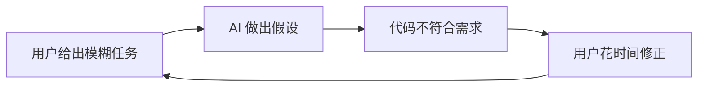
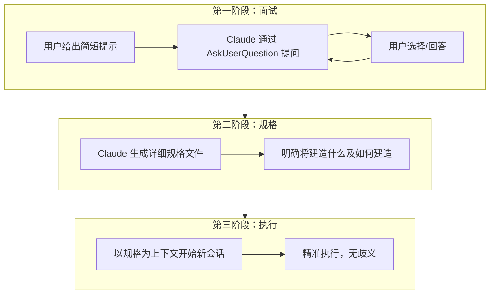
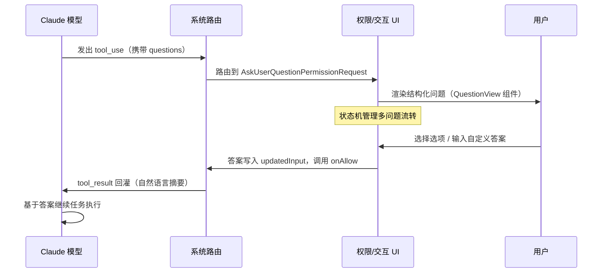
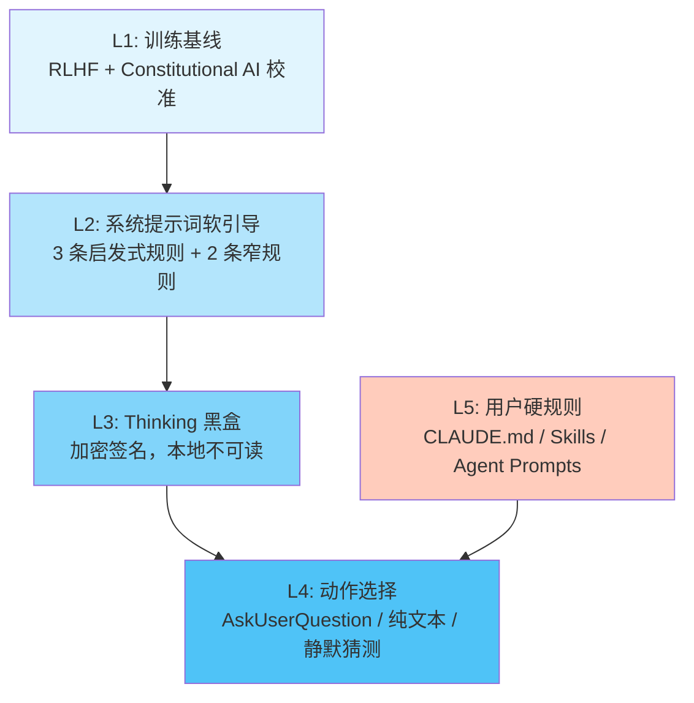
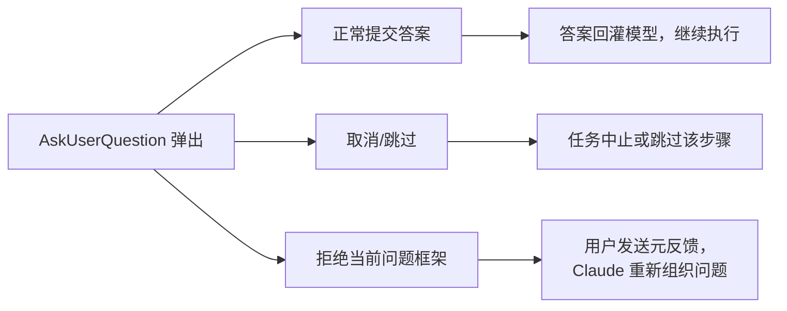
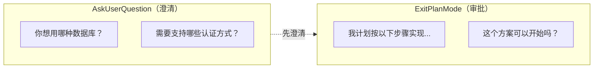
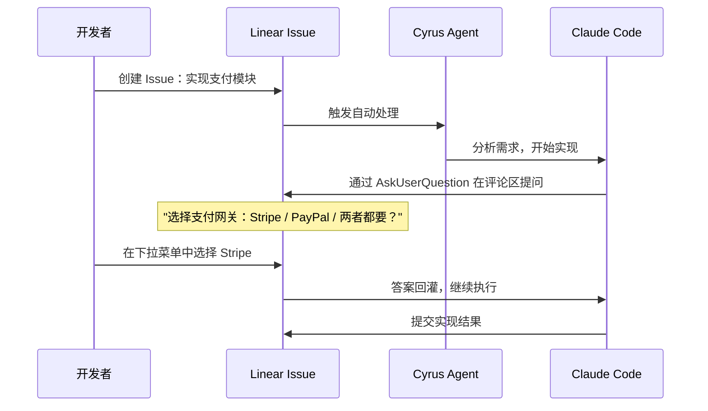
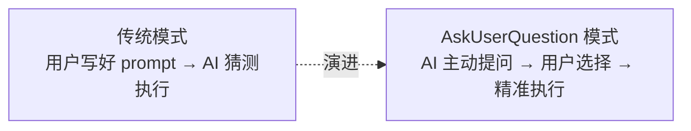

## Claude AskUserQuestion 工具使用

### 一、AskUserQuestion 是什么

AskUserQuestion 是 Claude Code（Anthropic 推出的命令行编码助手）内置的核心交互工具。与普通的文本对话不同，它是一个正式的**工具调用（Tool Call）**，能在任务执行过程中以结构化菜单的形式向用户提问，收集决策信息后再继续工作。

它的本质可以用一句话概括：**把"向用户要决策"这件事，从自由文本对话升级为一个标准的工具协议。**

这意味着：
- 问题以结构化 UI 渲染，而非散落在聊天消息中
- 用户的回答以结构化数据回灌模型，而非自由文本解析
- 整个交互流程受协议约束，可审计、可复现、可集成

从用户视角看，当 Claude Code 遇到模糊需求、多方案抉择、高风险操作等关键节点时，会暂停执行，弹出一个多项选择界面，等待用户做出明确选择后才继续推进。这彻底改变了传统 AI 助手"猜测-执行-返工"的低效循环。

---

### 二、AskUserQuestion 出现背景

#### 2.1 AI 编码助手的经典痛点

在 AskUserQuestion 出现之前，用户与 AI 编码助手的交互常常陷入一个恶性循环：



例如用户说"给我的 Express 应用添加用户认证"，AI 可能默默实现了一套基于 Session 的认证，而用户其实想要 JWT。等发现方向错误时，已经浪费了大量 token 和时间。

#### 2.2 提示工程的局限性

传统解决方案是让用户写更好的 prompt——详细描述需求、指定约束、列出偏好。但这给用户带来了沉重的认知负担：你需要预先想到所有可能的歧义点，并在 prompt 中一一说明。这对非专业用户尤其不友好。

#### 2.3 关系翻转：模型提示用户

AskUserQuestion 的出现颠覆了提示工程的传统方向——不再是"用户提示模型"，而是**"模型提示用户"**。当 Claude 在写代码前主动询问设计决策时：
- 权衡变得显而易见（而不是被假设隐藏）
- 设计决策在修改成本最低时就被面对
- 用户不需要成为提示工程专家

这创造了一种"选择你自己的冒险"式的产品开发路径——每个问题是一个分岔路口，每个答案收窄解空间，最终收敛到用户真正想要的结果。

#### 2.4 从能力瓶颈到理解瓶颈

随着 AI 模型能力的不断提升，瓶颈已经从"AI 能否做到"转变为"AI 是否理解我想要什么"。AskUserQuestion 正是为了突破这个理解瓶颈而设计的——它让 AI 有了一个标准化的通道来消除歧义、获取决策。

---

### 三、AskUserQuestion 怎么用

#### 3.1 基本使用方式

对用户来说，使用 AskUserQuestion 有两种模式：

**被动触发**：正常给 Claude Code 下达任务，当它遇到需要决策的关键点时会自动触发 AskUserQuestion，弹出选择菜单。

**主动触发**：在任务开头加一句引导语，让 Claude 主动进入"面试模式"：

> "我想添加用户认证，请使用 AskUserQuestion 向我提问，帮我补足完成这项任务所需要的信息。"

Claude 随后会提出几个关键问题：
- 你真正想要完成什么？
- 最终成果要给谁看？
- 执行时有哪些限制？
- 希望用什么形式呈现？

#### 3.2 交互界面

当 AskUserQuestion 被触发时，用户看到的是一个结构化选择界面：

```
? 请选择认证方式                        [Auth method]
  ① JWT Token（无状态，适合前后端分离）
  ② Session Cookie（有状态，适合传统 Web）
  ③ OAuth 2.0（第三方登录）
  > Other（自定义输入）
```

用户可以通过上下方向键选择选项，或选择"Other"输入自定义答案。当设置了 `multiSelect: true` 时，用户可以同时选中多个选项。

#### 3.3 面试-规格-执行三阶段模式

AskUserQuestion 最有效的使用方式被称为"基于规格的开发"（Spec-Based Development），分为三个阶段：



这种模式的优势在于：所有模糊性在第一阶段就被消除，第三阶段的执行因此变得精准高效。

---

### 四、AskUserQuestion 结构和原理

#### 4.1 参数结构

AskUserQuestion 接受如下 JSON 结构的参数：

```json
{
  "questions": [
    {
      "question": "你希望使用哪种认证方式？",
      "header": "Auth method",
      "multiSelect": false,
      "options": [
        {
          "label": "JWT Token",
          "description": "无状态，适合分布式系统，前端自行管理 token。"
        },
        {
          "label": "Session Cookie",
          "description": "服务端管理状态，适合传统 Web 应用。"
        },
        {
          "label": "OAuth 2.0",
          "description": "支持第三方登录，适合需要集成 GitHub/Google 等场景。"
        }
      ]
    }
  ]
}
```

#### 4.2 核心字段说明

| 字段 | 类型 | 必填 | 约束 | 说明 |
|------|------|------|------|------|
| `questions` | array | 是 | 1-4 个元素 | 问题数组，每次调用最多 4 个问题 |
| `question` | string | 是 | 须以 `?` 结尾 | 完整的问题文本 |
| `header` | string | 是 | 最多 12 字符 | 显示为标签/芯片的简短标题 |
| `multiSelect` | boolean | 是 | — | 是否允许多选 |
| `options` | array | 是 | 2-4 个元素 | 选项数组 |
| `options.label` | string | 是 | 1-5 个词 | 选项显示文本 |
| `options.description` | string | 是 | — | 选项含义或影响的解释 |
| `options.preview` | string | 否 | — | 可选的预览内容，支持 Markdown 代码片段 |
| `answers` | object | 否 | — | 权限组件收集的用户回答 |

#### 4.3 设计约束

- 所有层级均使用 `additionalProperties: false`，不允许额外字段
- 系统自动追加"Other"选项，**永远不要手动添加**
- 选项应当互斥（除非 `multiSelect: true`）
- `header` 用作答案的 key，所以同一次调用中不能重复
- 推荐做法：如果推荐某个选项，将其放在第一位并在 label 末尾加 `(Recommended)`

#### 4.4 执行链路

AskUserQuestion 的完整执行链路可以用下面的时序图表示：



关键设计要点：

1. **交互发生在权限层，不在 tool.call() 中**——工具本体非常轻量，真正的用户交互发生在 `AskUserQuestionPermissionRequest.tsx` 组件中
2. **用户答案通过更新工具输入参数回流**——答案被写入 `updatedInput`，然后 `onAllow(updatedInput)` 被调用
3. **tool_result 以自然语言摘要形式回灌模型**——模型看到的是人类可读的问答总结

---

### 五、AskUserQuestion 源码分析

#### 5.1 工具属性

从 Claude Code 源码可以看到，AskUserQuestion 具有以下关键属性：

```typescript
// 核心属性标记
shouldDefer: true           // 延迟工具，不总是暴露
requiresUserInteraction(): true  // 需要人类交互
isConcurrencySafe(): true   // 并发安全（只读）
isReadOnly(): true          // 只收集答案，无副作用
checkPermissions(): { behavior: 'ask' }  // 权限行为：询问
```

这些属性的设计含义：
- `shouldDefer: true`——不是每次都暴露给模型，只在需要时可用
- `isReadOnly: true`——纯粹收集信息，不修改任何系统状态
- `isConcurrencySafe: true`——多个 AskUserQuestion 理论上可以并发（实际受 UI 约束通常串行）

#### 5.2 五层架构视角

从 ATA 文章的分析来看，Claude Code 决定"什么时候停下来问你"涉及五个层次：



- **L1（训练基线）**：模型通过 RLHF 和 Constitutional AI 学习了"什么时候该问"的基本直觉
- **L2（系统提示词）**：Claude Code 的 system prompt 中包含了 3 条启发式规则和 2 条窄规则来引导提问行为
- **L3（Thinking 黑盒）**：模型的思考过程中有不可见的推理链路
- **L4（动作选择）**：最终决策——用 AskUserQuestion（结构化），还是用纯文本问（非结构化），还是直接猜测
- **L5（用户硬规则）**：CLAUDE.md、Skills 等配置文件中用户可以强制指定某些行为

#### 5.3 触发分类

根据对 24 个 AskUserQuestion 实例的分析，触发场景可归为 8 类：

1. **需求模糊，多种合理解读**——"优化数据库查询"可以是加索引、改 ORM、引入缓存还是拆分查询
2. **多个等效技术方案**——实时通信选 WebSocket、SSE 还是轮询
3. **高风险/不可逆操作**——删除数据库表、`git push --force`、覆盖配置文件
4. **偏好问题，无标准答案**——代码风格选 Prettier 还是 ESLint
5. **发现预期外状态**——不认识的配置文件、异常的文件结构
6. **跨仓库/跨系统决策**——影响范围超出当前上下文
7. **资源约束权衡**——时间 vs 质量 vs 成本的三角
8. **版本/兼容性选择**——框架版本、API 版本等

#### 5.4 三种回答路径

用户面对 AskUserQuestion 有三种响应方式：



第三种路径特别有趣——用户可以告诉 Claude"你问错了"，让它重新审视问题本身而不是在错误的框架下选择答案。

---

### 六、其他 AI 工具中的类似实现

AskUserQuestion 并非孤立的创新，其他 AI 编码工具也有类似的交互模式，但实现方式和深度存在差异：

| 工具 | 交互方式 | 结构化程度 | 触发时机 | 回答回灌 |
|------|----------|-----------|----------|----------|
| **Claude Code** | AskUserQuestion 工具 | 高（JSON Schema 约束） | 模型自主判断 + 用户硬规则 | 结构化数据回灌 |
| **Cursor** | 内联文本追问 | 低（自由文本） | 模型判断 | 上下文拼接 |
| **GitHub Copilot** | Chat 面板追问 | 低（自由文本） | 模型判断 | 对话历史 |
| **Windsurf** | Cascade 流程中断 | 中（有选项但非工具化） | 规则触发 | 流程恢复 |
| **Devin** | Slack/Web 中异步提问 | 中（有选项） | 自主判断 | 异步回灌 |

核心差异在于：

**Claude Code 将"提问"做成了一等公民工具**，而其他工具大多将提问视为对话的自然延伸。这带来了几个独特优势：
- 问题和答案的格式是确定性的（Schema 约束），不依赖模型解析自由文本
- 交互组件独立于聊天流，不会被上下文冲刷
- 可以被 Skill 和 Agent 显式引用和控制

---

### 七、AskUserQuestion 的优势

#### 7.1 对比"直接猜测"

| 维度 | 直接猜测 | AskUserQuestion |
|------|---------|-----------------|
| 效率（首次正确率） | 低，依赖 prompt 质量 | 高，关键决策由用户确认 |
| Token 消耗 | 高（错误 → 重做） | 低（一次做对） |
| 用户心智负担 | 重（需要写完美 prompt） | 轻（从选项中选择） |
| 可追溯性 | 差（决策隐含在代码中） | 好（问答记录明确） |

#### 7.2 对比"纯文本追问"

| 维度 | 纯文本追问 | AskUserQuestion |
|------|-----------|-----------------|
| 回答解析可靠性 | 低（需要 NLU） | 高（结构化数据） |
| UI 体验 | 散在对话流中 | 独立交互组件 |
| 多问题支持 | 容易混淆 | 清晰分组 |
| 可集成性 | 差 | 强（可被外部系统触发） |

#### 7.3 对比 Plan Mode

Claude Code 中有一个重要的设计边界：**AskUserQuestion 用于澄清，ExitPlanMode 用于审批**。



两者的职责严格分离：
- AskUserQuestion：收集缺失的需求信息，消除歧义
- ExitPlanMode：展示完整方案，请求用户批准执行

---

### 八、AskUserQuestion 在 Skill 中的使用

#### 8.1 为什么 Skill 需要 AskUserQuestion

Skill 是 Claude Code 中可复用的知识模块，用于编码特定领域的最佳实践。当一个 Skill 被触发时，往往需要用户的上下文信息来确定具体执行路径。例如：

- **文档生成 Skill**：需要知道目标受众、文档格式、详细程度
- **部署 Skill**：需要知道目标环境、是否需要回滚方案
- **重构 Skill**：需要知道哪些接口不能变、性能预算是多少

#### 8.2 在 Skill 中引导 AskUserQuestion

在 SKILL.md 中，可以通过自然语言指导 Claude 使用 AskUserQuestion：

```markdown
## Steps

1. 在开始工作前，使用 AskUserQuestion 向用户确认以下信息：
   - 目标受众是谁（技术人员 / 产品经理 / 终端用户）
   - 期望的文档长度（简要 / 标准 / 详尽）
   - 输出格式（Markdown / DOCX / HTML）

2. 根据用户的选择执行相应的文档生成流程...
```

#### 8.3 最佳实践

1. **在 Skill 开头就用 AskUserQuestion 收集关键参数**——不要等到执行中途才发现缺少信息
2. **提供合理的默认选项**——将推荐选项放在首位并标注 `(Recommended)`
3. **问题数量控制在 1-3 个**——太多问题会让用户产生"填表"的厌烦感
4. **option 的 description 要说明影响**——不只是解释选项是什么，更要说明选择后会发生什么
5. **利用 preview 展示差异**——当选项涉及代码或配置差异时，用 preview 展示具体示例

#### 8.4 Skill 中的 AskUserQuestion 示例

```markdown
## Steps

1. 使用 AskUserQuestion 确认部署配置：
   - 问题 1："部署到哪个环境？" (header: "Environment")
     选项：Production / Staging / Development
   - 问题 2："是否需要蓝绿部署？" (header: "Strategy")
     选项：蓝绿部署（零停机）/ 滚动更新（逐步替换）/ 直接替换（最快）

2. 根据用户选择生成对应的部署脚本...
```

---

### 九、AskUserQuestion 相关 Demo Case

#### Case 1：Express 应用添加认证

**用户输入**："给我的 Express 应用添加用户认证"

**Claude 触发 AskUserQuestion**：

```json
{
  "questions": [
    {
      "question": "你希望使用哪种认证方式？",
      "header": "Auth method",
      "multiSelect": false,
      "options": [
        {"label": "JWT Token (Recommended)", "description": "无状态，适合前后端分离架构，token 由前端管理"},
        {"label": "Session Cookie", "description": "有状态，适合传统 SSR Web 应用，服务端管理会话"},
        {"label": "OAuth 2.0", "description": "支持第三方登录（GitHub/Google），适合面向公众的产品"}
      ]
    },
    {
      "question": "需要支持哪些功能？",
      "header": "Features",
      "multiSelect": true,
      "options": [
        {"label": "邮箱注册登录", "description": "基础的邮箱+密码注册和登录流程"},
        {"label": "角色权限控制", "description": "RBAC 模型，区分管理员/普通用户"},
        {"label": "密码重置", "description": "通过邮件发送重置链接"},
        {"label": "双因素认证", "description": "TOTP 二次验证，提升安全性"}
      ]
    }
  ]
}
```

#### Case 2：数据库查询优化

**用户输入**："优化这个 SQL 查询，太慢了"

**Claude 触发 AskUserQuestion**：

```json
{
  "questions": [
    {
      "question": "你目前的性能瓶颈在哪里？",
      "header": "Bottleneck",
      "multiSelect": false,
      "options": [
        {"label": "查询耗时过长", "description": "单次查询需要数秒甚至更久"},
        {"label": "并发时性能下降", "description": "多用户同时查询时数据库响应变慢"},
        {"label": "不确定", "description": "我会先分析执行计划后给出建议"}
      ]
    },
    {
      "question": "优化方案可以接受的改动范围？",
      "header": "Scope",
      "multiSelect": false,
      "options": [
        {"label": "仅优化查询语句", "description": "不改表结构，不加索引"},
        {"label": "可以加索引", "description": "允许添加索引，但不改表结构"},
        {"label": "可以重构", "description": "允许修改表结构、添加缓存层等"}
      ]
    }
  ]
}
```

#### Case 3：家庭成长积分系统（实际案例）

这是一个将 AskUserQuestion 用于非代码场景的实际案例。用户想为孩子建一个成长积分系统，Claude 通过一系列 AskUserQuestion 引导用户明确需求：

1. 积分类型：学习 / 运动 / 家务 / 社交
2. 奖励机制：达到多少分可以兑换什么
3. 惩罚规则：是否扣分，哪些行为扣分
4. 展示方式：图表 / 排行榜 / 简单列表

通过 4-5 轮 AskUserQuestion，一个模糊的"我想做个积分系统"被精确化为一份可执行的需求规格。

#### Case 4：与 Linear/Cyrus 集成的异步协作

将 AskUserQuestion 与 Linear 问题跟踪器通过 Cyrus 结合，可实现团队级的异步决策：



这种模式的价值在于：
- 异步协作——开发者不需要实时在线
- 决策可追溯——所有问答都记录在 Issue 历史中
- 团队可见性——任何人都可以看到决策过程

---

### 十、AskUserQuestion 最佳实践

#### 10.1 何时应该使用

- 需求模糊，存在多种合理解读
- 存在多个同等合理的技术方案
- 即将执行高风险或不可逆操作
- 偏好问题，没有标准答案
- 发现了预期之外的状态

#### 10.2 何时不应使用

- 任务指令已经非常明确，不存在歧义
- 问题可以通过读取项目文件、配置、文档自行推断
- 属于显而易见的单步操作（如"修复拼写错误"）
- 询问"我的计划可以吗？"——应该使用 `ExitPlanMode`
- 连续追问超过 3 轮——说明应该先进入 Plan Mode 整体梳理

#### 10.3 编写好问题的原则

1. **问题要具体**——"你希望如何处理？"太空泛，"并发冲突时应采用哪种策略？"更好
2. **选项要穷尽主要路径**——不要遗漏常见选择，但也不超过 4 个（"Other"兜底）
3. **description 说明影响而非定义**——不写"JWT 是一种令牌"，而写"无状态，适合分布式系统"
4. **header 简短有力**——不超过 12 字符，如 "Auth method"、"DB choice"、"Deploy env"
5. **推荐项放首位**——并在 label 末尾加 `(Recommended)`

#### 10.4 自建 Agent 使用 AskUserQuestion 的 7 步清单

1. **定义工具 Schema**——复用 Claude Code 的 JSON Schema 约束（questions 数组、options 2-4 项等）
2. **注入系统提示**——在 system prompt 中描述何时该问、何时不该问
3. **实现权限 UI**——用组件渲染问题，收集结构化答案
4. **设计答案回灌格式**——答案作为 tool_result 回灌时采用自然语言摘要
5. **处理取消/拒绝路径**——用户可能跳过或拒绝当前问题框架
6. **控制提问频率**——连续提问不超过 2-3 轮，避免用户疲劳
7. **测试边界场景**——单选、多选、Other 输入、空选择等

#### 10.5 系统提示词中的引导模板

```markdown
## 何时使用 AskUserQuestion

在以下情况中使用 AskUserQuestion 向用户收集信息：
- 需求存在多种合理解读时
- 有多个等效技术方案需要选择时
- 即将执行不可逆操作时

## 何时不使用

- 答案可从项目配置/文档中推断时
- 任务指令已足够明确时
- 单步操作无歧义时

## 使用规范

- 每次最多 4 个问题
- 每个问题 2-4 个选项
- 推荐项放首位
- 不要手动添加 "Other" 选项
```

---

### 十一、总结

#### 11.1 核心价值回顾

AskUserQuestion 的设计哲学可以概括为一句话：**在代价最小的时刻引入人类判断，用结构化协议消除猜测。**



#### 11.2 设计启示

从 AskUserQuestion 的设计中可以提炼出 5 个适用于所有 AI Agent 的设计原则：

1. **将"向用户要决策"做成正式工具调用**——而非散落在对话中的自由文本
2. **交互逻辑放在权限/确认层**——工具本体保持轻量
3. **用户答案通过更新工具输入参数回流**——保持数据流的确定性
4. **允许用户拒绝问题框架本身**——"你问错了"也是一种合法回答
5. **严格区分"澄清"和"审批"**——不同类型的人机交互用不同的工具

#### 11.3 未来展望

随着 AI Agent 能力的持续提升，AskUserQuestion 这类工具的重要性只会越来越大。当 AI 能做的事情越多，"确保它做的是你想要的"就越成为核心挑战。及早掌握人机协作模式——包括如何设计好的提问、如何构建结构化决策流——将是 AI 时代的关键竞争力。

---

### 参考资料

- [什么是 Claude Code 的 AskUserQuestion 工具？如何将其用于基于规格的开发 - 掘金](https://juejin.cn/post/7589962224796287014)
- [Claude CLI AskUserQuestion 工具详解 - 掘金](https://juejin.cn/post/7618424147358171182)
- [Claude Code 源码分析（六）：把"向用户要决策"做成了工具 - 知乎](https://zhuanlan.zhihu.com/p/2025313371436725325)
- [Claude Code 怎么知道什么时候停下来问你 - ATA](https://ata.atatech.org/articles/11020657202)
- [Internal Claude Code Tools Implementation - GitHub Gist](https://gist.github.com/bgauryy/0cdb9aa337d01ae5bd0c803943aa36bd)
- [Claude Code Tools - Blog](https://blog.thepete.net/claude-code-tools/)
- [Skill Authoring Best Practices - Claude Platform Docs](https://platform.claude.com/docs/en/agents-and-tools/agent-skills/best-practices)
