# Claude Code 使用文档

> 一份覆盖 Claude Code 概念、原理、安装、配置、权限、扩展机制（CLAUDE.md / Skills / Hooks / MCP / Subagents / Plugins / Dynamic Workflows）、内网接入与最佳实践的完整中文指南。

---

## 一、Claude Code 是什么

Claude Code 是 Anthropic 推出的 **AI 驱动的命令行编码助手（Agentic Coding Tool）**，运行在终端中，把 Claude 模型与本地代码仓库、Shell、IDE、Git、CI/CD 紧密整合。它不是一个简单的"代码补全"工具，而是一个具备完整 Agent Loop（感知→思考→工具调用→结果观察→再思考）能力的"工程协作体"：

- 直接读取项目文件、执行 Shell 命令、编辑代码、运行测试、提交 Git
- 通过 CLAUDE.md / Skills / Hooks / MCP / Subagents 等机制可深度定制
- 支持 200K Token 长上下文，并通过多级压缩与恢复机制让长任务可持续
- 同时提供 CLI、桌面应用、Web 端、VS Code / JetBrains 插件、Slack 集成、GitHub Actions / GitLab CI/CD 多种形态

可以用一句话概括：

> **Claude Code 之于 AI 工程，就像 USB-C 之于硬件外设——它把"模型能力、工程上下文、工具调用、权限边界、自动化流程"统一在一套可插拔接口上。**

官方资源：

- 产品官网：<https://claude.com/product/claude-code>
- 文档（英文）：<https://code.claude.com/docs/en/overview>
- 文档（中文）：<https://code.claude.com/docs/zh-CN/quickstart>
- 开源仓库：<https://github.com/anthropics/claude-code>
- API 价格：<https://claude.com/pricing#api>
- 控制台：<https://platform.claude.com/dashboard>

---

## 二、出现背景与发展历程

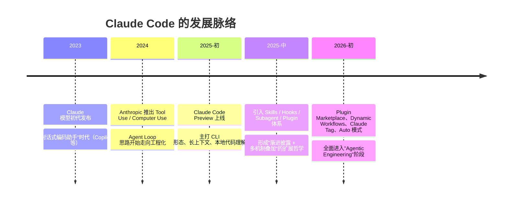

行业演进的几个关键节点：

- **Copilot 时代（2021-2023）**：以代码补全为核心，本质是"在 IDE 内嵌入更聪明的 IntelliSense"。
- **Chat-in-IDE 时代（2023-2024）**：以对话框为入口，把"问答 + 局部改写"贴到代码编辑器里（Cursor、Copilot Chat、Codeium）。
- **Agentic Coding 时代（2024-至今）**：模型能自主调度工具、读写文件、运行命令、检索网络、调用 MCP，从"被动响应"转向"主动完成任务"——Claude Code、Cursor Composer、Cline、OpenHands、Codex CLI 等同属此类。

Claude Code 与同类产品的差异：

- **CLI-first**：把终端作为一等公民，避免"插件壁垒"，能无缝接入 tmux、CI、SSH、Docker 等任何已有工程链路
- **机制可组合**：CLAUDE.md / Skills / Hooks / MCP / Subagents 不是平行替代关系，而是按"轻—重"层级叠加
- **长上下文 + Cache 经济学**：200K 窗口配合 Prompt Cache，让"项目级永久记忆"以低成本运行
- **企业级权限**：Fail-Closed 权限系统、托管 Settings、HTTP Hook 外置策略，可被企业网关审计

---

## 三、核心特性一览

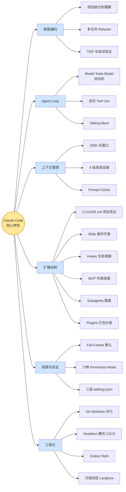

---

## 四、整体架构与原理

下图给出 Claude Code 的高层架构：终端／IDE 通过统一前端协议（CLI、SDK、IDE 插件、Web、Slack）接入 Agent Core，Agent Core 负责 Prompt 组装、Model 调用、Agent Loop 调度，并向下经过 Tool 系统调度本地 / 远程能力，权限系统作为横切关注点贯穿全程。

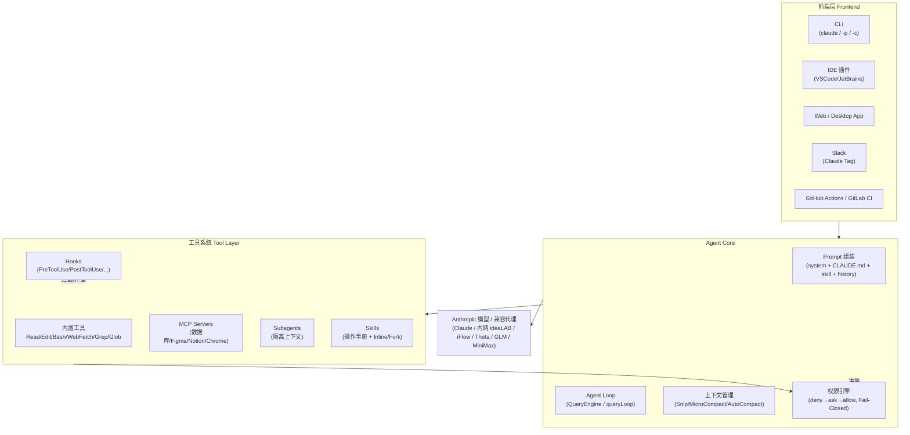

几条贯穿全局的设计哲学：

1. **Process over Prompt**：用稳定的流程（Plan→Exec→Verify）替代单条"超长 Prompt"。
2. **渐进披露（Progressive Disclosure）**：先注入最薄的索引（description）→ 需要时加载主体 → 再按需读引用文件。
3. **Cache Economics**：稳定前缀（system + CLAUDE.md + skill）享 KV Cache 90% 折扣，因此一切"经常变化的东西不该放在前缀里"。
4. **Fail-Closed 安全**：未明确允许即拒绝；任何层级的 deny 都不可被 allow 覆盖。

---

## 五、为什么是 CLI？理解 Claude Code 的 CLI 哲学

很多用户初看 Claude Code 会问："为什么不做 IDE 内的图形界面？"答案在于 CLI 自带的几条工程优势：

- **零侵入**：终端是所有开发者的最小公约数，无需切换 IDE、无插件兼容性问题。
- **可组合**：CLI 天然能被 `pipe`、`tmux`、`xargs`、`gh`、`docker exec` 这些工具串起来，让 Agent 直接融入既有自动化。
- **Headless / CI 友好**：`claude -p "..."` 可在 GitHub Actions、pre-commit hook、batch 脚本里像普通命令一样调用。
- **可审计**：所有 I/O 都是文本，便于 hook、日志、回放。
- **跨端**：同一 backend 可被 IDE 插件、Web、Slack 复用，CLI 是 "上游协议"。

CLI 的核心命令分两类：

- **Shell 命令**（外部）：`claude`、`claude -p`、`claude -c`、`claude --resume`、`claude mcp add ...`
- **Slash 命令**（会话内）：`/init`、`/plan`、`/compact`、`/clear`、`/model`、`/permissions`、`/sandbox`、`/code-review`……

会话内三档权限通过 `Shift+Tab` 循环切换：**default ↔ acceptEdits ↔ plan**（启用 Auto 模式后还会出现 auto）。

---

## 六、安装、更新与卸载

### 6.1 公网安装

```bash
# macOS / Linux（推荐：自动更新）
curl -fsSL https://claude.ai/install.sh | bash

# Homebrew（需手动升级）
brew install --cask claude-code

# Windows PowerShell（推荐：自动更新）
irm https://claude.ai/install.ps1 | iex

# WinGet（需手动升级）
winget install Anthropic.ClaudeCode

# NPM（已废弃，仅特殊环境使用）
npm install -g @anthropic-ai/claude-code
```

### 6.2 阿里内网安装（@ali/claude-code）

```bash
# 方式一：已安装 Node.js 18+
npm i -g @ali/claude-code --registry=https://registry.anpm.alibaba-inc.com

# 方式二：iFlow 一键脚本（自动装 Node 等依赖）
bash -c "$(curl -fsSL https://cloud.iflow.cn/claude-code/install.sh)"
```

更多内网部署参考 MO 计划指引（钉钉文档）：<https://alidocs.dingtalk.com/i/nodes/qnYMoO1rWxrkmoj2IzvYe9BqJ47Z3je9>

### 6.3 升级与卸载

```bash
# 升级（原生脚本安装版本会后台自动更新）
claude update      # 手动触发
brew upgrade --cask claude-code
winget upgrade Anthropic.ClaudeCode

# 卸载
npm uninstall -g @ali/claude-code        # 内网版
brew uninstall --cask claude-code        # Homebrew
winget uninstall Anthropic.ClaudeCode    # WinGet
rm -rf ~/.claude                          # 清理用户配置（可选）
```

### 6.4 初次启动

```bash
cd /path/to/your/project
claude
```

首次启动会弹出浏览器登录，支持账号类型：

- Claude Pro / Max / Team / Enterprise 订阅
- Claude Console（API 预付费额度）
- 企业云：Amazon Bedrock、Google Vertex AI、Microsoft Foundry
- 内网代理（ideaLAB / iFlow / Theta / Antchat 等，详见后文）

---

## 七、配置文件与设置体系

Claude Code 的配置遵循 "**就近覆盖**" 原则。下面这张图描述了配置和加载的优先级：


> 注意：**任意层级的 `deny` 都会阻止下层的 `allow`**，特异性不改变顺序。

### 7.1 settings.json 结构

```json
{
  "env": {
    "ANTHROPIC_BASE_URL": "https://api.anthropic.com",
    "ANTHROPIC_AUTH_TOKEN": "your-token",
    "ANTHROPIC_MODEL": "claude-opus-4-6",
    "ANTHROPIC_SMALL_FAST_MODEL": "claude-haiku-4-5",
    "DISABLE_AUTOUPDATER": 0
  },
  "permissions": {
    "defaultMode": "acceptEdits",
    "allow": ["Read", "Edit(./src/**)", "Bash(npm run *)"],
    "ask":   ["Bash(git push *)"],
    "deny":  ["Bash(rm -rf *)", "Read(./.env*)", "WebFetch"]
  },
  "hooks": {
    "PostToolUse": [
      { "matcher": "Edit|Write", "command": "npx prettier --write {file}" }
    ]
  },
  "additionalDirectories": ["~/code/shared-utils"],
  "statusLine": "model:{model} | cwd:{cwd} | $:{cost} | T:{tokens}"
}
```

### 7.2 关键路径速查

| 路径 | 作用 |
|------|------|
| `~/.claude/settings.json` | 用户级，全局生效 |
| `~/.claude/CLAUDE.md` | 用户级项目记忆（个人偏好） |
| `~/.claude/skills/` | 全局 Skills |
| `~/.claude/agents/` | 全局 Subagents |
| `<project>/.claude/settings.json` | 项目级（入 git） |
| `<project>/.claude/settings.local.json` | 个人本地（gitignore） |
| `<project>/CLAUDE.md` | 项目记忆 |
| `<project>/.claude/skills/` | 项目 Skills |
| `<project>/.claude/agents/` | 项目 Subagents |
| `<project>/.claude/commands/` | 项目自定义 Slash 命令 |
| `<project>/.claude/hooks/` | 项目 Hook 脚本 |
| `~/.config/claude-code-proxy/config.json` | 阿里内网代理（@ali/claude-code）配置 |

---

## 八、模型配置：从官方到自定义代理

Claude Code 支持 **环境变量 / CLI 参数 / 配置文件 / 会话内命令** 四种方式指定模型，优先级：会话内 `/model` > CLI `--model` > env > 配置文件。

### 8.1 三档模型变量

| 变量 | 用途 |
|------|------|
| `ANTHROPIC_DEFAULT_OPUS_MODEL` | 复杂推理、架构设计 |
| `ANTHROPIC_DEFAULT_SONNET_MODEL` | 日常代码编写、功能实现 |
| `ANTHROPIC_DEFAULT_HAIKU_MODEL` | 轻量任务（搜索、语法检查、状态行） |
| `ANTHROPIC_MODEL` | 通用兜底 |
| `ANTHROPIC_SMALL_FAST_MODEL` | 后台快速调用（statusline、autocomplete） |

### 8.2 阿里内网 ideaLAB

`~/.claude/settings.json`：

```json
{
  "env": {
    "DISABLE_PROMPT_CACHING": 0,
    "ANTHROPIC_BASE_URL": "https://idealab.alibaba-inc.com/api/anthropic",
    "ANTHROPIC_AUTH_TOKEN": "<你的 ideaLAB AK>",
    "ANTHROPIC_MODEL": "claude-opus-4-6",
    "ANTHROPIC_SMALL_FAST_MODEL": "claude-opus-4-6",
    "CLAUDE_CODE_DISABLE_EXPERIMENTAL_BETAS": 1,
    "DISABLE_AUTOUPDATER": 1
  }
}
```

AK 获取：<https://aistudio.alibaba-inc.com/#/aistudio/manage/personalResource>

### 8.3 内网 iFlow

`~/.config/claude-code-proxy/config.json`：

```json
{
  "baseURL": "https://apis.iflow.cn/v1/",
  "apiKey": "<your-iflow-key>",
  "modelMapping": {
    "small_model": "Qwen3-Coder",
    "model":       "Qwen3-Coder",
    "opus_model":  "Qwen3-Coder"
  }
}
```

模型清单：<https://platform.iflow.cn/models>

### 8.4 内网 IdeaTalk

```json
{
  "baseURL": "https://idealab.alibaba-inc.com/api/openai/v1",
  "apiKey": "<your-idealab-key>",
  "modelMapping": {
    "small_model": "claude35_haiku",
    "model":       "claude_sonnet4",
    "opus_model":  "claude_opus4"
  }
}
```

### 8.5 蚂蚁 Theta

一键安装：

```bash
bash <(curl -sSL https://antsys-antllmbase-chat.cn-heyuan-alipay-office.oss-alipay.aliyuncs.com/setup_claude_theta.sh)
```

`~/.claude/settings.json` env：

```json
{
  "env": {
    "ANTHROPIC_AUTH_TOKEN": "<theta-token>",
    "ANTHROPIC_BASE_URL": "https://antchat.alipay.com/api/anthropic",
    "ANTHROPIC_MODEL": "Minimax-M2.5",
    "ANTHROPIC_SMALL_FAST_MODEL": "Qwen3-Next-80B-A3B-Instruct",
    "ANTHROPIC_DEFAULT_HAIKU_MODEL": "Qwen3-Next-80B-A3B-Instruct",
    "ANTHROPIC_DEFAULT_OPUS_MODEL":   "Minimax-M2.5",
    "ANTHROPIC_DEFAULT_SONNET_MODEL": "Minimax-M2.5",
    "CLAUDE_CODE_DISABLE_NONESSENTIAL_TRAFFIC": "1",
    "CLAUDE_LOG_MASK_KEYS": "api_key,token,password,secret",
    "DISABLE_ERROR_REPORTING": "1",
    "DISABLE_BUG_COMMAND": "1",
    "CLAUDE_CODE_ATTRIBUTION_HEADER": "0"
  }
}
```

- Token：<https://theta.alipay.com/work/systemManagement/token?type=personal>
- 模型市场：<https://theta.alipay.com/work/serviceMarket>

### 8.6 GitHub Copilot 订阅复用

```bash
npm install -g copilot-api @anthropic-ai/claude-code
copilot-api start          # 保持窗口打开，监听 4141 端口
```

```bash
cat >> ~/.zshrc << 'EOF'
export ANTHROPIC_BASE_URL="http://localhost:4141"
export ANTHROPIC_AUTH_TOKEN="dummy"
# export ANTHROPIC_MODEL="claude-sonnet-4"
EOF
source ~/.zshrc
claude
```

使用统计页：<https://ericc-ch.github.io/copilot-api/?endpoint=http://localhost:4141/usage>

### 8.7 多模型一键切换（Shell 函数法）

```bash
export GLM_KEY="<glm-key>"
export MINIMAX_KEY="<minimax-key>"
export XIAOMI_KEY="<xiaomi-key>"

glm() {
  ANTHROPIC_AUTH_TOKEN="$GLM_KEY" \
  ANTHROPIC_BASE_URL="https://open.bigmodel.cn/api/anthropic" \
  ANTHROPIC_MODEL="glm-4.6" \
  claude "$@"
}

minimax() {
  ANTHROPIC_AUTH_TOKEN="$MINIMAX_KEY" \
  ANTHROPIC_BASE_URL="https://api.minimax.io/anthropic" \
  ANTHROPIC_MODEL="MiniMax-M2" \
  claude "$@"
}

xiaomi() {
  ANTHROPIC_AUTH_TOKEN="$XIAOMI_KEY" \
  ANTHROPIC_BASE_URL="https://api.xiaomimimo.com/anthropic" \
  ANTHROPIC_MODEL="mimo-v2-flash" \
  claude "$@"
}
```

### 8.8 CC Switch：图形化全平台切换器

跨平台桌面工具，支持 Claude Code、Codex、OpenCode、openclaw、Gemini CLI 多账号一键切换。

- GitHub：<https://github.com/farion1231/cc-switch>
- 最新版下载：<https://github.com/farion1231/cc-switch/releases>

---

## 九、初始化与首次使用流程

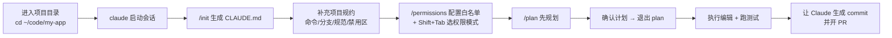

推荐节奏：

1. `claude` 启动后立刻 `/init`，生成 `CLAUDE.md`，再手动精简（控制在 200 行内）
2. `/permissions` 把常用安全命令（`npm run *`、`git status` 等）加入 allowlist
3. 默认用 `acceptEdits` 模式，必要时 `Shift+Tab` 进入 `plan`
4. 复杂任务先 `/plan`，确认计划后切回执行
5. 一个不相关任务结束后立刻 `/clear`，避免"厨房水槽会话"

---

## 十、基础命令与快捷键

### 10.1 Shell 命令

| 命令 | 作用 |
|------|------|
| `claude` | 启动交互式会话 |
| `claude "task"` | 一次性任务后保留会话 |
| `claude -p "query"` | Headless，一次性查询后退出 |
| `claude -c` / `--continue` | 续接最近会话 |
| `claude -r` / `--resume` | 从列表恢复历史会话 |
| `claude --model <name>` | 启动指定模型 |
| `claude --permission-mode auto` | 指定权限模式启动 |
| `claude --add-dir <path>` | 额外授权目录 |
| `claude --enable-auto-mode` | 开启 Auto 模式 |
| `claude --dangerously-skip-permissions` | 跳过权限（仅沙箱/容器） |
| `claude mcp add <name> <cmd>` | 注册 MCP Server |
| `claude plugin marketplace add <repo>` | 添加插件市场 |

### 10.2 常用 Slash 命令

| 命令 | 作用 |
|------|------|
| `/init` | 扫描仓库生成 CLAUDE.md |
| `/help` | 列出可用命令 |
| `/model` | 临时切换当前模型 |
| `/clear` | 清空对话历史 |
| `/compact [说明]` | 触发上下文压缩 |
| `/context` | 查看上下文用量 |
| `/cost` / `/usage` | 查看 token 与计费 |
| `/resume` | 列出并恢复历史会话 |
| `/rewind` / `Esc+Esc` | 回滚到 checkpoint |
| `/plan` | 进入 Plan 模式 |
| `/permissions` | 打开权限配置菜单 |
| `/sandbox` | 启用 OS 级沙箱 |
| `/agents` | 管理 Subagent |
| `/skills` | 管理 Skills |
| `/mcp` | 查看/管理 MCP |
| `/hooks` | 查看 Hooks |
| `/plugin` | 浏览插件市场 |
| `/rename <name>` | 重命名当前会话 |
| `/goal` | 设定阶段目标 |
| `/fork` | 分裂出子会话 |
| `/code-review` | 启动内置代码审查工作流 |
| `/doctor` | 自检环境 |

### 10.3 快捷键速查

| 操作 | 快捷键 |
|------|--------|
| 引用文件/目录 | `@file.ts`、`@src/` |
| 直接执行 Bash | `!ls -la` |
| 中断输出但保留 context | `Esc` |
| 回滚 checkpoint | `Esc Esc` |
| 循环切换权限模式 | `Shift+Tab` |
| 搜索历史 | `Ctrl+R` |
| 多行输入 | `\` + Enter |
| 粘贴图片 | macOS：`Ctrl+V` / Win：`Alt+V` |
| 退出 | `/exit` / `Ctrl+D` |

---

## 十一、CLAUDE.md：项目宪法

`CLAUDE.md` 是项目级"长期记忆"，会被注入每次 system prompt 享 KV Cache 折扣，是 Claude Code 最重要的钩子之一。

### 11.1 五层加载机制

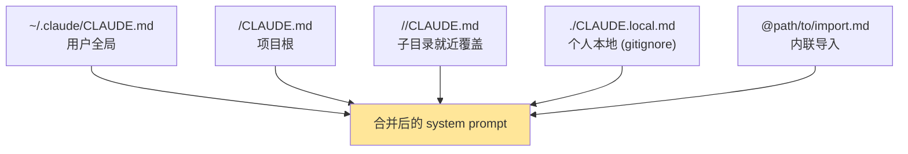

### 11.2 推荐结构

```markdown
# 项目名 · Claude 工作约定

## 一句话项目说明
（让 Claude 在 200 字内理解这个项目"在做什么"）

## 核心命令
- 启动：`pnpm dev`
- 测试：`pnpm test --run`
- Lint：`pnpm lint`
- 构建：`pnpm build`

## 技术栈
- React 18 + TypeScript 5 + Vite + Tailwind
- 状态管理：Zustand
- 数据层：tRPC + Prisma

## 代码风格
- 不要使用默认导出（默认使用 named export）
- 异步函数必须显式标注返回类型

## 工作流约定
- 修改 src/server/** 必须更新对应单元测试
- 修改 prisma/schema.prisma 后必须运行 `pnpm prisma migrate dev`
- 提交信息使用 conventional commits

## 禁用区
- 不要修改 `infra/`、`migrations/`、`.github/workflows/`
- 不要触碰 `.env*`、`secrets/`
```

### 11.3 六条铁律（来自社区与官方实践）

1. 总长 ≤ 200 行，避免挤占主上下文。
2. 不写"必须、立刻、绝对"等情绪词，模型反而抗拒。
3. 内容必须可判对错——"先跑测试"可验证，"写漂亮代码"不可验证。
4. 路径用绝对路径或 `@import` 引用，避免模糊。
5. 高危子目录单独放 `CLAUDE.md`（如 `infra/CLAUDE.md` 禁删 terraform state）。
6. 真正硬性的约束用 Hook 强制（lint/test/forbidden import），防止"已读乱回"。

### 11.4 AI 进化机制

可以让 Claude 自己迭代 `CLAUDE.md`：

```
请记住：本项目所有 npm 命令都应改用 bun。把这条规则补充到 CLAUDE.md。
```

也可以在 PR 中通过 `@claude` 反馈，让其学习并自动 PR 修改 CLAUDE.md，形成"AI 进化闭环"。

---

## 十二、权限控制系统：Fail-Closed 的工程化实现

### 12.1 三层 settings + 三类规则

权限有三类规则（`deny / ask / allow`）和三层来源（用户级 / 项目级 / 本地级），统一收敛到一个判定流程：

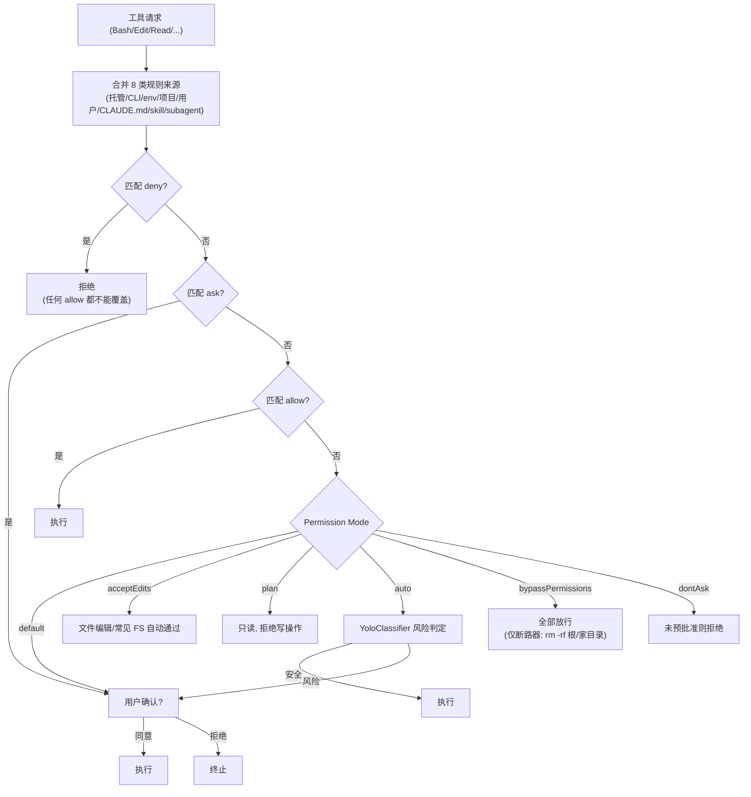

### 12.2 六种 Permission Mode

| 模式 | 行为 | 适用场景 |
|------|------|----------|
| `default` | 首次使用工具时提示 | 新手 / 高风险项目 |
| `acceptEdits` ⭐ | 工作目录内的文件编辑和常见 FS 命令自动通过 | 日常开发主力 |
| `plan` | 只读探索，禁止编辑源文件 | 探索陌生代码库 / 生产分支 |
| `auto` | 分类器智能判定，安全自动放行 | 长任务自动跑（替代 dangerously-skip） |
| `dontAsk` | 未预批准的全部静默拒绝 | 高可信批处理 |
| `bypassPermissions` | 跳过所有提示（断路器仍生效） | 容器/沙箱内 |

会话内 `Shift+Tab` 循环切换 default → acceptEdits → plan（开启 Auto 后会插入 auto）。

### 12.3 规则语法

- **工具名**：`Bash`、`Read`、`Edit`、`Write`、`WebFetch`、`Agent` 等
- **特定调用**：`Bash(npm run build)`、`Read(./.env)`、`WebFetch(domain:example.com)`
- **通配符**：`Bash(npm run *)`、`Bash(git * main)`、`Read(./src/**)`
- **路径锚点**：`//abs/path`（系统绝对）、`~/...`（HOME）、`/path`（项目根相对）、`./path`（cwd 相对）
- **WebFetch**：`WebFetch(domain:*.example.com)`（不匹配裸域）
- **MCP**：`mcp__server__tool`、`mcp__server__*`
- **Agent**：`Agent(Explore)`、`Agent(model:opus)`

### 12.4 推荐配置模板

```json
{
  "permissions": {
    "defaultMode": "acceptEdits",
    "allow": [
      "Read",
      "Edit(./src/**)",
      "Write(./src/**)",
      "Bash(npm run dev)",
      "Bash(npm run build)",
      "Bash(npm run lint)",
      "Bash(npm run test *)",
      "Bash(npx tsc --noEmit)",
      "Bash(git status)",
      "Bash(git diff *)",
      "Bash(git add *)",
      "Bash(git commit *)",
      "Bash(git log *)",
      "Bash(ls *)",
      "Bash(cat *)",
      "Bash(mkdir *)"
    ],
    "ask": [
      "Bash(git push *)",
      "Bash(npm install *)",
      "Bash(npx prisma migrate *)"
    ],
    "deny": [
      "Bash(rm -rf *)",
      "Bash(sudo *)",
      "Bash(curl *)",
      "Read(./.env*)",
      "Read(./secrets/**)",
      "Edit(./.env*)",
      "WebFetch"
    ]
  }
}
```

布局建议：

- **全局 `~/.claude/settings.json`**：通用规则（git/构建/读文件）+ 通用 deny（`.env`、`sudo`、`rm -rf`）
- **项目级 `.claude/settings.json`**：项目专属（前端项目放 `vite`、iOS 放 `xcodebuild`）
- **本地级 `.claude/settings.local.json`**：个人临时规则（gitignore，不入仓库）

### 12.5 `--dangerously-skip-permissions` 注意

仅在 **隔离环境**（容器、虚拟机、有备份的沙箱）使用。该模式仍保留两个断路器：根目录 / 主目录的 `rm -rf` 仍会触发提示。企业可在托管 settings 里设 `permissions.disableBypassPermissionsMode: "disable"` 彻底禁用。

### 12.6 Auto 模式：折中方案

- 上线时间：2026 年 3 月
- 机制：在工具调用前由分类器（YoloClassifier）评估风险，安全操作自动放行，风险操作回退到人工
- 启动：`claude --enable-auto-mode`，会话内 `Shift+Tab` 切换到 Auto
- 模型要求：Claude Sonnet 4.6 / Opus 4.6
- 拦截重点：大规模删除、敏感数据外传、超范围异常操作

---

## 十三、Agent Loop 实现原理

Claude Code 的执行核心是一个 **三层 AsyncGenerator 流水线**：

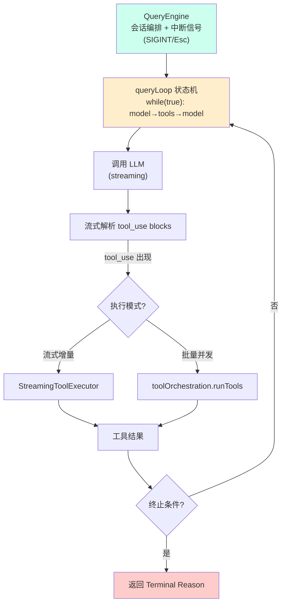

### 13.1 关键设计

- **AsyncGenerator + while(true)**：用协程而非递归，避免栈爆，可中断、可重入。
- **流式 tool_use**：模型还在生成参数时下游已可预热（如打开文件句柄），降低 P99 延迟。
- **Sibling Abort**：同一批并发工具中一个失败可立即取消同批兄弟工具，节省 token。
- **10 个 Terminal Reason**：`max_turns / refusal / abort / error / budget_exceeded / no_tool_use / ...`
- **7 个 Continue Reason**：`tool_use / continue / cache_refresh / ...`
- **Langfuse trace**：全链路埋点，支持离线回放。

### 13.2 可观测性

可以通过 `/usage`、`/cost`、`/stats`、`/context` 观察 token 消耗与缓存命中。配合 `statusLine` 模板（变量：`{model}`、`{cwd}`、`{cost}`、`{tokens}`）实时展示。

---

## 十四、上下文管理：让长任务持续运行

200K 上下文窗口看起来很大，但任何长任务最终都会逼近上限。Claude Code 用 **4 级渐进压缩 + 5 重恢复** 机制把长任务变成可持续工程。

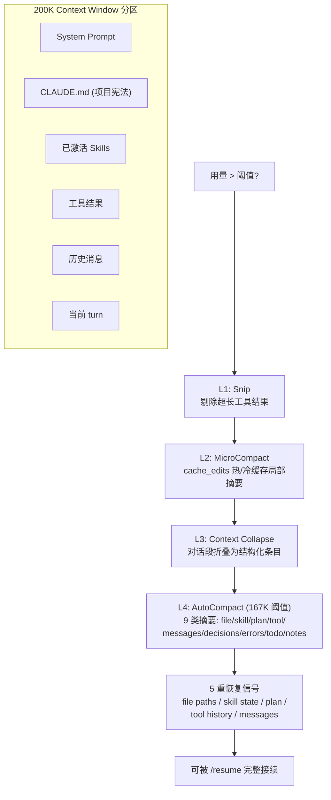

### 14.1 关键机制

- **Prompt Cache**：稳定前缀享 90% 折扣，命中与未命中成本差几十倍。`system + CLAUDE.md + skill` 必须"静"。
- **手动压缩**：`/compact "保留架构决策，丢弃逐行 diff"` 主动控制摘要内容。
- **`/rewind` / `Esc+Esc`**：回滚到某个 checkpoint（仅对话 / 仅代码 / 两者）。
- **HANDOFF.md**：长任务跨 session 交接，写明已完成、待办、关键决策。

### 14.2 长任务节奏建议

> "先 `/plan` → `Shift+Tab` 进入 acceptEdits → 关键节点 `/cost` 监控 → 阶段末 `/compact` → 跨天 `/resume`"。

不相关任务一定要 `/clear`，避免"厨房水槽会话"导致后续操作越来越离谱。

---

## 十五、Skills 系统：可复用的"操作手册"

### 15.1 概念定位

> **MCP 是"手"（连接性），Skill 是"操作手册"（能力）。**

Skill 本质是 `SKILL.md`（YAML frontmatter + Markdown 主体）加上可选的脚本/模板/参考文档。Claude 根据用户意图自动检索匹配 Skill，按"渐进披露"分级加载。

### 15.2 渐进披露

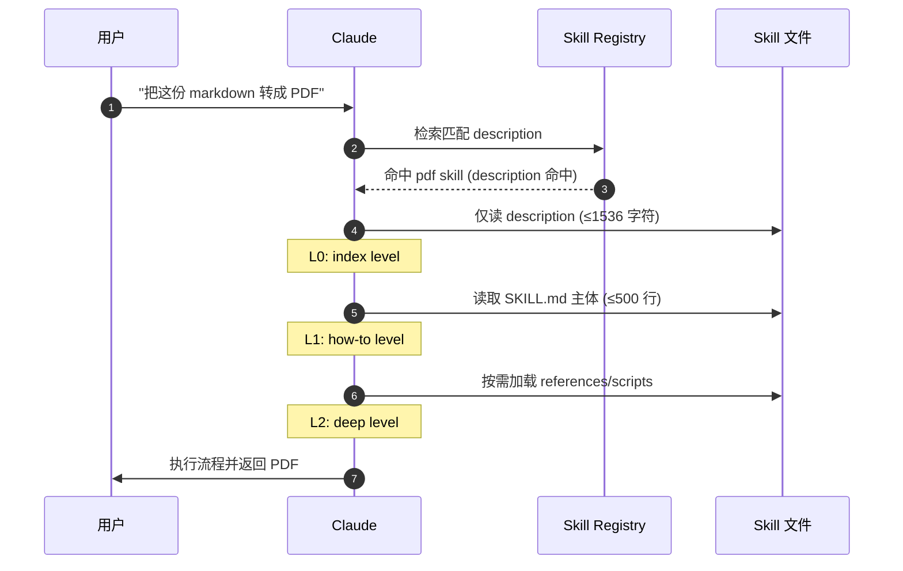

### 15.3 Skill 来源

- **bundled**：内置（如 `/code-review`）
- **disk**：`~/.claude/skills/` 全局 + `<repo>/.claude/skills/` 项目
- **plugin**：由插件分发
- **MCP server**：远端 MCP 暴露
- **dynamic**：运行时生成

### 15.4 SKILL.md 示例

```markdown
---
name: pdf
description: |
  Generate, read, edit and merge PDF documents.
  Use when the user asks for PDF output, print-ready docs, or PDF manipulation.
version: 1.2.0
paths: ["**/*.md", "**/*.pdf"]
---

# PDF Skill

## Steps
1. 调用 `python scripts/md2pdf.py <input.md> <output.pdf>` 完成转换。
2. 若用户提供模板，使用 `--template` 参数。

## Pitfalls
- 中文字体需指定 `--font NotoSansCJK-Regular`。
- 不要直接 `wkhtmltopdf`，已废弃。

## Verification
检查输出 PDF 是否可被 `pdfinfo` 解析。
```

### 15.5 关键限制

- 单 Skill 主体建议 ≤ 500 行（≤1% 上下文 token）
- description ≤ 1536 字符（影响召回率）
- 安全侧用 Safe Properties 白名单，过滤未知 frontmatter，防注入
- 执行模式：Inline（主上下文展开）/ Fork（子代理隔离）
- 命中排名采用 Exponential Decay（使用频次按 7 天半衰期衰减）

### 15.6 调用方式

- **自动召回**：用户意图与 description 匹配
- **显式调用**：`/<skill-name>`
- **手动模式**：在 frontmatter 中加 `disable-model-invocation: true`，只能显式调用
- **路径条件激活**：`paths: ["**/*.tsx"]` 只在匹配文件时注入

---

## 十六、Hooks：生命周期级自动化

Hooks 通过事件触发"确定性脚本"，是把"硬约束"从模型决策中外置的关键机制。

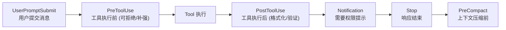

### 16.1 常用 Hook 类型

| Hook | 触发时机 |
|------|----------|
| `PreToolUse` | 工具执行前（可决定拒绝/强制询问/跳过提示） |
| `PostToolUse` | 工具执行后（自动格式化、跑测试、记录） |
| `UserPromptSubmit` | 用户提交消息时（注入上下文、改写） |
| `Stop` | Claude 响应结束（汇总、通知） |
| `PreCompact` | 触发 `/compact` 之前（备份状态） |
| `Notification` | 权限/通知事件 |

### 16.2 settings.json 配置示例

```json
{
  "hooks": {
    "PostToolUse": [
      {
        "matcher": "Edit|Write",
        "command": "npx prettier --write {file} && npx eslint --fix {file}"
      }
    ],
    "PreToolUse": [
      {
        "matcher": "Bash",
        "command": ".claude/hooks/forbid-dangerous.sh '{command}'"
      }
    ]
  }
}
```

### 16.3 HTTP Hook：企业策略外置

新版支持 HTTP Hook，把权限/拦截策略下沉到企业网关，所有 tool_use 经网关审计后才执行——这让 Claude Code 可以无缝接入公司级 DLP / SIEM。

---

## 十七、MCP（Model Context Protocol）

MCP 是 Anthropic 主导的"模型连接外部世界"的开放协议（USB-C 类比）。Claude Code 内置 MCP Client，可直接消费任意标准 MCP Server。

### 17.1 添加 MCP

```bash
# 命令行
claude mcp add chrome-devtools npx chrome-devtools-mcp@latest
claude mcp add github npx @modelcontextprotocol/server-github

# 查看
claude mcp list
/mcp        # 会话内
```

### 17.2 常用 MCP 服务

| MCP | 用途 |
|-----|------|
| `chrome-devtools-mcp` | 浏览器自动化、截图、Console、网络请求 |
| `playwright-mcp` | 端到端测试与浏览器自动化 |
| `github-mcp` | Issue/PR/Code Search |
| `filesystem-mcp` | 受控的额外文件访问 |
| `postgres-mcp` | 数据库查询 |
| 阿里内网 yuque / coop / 钉钉 / dms 等 | 企业知识与协同 |

### 17.3 权限粒度

```json
{
  "permissions": {
    "allow": ["mcp__chrome-devtools__*"],
    "ask":   ["mcp__github__create_pull_request"],
    "deny":  ["mcp__postgres__execute_write_*"]
  }
}
```

新版还支持 `defer_loading` MCP stub：先注册不加载，用到才拉起，减少冷启动 token。

---

## 十八、Subagents 与多 Agent 系统

### 18.1 为什么需要 Subagent

主对话窗口宝贵，把"搜索 / 探索 / 审查 / 重复劳动"丢给隔离上下文的子代理，可以保持主线干净，并支持并行。

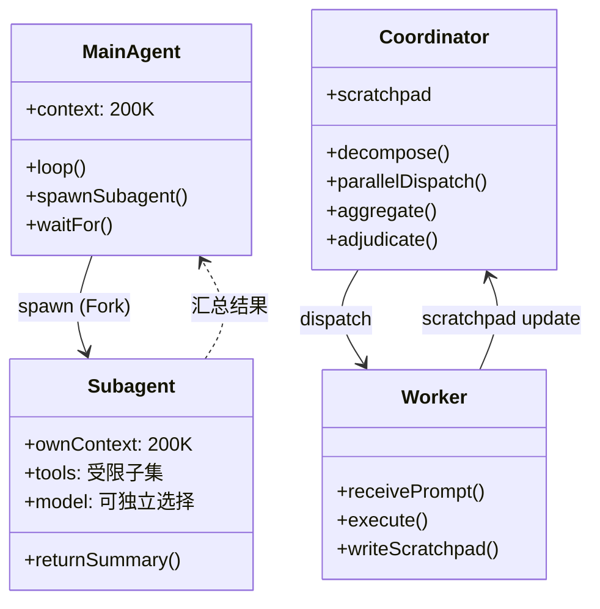

### 18.2 三种多 Agent 模式

| 模式 | 通信 | 适用 |
|------|------|------|
| **Fork** | 复制父上下文前缀（共享 cache）；权限请求 bubble 到父 | 短任务并行（如 5 个文件同时改） |
| **Coordinator** | 共享 scratchpad；Worker 之间不直接通信 | DAG 编排 / 4 阶段分解 |
| **Swarm / Teammate** | Mailbox 异步消息 / AsyncLocalStorage / tmux pane | 长期共驻多角色（reviewer/writer/QA） |

### 18.3 关键安全机制

- `CacheSafeParams`：保证 Fork 上下文与父对齐以复用 cache
- `useExactTools`：子代理工具集锁死
- `FORK_BOILERPLATE_TAG`：防止子代理递归再 Fork 失控
- `bubble`：子代理权限请求冒泡到父代理审批
- Git worktree：子代理写文件时启用 worktree 隔离，避免互踩

### 18.4 自定义 Subagent

`.claude/agents/code-reviewer.md`：

```markdown
---
name: code-reviewer
description: 对 diff 做严格代码审查，只标记影响正确性的缺陷
tools: [Read, Grep, Bash(git diff *)]
model: claude-opus-4-6
---

你是一名资深代码审查者。规则：
- 仅审查 PR diff，不要遍历整个仓库
- 标记 bug / 安全 / 性能 / 可读性问题
- 不要做风格层面的"鸡蛋里挑骨头"
- 输出 markdown checklist，每项必须包含文件:行号
```

会话内调用：

```
@code-reviewer 审查 origin/main...HEAD 的变更
```

---

## 十九、Dynamic Workflows：可代码化的 Agent DAG

把"提示链"升级为"代码化 DAG"，并发、重试、Schema 校验全部下沉到基础设施。

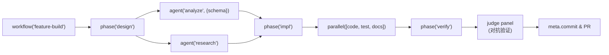

核心原语：

- `agent(prompt, {schema})`：启动子代理，schema 校验失败自动重试
- `parallel([...])`：barrier 等所有子任务完成
- `pipeline([...])`：逐项穿越多 stage，不必齐步走
- `phase(name)`：阶段标签便于追踪
- `workflow(name, fn)`：注册为命名工作流，便于 `/workflow xxx` 调用

约束：

- 并发上限 `min(16, cpu-2)`
- 单工作流 agent 总数上限 1000
- 脚本环境无 Node API、无随机/时间源（纯确定性，便于 resume）
- `meta` 块必须是纯字面量含 `name/description/phases`

典型模式：

- 对抗验证（多代理交叉评审）
- Judge Panel（多评审打分取中位）
- Loop-Until-Dry（不断挖直到无新发现）
- 最小 args + agent 按需加载

---

## 二十、Plugins 与 Marketplace

Plugin 是"打包好的工具套件"，把 Skills、Hooks、Subagents、MCP Servers、Slash 命令等打成一个可分发单元，并通过命名空间避免冲突。

```bash
# 添加市场
claude /plugin marketplace add anthropics/skills
claude /plugin marketplace add obra/superpowers-marketplace
claude /plugin marketplace add https://github.com/mixedbread-ai/mgrep

# 浏览并安装
/plugins
/plugin install superpowers@superpowers-marketplace

# 列出
claude plugin list
```

推荐插件：

- **Superpowers**：完整 TDD + Code Review + Git Worktree + Subagent 工作流（详见下一章）
- **mgrep**：多关键词并行 grep，配合大代码库提升检索效率
- **frontend-design**：高质量前端组件生成
- **agent-browser**：浏览器自动化

---

## 二十一、Superpowers：把方法论封装成 Skill

由 Jesse Vincent（obra）开源的 AI 编程工作流框架，核心理念 **"Process over Prompt"**。它把 TDD、Code Review、Spec-Driven Development、Git Worktree、子代理协作等工程实践封装成 Skills，让 Claude Code 自动按流程执行。

### 21.1 安装

```bash
/plugin marketplace add obra/superpowers-marketplace
/plugin install superpowers@superpowers-marketplace
```

### 21.2 三大命令

| 命令 | 作用 |
|------|------|
| `/superpowers:brainstorm` | 苏格拉底式提问澄清需求 |
| `/superpowers:write-plan` | 拆解 2-5 分钟微任务 + 风险评估 |
| `/superpowers:execute-plan` | 子代理 + TDD + Code Review 执行 |

### 21.3 完整工作流

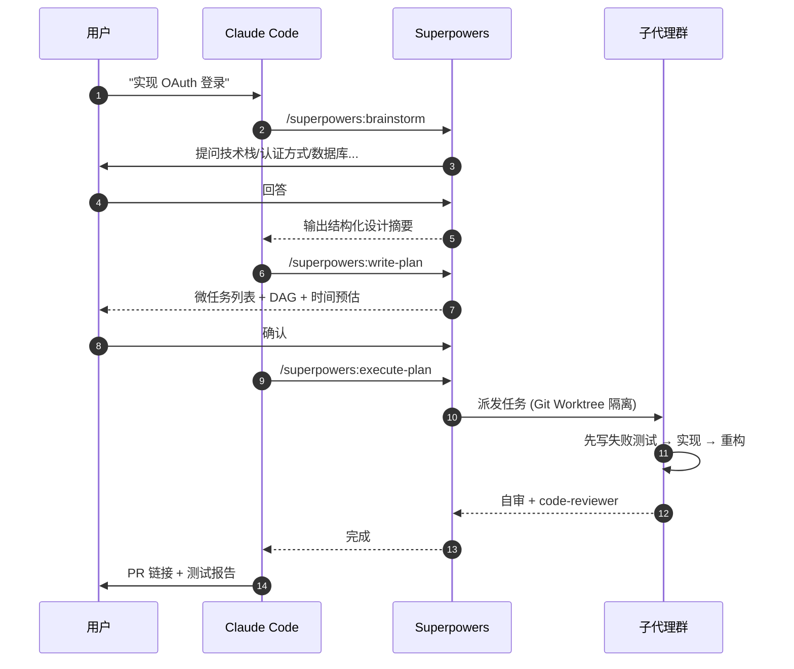

### 21.4 适用场景

- 50 行以上功能开发 / Bug 修复
- Token 多消耗 10-20%，但返工率降 60-70%
- 改 CSS、修 typo 等小事不必走完整流程

---

## 二十二、Claude Tag：从聊天机器人到 AI 同事

Claude Tag 是 Anthropic 在 Slack 中的官方集成，但与一般"聊天机器人"不同——它具备：

- **持久身份**：拥有 Slack 用户 / 邮箱 / 工时
- **跨会话记忆**：可被 `@` 拉进任意频道，记得过去的项目上下文
- **任务流转**：可以接受 Issue 委派、自己开 PR、追测试报告
- **同事级权限**：能查日历、加入 standup、回应 review request

简单说，Claude Tag 把 Claude Code 的能力封装成"Slack 里的一个 AI 同事"，让"AI 协作"从 IDE 走向团队工作流。

---

## 二十三、记忆架构与上下文处理

Claude Code 的"记忆"不是一个文件，而是一套分层架构：

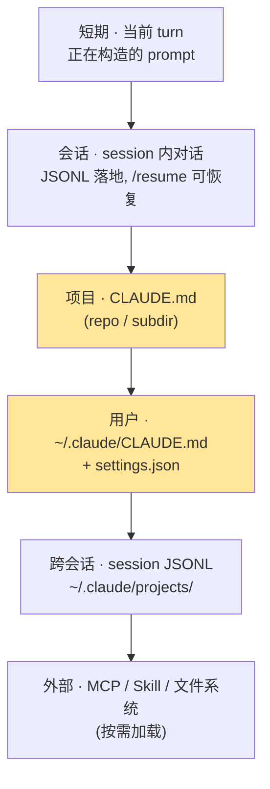

要点：

- 每个项目对应一个 JSONL 文件（`~/.claude/projects/<encoded-path>.jsonl`），可用 Claude Code History Viewer 等可视化。
- 跨会话恢复：`claude --continue` / `claude --resume` / 会话内 `/resume`。
- 长任务跨 session 用 `HANDOFF.md` 显式记录交接点。
- 网页版会话存云端，可通过 Chrome 扩展（如 Claude Exporter）导出为 PDF / Markdown / CSV。

---

## 二十四、历史会话查看与导出

### 24.1 命令行

```bash
# 查看 / 续接
claude --continue
claude -c
/resume          # 会话内列出最近会话

# 物理日志位置
ls ~/.claude/projects/
```

### 24.2 可视化工具：Claude Code History Viewer

仓库：<https://github.com/jhlee0409/claude-code-history-viewer>

支持 Claude Code、Gemini CLI、Antigravity、Codex CLI、Cline、Cursor、Aider、OpenCode、ForgeCode 多种对话日志的统一浏览、搜索与分析。100% 离线。

### 24.3 网页版 Claude.ai

- 左侧栏直接查看历史话题
- 用 Chrome 扩展 [Claude Exporter](https://chromewebstore.google.com/detail/claude-exporter-extract-c/elhmfakncmnghlnabnolalcjkdpfjnin) 导出 PDF / Markdown / Text / CSV

### 24.4 API

通过 Claude API 的 List Conversations 接口拉取，适合做企业级"会话审计 / 数据回放"。

---

## 二十五、CI/CD 与团队协作集成

### 25.1 GitHub Actions

```yaml
name: Claude Review
on: pull_request
jobs:
  review:
    runs-on: ubuntu-latest
    steps:
      - uses: actions/checkout@v4
        with: { fetch-depth: 0 }
      - uses: actions/setup-node@v4
      - run: npm install -g @anthropic-ai/claude-code
      - name: Run Review
        env:
          ANTHROPIC_AUTH_TOKEN: ${{ secrets.ANTHROPIC_AUTH_TOKEN }}
        run: |
          git diff origin/main...HEAD | \
            claude -p "审查本 PR diff，按 conventional commits 给出建议" \
                   --permission-mode auto \
            > review.md
      - name: Post Comment
        uses: actions/github-script@v7
        with:
          script: |
            const fs = require('fs')
            const body = fs.readFileSync('review.md', 'utf8')
            await github.rest.issues.createComment({
              ...context.repo,
              issue_number: context.issue.number,
              body
            })
```

### 25.2 Pre-commit Hook

```bash
#!/usr/bin/env bash
# .git/hooks/pre-commit
git diff --cached | claude -p "如果发现明显 bug 或安全问题就 exit 1，否则 exit 0" --permission-mode dontAsk || exit 1
```

### 25.3 批处理 / Fan-out

```bash
find src -name "*.ts" | xargs -I{} -P 4 claude -p "为 {} 补充 JSDoc" --allowedTools "Read,Edit({})"
```

---

## 二十六、为什么 Claude Code 这么火？

简单总结几个原因：

1. **第一个真正可用的 Agentic Coding 工具**：相对 Cursor Composer / Cline 等更稳定，长任务恢复机制成熟。
2. **CLI-first 的工程友好度**：和现有工具链（tmux、Docker、CI、SSH）几乎零摩擦集成。
3. **机制可组合**：CLAUDE.md / Skill / Hook / MCP / Subagent / Plugin 不是替代关系，可以渐进采用，从最薄的 CLAUDE.md 到最重的 Dynamic Workflows，随项目成熟度演进。
4. **企业级权限**：Fail-Closed、托管设置、HTTP Hook，适合在大组织里落地。
5. **生态爆发**：Superpowers、cc-switch、mgrep、Claude Code History Viewer、众多 plugin marketplace…… 社区飞速膨胀。
6. **国产模型兼容**：通过 OpenAI Compatible / Anthropic Compatible 代理（ideaLAB、iFlow、Theta、GLM、MiniMax、Qwen、智谱、Kimi 等）几乎都能接入。

---

## 二十七、最佳实践与开发范式

### 27.1 工作流模板：探索 → 规划 → 编码 → 验证 → 提交


### 27.2 给 Claude "验证证据"的方式

| 验证方式 | 用法 |
|----------|------|
| 测试 | `pnpm test`、`go test ./...` |
| 类型 | `tsc --noEmit`、`mypy` |
| Lint | `eslint`、`ruff` |
| 构建 | `pnpm build`、`docker build` |
| E2E | `playwright`、`cypress` |
| 截图比较 | Chrome DevTools MCP |
| 第二意见 | `@code-reviewer` Subagent / Dynamic Workflow Judge Panel |

**关键规则**：让 Claude **展示证据**（命令输出、测试结果、截图），而不是空口说"已完成"。

### 27.3 提示策略

| 策略 | 做法 |
|------|------|
| 限定范围 | 指定文件、场景、测试偏好 |
| 指向来源 | "看 git history / 看 docs/architecture.md" |
| 引用模式 | "参考 `src/components/Foo.tsx` 的写法" |
| 描述症状 | 给出报错 + 可能位置 + 期望行为 |
| 提供上下文 | `@file.ts`、`@dir/`、贴 URL（配合 `/permissions`） |
| 管道输入 | `cat error.log \| claude -p "诊断这个错误"` |

### 27.4 迭代纠正

- `Esc`：中途停止，保留 context
- `Esc Esc` / `/rewind`：回滚到 checkpoint
- "撤销那个"：让 Claude 恢复更改
- `/clear`：不相关任务间重置

**铁律**：对同一问题纠正超过两次，就 `/clear` 重开，并用更好的提示。

### 27.5 并行化

- **Git Worktree**：隔离 checkout
- **桌面应用**：可视化管理多本地会话
- **Web 版**：云端虚拟机隔离运行
- **Two-Instance Kickoff**：A 改主干 / B 写测试 / 最后 cascade 合流
- **Agent Teams**：多会话 + 团队主管自动协调

### 27.6 常见失败模式

| 失败模式 | 修复 |
|----------|------|
| 厨房水槽会话 | 不相关任务间 `/clear` |
| 反复纠正同一错误 | 两次失败 `/clear` + 更好提示 |
| 过度指定的 CLAUDE.md | 无情修剪，转 Hook |
| 信任无验证 | 始终提供测试/脚本/截图 |
| 无限探索 | 限定范围或用 Subagent |
| Token 飙升 | 检查 cache 命中、稳定 system + CLAUDE.md |
| 反复全文件改写 | 让模型用 Edit（diff）而非 Write（覆盖） |

### 27.7 Token 与 Cache 经济学

> "稳定前缀享 90% 折扣，cache miss 一次相当于几十次命中成本。"

- `system + CLAUDE.md + skill` 必须"静"——不要在 CLAUDE.md 里放经常变化的数据（如 issue 列表）
- 大文件不要无脑 `@`，先用 `Grep` 找到具体行号
- 用 Haiku 模型做 statusline / autocomplete，Opus 做架构决策
- `/cost` 定期监控，单 session 100K+ 立刻 `/compact`

---

## 二十八、实战 Demo Case

### Case 1：5 分钟跑通一个新仓库

```bash
git clone <repo> && cd <repo>
claude
> /init
> 这个项目是做什么的？主要入口和数据流是什么？
> /plan
> 请规划如何给 src/auth 模块补充单元测试
```

### Case 2：批量重构

```bash
claude -p "把 src/legacy/ 下所有文件的 callback 改为 async/await，跑通 npm test 后输出 diff" \
       --permission-mode auto \
       --allowedTools "Read,Edit(./src/legacy/**),Bash(npm test *)"
```

### Case 3：Bug 复现 → 定位 → 修复

```
> 这是错误日志：[贴日志]
> 用 systematic-debugging 流程：先写一个能稳定复现的测试，再追到根因，再修复
```

### Case 4：PR Review

```bash
git diff origin/main...HEAD | claude -p "审查该 PR diff，输出按文件分组的 review checklist"
```

### Case 5：跨仓库重构（worktree）

```bash
git worktree add ../my-app-fork-feature feature-branch
cd ../my-app-fork-feature
claude
> 实现 feature/oauth-migration，遵守 CLAUDE.md 的禁用区
```

### Case 6：让 Claude 自己改 CLAUDE.md

```
> 记住：本项目所有 npm 命令都应改为 pnpm。把这条规则补充进 CLAUDE.md 并提交。
```

---

## 二十九、最佳实践仓库推荐

- **Claude Cookbooks**：<https://github.com/anthropics/claude-cookbooks>
- **claude-code-best-practice**：<https://github.com/shanraisshan/claude-code-best-practice>
- **AI-Coding-Guide-Zh**：<https://github.com/KimYx0207/AI-Coding-Guide-Zh>
- **anthropics/skills**：<https://github.com/anthropics/skills>
- **Superpowers**：<https://github.com/obra/superpowers>
- **cc-switch**：<https://github.com/farion1231/cc-switch>
- **Claude Code History Viewer**：<https://github.com/jhlee0409/claude-code-history-viewer>

---

## 三十、总结

一句话评价 Claude Code：

> **它把"AI 编程助手"从"补全器"升级为"工程协作体"——CLI-first、Agent Loop、Fail-Closed 权限、机制可组合、200K 长上下文 + Cache 经济学，让 AI 第一次能稳定地完成"小型独立工程"。**

学习路径建议：

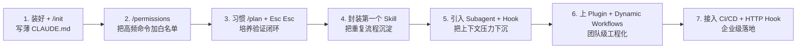

关键心法：

1. **流程大于提示词**：稳定的 Plan → Exec → Verify 比"超长 Prompt"更可靠
2. **永远给验证证据**：测试、构建、截图、第二意见
3. **机制最薄优先**：能用 CLAUDE.md 解决就不要写 Hook，能写 Hook 就不要造 Plugin
4. **缓存优先**：稳定前缀，频繁 `/cost`，必要时 `/compact`
5. **工程素养决定上限**：模块化、清边界、可验证——Claude Code 是放大器，不是补丁

---

## 参考文档

### 一、官方与概念

- [Claude Code by Anthropic](https://claude.com/product/claude-code)
- [Claude Code Docs (EN)](https://code.claude.com/docs/en/overview)
- [Claude Code Docs (中文) · Quickstart](https://code.claude.com/docs/zh-CN/quickstart)
- [Claude Code Docs (中文) · Best Practices](https://code.claude.com/docs/zh-CN/best-practices)
- [Claude Code Docs · Features Overview](https://code.claude.com/docs/en/features-overview)
- [Claude Code Docs · 设置](https://code.claude.com/docs/zh-CN/settings)
- [Claude Code Docs · 配置权限](https://code.claude.com/docs/zh-CN/permissions)
- [Model Context Protocol Introduction](https://modelcontextprotocol.io/docs/getting-started/intro)
- [anthropics/claude-code (GitHub)](https://github.com/anthropics/claude-code)
- [anthropics/claude-cookbooks](https://github.com/anthropics/claude-cookbooks)
- [anthropics/skills](https://github.com/anthropics/skills)

### 二、社区与最佳实践

- [Claude Code 完整配置指南（知乎）](https://zhuanlan.zhihu.com/p/1967578216769259179)
- [Claude Code 的配置与权限（知乎）](https://zhuanlan.zhihu.com/p/1951645531995612805)
- [Claude Code 权限配置完全指南（知乎）](https://zhuanlan.zhihu.com/p/2044730355807147165)
- [别让 Claude Code 一直问你（知乎）](https://zhuanlan.zhihu.com/p/2020783664926061754)
- [Claude Code 通关手册（二）：权限系统（腾讯云）](https://cloud.tencent.com/developer/article/2637675)
- [Superpowers + Claude Code 保姆级教程（腾讯云）](https://cloud.tencent.com/developer/article/2655487)
- [Claude Code 全新 Auto 模式（博客园）](https://www.cnblogs.com/javastack/p/19834855)
- [Claude Code 完全长文指南（博客园）](https://www.cnblogs.com/knqiufan/p/19449849)
- [Claude Code 多种模型随时切换（博客园）](https://www.cnblogs.com/hepingfly/p/19365701)
- [Claude Code 快速切换模型（知乎）](https://zhuanlan.zhihu.com/p/1994519994684428636)
- [Claude Code 权限配置 · 菜鸟教程](https://www.runoob.com/claude-code/claude-code-permission.html)
- [跳过 Claude Code 权限设置（Reddit）](https://www.reddit.com/r/ClaudeCode/comments/1r6xof9/heres_exactly_how_to_skip_permissions_in_claude/?tl=zh-hans)
- [AI-Coding-Guide-Zh · 基础使用完整指南](https://github.com/KimYx0207/AI-Coding-Guide-Zh/blob/main/docs/claude-code/02-%E5%9F%BA%E7%A1%80%E4%BD%BF%E7%94%A8%E5%AE%8C%E6%95%B4%E6%8C%87%E5%8D%97.md)
- [shanraisshan/claude-code-best-practice](https://github.com/shanraisshan/claude-code-best-practice)
- [farion1231/cc-switch](https://github.com/farion1231/cc-switch)
- [jhlee0409/claude-code-history-viewer](https://github.com/jhlee0409/claude-code-history-viewer)
- [obra/superpowers](https://github.com/obra/superpowers)
- [Claude Code 接入 GitHub Copilot（掘金）](https://juejin.cn/post/7624001138805456905)
- [Claude Code 接入 GitHub Copilot（Feisky）](https://feisky.xyz/posts/2025-07-11-claude-code-connect-github-copilot/)
