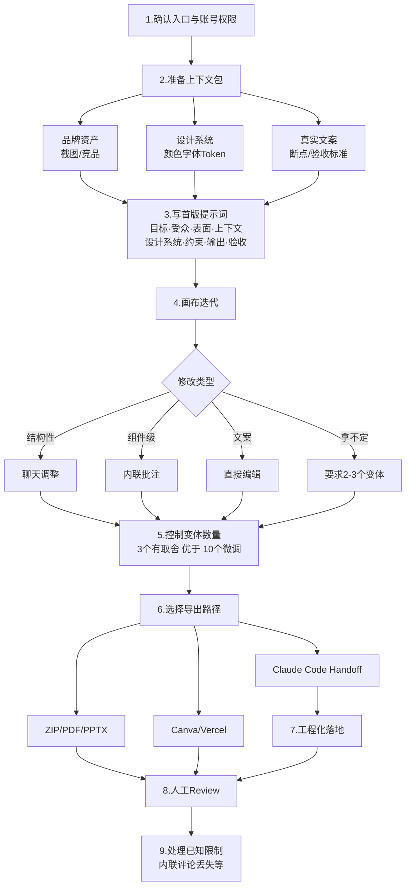
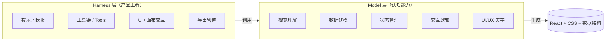
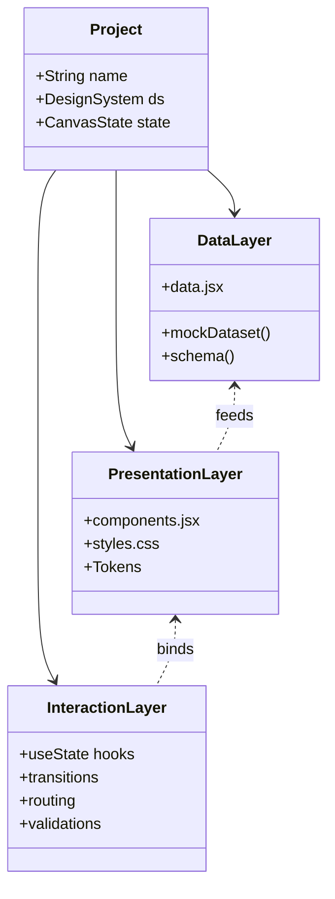
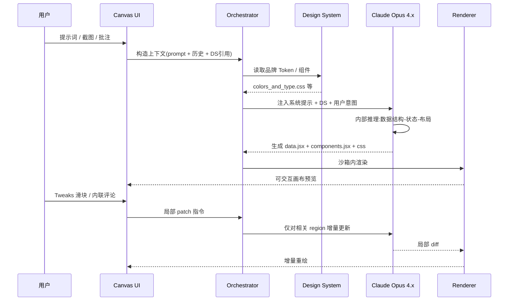
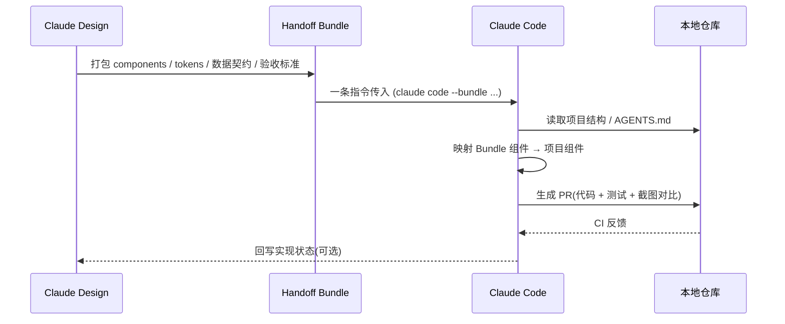
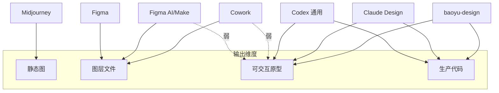
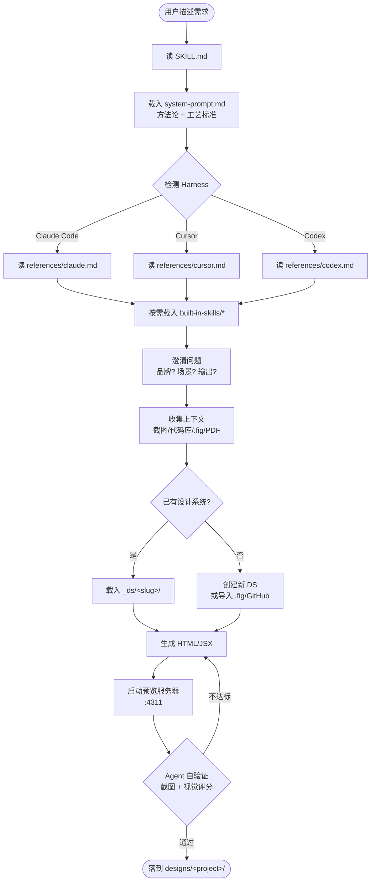
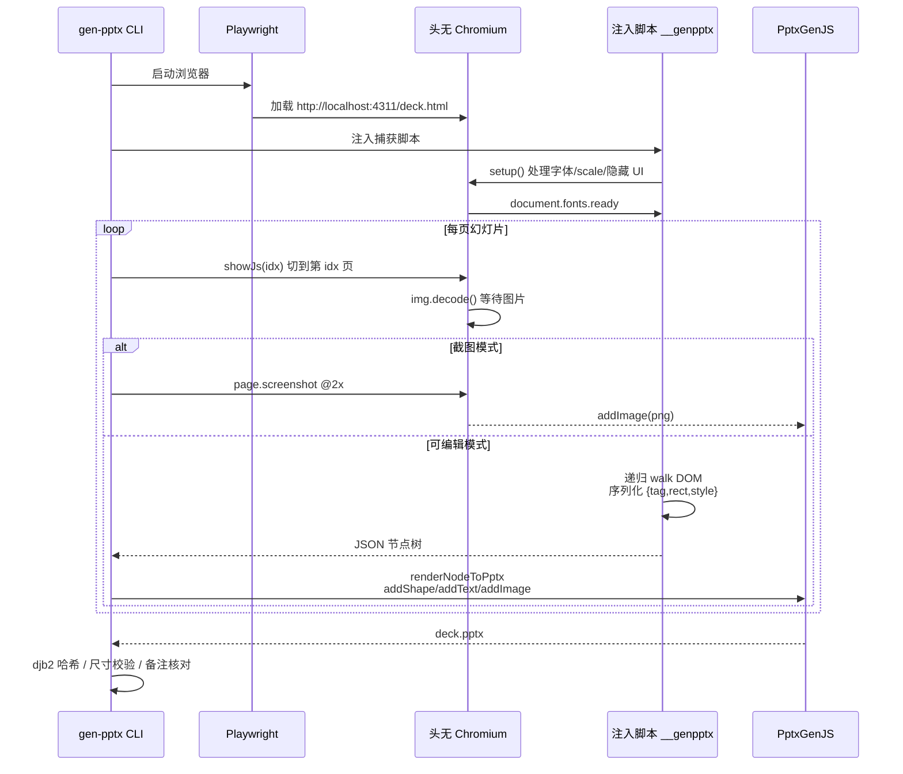
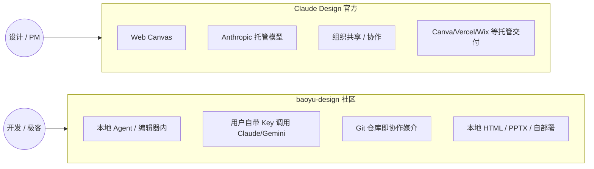
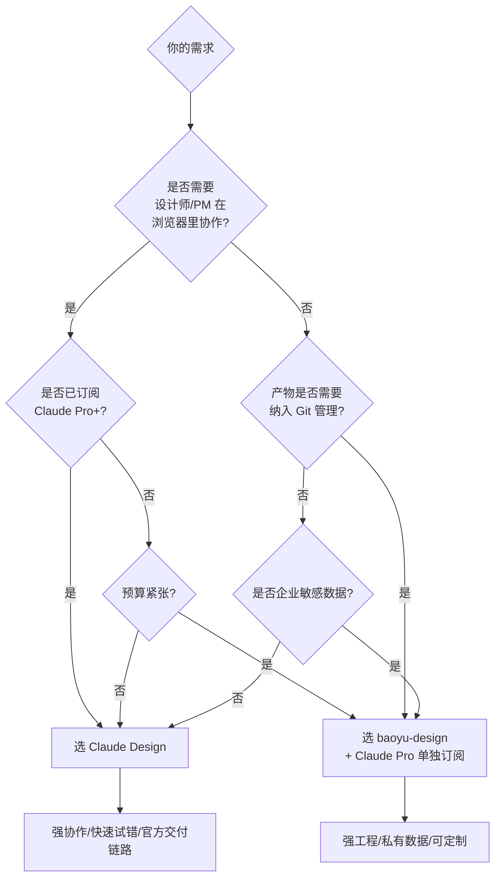

## 一、引言：当"会写代码的模型"开始做设计

2026 年 4 月，Anthropic 通过 Anthropic Labs 推出了 **Claude Design**——一个不再把设计稿当作静态图层、而是直接生成"可交互前端原型"的对话式设计工具。它最颠覆性的一点在于：输出物本质是 **代码（HTML / CSS / React + 数据结构）**，而不是 PSD 或 Figma 图层。

这意味着设计稿天然具备：状态、交互、可访问的真实组件、可以用 `git diff` 评审、可以一键交给 Claude Code 继续开发。本文基于官方文档、社区教程，以及由宝玉（Jim Liu）开源的 **baoyu-design** 项目，系统拆解 Claude Design 的能力边界、底层原理、与同类产品的差异，并给出实操建议。

---

## 二、Claude Design 是什么

Claude Design 是 Anthropic 于 2026 年 4 月 17 日发布的视觉创作工具，定位是 **Research Preview（研究预览）**，由 **Claude Opus 4.7 / 4.8** 视觉模型驱动。它的核心命题可以概括为一句话：

> 用自然语言对话，生成"看得见、点得动、可交付"的高保真原型。

与传统 AI 生图工具（Midjourney、DALL·E）的根本差异：
- **传统工具**：一次性出图，改稿要重写 prompt
- **Claude Design**：在一个持续的"设计画布"里，支持聊天、内联批注、参数滑块、变体对比的多轮迭代

与传统设计工具（Figma、Sketch）的差异：
- **传统工具**：图层操作，输出图像/原型链接
- **Claude Design**：输出是真实代码与数据，可直接被工程团队 fork、可直接被 AI Agent 二次加工

目标用户覆盖：
- 设计师（用来快速探索方向、批量试色试版）
- 产品经理（线框 → 高保真 → 原型，无需求设计排期）
- 创始人 / 市场 / 销售（生成 Pitch Deck、Landing Page、Brand Collateral）
- 不懂设计的工程师（凭品牌系统拉出统一风格的内部工具）

---

## 三、核心特性

Claude Design 的能力可以归纳为五个支柱：

**1. 对话式画布（Conversational Canvas）**
界面为两栏：左侧聊天，右侧画布。结构性调整走聊天（"把整体改成深色高密度仪表盘风格"），组件级调整走画布上的内联批注（"这个按钮缩到 32px 高、加 1px 边框"）。此外可以直接拖拽、对齐、双击改文案。

**2. 设计系统优先（Design System First）**
首次进入项目就引导导入设计系统：可以是 GitHub 仓库、设计文件、`.fig` 文件、原始截图，或者通过 Claude Code 的 `/design-sync` 命令把本地代码库的设计 Token 同步进来。模型生成时会持续**对照设计系统检查自己的输出**。企业版可以由管理员（Claude Design Admin 角色）锁定一份标准系统。

**3. 高保真可交互原型（Interactive Prototype）**
不只生成静态图，而是生成具有真实状态的可点击原型：导航能切换并保留状态、点赞按钮会变红、表单有校验、列表能滚动。

**4. Tweaks 调节器（自动生成的滑块）**
模型会自动暴露与当前画布有关的可调参数滑块（间距、圆角、主色饱和度、字号阶梯等），可以无需写 prompt 微调视觉。

**5. 多通道导出与交付**
- **格式**：PDF、PPTX、独立 HTML、ZIP
- **平台**：Canva、Adobe、Base44、Gamma、Lovable、Miro、Replit、Vercel、Wix
- **代码交接**：一键打包"Handoff Bundle"给 **Claude Code**（本地或 Claude Code Web），后者继续做工程化落地
- **分享**：组织内链接、查看 / 评论 / 编辑权限分级

---

## 四、使用入口与订阅

**入口**：
- 网页端 `claude.ai/design`
- Claude Desktop 侧边栏

它**不是**桌面安装包，也**不是**通过 Claude Code Skill 解锁的功能——这一点经常被混淆。

**订阅要求**：
- 支持 Pro、Max、Team、Enterprise 计划
- 个人 / 团队用户随订阅可用，受共享的使用额度限制（消耗的是统一的 Claude usage credits，没有独立的周配额）
- 企业版**默认关闭**，需管理员在组织设置中启用
- 超出额度后可启用 "extra usage" 继续使用

如果在账号里看不到入口，先检查：套餐是否在 rollout 范围内 → 是否企业账号被管理员关闭 → 是否需要等待功能上灰度。

---

## 五、典型使用场景

| 场景 | 输入 | 输出 |
|---|---|---|
| 产品线框稿 | 一句话需求 + 一张竞品截图 | 含完整状态机的低保真线框 |
| 高保真定价页 | 品牌截图 + 文案 | 3 套有取舍的视觉变体 |
| 引导流程原型 | 用户旅程描述 | 多步表单 + 校验 + 过渡动画 |
| Pitch Deck | PRD 或 Outline | 10–20 页 PPTX，含 Speaker Notes |
| Marketing 落地页 | 产品价值主张 | 响应式 Landing，可一键发 Vercel |
| 内部工具复刻 | 现有代码库 | 还原 UI 并产出独立 HTML |
| 设计系统建立 | `.fig` UI Kit | 含 Token / 组件 / 预览卡片的 DS |

---

## 六、推荐工作流（9 步法）

下面这张图给出从需求到交付的完整链路。



**第 3 步的提示词八要素**是 Claude Design 最值得固化的范式：

```
目标（要解决什么任务）
受众（谁在用、什么场景）
表面（Surface：移动端/桌面/平板）
上下文（产品所处赛道、品牌定位）
设计系统（DS 名称或现有 Token）
约束（必须遵守的规则，如可访问性 AA、字号下限）
输出（要几个变体、哪种导出格式）
验收（怎么算"做好了"——可量化的标准）
```

---

## 七、关键操作技巧

**1. 三种编辑通道按需切换**
- 整体方向错 → 聊天
- 某个组件错 → 内联批注（最精准）
- 文案接近正确 → 双击直接改

**2. 用 Save Version 做"安全网"**
不确定下一步迭代方向时，让 Claude "save this version" 再尝试新方向，可以随时回滚。

**3. 上下文是产出质量的天花板**
脏数据进、脏数据出。导入完整的设计系统、真实文案和清晰品牌素材，比一堆形容词更有效。

**4. 显式指定响应式与状态**
"移动端 375px 时折叠成抽屉""空态显示插画 + 引导 CTA"——这种具体指令明显优于"做得好看一点"。

**5. 善用 Claude Code 交接**
设计冻结后，使用 `/design-sync` 让本地 Claude Code 同步设计系统，再让它读取 Handoff Bundle 直接生成 React + 测试。

**6. 已知限制的绕行方案**
- 内联评论偶尔不显示 → 复制到聊天再发一次
- 大代码库导入卡 → 从 Claude Code 端发起，链接而非整库导入
- 看不到 `/design` 或 `/design-sync` 命令 → 跑 `/update` 后开新会话
- 多人同时编辑还不稳 → 用版本号分工

---

## 八、Claude Design 架构与原理解析

### 8.1 双层架构：Harness vs Model

宝玉在 [Codex Design Model Gap](https://baoyu.io/blog/2026-06-13/codex-design-model-gap) 中提出过精炼的拆解——任何 AI 产品都是**产品层（Harness）+ 模型层（Model）**：



Harness 是"厨房和菜谱"，模型是"厨师"。Harness 可以被复刻（baoyu-design 就是开源复刻），真正不可替代的是模型层。

### 8.2 输出物本质：不是图，是带数据结构的代码

Claude Design 的产物可以拆成三个分层：



模型在"画出像素"之前，会先把数据结构（如一条 Tweet 的字段）想清楚，再围绕这份"假数据"渲染 UI。这种**先建模再渲染**的思维方式，是它能产出"功能完整的原型"而不是"会动的图片"的核心原因。

### 8.3 从 Prompt 到画布的内部时序



要点：
- **DS 注入**贯穿每一轮生成，模型会"自我检查"是否偏离品牌
- **增量更新**而不是全量重生成，是画布交互流畅的工程基础
- **沙箱渲染**保障"代码可运行 + 安全可控"

### 8.4 Claude Code Handoff 的工作机制



Bundle 不只是 HTML，而是包含"设计意图 + 设计 Token + 验收清单"的可执行设计契约。

---

## 九、设计系统：DESIGN.md 规范

[VoltAgent/awesome-claude-design](https://github.com/VoltAgent/awesome-claude-design) 收录了 68 个以 **DESIGN.md** 为载体的品牌设计系统（Apple、Linear、Stripe、Ferrari 等）。它和 `AGENTS.md` 形成互补：

| 文件 | 受众 | 用途 |
|------|------|------|
| `AGENTS.md` | 编码 Agent | 怎么 **构建** 项目 |
| `DESIGN.md` | 设计 Agent | 项目应该 **如何呈现** |

DESIGN.md 的 9 段式标准结构：

1. **Visual Theme & Atmosphere**：基调、密度、情绪
2. **Color Palette & Roles**：语义 CSS 变量 + 十六进制色值
3. **Typography Rules**：字号阶梯 + Google Fonts 回退
4. **Component Stylings**：按钮、输入、卡片、导航的多状态
5. **Layout Principles**：间距阶梯、网格、留白
6. **Depth & Elevation**：阴影 Token、表面层级
7. **Do's and Don'ts**：硬约束
8. **Responsive Behavior**：断点、触摸目标、折叠规则
9. **Agent Prompt Guide**：可复用的提示词模板

将 DESIGN.md 喂给 Claude Design 后会自动产出：
- `README.md` 品牌叙述
- `colors_and_type.css`（CSS 变量 + 工具类）
- `preview/` 色板 / 字阶 / 间距 / 组件示例卡片
- 可工作的 UI Kit（`index.html` + 组件）
- `SKILL.md` ——一个可在后续项目里复用的便携技能文件

---

## 十、Claude Design 与同类产品对比



横向对比矩阵：

| 维度 | Midjourney | Figma + AI Make | Cowork | Codex (GPT) | **Claude Design** | **baoyu-design** |
|---|---|---|---|---|---|---|
| 主输出 | 图片 | Figma 图层 | Figma 图层 | 代码（弱视觉） | 可交互原型代码 | 可交互原型代码 |
| 多轮迭代 | 弱 | 中 | 中 | 强 | 强（画布+批注） | 强（Agent 对话） |
| 设计系统对齐 | 无 | 中 | 中 | 弱 | 强（持续校验） | 强（DS 锁版本） |
| 状态/交互建模 | 无 | 弱 | 弱 | 中 | 强 | 强 |
| PPTX 导出 | 无 | 间接 | 间接 | 无 | 原生 | 原生（gen_pptx CLI） |
| 工程交付 | 无 | 切图 | 切图 | 直接出代码 | Claude Code Handoff | 直接落地 |
| 本地化 / 私有 | 在线 | 在线 | 在线 | 在线 | 在线 | **本地** |
| 订阅 | 独立 | Figma | 独立 | OpenAI 套餐 | Claude Pro+ | 免费（依赖 Claude 套餐） |

**为什么 Codex（GPT-5.5）还没出 "Codex Design"？**
按宝玉的判断：差距不在 Harness，而在模型能力。Codex 能"画出像样的页面"，但很难在生成 UI 之前同步把数据结构 / 状态机 / 交互逻辑想清楚。Claude Opus 4.x 似乎被针对性地训练成了"先建模再绘图"的多模态架构师。Harness 容易被复刻，模型能力才是当前的护城河。

---

## 十一、baoyu-design 介绍

**[baoyu-design](https://github.com/JimLiu/baoyu-design)** 是宝玉（Jim Liu）开源的 **Claude Design 社区复刻版**——把 Anthropic 网页端的设计能力重新打包成 **Agent Skill**，能跑在 Cursor / Claude Code / Codex 以及 70+ 其他本地 AI 编辑器里。MIT 协议，已收获 1.8k stars、135 forks。

> 一句话：**在你自己的本地 Agent 上运行 Claude Design**。

它解决了官方版的几个痛点：
- 无需 Claude.ai 订阅 / 上传
- 产物落在 **本地项目目录**，可纳入 Git 版本管理
- 通过 Agent 自带的浏览器预览（Cursor Browser、Claude Preview、Codex Browser）做点选式迭代
- 完整开源，所有方法论可读、可改、可学习

### 11.1 子技能矩阵

| 类别 | 子技能 |
|---|---|
| 核心设计 | 高保真设计、可交互原型、线框图、前端美学方向 |
| 幻灯片 | 制作 Deck、Speaker Notes |
| 移动 / 动效 | 移动端原型、动画视频、音效 |
| 设计系统 | 创建 / 使用 / 预览 / 参数化 / `.dc.html` 组件 |
| 导入设计源 | Figma `.fig`（离线解码）、GitHub 仓库、HTML/CSS |
| 导出 / 交付 | HTML、PDF、PPTX（可编辑/截图）、MP4、Figma、Canva |
| AI 资产 | Gemini 图像生成、原型中调用 Claude、读取 PDF |

### 11.2 安装

```bash
# 当前项目
npx skills add JimLiu/baoyu-design

# 全局
npx skills add JimLiu/baoyu-design -g

# 指定 Agent
npx skills add JimLiu/baoyu-design --agent claude-code
```

或者直接把仓库 URL 发给 Agent，让它自行拉取。安装路径：
- Claude Code → `.claude/skills/baoyu-design/`
- Cursor / Codex → `.agents/skills/baoyu-design/`

### 11.3 预览服务器

多文件原型不能通过 `file://` 加载，必须起 HTTP：

```bash
python3 -m http.server 4311 --directory designs
```

---

## 十二、baoyu-design 架构与原理

### 12.1 目录结构

```
skills/baoyu-design/
├── SKILL.md              # 入口：编排整个流程
├── system-prompt.md      # 设计方法论与工艺标准
├── references/
│   ├── claude.md         # Claude Code 工具映射
│   ├── cursor.md         # Cursor 工具映射
│   └── codex.md          # Codex 工具映射
├── built-in-skills/      # 专项子技能
└── starter-components/   # 设备外壳、画布、Deck 舞台等
```

设计理念：**方法论与 Harness 解耦**。`system-prompt.md` 定义"什么是好设计"是 Agent 无关的；`references/*.md` 把"在 Cursor 里怎么截图""在 Codex 里怎么发问"等环境差异隔离开。

### 12.2 执行流



### 12.3 设计系统的本地落盘

baoyu-design 对每个项目都会复制一份**自包含 + 版本锁定**的设计系统：

```
designs/
├── _ds/
│   └── linear-style/      # 完整 DS 副本
│       ├── colors_and_type.css
│       ├── components/
│       └── SKILL.md
├── _d_meta.json           # 项目 ↔ DS 绑定关系
└── my-saas-dashboard/     # 项目 1
    ├── preview.html
    ├── data.jsx
    └── components/
```

`_d_meta.json` 记录每个项目用了哪个主系统、哪个版本、哪些辅助系统。设计系统升级不会破坏已交付项目。

### 12.4 Figma `.fig` 离线解码

无需 Figma 账号 / API Token / MCP，直接用 vendored 解码器把 `.fig` 二进制解开成：
- 语义化组件树
- CSS Token
- 原样保留的 SVG / PNG 资产

之后等同于"导入了一个完整 DS"。

### 12.5 PPTX 导出：在真实浏览器里渲染再翻译

`agents/gen-pptx/` 是 baoyu-design 最有工程趣味的部分。核心思路：**不解析 HTML，而是用 Playwright 在无头 Chromium 里渲染再翻译**。



关键换算：`px ÷ 96 = 英寸`、`px × 0.75 = pt`。

构建步骤：
```bash
cd skills/baoyu-design/agents/gen-pptx
npm install
npx playwright install chromium
npm run build
```

---

## 十三、Claude Design vs baoyu-design 详细对比



| 维度 | Claude Design | baoyu-design |
|---|---|---|
| 运行位置 | Anthropic 云端 | 本地 Agent 进程 |
| 入口 | claude.ai/design | 编辑器内 Skill 触发 |
| 模型 | Claude Opus 4.7/4.8（Anthropic 托管） | 任意支持 Skills 的 Agent（推荐 Opus 4.8） |
| 订阅 | Pro/Max/Team/Enterprise | 免费开源（但调用模型时消耗各家额度） |
| 协作 | 链接分享、组织共享、评论 | Git 仓库 + 代码评审 |
| 设计系统 | 项目内持久化 + Admin 锁定 | `_ds/<slug>/` 本地复制 + `_d_meta.json` |
| 导入 `.fig` | 支持 | 支持（离线解码，更彻底） |
| PPTX 引擎 | 内置 `gen_pptx`（不可见） | 开源 Playwright + PptxGenJS CLI |
| 交接代码 | 一键 Handoff Bundle → Claude Code | Agent 本身就在写代码，无需交接 |
| 数据归属 | 在 Anthropic 服务端 | 全部在用户本地 |
| 适合人群 | 设计师 / 产品 / 跨职能协作 | 工程师 / 重度 Agent 用户 / 注重私有化 |

**两者关系**：baoyu-design 是 Claude Design 的开源 Harness 复刻，方法论与产出格式一致，差别在执行环境。**底层模型一致时，二者最终效果可比；不一致时（如换成 GPT 系列），效果会有明显差距。**

---

## 十四、选型建议



一些更细的判断规则：

- **要做 Pitch Deck / 提案，且团队不会写代码**：选 Claude Design。
- **要做需要 Git 版本化的产品原型**：选 baoyu-design。
- **企业数据合规要求高、不能上云**：baoyu-design + 本地推理或自部署网关。
- **既要 Web 协作又要代码可控**：先用 Claude Design 敲定方向，再 Handoff 到 Claude Code，工程仓库可同时用 baoyu-design 作为"设计 Linter"。

---

## 十五、未来趋势与局限

**趋势**：
1. **设计稿即代码**会从 Claude Design 这一类工具扩散到 Figma、Cowork 等传统软件，"设计师交付 JPG" 的时代正在结束。
2. **DESIGN.md** 有望成为类似 `package.json` 的事实标准，被工具链统一识别。
3. 模型层竞争白热化后，Harness 的差异会越来越快收敛——决定胜负的是**哪个模型先把"先建模再绘图"做得更稳**。

**当前局限**：
- 内联评论丢失、多人编辑不稳定、PPTX 偶发字体替换问题
- 复杂 SaaS 内部工具仍需大量人工 review，模型容易在权限矩阵、长表单等场景"瞎编 UI"
- 设计原创性问题：模型训练数据覆盖了大量主流 UI，输出容易"似曾相识"
- 对可访问性、深色模式、国际化（特别是 CJK 排版）的支持仍弱于专业设计师

---

## 十六、总结

Claude Design 重新定义了 AI 时代"设计稿"应该是什么：**不是图，而是带有数据、状态、组件契约的可交互前端**。它的颠覆点不在于"会画 UI"——这件事很多模型都能做——而在于让模型在动笔前先思考数据建模、状态机和交互逻辑。Claude Opus 4.x 当前的核心竞争力就建立在这个能力上。

baoyu-design 是这套方法论的开源镜像，把 Anthropic 的产品工程层（Harness）拆开、抽象、移植到任何本地 Agent 上，让任何团队都能"在自己的 IDE 里跑一遍 Claude Design"。两者的取舍在于：要协作便利就选官方，要工程可控、数据归属、Git 版本化就选社区版。

对个人和团队的实用建议：

1. **建立你自己的 DESIGN.md**，让所有 AI 设计工具产出风格一致。
2. **把设计稿和代码放进同一个仓库**，让设计也能 Code Review。
3. **熟悉 Handoff Bundle 工作流**，让设计、原型、生产代码三态可逆。
4. **不要迷信工具，沉淀方法论**——`system-prompt.md` 比任何按钮都更值得反复打磨。

当设计完全融入 Git、CI 和 Agent 流水线，"设计师"和"工程师"的边界会进一步模糊。Claude Design 只是这场变革的第一个产品形态，但它指出的方向已经足够清晰：**设计即代码，对话即工具，原型即真实。**

---

### 参考文档
- https://claude.ai/design
-  [Introducing Claude Design by Anthropic Labs \ Anthropic](https://www.anthropic.com/news/claude-design-anthropic-labs) 
- [Get started with Claude Design | Claude Help Center](https://support.claude.com/en/articles/14604416-get-started-with-claude-design) 
-  [VoltAgent/awesome-claude-design: Awesome Claude Design: 68 ready-to-use design system inspirations in DESIGN.md format. Drop one in, scaffold a full UI in one shot.](https://github.com/VoltAgent/awesome-claude-design) 
- https://github.com/JimLiu/baoyu-design
- https://github.com/JimLiu/baoyu-design/blob/main/README.zh-CN.md
- [为啥 Codex 还不推出类似 Codex Design 的产品？ | 宝玉的分享](https://baoyu.io/blog/2026-06-13/codex-design-model-gap) 
-  [(99+ 封私信) 2026 Claude Design 完整指南：功能介绍+使用教程+Claude会员订阅方法 - 知乎](https://zhuanlan.zhihu.com/p/2029634498711630707)
-  [Claude Design 怎么用：入口、设计系统准备、提示词和 Claude Code 交接 | YingTu](https://yingtu.ai/zh/blog/how-to-use-claude-design) 
-  [教學｜Claude Design 怎麼用？９步驟圖解、３亮點實操，比 Cowork 好用在這！|經理人](https://www.managertoday.com.tw/articles/view/72033?) 

