## 一、Function Calling 是什么

Function Calling（函数调用，也叫 Tool Calling、Tool Use）是大型语言模型（LLM）的一项核心能力：在对话过程中，模型能够识别用户意图，并以结构化的 JSON 格式输出一条"应当调用某个外部函数 / API"的指令，由宿主程序去真正执行函数，再把执行结果回喂给模型继续推理。

需要特别澄清两点常见误解：

第一，**模型本身并不执行函数**。"Function Calling"这个名字容易让人以为模型会自己跑代码、自己请求 API，实际上模型只负责"决定调谁、填什么参数"，真正的函数调用和副作用（数据库写入、API 请求、本地脚本执行等）都发生在宿主程序里。OpenAI 官方文档对此有明确说明。

第二，**Function Calling 的本质是"结构化输出 + 工具协议"**。它给模型与外部系统的协作定下了一份契约：模型输出一定符合 JSON Schema 的调用指令，宿主据此分发执行，再以约定格式回传结果。一些社区也称其为 Tool Calling、API Planning、Structured Action Generation，含义都更准确——它是大模型走向 Agent 的基石能力。

一句话理解：Function Calling 让大模型从"只会说"升级成"能做"，让它从一个聪明但手无寸铁的顾问，变成一个能伸手取数据、能动手做操作的智能体。

## 二、出现背景与发展历程

Function Calling 并非凭空出现，它解决的是大模型早期落地工程时两类切实痛点。

**第一个痛点：训练数据的时效性与领域局限。** 大模型的参数权重在训练完成那一刻就被冻结，对训练截止日之后发生的事情一无所知，对企业内部的实时数据、订单状态、库存、CRM 也完全无法访问。早期开发者用 RAG 把检索到的内容塞回 Prompt 来补救，但 RAG 只能"读"，无法"写"，更无法触发任何业务动作。

**第二个痛点：非结构化文本无法被下游程序直接消费。** 你想让模型帮你"查北京天气然后返回 JSON"，纯 Prompt 方式下，模型可能会在 JSON 前后加上一段客套话、可能会写成 YAML、可能会缺关键字段。开发者只能写一大堆正则、Few-shot 例子、System Prompt 去硬约束，鲁棒性极差。

OpenAI 在 2023 年 6 月的 `gpt-3.5-turbo-0613` 和 `gpt-4-0613` 版本中首次发布 Function Calling 能力，把"工具描述（JSON Schema）"作为请求的一等公民，并保证模型严格按 schema 输出。整条发展路径大致如下：

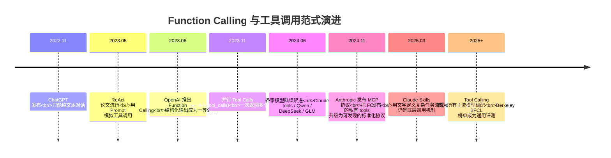

到 2025 年，几乎所有主流模型（Qwen-Max/Plus、DeepSeek、GLM、Kimi、MiniMax、Claude、Gemini、Llama 等）都已原生支持工具调用，BFCL（Berkeley Function-Calling Leaderboard）也成为业内公认的工具调用评测榜。

## 三、核心概念与功能特性

理解 Function Calling 需要把几个关键概念分清楚。

**Tool（工具）**：一个可被模型调用的能力单元，最常见的形式就是一个函数。每个 Tool 由 `name`、`description`、`parameters`（JSON Schema）三要素描述。

**Tool Definition（工具定义）**：宿主程序在每次请求时通过 `tools` 字段告知模型当前会话中可用哪些工具，结构是一个数组，每个元素是一个 `function` 对象。模型不会"记住"工具，它只在看到 tools 字段时才知道有这些工具。

**Tool Call（工具调用指令）**：模型在响应中产出的"我打算调用这个函数，参数是这些"的结构化指令，关键字段是 `tool_calls[].id`、`function.name`、`function.arguments`（**注意 arguments 是 JSON 字符串而不是对象**）。

**Tool Result（工具结果）**：宿主执行完工具后，以 `role: "tool"` 的消息追加到 messages 数组，必须带上 `tool_call_id` 与原调用对应，`content` 字段放工具返回（必须是字符串，结构化结果建议 `json.dumps`）。

**核心功能特性**可以概括为五条：

- **结构化决策**：模型输出严格符合 JSON Schema 的调用指令，宿主无须再做自然语言解析。
- **多工具感知**：tools 数组可以一次声明多个函数，模型会基于 `description` 和参数 schema 自行选最合适的。
- **并行调用**：开启 `parallel_tool_calls=True` 后，一次响应可以返回多个 tool_calls（例如"查询北京和上海的天气"）。
- **追问能力**：当必填参数从用户 Query 中抽不出来时，模型会以自然语言反问用户，而不是瞎填——这是 Agent 路由里最关键的优势之一。
- **可控触发**：通过 `tool_choice` 控制是否强制调用、不调用、或指定某个工具。

## 四、工作原理

Function Calling 的工作原理可以从"工程链路"和"模型机理"两个角度来看。

### 4.1 工程链路：两次模型调用形成的闭环

整条链路至少包含两次与模型的交互——第一次让模型决策调谁，第二次让模型基于工具结果总结作答。

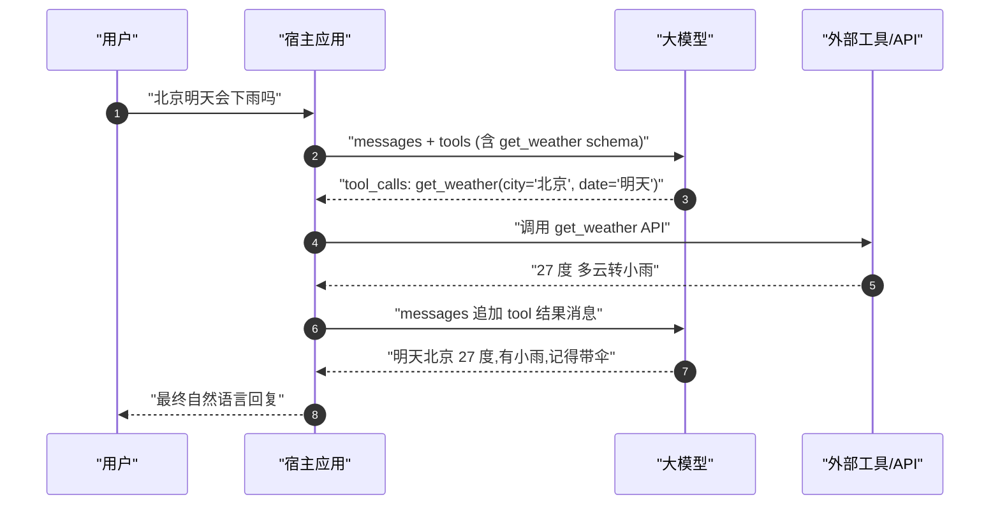

messages 数组在一次完整对话后会包含以下五种角色的消息：

```text
[
  System Message     -- 指引模型调用工具的策略
  User Message       -- 用户的问题
  Assistant Message  -- 第一次回复,含 tool_calls
  Tool Message       -- 工具的执行结果,带 tool_call_id
  Assistant Message  -- 第二次回复,自然语言总结
]
```

### 4.2 模型机理：为什么模型能稳定输出 JSON

很多人会问：模型本质上是"下一个 token 预测器"，为什么遇到工具调用场景就能稳稳地吐 JSON、不夹带任何客套话？答案有三层：

第一，**函数定义即上下文（schema-as-context）**。`tools` 字段中的 name/description/parameters 会被序列化成 token 序列喂进模型上下文，模型并不是"从权重里记住"了这些工具，而是"读完上下文"才知道这些工具存在。

第二，**专项训练**。各厂商在指令微调、对话微调阶段都喂入了大量"用户请求 → 函数定义 → JSON 调用 → 工具结果 → 自然语言回答"的训练样本，并配合 RLHF 强化"识别需调用工具 → 抽参数 → 严格守 schema → 不臆造结果 → 拿到结果继续推理"等行为。

第三，**约束解码（Constrained Decoding）**。部分厂商在推理时会启用 JSON Schema 约束解码（如 OpenAI Structured Outputs），保证输出 100% 合法。

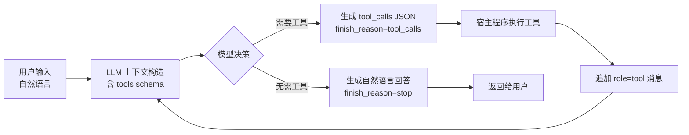

## 五、实现方式：原生 Function Calling vs ReAct Prompt

让 LLM 调用工具有两条主路径，理解它们的差异能帮你在不同模型、不同业务场景下做合理选型。

**路径一：原生 Function Calling**。模型在训练阶段就喂了大量工具调用样本，宿主只需以 `tools` 字段声明 JSON Schema，模型直接输出结构化的 `tool_calls`。这是 OpenAI、Claude、Qwen、Gemini 等模型推荐的方式，输出稳定、token 消耗少。

**路径二：ReAct Prompt（Reasoning + Acting）**。对于不支持原生 FC 的模型，用 Prompt 模板把工具调用写成 "Question / Thought / Action / Action Input / Observation / ... / Final Answer" 的循环，靠停止词（stop words）截断模型输出，宿主解析后执行工具，把结果拼接到 Observation 后再次调用模型，直到出现 Final Answer。

两条路径的对比：

| 维度 | 原生 Function Calling | ReAct Prompt |
|---|---|---|
| 对模型要求 | 高，需训练数据覆盖工具调用 | 低，任何指令跟随模型均可 |
| Prompt 复杂度 | 简单，定义 schema 即可 | 复杂，需精心设计模板和示例 |
| Token 消耗 | 少 | 多（模板、示例、停止词均占 token） |
| 输出稳定性 | 高（结构化、错误率低） | 中（自由文本易格式错误） |
| 推理透明度 | 黑箱、确定性强 | CoT 透明，支持动态反思 |
| 跨模型迁移 | 受限（各家 API 略有差异） | 强（理论上适配所有 LLM） |
| 适用场景 | 追求快速、稳定、结构化输出 | 高度定制、灵活、需可解释 |

实际工程里两者常常混用：**FC 出框架 + Prompt 做规划**——用 FC 保证工具调用的稳定性，用 Prompt 给模型补充任务规划与上下文。Cline、Roo Code、Cursor 等 IDE 类 Agent 因为要适配多家模型厂商，目前仍以 Prompt Engineering 为主，配合对 Claude/GPT 等强模型的原生 FC 支持。

## 六、如何使用

下面用一个完整的"查天气"场景演示原生 Function Calling 的标准用法，代码基于 OpenAI Python SDK（Qwen 也完全兼容这一接口）。

```python
from openai import OpenAI
import json, os, random

client = OpenAI(
    api_key=os.getenv("DASHSCOPE_API_KEY"),
    base_url="https://dashscope.aliyuncs.com/compatible-mode/v1",
)

# 1. 声明工具
tools = [{
    "type": "function",
    "function": {
        "name": "get_current_weather",
        "description": "查询指定城市的实时天气。当用户询问任意城市的当前天气时调用。",
        "parameters": {
            "type": "object",
            "properties": {
                "location": {
                    "type": "string",
                    "description": "城市或区县,如 北京市、杭州市、余杭区",
                },
                "unit": {
                    "type": "string",
                    "enum": ["celsius", "fahrenheit"],
                    "description": "温度单位,默认 celsius",
                },
            },
            "required": ["location"],
        },
    },
}]

# 2. 工具实现
def get_current_weather(location: str, unit: str = "celsius"):
    weather = random.choice(["晴", "多云", "雨"])
    temp = random.randint(15, 32)
    return f"{location}当前{weather},气温 {temp} {unit}"

TOOL_REGISTRY = {"get_current_weather": get_current_weather}

# 3. 主循环
def run(user_input: str):
    messages = [
        {"role": "system", "content": "你是天气助手,需要查询信息时务必调用工具。"},
        {"role": "user", "content": user_input},
    ]
    for _ in range(5):  # 最多 5 轮防死循环
        resp = client.chat.completions.create(
            model="qwen-plus",
            messages=messages,
            tools=tools,
            tool_choice="auto",
        )
        msg = resp.choices[0].message
        messages.append(msg)  # 把 assistant 消息(含 tool_calls)追加

        if not msg.tool_calls:
            return msg.content

        # 4. 执行所有工具调用(支持并行)
        for tc in msg.tool_calls:
            args = json.loads(tc.function.arguments)
            result = TOOL_REGISTRY[tc.function.name](**args)
            messages.append({
                "role": "tool",
                "tool_call_id": tc.id,
                "content": str(result),
            })
    raise RuntimeError("超过最大迭代次数")

print(run("北京和上海今天天气怎么样"))
```

**返回的 tool_calls 结构**示意：

```json
{
  "role": "assistant",
  "content": "",
  "tool_calls": [
    {
      "id": "call_6596dafa2a6a46f7a217da",
      "type": "function",
      "function": {
        "name": "get_current_weather",
        "arguments": "{\"location\": \"北京市\"}"
      }
    },
    {
      "id": "call_7b3afbe5cc1b48b1be4c2a",
      "type": "function",
      "function": {
        "name": "get_current_weather",
        "arguments": "{\"location\": \"上海市\"}"
      }
    }
  ]
}
```

注意 `arguments` 是 JSON 字符串而不是对象，**调用前必须 `json.loads`**；并行调用时每个 tool_call 都有独立的 id，回传结果时必须用对应 id 关联。

## 七、核心参数配置

Function Calling 链路涉及的关键参数集中在三处：`tools` 数组、`tool_choice`、以及 `parallel_tool_calls`。

**tools**：声明工具列表，每个元素是 `{"type": "function", "function": {...}}`。`function.parameters` 使用 JSON Schema 描述入参，常用关键字：

- `type: "object"` — 顶层固定为 object
- `properties` — 各参数的名称、类型、描述
- `required` — 必填参数数组
- `enum` — 限制取值范围，是最强的语义约束
- `default` — 提供默认值，模型在抽不到参数时会考虑使用

**tool_choice**：控制模型是否、以及如何调用工具：

| 取值 | 含义 |
|---|---|
| `"auto"`（默认） | 模型自主判断是否调用 |
| `"none"` | 强制不调用工具，直接生成文本 |
| `"required"` | 强制至少调用一个工具（适合 Router 场景） |
| `{"type":"function","function":{"name":"xxx"}}` | 强制调用指定工具 |

工程上常见的一个坑是：第二次（让模型总结结果）调用时**必须把 `tool_choice` 改回 `"auto"`（或省略）**，否则模型会继续返回 tool_calls 而不是自然语言总结。

**parallel_tool_calls**：默认 `True`，允许模型一次响应输出多个 tool_calls。如果你的工具有强依赖关系（B 需要 A 的结果），应显式设置为 `False`，强制模型串行调用。

**其他建议参数**：

- `temperature=0` 或较低值（如 0.2）——工具调用场景追求确定性，过高的温度会增加幻觉。
- `max_tokens` 留足够空间给 tool_calls JSON——尤其参数复杂时容易被截断。
- `stream=True` ——交互式 Agent 必备，详见第十三节流式输出。

## 八、Function Calling 在 AI Agent 中的角色

如果说 LLM 是 Agent 的大脑，Function Calling 就是 Agent 的"神经-肌肉接口"。在一个典型 Agent 架构里，FC 同时承担三个角色：

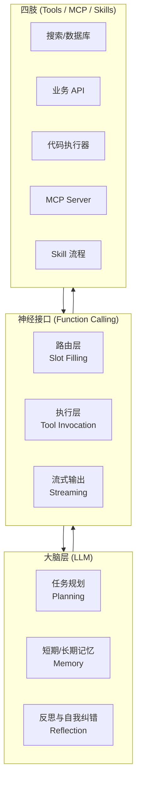

**角色一：Agent 路由器（Router）**。在多 Agent 或多技能架构中，"用户这句话属于哪个子 Agent"是路由问题。传统做法是让 LLM 选 A 或 B，容易瞎猜。FC 路由的高明之处是把它转化为"槽位填充（Slot Filling）"——给每个子 Agent 写一份 Input Schema（带 `enum` 和 `required`），让 LLM 判断"这句话能填满谁的必填槽？"——填不满就触发追问，天然实现拒识。

**角色二：能力执行器（Executor）**。Agent 真正"做事"靠的就是 FC 把意图转化为可执行的函数调用。无论是搜索、写数据库、调外部 API、跑代码，最终都收敛到一次 tool_call。

**角色三：上下文与状态衔接**。FC 的 messages 协议（assistant tool_calls ↔ tool result）天然把工具结果纳入对话历史，让模型在多轮交互中持续保有"我做了什么、得到了什么"的记忆。

## 九、Function Calling 解决了什么问题

回到最初的两个痛点，再加上工程化落地后涌现的若干新价值，Function Calling 实际上解决了五大类问题：

第一，**突破知识截止与领域边界**。让模型接入实时数据源（天气、股价、订单状态、CRM）。

第二，**结构化输出契约**。把模型输出从"自由文本"升级为"严格 JSON Schema"，下游程序可直接消费，零自然语言解析成本。

第三，**业务自动化能力**。模型不再只能"读"，还能"写"——下单、退款、发邮件、改配置、推任务……一切可 API 化的操作都能被自然语言驱动。

第四，**多步骤任务编排**。一次对话里多次工具调用串接出复杂业务流程（订票 + 订酒店 + 加日历 + 发提醒），形成端到端自动化。

第五，**Agent 框架的底层契约**。LangChain、AutoGPT、Lynxe 等所有 Agent 框架的工具调用最终都收敛到 FC 协议，使得不同框架、不同模型可以互通。

## 十、实际应用场景

| 类别 | 典型场景 | 代表工具 |
|---|---|---|
| 实时信息查询 | 天气、新闻、股价、汇率、航班 | get_weather / search_news / get_stock_price |
| 企业内部系统 | 订单查询、库存盘点、考勤、HR | query_order / check_inventory / get_leave_balance |
| 数据分析 | 数据库查询、报表生成、图表绘制 | run_sql / generate_chart / pivot_table |
| 内容生成辅助 | 翻译、语法检查、SEO 优化 | translate / grammar_check / seo_audit |
| 智能家居 | 控制灯光、空调、窗帘 | set_light / set_ac_temp |
| 旅行规划 | 机票、酒店、行程、地图、日历 | book_flight / book_hotel / add_to_calendar |
| 代码助手 | 代码生成、单测、Lint、Git 操作 | run_code / git_commit / lint_file |
| 客服自动化 | 工单创建、知识库检索、回访 | create_ticket / search_kb / send_email |

## 十一、从 0 实现一个 Function Calling

不依赖任何框架，从零写一个能跑的 Function Calling Agent，骨架其实只有 30 行 Python。理解这个最简实现，有助于看穿 LangChain、AiServices 等高阶框架的本质。

```python
# === 极简 Function Calling Agent ===
import json
from openai import OpenAI

client = OpenAI()

# 1. 本地工具注册表
def add(a: int, b: int) -> int:
    return a + b

TOOLS_REGISTRY = {"add": add}

# 2. 工具 schema 列表(可手写也可由装饰器/反射自动生成)
TOOLS_SCHEMA = [{
    "type": "function",
    "function": {
        "name": "add",
        "description": "两个整数相加",
        "parameters": {
            "type": "object",
            "properties": {
                "a": {"type": "integer"},
                "b": {"type": "integer"},
            },
            "required": ["a", "b"],
        },
    },
}]

# 3. Agent 主循环
def agent(user_input: str, max_steps: int = 10) -> str:
    messages = [{"role": "user", "content": user_input}]
    for _ in range(max_steps):
        resp = client.chat.completions.create(
            model="gpt-4o-mini",
            messages=messages,
            tools=TOOLS_SCHEMA,
        )
        msg = resp.choices[0].message
        messages.append(msg)

        if not msg.tool_calls:
            return msg.content  # 终止条件

        for tc in msg.tool_calls:
            fn = TOOLS_REGISTRY[tc.function.name]
            args = json.loads(tc.function.arguments)
            result = fn(**args)
            messages.append({
                "role": "tool",
                "tool_call_id": tc.id,
                "content": json.dumps(result),
            })
    raise RuntimeError("max steps exceeded")
```

把这 30 行扩展为生产级实现，只需要在三个维度补充能力：

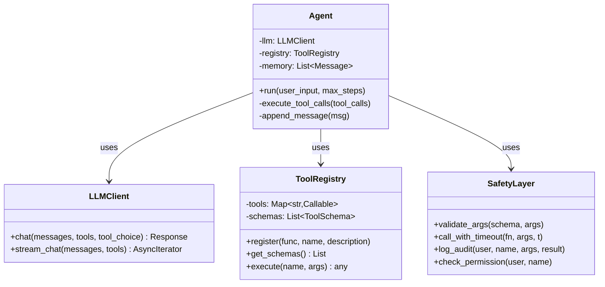

- `LLMClient`：屏蔽 OpenAI / Anthropic / Qwen / 本地模型的 API 差异。
- `ToolRegistry`：用装饰器（如 `@tool`）一处声明，自动派生 JSON Schema，避免"函数和 Schema 两处都要改"的脆弱性。
- `Agent`：编排 LLMClient + ToolRegistry，实现 agent loop、step 上限、异常重试、记忆裁剪。
- `SafetyLayer`：参数校验、超时控制、错误回喂、权限鉴权、审计日志。

## 十二、实战 Demo：可运行的天气查询 Agent

把第六节代码稍作扩展，加上工具装饰器、错误处理、多轮对话，就是一个完整的可演示 Demo：

```python
import json, random, inspect, time
from openai import OpenAI

client = OpenAI()
TOOLS: dict = {}
SCHEMAS: list = []

def tool(description: str):
    """简易工具装饰器:函数即工具"""
    def deco(fn):
        sig = inspect.signature(fn)
        params, required = {}, []
        for name, p in sig.parameters.items():
            t = "string"
            if p.annotation is int: t = "integer"
            elif p.annotation is float: t = "number"
            elif p.annotation is bool: t = "boolean"
            params[name] = {"type": t}
            if p.default is inspect.Parameter.empty:
                required.append(name)
        SCHEMAS.append({
            "type": "function",
            "function": {
                "name": fn.__name__,
                "description": description,
                "parameters": {
                    "type": "object",
                    "properties": params,
                    "required": required,
                },
            },
        })
        TOOLS[fn.__name__] = fn
        return fn
    return deco

@tool("查询指定城市的当前天气")
def get_weather(city: str):
    return {"city": city, "temp": random.randint(10, 30),
            "weather": random.choice(["晴", "雨", "雪"])}

@tool("查询指定日期的农历节日")
def get_lunar_festival(date: str):
    fake = {"2026-02-17": "春节", "2026-09-25": "中秋"}
    return fake.get(date, "无")

def safe_execute(name, args):
    try:
        start = time.time()
        result = TOOLS[name](**args)
        return {"ok": True, "result": result,
                "elapsed_ms": int((time.time()-start)*1000)}
    except Exception as e:
        return {"ok": False, "error": str(e)}

def chat(user_input, history=None, max_steps=8):
    messages = history or []
    messages.append({"role": "user", "content": user_input})
    for _ in range(max_steps):
        msg = client.chat.completions.create(
            model="gpt-4o-mini",
            messages=messages,
            tools=SCHEMAS,
        ).choices[0].message
        messages.append(msg)
        if not msg.tool_calls:
            return msg.content, messages
        for tc in msg.tool_calls:
            args = json.loads(tc.function.arguments)
            result = safe_execute(tc.function.name, args)
            messages.append({"role": "tool", "tool_call_id": tc.id,
                             "content": json.dumps(result, ensure_ascii=False)})
    return "exceeded", messages

if __name__ == "__main__":
    ans, _ = chat("查一下北京今天天气,顺便看看 2026-02-17 是什么节日")
    print(ans)
```

输出示例：

```text
北京今天 21°C 晴。2026 年 02 月 17 日是春节。
```

可以看到，模型在一次响应里并行触发了两个 tool_calls，分别拿到天气和节日，再合成最终答复——这正是 `parallel_tool_calls=True` 带来的工程红利。

## 十三、流式输出（Streaming）的实现

生产环境的 Agent 几乎都要做流式输出，否则用户要等几秒才看到第一个字。但流式 + Function Calling 比纯文本流式复杂得多，关键挑战在于：

**`tool_calls.function.arguments` 是 JSON 字符串，会被切成多段返回**——例如 `{"city":"北` → `京","date":"to` → `day"}`，**中间任何一段都不是合法 JSON，绝不能 `json.loads`**。

正确的处理流程是三步：

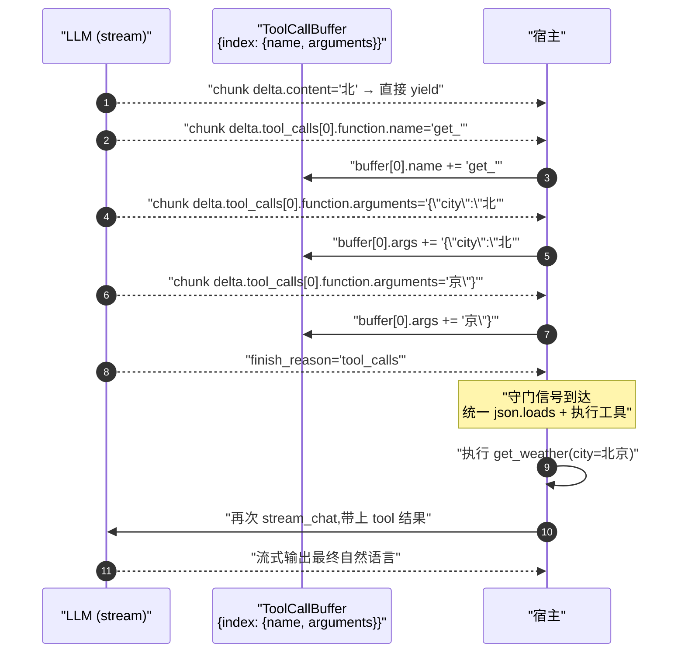

最小可行的 Python 实现：

```python
from collections import defaultdict
import json

async def stream_agent(user_input):
    messages = [{"role": "user", "content": user_input}]
    while True:
        buffer = defaultdict(lambda: {"name": "", "args": "", "id": ""})
        finish_reason = None
        async for chunk in client.chat.completions.create(
            model="gpt-4o-mini",
            messages=messages,
            tools=SCHEMAS,
            stream=True,
        ):
            delta = chunk.choices[0].delta
            if delta.content:
                yield ("text", delta.content)
            if delta.tool_calls:
                for tc in delta.tool_calls:
                    slot = buffer[tc.index]
                    if tc.id: slot["id"] = tc.id
                    if tc.function and tc.function.name:
                        slot["name"] += tc.function.name
                    if tc.function and tc.function.arguments:
                        slot["args"] += tc.function.arguments
            if chunk.choices[0].finish_reason:
                finish_reason = chunk.choices[0].finish_reason

        if finish_reason != "tool_calls":
            return

        # 统一执行
        assistant_msg = {"role": "assistant", "content": "", "tool_calls": []}
        for idx, slot in buffer.items():
            assistant_msg["tool_calls"].append({
                "id": slot["id"], "type": "function",
                "function": {"name": slot["name"], "arguments": slot["args"]},
            })
        messages.append(assistant_msg)
        for idx, slot in buffer.items():
            args = json.loads(slot["args"])
            result = TOOLS[slot["name"]](**args)
            messages.append({"role": "tool", "tool_call_id": slot["id"],
                             "content": json.dumps(result, ensure_ascii=False)})
```

关键要点：**按 `tool_call.index` 聚合缓冲**（不是按 id，因为某些厂商 id 只在第一个 chunk 给）、**finish_reason 是守门信号**（必须等它到达 `tool_calls` 才能解析）、**支持并行多 tool_call** 时 buffer 用 dict 而不是单变量。

## 十四、源码结构与调用链

一个工业级 Function Calling Agent 的源码组织通常分成四层：

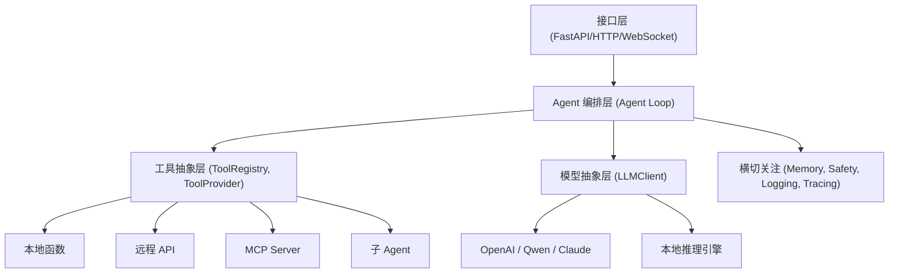

**调用链典型时序**（以一次用户请求触发两次工具调用为例）：

```text
HTTP /chat
  └─ Agent.run(user_input)
       ├─ memory.load()             加载历史
       ├─ schema = registry.get_schemas()
       ├─ for step in range(max_steps):
       │     ├─ llm.chat(messages, tools=schema)  # 第 1 次调用
       │     ├─ if no tool_calls: break           # 终止
       │     ├─ for tc in tool_calls:
       │     │     ├─ args = json.loads(tc.arguments)
       │     │     ├─ safety.validate(schema, args)
       │     │     ├─ safety.check_permission(user, tc.name)
       │     │     ├─ result = call_with_timeout(registry.execute(tc.name, args))
       │     │     ├─ messages.append({role: tool, ...})
       │     │     └─ audit.log(...)
       │     └─ # 进入下一轮 llm.chat
       ├─ memory.save()
       └─ return final_content
```

**关键数据结构三件套**：

| 结构 | 形态 | 作用 |
|---|---|---|
| `tools` | `List[ToolSchema]` | 给模型看的工具说明书 |
| `function_registry` | `Dict[str, Callable]` | 给宿主看的实际执行入口 |
| `messages` | `List[Message]` | 模型 ↔ 宿主之间的"消息总线" |

LangChain / LangChain4j / AiServices 等框架的本质，就是用装饰器和反射把"`tools` 与 `function_registry` 同源一处生成"，并把 agent loop 内置化。

## 十五、Function Calling、MCP、Skills、Prompt 的本质差异

把这四个概念放在同一张图里，能看到它们处在 Agent 体系的不同层次：

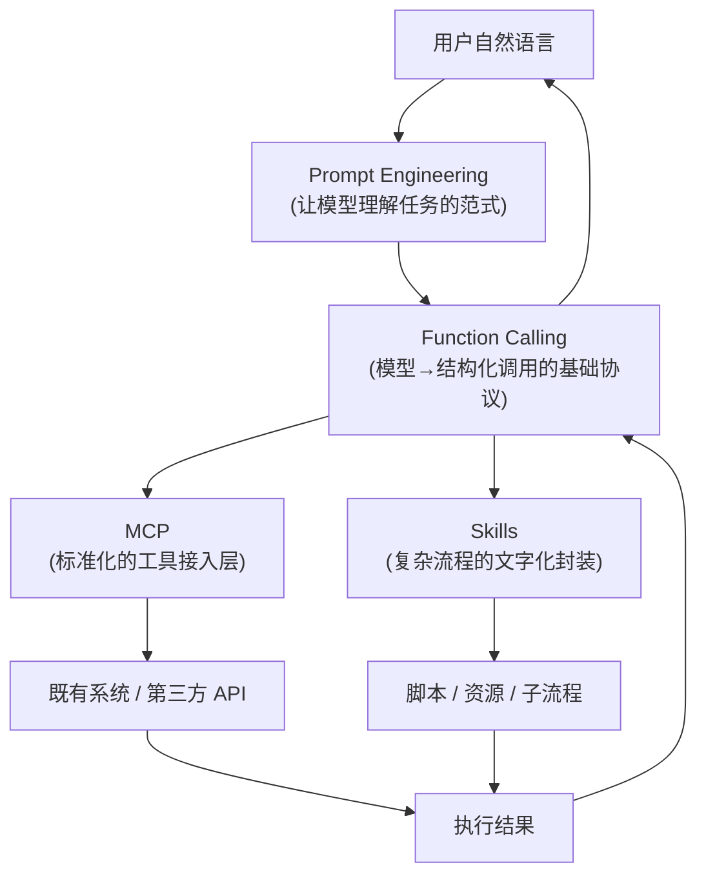

**Prompt Engineering** 是最底层、最普适的范式，所有让模型"懂任务"的工作都属于它，包括 ReAct、CoT、Few-shot。

**Function Calling** 是把 Prompt 中的"工具调用"环节结构化、协议化，是 Agent 的底层调用契约。

**MCP（Model Context Protocol）** 由 Anthropic 在 2024 年 11 月开源、2025 年捐赠给 Linux 基金会，定位是"AI 世界的 USB 接口"。它把 FC 的私有 tools 列表升级为**可发现、可复用、跨应用共享**的协议层：通信用 JSON-RPC 2.0（stdio 本地 / Streamable HTTP 远程），标准方法包括 `tools/list`、`tools/call` 等；任何应用通过 MCP Client 都可以接上一堆 MCP Server，再统一暴露给 LLM 调用。MCP 解决的是"工具规模化接入"，而不是"模型怎么调工具"。

**Skills（Claude Skills）** 是 2025 年 3 月 Anthropic 推出的另一条路径，让用户用**自然语言**而非代码来定义可复用的任务流程。每个 Skill 是一个 `SKILL.md` 文件 + 可选脚本/资源；Claude 启动时只加载元数据（约 100 token/个），用户触发时通过 FC 调用 `load_skill(name)` 把对应 SKILL.md 注入上下文——这套机制叫**渐进式披露（progressive disclosure）**。

| 维度 | Prompt Engineering | Function Calling | MCP | Skills |
|---|---|---|---|---|
| 层次 | 范式 | 基础协议 | 接入协议 | 流程封装 |
| 解决问题 | 让模型理解任务 | 自然语言→结构化调用 | 多系统统一接入 | 复杂流程难表达 |
| 核心载体 | Prompt 文本 | JSON Schema | JSON-RPC + Server | SKILL.md + 脚本 |
| 是否依赖 FC | × | 自身 | ✓ | ✓ |
| 类比 | 教学法 | RPC 调用约定 | USB / 服务发现 | 操作手册 |

阿里内部讨论中有一个精彩比喻：**MCP 像 RPC 协议层（HSF / Dubbo），Skills 像 Spring 上下文容器**——一个解决工具的连接性，一个解决能力的组织性，两者并不在同一个层面。

## 十六、有了 Function Calling，为什么还要 MCP

这是社区讨论最多的问题。简短的回答是：FC 解决了**"自然语言→结构化调用"**，但没解决**"工具如何被发现、被复用、被跨应用接入"**。

举例：你做了一个 AI Chat App，想接入 GitHub Issue 查询、Slack 消息发送、本地文件读写……每接一个外部系统都要：

1. 写一份适配代码（如何认证、如何分页、如何处理异常）；
2. 给 LLM 写一份对应的 tools schema；
3. 维护两边的版本兼容；
4. 同样的工作在另一个 App 里要重新做一遍。

MCP 用一层标准化协议把这些问题解开：

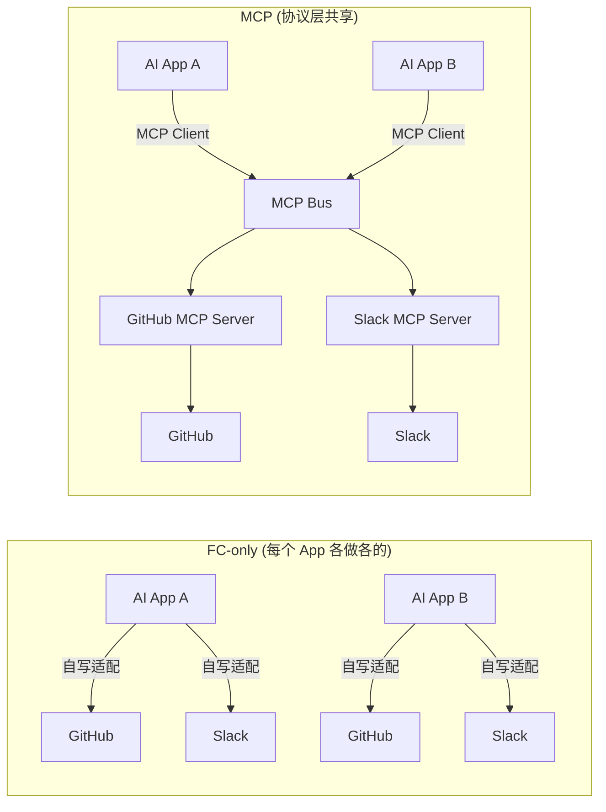

MCP 带来的工程红利：

- **一次开发到处运行**：MCP Server 是协议层的"插件"，写一遍 GitHub MCP Server，所有支持 MCP 的 LLM 应用都能用。
- **可发现性**：通过 `tools/list` 动态列出 Server 暴露的工具，无须把所有工具写死在 App 里。
- **双向通信**：Streamable HTTP 支持 Server 主动推送（资源变更通知），FC 单向请求-响应做不到。
- **细粒度授权**：每次工具调用前可由用户确认，把权限边界从 App 上移到协议层。

但要清楚 MCP 不是银弹：它**没解决"工具太多导致上下文爆炸"**——这要靠 Skills 的渐进式披露或 Agent 分层来缓解；它**也不取代 FC**——MCP Client 拿到 tools 后，最终还是通过 FC 喂给模型决策。一个内部架构师的观点是："MCP 是协议层（很薄），Skills 是规划层（管理复杂度），FC 是模型层（决策机制），各司其职"。

## 十七、Function Calling 和 Prompt Engineering 怎么选

这是工程选型时绕不开的对比。两条路径各有适用场景：

| 性能指标 | 原生 FC | Prompt Engineering |
|---|---|---|
| 可靠性 | 高（结构化、错误率低） | 中（自由文本易格式错误） |
| 通用性 | 限于支持 FC 的模型 | 强（适配任何指令跟随模型） |
| 响应速度 | 快（token 少） | 慢（prompt 模板长） |
| 稳定性 | 高（厂商专项训练） | 中（受 temperature/采样影响） |
| Token 成本 | 低 | 高 |
| 跨模型迁移 | 受限（API 略有差异） | 强（理论上零改造） |
| 开发调试 | 直观（schema 即文档） | 复杂（需反复调 prompt） |

**实战选型建议**：

- **企业级、结构化要求高、工具沉淀稳定** → 选原生 FC，输出最稳。
- **跨平台、需频繁切换模型厂商、面向开源/小模型** → 选 Prompt Engineering，迁移成本低。
- **混合使用更常见**——用 FC 出框架，用 Prompt 给模型补任务规划与角色定义。
- Cursor / Cline / Roo Code 等 IDE 类 Agent 普遍走 PE 路线，原因是要同时适配 Claude、GPT、Qwen、DeepSeek 多家厂商。Roo Code 甚至在代码里写死了 "Less Capable Models" 警告。
- 注意 Qwen `tongyi-intent-detect-v3` 等系列对 System Prompt 格式有特殊要求，跨模型迁移时务必逐一验证。

成本警示：Sonnet 3.7 输出大约 \$15/1M tokens，Qwen-Max ￥9.6/1M tokens，量级差异巨大。Over-qualified 模型 + 烂 prompt 会让单次请求成本暴涨。

## 十八、Function Calling 和 LangChain 等框架的联系与区别

LangChain（含 Java 生态的 LangChain4j、Spring AI）与 Function Calling 的关系，可以类比为 **Spring Boot 与 HTTP**——LangChain 不取代 FC，它是 FC 之上的工程框架。

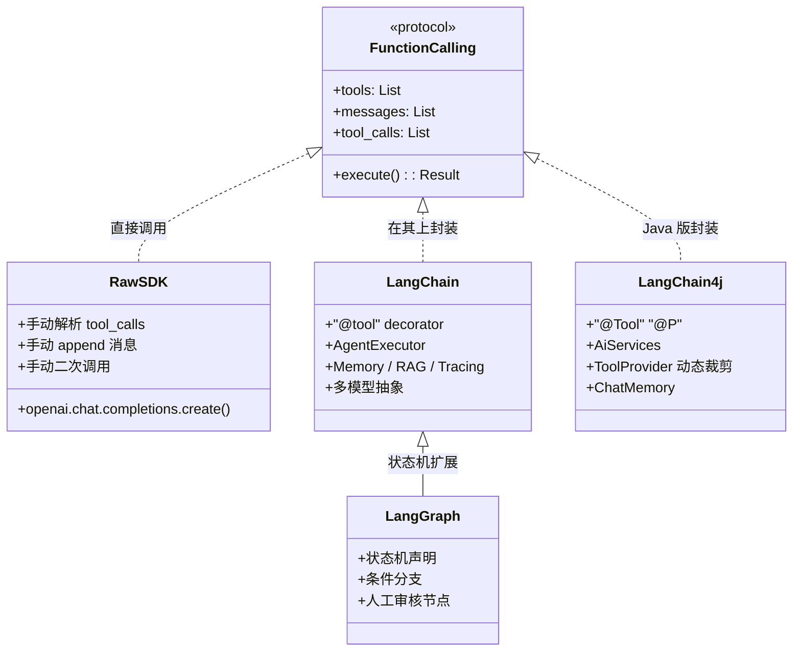

**LangChain 解决了 Raw API 的三大痛点**：

1. **Schema 冗余** → `@tool` 装饰器一处声明，自动派生 schema。
2. **流程繁琐** → `AgentExecutor` 内置 agent loop，自动循环调用。
3. **脆弱性** → `handle_parsing_errors=True` 自动兜底，`max_iterations` 防死循环。

LangGraph 是 LangChain 的进阶版，用"节点+边"声明状态机，支持条件分支、人工审核、多阶段规划，适合复杂企业级 Agent。

LangChain4j 是 Java 生态对 LangChain 思想的实现，核心抽象是 `AiServices`：用 `@Tool` 注解标 Java 方法、`@P` 标参数，框架自动完成"决策—执行—回传"循环；并提供 `ToolProvider` 接口让你按消息内容动态决定可见工具集，**防止工具数量爆炸导致的幻觉**。

**选型建议**：

- 极简场景、Serverless 冷启动敏感、学习目的 → Raw API。
- 95% 生产场景（多工具、多轮、需要可观测） → LangChain / LangChain4j。
- 复杂业务流程、有强业务规则、多角色协作 → LangGraph。

## 十九、Function Calling 在 Agent 路由中的应用

在多 Agent / 多技能架构中，Function Calling 还有一个常被忽视的高级用法：**用于路由（Router）**。

传统 LLM 路由是问模型"这句话属于 A 还是 B？"，准确率受模型能力波动很大。FC 路由把同一个问题转化为"槽位填充（Slot Filling）"：

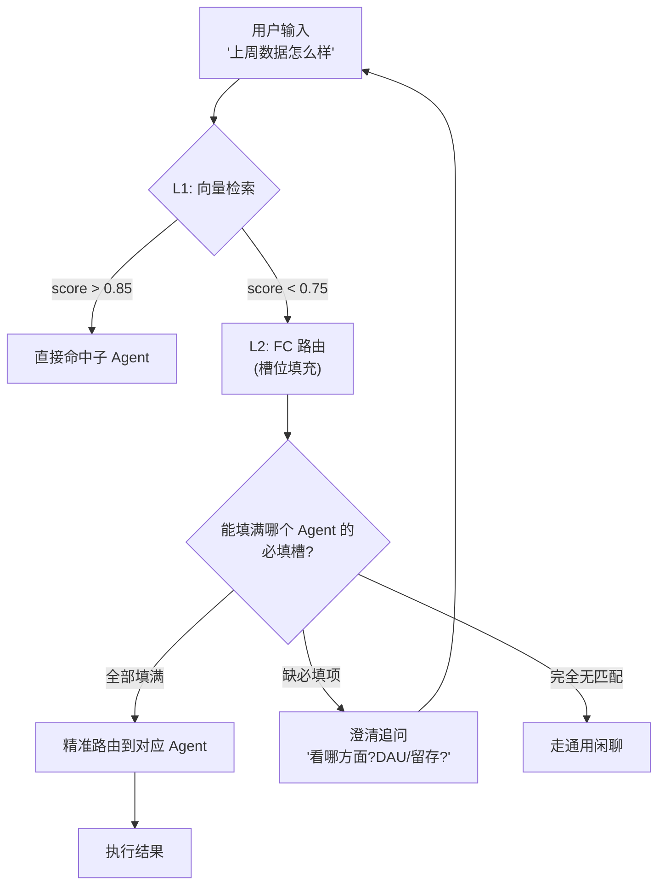

每个子 Agent 注册一份 Input Schema：

```json
{
  "name": "data_query_agent",
  "description": "查询业务核心数据指标。当用户询问 DAU/留存/转化等业务数据时使用。",
  "parameters": {
    "type": "object",
    "properties": {
      "metric": {
        "type": "string",
        "enum": ["dau", "mau", "retention", "conversion"]
      },
      "time_range": {"type": "string"}
    },
    "required": ["metric", "time_range"]
  }
}
```

`enum` 与 `required` 的妙用：

- 问"天气怎样" → metric 没法填进 enum → 自然不会错路由到数据 Agent；
- 问"上周数据" → time_range 能填，metric 缺 → 触发**澄清追问**，把"路由错误"转化为"用户体验"；
- 问"上周 DAU" → 两个槽都填满 → 精准命中。

监控指标四件套：**Slot Filling Rate（槽位填充率）/ Clarification Trigger Rate（澄清触发率）/ Argument Hallucination（参数幻觉）/ Schema Confusion Matrix（Schema 混淆矩阵）**，分别反映 Schema 描述质量、必填严苛度、模型幻觉率、不同 Agent 间的语义重叠度。

## 二十、最佳实践

把零散的经验汇总成可落地的清单：

**工具设计**

- 工具命名以动词开头（`get_`、`calculate_`、`book_`），保持简洁清晰。
- `description` 必须写清"触发场景 + 参数依赖 + 何时不该用"——这是模型决策的唯一依据。
- 参数尽量扁平化，避免深层嵌套对象，LLM 对深嵌套的 JSON Schema 处理能力较弱。
- 善用 `enum`，它是最强语义约束；善用 `required`，让模型主动追问而非乱猜。
- 把权限相关参数（user_id、token）从 schema 中剔除，交给工程层注入，避免 LLM 编造敏感字段。

**Schema 与 Few-shot**

- 函数即 Schema：用 `@tool` 装饰器或反射工具，避免函数和 schema 两处都改。
- 复杂场景需要 Few-shot 时，**用 `HumanMessage → AIMessage(tool_calls) → ToolMessage` 三元组**，效果远好于把示例拼到 system prompt 字符串里。
- 对易出错环节（时间换算、单位换算、绝对日期）做 Few-shot 加固。

**链路与容错**

- 二次调用必把 `tool_choice` 改回 `"auto"`，否则模型会无限返回 tool_calls。
- 用 `for step in range(N)` 给 agent loop 设上限，防止死循环。
- 工具异常时，**把错误信息当 tool result 回传给模型**，让它道歉/降级/重试，比直接抛 5xx 给用户体验好。
- 对幂等性敏感的工具（支付、下单），加幂等键 + 审计日志。

**性能与体验**

- 流式输出按 `tool_call.index` 聚合 chunk，等 `finish_reason=="tool_calls"` 再执行。
- 并行工具调用开启 `parallel_tool_calls=True`，但有强依赖时显式关闭。
- 工具数过多时用 `ToolProvider` 动态裁剪（按用户角色/对话主题），避免上下文爆炸。
- 推理/复杂计算外包给规则引擎或专用 Agent，主 LLM 只做意图抽取。

**安全与生产化**

- 入参校验 → 类型校验 → 范围/enum 校验 → 未定义参数过滤，四层验证不可少。
- 高危工具（退款、删数据）必须做角色鉴权、二次确认、审计日志。
- 用指数退避 + 抖动重试外部 API，配合熔断器防止级联崩溃。
- 给用户友好的错误提示，不要把 stack trace 泄露给前端。

## 二十一、局限性与常见坑

Function Calling 并非银弹，落地时常踩的坑：

**模型侧**

- **选错函数**：tools 数量多、description 写得相似时容易混淆。
- **参数幻觉**：在 description 没明确边界时，模型会"自信地编"参数（如把不存在的城市当合法输入）。
- **嵌套对象支持差**：连 GPT-4 也不能完美处理深度嵌套的 JSON Schema。
- **JSON 不合法**：弱模型（尤其没专项训练的开源模型）可能输出非法 JSON，需要 schema 引导 + 容错解析。
- **流式分片错觉**：`arguments` 是 JSON 字符串切片到达，中间任何时刻都不是合法 JSON。

**工程侧**

- **上下文爆炸**：工具数量过多 → schema 占满上下文 → 模型注意力被稀释。
- **多模型兼容**：OpenAI、Anthropic、Qwen 的 tools/tool_choice/messages 协议略有差异，迁移时务必验证。
- **延迟累积**：FC 至少两次模型调用 + 一次工具调用，端到端 P95 可能突破 5 秒。
- **跨账号鉴权**：MCP Server / 多租户场景下，Token 的传递与刷新是工程难题。

**安全侧**

- **Prompt 注入工具调用**：用户输入可能诱导模型调用敏感工具，需要工具级别的二次审批。
- **数据外泄**：工具结果直接进入上下文，若包含敏感字段，二次调用时可能被模型复述出来。
- **副作用难回滚**：模型可能多次触发同一个写操作，幂等性是必须的工程纪律。

## 二十二、总结

Function Calling 是大模型与现实世界连接的第一座桥，也是 Agent 时代的基础设施。它把"自由文本输出"升级成"严格 JSON 调用"，把"只会说"升级成"能做"。它本身只是一份协议，但围绕它衍生出的生态——MCP（连接性）、Skills（流程化）、LangChain（工程化）、Prompt Engineering（普适范式）——共同构成了今天 LLM 应用的完整图景。

要写好一个 Function Calling 应用，关键不在于代码量，而在于三件事：**清晰的工具描述、严格的参数约束、稳健的执行链路**。Schema 是模型唯一的"文档"，每一个字段、每一句 description、每一个 enum，都直接决定模型决策质量；agent loop 是 Agent 的"心跳"，循环上限、错误回喂、超时控制、审计日志是它的安全带；流式输出、并行调用、动态工具裁剪则是体验的护城河。

从更宏观的视角看，Function Calling 也在持续演化：从 OpenAI 私有 API，到 MCP 协议标准化，到 Skills 把流程也"文字化"，下一站很可能是"Agent 之间的工具协议（Agent-to-Agent Protocol）"——让多个 Agent 像微服务那样互相调用、互相组合。无论协议如何变迁，Function Calling 所确立的原则——**模型决策 + 程序执行 + 结构化契约**——会长期是 Agent 工程的基石。

---

## 参考文档

### 一、概念与原理
- [如何通过 Function Calling 实现工具调用 - 阿里云百炼](https://help.aliyun.com/zh/model-studio/qwen-function-calling)
- [Function Calling 工作原理（博客园）](https://www.cnblogs.com/ruipeng/p/18216610)
- [Function Calling | MaiAgent 技术手册](https://docs.maiagent.ai/tech/advanced-genai-tech/function-calling)
- [白话理解 ChatGPT API 的 Function Calling - ExplainThis](https://www.explainthis.io/zh-hans/ai/function-calling)
- [Function Calling 是什么？AI 大模型能自己调用工具？- 知乎](https://zhuanlan.zhihu.com/p/1945872330824876973)
- [工具调用（Function Calling）- 菜鸟教程](https://www.runoob.com/ai-agent/ai-agent-function-calling.html)
- [Function Calling 是个啥？- 掘金](https://juejin.cn/post/7574745301724823558)
- [Function Calling 实战指南（CSDN）](https://adg.csdn.net/69523fcf5b9f5f31781b440e.html)
- [深入理解 Agent：从 0 实现 Function Call - 知乎](https://zhuanlan.zhihu.com/p/18176700983)

### 二、评测与榜单
- [Berkeley Function-Calling Leaderboard (BFCL)](https://gorilla.cs.berkeley.edu/leaderboard.html)

### 三、协议与规范
- [OpenAI Function Calling 官方文档](https://platform.openai.com/docs/guides/function-calling)
- [Anthropic Tool Use 官方文档](https://docs.anthropic.com/claude/docs/tool-use)
- [Model Context Protocol 官方网站](https://modelcontextprotocol.io/)
- [JSON Schema 规范](https://json-schema.org/)
