## Hermes Agent 源码深度学习

### 一、Hermes Agent 项目介绍

Hermes Agent 是由 Nous Research 团队开发的开源自进化 AI Agent 框架，采用 MIT 协议发布，截至 2026 年中已获得超过 200K GitHub Stars。项目的核心定位是"唯一内置学习循环的 Agent"——它能从经验中创建技能、在使用过程中改进技能、跨会话记住用户偏好，最终实现"越用越聪明"的效果。

与传统的 AI 对话工具不同，Hermes Agent 不仅仅是一个聊天接口，而是一个完整的智能体运行时（Agent Runtime）。它的设计哲学介于 Claude Code 风格的 CLI 工具和 OpenClaw 风格的消息平台 Agent 之间，既支持本地终端使用，又能通过消息网关接入 24 个以上的通信平台。

项目的核心特性包括：自学习闭环（Closed Learning Loop）实现能力自增长、三层记忆架构保证跨会话持久化、渐进式技能加载系统控制上下文成本、支持 200+ LLM 模型的无锁定设计、以及覆盖 6 种执行后端（Local、Docker、SSH、Daytona、Singularity、Modal）的多环境运行能力。

### 二、项目代码结构与代码总量分析

Hermes Agent 采用 Python 3.11–3.13 开发，使用 Rust 编写的 `uv` 作为包管理工具，整体代码规模约 334K 行 Python 代码，744 个 Python 文件。

#### 2.1 顶层目录结构

```
hermes-agent/
├── run_agent.py          # 入口文件，AIAgent 核心类 (~4100行, ~60个构造参数)
├── agent/                # 核心 Agent 逻辑 (110个文件)
│   ├── conversation_loop.py   # Agent Loop 主循环 (~5017行)
│   ├── system_prompt.py       # 系统提示词构建
│   ├── memory_manager.py      # 记忆管理器
│   ├── memory_provider.py     # 记忆提供者抽象
│   ├── context_engine.py      # 上下文引擎
│   ├── context_compressor.py  # 上下文压缩器
│   ├── turn_context.py        # 单轮状态容器
│   ├── turn_finalizer.py      # 轮次结束清理
│   ├── iteration_budget.py    # 迭代预算管理
│   ├── curator.py             # 知识管护器
│   ├── learning_graph.py      # 学习图谱
│   ├── learning_mutations.py  # 技能演化
│   ├── background_review.py   # 后台审查
│   └── ...
├── tools/                # 工具实现 (92个文件, 60+内置工具)
│   ├── registry.py            # 工具注册中心
│   ├── delegate_tool.py       # 多Agent委托 (~3510行)
│   ├── skills_tool.py         # 技能工具
│   ├── memory_tool.py         # 记忆工具
│   ├── terminal_tool.py       # 终端工具
│   ├── browser_tool.py        # 浏览器工具
│   └── ...
├── skills/               # 内置技能库 (18个分类)
├── gateway/              # 多平台消息网关 (34个文件)
│   ├── run.py                 # 网关主进程
│   ├── session.py             # 会话管理
│   ├── delivery.py            # 消息投递
│   ├── platform_registry.py   # 平台注册
│   └── ...
├── providers/            # LLM Provider 注册表
├── plugins/              # 18个插件分类
├── cron/                 # 定时任务调度
├── hermes_cli/           # CLI 接口
├── ui-tui/               # 终端 UI
├── web/                  # Web 界面
├── apps/desktop/         # Electron 桌面应用 (Astro/React)
├── acp_adapter/          # Agent Communication Protocol 适配
├── optional-mcps/        # MCP 集成
├── optional-skills/      # 额外技能包
├── tests/                # 测试套件
├── docs/                 # 文档
└── pyproject.toml        # 项目配置与依赖锁定
```

#### 2.2 关键依赖

| 层面 | 技术选型 |
|------|---------|
| LLM 客户端 | openai==2.24.0（兼容 OpenAI API 格式） |
| Web 框架 | FastAPI + Uvicorn |
| 类型检查 | ty（Rust 编写的自定义检查器） |
| 代码检查 | ruff（preview 模式） |
| 测试框架 | pytest + pytest-asyncio |
| 关键库 | pydantic, httpx, rich, tenacity, prompt_toolkit, croniter, websockets, Pillow |
| 基础设施 | Docker, Nix flakes, docker-compose |

#### 2.3 磁盘状态布局

```
~/.hermes/
├── config.yaml       # 全局配置
├── .env              # 密钥存储
├── auth.json         # OAuth 凭证
├── SOUL.md           # Agent 身份定义
├── memories/         # MEMORY.md, USER.md
├── skills/           # 所有技能
├── cron/             # 定时任务
├── sessions/         # 网关会话状态
├── state.db          # SQLite (含 FTS5 全文索引)
└── logs/             # 轮转日志(自动脱敏)
```

### 三、Hermes Agent 设计思想

Hermes Agent 的设计哲学可以归纳为以下核心原则：

**1. 闭环学习优先（Closed Learning Loop First）**：这是整个项目的灵魂。系统不仅记住用户说了什么，更能从执行经验中提炼通用技能，并在后续使用中持续优化这些技能。这种"经验 → 技能 → 改进 → 更好的执行"的循环，使得 Agent 真正具备了"越用越聪明"的能力。

**2. Provider 抽象与可插拔（Provider Abstraction）**：每个子系统（LLM、Memory、Context Engine、Browser、TTS、Image Gen、Web Search）都采用注册表 + Provider 模式，实现了完全的可插拔性。这意味着用户可以自由切换底层实现而不影响上层逻辑。

**3. 优雅降级（Graceful Degradation）**：所有 Provider 调用都有包装层，单个组件的故障永远不会级联影响其他组件。这保证了系统的鲁棒性。

**4. 前缀缓存优化（Prefix Cache Optimization）**：系统提示词在整个会话期间保持字节稳定，易变内容排在最后。这最大化了 LLM 提供商的前缀缓存命中率，实现约 75% 的成本节省。

**5. 后台异步处理（Background Processing）**：耗时操作（记忆同步、预取）分派到后台工作线程，不阻塞主 Agent 循环。

**6. 安全第一（Security-First）**：工具护栏、路径安全、URL 安全、威胁模式检测、文件安全检查，形成多层防御体系。250+ 威胁模式库包含不可见 Unicode 字符检测。

**7. 平台无关（Platform Agnostic）**：一个 Agent 核心，多个表面（CLI、TUI、Web、Telegram、Discord、Slack、WhatsApp、Signal 等）。通过统一的消息网关架构实现一次开发、多端运行。

**8. 精确锁定依赖（Exact-Pinned Dependencies）**：所有依赖固定到 `==X.Y.Z` 版本号，这是在经历一次供应链攻击事件后做出的安全决策。

### 四、完整功能架构全景图

#### 图片生成提示词（GPT Image / Banana）

> **English Prompt (recommended for GPT-Image-1 / DALL-E):**
>
> A professional software architecture diagram for "Hermes Agent" — an open-source self-improving AI agent framework. The diagram uses a layered layout with clean geometric blocks and connecting arrows on a dark navy background with subtle grid lines. From top to bottom:
>
> **Layer 1 (Top — Gateway Layer):** A horizontal row of 10+ platform icons (Telegram, Discord, Slack, WhatsApp, WeChat, DingTalk, Feishu, CLI, Web, Email) connected by thin lines converging into a single entry point labeled "Message Gateway".
>
> **Layer 2 (Core — Agent Orchestration):** A large central rounded rectangle containing four interconnected modules: "Agent Loop" (center, highlighted in electric blue), "System Prompt Builder" (left), "Iteration Budget" (right), "Turn Retry State" (bottom). Arrows show the cyclic flow between them.
>
> **Layer 3 (Left — Tool System):** A vertical stack of tool cards: Terminal, File, Browser, Code Execution, Media, MCP Integration, connected to a "Tool Registry" header block.
>
> **Layer 4 (Right — Memory System):** Three stacked layers labeled "MemoryProvider (8 plugins)" → "MemoryManager" → "MemoryStore (MEMORY.md + SQLite FTS5)", using gradient purple tones.
>
> **Layer 5 (Bottom-Left — Skill System):** Blocks for "Skill Manager", "Progressive Loading (3 levels)", "Curator", "Skills Hub", connected in a cycle.
>
> **Layer 6 (Bottom-Center — Learning System):** A circular flow showing: "Execution Tracker" → "Complexity Evaluator" → "Reflection Engine" → "Crystallizer" → back to Skill System. Highlighted with a glowing golden loop arrow indicating "Closed Learning Loop".
>
> **Layer 7 (Bottom-Right — Multi-Agent):** "Delegate Tool", "Mixture of Agents", "Kanban Board" blocks with fork/join arrows.
>
> **Layer 8 (Bottom — Execution Environments):** Six small blocks: Local, Docker, SSH, Daytona, Modal, Singularity.
>
> Style: Flat design, no 3D effects. Color palette: dark navy (#1a1a2e) background, electric blue (#4fc3f7) for core, golden (#ffd54f) for learning loop, purple gradient (#7c4dff to #b388ff) for memory, teal (#26a69a) for tools, coral (#ff7043) for gateway. White text labels. Subtle connection lines in semi-transparent white. Overall aesthetic: technical, modern, premium — suitable for a developer documentation header image. Aspect ratio 16:9, high resolution.

> **中文提示词（备用）：**
>
> 一张专业的软件架构图，展示 "Hermes Agent" 开源自进化 AI Agent 框架的完整功能架构。深色海军蓝背景配细微网格线，采用分层布局：顶部是消息网关层（10+ 平台图标汇聚到统一入口）；中部是 Agent 编排核心（Agent Loop 用电光蓝高亮，周围是提示词构建器、迭代预算、重试状态机）；左侧是工具系统（终端、文件、浏览器、代码执行、MCP 等堆叠卡片）；右侧是记忆系统（三层紫色渐变：Provider → Manager → Store）；底部左侧是技能系统（管理器、渐进加载、管护器、社区同步形成循环）；底部中央是学习系统（执行追踪 → 复杂度评估 → 反思引擎 → 技能结晶，用金色发光环形箭头标注"闭环学习"）；底部右侧是多 Agent 协调（委托、MoA、看板）；最底层是 6 个执行环境。扁平设计，无 3D 效果，16:9 比例，高分辨率，适合技术文档封面。

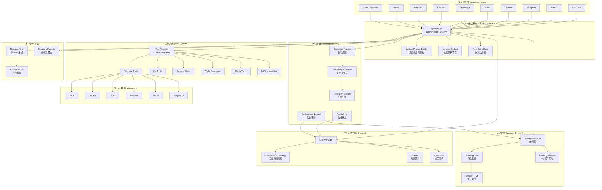

### 五、内部原理和实现架构

#### 5.1 核心类设计

Hermes Agent 的核心是 `AIAgent` 类（定义于 `run_agent.py`，约 4100 行），它拥有约 60 个构造参数，是整个系统的控制中心。所有入口（CLI、Gateway、ACP、Batch Runner、API Server）最终都调用 `AIAgent.run_conversation()` 这个共享循环。

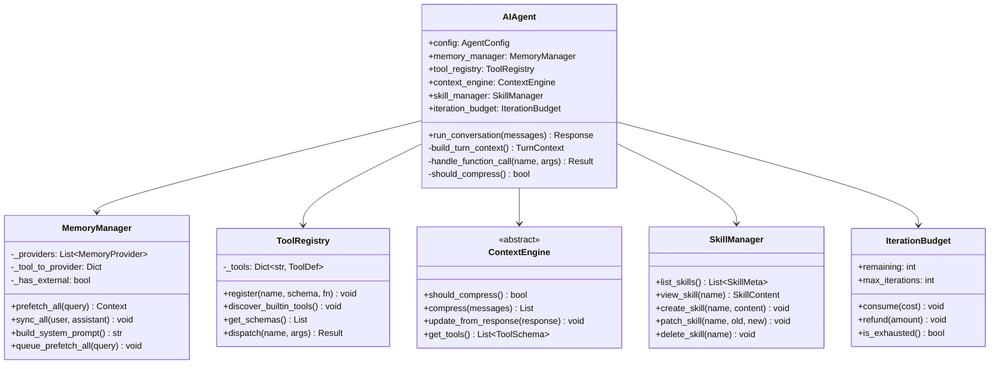

#### 5.2 Provider 注册模式

系统中几乎所有子系统都遵循相同的 Provider 模式：

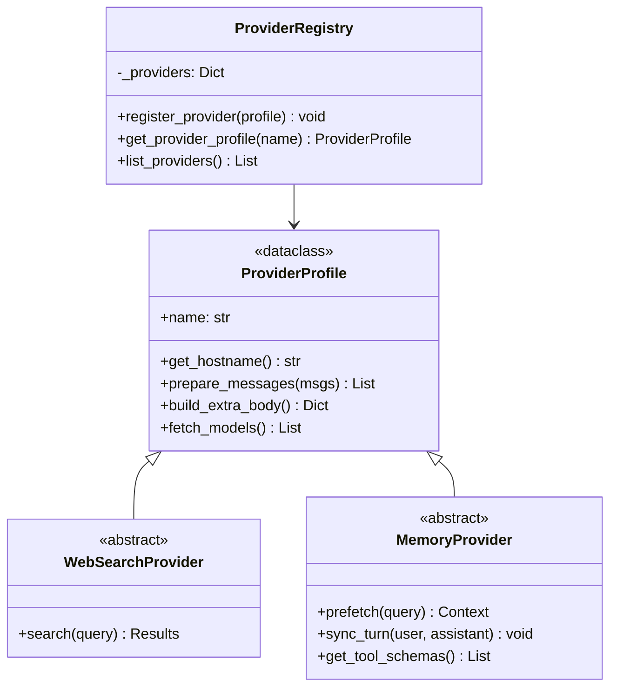

Provider 的发现是懒加载的——首次访问时才从 `plugins/` 目录中扫描加载。这种设计降低了启动开销，也使得添加新的 Provider 只需要放置一个文件即可，无需修改任何清单。

### 六、Agent Loop 流程定义与实现

#### 6.1 核心循环实现

Agent Loop 是 Hermes Agent 最核心的运行机制，定义在 `agent/conversation_loop.py` 中（约 5017 行）。尽管外围包装复杂，其核心逻辑惊人地简洁——不到 10 行代码：

```python
while (api_call_count < self.max_iterations
       and self.iteration_budget.remaining > 0) \
       or self._budget_grace_call:
    if self._interrupt_requested:
        break
    response = client.chat.completions.create(
        model=model, messages=messages, tools=tool_schemas)
    if response.tool_calls:
        for tool_call in response.tool_calls:
            result = handle_function_call(tool_call.name, tool_call.args, task_id)
            messages.append(tool_result_message(result))
        api_call_count += 1
    else:
        return response.content
```

这遵循了经典的 ReAct 模式：Reason（推理）→ Act（行动）→ Observe（观察）→ 循环，直到 LLM 决定不再调用工具而直接输出文本为止。

#### 6.2 完整的五阶段执行流程

```mermaid
sequenceDiagram
    participant User as 用户
    participant Loop as Agent Loop
    participant Prompt as Prompt Builder
    participant LLM as LLM Provider
    participant Tools as Tool Registry
    participant Memory as MemoryManager
    participant Budget as IterationBudget

    User->>Loop: 发送消息
    Loop->>Memory: prefetch_all(query)
    Memory-->>Loop: 相关记忆上下文

    Loop->>Prompt: build_system_prompt()
    Note over Prompt: 组装三层提示词 Stable + Context + Volatile

    loop Agent Loop (max 90 iterations)
        Loop->>Budget: check remaining
        Budget-->>Loop: remaining > 0

        Loop->>LLM: chat.completions.create()
        LLM-->>Loop: response

        alt 包含 tool_calls
            Loop->>Tools: dispatch(name, args)
            Tools-->>Loop: tool_result
            Loop->>Loop: append result to messages
            Loop->>Budget: consume(1)
        else 纯文本响应
            Loop-->>User: 返回最终回复
        end
    end

    Loop->>Memory: sync_all(user_msg, assistant_msg)
    Loop->>Memory: queue_prefetch_all(next_query)
```

#### 6.3 保护机制

Agent Loop 配备了多层保护机制防止失控：

**三维循环护栏（v0.12.0）**：精确失败重复检测——如果同一个工具调用连续产生相同的错误，说明 Agent 陷入了无效循环；同工具失败模式检测——识别对同一工具的多次失败调用；幂等无进展检测——检测执行结果完全相同但无实际进展的循环。

**工具调用自修复**：对拼写错误的工具名进行模糊匹配，对格式错误的 JSON 参数最多重试 3 次。

**认证故障转移**：检测到 401/403 错误时自动切换到备用模型。

**中断传播**：支持 `/steer` 指令在每次 API 调用前注入用户引导。

#### 6.4 与 OpenClaw、Claude Code 的对比

| 维度 | Hermes Agent | OpenClaw | Claude Code |
|------|-------------|----------|-------------|
| 循环核心 | ReAct + 预算管理 | ReAct + 状态机 | ReAct + 流式输出 |
| 迭代上限 | 90次/轮 | 无硬限制 | 模型决定 |
| 预算控制 | IterationBudget (可退还) | Token 计数 | Token 上限 |
| 失败处理 | 三维护栏 + 自修复 | 重试策略 | 异常终止 |
| 工具发现 | AST 解析自动注册 | 配置声明 | 内置固定 |
| 并行工具 | ThreadPoolExecutor(8) | 顺序执行 | 并行调用 |
| 学习反馈 | 后台审查 + 技能创建 | 无 | CLAUDE.md 手动 |

Hermes Agent 的独特之处在于将"学习"内建到了循环本身——每次循环结束后，后台审查系统会分析本轮对话，提取可复用的模式，自动创建或更新技能。而 Claude Code 依赖用户手动维护 CLAUDE.md，OpenClaw 则完全没有跨会话学习能力。

### 七、完整流程生命周期

一次完整的用户对话经历以下全部流程：

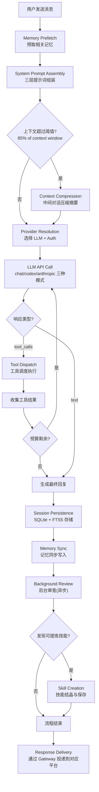

#### 7.1 详细阶段说明

**阶段 1：记忆预取（Memory Prefetch）**。MemoryManager 调用所有已注册 Provider 的 `prefetch()` 方法，以用户消息为查询条件，召回相关的历史记忆。同时触发 `queue_prefetch_all()` 为预测的下一轮做异步预取。

**阶段 2：提示词组装（System Prompt Assembly）**。从 SOUL.md 获取身份定义，加载技能索引（仅 Level 0 的名称+描述），注入环境信息和平台提示，最后添加记忆快照。整个提示词按稳定性降序排列以优化缓存。

**阶段 3：上下文压缩检查**。如果消息历史的 token 总量达到上下文窗口的 85%（`_MIN_CTX_TRIGGER_RATIO = 0.85`），触发压缩。保护首 3 条和末 6 条消息不被压缩，中间内容由辅助 LLM 生成结构化摘要。

**阶段 4：LLM 调用与工具循环**。支持三种 API 模式：`chat_completions`（标准）、`codex_responses`（Codex）、`anthropic_messages`（Anthropic 原生）。工具调用通过 ThreadPoolExecutor（最多 8 个工作线程）并行执行。

**阶段 5：持久化与学习**。会话记录存入 SQLite（带 FTS5 全文索引），新发现的信息同步到 Memory，后台审查系统异步分析本轮对话寻找技能创建机会。

### 八、上下文工程

#### 8.1 三层系统提示词架构

Hermes Agent 的提示词架构是一个精心设计的三层结构，核心目标是最大化 LLM Provider 的前缀缓存命中率：

| 层 | 内容 | 缓存行为 |
|---|------|---------|
| Stable（稳定层） | Agent 身份(SOUL.md)、工具指南、技能索引、环境提示、模型特化指导 | 会话生命周期内字节稳定 |
| Context（上下文层） | 项目文件(AGENTS.md, .cursorrules)、调用方 system_message | 会话稳定（依赖 CWD） |
| Volatile（易变层） | 记忆快照、用户画像(USER.md)、外部记忆块、时间戳 | 每轮/每会话变化 |

这种按稳定性降序排列的设计确保了：前缀缓存只需要匹配前段内容，而前段内容恰好是变化最少的部分。据测算，这可以带来约 75% 的推理成本节省。

#### 8.2 上下文窗口管理

**硬性要求**：最低 64,000 token 上下文窗口，低于此限制的模型在启动时就会被拒绝。

**上下文长度检测链**（按优先级）：config 覆写 → 自定义 Provider 每模型配置 → 持久化缓存 → endpoint `/models` → Anthropic API → OpenRouter API → Nous Portal → `models.dev` 注册表 → 默认值（128K）。

#### 8.3 压缩策略

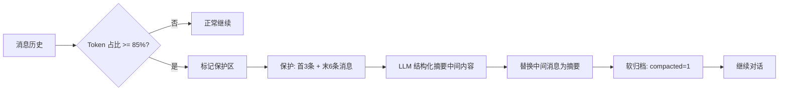

**大型工具结果处理（三层溢出策略）**：第一层是工具内部截断（单个工具结果超限时自行截断）；第二层是单结果持久化（极大结果写入文件，消息中只保留引用）；第三层是轮次级聚合预算（整个轮次所有工具结果的总预算控制）。

#### 8.4 辅助模型系统

为了避免用主模型执行代价高昂的辅助任务，Hermes Agent 引入了 Auxiliary Model 系统。以下任务使用独立的轻量模型：视觉分析、网页摘要、上下文压缩、审批分类、技能匹配、MCP 分发、记忆写入。每个辅助任务都可以独立配置 provider/model/base_url。

### 九、Memory 记忆架构深度解析

#### 9.1 三层架构总览

```mermaid
graph TB
    subgraph "Layer 3: MemoryProvider (插件层)"
        HONCHO["Honcho<br/>AI原生用户建模"]
        MEM0["Mem0"]
        HIND["Hindsight"]
        HOLO["Holographic"]
        OV["OpenViking"]
        RDB["RetainDB"]
        SM["Supermemory"]
        BR["ByteRover"]
    end

    subgraph "Layer 2: MemoryManager (编排层)"
        MM2["MemoryManager<br/>agent/memory_manager.py"]
        FENCE["Context Fence<br/>memory-context 标签"]
        BG["Background Worker<br/>ThreadPoolExecutor"]
    end

    subgraph "Layer 1: MemoryStore (持久化层)"
        MEMMD["MEMORY.md<br/>Agent 笔记 (2200 chars)"]
        USERMD["USER.md<br/>用户画像 (1375 chars)"]
        SNAP["Frozen Snapshot<br/>冻结快照"]
        LOCK["File Lock<br/>fcntl.flock"]
        ATOM["Atomic Write<br/>temp + fsync + replace"]
        SEC["Security Scanner<br/>250+ threat patterns"]
    end

    subgraph "Session Storage"
        SQLITE["SQLite + FTS5<br/>全文搜索"]
        COMPACT["Compaction<br/>三态: active/archived/excluded"]
    end

    MM2 --> MEMMD
    MM2 --> USERMD
    MM2 --> SNAP
    MM2 --> FENCE
    MM2 --> BG

    MM2 --> HONCHO
    MM2 --> MEM0
    MM2 --> HIND
    MM2 --> HOLO
    MM2 --> OV
    MM2 --> RDB
    MM2 --> SM
    MM2 --> BR

    MEMMD --> LOCK
    MEMMD --> ATOM
    MEMMD --> SEC
    USERMD --> LOCK
    USERMD --> ATOM
    USERMD --> SEC

    MM2 --> SQLITE
    SQLITE --> COMPACT
```

#### 9.2 Layer 1：MemoryStore（持久化层）

MemoryStore 负责记忆的物理存储，实现在 `tools/memory_tool.py`（561 行）。

**双文件存储模型**：MEMORY.md 存放 Agent 笔记（环境事实、项目约定、工具特性），默认限制 2200 字符；USER.md 存放用户画像（偏好、沟通风格），默认限制 1375 字符。条目之间使用 `§` 符号分隔，支持多行内容。

**冻结快照模式（Frozen Snapshot）**是一个关键设计决策。会话启动时，`load_from_disk()` 捕获一个快照到 `_system_prompt_snapshot`。这个快照在整个会话期间注入系统提示词，且永远不会被修改。会话中的写入操作更新磁盘文件但不修改系统提示词中的快照。这样做的原因是：保持系统提示词稳定，使得前缀缓存不会失效。

**原子写入机制**：使用临时文件 → `fsync` → `os.replace()` 保证原子性。通过独立的 `.lock` 文件配合 `fcntl.flock(fd, LOCK_EX)` 实现进程间互斥。

**外部漂移保护**：每次写入操作前执行双信号检测——往返字节级不等式检查和单条目超限检查。检测到漂移时，写入 `.bak.<timestamp>` 快照，拒绝执行 flush 操作。

**双层安全扫描**：写入时扫描（`first_threat_message(content, scope="strict")`）在内容到达磁盘前拦截匹配；加载时清洗（`_sanitize_entries_for_snapshot()`）在冻结快照中将威胁替换为 `[BLOCKED: ...]`，但在活跃状态中保留原始内容以便用户查看。

**核心 API**：

| 方法 | 行为 |
|------|------|
| `load_from_disk()` | 读取文件 → 去重 → 捕获冻结快照 |
| `add(target, content)` | 安全扫描 → 去重检查 → 字符限制 → 追加 → 持久化 |
| `replace(target, old, new)` | 子串匹配 → 替换 → 安全扫描 → 持久化 |
| `remove(target, old)` | 子串匹配 → 删除 → 持久化 |
| `format_for_system_prompt(target)` | 返回冻结快照（非活跃状态） |

#### 9.3 Layer 2：MemoryManager（编排层）

定义在 `agent/memory_manager.py`（367 行），其核心约束是：内置 Provider 始终活跃，最多允许一个外部 Provider。

**编排流程（每轮）**：

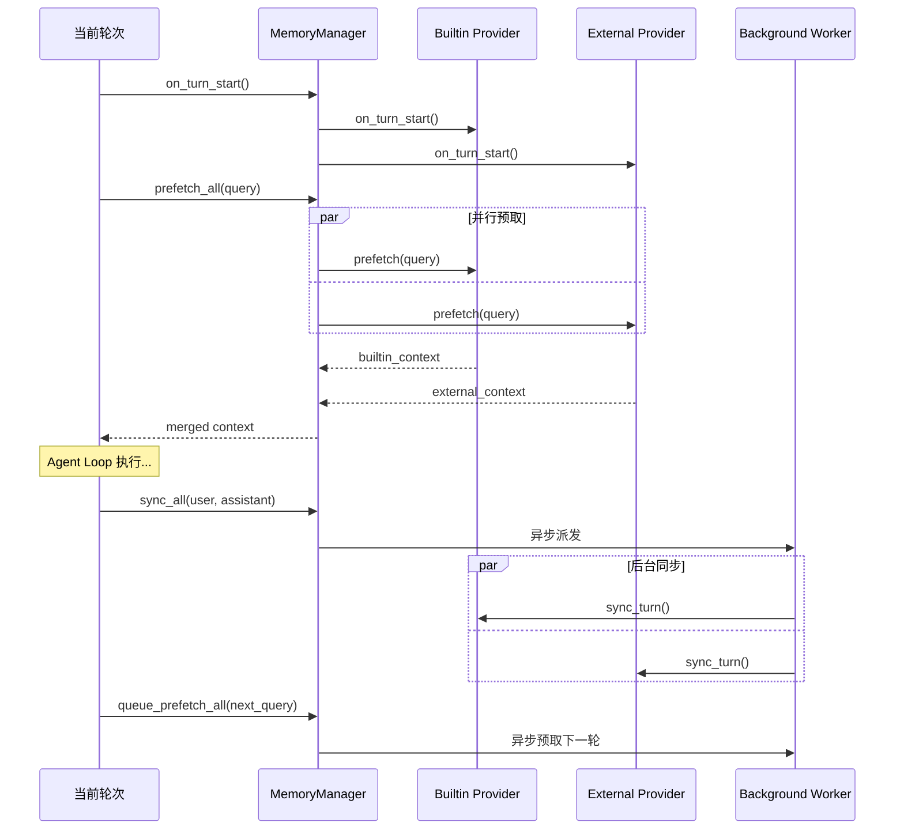

**生命周期钩子**（广播到所有 Provider，故障隔离）：

| 钩子 | 触发时机 | 用途 |
|------|---------|------|
| `on_turn_start` | 每轮开始前 | 轮次计数、范围管理 |
| `on_session_end` | 会话结束 | 提取持久化事实、刷新队列 |
| `on_pre_compress` | 上下文压缩前 | 抢救即将被压缩的信息 |
| `on_memory_write` | 内置记忆写入后 | 镜像写入外部 Provider |
| `on_delegation` | 子 Agent 完成后 | 父 Agent 观察委托结果 |

**记忆上下文围栏**：Provider 召回的内容被包装在 `<memory-context>` 标签中，配合 `StreamingContextScrubber` 在流式输出中实时清洗，防止记忆内容泄露到用户可见的回复中。

#### 9.4 Layer 3：MemoryProvider（插件层）

抽象基类定义在 `agent/memory_provider.py`（232 行），提供标准接口。

**发现机制**：扫描 `plugins/memory/` 目录下含 `__init__.py` 的子目录，调用 `is_available()` 判断可用性。

**8 个可用插件**：Honcho、Mem0、Hindsight、Holographic、OpenViking、RetainDB、Supermemory、ByteRover。

其中 Honcho Provider 是最具代表性的实现——它是首个 AI 原生的跨会话用户建模系统，提供 5 个工具（`honcho_profile` / `honcho_search` / `honcho_reasoning` / `honcho_context` / `honcho_conclude`），支持单用户/多用户/混合三种身份映射模式，建模 12 个身份层面（包括静态属性和关系演化）。

### 十、内部工具系统能力深度解析

#### 10.1 工具注册架构

工具系统采用 AST 解析实现零配置自动发现：每个 `tools/*.py` 文件调用 `registry.register()` 声明工具的名称、Schema 和执行函数。`discover_builtin_tools()` 使用 AST 解析识别注册文件并自动导入。这意味着添加一个新工具 = 添加一个文件，无需维护任何清单。

工具集（Toolset）可用性检查每 30 秒缓存一次；不可用的工具对模型隐藏。

#### 10.2 工具分类总览

| 类别 | 工具 | 说明 |
|------|------|------|
| Web | `web_search`, `web_extract` | 8 个搜索后端插件(DuckDuckGo fallback) |
| Terminal | `terminal`, `process`, `read_file`, `patch` | 7 个执行后端 |
| Browser | `browser_navigate`, `browser_snapshot`, `browser_vision` | CDP Chrome, 13 个子工具 |
| Code Execution | `execute_code` | Python 沙箱(UDS + File RPC 双通信) |
| Media | `vision_analyze`, `video_generate`, `image_generate`, `tts` | 多媒体处理 |
| Memory | `memory`, `session_search` | 持久化记忆操作 |
| Skills | `skills_list`, `skill_view`, `skill_manage` | 技能 CRUD |
| Delegation | `delegate_task`, `mixture_of_agents` | 多 Agent 协调 |
| Automation | `cronjob`, `send_message` | 定时任务、跨平台消息 |
| Project | `todo`, `kanban` | 项目管理 |
| Computer Use | `computer_use` | 屏幕操作(兼容非 Anthropic) |

#### 10.3 MCP 集成

Hermes Agent 完整实现了 MCP 1.1+ 协议：支持三种传输方式（stdio、HTTP、SSE）、自动重连（指数退避 1s → 2s → 4s → 8s → 16s，最多 5 次）、凭证清洗、180s 心跳保活。

特别值得注意的是，MCP 工具是"延迟连接"的：`refresh_agent_mcp_tools()` 在每轮开始时使用代数（generation）机制检测工具列表是否过期，从而支持运行时热加载新的 MCP Server。此外，MCP Server 还可以反向请求 Agent 的 LLM 能力。

#### 10.4 终端安全模型

Docker 后端实现了严格的安全隔离：只读根文件系统、除 `DAC_OVERRIDE`/`CHOWN`/`FOWNER` 外所有 Linux capabilities 已 drop、PID 上限 256、完整命名空间隔离、PTY 模式支持交互式工具。

### 十一、Skill 架构深度解析

#### 11.1 技能文件格式

Hermes Agent 的 Skill 系统遵循 agentskills.io 开放标准（已被 Claude Code、Cursor、GitHub Copilot、Gemini CLI 等 11+ 工具采用）。

```yaml
---
name: deploy-k8s
description: Deploy containerized applications to Kubernetes clusters
version: 1.2.0
platforms: [linux, macos]
metadata:
  hermes:
    tags: [devops, kubernetes]
    category: infrastructure
    fallback_for_toolsets: [web]
    requires_toolsets: [terminal]
---

# Deploy to Kubernetes

## Steps
1. Validate cluster connectivity...
2. Build and push container image...

## Pitfalls
- Never deploy to production without staging verification

## Verification
Run `kubectl get pods` to confirm deployment status
```

#### 11.2 三级渐进加载

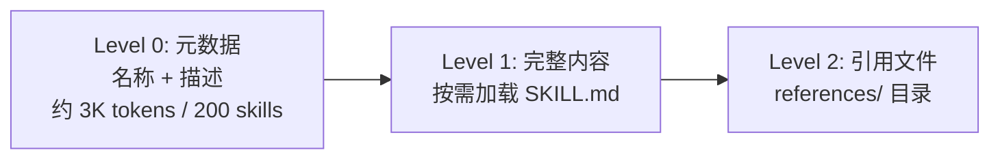

这种设计的效果是：拥有 200 个技能的 Agent 所付出的上下文成本与只有 40 个技能的 Agent 几乎相同。只有当 LLM 判断需要使用某个技能时，才会加载其完整内容。

#### 11.3 技能生命周期

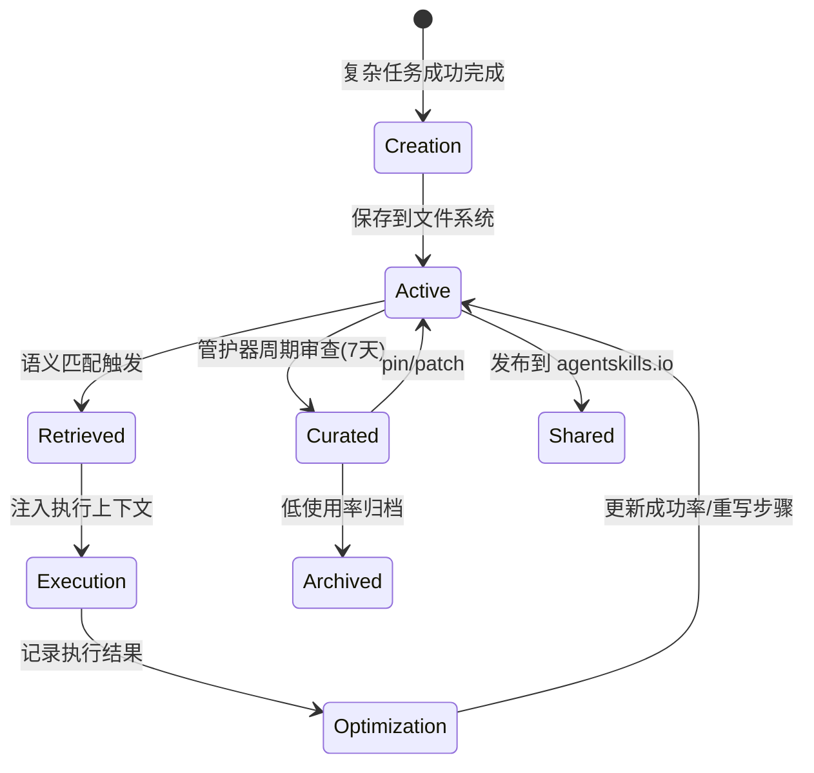

#### 11.4 条件激活

技能支持通过 `fallback_for_toolsets`、`requires_toolsets`、`fallback_for_tools` 和 `requires_tools` 字段实现条件显示/隐藏。例如：当浏览器工具不可用时，标记了 `fallback_for_toolsets: [browser]` 的技能才会出现在候选列表中，作为替代方案。

#### 11.5 安全防护

技能系统有多层安全机制：`skills_guard.py` 进行注入扫描检测；`skills_ast_audit.py` 进行 AST 级别的代码审计；路径穿越防护阻止 `../../` 类攻击；可信目录验证确保技能只存储在合法路径下；冲突检测防止同名技能覆盖。

### 十二、多 Agent 协调处理深度解析

#### 12.1 五种协调机制

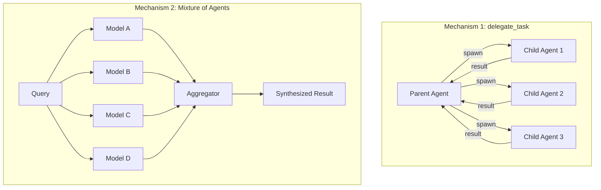

**Mechanism 1: delegate_task**（`tools/delegate_tool.py`，3510 行）

生成隔离的子 AIAgent 实例，关键特性：全新上下文（无父历史泄露）、受限工具集（子 Agent 不能使用 `delegate_task`/`clarify`/`memory`/`send_message`/`execute_code`/`cronjob`）、默认最多 3 个并行子任务（ThreadPoolExecutor）、深度控制默认 1（父→子允许，子→孙阻止）。

**安全设计**：全局暂停系统、子 Agent 注册表支持中断、心跳监控（30s 间隔，450s 空闲/1200s 工具内判定为过期）、子 Agent 自动拒绝权限提示以防止死锁。

**Mechanism 2: Mixture of Agents**

并行查询 4 个前沿模型，聚合器一次性综合结果（无迭代）。适用于需要多视角分析的场景。

**Mechanism 3: Background Review**

每轮对话后 fork 后台 Agent，使用辅助模型审查对话，提取用户偏好和行为期望，工具白名单仅限 `memory` 和 `skill_manage`。

**Mechanism 4: send_message**

跨 Agent 消息传递，支持通过 Gateway 在不同平台间传递信息。

**Mechanism 5: Kanban Board**

SQLite + WAL 持久化协作看板，支持 git worktree 级别的任务隔离，含心跳检测、僵尸任务回收、幻觉门控、每任务 `max_retries` 配置。

#### 12.2 规划中的 DAG 工作流引擎

```python
delegate_task(
    workflow=[
        {"id": "research", "goal": "Research the API", "context": "..."},
        {"id": "backend", "goal": "Implement client", "needs": ["research"]},
        {"id": "frontend", "goal": "Build UI", "needs": ["research"]},
        {"id": "integrate", "goal": "Integration test", "needs": ["backend", "frontend"]},
    ]
)
```

规划中的 Agent 间通信层级：L0 隔离（当前，无共享，父中转）→ L1 结果传递（上游结果自动注入下游）→ L2 共享便签（读写共享 KV 存储）→ L3 实时对话（轮流制 Agent 间对话）。

### 十三、消息网关架构分析

#### 13.1 架构设计

Gateway 是一个单一进程，同时桥接所有平台，维护对话连续性。

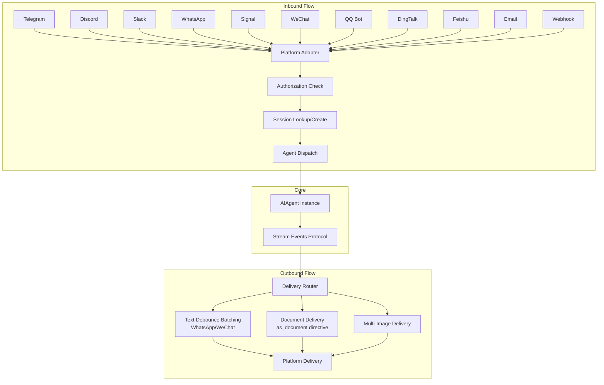

#### 13.2 支持的平台（24+）

**内置（17 个）**：Telegram、Discord、Slack、WhatsApp（Cloud API）、Signal、Matrix、WeChat、QQ Bot、DingTalk、Feishu/Lark、WeCom、Home Assistant、Email、SMS（Twilio）、BlueBubbles（iMessage 桥接）、Yuanbao（腾讯 AI）、Generic Webhook。

**插件（7 个）**：IRC、Microsoft Teams、Google Chat、LINE、SimpleX Chat、ntfy、Photon iMessage。

#### 13.3 平台注册机制

```python
ctx.register_platform()  # 零核心代码的平台添加
```

启动时通过文件系统扫描自动发现插件。`Platform._missing_()` 为内置插件创建"身份稳定的伪成员"。

#### 13.4 会话管理

每个平台-用户对维护独立的会话键，网关重启后自动恢复。最大并发会话数通过 `fcntl.flock` 的租约注册表控制。跨平台切换通过 `/handoff` 命令实现。

#### 13.5 流式事件协议

Gateway 定义了 7 个冻结数据类（frozen dataclass）作为结构化的流式事件协议，用于 Agent 与平台适配器之间的通信。每个平台有独立的流式处理默认配置，WhatsApp/WeChat 使用文本去抖批处理以减少消息碎片。

### 十四、自学习自进化深度解析

#### 14.1 为什么会越用越懂你？

Hermes Agent 的"越用越懂你"源于一个完整的闭环学习系统。传统 AI 工具的知识在训练时就已固化，每次对话都是"从零开始"。而 Hermes Agent 在每次对话后都会：提取用户偏好存入 USER.md、将有价值的发现存入 MEMORY.md、从成功的复杂操作中提炼 Skill、并通过 Curator 定期优化已有的知识资产。

#### 14.2 架构和实现原理

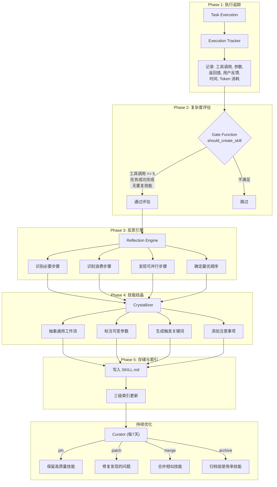

**五个阶段详解：**

**阶段一：执行追踪（Execution Tracking）**。`tracker.py` 记录每次工具调用的完整信息：参数、返回结果、用户反馈/纠正、耗时和 Token 消耗。

**阶段二：复杂度评估（Complexity Evaluation）**。门控函数 `should_create_skill(execution_trace)` 必须同时满足三个条件：执行追踪中包含 5+ 个工具调用；任务成功完成；不是已有技能的重复（通过 `find_similar_skill()` 检查）。

**阶段三：反思引擎（Reflection Engine）**。`reflector.py` 分析执行轨迹，识别哪些步骤是必要的、哪些是浪费的、确定最优执行顺序、发现可并行化的步骤。

**阶段四：技能结晶（Skill Crystallization）**。`crystallizer.py` 将具体的执行经验抽象为通用工作流：剥离特定参数、标注可变参数、生成触发关键词、添加注意事项。

**阶段五：存储与索引**。技能持久化到文件系统，三级索引更新（Level 0 元数据、Level 1 完整内容、Level 2 引用文件）。

**后台审查系统（Background Review）**：每轮对话结束后 fork 后台 Agent，使用独立的辅助模型审查对话，寻找用户偏好和技能创建机会。工具白名单限制为 `memory` 和 `skill_manage`，确保后台审查不会产生副作用。

**管护器（Curator）**：每 7 天在 Agent 空闲时触发，使用辅助模型审查 Agent 创建的技能。可执行的操作：pin（标记高价值，免于清理）、archive（归档低使用率）、merge（合并相似技能）、patch（修复发现的问题）。规则：永不触碰用户编写或内置的技能；归档而非删除。

**RL 飞轮集成**：与 Nous Research 的分布式 RL 训练框架 Atropos 集成，自动将 Agent 执行轨迹记录为强化学习训练数据。形成良性循环：应用层轨迹数据 → 训练更好的模型 → 改进应用层。

#### 14.3 其他 AI 工具为什么没有这个功能？

实现自学习自进化需要解决几个关键挑战，这些挑战是大多数 AI 工具没有跨越的门槛。

首先是**架构复杂度**：需要在 Agent 循环之上构建完整的元学习系统（追踪、评估、反思、结晶、索引），这显著增加了系统复杂度。商业产品通常追求简洁可控。

其次是**安全与可审计性**：自动生成的技能可能包含错误甚至有害内容。Hermes Agent 通过 Curator 审查、安全扫描、AST 审计来缓解这个问题，但这需要大量工程投入。

第三是**上下文成本**：持久化记忆和技能需要占用宝贵的上下文窗口。Hermes Agent 通过三级渐进加载和冻结快照模式来控制成本，但这种优化是非平凡的工程挑战。

第四是**产品定位差异**：Claude Code 定位为编程工具，优先保证代码生成质量；Cursor 是 IDE 插件，受限于编辑器架构；GitHub Copilot 专注于代码补全。这些工具的核心价值主张不在"学习"上。

最后是**开源 vs 商业**：Hermes Agent 作为开源项目，可以容忍更长的技能积累周期和偶尔的错误。商业产品对可靠性的要求更高，自动化程度越高，出错的代价越大。

#### 14.4 如何自定义实现自学习自进化能力

基于 Hermes Agent 的架构，实现自定义的自学习系统需要以下核心组件：

```python
# 1. 执行追踪器
class ExecutionTracker:
    def record(self, tool_name, args, result, feedback, duration, tokens):
        """记录每次工具调用的完整上下文"""
        pass

# 2. 门控评估器
class SkillGate:
    def should_create(self, trace) -> bool:
        """判断是否值得提炼为技能"""
        return (len(trace.tool_calls) >= 5
                and trace.is_successful
                and not self.find_similar(trace))

# 3. 反思引擎
class ReflectionEngine:
    def analyze(self, trace) -> ReflectionResult:
        """LLM 分析执行轨迹，提取模式"""
        prompt = f"分析以下执行轨迹，识别必要/浪费步骤..."
        return llm.analyze(prompt, trace)

# 4. 技能结晶器
class SkillCrystallizer:
    def crystallize(self, reflection) -> Skill:
        """将反思结果抽象为可复用技能"""
        return Skill(
            name=reflection.suggested_name,
            steps=reflection.essential_steps,
            triggers=reflection.trigger_keywords,
            caveats=reflection.pitfalls
        )

# 5. 后台审查器
class BackgroundReviewer:
    def review(self, conversation):
        """异步审查对话，提取偏好和技能机会"""
        # 使用辅助模型，工具白名单限制
        pass
```

关键实现要点：后台执行不阻塞主循环、使用轻量辅助模型降低成本、限制后台操作的权限范围（只允许读写记忆和技能）、实现渐进式技能加载控制上下文开销、定期审查和清理防止技能膨胀。

### 十五、与其他 AI Agent 深度对比分析

| 维度 | Hermes Agent | OpenClaw | Claude Code | Qoder | Cursor | GitHub Copilot | Codex |
|------|-------------|----------|-------------|-------|--------|---------------|-------|
| 类型 | 通用对话式 Agent | 通用对话式 Agent | 编码专用 | 桌面全能 Agent | IDE 编码助手 | 代码补全 | 编码专用(云) |
| 模型锁定 | 无(200+ LLM) | 无 | Anthropic only | 多模型 | 多模型 | OpenAI | OpenAI |
| 自学习 | 完整闭环(自动) | 无 | CLAUDE.md(手动) | 技能系统 | .cursorrules(手动) | 无 | 预览中 |
| 记忆持久化 | 三层架构+8插件 | 会话级 | 项目级文件 | 记忆系统 | 无 | 无 | 无 |
| 多渠道 | 24+ 平台 | 10+ 平台 | 终端/IDE/桌面 | 桌面+IM | IDE only | IDE only | Web |
| 执行环境 | 6种后端 | 本地 | 本地+远程 | 本地 | 本地+云 | 本地 | 云端沙箱 |
| 上下文管理 | 三层提示词+压缩 | Token 计数 | 200K 窗口 | 上下文工程 | 模型依赖 | 短上下文 | 1M tokens |
| 技能系统 | agentskills.io | 100+ 内置 | MCP | Skill 系统 | 扩展 | 无 | 插件 |
| 多 Agent | 5种机制 | 无 | 无 | 子任务 | 无 | 无 | 无 |
| 安全 | 250+ 模式库 | 基础 | 权限系统 | 安全策略 | IDE 沙箱 | 最小权限 | 沙箱 |
| 成本 | 免费(自带 Key) | 免费 | $100-200/月 | 积分制 | $20-200/月 | $10-19/月 | 按量计费 |
| 开源 | MIT | MIT | 非开源 | 非开源 | 非开源 | 非开源 | 非开源 |

**核心差异化分析：**

Hermes Agent 的独特竞争力在于**真正的自学习闭环**——这不是一个噱头，而是经过深思熟虑的五阶段工程系统。其他工具要么完全没有学习能力（Copilot、Cursor），要么依赖用户手动维护配置文件（Claude Code 的 CLAUDE.md、Cursor 的 .cursorrules）。

在**多渠道覆盖**方面，Hermes Agent 的 24+ 平台消息网关远超其他竞品。这使得同一个 Agent 可以通过 Telegram 在手机上使用，也可以通过 CLI 在开发环境中使用，并且记忆和技能跨平台共享。

在**模型自由度**方面，Hermes Agent 支持 200+ LLM，用户可以自由选择最适合自己场景和预算的模型，不被任何单一提供商锁定。

### 十六、架构设计启发

Hermes Agent 的架构设计为 AI Agent 开发提供了多方面的启发：

**启发一：学习应该是系统级特性，而非应用层补丁**。Hermes Agent 将学习循环深度嵌入了 Agent 架构的每一层——从执行追踪、到后台审查、到技能结晶、到管护优化。这不是一个后加的功能，而是整个系统的设计目标。这告诉我们：如果一个能力足够重要，就应该在架构层面为它预留空间。

**启发二：渐进式信息暴露是管理复杂度的关键模式**。技能系统的三级加载（元数据 → 完整内容 → 引用文件）、系统提示词的三层架构（稳定 → 上下文 → 易变）、记忆系统的三层设计（存储 → 编排 → 插件），处处体现着"按需加载"的思想。这在有限上下文窗口的约束下尤为重要。

**启发三：前缀缓存优化是实用的成本控制手段**。通过精心设计提示词的排列顺序——稳定内容在前、易变内容在后——可以最大化 LLM Provider 的前缀缓存命中率，带来约 75% 的成本节省。这种看似微小的优化在大规模应用时效果显著。

**启发四：Provider 抽象模式使系统获得了惊人的灵活性**。统一的 Provider 接口使得 Hermes Agent 可以无缝切换 LLM 后端、记忆存储、搜索引擎、浏览器驱动等几乎所有外部依赖。这种设计模式值得在所有 Agent 框架中推广。

**启发五：安全不是附加层，而是贯穿始终的设计约束**。250+ 威胁模式库、双层安全扫描（写入时+加载时）、路径穿越防护、AST 审计、权限最小化——这些机制从一开始就被设计到系统中，而非事后补救。对于能够执行任意工具调用的 Agent 系统，这种安全意识是必要的。

**启发六：简洁的核心循环 + 丰富的外围系统 = 可维护的复杂性**。Agent Loop 本身不到 10 行代码，但外围的预算管理、重试状态机、三维护栏、中断处理赋予了它强大的鲁棒性。这种"内核简单、外围丰富"的设计使得系统既易于理解又功能强大。

**启发七：后台异步处理是保持响应性的关键**。记忆同步、预取、后台审查都在后台线程中执行，不阻塞主循环。单工作线程的 ThreadPoolExecutor 设计既保证了有序执行，又避免了阻塞。

### 参考文档

- [NousResearch/hermes-agent - GitHub](https://github.com/nousresearch/hermes-agent)
- [anneheartrecord/hermes-agent-anatomy: hermes-agent 源码解析](https://github.com/anneheartrecord/hermes-agent-anatomy)
- [cclank/Hermes-Wiki: Hermes agent + LLM Wiki](https://github.com/cclank/Hermes-Wiki)
- [ZhangHanDong/hermes-book: Hermes Agent Book](https://github.com/ZhangHanDong/hermes-book)
- [Hermes Agent 源码解析：七大功能模块是怎么工作的 - CSDN](https://agent.csdn.net/6a2f9b6a662f9a54cb7f486d.html)
- [深入源码：Hermes Agent 如何实现 Self-Improving - 知乎](https://zhuanlan.zhihu.com/p/2030761424344061814)
- [Hermes Agent 源码架构深度拆解：学习循环是如何实现的？ - 腾讯云](https://cloud.tencent.com/developer/article/2655748)
- [Hermes Agent 源码拆解：一个循环不到 10 行代码的 Agent 框架 - 腾讯云](https://cloud.tencent.com/developer/article/2672941)
- [Hermes Agent 源码解析：A Closed Learning Loop - 什么值得买](https://post.smzdm.com/p/aqr79zkv/)
- [Hermes Agent 核心运行系统调用流程 源码分析 - AtomGit](https://gitcode.csdn.net/69de367d0a2f6a37c59faee9.html)
- [Agent 自进化深度解析：从 Hermes Agent 源码出发 - ATA](https://ata.atatech.org/articles/11020637613)
- [Hermes Agent 源码解析: 自进化能力解读 - ATA](https://ata.atatech.org/articles/11020628817)
- [HermesAgent 源码分析解读 - ATA](https://ata.atatech.org/articles/11020620811)
- [Hermes Agent 上下文管理深度解析 - ATA](https://ata.atatech.org/articles/11020625326)
- [Hermes Agent 记忆系统全方位深度解析 - ATA](https://ata.atatech.org/articles/11020608506)
- [Hermes-Agent Skill 自进化闭环 - ATA](https://ata.atatech.org/articles/11020618022)
- [Hermes Agent：自我进化的开源 AI Agent 深度研究报告 - ATA](https://ata.atatech.org/articles/11020608125)
- [别再从零开始了！架构、记忆、技能系统全拆解 - ATA](https://ata.atatech.org/articles/11020608510)
