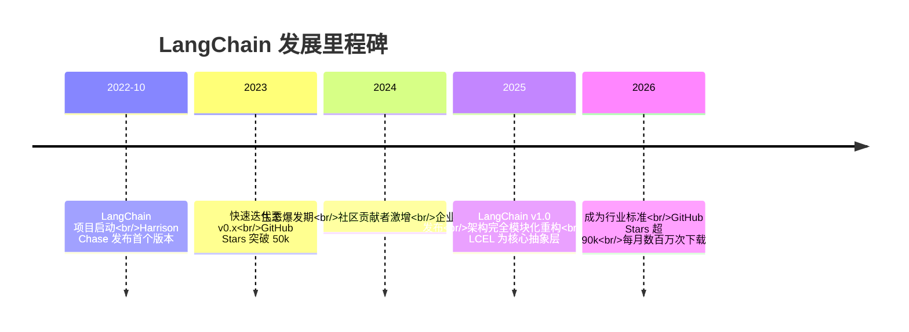
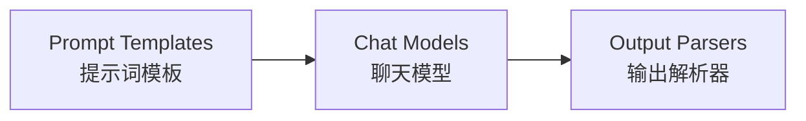
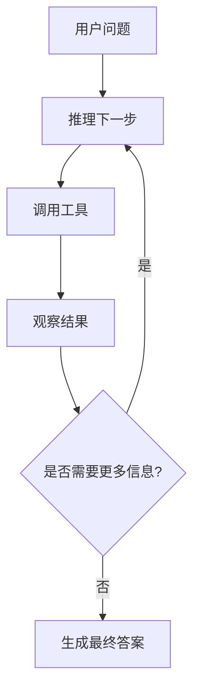
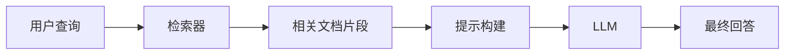
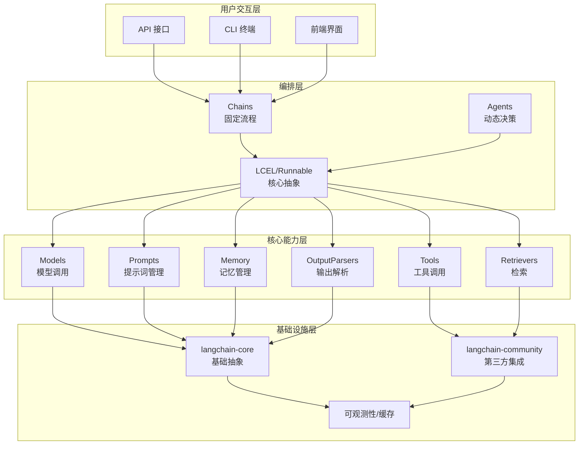
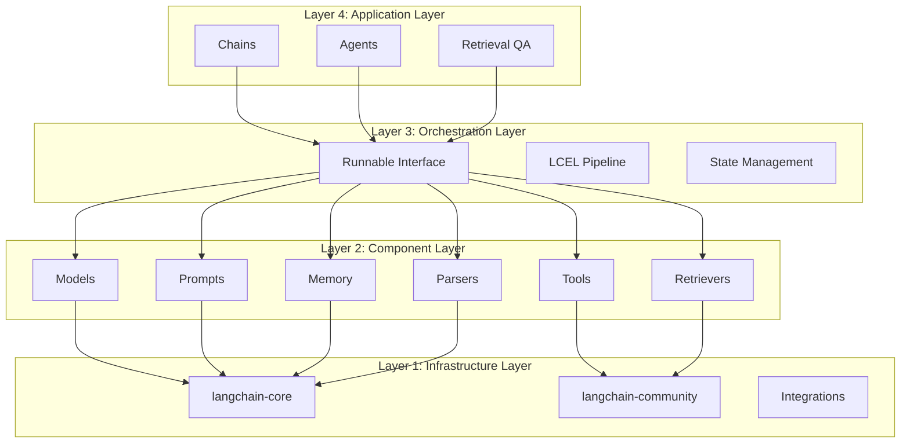
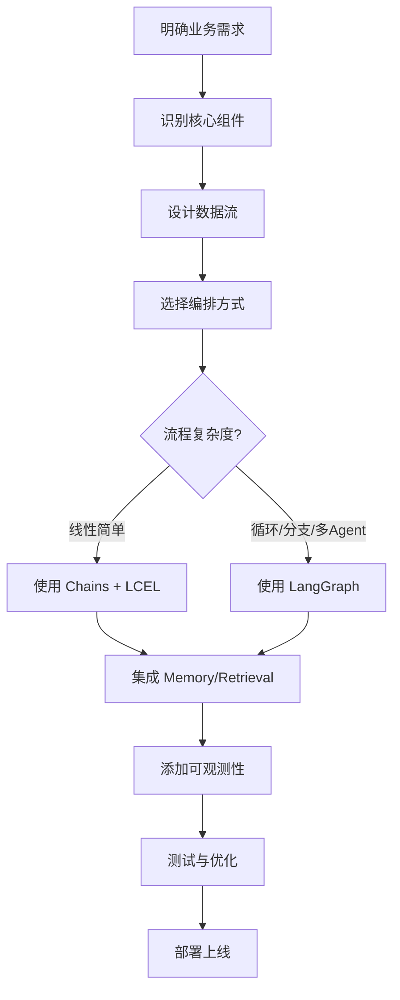
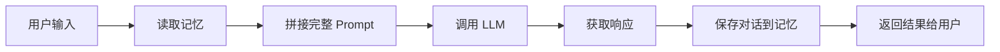
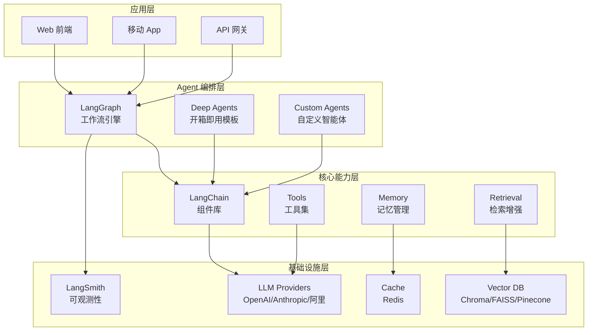

# LangChain 深入理解

## 目录

- [LangChain 是什么](#langchain-是什么)
- [LangChain 的出现背景和发展历程](#langchain-的出现背景和发展历程)
- [为什么需要 LangChain？](#为什么需要-langchain)
- [LangChain 核心功能特性](#langchain-核心功能特性)
- [LangChain 的内部组成结构](#langchain-的内部组成结构)
- [LangChain 底层原理和架构](#langchain-底层原理和架构)
- [如何设计 LangChain 应用](#如何设计-langchain-应用)
- [LangChain 的安装与配置](#langchain-的安装与配置)
- [LangChain Memory 机制详解](#langchain-memory-机制详解)
- [LangChain vs LangGraph：区别与应用场景](#langchain-vs-langgraph区别与应用场景)
- [LangChain 在不同语言框架中的应用](#langchain-在不同语言框架中的应用)
- [LangChain 与其他框架对比优势](#langchain-与其他框架对比优势)
- [LangChain 实战使用 Demo Case](#langchain-实战使用-demo-case)
- [当前 LangChain 在实际项目中的最佳实践](#当前-langchain-在实际项目中的最佳实践)
- [从 LangChain 到 Agent：完整技术栈搭建](#从-langchain-到-agent完整技术栈搭建)
- [LangChain 总结](#langchain-总结)
- [参考文档](#参考文档)

---

## LangChain 是什么

LangChain 是一个开源的软件开发框架，主要用于简化使用大语言模型（LLM，如 ChatGPT）构建应用程序的过程。它就像是大模型与现实世界数据或工具之间的"桥梁"，让开发者能够轻松将 LLM 连接到外部数据库、API 等，打造出功能复杂的 AI 应用。

### 核心定位

LangChain 是一个用于开发由语言模型驱动的应用程序的框架。它使得应用程序能够：

- **具有上下文感知能力**：将语言模型连接到上下文来源（提示指令，少量的示例，需要回应的内容等）
- **具有推理能力**：依赖语言模型进行推理（根据提供的上下文如何回答，采取什么行动等）

### 通俗理解

如果把大模型比作一个拥有很多知识的天才，那 LangChain 就是他的助理。没 LangChain 时你问天才问题，他只能靠脑子里的旧知识瞎编，也没法帮你干活。有了 LangChain：

- 助理会先帮天才查资料连数据库（RAG - 检索增强生成）
- 帮他记着刚才聊了啥（Memory - 记忆）
- 甚至帮他把事办了（Agents 智能体和 Tools 工具）

---

## LangChain 的出现背景和发展历程

### 诞生背景

LangChain 是由 Harrison Chase 于 2022 年 10 月发起的开源 LLM 应用开发框架，比 ChatGPT 问世还要早一个月。当时大语言模型刚刚兴起，开发者面临的核心痛点是：

1. **模型调用碎片化**：不同厂商（OpenAI、Anthropic、Google 等）的 API 接口各异
2. **缺乏标准化组件**：提示词管理、输出解析、工具调用等都需要重复造轮子
3. **复杂流程编排困难**：多步骤任务需要手动串联，代码冗长且难以维护
4. **状态管理缺失**：LLM 本身是无状态的，无法维持多轮对话上下文

### 发展历程



### 关键转折点

- **v0.x 时代**：以快速功能堆砌为主，API 不稳定，存在破坏性更新
- **v1.0 里程碑**：完成底层架构重构，确立 `Runnable/LCEL` 为核心抽象层，清晰划分应用层与基础设施层，API 稳定性大幅提升
- **Deep Agents 推出**：提供开箱即用的复杂 Agent 模板，内置规划工具、上下文压缩等企业级特性

截至 2026 年，LangChain 在 GitHub 上已获得超过 90,000 Stars，每月数百万次下载，成为企业级 LLM 应用开发的标准基础设施。

---

## 为什么需要 LangChain？

### 传统 LLM 开发的痛点

在没有 LangChain 之前，开发者直接调用 LLM API 面临以下问题：

| 痛点 | 说明 |
|------|------|
| **模型切换成本高** | 更换模型提供商需要重写大量代码 |
| **提示词管理混乱** | 硬编码在代码中，难以维护和复用 |
| **无状态限制** | 每次调用都是独立的，无法记住历史对话 |
| **工具集成复杂** | 需要手动编写 HTTP 请求、参数校验、错误处理 |
| **流程编排困难** | 多步骤任务需要手动串联，代码冗长 |
| **可观测性差** | 难以追踪 token 消耗、延迟、错误率 |

### LangChain 带来的价值

LangChain 通过以下方式解决上述问题：

1. **模型抽象层**：统一接口封装不同厂商的 LLM，开发者无需关注底层模型差异
2. **组件化架构**：将复杂任务拆解为可复用的模块（如检索器、工具集、记忆模块）
3. **工作流引擎**：提供链式调用、条件分支等执行控制能力，支持复杂业务逻辑
4. **生产级特性**：内置可观测性、容错、并发支持，适配企业级场景

### 实际案例

某金融企业通过 LangChain 构建的智能投研系统，将研报生成时间从 3 小时缩短至 8 分钟，准确率提升 40%。

---

## LangChain 核心功能特性

### 1. Model I/O（模型输入输出）

Model I/O 是应用与 LLM 交互的核心模块，类似于 JDBC 与数据库的关系。其核心价值在于**解耦应用逻辑与底层模型实现**，让你可以自由切换不同提供商（OpenAI、Anthropic、Google 等）而不改变业务代码。

#### 三步工作流程



**Prompt Templates（提示词模板）**：结构化提示词，支持变量替换和复用

```python
from langchain_core.prompts import ChatPromptTemplate

# 方式一：from_messages（推荐）
prompt = ChatPromptTemplate.from_messages([
    ("system", "你是一个{role}，专门帮助用户解决{topic}问题"),
    ("human", "我的问题是：{question}")
])

# 格式化输入
formatted_prompt = prompt.format(
    role="技术顾问",
    topic="编程",
    question="Python如何处理异常？"
)
```

**Chat Models（聊天模型）**：统一的模型接口，支持多种提供商

```python
from langchain_openai import ChatOpenAI
from langchain_anthropic import ChatAnthropic
from langchain_google_genai import ChatGoogleGenerativeAI

# OpenAI
openai_llm = ChatOpenAI(
    model="gpt-4o",
    temperature=0.7,
    streaming=True  # 启用流式输出
)

# Anthropic
claude_llm = ChatAnthropic(
    model="claude-3-5-sonnet-20241022",
    temperature=0.7
)
```

**Output Parsers（输出解析器）**：将原始输出转换为结构化数据

```python
from langchain_core.output_parsers import StrOutputParser, JsonOutputParser
from pydantic import BaseModel

# Pydantic解析器（推荐用于结构化输出）
class Answer(BaseModel):
    result: str
    confidence: float
    sources: list[str]

pydantic_parser = PydanticOutputParser(pydantic_object=Answer)
```

### 2. Chains（链）

Chain 是将多个组件串联起来的工作流。它代表了如何完成一个特定任务的完整逻辑。

```python
from langchain_core.runnables import RunnablePassthrough

# LCEL 管道方式（推荐）
chain = prompt | llm | parser
result = chain.invoke({"concept": "LLM"})
```

### 3. Memory（记忆）

Memory 组件解决 LLM "无状态" 问题，通过存储和管理对话历史，让模型能够记住之前的对话内容，实现连贯的多轮交互。

主要类型包括：
- **ConversationBufferMemory**：完整存储所有对话历史
- **ConversationBufferWindowMemory**：仅保留最近 N 轮对话
- **ConversationTokenBufferMemory**：按 Token 数量控制上下文长度
- **ConversationSummaryMemory**：通过生成摘要来压缩和记忆长对话

### 4. Agents（智能体）

Agent 是根据用户输入自动规划执行步骤、选择工具并最终完成任务的智能组件。

核心运行模式是 **ReAct（Reasoning + Acting）**：推理 → 行动 → 观察 → 再推理



### 5. Retrieval（检索增强生成 RAG）

RAG 通过三阶段提升回答质量：



包含以下子组件：
- **Document Loader**：从各种来源加载文档
- **Text Splitter**：将长文档切分为小块
- **Embedding Model**：将文本转换为向量
- **Vector Store**：存储和检索向量
- **Retriever**：根据语义相似度检索相关文档

---

## LangChain 的内部组成结构

LangChain v1.0+ 采用分层式模块化架构，整体可分为 4 个核心层级：



### 各层级职责

| 层级 | 职责 | 核心组件 |
|------|------|----------|
| **用户交互层** | 应用的入口与出口，负责接收用户输入并返回处理结果 | API 接口、CLI 终端、前端界面 |
| **编排层** | LangChain 的核心调度层，通过 Runnable/LCEL 定义组件的执行流程 | Chains、Agents、LCEL |
| **核心能力层** | 构建 LLM 应用的基础能力组件 | Models、Prompts、Tools、Memory、Retrievers、OutputParsers |
| **基础设施层** | 底层依赖组件，负责对接外部系统并提供支撑能力 | langchain-core、langchain-community、可观测性、缓存 |

### 核心库说明

| 库名 | 说明 |
|------|------|
| `langchain-core` | 基础抽象和 LangChain 表达式语言（LCEL），是组件协同的核心 |
| `langchain-community` | 第三方集成模块，覆盖 Model I/O、Retrieval、Tool 等 |
| `langchain` | 包含 Chains、Agents、Retrieval 等核心业务组件 |
| `langgraph` | 编排多个节点，负责整个工作流的调度与状态跳转 |
| `langserve` | 将 LangChain 链部署为 REST API |
| `LangSmith` | 开发者平台，用于调试、测试、评估和监控 LLM 应用程序 |

---

## LangChain 底层原理和架构

### 核心抽象：Runnable 与 LCEL

LangChain v1.0 确立了 **Runnable / LCEL（LangChain Expression Language）** 为核心抽象层，统一所有组件的交互范式。

**Runnable** 是所有 LangChain 组件的基类，提供统一的 `invoke`、`stream`、`batch` 等方法。

**LCEL** 是一种声明式的流程编排语言，通过 `|` 操作符将组件串联成管道：

```python
# 传统命令式方式
formatted_prompt = prompt.format(concept="LLM")
response = llm.invoke(formatted_prompt)
result = parser.invoke(response)

# LCEL 声明式方式（推荐）
chain = prompt | llm | parser
result = chain.invoke({"concept": "LLM"})
```

### 分层架构设计



### 状态管理机制

LangChain 的状态管理分为两种模式：

1. **隐式状态传递**（传统 Chains）：通过链的输入输出在组件间传递状态
2. **显式状态管理**（LangGraph）：维护中央状态对象，所有节点共享和修改

---

## 如何设计 LangChain 应用

### 设计原则

1. **组件化思维**：将复杂任务拆解为独立的可复用组件
2. **声明式编排**：优先使用 LCEL 而非命令式代码
3. **松耦合设计**：各层级可独立替换，降低耦合度
4. **可观测性优先**：集成 LangSmith 进行全链路监控

### 设计流程



### 典型设计模式

#### 1. RAG 问答模式

```python
from langchain_community.document_loaders import WebBaseLoader
from langchain_text_splitters import RecursiveCharacterTextSplitter
from langchain_community.vectorstores import FAISS
from langchain_openai import OpenAIEmbeddings
from langchain_core.prompts import ChatPromptTemplate
from langchain_core.runnables import RunnablePassthrough

# 加载文档
loader = WebBaseLoader("https://example.com/docs")
docs = loader.load()

# 分割文本
text_splitter = RecursiveCharacterTextSplitter(chunk_size=1000, chunk_overlap=200)
splits = text_splitter.split_documents(docs)

# 创建向量存储
vectorstore = FAISS.from_documents(splits, OpenAIEmbeddings())
retriever = vectorstore.as_retriever()

# 构建 RAG 链
template = """基于以下上下文回答问题:
{context}

问题: {question}
"""
prompt = ChatPromptTemplate.from_template(template)

rag_chain = (
    {"context": retriever, "question": RunnablePassthrough()}
    | prompt
    | llm
    | StrOutputParser()
)

result = rag_chain.invoke("什么是 LangChain?")
```

#### 2. Agent 工具调用模式

```python
from langchain.agents import initialize_agent, Tool
from langchain.agents import ZeroShotReActAgent

# 定义工具
def search_web(query: str) -> str:
    """搜索网络获取信息"""
    # 实现搜索逻辑
    return f"搜索结果: {query}"

tools = [
    Tool(
        name="WebSearch",
        func=search_web,
        description="当需要搜索网络信息时使用此工具"
    )
]

# 初始化 Agent
agent = initialize_agent(
    tools=tools,
    llm=llm,
    agent=ZeroShotReActAgent,
    verbose=True
)

result = agent.invoke("今天北京的天气怎么样？")
```

---

## LangChain 的安装与配置

### Python 环境安装

#### 基础安装

```bash
pip install langchain langchain-community
```

#### 按需安装特定集成

```bash
# OpenAI 集成
pip install langchain-openai

# Anthropic 集成
pip install langchain-anthropic

# Google Gemini 集成
pip install langchain-google-genai

# 向量数据库
pip install chromadb faiss-cpu

# 本地 Ollama 模型
pip install langchain-ollama
```

#### 使用国内镜像源加速

```bash
pip install langchain langchain-community langchain-openai chromadb \
  -i https://pypi.tuna.tsinghua.edu.cn/simple
```

### 环境变量配置

```bash
# OpenAI API Key
export OPENAI_API_KEY="your-api-key"

# 阿里百炼 API Key
export DASHSCOPE_API_KEY="your-api-key"
export DASHSCOPE_BASE_URL="https://dashscope.aliyuncs.com/compatible-mode/v1"

# Anthropic API Key
export ANTHROPIC_API_KEY="your-api-key"
```

或使用 `.env` 文件：

```python
from dotenv import load_dotenv
load_dotenv()
```

### 版本管理与更新

```bash
# 查看当前版本
pip show langchain

# 更新到最新版本
pip install --upgrade langchain langchain-community

# 安装指定版本
pip install langchain==0.3.7
```

### 卸载

```bash
pip uninstall langchain langchain-community
```

---

## LangChain Memory 机制详解

### Memory 的核心价值

LangChain 的记忆系统旨在解决大语言模型"无状态天性"与"对话连续性需求"矛盾，本质是"上下文管理中间件"。其核心价值在于实现对话状态的持久化存储与动态调用，让 AI 应用从"单次问答工具"升级为"智能交互助手"。

### Memory 工作流程



### Memory 分类

#### 按存储范围划分

| 类型 | 说明 | 适用场景 |
|------|------|----------|
| **会话级记忆** | 存储单次会话内的历史交互，会话结束后记忆清空 | 短期对话、客服机器人 |
| **实体级记忆** | 存储跨会话的实体信息（如用户偏好、属性），支持长期复用 | 个性化助手、CRM 系统 |

#### 按上下文格式划分

| 类型 | 说明 | 优缺点 |
|------|------|--------|
| **原始文本类** | 直接存储完整对话历史 | 上下文完整性高，但 Token 消耗大 |
| **结构化类** | 将历史信息转换为摘要、实体属性等结构化数据 | 降低 Token 消耗，但可能丢失细节 |

### 核心记忆类型实战

#### 1. ConversationBufferMemory（完整会话记忆）

核心逻辑：逐句存储完整对话历史，无裁剪或压缩。

```python
from langchain.memory import ConversationBufferMemory
from langchain.chains import ConversationChain

# 初始化记忆组件
memory = ConversationBufferMemory(
    memory_key="chat_history",  # 记忆在 Prompt 中的键名
    return_messages=True  # 返回 Message 对象（而非字符串）
)

# 构建对话链
conversation_chain = ConversationChain(
    llm=llm,
    memory=memory,
    verbose=True  # 打印执行过程
)

# 多轮对话测试
conversation_chain.invoke({"input": "我叫张三，计划去北京旅游3天"})
conversation_chain.invoke({"input": "我刚才提到的名字是什么？"})
# 输出: "你刚才提到你的名字是张三"
```

**优点**：逻辑简单、上下文完整  
**缺点**：长对话易超 Token 限制，Token 消耗高

#### 2. ConversationBufferWindowMemory（窗口会话记忆）

核心逻辑：仅保留最近 N 轮对话，通过 `k` 参数控制窗口大小。

```python
from langchain.memory import ConversationBufferWindowMemory

# 初始化窗口记忆（保留最近2轮对话）
memory = ConversationBufferWindowMemory(
    k=2,  # 窗口大小：仅保留最近2轮
    memory_key="chat_history",
    return_messages=True
)

conversation_chain = ConversationChain(llm=llm, memory=memory, verbose=True)
conversation_chain.invoke({"input": "我叫张三，计划去北京旅游3天"})
conversation_chain.invoke({"input": "北京10月份天气怎么样？"})
conversation_chain.invoke({"input": "我刚才提到的旅行天数是多少？"})
# 能正常回答（在窗口内）
conversation_chain.invoke({"input": "我叫什么名字？"})
# 无法回答（超出窗口范围）
```

**优点**：自动截断历史，Token 消耗可控  
**缺点**：可能丢失早期关键信息

#### 3. ConversationTokenBufferMemory（Token 窗口记忆）

核心逻辑：按 Token 数量控制上下文，超出阈值时裁剪早期内容。

```python
from langchain.memory import ConversationTokenBufferMemory

# 初始化 Token 窗口记忆
memory = ConversationTokenBufferMemory(
    llm=llm,  # 依赖 LLM 计算 Token 数
    max_token_limit=300,  # 最大 Token 限制
    memory_key="chat_history",
    return_messages=True
)
```

**优点**：精准控制 Token 消耗  
**缺点**：需额外依赖 Token 计算工具（如 tiktoken）

#### 4. ConversationSummaryMemory（摘要记忆）

核心逻辑：利用大模型自身的总结能力，将旧的对话内容压缩成一段摘要。

```python
from langchain.memory import ConversationSummaryMemory

memory = ConversationSummaryMemory(
    llm=llm,
    memory_key="chat_history"
)
```

**优点**：无论对话进行多久，传递给模型的始终是一段精炼的核心摘要  
**缺点**：需要额外的 LLM 调用来生成摘要，增加成本

### 高级记忆策略：混合架构

2026 年的趋势是**混合策略**：近期用缓冲记忆保精度，中期用摘要记忆省成本，长期用向量存储做知识关联。

```python
# 短期记忆：缓冲窗口
short_term_memory = ConversationBufferWindowMemory(k=5)

# 中期记忆：摘要
summary_memory = ConversationSummaryMemory(llm=llm)

# 长期记忆：向量存储
from langchain.memory import VectorStoreRetrieverMemory
from langchain_community.vectorstores import Chroma
from langchain_openai import OpenAIEmbeddings

vectorstore = Chroma(embedding_function=OpenAIEmbeddings())
retriever = vectorstore.as_retriever(search_kwargs={"k": 3})
long_term_memory = VectorStoreRetrieverMemory(retriever=retriever)
```

### LangGraph 中的 Checkpointer 机制

在 LangGraph 中，记忆通过 **Checkpointer** 实现持久化：

```python
from langgraph.checkpoint.memory import InMemorySaver

# 创建检查点保存器
checkpointer = InMemorySaver()

# 编译工作流时传入 checkpointer
app = workflow.compile(checkpointer=checkpointer)

# 执行时指定 thread_id（会话 ID）
thread_config = {"configurable": {"thread_id": "user-123"}}
result = app.invoke(input, thread_config)

# 如果中断，可以从检查点恢复
resumed = app.invoke(None, thread_config)
```

---

## LangChain vs LangGraph：区别与应用场景

### 一句话理解

**LangChain 是零件，LangGraph 是装配线。**

### 核心定位对比

| 维度 | LangChain | LangGraph |
|------|-----------|-----------|
| **定位** | 模块化工具箱：提供各类组件（模型、解析器、向量库等） | 编排引擎：用于设计组件间的复杂流转关系 |
| **设计哲学** | 链式思维：线性执行 A → B → C，像一条流水线 | 图式思维：状态机模型，支持灵活的条件分支与循环 |
| **底层架构** | 有向无环图（DAG）：路只能往前走，无法回头 | 有向循环图：支持循环、分支、重试 |
| **核心优势** | 快速开发：生态丰富，代码简洁，集成方便 | 精细控制：状态管理出色，支持动态路由、重试和"人机协同" |
| **状态管理** | 隐式：通过链或内存传递，管理较为简单 | 显式：全局状态对象，提供快照、持久化与时间旅行能力 |
| **错误恢复** | 脆弱：单点失败可能导致整体中断 | 健壮：内置重试、回滚与备用路径 |
| **学习曲线** | 平缓：API 直观，文档丰富，上手快 | 较陡：需理解状态机、图结构等概念 |

### 应用场景对比

#### ✅ 什么时候优先选 LangChain？

当你的任务流程是线性的，或是快速原型验证时，LangChain 是最高效的选择：

- **标准 RAG 问答**：经典的 检索 → 增强 → 生成 三步走
- **单次数据处理**：如摘要生成、翻译、数据格式转换
- **概念验证（POC）**：用极简代码快速测试想法是否可行

#### ✅ 什么时候必须考虑 LangGraph？

当你的智能体需要自我反思、多轮决策或长期运行时，LangGraph 是更可靠的方案：

- **多智能体系统**：需要智能体间协同、辩论或任务委派
- **带循环的工作流**：例如"代码审查 → 提出修改意见 → 重新修改代码 → 再次审查"的闭环
- **人机协同（Human-in-the-Loop）**：AI 处理到关键步骤（如付款、审批），需要暂停等待人工确认后继续
- **长时间运行的任务**：需要跨会话保持状态，防止意外中断导致进度丢失

### LangGraph 的核心能力

#### 1. 持久化执行（Durable Execution）

解决的问题：长时间运行的代理可能中断，需要保存和恢复状态。

```python
from langgraph.checkpoint.postgres import PostgresSaver

# 保存状态到数据库
checkpointer = PostgresSaver(connection_string)
app = workflow.compile(checkpointer=checkpointer)

# 执行可以暂停和恢复
result = await app.invoke(input, {
    "configurable": {"thread_id": "user-123"}
})

# 如果中断，可以从检查点恢复
resumed = await app.invoke(None, {
    "configurable": {"thread_id": "user-123"}
})
```

#### 2. 流式处理（Streaming）

实时输出每个步骤的结果：

```python
async for chunk in await app.stream(input, {
    "stream_mode": "updates"
}):
    print('当前步骤:', chunk)
    # 实时显示进度给用户
```

#### 3. 人机协同（Human-in-the-Loop）

在关键决策点暂停，等待人类输入：

```python
workflow = StateGraph(State) \
    .add_node("analyze", analyze_node) \
    .add_node("human_approval", human_approval_node)  # 人工审批节点
    .add_node("execute", execute_node) \
    .add_edge("analyze", "human_approval") \
    .add_edge("human_approval", "execute") \
    .compile()

# 执行会在 human_approval 节点暂停
state = await app.invoke(input)

# 人工审批后继续
final_state = await app.invoke({
    **state,
    "approved": True,  # 人类的输入
})
```

#### 4. 条件分支和循环

```python
def should_loop(state: ReviewState) -> str:
    # 置信度低则回头再取一轮 context
    if state["confidence"] < 0.75 and state["iterations"] < 3:
        return "fetch_more_context"
    return "write_review"

graph = StateGraph(ReviewState)
graph.add_node("get_context", context_node)
graph.add_node("analyze", analysis_node)
graph.add_conditional_edges("analyze", should_loop, {
    "fetch_more_context": "get_context",
    "write_review": "review"
})
```

### 两者关系：不是二选一，而是组合使用

在实际的生产环境中，这两个框架通常不是"二选一"的关系，而是组合使用：

- **控制层（LangGraph）**：负责任务的路由分发和状态管理
- **执行层（LangChain）**：负责具体的原子操作（加载文档、调用 API 查天气等）

从 LangChain v1.0 开始，其高级 `create_agent` 方法底层正是由 LangGraph 驱动的。这表明两者在 LangChain 生态中的地位——未来并不是非此即彼，而是基于 LangGraph 核心，享受 LangChain 的便捷。

---

## LangChain 在不同语言框架中的应用

### Python（官方首选）

Python 是 LangChain 的原生支持语言，拥有最完整的生态和最丰富的文档。

```python
# 安装
pip install langchain langchain-openai

# 基础使用
from langchain_openai import ChatOpenAI
from langchain_core.prompts import ChatPromptTemplate

llm = ChatOpenAI(model="gpt-4o")
prompt = ChatPromptTemplate.from_template("你好，{name}！")
chain = prompt | llm
result = chain.invoke({"name": "世界"})
```

**优势**：
- 官方维护，更新最快
- 社区资源最丰富
- 与 AI/ML 生态无缝集成（NumPy、Pandas、PyTorch 等）

### Java（LangChain4j）

LangChain4j 是 LangChain 的 Java 实现，适合企业级 Java 应用。

```java
// Maven 依赖
// <dependency>
//     <groupId>dev.langchain4j</groupId>
//     <artifactId>langchain4j</artifactId>
//     <version>0.30.0</version>
// </dependency>

import dev.langchain4j.model.openai.OpenAiChatModel;
import dev.langchain4j.service.AiServices;

public class Example {
    interface Assistant {
        String chat(String userMessage);
    }
    
    public static void main(String[] args) {
        OpenAiChatModel model = OpenAiChatModel.builder()
            .apiKey(System.getenv("OPENAI_API_KEY"))
            .modelName("gpt-4o")
            .build();
        
        Assistant assistant = AiServices.create(Assistant.class, model);
        String response = assistant.chat("你好");
        System.out.println(response);
    }
}
```

**适用场景**：
- Spring Boot 微服务架构
- 企业级后端系统
- 需要强类型安全的场景

### JavaScript/TypeScript（@langchain/core）

```typescript
// npm install @langchain/core @langchain/openai

import { ChatOpenAI } from "@langchain/openai";
import { ChatPromptTemplate } from "@langchain/core/prompts";

const llm = new ChatOpenAI({ model: "gpt-4o" });
const prompt = ChatPromptTemplate.fromTemplate("你好，{name}！");
const chain = prompt.pipe(llm);
const result = await chain.invoke({ name: "世界" });
```

**适用场景**：
- Node.js 后端服务
- 前端 AI 应用
- 全栈 JavaScript 项目

### .NET/C#（Semantic Kernel）

微软的 Semantic Kernel 提供了类似 LangChain 的能力：

```csharp
// NuGet: Microsoft.SemanticKernel

var kernel = Kernel.CreateBuilder()
    .AddOpenAIChatCompletion("gpt-4o", apiKey)
    .Build();

var result = await kernel.InvokePromptAsync("你好，{{name}}！", 
    new() { ["name"] = "世界" });
```

### Go（go-langchain）

社区驱动的 Go 实现，适合高性能场景：

```go
import (
    "github.com/tmc/langchaingo/llms"
    "github.com/tmc/langchaingo/llms/openai"
)

llm, _ := openai.New(openai.WithToken(apiKey))
response, _ := llms.GenerateFromSinglePrompt(ctx, llm, "你好")
```

### 多语言对比总结

| 语言 | 成熟度 | 生态丰富度 | 性能 | 适用场景 |
|------|--------|-----------|------|----------|
| **Python** | ⭐⭐⭐⭐⭐ | ⭐⭐⭐⭐⭐ | ⭐⭐⭐ | AI/ML 原型、数据科学 |
| **Java** | ⭐⭐⭐⭐ | ⭐⭐⭐⭐ | ⭐⭐⭐⭐ | 企业级后端、微服务 |
| **JavaScript** | ⭐⭐⭐⭐ | ⭐⭐⭐⭐ | ⭐⭐⭐ | Web 应用、全栈开发 |
| **.NET** | ⭐⭐⭐ | ⭐⭐⭐ | ⭐⭐⭐⭐ | Windows 生态、企业应用 |
| **Go** | ⭐⭐⭐ | ⭐⭐⭐ | ⭐⭐⭐⭐⭐ | 高性能服务、云原生 |

---

## LangChain 与其他框架对比优势

### 主要竞争者

#### 1. LlamaIndex

**定位**：专注检索增强生成（RAG），在知识库问答场景更极致

**对比**：
- ✅ LlamaIndex 在 RAG 场景下更专业，索引策略更丰富
- ❌ 扩展到通用 Agent 时，工具生态不如 LangChain 成熟
- 💡 **建议**：纯 RAG 场景选 LlamaIndex，通用 Agent 选 LangChain

#### 2. OpenAI Assistants API

**定位**：OpenAI 官方提供的托管式 Agent 服务

**对比**：
- ✅ 无需自建基础设施，降低运维负担
- ❌ 锁定风险和数据隐私顾虑
- ❌ 灵活性受限，无法自定义复杂工作流
- 💡 **建议**：快速验证用 Assistants API，生产环境用 LangChain

#### 3. AutoGPT / BabyAGI

**定位**：自主 Agent 框架，强调完全自动化

**对比**：
- ✅ 在特定场景（如代码生成、科研辅助）做到极致
- ❌ 通用性不足，稳定性差
- ❌ 缺乏企业级特性（可观测性、错误处理）
- 💡 **建议**：实验性项目可用，生产环境谨慎

#### 4. Spring AI

**定位**：Spring 生态的大模型集成框架

**对比**：
- ✅ 与 Spring Boot 无缝集成，适合 Java 企业应用
- ❌ 生态规模远小于 LangChain
- ❌ 功能相对简化，高级特性较少
- 💡 **建议**：Java/Spring 项目优先考虑，其他语言选 LangChain

### LangChain 的核心优势

| 优势 | 说明 |
|------|------|
| **生态规模最大** | 90k+ Stars，数百万月下载量，社区活跃 |
| **组件最丰富** | 覆盖 Model I/O、Retrieval、Tools、Memory 等全链路 |
| **厂商中立** | 支持 OpenAI、Anthropic、Google、阿里百炼等数十家提供商 |
| **生产级特性** | 内置可观测性（LangSmith）、容错、并发支持 |
| **灵活性强** | 模块化设计，可按需组合，避免供应商锁定 |
| **文档完善** | 官方文档详细，中文社区资源丰富 |

---

## LangChain 实战使用 Demo Case

### Demo 1：AI 旅行规划助手

**需求**：根据用户输入的目的地和时间周期自动生成旅行计划，包含预算、住宿、景点、美食和交通建议

```python
from langchain_openai import ChatOpenAI
from langchain.agents import initialize_agent, Tool
from langchain.agents import ZeroShotReActAgent
from langchain.memory import ConversationBufferMemory

# 初始化模型
llm = ChatOpenAI(model="gpt-4o", temperature=0.7)

# 定义工具
def search_flights(destination: str) -> str:
    """查询航班信息"""
    # 实际项目中调用航空公司 API
    return f"前往{destination}的航班信息：每天多班，价格约 800-1500 元"

def search_hotels(destination: str) -> str:
    """查询酒店信息"""
    return f"{destination}的酒店推荐：经济型 200-400 元/晚，豪华型 800-2000 元/晚"

def search_attractions(destination: str) -> str:
    """查询景点信息"""
    attractions = {
        "北京": "故宫、长城、颐和园、天坛",
        "上海": "外滩、东方明珠、豫园、迪士尼",
        "成都": "大熊猫基地、宽窄巷子、锦里、武侯祠"
    }
    return attractions.get(destination, f"{destination}的主要景点")

tools = [
    Tool(name="FlightSearch", func=search_flights, description="查询航班信息"),
    Tool(name="HotelSearch", func=search_hotels, description="查询酒店信息"),
    Tool(name="AttractionSearch", func=search_attractions, description="查询景点信息"),
]

# 初始化记忆
memory = ConversationBufferMemory(memory_key="chat_history", return_messages=True)

# 创建 Agent
agent = initialize_agent(
    tools=tools,
    llm=llm,
    agent=ZeroShotReActAgent,
    memory=memory,
    verbose=True
)

# 使用示例
result = agent.invoke("帮我规划一个北京 3 天的旅行计划，包括交通、住宿和景点")
print(result["output"])
```

### Demo 2：智能客服机器人

```python
from langchain_community.document_loaders import TextLoader
from langchain_text_splitters import RecursiveCharacterTextSplitter
from langchain_community.vectorstores import Chroma
from langchain_openai import OpenAIEmbeddings, ChatOpenAI
from langchain_core.prompts import ChatPromptTemplate
from langchain_core.runnables import RunnablePassthrough

# 加载产品文档
loader = TextLoader("product_docs.txt")
docs = loader.load()

# 分割文本
text_splitter = RecursiveCharacterTextSplitter(chunk_size=500, chunk_overlap=100)
splits = text_splitter.split_documents(docs)

# 创建向量存储
vectorstore = Chroma.from_documents(splits, OpenAIEmbeddings())
retriever = vectorstore.as_retriever(search_kwargs={"k": 3})

# 构建 RAG 链
template = """你是专业的客服助手。基于以下产品信息回答问题，如果不知道就说"抱歉，我无法回答这个问题"。

产品信息：
{context}

用户问题：{question}

客服回答："""
prompt = ChatPromptTemplate.from_template(template)

rag_chain = (
    {"context": retriever, "question": RunnablePassthrough()}
    | prompt
    | ChatOpenAI(model="gpt-4o-mini")
    | StrOutputParser()
)

# 使用示例
answer = rag_chain.invoke("这个产品的保修期是多久？")
print(answer)
```

### Demo 3：代码审查助手（LangGraph）

```python
from typing import TypedDict
from langgraph.graph import StateGraph, END

class CodeReviewState(TypedDict):
    code: str
    issues: list
    confidence: float
    iterations: int

def analyze_code(state: CodeReviewState) -> CodeReviewState:
    """分析代码找出问题"""
    # 调用 LLM 分析代码
    issues = ["潜在的空指针异常", "缺少错误处理"]
    confidence = 0.6
    return {
        **state,
        "issues": issues,
        "confidence": confidence,
        "iterations": state.get("iterations", 0) + 1
    }

def should_retry(state: CodeReviewState) -> str:
    """判断是否需要重新分析"""
    if state["confidence"] < 0.8 and state["iterations"] < 3:
        return "retry"
    return "done"

# 构建图
workflow = StateGraph(CodeReviewState)
workflow.add_node("analyze", analyze_code)
workflow.set_entry_point("analyze")
workflow.add_conditional_edges("analyze", should_retry, {
    "retry": "analyze",
    "done": END
})

app = workflow.compile()

# 执行
result = app.invoke({
    "code": "def divide(a, b): return a / b",
    "issues": [],
    "confidence": 0,
    "iterations": 0
})
print(result)
```

---

## 当前 LangChain 在实际项目中的最佳实践

### 1. 工具治理

随着工具数量增长，智能体可能选错工具或参数。解决方案包括：

- **工具分类标签**：为工具添加领域标签（如"数据库"、"搜索"、"计算"）
- **使用示例文档**：为每个工具编写清晰的描述和使用示例
- **运行时权限控制**：某些工具仅限特定用户或场景调用

```python
from langchain.agents import Tool

tools = [
    Tool(
        name="DatabaseQuery",
        func=query_db,
        description="用于查询数据库信息。适用场景：用户询问订单、客户信息等。",
        tags=["database", "internal"]  # 自定义标签
    ),
]
```

### 2. 可观测性与监控

LangChain 与 **LangSmith**（同公司出品的可观测平台）深度集成，可以追踪每次智能体运行的完整轨迹：

- 哪步推理花了多久
- 哪个工具调用失败
- Token 消耗分布

```python
import os
os.environ["LANGCHAIN_TRACING_V2"] = "true"
os.environ["LANGCHAIN_API_KEY"] = "your-api-key"
os.environ["LANGCHAIN_PROJECT"] = "my-project"
```

关键监控指标：
- 请求延迟（P99/P95）
- 错误率（按工具/模型分类）
- Token 消耗与成本
- 资源利用率（CPU/GPU/内存）

### 3. 成本控制

大模型调用按 Token 计费，智能体的多轮推理可能迅速累积费用。优化方向包括：

- **缓存常见查询结果**：使用 Redis 或内存缓存
- **用轻量级模型处理简单步骤**：如 GPT-3.5 处理初步筛选，GPT-4 处理关键决策
- **只在关键决策点调用最强模型**：避免全程使用昂贵模型

```python
from functools import lru_cache

@lru_cache(maxsize=1000)
def cached_llm_call(prompt: str) -> str:
    """缓存 LLM 调用结果"""
    return llm.invoke(prompt)
```

### 4. 错误处理与降级

智能体调用外部工具时必然失败。成熟的系统会设计：

- **重试机制**：指数退避重试
- **备用工具链**：主工具失败时切换到备选方案
- **优雅降级**：无法完成时提供部分结果或转人工

```python
from tenacity import retry, stop_after_attempt, wait_exponential

@retry(stop=stop_after_attempt(3), wait=wait_exponential(multiplier=1, min=2, max=10))
def robust_tool_call(tool_func, *args, **kwargs):
    """带重试的工具调用"""
    try:
        return tool_func(*args, **kwargs)
    except Exception as e:
        if is_last_retry():
            return fallback_response()
        raise
```

### 5. 人机协作界面

完全自主的智能体在 2026 年仍属少数。更常见的模式是"人在回路"：

- 智能体提出建议，人类审核确认
- 关键操作（付款、删除数据）需人工审批
- AI 生成初稿，人类润色后发布

```python
# LangGraph 中的人机协同
workflow.add_node("human_review", human_review_node)
workflow.add_edge("ai_generation", "human_review")
workflow.add_edge("human_review", END)

# 执行会在 human_review 节点暂停，等待人工输入
```

### 6. 记忆策略优化

根据对话长度和重要性选择合适的记忆类型：

| 场景 | 推荐策略 |
|------|----------|
| 短对话（<10 轮） | ConversationBufferMemory |
| 中等对话（10-50 轮） | ConversationBufferWindowMemory (k=10) |
| 长对话（>50 轮） | ConversationSummaryMemory |
| 跨会话知识 | VectorStoreRetrieverMemory |
| 生产环境 | 混合策略（短期缓冲 + 中期摘要 + 长期向量） |

### 7. 性能优化

- **模型服务化**：使用 FastAPI 构建 gRPC 接口，实现请求批处理与异步处理
- **并发处理**：使用 `batch` 方法并行处理多个请求
- **资源隔离**：GPU 资源隔离，避免相互干扰

```python
# 批量处理
results = chain.batch([
    {"question": "问题1"},
    {"question": "问题2"},
    {"question": "问题3"},
])
```

### 8. 安全与合规

- **数据脱敏**：自动识别并脱敏敏感信息（手机号、身份证等）
- **权限控制**：基于角色的工具访问控制
- **审计日志**：记录所有 Agent 操作，便于追溯

---

## 从 LangChain 到 Agent：完整技术栈搭建

### 技术栈全景图



### 搭建步骤

#### Step 1：选择 LLM 提供商

```python
# OpenAI
from langchain_openai import ChatOpenAI
llm = ChatOpenAI(model="gpt-4o", api_key=os.getenv("OPENAI_API_KEY"))

# 阿里百炼
from langchain_community.chat_models.tongyi import ChatTongyi
llm = ChatTongyi(model="qwen-max", api_key=os.getenv("DASHSCOPE_API_KEY"))

# Anthropic
from langchain_anthropic import ChatAnthropic
llm = ChatAnthropic(model="claude-3-5-sonnet-20241022")
```

#### Step 2：定义工具集

```python
from langchain.agents import Tool

tools = [
    Tool(name="Search", func=search_web, description="搜索网络信息"),
    Tool(name="Calculator", func=calculate, description="执行数学计算"),
    Tool(name="Database", func=query_db, description="查询数据库"),
]
```

#### Step 3：配置记忆系统

```python
from langgraph.checkpoint.postgres import PostgresSaver

checkpointer = PostgresSaver(connection_string)
```

#### Step 4：构建工作流（LangGraph）

```python
from langgraph.graph import StateGraph

class AgentState(TypedDict):
    messages: list
    current_step: str

workflow = StateGraph(AgentState)
workflow.add_node("plan", plan_node)
workflow.add_node("execute", execute_node)
workflow.add_node("review", review_node)
workflow.set_entry_point("plan")
workflow.add_edge("plan", "execute")
workflow.add_edge("execute", "review")
workflow.add_edge("review", END)

app = workflow.compile(checkpointer=checkpointer)
```

#### Step 5：集成可观测性

```python
import os
os.environ["LANGCHAIN_TRACING_V2"] = "true"
os.environ["LANGCHAIN_API_KEY"] = "your-langsmith-api-key"
```

#### Step 6：部署为 API（LangServe）

```python
from langserve import add_routes
from fastapi import FastAPI

app = FastAPI()
add_routes(app, agent_chain, path="/agent")
```

### 典型架构模式

#### 模式 1：单 Agent + 工具

适用于简单任务，如客服问答、信息查询

```
用户 → Agent → [Tool1, Tool2, Tool3] → 回答
```

#### 模式 2：多 Agent 协作

适用于复杂任务，需要分工合作

```
用户 → Router Agent → [Research Agent, Writer Agent, Reviewer Agent] → 最终输出
```

#### 模式 3：人机协同

适用于高风险场景，需要人工审核

```
用户 → Agent → 生成初稿 → 人工审核 → 发布
```

---

## LangChain 总结

### 核心价值

LangChain 作为 LLM 应用开发的标准基础设施，其核心价值体现在：

1. **降低开发门槛**：通过模块化组件和标准化接口，让开发者快速构建复杂的 AI 应用
2. **提升开发效率**：丰富的生态资源和完善的文档，减少重复造轮子
3. **保障生产质量**：内置可观测性、容错、并发等企业级特性
4. **保持灵活性**：厂商中立的设计，避免供应商锁定

### 发展趋势

根据 LangChain 创始人 Harrison Chase 的判断，2026 年是"长任务 Agent 元年"：

- **模型更强**：推理能力提升，能够处理更复杂的任务
- **框架更成熟**：Harness（运行框架）设计更加完善
- **应用场景扩展**：从编程 Agent 扩展到 AI SRE、研究报告生成、金融分析等领域
- **工程范式转变**：从"读代码理解行为"转向"通过 Tracing 和评估理解行为"

### 学习建议

1. **从 LangChain 入门**：掌握 Model I/O、Chains、Memory、Retrieval 等基础组件
2. **深入 LangGraph**：学习状态机、条件分支、循环等工作流编排能力
3. **实践 Deep Agents**：使用开箱即用的复杂 Agent 模板，理解企业级最佳实践
4. **关注可观测性**：集成 LangSmith，建立完整的监控和调试体系
5. **持续跟进生态**：LangChain 生态快速发展，定期关注官方更新和社区动态

### 未来展望

到 2026 年底，基于 LangChain 架构的应用预计将占据企业 AI 市场的 45% 份额，其组件化设计将成为新一代 AI 开发标准。随着多模态融合、自主进化、边缘计算等技术的成熟，LangChain 将继续引领 LLM 应用开发的创新方向。

---

## 参考文档

### 官方资源

1. [LangChain 官方 GitHub](https://github.com/langchain-ai/langchain)
2. [LangChain 中文网](https://www.langchain.com.cn/)
3. [LangChain 中文入门教程](https://github.com/liaokongVFX/LangChain-Chinese-Getting-Started-Guide)

### 技术文章

4. [什么是 LangChain？示例和定义 | Google Cloud](https://cloud.google.com/use-cases/langchain?hl=zh-CN)
5. [大白话讲清楚：什么是 Langchain 及其核心概念 - 腾讯云](https://cloud.tencent.com/developer/article/2379888)
6. [什么是 LangChain？| IBM](https://www.ibm.com/cn-zh/think/topics/langchain)
7. [什麼是 LangChain？– AWS](https://aws.amazon.com/tw/what-is/langchain/)


### LangChain vs LangGraph

15. [LangGraph 与 LangChain：关系与定位 - 稀土掘金](https://juejin.cn/post/7566897837763985458)
16. [LangChain 和 LangGraph 的区别 - 华清远见教育](https://m.hqyj.com/xuexi/bowen/bowen13915.html)


### 前沿趋势

25. [LangChain 创始人警告：2026 成为"Agent 工程"分水岭 - InfoQ](https://www.infoq.cn/article/2XfMOshHpdVVKjB2hxms)

### 其他资源

26. [适配主流 SDK 和框架：OpenAI-SDK、LangChain、LangChain4J - 钉钉文档](https://docs.dingtalk.com/i/nodes/Gl6Pm2Db8DMGQKRatg6wKLn4WxLq0Ee4)
27. [如何使用 Langchain + Aone Sandbox + Skills 构建一个云端 mini 版"Claude Code" - ATA](https://ata.atatech.org/articles/11020553218)
28. [LangChain/LangGraph + Copilotkit (AG-UI) 10 分钟极速搭建智能体 - ATA](https://ata.atatech.org/articles/12020605635)
29. [2025 大模型开发全攻略：LangChain 框架核心组件与高阶架构解析 - 百度开发者中心](https://developer.baidu.com/article/detail.html?id=6874102)
30. [LangChain 智能体深度拆解：2026 年最成熟的代理开发框架 - 网易](https://www.163.com/dy/article/KRS5BVG505561FZU.html)
