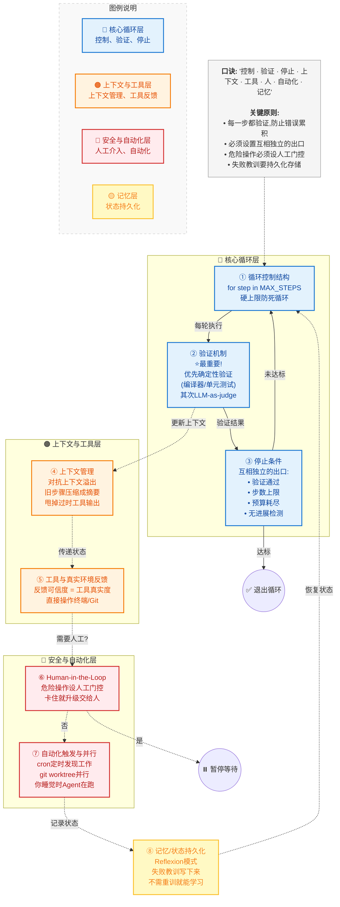
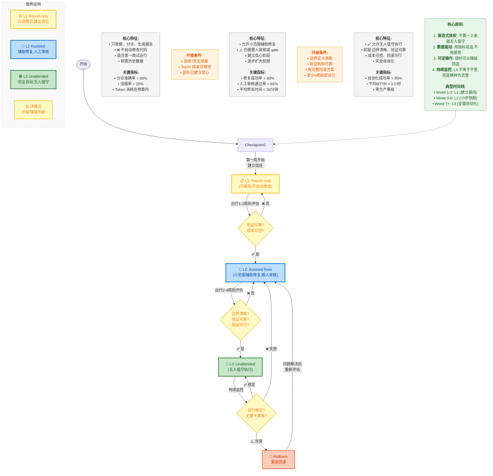

# Loop Engineering 深度理解

> **核心洞见**：Loop Engineering 不是让 AI 更像人,而是让 AI 工作流更像工程系统——有状态、有节奏、有边界、有验证、有交接。提示词是一次性的,loop 是可运营的。

---

## 目录

- [1. Loop Engineering 是什么](#1-loop-engineering-是什么)
- [2. 出现背景与发展历程](#2-出现背景与发展历程)
- [3. 为什么需要 Loop Engineering?](#3-为什么需要-loop-engineering)
- [4. 四代范式演进](#4-四代范式演进)
- [5. Agent Loop vs Loop Engineering](#5-agent-loop-vs-loop-engineering)
- [6. Loop Engineering 核心架构与原理](#6-loop-engineering-核心架构与原理)
- [7. Loop Engineering 在主流工具中的体现](#7-loop-engineering-在主流工具中的体现)
- [8. 实战应用指南](#8-实战应用指南)
- [9. 设计启发与最佳实践](#9-设计启发与最佳实践)
- [10. 总结](#10-总结)
- [参考文档](#参考文档)

---

## 1. Loop Engineering 是什么

### 1.1 定义

**Loop Engineering(循环工程)** 是 2026 年 6 月正式提出的 AI 工程新范式,其核心主张是:

> **"你不应该再给编程 Agent 写提示词了,你应该设计让 Agent 自己给自己写提示词的循环系统。"**
> 
> —— Peter Steinberger(OpenClaw 创始人)

更通俗地说:**你不再是那个守在聊天框前不断输入指令的人,你是那个设计自动化循环结构的人。**

### 1.2 一句话本质

Loop Engineering 就是用你设计的系统,去替代你本人提示 Agent。

| 维度 | 传统 Prompt Engineering | Loop Engineering |
|------|------------------------|------------------|
| **驱动者** | 人 | 系统 |
| **交互方式** | 单次、手动 | 循环、自动 |
| **人的角色** | 包工头、监工 | 架构师、规则制定者 |
| **扩展性** | 受限于人的精力 | 可无限并行扩展 |
| **时间尺度** | 秒级 | 小时到天级 |
| **自主性水平** | L0 - 完全被动 | L3 - 目标自主 |

### 1.3 核心理念转变

从 **"写好单次 Prompt"** → **"设计能持续运行的循环系统"**

人类的高杠杆工作点发生了根本性迁移:
- **过去**:优化一句话怎么写(Prompt Engineering)
- **现在**:设计控制系统怎么跑(Loop Engineering)

正如 Claude Code 负责人 Boris Cherny 所说:
> "我不再直接提示 Claude 了。我有一堆 loop 在跑,是它们在提示 Claude、决定下一步做什么。**我的工作是写这些 loop。**"

---

## 2. 出现背景与发展历程

### 2.1 关键时间节点

| 时间 | 里程碑事件 |
|------|-----------|
| **2022-2024** | Prompt Engineering 成为主流,ChatGPT 普及 |
| **2025** | Context Engineering 概念兴起,RAG 技术成熟 |
| **2026 年初** | Harness Engineering 被提出,Agent 环境约束系统化 |
| **2026 年 6 月 5 日** | Peter Steinberger 发表推文(800 万浏览),引爆讨论 |
| **2026 年 6 月 7 日** | Google Chrome 工程负责人 Addy Osmani 正式命名 "Loop Engineering" |
| **2026 年 6 月中** | Anthropic、OpenAI 相继推出官方 /goal 命令支持 |
| **2026 年 6 月底** | Cobus Greyling 开源 `loop-engineering` 参考库,提供完整方法论 |

### 2.2 为什么会在此时爆发?

Loop Engineering 在 2026 年 6 月突然火起来,核心原因有三:

1. **模型能力跃升**:Claude 3.5/4、GPT-4o/Codex 等模型已经具备足够的推理和工具调用能力,可以信任其执行多轮迭代任务
2. **瓶颈转移**:当 AI Agent 已经能独立完成单个编码任务后,**人本身成为了效率瓶颈**——不断复制粘贴、调整 Prompt、等待响应
3. **工程化需求**:企业需要从"个人小技巧"升级为"可审计、可交接、可规模化的工程系统"

### 2.3 先驱探索

虽然 Loop Engineering 概念在 2026 年才正式命名,但其思想早有雏形:

- **2023**:AutoGPT / BabyAGI 尝试自主任务分解,但缺乏有效终止条件
- **2024**:SWE-Agent 用 observe → think → act 循环修 bug,引入结构化操作界面
- **2025 年底**:Geoffrey Huntley 提出 **Ralph Wiggum Technique**(一行 shell 脚本 + PROMPT.md),用最简陋的方式解决上下文断裂问题
- **2026 初**:Claude Code 团队在 stop hook 上挂逻辑实现持续执行

---

## 3. 为什么需要 Loop Engineering?

### 3.1 解决的核心痛点

当你使用 AI 编程工具时,是否遇到过这些问题?

- ❌ 不断在聊天框复制粘贴、调整 Prompt
- ❌ 半夜还在等 AI 跑完,好输入下一条指令
- ❌ 同时开 5 个 Agent 窗口,手忙脚乱切换
- ❌ 重复的检查、验证、反馈工作占用大量时间
- ❌ Agent 每次 session 都是"冷启动",忘记之前的尝试

**Loop Engineering 就是为了解决这些问题而生。**

### 3.2 核心价值

#### (1)真正的无人值守
- 睡觉前启动循环,醒来代码已经写完、测试通过、PR 提交
- 7×24 小时持续工作,没有疲劳、不需要休息

#### (2)规模化生产力
- 一个人可以同时管理几十、上百个 Agent 实例
- Token 吞吐量最大化,人不再是瓶颈

#### (3)质量可控
- 标准化的检查流程,避免人为疏忽
- 多轮验证机制,大幅降低幻觉和错误

#### (4)知识沉淀
- 团队经验固化为 Skill,新人快速上手
- 最佳实践自动化执行,质量一致性保障

### 3.3 适用场景判断

**适合使用 Loop Engineering 的场景:**
- ✅ 重复性的、长时运行的任务
- ✅ 能定义清晰、可检查的成功条件
- ✅ 有自动化验证手段(测试、lint、CI)
- ✅ 低风险或可回滚的操作

**不适合的场景:**
- ❌ 一次性短任务(直接对话框更快)
- ❌ 目标非常模糊、无法量化验收
- ❌ 需要人类主观判断的设计决策
- ❌ 涉及不可逆副作用的生产环境操作

---

## 4. 四代范式演进

AI 工程经历了四次清晰的范式跃迁,每一代都不是替代前一代,而是在其基础上增加一个新的设计维度。

### 4.1 Prompt Engineering(2022-2024)

**核心关注**:优化单次交互的输入措辞

- **关键技术**:思维链(CoT)、少样本提示、角色扮演、格式规范
- **代表性工具**:OpenAI Playground、LangChain Prompt Templates、DSPy
- **局限性**:高度依赖人工经验,仅优化单次问答,无法处理长周期任务

### 4.2 Context Engineering(2025)

**核心关注**:系统性设计和管理提供给 LLM 的信息环境

Andrej Karpathy 定义为:"精妙的艺术与科学:精准地将大语言模型的上下文窗口填充上恰到好处的信息,让模型能准确地迈出下一步。"

- **关键技术**:RAG、向量数据库、记忆系统、上下文窗口管理
- **代表性工具**:LangChain、LlamaIndex、Pinecone、Chroma
- **局限性**:仍是人决定给什么信息,缺乏执行控制和反馈闭环

### 4.3 Harness Engineering(2026 初)

**核心关注**:围绕 AI 智能体设计和构建约束机制、反馈回路、工作流控制

"Harness"(马具)的隐喻:正如缰绳、马鞍用来驾驭强大但不可预测的马匹,驾驭工程为强大但概率性的大模型提供一套控制系统。

- **四大子系统**:
  1. **工具注入系统**:函数调用、权限控制、沙箱隔离
  2. **状态管理系统**:任务进度跟踪、中断恢复、并发隔离
  3. **验证循环系统**:输出质量检查、错误检测与修复
  4. **约束分层系统**:规则引擎、安全策略、合规审计

- **代表性工具**:Claude Code、AutoGPT、LangGraph
- **局限性**:人仍在循环中,需要人类启动和监控每个任务

### 4.4 Loop Engineering(2026 中)

**核心关注**:设计驱动自主 AI 智能体运行的迭代循环系统

- **五大模块**:目标驱动、自提示系统、状态持久化、并发隔离、执行审查分离
- **代表性工具**:Claude Code `/goal`、Codex `/goal`、OpenHands、SWE-Agent
- **突破性**:人类从"循环内的执行者"转变为"循环外的设计者"

### 4.5 演进规律总结

```
关注点外移:模型内部 → Prompt → Context → Harness → Loop → ?
            (向内)                              (向外)

人类角色升级:指令者 → 信息管家 → 系统设计师 → 循环设计者 → 元设计者

自主性提升:L0 完全被动 → L1 信息自主 → L2 执行自主 → L3 目标自主
```

**关键认知**:每一代都包含并超越前一阶段,是叠加式发展而非替代。

### 4.6 四代对比表

| 对比维度 | Prompt Engineering | Context Engineering | Harness Engineering | Loop Engineering |
|---------|-------------------|---------------------|---------------------|------------------|
| **核心问题** | 我该对模型说什么? | 我该给模型什么信息? | 我该给模型什么环境? | 我该设计什么循环? |
| **关注层级** | 单次交互质量 | 信息环境质量 | 系统运行可靠性 | 自主运行架构 |
| **人类角色** | 问话者/咒语师 | 信息管理员 | 系统架构师 | 循环设计者 |
| **人类参与度** | 极高(每轮) | 高(任务前) | 中(任务级) | 极低(设计时) |
| **自主性水平** | L0 - 完全被动 | L1 - 信息自主 | L2 - 执行自主 | L3 - 目标自主 |
| **时间尺度** | 毫秒-秒级 | 秒-分钟级 | 分钟-小时级 | 小时-天级 |
| **典型任务** | 问答、翻译、写作 | 知识库问答、文档总结 | 代码开发、数据分析 | 项目级开发、持续运维 |
| **核心技术** | CoT、Few-shot、角色 | RAG、向量库、记忆 | 工具调用、Guardrails、验证 | 自提示、状态机、并发 |
| **工程重点** | Prompt 措辞优化 | 检索质量+窗口管理 | 约束+反馈+可观测 | 循环结构+目标驱动 |
| **失败模式** | 理解偏差、幻觉 | 信息缺失、冗余 | 工具误用、越权 | 死循环、目标漂移 |
| **代表产品** | ChatGPT 对话 | RAG 聊天机器人 | Claude Code | Boris、OpenHands |
| **主流时间** | 2022-2024 | 2024-2025 | 2025-2026 | 2026 起 |
| **工程成熟度** | ★★★★★ 成熟 | ★★★★☆ 成型 | ★★★☆☆ 发展中 | ★★☆☆☆ 萌芽 |

---

## 5. Agent Loop vs Loop Engineering

这是最容易混淆的两个概念,必须厘清边界。

### 5.1 本质区别

| 维度 | Agent Loop | Loop Engineering |
|------|-----------|------------------|
| **本质** | 运行时机制(发动机) | 系统设计方法论(整车设计) |
| **回答的问题** | "Agent 每一轮做什么?" | "如何设计一个自主迭代直到目标达成的系统?" |
| **代码量** | ~30 行 Python | 架构设计文档 + 数百行实现 |
| **时间范围** | 单次会话内 | 跨会话、跨运行 |
| **终止策略** | max_steps 硬上限 + LLM 自行停止 | 可测试终止条件 + 确定性验证器 |
| **Token 策略** | Token-rich(全量历史,无限膨胀) | Token-smart(摘要压缩 + 记忆层) |
| **安全机制** | 无(或仅 max_steps) | Token/时间/成本预算 + 升级逻辑 |
| **记忆** | 无(仅 messages 列表) | 短期 + 长期 + 实体记忆,跨会话学习 |
| **人类角色** | 操作者(写 Prompt、看结果) | 系统架构师(设计循环、设定约束) |
| **典型产物** | `/loop 1d ...` 一条命令 | STATE.md + Skills + Worktree 策略 + Verifier |
| **风险** | 可能空转、重复犯错、烧 token | 若设计不当会放大错误;设计得当则放大产能 |

### 5.2 形象比喻

- **Agent Loop** = while 循环语句本身
- **Loop Engineering** = 整个 main() 函数:输入从哪来、状态存哪、谁写谁验、超时怎么办、日志打哪、什么时候 break 叫人

或者:

- **Agent Loop** = 发动机
- **Loop Engineering** = 整车设计(发动机 + 变速箱 + 刹车 + 仪表盘 + 导航系统)

### 5.3 最小 Agent Loop 示例

```python
# 最小化 Agent Loop:~30 行 Python 代码
def agent_loop(task: str, max_steps: int = 10):
    messages = [{"role": "system", "content": SYSTEM_PROMPT},
                {"role": "user", "content": task}]
    
    for step in range(max_steps):
        response = llm.chat(messages)          # ① 推理(Reason)
        
        if response.tool_calls:
            for call in response.tool_calls:
                result = tools.execute(call)   # ② 行动(Act)
                messages.append({"role": "tool", "content": result})  # ③ 观察(Observe)
        else:
            return response.content            # ④ 终止(Terminate)
    
    return "Max steps reached"
```

这个循环的核心特征:
- ✅ 有界:max_steps 硬上限防止无限循环
- ❌ 无记忆:messages 列表无限膨胀,没有摘要或压缩
- ❌ 无验证:依赖 LLM 自己判断是否完成
- ❌ 无状态持久化:进程崩溃 = 全部丢失

**仅有 Agent Loop ≠ Loop Engineering**。裸 loop 往往缺少:分诊规则、外部记忆、Maker/Checker 分离、人工闸门、成本上限与可观测性。

### 5.4 Loop Agent 是什么?

**Loop Agent** 是指在 Loop Engineering 体系中担任主驱动角色的 Agent。它负责:

1. 读取 STATE.md 等外部状态
2. 根据 pattern 做分诊,判断任务类型和风险等级
3. 调度子代理(sub-agents)执行具体任务
4. 收集验证结果,决定是否继续或交还给人
5. 更新状态文件,等待下一轮调度

你可以把 Loop Agent 理解为"循环的驾驶员",而 Loop Engineering 是"整条产线的设计与运营"。

### 5.5 Agentic Loop 与 Loop Engineering 的关系

**Agentic Loop** 是 Agent 工具中的一种递归执行原语(primitive),指 Agent 按固定节奏反复调用自身:读状态 → 行动 → 写回结果 → 下一轮。

- **Agent Loop 解决什么问题?**
  - 持续性:不用你每次打开终端重新 prompt
  - 递归性:同一目标可多轮迭代直到"够好"
  - 自动化:把"我每天早上该查 CI"变成系统行为

- **Agent Loop 的边界**
  
  仅有 /loop 不等于一套可上线的工程系统。一个裸 loop 往往缺:
  - 分诊规则(什么该做、什么该忽略)
  - 外部记忆(跨 session 的状态)
  - Maker/Checker 分离(写代码的自己验自己)
  - 人工闸门(高风险路径必须升级)
  - 成本上限与可观测性

所以:**Agent Loop 是零件;Loop Engineering 是用这些零件造一台能跑的生产机器。**

---

## 6. Loop Engineering 核心架构与原理

### 6.1 六大构件 + Memory

一个能"无人值守"地跑起来的 loop,通常不是一条长 prompt,而是六个部分:

#### (1)Automations / Scheduling(自动化触发)
- **职责**:按节奏发现与分诊任务
- **实现方式**:cron 定时、GitHub Actions webhook、事件驱动
- **典型场景**:每天早上 6 点检查 CI、每 15 分钟看护 PR

#### (2)Worktrees(工作树)
- **职责**:为并行执行提供隔离环境
- **价值**:避免多个 Agent 或循环互相踩工作区
- **实现**:Git worktree、Docker 容器、独立分支

#### (3)Skills(技能)
- **职责**:沉淀项目知识、流程规范和可复用操作经验
- **价值**:偿还"意图债"(Intent Debt),让 Agent 知道团队约定
- **形式**:`.claude/skills/` 下的 Markdown 文件、AGENTS.md

#### (4)Plugins & Connectors(连接器)
- **职责**:通过 MCP 等方式连接真实工具
- **对接系统**:GitHub、Linear、Slack、数据库、CI/CD
- **价值**:让 AI 能操作真实世界,读取问题、提交代码、发送通知

#### (5)Sub-agents(子代理)
- **职责**:拆分 maker/checker,避免同一个 Agent 自写自验
- **模式**:执行者与检查者分离、不同模型分工协作
- **价值**:避免"自己给自己打分"的盲区

#### (6)Memory / State(记忆与状态)
- **职责**:把循环的长期状态放在会话之外
- **形式**:STATE.md、run log、budget 文件
- **价值**:跨 session 的脊柱,让 Agent 知道"我是谁,我在干嘛"

### 6.2 八大 Primitives(原语)

搭建 Loop 系统需要的 8 个核心组件:



**口诀**:"控制 · 验证 · 停止 · 上下文 · 工具 · 人 · 自动化 · 记忆"

详细说明:

1. **循环控制结构**:即上面的 for 循环,必须配一个 MAX_STEPS 硬上限
2. **验证机制(最重要)**:本质是奖励信号。优先选确定性验证(编译器、单元测试等 Agent 骗不过去的东西);退而求其次才是 LLM-as-judge。原则是:每一步都验证,防止错误累积
3. **停止条件(终止逻辑)**:必须设置互相独立的出口,如验证通过、达到步数硬上限、预算耗尽、或触发"无进展检测"(连续几步都在犯同样的错)
4. **上下文管理**:对抗上下文溢出和腐烂。你需要不断将旧步骤压缩成摘要,甩掉过时的工具输出
5. **工具与真实环境反馈**:反馈的可信度 = 工具的真实度。让 Agent 直接操作终端和版本控制
6. **Human-in-the-Loop**:危险操作必须设人工门控;发现 Agent 卡住就直接升级交回给人
7. **自动化触发与并行**:用 cron 定时发现工作,用 git worktree 让多个 Agent 并行互不打架,实现"你睡觉时 Agent 在跑"
8. **记忆/状态持久化**:例如 Reflexion 模式,把失败教训写成文字存下来,不需要重训模型就能让 Agent"学到东西"

### 6.3 标准循环骨架

```python
state = init_state(goal)

for step in range(MAX_STEPS):
    thought = model.reason(state)           # 感知/推理
    action = model.choose_action(state)     # 决策
    result = tools.execute(action)          # 行动(真实工具)
    
    state = update(state, thought, action, result)  # 观察
    state = compact(state)                  # 上下文管理(压缩)
    
    if verifier.passes(state):              # 验证 → 达标退出
        return SUCCESS
    
    if no_progress(state):                  # 卡住 → 升级给人
        return ESCALATE
```

### 6.4 四种核心 Loop 模式

| 模式 | 流程 | 典型任务 | 验证器 | 风险 |
|------|------|---------|--------|------|
| **Retry Loop**<br>重试循环 | 执行 → 验证 → 失败 → 修改 → 再执行 | 写通过测试的函数、修复 linter 报错 | 确定性(测试通过/不通过) | 同一错误反复重试 |
| **Plan-Execute-Verify**<br>计划-执行-验证 | 先制定计划 → 逐步执行 → 每步验证 → 调整计划 | 重构模块、搭建新服务、迁移数据库 | 半确定性 | 计划可能不可行 |
| **Explore-Narrow**<br>探索-收敛 | 广泛收集信息 → 缩小假设 → 验证最可能假设 → 迭代 | 调试未知错误、探索不熟悉 API | 半确定性 | 无限探索不收敛 |
| **Human-in-the-Loop**<br>人机协作循环 | Agent 执行 → 遇歧义/破坏性操作/预算边界 → 暂停询问 → 获取答案后继续 | 需求不完整的产品开发、涉及用户数据的操作 | 人工判断 | 问太多=没自动化,问太少=冒险 |

### 6.5 分级上线策略

为了避免"一上来就无人值守自动改代码"的风险,推荐分阶段 rollout:



- **L1 Report-only**:只观察、分诊、生成报告,不自动修改。适合第一周。
- **L2 Assisted fixes**:允许小范围辅助修复,但仍需要人审核或 gate。
- **L3 Unattended**:允许无人值守执行,但前提是边界清晰、验证可靠、成本可控、回滚可行。

### 6.6 常见失败模式与避坑指南

| 错误类型 | 表现 | 修复方法 |
|---------|------|---------|
| **无进展死循环** | Agent 不停重复同一个错误动作 | 加入无进展检测机制 + 严格的硬步数上限 |
| **目标误设** | 为了让 CI 通过,Agent 直接把失败的测试用例删了 | 终止标准必须捕捉意图,危险操作必须设置人工门控 |
| **幻觉成功** | Agent 拍胸脯自称"已完成",但根本没真正验证 | 只相信确定性验证结果,永远不要相信 Agent 的自报 |
| **成本爆炸** | 长循环在后台默默烧掉了海量 token | 配备预算警卫和开启 prompt caching |
| **上下文溢出** | 10 轮之后 messages 列表超出上下文窗口 | 每轮摘要压缩,保留最近 3 轮完整 + 早期摘要 |
| **意图债** | 每个 session Agent 都是"冷启动",不知道团队约定 | 把约定写进 Skills / AGENTS.md |
| **理解债** | Loop 越快,仓库里"你写过但没读过"的代码越多 | 定期 review loop 产出的变更 |
| **认知投降** | 把 loop 当成逃避思考的按钮 | 保持对系统的理解和监督,别变成"糊涂掌柜" |

**三笔"债"需要正视:**

1. **Intent Debt(意图债)**:每个 session Agent 都是"冷启动"。团队约定、构建命令、"我们从不那样做"——若不写进 Skills / AGENTS.md,每轮 loop 都在重新猜。

2. **Comprehension Debt(理解债)**:Loop 越快,仓库里"你写过但没读过"的代码越多。Loop 交付了,不代表你理解了。

3. **Cognitive Surrender(认知投降)**:最危险的用法:把 loop 当成逃避思考的按钮。Addy Osmani 提醒:"Build the loop. But build it like someone who intends to stay the engineer, not just the person who presses go."

---

## 7. Loop Engineering 在主流工具中的体现

### 7.1 Claude Code

#### /goal 命令

Anthropic 在 Claude Code v2.1.139(2026.5.12)中推出 `/goal` 命令,本质上是 Ralph Loop 的官方封装。

**使用方式:**
```bash
/goal "实现 JWT 登录功能,满足:\
1. 支持邮箱/密码登录 \
2. 密码 bcrypt 加密存储 \
3. Token 过期时间 7 天 \
4. 单元测试覆盖率 ≥ 80% \
5. ESLint 无错误" \
--skill coding-standards \
--max-tokens 500000
```

**核心特点:**
- 不强制 full-auto 模式,渐进式授权
- 设置"完成条件"(completion condition),最长支持 4000 字符
- 本质是 session 级别的 prompt-based Stop Hook 快捷封装
- 每当 Claude 完成一轮工作后,系统会将完成条件和当前对话发送给小型快速模型(默认 Haiku)做 yes/no 判断
- 支持 pause/resume/clear 生命周期管理
- 运行过程中可以用 `/goal` 查看当前状态(overlay 面板显示时间/turns/tokens)

**有效的完成条件应包含:**
- 一个可测量的终态:测试结果、构建退出码、文件数量、空队列
- 一个明确的验证方式:如"npm test exits 0"或"git status is clean"
- 不可打破的约束:如"不修改其他测试文件"
- 可选的时间限制:如"or stop after 20 turns"

#### Stop Hook 机制

Claude Code 的 hooks 系统允许在 Agent 准备停下时触发自定义逻辑:

```json
// .claude/settings.json
{
  "hooks": {
    "stop": {
      "type": "prompt-based",
      "prompt": "基于以下标准判断任务是否完成:\n{{completion_criteria}}",
      "model": "haiku"
    }
  }
}
```

当 Claude 准备停下时,Haiku 会被调用来评估"PROMPT.md 里的任务做完了没"。如果返回 `"ok": false`,Claude 会收到 reason 作为反馈,继续工作;如果 `"ok": true`,则正常结束。

### 7.2 OpenAI Codex

#### /goal 命令

OpenAI 在 Codex CLI v0.128.0(2026.4.30)中也推出了 `/goal` 命令。

**使用方式:**
```bash
codex --full-auto
> /goal "修复所有 CI 失败的测试"
```

**核心特点:**
- 必须开启 Full Auto 模式(`--full-auto`),因为需要自动批准所有文件编辑和命令执行
- 运行在 OS 级沙盒中,只能编辑沙盒内文件、执行预定义允许列表中的命令
- 支持长时间运行——社区报告有 14 小时、18 小时的持续执行案例
- 支持 pause/resume——可以随时暂停和恢复目标,不丢失进度
- 推荐在新 Git 分支上运行,作为安全护栏

**两种 /goal 的设计哲学对比:**

| 维度 | Codex /goal | Claude Code /goal |
|------|------------|-------------------|
| **权限** | 必须 full-auto,all-in | 不强制,渐进式 |
| **隔离** | OS 沙盒,物理隔离 | Hook 系统,逻辑隔离 |
| **评估机制** | 内置自评循环 | 独立小模型(Haiku)判断 |
| **生命周期** | pause / resume / clear | clear(stop/off/reset/none/cancel) |
| **反馈** | 终端日志 + /goal 状态查看 | overlay 面板(时间/turns/tokens) |
| **非交互** | codex --full-auto + /goal | claude -p "/goal ..." |
| **定位** | "放出去跑的 worker" | "有交付标准的 agent" |

### 7.3 Ralph Loop(社区方案)

在官方 `/goal` 命令出现之前,Geoffrey Huntley 提出的 **Ralph Wiggum Technique** 是最流行的社区方案。

**核心原理:**
```bash
while true; do
  claude -p "$(cat PROMPT.md)"
done
```

就这么简单。`claude -p` 是 Claude Code 的非交互(headless)模式,从 stdin 读入 prompt 后自主执行,完成后退出。外层的 `while true` 则确保一旦 Claude 退出,立刻带着同一份 PROMPT.md 重新启动一轮新的会话。

**优势:**
- 上下文不会膨胀——每轮都是全新会话,上下文窗口从零开始
- 目标永不丢失——PROMPT.md 是持久化在磁盘上的
- 进度可以累积——agent 每轮的工作成果留在文件系统上

**Stop Hook 升级:**
原始的 `while true` 方案有一个明显缺陷:agent 每次 session 结束后都会重启,哪怕任务已经完成了。解决方案是使用 Stop Hook 做判断。

**PROMPT.md 设计原则:**
- 里程碑必须有 checkbox——让 agent 可以自主跟踪进度
- 包含"进度记录"区域——让 agent 每轮都在 PROMPT.md 里追加一行自己这轮做了什么
- 约束要具体——不要写"代码质量要好",要写"测试覆盖率 > 80%"

### 7.4 其他框架对比

| 框架 | 层级定位 | 回路触发与控制 | 记忆与状态沉淀 | 子智能体协作 |
|------|---------|--------------|--------------|------------|
| **Claude Code** | 商业级协同终端 (Loop 层) | 通过 /loop (定时/钩子) 或 /goal (验证条件) 终止 | CLAUDE.md 固化项目规范与架构决策 | 支持 Agent 团队在多阶段之间流转与验证 |
| **OpenAI Codex** | 云原生工坊 (Loop 层) | 通过 Automations 定时触发 Triage,/goal 检查退出 | 原生内置背景工作树(Worktree)多线程并进 | 支持基于 TOML 配置的 Maker/Checker 动态协作 |
| **OpenClaw** | 智能体操作系统 (Harness 层) | 偏向单次任务的自动化拆解、执行与环境门控 | SQLite/Redis 存储事务型和情景记忆 | 较弱,主要依赖单个智能体串行拆解任务 |
| **Hermes Agent** | 开源自提升智能体 (Loop 层) | 内置 Cron 调度与事件驱动,支持无人值守后台流转 | SOUL.md 结合跨 Session 学习回路 | 强,支持通过 RPC 产生隔离的并行子智能体管道 |

---

## 8. 实战应用指南

### 8.1 五步搭建第一个 Loop

#### 步骤 1:定义清晰的目标规范(Specification)

❌ **坏的目标**:
```
"做一个登录功能"
```

✅ **好的目标**:
```
实现 JWT 登录功能,满足:
1. 支持邮箱/密码登录
2. 密码 bcrypt 加密存储
3. Token 过期时间 7 天
4. 单元测试覆盖率 ≥ 80%
5. ESLint 无错误

停止条件:所有测试通过,PR 已创建
```

#### 步骤 2:创建状态文件(State Management)

Loop 需要记忆,创建 `STATE.md`:

```markdown
# Loop State

## 配置
- 最大迭代次数:10
- 单次超时:30分钟
- 检查间隔:5分钟

## 待处理任务
- [ ] 修复 CI #1234 中的类型错误
- [ ] 更新依赖 lodash 到 4.17.21

## 已完成
- [x] 修复安全漏洞 CVE-2026-1234

## 进度记录
- 2026-07-03 10:00 - 开始分析 CI 失败日志
- 2026-07-03 10:15 - 定位到 auth.ts 第 42 行类型错误
```

#### 步骤 3:编写项目技能(Skills)

在 `.claude/skills/` 下创建技能文件:

```markdown
# 代码审查 Skill

## 本项目编码规范
- 使用 TypeScript,严格模式
- 函数必须有 JSDoc 注释
- 错误必须被显式处理
- 禁止使用 any 类型

## 审查清单
1. 是否有未处理的 Promise?
2. 是否有魔法数字?
3. 是否有重复代码?
4. 边界条件是否覆盖?
```

#### 步骤 4:启动循环

以 Claude Code 为例:

```bash
# 基础循环:每10分钟检查并修复问题
/loop "读取 STATE.md → 执行待办任务 → 更新状态" --interval 10m

# 定时循环:每天早上6点自动修复CI失败
/loop "使用 ci-triage skill 分析昨日所有CI失败,自动修复可解决问题" \
  --schedule "0 6 * * *" \
  --max-iterations 8

# 带目标的循环:直到完成才停止
/goal "完成用户登录功能的全部验收标准" \
  --skill coding-standards \
  --max-tokens 500000
```

#### 步骤 5:设置停止条件(至关重要!)

这是防止"无限烧 Token"的关键,必须明确:

✅ **好的停止条件**:
- 所有单元测试通过
- ESLint 无错误
- 验收标准全部满足
- 达到最大迭代次数
- Token 消耗达到预算

❌ **坏的停止条件**:
- "做得足够好"(主观、模糊)
- 没有任何限制

### 8.2 经典实战场景

#### 场景 1:CI 自动修复循环

```yaml
# GitHub Actions 配置
name: CI Fix Loop
on:
  schedule:
    - cron: '0 6 * * *'  # 每天早上6点

jobs:
  ci-fix-loop:
    runs-on: ubuntu-latest
    steps:
      - name: Run Claude Code Loop
        run: |
          claude-code --worktree ci-fix-$(date +%Y%m%d) "
            1. 分析昨日所有失败的 CI
            2. 对每个可自动修复的问题创建分支
            3. 派生子代理修复代码
            4. 派生子代理做 Code Review
            5. 测试通过后创建 PR
            6. 更新 STATE.md 记录
          "
```

#### 场景 2:代码质量巡检循环

- 每周扫描一次代码库
- 自动发现技术债务
- 生成修复建议
- 分配到对应负责人

#### 场景 3:文档自动更新循环

- 检测代码变更
- 自动更新对应文档
- 检查文档与代码一致性

#### 场景 4:PR 看护循环(Babysitter)

- 每 5-15 分钟运行一次
- 监控 PR 状态变化
- 自动响应 reviewer 评论
- 处理 merge conflicts
- 等待 CI 通过后自动 merge

### 8.3 七个生产模式(Cobus Greyling 参考库)

| 模式 | 调度节奏 | 风险等级 | 适用场景 |
|------|---------|---------|---------|
| **Daily Triage** | 每天或每2小时 | 低 | 日常分诊,第一周建议 L1 report-only |
| **PR Babysitter** | 每5-15分钟 | 中 | 持续看护 PR 状态,成本高 |
| **CI Sweeper** | 每5-15分钟 | 高 | 处理 CI 失败,token 成本非常高 |
| **Dependency Sweeper** | 每6小时到每天 | 中 | 依赖升级或修补 |
| **Changelog Drafter** | 每天或 tag 触发 | 低 | 自动生成 changelog 草稿 |
| **Post-Merge Cleanup** | 每天或每6小时 | 低 | 合并后清理,适合非高峰时段 |
| **Issue Triage** | 每2小时到每天 | 低 | 对 issue 做分诊、标注、建议处理路径 |

---

## 9. 设计启发与最佳实践

### 9.1 Harness > Loop:控制流不是世界观

最近有一种观点认为"Loop 只是闭环的影子,Harness 才是闭环的骨架"。这个观点强调:

- **Loop 负责继续跑,Harness 负责判断能不能跑、跑到哪里算数、失败后怎么收场**
- 没有 harness,agent loop 最常见的结果不是智能,而是更快地产生未经约束的动作、消耗更多 token、扩大副作用
- 有了 harness,loop 才变成工程策略:意图被收束,动作经过检查,工具运行在隔离边界内,结果落账成可审计事实,失败有恢复路径

**所以更稳的层级是:**

```
Intent → Harness → Goal/Boundary → Context/State → Rules/Limits 
→ Tools/Sandbox → Evidence/Review → Failure Handling/Stop → Loop: execute → observe → adjust → Goal
```

Loop 可以在里面跑,而且应该跑。但它必须被 harness 包住。因为最外层代表的是系统边界、责任归属和不变量。

### 9.2 Claude while 循环和 loop 有什么区别?

这是一个常见的疑问。简单来说:

- **while 循环**:是编程语言中的基本控制结构,用于重复执行代码块直到条件不满足
- **Claude /loop 命令**:是基于 while 循环理念封装的高级功能,包含了状态管理、验证机制、停止条件等 Loop Engineering 要素

**本质区别:**

| 维度 | while 循环 | Claude /loop |
|------|-----------|-------------|
| **抽象层级** | 底层语言特性 | 高级工程范式 |
| **状态管理** | 需手动实现 | 内置 STATE.md 等外部状态 |
| **验证机制** | 需自行编写 | 支持 completion-promise / Stop Hook |
| **上下文管理** | 无 | 自动压缩、摘要 |
| **安全机制** | 无 | Token 预算、人工闸门、升级逻辑 |
| **可观测性** | 需自行添加日志 | 内置 run log、budget 跟踪 |

**结论**:while 循环是实现 loop 的技术手段之一,但 Loop Engineering 远不止是一个 while 循环。它是一个完整的系统设计方法论。

### 9.3 关键设计原则

#### (1)KISS 原则(Keep It Simple, Stupid)
- 用 STATE.md、run-log、budget 等普通文件承载状态,简单透明,容易审计
- 不要一开始就追求全自动无人值守

#### (2)YAGNI 原则(You Ain't Gonna Need It)
- 建议从 L1 report-only 开始,不提前追求全自动
- 先跑通最小闭环,再逐步复杂化

#### (3)SOLID 原则
- pattern、starter、skill、tool、docs 分层明确,职责边界清晰

#### (4)DRY 原则(Don't Repeat Yourself)
- 把重复 loop 设计抽象成模板,避免每个项目从零写

#### (5)防御性设计
- 假设 Agent 会犯错,设计容错机制
- 设置多重安全边界:denylist、人工 gate、MCP scope、report-only 阶段、分级上线策略

### 9.4 什么时候该上 Loop?

**适合的场景:**
- ✅ 重复性的、长时运行的任务
- ✅ 能定义清晰、可检查的成功条件
- ✅ 有自动化验证手段(测试、lint、CI)
- ✅ 低风险或可回滚的操作

**不适合的场景:**
- ❌ 一次性短任务(直接对话框更快)
- ❌ 目标非常模糊、无法量化验收
- ❌ 需要人类主观判断的设计决策
- ❌ 涉及不可逆副作用的生产环境操作

### 9.5 人才需求变迁

随着 Loop Engineering 的普及,工程师的技能需求也在发生变化:

| 衰减技能 | 新兴技能 |
|---------|---------|
| 手工编写 Prompt | 循环架构设计 |
| 逐行代码编写 | 目标函数定义 |
| 单模块调试 | 系统级可观测性 |
| 手动测试 | 自动验证系统设计 |
| 临时救火式开发 | 预防性系统设计 |

**核心趋势**:人类从"循环内的执行者"转变为"循环外的设计者",抽象层级持续提升。

---

## 10. 总结

### 10.1 核心发现

1. **清晰的演进路径**:四年四次跃迁,形成完整的工程范式演进链(Prompt → Context → Harness → Loop)

2. **一致的演进方向**:人类抽象层级持续提升,AI 自主性持续增强

3. **叠加式发展**:新阶段包含并超越旧阶段,而非简单替代

4. **需求-技术双轮驱动**:应用需求牵引,模型能力支撑,共同推动演进

5. **工程化规律**:从"艺术/玄学"到"科学/工程",每个阶段都经历了系统化过程

### 10.2 对从业者的建议

- **不要停留在舒适区**:Prompt Engineering 技能正在快速贬值
- **建立分层知识体系**:掌握全部四层能力,而非只关注最新概念
- **关注抽象层级提升**:学习系统思维、控制论、运筹学等元技能
- **拥抱变化**:AI 工程领域每 6-12 个月就会出现重大范式转移
- **重视基础**:无论哪个阶段,对 LLM 本质的理解始终是根基

### 10.3 最终展望

从 Prompt Engineering 到 Loop Engineering,我们见证的不仅是工程方法论的演进,更是人机协作关系的根本性重构。这条道路的终点,是人类从"亲自做"到"告诉做什么"再到"定义想要什么"的持续跃迁。

工程的终极目标,始终是让人类从繁琐的执行中解放出来,专注于真正重要的决策与创造。在这个意义上,AI 工程范式的每一次跃迁,都是人类自由的一次扩展。

> "最深刻的技术是那些消失的技术。它们将自己编织进日常生活的织物中,直到与之无法区分。"
> 
> —— Mark Weiser(普适计算之父)

**最后一句忠告**:警惕"认知投降"。Loop 提速确实很猛,但人类必须保持对系统的理解和监督。千万别变成"虽然系统在跑,但我完全不知道 loop 在干嘛"的糊涂掌柜。

Build the loop. But build it like someone who intends to stay the engineer, not just the person who presses go.

---

## 参考文档

### 技术博客与社区文章

1. [(99+ 封私信) Loop Engineering 具体做些什么:真正拉开差距的,从来不是那个 while 循环 - 知乎](https://zhuanlan.zhihu.com/p/2055075118775268231)

2. [(99+ 封私信) Loop Engineering 循环工程又是什么鬼? - 知乎](https://zhuanlan.zhihu.com/p/2047996686807589866)

3. [第3章:Agent Loop — 从用户输入到模型响应的完整生命周期 - 驾驭工程](https://zhanghandong.github.io/harness-engineering-from-cc-to-ai-coding/part1/ch03.html)

4. [Claude Code 是怎么跑起来的:从 Agent Loop 理解代理循环实现 - 腾讯云](https://cloud.tencent.com/developer/article/2654909)

5. [大人,AI编程又变天了,Claude Code之父、龙虾创始人同时力捧新范式,杀死提示词工程?-36氪](https://36kr.com/p/3844224911346184)

6. [Claude Code 持续迭代秘器:Ralph Loop 让 AI 坚持到任务真正完成 - Jeecg低代码平台](https://www.cnblogs.com/jeecg158/p/20915740)

7. [AI Agent Loop Engineering 深度解析,能干啥,怎么用,看这篇就够了 - 今日头条](https://www.toutiao.com/article/7651809798945653258/)

8. [Loop Engineering 是什么?2026 年最热 AI 工程方法论完全解析 - 51CTO](https://www.51cto.com/aigc/11862.html)

9. [Loop Engineering:Agent 时代,别再手动写 Prompt - 腾讯云开发者社区](https://cloud.tencent.com/developer/article/2699012)

10. [Loop Engineering,下一代 Agent 工程理念 - 腾讯云开发者社区](https://cloud.tencent.com/developer/article/2696935)

11. [Agent Loop 与 Loop Engineering 区别 - CSDN](https://devpress.csdn.net/xclaw/6a37e11010ee7a33f2807253.html)

12. [为什么大厂都在偷偷搞Loop Engineering? - 腾讯云](https://cloud.tencent.com/developer/article/2697479)

13. [Ralph Loop:让 AI 编程 Agent 通宵干活的自主循环范式](https://dicer-zz.github.io/posts/ralph-loop-autonomous-coding-agents/)

14. [Claude Code 永动机:ralph-loop 无限循环迭代插件详解 - 51CTO博客](https://blog.51cto.com/u_15746412/14568635)

15. [Loop 不是 Agent 架构,Harness 才是 - 腾讯新闻](https://news.qq.com/rain/a/20260626A0AGIL00)

