## 一、MCP 是什么

**MCP（Model Context Protocol，模型上下文协议）** 是由 Anthropic 于 2024 年 11 月推出并开源的一种开放通信协议。它为大语言模型（LLM）与外部数据源、工具及系统之间搭建了一座标准化、安全的双向连接桥梁。

官方对 MCP 的比喻最为形象：**"MCP 就像 AI 应用的 USB-C 接口"** —— 在 USB-C 出现以前，不同设备需要各自的接口和线材；USB-C 把这种"M 种设备 × N 种线材"的混乱收敛成一个标准。MCP 之于 AI 同理：它把"M 个 LLM × N 个工具/数据源"的笛卡尔积集成问题，收敛为"M + N"的标准对接。

更工程化的定义可以是：

> MCP 是一个基于 **JSON-RPC 2.0** 的客户端-服务器协议，规定了 AI 应用如何**发现、调用**外部能力（工具/资源/提示模板），以及双方在生命周期中如何**协商能力、传输消息、处理错误**。

它不是一个 LLM、不是一个 Agent 框架，也不是一个具体的 SDK；它只是一份**协议约定** —— 任何 LLM 应用（Claude、Cursor、QoderWork、ChatGPT、Cline 等）只要遵循它，就能即插即用社区生态里的任意 MCP Server。

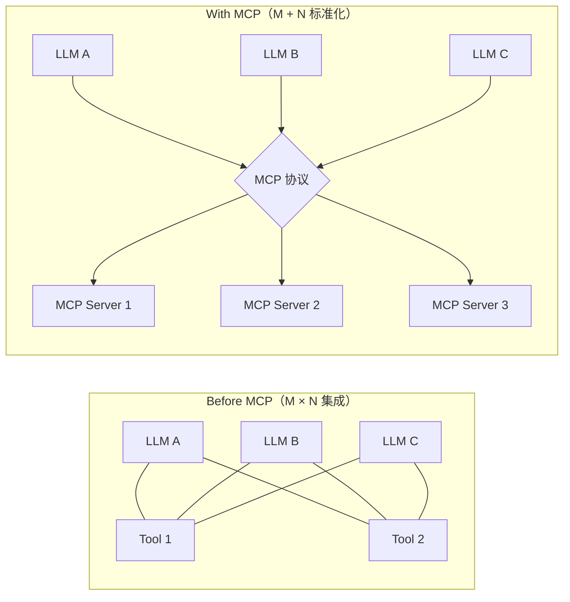

---

## 二、MCP 出现的背景和发展历程

### 2.1 LLM 的先天缺陷

大语言模型本身是一个"封闭的概率预测引擎"：

- **时效性差**：训练数据有截止时间，不知道最新事件；
- **无私有知识**：访问不到企业内部的代码、文档、数据库；
- **不能"动手"**：不能发邮件、改文件、调 API、订机票；
- **算术与确定性短板**：连两个浮点数大小比较都可能出错；
- **集成成本高**：每接一个外部能力，都要写一遍胶水。

### 2.2 集成方案的演进

行业先后尝试过几代方案，每一代都比上一代更"AI-Native"：

| 阶段 | 方案 | 问题 |
|---|---|---|
| ① | RAG（检索增强） | 只解决"读"，不解决"写"和动作 |
| ② | LangChain Tool / Plugin | 框架强耦合，跨平台不可移植 |
| ③ | OpenAI Function Calling | 由模型厂商定义，各家私有，"协议"=供应商规范 |
| ④ | **MCP** | 厂商中立、开源、可发现、可治理 |

### 2.3 发展时间线

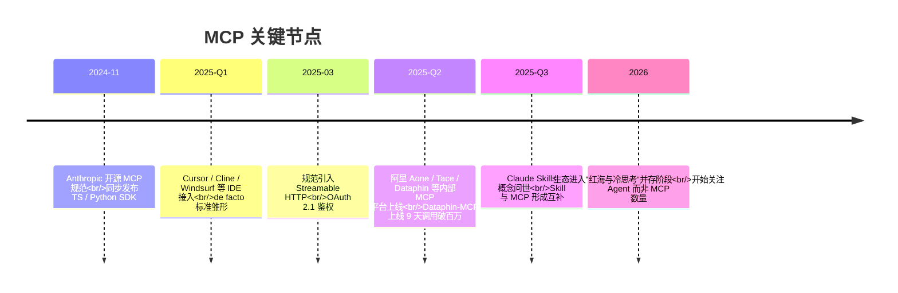

---

## 三、MCP 的优势和特性

总结起来是六个关键词：**开放、标准化、双向、可发现、可治理、可组合**。

- **开放标准**：协议规范公开，无厂商绑定；
- **标准化接入**：一份 SDK 适配多个 Host（Claude / Cursor / QoderWork 等）；
- **双向通信**：除了 Client → Server 的工具调用，Server 也可以反向请求 Client（Sampling、Elicitation），实现 Human-in-the-Loop；
- **动态发现**：客户端运行时可以 `tools/list` 查询当前可用能力，无需重新部署；
- **三原语统一**：Tools（动作）、Resources（数据）、Prompts（模板）— 一套协议同时承载"读/写/示范"；
- **传输无关**：同一份 Server 既能 stdio 跑本地，也能 HTTP 跑远程；
- **企业可治理**：经过 Gateway 可以做鉴权、限流、审计、版本管理。

---

## 四、MCP 内部结构和实现原理

### 4.1 三个核心角色

MCP 把生态切成 **Host / Client / Server** 三层（注意：Client 是 Host 内嵌的子模块，不是"用户")：

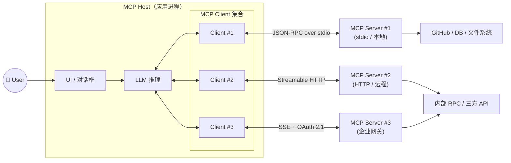

- **Host**：用户直接使用的 AI 应用（Claude Desktop、Cursor、QoderWork、Cherry Studio 等）。负责 UI、模型调用、上下文聚合、用户授权。
- **Client**：Host 内部为每一个 Server 维护一条 **1:1 连接** 的"瘦适配层"，负责协议握手、消息路由、能力订阅。
- **Server**：实际能力的提供者。可以是一段本地 Python 脚本，也可以是一台远程服务。

### 4.2 三种原语（Primitives）

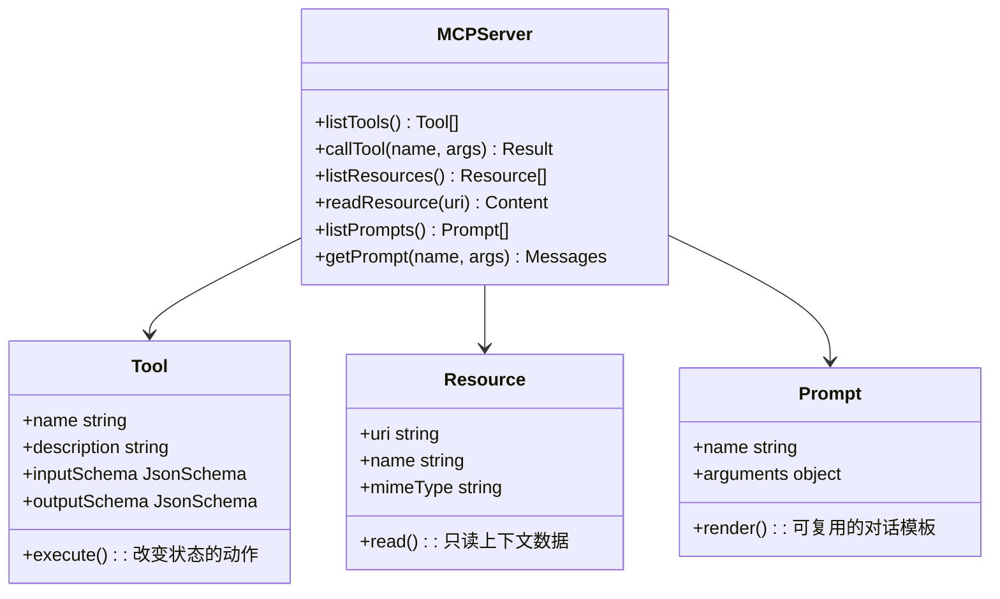

简单记忆：

| 原语 | 类比 | 控制权 |
|---|---|---|
| **Tools** | 函数 / 动作 | 由 LLM 自动决策调用 |
| **Resources** | 文档 / 数据 | 由 Host 或用户挑选注入上下文 |
| **Prompts** | 工作流模板 | 由用户显式触发（斜杠命令） |

### 4.3 通信协议：JSON-RPC 2.0

所有 MCP 消息都遵循 JSON-RPC 2.0：

```json
// Request
{ "jsonrpc": "2.0", "id": 1, "method": "tools/call",
  "params": { "name": "web_search", "arguments": { "q": "MCP" } } }

// Response（成功）
{ "jsonrpc": "2.0", "id": 1,
  "result": { "content": [{ "type": "text", "text": "..." }] } }

// Response（失败）
{ "jsonrpc": "2.0", "id": 1,
  "error": { "code": -32602, "message": "Invalid params" } }

// Notification（无 id，无响应）
{ "jsonrpc": "2.0", "method": "notifications/tools/list_changed" }
```

常用方法名：

- `initialize` — 握手、交换协议版本与能力
- `tools/list` `tools/call`
- `resources/list` `resources/read` `resources/subscribe`
- `prompts/list` `prompts/get`
- `sampling/createMessage` — Server 反向请求 LLM 生成
- `notifications/*` — 单向事件推送

### 4.4 生命周期

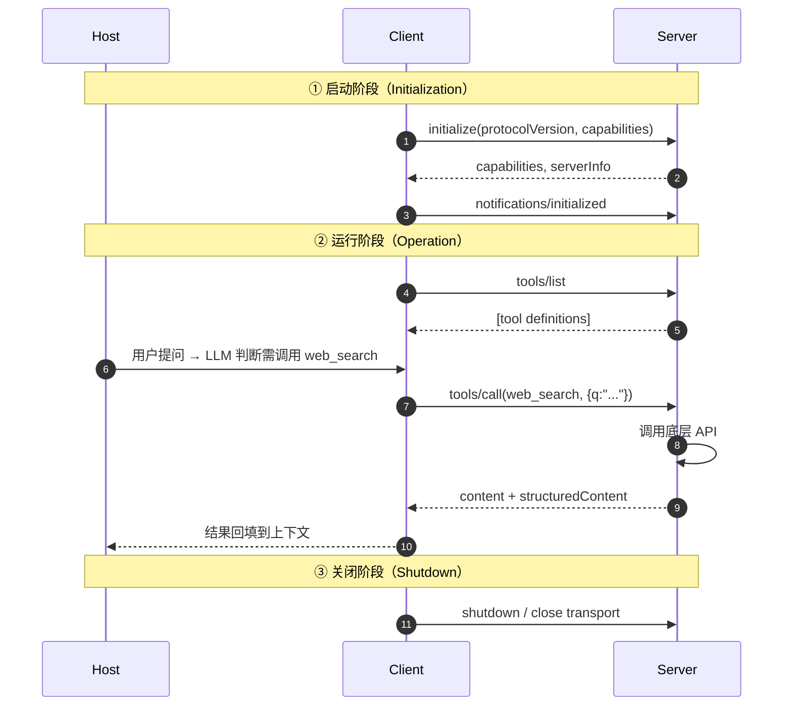

---

## 五、为什么需要 MCP？它解决了什么问题？

可以从五个维度回答：

1. **集成爆炸 → 标准化**：把 M×N 集成压缩为 M+N。
2. **碎片化 → 一次编写、多处复用**：同一份 Server 能被 Claude / Cursor / QoderWork 同时使用。
3. **能力孤岛 → 动态发现**：Agent 上线后还能"长出新能力"，无需重新发布。
4. **不可治理 → 中心化网关**：通过 Server 这层抽象，企业能集中做认证、审计、限流。
5. **黑盒调用 → 可控可解释**：每一次工具调用都是显式 JSON-RPC，可日志、可重放、可拦截。

---

## 六、为什么要分成 MCP Server 和 MCP Client？

很多人第一次看到 MCP 都会问：为啥不直接让 LLM 调 HTTP？分层的原因是**关注点分离**：

- **Host / LLM 关心"做什么"**：决策、规划、生成自然语言；
- **Client 关心"怎么对接"**：协议握手、消息编解码、生命周期；
- **Server 关心"能做什么"**：业务实现、数据源、权限校验。

这样 LLM 厂商只需要实现 Client（一次性工作），业务方只需要实现 Server（专注业务），生态就能自由组合。Server 还可以承担：

- 鉴权、加密、审计；
- 把异构后端（HSF、gRPC、DB、文件系统）统一成"AI 友好"的语义接口；
- 把内网能力安全地暴露给办公网的 AI 应用。

---

## 七、MCP 是怎么执行的？端到端调用链路

以"用户问'帮我搜一下杭州天气'"为例：

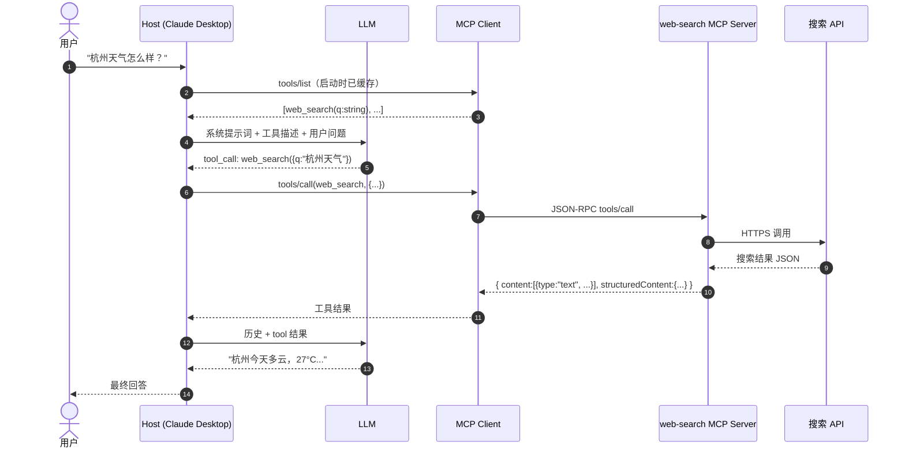

关键点：**LLM 自己不直接连任何 Server**，它只看到"有哪些工具可用"和"该调哪个工具"；真正的网络调用由 Host/Client 代劳。

---

## 八、MCP 与 HTTP、API、Function Call 的区别

### 8.1 MCP vs HTTP

HTTP 是底层传输协议，MCP 是应用层语义协议。MCP **可以跑在 HTTP 之上**（Streamable HTTP 传输），但 MCP 远不止 HTTP：

| 维度 | HTTP / REST | MCP |
|---|---|---|
| 抽象层级 | 通用 RPC / 资源访问 | 面向 LLM 的能力描述 |
| 接口契约 | OpenAPI / 自定义 | JSON-RPC + 自描述 schema |
| 发现能力 | 不内置 | 内置 `tools/list` |
| 双向通信 | 一般需 WebSocket | 内置 Notification / Sampling |
| 上下文模型 | 无 | Tools / Resources / Prompts 三原语 |
| 错误语义 | HTTP 状态码 | JSON-RPC 错误码 + 业务错误 |

### 8.2 MCP 的安全性

MCP 协议本身不是天生安全的 —— 它继承了所在传输层的安全性，再加上一系列**应用层最佳实践**：

- **stdio 模式**：本地进程通信，没有网络面，但风险在于"用户下载并运行了第三方代码"，相当于装了一个本地小程序，**应只安装可信源**；
- **HTTP 模式**：必须 HTTPS；推荐 **OAuth 2.1 + PKCE**（强制 S256）+ 动态客户端注册（DCR）；
- **Token 管理**：建议加前缀（如 `mcpa_` / `mcpr_` / `mcpc_`，类似 GitHub），并用系统 Keychain 加密；
- **输入校验**：Server 端不能信任 LLM 给的参数，必须 schema 校验（推荐 Zod / Pydantic）；
- **风险分级**：destructive 类操作（删文件、付钱）应单独标记，UI 强制确认，避免"YOLO mode"；
- **审计**：每一次 `tools/call` 都应该有日志；
- **Prompt Injection 防御**：Server 不应把外部输入（如数据库里的字段）直接拼进工具描述，否则可能被"工具描述注入"或"四方注入"攻击。

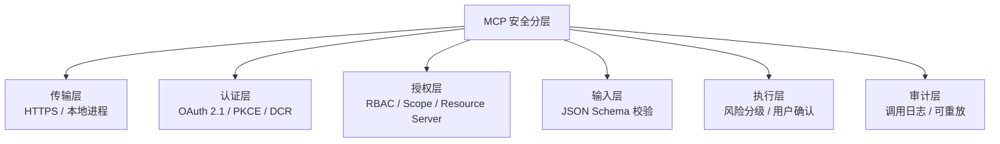

### 8.3 MCP vs API

| 维度 | 传统 API | MCP |
|---|---|---|
| 主要消费者 | 程序员 | LLM / Agent |
| 描述方式 | OpenAPI / Swagger | 自然语言 description + JSON Schema |
| 调用方式 | 显式编码 | LLM 推理决策 |
| 错误处理 | HTTP 状态码 | JSON-RPC error + 自然语言提示 |
| 发现机制 | 需要文档 | `tools/list` 即文档 |
| 输出格式 | 任意（JSON/XML/二进制） | 推荐 Markdown / 结构化文本 |

**关键关系**：MCP 不是 API 的替代品，而是 API 的"AI 友好包装层"。任何已有的 HTTP / HSF / gRPC 服务都可以**0 改动**地包成 MCP（见第十四节）。

### 8.4 MCP vs Function Calling

这是最容易混淆的一对：

| 维度 | Function Calling | MCP |
|---|---|---|
| 性质 | 模型厂商私有规范 | 厂商中立的开放协议 |
| 作用域 | 单次对话内的工具调用 | 跨进程 / 跨网络的能力交付 |
| 工具定义位置 | 写在 prompt / tools 字段里 | 由 Server 远程提供 |
| 发现能力 | 静态、由 Host 提前声明 | 动态、运行时 list |
| 可复用性 | 与具体应用强耦合 | 一份 Server 跨多个 Host 复用 |
| 网络层 | 无（同进程） | stdio / HTTP / SSE |

**实战策略**：两者**协同**而非替代。一份 MCP Server 提供能力 → Host 把这些能力转成 Function Calling 描述给 LLM → LLM 决定调用哪个 → Host 再通过 MCP Client 转发到 Server 执行。

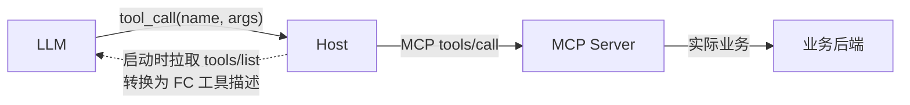

### 8.5 MCP vs Skill

这是 2025 年下半年的热门讨论。简单结论：**MCP 是"手"，Skill 是"操作手册"**。

| 维度 | MCP | Skill |
|---|---|---|
| 解决问题 | 怎么连外部世界、调用什么 | 怎么把任务做好、按什么流程 |
| 本质 | 协议 + 标准化接口 | 方法论 + 行为约束（Markdown 文档） |
| 依赖性 | 需要 C/S 架构 | 无外部依赖即可生效 |
| 类比 | 厨房设备 / USB-C 接口 | 菜谱 / 工作 SOP |
| 加载方式 | 进程级（启动时） | 按需注入（渐进披露） |

**没有 MCP，Agent 是闭门造车的聪明人；没有 Skill，Agent 是有工具但不会用的杂工。** 两者配合时，常见做法是用 Skill 把多个 MCP 工具按业务流程编排成稳定 SOP。

---

## 九、什么时候需要 MCP？怎么取舍？

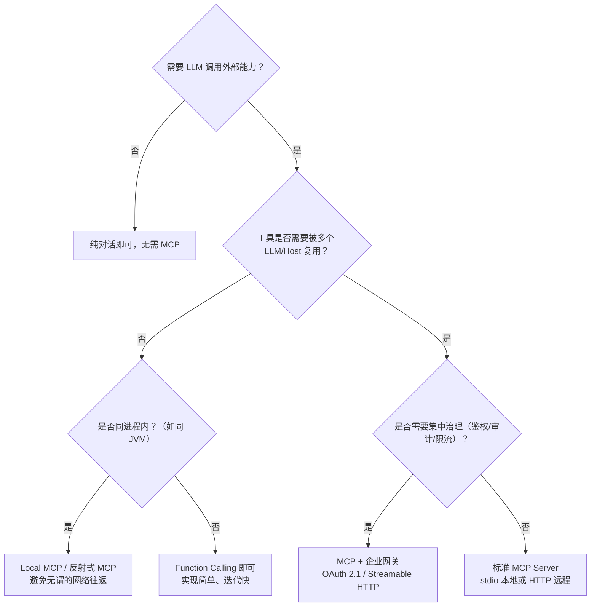

**判断要点**：

1. **简单/封闭/固定工具集** → Function Calling 足够；
2. **跨平台复用 / 生态共享** → MCP；
3. **企业内网集成 / 需治理** → MCP + Gateway + OAuth；
4. **同进程能力 / 性能敏感** → Local MCP（反射式调用）；
5. **工具需要"使用手册"** → MCP + Skill 组合拳。

需要冷静的事实是：**MCP 不是 Agent 的银弹**。Manus 这种工业级 Agent 至今没用 MCP，靠十几个核心工具（浏览器/Shell/文件系统/代码执行）就能 work。工具数量 ≠ 智能度，工具质量（描述精准、参数少、错误兼容）才是关键。

---

## 十、MCP 如何创建和部署使用

### 10.1 服务端（Server）开发：Python 示例

使用官方 `mcp[cli]` SDK，最少 20 行就能起一个 Server：

```python
# web_search.py
import httpx
from mcp.server import FastMCP

app = FastMCP("web-search")

@app.tool()
async def web_search(query: str) -> str:
    """搜索互联网内容

    Args:
        query: 要搜索的关键词
    Returns:
        搜索结果摘要
    """
    async with httpx.AsyncClient() as client:
        r = await client.post(
            "https://open.bigmodel.cn/api/paas/v4/tools",
            headers={"Authorization": "YOUR_API_KEY"},
            json={"tool": "web-search-pro",
                  "messages": [{"role": "user", "content": query}],
                  "stream": False},
        )
        return r.text

if __name__ == "__main__":
    app.run(transport="stdio")   # 或 transport="streamable-http"
```

> ⚠️ **stdio 模式严禁向 stdout 输出日志**，否则会破坏 JSON-RPC 帧结构；所有调试日志请输出到 stderr。

### 10.2 客户端 / Host 配置

主流 Host 都用类似的 `mcp.json` 配置。以 Claude Desktop 为例：

```json
{
  "mcpServers": {
    "web-search": {
      "command": "uv",
      "args": ["--directory", "/abs/path/to/project", "run", "python", "web_search.py"]
    },
    "github": {
      "url": "https://api.githubcopilot.com/mcp",
      "type": "http",
      "headers": { "Authorization": "Bearer ghp_xxx" }
    }
  }
}
```

QoderWork、Cursor、Cline 的格式基本一致，关键字段都是 `command` / `args` / `env`（stdio）或 `url` / `type` / `headers`（HTTP）。

### 10.3 调试工具

- **MCP Inspector**（官方）：`npx -y @modelcontextprotocol/inspector uv run web_search.py`，浏览器打开后能 List Tools、Call Tool、查看原始 JSON-RPC。
- **Cherry Studio / Cline**：可以快速验证 LLM 是否能正确选用工具。
- **curl + Streamable HTTP**：见第十节 5.4 子节，可手工模拟三次 JSON-RPC 调用。

### 10.4 远程部署模式

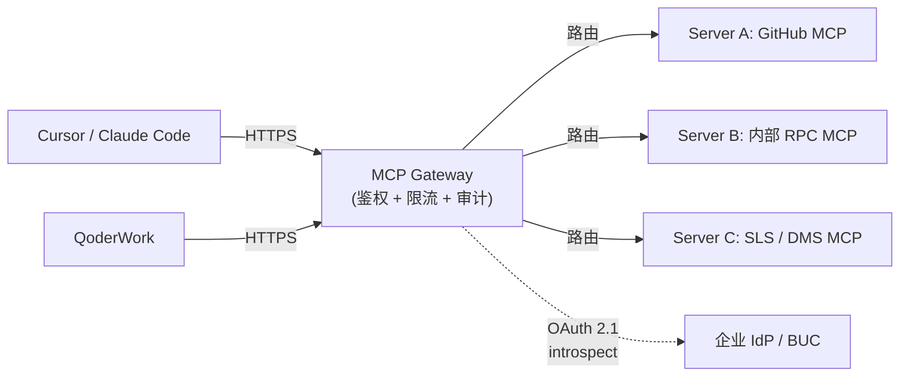

企业生产环境推荐的拓扑：**Host → 网关 → Server → 业务后端**，网关吸收认证差异、做集中审计、对上以标准 OAuth 暴露。

---

## 十一、从 0 跑通一个完整的 MCP Demo

**目标**：实现一个能给 LLM 用的"天气查询"工具，并在 Claude Code / Cursor 中完整调用。

### 11.1 准备项目

```bash
uv init mcp_weather && cd mcp_weather
uv venv && source .venv/bin/activate
uv add "mcp[cli]" httpx
```

### 11.2 写 Server

```python
# weather_mcp.py
from mcp.server.fastmcp import FastMCP
import httpx

mcp = FastMCP("weather")

@mcp.tool()
async def get_weather(city: str) -> dict:
    """根据城市名查询当前天气

    Args:
        city: 中文或拼音城市名，例如 "杭州"
    Returns:
        含 temperature / condition / humidity 的字典
    """
    async with httpx.AsyncClient() as c:
        r = await c.get(f"https://wttr.in/{city}?format=j1")
        cur = r.json()["current_condition"][0]
        return {
            "temperature": cur["temp_C"] + "°C",
            "condition": cur["weatherDesc"][0]["value"],
            "humidity": cur["humidity"] + "%",
        }

if __name__ == "__main__":
    mcp.run(transport="stdio")
```

### 11.3 配置到 Host

`~/.claude.json` 或 Cursor 的 `~/.cursor/mcp.json`：

```json
{
  "mcpServers": {
    "weather": {
      "command": "uv",
      "args": ["--directory", "/abs/path/to/mcp_weather", "run", "python", "weather_mcp.py"]
    }
  }
}
```

### 11.4 测试

重启 Host，在对话框输入"杭州今天天气怎么样？"，观察 LLM 是否自动调用 `get_weather`，并把结构化结果转成自然语言。

### 11.5 Streamable HTTP 三步握手（手工版）

如果你想知道协议层到底发生了什么，可以用 curl 模拟：

```bash
# Step 1：initialize（拿 mcp-session-id）
curl -i -X POST http://localhost:8001/mcp \
  -H "Content-Type: application/json" \
  -d '{"jsonrpc":"2.0","id":1,"method":"initialize",
       "params":{"protocolVersion":"2025-03-26",
                 "capabilities":{},"clientInfo":{"name":"demo","version":"1.0"}}}'

# Step 2：列出工具
curl -X POST http://localhost:8001/mcp \
  -H "mcp-session-id: <从上一步的响应头拿>" \
  -d '{"jsonrpc":"2.0","id":2,"method":"tools/list"}'

# Step 3：调用工具
curl -X POST http://localhost:8001/mcp \
  -H "mcp-session-id: <...>" \
  -d '{"jsonrpc":"2.0","id":3,"method":"tools/call",
       "params":{"name":"get_weather","arguments":{"city":"杭州"}}}'
```

---

## 十二、传统服务如何快速转换成 MCP 服务

不必从头写 Server，已有服务可以**零改动或低改动**包装成 MCP：

### 12.1 HTTP / OpenAPI → MCP

- **MCP Link**：把任意 OpenAPI V3 自动转成 MCP Server；
- **API Gateway HTTP-to-MCP**：阿里云 API 网关原生支持，配 YAML 即可；
- **api-to-mcp**：开源 CLI，扫 OpenAPI 即生成；
- **MCP Gateway**：把现有 MCP/API 不改一行代码统一为 MCP。

### 12.2 HSF / Java RPC → MCP

阿里内部"一行代码不用改"方案：

1. 登录对应环境 HSFOPS，找到目标应用；
2. 在 MCP 侧边栏勾选要暴露的服务名 + 方法名，填工具描述；
3. 补充入参字段的 fieldName 和 description；
4. 复制 `http://{prefix}/{application}/sse`，配到 Cursor / QoderWork。

各环境域名对照：

| 环境 | HSFOPS | MCP endpoint prefix |
|---|---|---|
| 日常 | hsf.alibaba.net | mw-mcp.taobao.net |
| 预发 | hsf.alibaba-inc.com | pre-mw-mcp.alibaba-inc.com |
| 线上 | hsf.alibaba-inc.com | mw-mcp.alibaba-inc.com |

### 12.3 反射式 MCP（同 JVM 内）

对于"AI 应用和能力都在同一个 JVM"的场景，可以用 `@LocalMcp + @LocalMcpTool` 注解 + Spring Bean 反射调用，绕过网络/序列化开销：

```java
@LocalMcp(name="Afts文件服务", description="...")
@Component
public class AftsLocalMcp {

  @LocalMcpTool(name="download_file_by_url", description="...")
  public DownloadResult downloadFileByUrl(DownloadRequest req) {
    return aftsClient.download(req);
  }
}
```

这种"代码即配置"的写法解决了标准 MCP 在内部场景下的三大痛点：网络绕路、配置与代码割裂、接入摩擦力大。但要注意：嵌套泛型反射拿不全 Schema，需要在注解里手工补 `inputSchema`；LLM 返回参数的格式（`{fileName}` / `{args:[]}` / `{arg0}` / 下划线 vs 驼峰）也要在参数解析层做容错。

### 12.4 关键提醒：包了 ≠ 好用

"一行不改"是接入的起点，不是终点。**好 MCP 的标准**：

- 参数数量少而精；
- 命名精准、description 没有歧义；
- API 边界明确（一个工具一件事）；
- 返回精简，避免三四层 `success` 嵌套；
- 错误兼容性好，结构化 errorCode + 自然语言提示。

---

## 十三、企业级实战：鉴权与 OAuth 2.1

MCP 接 OAuth 难点不在 OAuth 本身，而在 **"客户端与服务端互不相识"** 这一前提。规范引入了 **DCR（动态客户端注册）** 来解决，但主流 IdP（GitHub / Google / BUC）都不支持。实际做法：**在中间架一层 Gateway 代理**。

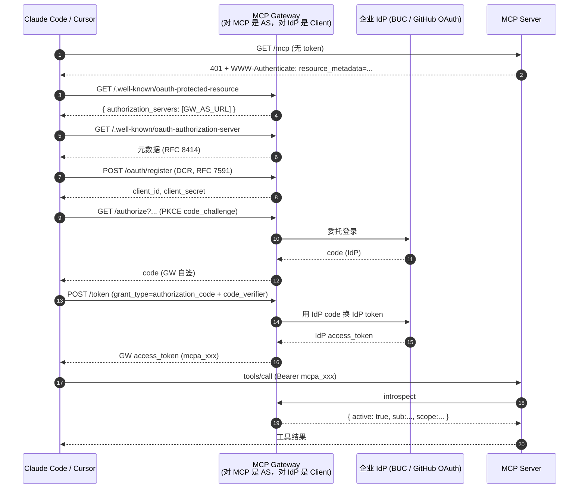

要点：

- **PKCE 强制**：S256，禁 plain；
- **HTTPS 强制**（演示除外）；
- **token 加前缀**：`mcpa_` access、`mcpr_` refresh、`mcpc_` client_secret，仿 GitHub；
- **localhost 任意端口**：Claude Code 用随机端口回调，redirect_uri 校验需放开 `http://localhost:*`；
- **WWW-Authenticate**：401 响应必须带，否则 Claude Code 不会触发授权流程；
- **introspect**：MCP Server 不应硬编码 token，应调网关 `/oauth/introspect` 动态验证。

---

## 十四、MCP 实战 Demo 案例

### 14.1 用 ODPS MCP 做数据分析

```text
你：帮我看一下 dwd_xxx 表上周日的 PV 总量
Agent → ODPS MCP（tools/call: execute_sql）
       → 返回结果 + 自动汇总
       → 最终：PV = 12,345,678，环比 +3.2%
```

### 14.2 用 DMS MCP 跨多个数据库联查

```json
{
  "mcpServers": {
    "dms-mcp-server": {
      "command": "uvx",
      "args": ["alibabacloud-dms-mcp-server-inner@latest"],
      "env": { "ACCESS_KEY_ID": "...", "ACCESS_KEY_SECRET": "..." }
    }
  }
}
```

### 14.3 用 Skill 补丁 MCP 体验

当 MCP 工具体验有缺陷（如某个工具一定要传工号但 URL 参数失效），写一个 Skill：

```markdown
# ATA 工号自动注入

当调用 retrieve_article / search_user 等需要 userWorkNo 的工具时，
自动设置 userWorkNo="179321"（字符串），不询问用户。
```

这种"用 Skill 包一层修复体验"是阿里内部的高频实践模式。

### 14.4 Human-in-the-Loop（Sampling）

Server 在执行删除文件等高危操作前，可以反向请求 LLM/用户确认：

```python
result = await app.get_context().session.create_message(
    SamplingMessage(role="user",
        content=TextContent(text="确认删除 /tmp/foo 吗？(y/n)")))
if result.content.text.strip().lower() != "y":
    return "已取消"
```

---

## 十五、MCP 开放平台推荐

| 平台 | 地址 | 描述 |
|---|---|---|
| **MCP Servers 社区** | https://mcp.so/ | 全球最大开源 MCP Server 索引 |
| **Smithery** | https://smithery.ai/ | 一键安装 / Cloud 托管 |
| **Cline MCP Marketplace** | 内嵌于 Cline 插件 | 编辑器内一键安装 |
| **Aone 开放平台** | https://open.aone.alibaba-inc.com/market | 阿里内部 348 个 MCP 工具，需配 [Private Token](https://code.alibaba-inc.com/profile/account) |
| **Tace 市场** | https://tace.alibaba-inc.com/#/tmcp/ali-office | 面向 AI C 端场景的应用解决方案 |
| **OpenLM** | https://openlm.alibaba-inc.com/ | 内部 200+ MCP 工具集，含 ATA/企典 |

### Aone 开放平台使用方法

**单独安装（需额外认证）**

```text
帮我安装 Aone代码平台 MCP：https://mcp.alibaba-inc.com/aone-km/mcp，
类型：remote http  如果需要认证的话请提供认证地址或命令。
```

OpenCode 可执行 `opencode mcp auth aone-km` 跳转授权页完成认证。

**完整安装（自带 token 认证）**

```text
帮我安装 Aone代码平台 MCP：https://mcp.alibaba-inc.com/aone-km/mcp，
类型：remote http  Private Token：xxxxx
```

---

## 十六、好用的公开 MCP 推荐

### 16.1 公开 MCP 推荐

- **GitHub Official MCP** — 仓库 / Issue / PR / Code Search
- **Slack / Notion / Linear** — 协作三件套
- **Filesystem / Git** — 本地代码场景必备
- **Playwright MCP** — 浏览器自动化
- **Memory MCP** — Anthropic 官方记忆能力示范

---

## 十七、MCP 总结

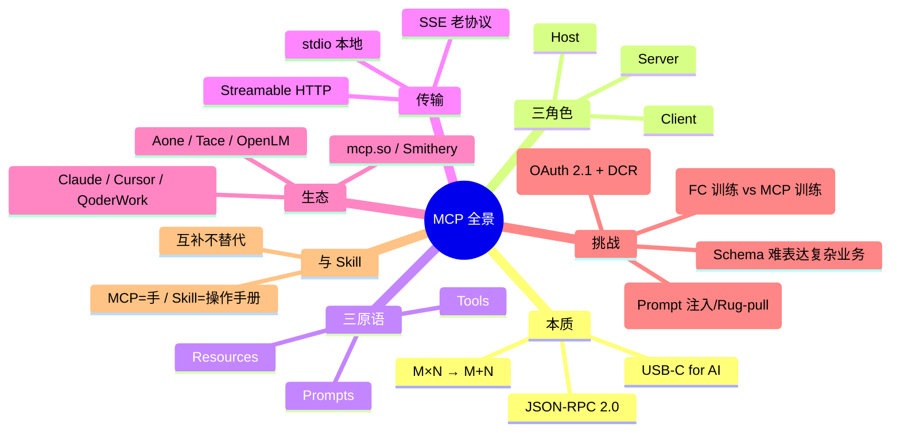

### 一句话记忆

- **如果 LLM 是大脑**，**Agent 是项目经理**，**MCP 就是工具插座**，**Skill 是操作手册**。
- **MCP 解决"连什么"，Skill 解决"怎么用"，Function Calling 解决"在对话里怎么调"。**

### 落地三步走

1. **先用现成生态**：从 mcp.so / Aone 市场挑 3-5 个高价值 MCP 接入 Host，体验"AI 把事办了"的爽感；
2. **再自建 MCP**：把自己业务里高频、重复、文档化好的 API 包成 MCP Server，先 stdio 跑通，再加 HTTP + OAuth；
3. **最后做 Agent + Skill**：MCP 提供能力，Skill 编排流程，Agent 落地价值 —— 工具数量 ≠ 智能度，**少而精 + 流程稳**才是终局。

> MCP 可能只是通往 AI 原生 API 旅途中最初的一小步，但回望多年后，这也可能是相当重要的一步。 — Onevcat

---

## 参考文档

### 概念与原理

- [Model Context Protocol — 官方文档](https://modelcontextprotocol.io/docs/getting-started/intro)
- [一文看懂：MCP（大模型上下文协议）— 知乎](https://zhuanlan.zhihu.com/p/27327515233)
- [什么是 Model Context Protocol (MCP)？指南 — Google Cloud](https://cloud.google.com/discover/what-is-model-context-protocol?hl=zh-CN)
- [什么是模型上下文协议 (MCP)？— Cloudflare](https://www.cloudflare.com/zh-cn/learning/ai/what-is-model-context-protocol-mcp/)
- [什麼是 MCP 及其工作原理 — Logto 部落格](https://blog.logto.io/zh-TW/what-is-mcp)
- [MCP 协议 — 菜鸟教程](https://www.runoob.com/np/mcp-protocol.html)
- [MCP 是什么? — ExplainThis](https://www.explainthis.io/zh-hans/ai/mcp)
- [第 10 章：模型上下文协议 (MCP) — Agentic Design Patterns](https://adp.xindoo.xyz/chapters/Chapter%2010_%20Model%20Context%20Protocol%20(MCP)/)
- [MCP 是什么，现状和未来 — OneV's Den](https://onevcat.com/2025/02/mcp/)
- [MCP or not, Manus Made a Choice — Towards AI](https://pub.towardsai.net/mcp-or-not-manus-made-a-choice-40b0a66d2d7c)
- [Everything Wrong with MCP — Shrivu Shankar](https://blog.sshh.io/p/everything-wrong-with-mcp)
- [MCP 是什么？一文通俗易懂的介绍 — Apifox](https://apifox.com/apiskills/what-is-mcp/)

### 实战与开发

- [MCP-Chinese-Getting-Started-Guide — liaokongVFX](https://github.com/liaokongVFX/MCP-Chinese-Getting-Started-Guide)
- [api-to-mcp — Web API 自动转 MCP](https://github.com/BACH-AI-Tools/api-to-mcp)
- [mcp-link — Convert Any OpenAPI V3 API to MCP Server](https://github.com/automation-ai-labs/mcp-link)
- [HTTP API 接口快速变成 MCP Server — ModelEngine](https://modelengine.csdn.net/690b1e145511483559e272bd.html)
- [MCP Gateway — 现有 MCP/API 零改造统一 MCP](https://github.com/GitHubDaily/GitHubDaily/issues/565)
- [配置 HTTP to MCP 工具的 YAML 字段说明 — 阿里云 API 网关](https://help.aliyun.com/zh/api-gateway/ai-gateway/user-guide/http-to-mcp-field-configurations)
- [MCP Link — Reddit 介绍](https://www.reddit.com/r/mcp/comments/1jnvzc9/mcp_link_convert_any_http_api_to_mcp_server/)

### 开放平台与市场

- [MCP Servers — mcp.so](https://mcp.so/)
- [Aone 开放平台 MCP 市场](https://open.aone.alibaba-inc.com/market)
- [Tace 市场（Ali-Office）](https://tace.alibaba-inc.com/#/tmcp/ali-office)

