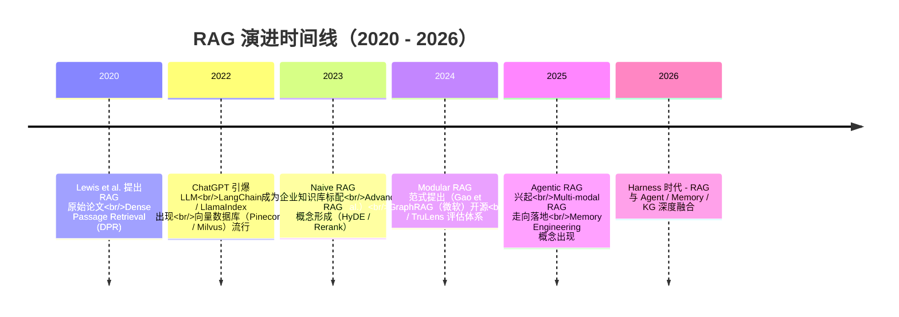
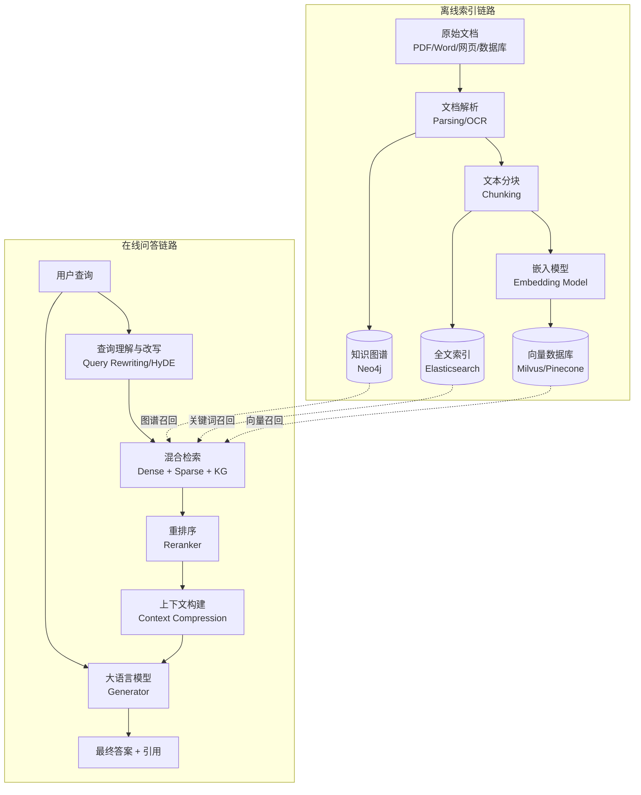
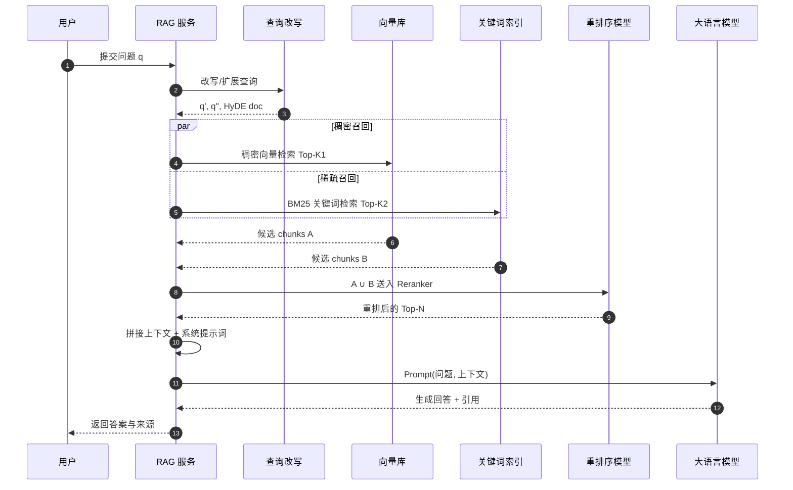
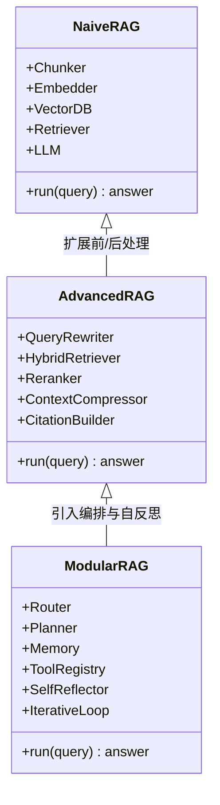
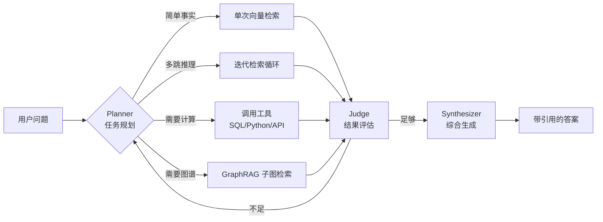

> 一句话总结：**RAG（Retrieval-Augmented Generation，检索增强生成）= 检索技术 + LLM 提示**。它让大模型在生成回答前先"查资料"，把外部知识动态注入到生成过程中，从而缓解幻觉、解决知识时效性和领域专精问题。

## 一、RAG 是什么

RAG 是 Facebook AI（现 Meta AI）在 2020 年提出的一种自然语言处理架构（Lewis et al., NeurIPS 2020），它把"信息检索（IR）"和"生成式语言模型（如 GPT 系列）"耦合到同一条推理链路上：

1. 接到用户查询后，先从外部知识库中**检索（Retrieve）**出与问题相关的文档片段；
2. 把检索结果作为上下文，**增强（Augment）**到提示词中；
3. 再交由大模型**生成（Generate）**最终答案，并可附带引用来源。

可以把 RAG 想象成一场"开卷考试"：模型参数里固化的知识是它的"长期记忆"，而向量库、知识图谱、搜索引擎构成的外部知识源就是"参考书"。开卷考试比闭卷考试答得更准、能查到最新内容、还能给出引用页码——这正是 RAG 相比纯 LLM 的三大核心优势。

### 1.1 形式化定义

设用户查询为 $q$，外部知识库为 $\mathcal{D} = \{d_1, d_2, \dots, d_n\}$，检索器为 $\mathcal{R}$，生成器（LLM）为 $\mathcal{G}$，则 RAG 的输出可表达为：

$$
y = \mathcal{G}\bigl(\,q,\;\mathcal{R}(q,\mathcal{D})\,\bigr)
$$

其中 $\mathcal{R}(q,\mathcal{D})$ 返回 Top-$k$ 个与 $q$ 最相关的文档片段，作为上下文与 $q$ 一起拼成 Prompt 输入给 $\mathcal{G}$。

### 1.2 RAG vs 微调 vs 长上下文

外部知识的注入并非只有 RAG 一条路，业界常见的三种范式对比如下：

| 维度 | RAG | 微调（Fine-tuning） | 长上下文（Long Context） |
| --- | --- | --- | --- |
| 知识更新 | 改文档即生效，近实时 | 重新训练，成本高 | 每次都把全部资料塞进 Prompt |
| 知识规模 | TB 级，几乎无上限 | 受参数量限制 | 受上下文窗口限制 |
| 可溯源 | 天然可引用来源 | 几乎无法溯源 | 可引用但缺乏检索结构 |
| 单次成本 | 中（检索 + 推理） | 高（训练）/ 低（推理） | 高（Token 消耗大） |
| 适用场景 | 知识密集、时效性强、需引用 | 风格/格式定制、领域适配 | 单文档深度理解、对话上下文 |
| 幻觉控制 | 强（有据可查） | 中 | 中（信息越多反而越易迷失） |

三者并非互斥：在工程上常常**RAG 提供事实、微调塑造风格、长上下文承载会话状态**，组合使用才能拿到最佳效果。

---

## 二、RAG 发展历程

RAG 在短短五年里完成了从"学术原型"到"企业级基础设施"再到"Agentic 智能体"的三级跳。下图给出一条更清晰的时间线：



按技术范式划分，业界普遍把 RAG 归纳为三代（Gao et al., *Retrieval-Augmented Generation for Large Language Models: A Survey*, 2024）：

**第一代 Naive RAG**：朴素的"切块 → 向量化 → 检索 Top-K → 拼 Prompt → 生成"线性流水线，胜在简单、易上线，但召回率低、噪声多、答非所问的情况频发。

**第二代 Advanced RAG**：围绕检索质量做了大量增强，前置有查询改写（Query Rewrite）、查询扩展、HyDE（Hypothetical Document Embeddings）等；后置有重排序（Rerank）、上下文压缩（Compression）、融合（Fusion）等；同时引入混合检索（BM25 + 稠密向量）和多路召回。

**第三代 Modular RAG**：把 RAG 拆解为"乐高式"的可插拔模块——路由（Routing）、调度（Scheduling）、记忆（Memory）、自反思（Self-Reflection）、迭代检索（Iterative Retrieval）等——通过编排框架按需组合，催生了 GraphRAG、Self-RAG、CRAG、Agentic RAG 等大量变体。

> 阿里内部对该演进有一种独特视角："知识工程之 2：Harness 时代 RAG 过时了吗？"一文指出 RAG 并未过时，而是被吸纳为 Harness（智能体外骨骼）中的一个能力模块，与 Memory、Tool、Planner 协同工作。

---

## 三、为什么需要 RAG？

大模型本身已经"知道很多"，但仍有四类问题靠纯参数化知识无法解决，这正是 RAG 的价值锚点。

**1. 知识时效性差。** 预训练数据有截止日期（cut-off date），模型对训练截止后发生的事一无所知。RAG 让"知识库"和"模型"解耦，更新文档即更新知识，无需重训。

**2. 领域知识缺失。** 公司内部规章、行业专有名词、长尾业务概念通常未出现在公开语料中。微调能补一部分，但成本高、灵活性差，RAG 可以低成本接入企业知识库、CRM、Wiki、ATA、语雀等任意私有源。

**3. 幻觉（Hallucination）严重。** LLM 是概率生成模型，遇到不熟悉的话题会"编造"看似合理的答案。RAG 通过提供事实上下文 + 强制引用，把生成约束在"有据可依"的范围里，大幅降低幻觉率。

**4. 缺乏可解释性与可审计性。** 在金融、医疗、法律等强合规场景里，"答案出处"和"答案本身"同等重要。RAG 天然可以输出引用，便于人工复核与责任追溯。

此外，RAG 还自带几个工程友好的副作用：**冷启动快**（不需要训练数据）、**权限可控**（文档级 ACL 即可隔离敏感数据）、**多租户友好**（不同租户接入不同知识库）、**成本可控**（无需 GPU 训练，只在推理时调用 LLM API）。

---

## 四、深入理解 RAG 工作原理

### 4.1 总体架构

经典 RAG 系统由两条阶段链构成：**离线索引链路（Indexing Pipeline）** 和 **在线问答链路（Query Pipeline）**。下图用 Mermaid 流程图展示整体架构：



### 4.2 离线索引：把知识"喂"进系统

#### 4.2.1 文档解析（Parsing）

源头数据格式繁杂：PDF、Word、PPT、Excel、HTML、Markdown、扫描件、数据库表、API、邮件……解析阶段要把这些异构数据统一成结构化文本块，难点在于：

- **版式还原**：PDF 的双栏、表格、公式、脚注容易乱序；
- **多模态信号**：图片、图表、流程图需要 OCR + 视觉模型识别；
- **元数据保留**：标题层级、表格列名、文档作者、修改时间等元数据是后续过滤的关键。

近一年涌现出 RAG-Anything、MinerU、Unstructured、LlamaParse 等专业解析器，可显著提升表格、公式、复杂版式的还原质量。

#### 4.2.2 分块（Chunking）

LLM 的上下文窗口有限，必须把长文档切成多个 chunk。常见策略：

- **固定长度切分**：按 token 数或字符数硬切，简单但容易破坏语义；
- **递归字符切分**（RecursiveCharacterTextSplitter）：按段落 → 句子 → 词语逐级切，兼顾长度和语义；
- **语义切分**：用 Embedding 相似度判断切点，保证每块内部主题一致；
- **结构化切分**：按 Markdown 标题、HTML 标签、代码 AST 切，保留文档骨架；
- **命题级切分**（Proposition Chunking）：把段落进一步拆为独立可断言的命题句，召回更精准；
- **延迟分块**（Late Chunking）：先对整篇文档算 Embedding 再切，让每个 chunk 都带有全局上下文。

经验法则：**块长 200~500 token、重叠 50~100 token** 是大多数场景的安全起点，但应在业务数据上做 A/B 评估。

#### 4.2.3 嵌入（Embedding）

把文本映射成稠密向量，是检索的语义基础。选型时关注四点：维度（通常 384~1536）、最大输入长度、多语言能力、领域适配。常见选项：

- **闭源 API**：OpenAI `text-embedding-3-large`、Cohere Embed v3、阿里通义 `text-embedding-v3`；
- **开源中文**：BAAI 的 `bge-large-zh-v1.5`、`bge-m3`（多语言+多粒度）、Jina `jina-embeddings-v3`、智源 `Conan-embedding`；
- **多模态**：CLIP、SigLIP、Jina v5-omni，可同时编码文本和图片。

> 阿里内部的"RAG 知识向量化完全指南"特别提醒：**Embedding 模型必须与业务领域语料贴合**，金融、医疗、代码等垂域往往需要二次微调（如 SimCSE、对比学习）才能拿到可接受的召回率。

#### 4.2.4 索引（Indexing）

向量数据库负责把上亿条向量组织成可快速近邻搜索（ANN）的索引结构，主流选型：

| 类型 | 代表产品 | 特点 |
| --- | --- | --- |
| 专用向量库 | Milvus、Qdrant、Weaviate、Pinecone | 性能高、生态全 |
| 全文 + 向量 | Elasticsearch、OpenSearch、Vespa | 混合检索一体化 |
| 嵌入型 | pgvector（Postgres）、Redis VSS、SQLite-VSS | 易部署、贴近业务库 |
| 图谱+向量 | Neo4j、NebulaGraph + 向量插件 | GraphRAG 友好 |

索引算法常见 HNSW、IVF-PQ、DiskANN，三者在召回率/QPS/内存/磁盘之间各有取舍。

### 4.3 在线问答：把问题"翻译"成检索 + 生成

下图用 Mermaid 时序图刻画一次完整的 RAG 问答调用：



#### 4.3.1 查询理解（Pre-Retrieval）

用户原始问题往往含糊、缺主语或表述与文档术语不一致，需要先做"翻译"：

- **查询改写（Rewrite）**：把口语化问题改成检索友好的表述；
- **查询扩展（Expansion）**：补充同义词、领域术语；
- **查询分解（Decomposition）**：复杂问题拆成多个子查询（least-to-most、Self-Ask）；
- **HyDE**：让 LLM 先"假想"一份理想答案文档，用它的向量去检索，缓解 query-doc 语义鸿沟；
- **Step-Back Prompting**：先抽象出更上位的概念问题，再回到具体问题。

#### 4.3.2 检索（Retrieval）

- **稀疏检索**：BM25/TF-IDF，擅长精确关键词匹配；
- **稠密检索**：基于 Embedding 的语义匹配，擅长同义、长尾；
- **混合检索**：稀疏 + 稠密分数融合（如 RRF, Reciprocal Rank Fusion），是当前工业界事实标准；
- **图谱检索**：基于知识图谱的多跳推理，GraphRAG、LightRAG 在此方向上深耕；
- **结构化检索**：Text2SQL/Text2Cypher，把自然语言转成结构化查询直接打数据库。

#### 4.3.3 后处理（Post-Retrieval）

- **重排序（Rerank）**：用 Cross-Encoder（如 `bge-reranker-v2-m3`、Cohere Rerank、Jina Rerank）对召回结果二次精排，对 Top-K 质量提升立竿见影；
- **上下文压缩**：用小模型抽取核心句、剔除无关段落，节省 token；
- **多文档融合**：去重、按时间/权威性加权、拼接成统一上下文；
- **引用对齐**：为每个事实标注来源 chunk_id，便于生成阶段引用。

#### 4.3.4 生成（Generation）

把"系统提示 + 上下文 + 用户问题"拼成最终 Prompt 喂给 LLM。工程要点：

- **角色与边界**："你是某领域助手，仅基于以下材料回答，不知道时如实说明"；
- **结构化输出**：要求 JSON、Markdown、带引用编号等；
- **拒答机制**：检索为空或相关性低时显式拒答，避免硬编；
- **流式输出**：边检索边生成，降低首字延迟。

### 4.4 三代范式架构对比

下图用类图直观呈现 Naive RAG、Advanced RAG、Modular RAG 的关系：



### 4.5 进阶范式：GraphRAG、Self-RAG、Agentic RAG

**GraphRAG**：由微软在 2024 年开源，思路是先用 LLM 从文档抽取实体与关系构建知识图谱，再在图上做社区检测（如 Leiden 算法）生成"社区摘要"。回答全局性、聚合性问题（"X 公司的整体战略变化"）时显著优于向量检索。LightRAG 则进一步在图上做双层检索（局部实体 + 全局主题），更轻量。

**Self-RAG / CRAG**：让模型自我反思检索质量。Self-RAG 训练模型在生成过程中输出特殊 token（`[Retrieve]`、`[ISREL]`、`[ISSUP]`、`[ISUSE]`）来决定是否检索、检索结果是否相关、生成是否被支持。CRAG（Corrective RAG）则在检索后用轻量分类器判断"正确/模糊/错误"，错误时触发网络搜索兜底。

**Agentic RAG**：把 RAG 嵌入到 Agent 循环中（Plan → Tool Use → Observe → Reflect → Act），由智能体决定何时检索、检索什么、用哪个工具、是否需要多轮。下图给出 Agentic RAG 的一般控制流：



Agentic RAG 的核心收益是**动态可适应**：简单问题走快路径、复杂问题走多步推理，跟 Pipeline RAG 的固定流水线形成鲜明对比。

### 4.6 评估：怎么知道你的 RAG 好不好

业界已经形成相对成熟的评估体系，关注三个层面六个指标：

| 层面 | 指标 | 含义 |
| --- | --- | --- |
| 检索 | Context Recall | 召回的上下文是否覆盖回答所需的所有事实 |
| 检索 | Context Precision | 召回结果中真正相关的比例 |
| 生成 | Faithfulness | 答案是否完全由上下文支撑（无幻觉） |
| 生成 | Answer Relevancy | 答案是否切中用户问题 |
| 端到端 | Answer Correctness | 答案与标注 ground truth 的一致性 |
| 端到端 | Citation Accuracy | 引用是否真实指向支撑句 |

工具链：**RAGAS**（开源、最流行）、**TruLens**、**Phoenix（Arize）**、**DeepEval**、**LangSmith**。评估数据集可自动构造（用 LLM 从文档生成 Q-A pair）或人工标注，工程上建议两者结合。

---

## 五、RAG 应用场景

RAG 已经渗透到几乎所有需要"知识 + 语言"的产品形态，按用户角色和价值类型可以归为五大象限：

**1. 企业知识助手（最大量级）**
- 内部 Wiki 问答（语雀、ATA、Confluence、Notion）；
- IT 客服、HR 政策问答、合规问答；
- 客户支持机器人，从工单/文档/FAQ 实时检索答案。

**2. 专业垂域 Copilot**
- **法律**：合同审查、判例检索、合规问答（如 Harvey、Casetext）；
- **医疗**：循证医学问答、电子病历摘要、用药指导；
- **金融**：研报问答、财务分析、风控规则解读；
- **科研**：文献综述、论文问答（如 Elicit、SciSpace）。

**3. 开发者工具**
- 代码助手对私有代码库的语义搜索（如 Cursor、Cody、Aone Copilot）；
- 技术文档问答（Stripe Docs Assistant、AWS Q）；
- API 设计与排错。

**4. 内容生产与编辑**
- 新闻摘要、播客笔记、视频字幕问答；
- 营销素材生成（先检索品牌素材库再生成文案）；
- 出版业的事实核查与引用补全。

**5. Agent / Memory Engineering**
- 给 Agent 提供长期记忆（语义记忆、情景记忆）；
- 多 Agent 系统中的"共享知识总线"；
- 个人助理的跨会话记忆（这正是阿里"从 RAG 到 Memory Engineering"一文的主题）。

---

## 六、RAG 项目实战

下面给出一个可落地的最小工程框架，再列出几条可直接上手的开源项目路径。

### 6.1 一个最小可运行的 RAG 示例（LangChain + Milvus）

```python
# pip install langchain langchain-community langchain-openai pymilvus sentence-transformers
from langchain_community.document_loaders import DirectoryLoader
from langchain.text_splitter import RecursiveCharacterTextSplitter
from langchain_community.embeddings import HuggingFaceEmbeddings
from langchain_community.vectorstores import Milvus
from langchain_community.retrievers import BM25Retriever
from langchain.retrievers import EnsembleRetriever, ContextualCompressionRetriever
from langchain.retrievers.document_compressors import CrossEncoderReranker
from langchain_community.cross_encoders import HuggingFaceCrossEncoder
from langchain_openai import ChatOpenAI
from langchain.prompts import ChatPromptTemplate
from langchain.schema.runnable import RunnablePassthrough
from langchain.schema.output_parser import StrOutputParser

# 1. 加载 + 分块
docs = DirectoryLoader("./knowledge", glob="**/*.md").load()
splitter = RecursiveCharacterTextSplitter(chunk_size=400, chunk_overlap=80)
chunks = splitter.split_documents(docs)

# 2. 向量化 + 入库
embed = HuggingFaceEmbeddings(model_name="BAAI/bge-large-zh-v1.5")
vstore = Milvus.from_documents(chunks, embed, collection_name="kb")

# 3. 混合检索（向量 + BM25）
dense = vstore.as_retriever(search_kwargs={"k": 8})
sparse = BM25Retriever.from_documents(chunks); sparse.k = 8
hybrid = EnsembleRetriever(retrievers=[dense, sparse], weights=[0.6, 0.4])

# 4. 重排序
reranker = CrossEncoderReranker(
    model=HuggingFaceCrossEncoder(model_name="BAAI/bge-reranker-v2-m3"),
    top_n=4,
)
retriever = ContextualCompressionRetriever(
    base_compressor=reranker, base_retriever=hybrid
)

# 5. 生成
prompt = ChatPromptTemplate.from_template("""
你是企业知识助手，仅基于下方"参考资料"回答。无法回答时请明确说明。
参考资料：
{context}

问题：{question}
请用中文回答，并在末尾以 [doc-id] 形式列出引用来源。
""")
llm = ChatOpenAI(model="gpt-4o-mini", temperature=0)

chain = (
    {"context": retriever, "question": RunnablePassthrough()}
    | prompt
    | llm
    | StrOutputParser()
)

print(chain.invoke("公司 2025 年 Q4 的差旅报销标准是什么？"))
```

这套约 30 行代码的最小框架已经覆盖了 Advanced RAG 的核心组件：**分块、向量化、混合检索、重排序、提示工程、引用要求**。任何企业级 RAG 都是在它之上叠加：异构数据接入、权限隔离、缓存、评估、可观测性、灰度发布。

### 6.2 推荐的开源实战路径

| 项目 | 适合人群 | 亮点 |
| --- | --- | --- |
| [datawhalechina/all-in-rag](https://github.com/datawhalechina/all-in-rag) | 系统性入门 | 中文 10 章实战教程，覆盖数据加载到 Graph RAG |
| LangChain / LlamaIndex | 通用编排 | 组件丰富、社区活跃，事实上的标准 |
| Haystack（deepset） | 生产级 Pipeline | 模块化、组件可替换、配套评估工具 |
| Microsoft GraphRAG | 全局聚合问答 | 实体抽取 + 社区摘要的图增强方案 |
| LightRAG | 轻量 GraphRAG | 双层检索，部署简单 |
| RAG-Anything | 多模态 RAG | 解析 PDF/图表/表格/公式 |
| RAGAS | 评估 | 一行代码做端到端 RAG 评估 |

### 6.3 工程化 Checklist

在把 RAG Demo 推上生产前，建议逐项核对以下清单：

- 数据接入：是否覆盖全部知识源？增量同步策略？敏感字段脱敏？
- 权限：是否做到 chunk 级 ACL？多租户隔离？
- 检索质量：是否上线了 Rerank？混合检索权重是否调过？召回率/精确率是否有基线？
- 生成质量：是否有显式拒答策略？是否强制引用？幻觉率是否监控？
- 评估：是否有自动评估 + 人工抽检流程？是否对每次 Prompt/模型升级做回归？
- 性能：P95 首字延迟？检索 QPS？缓存命中率？
- 可观测性：Trace 是否能从用户问题追溯到 chunk_id？是否记录每次调用的 token/成本？
- 灰度与回滚：模型/索引版本是否可灰度？能否一键回滚？

### 6.4 常见坑与对治

- **召回相关但答非所问**：通常是 chunking 太碎或重叠不足，先调分块再调 Embedding。
- **答案"看起来对"但没有依据**：开启 Faithfulness 评估、强制引用、提高 Rerank 阈值。
- **新文档更新后还在答旧答案**：检查向量库的 upsert 策略、缓存 TTL、Embedding 重算逻辑。
- **多语言检索拉胯**：换 `bge-m3` 或 `multilingual-e5`，并对查询和文档统一规范化。
- **Top-K 越大反而越差**：上下文越长越易 lost-in-the-middle，需要重排 + 压缩，而不是无脑加 K。
- **企业内长尾术语完全检索不到**：上 BM25 兜底，或对 Embedding 做领域微调（对比学习）。

---

## 七、RAG 总结

回到开头那句话：**RAG = 检索 + LLM 提示**。短短一句话背后藏着信息检索、向量数据库、Embedding、知识图谱、Agent 编排、评估方法论等一整套技术栈。

几个值得反复强调的判断：

第一，**RAG 没有过时，而是被吸收**。Harness/Agent 时代，RAG 不再是孤立产品，而是 Agent 工具箱里那把"最稳的瑞士军刀"，与 Memory、KG、Tool Use 共同构成 LLM 的"外骨骼"。

第二，**RAG 的瓶颈往往不在模型，而在数据与检索**。Embedding 模型选错、Chunk 切错、Rerank 没上，再强的 LLM 也救不回来。把 80% 的精力放在"数据—检索—评估"这条链路上，比反复换模型有用得多。

第三，**评估优先于优化**。没有可量化的指标，所有"优化"都是猜。先用 RAGAS 跑出基线，再针对薄弱环节迭代，是工业界唯一靠谱的姿势。

第四，**长上下文和 RAG 不是替代关系而是协同关系**。即便上下文窗口达到百万 token，RAG 仍是控制成本、保障可溯源、支持多租户、做权限隔离的最佳工程方案。

最后，**关注 Agentic RAG / GraphRAG / Memory Engineering 的进化**。这三条线代表了 RAG 在"多步推理"、"全局聚合"、"长期记忆"三个方向的延伸，是 2026 年最值得跟进的演进方向。

---

## 参考文档

- [Lewis et al., *Retrieval-Augmented Generation for Knowledge-Intensive NLP Tasks*, NeurIPS 2020 (原始论文)](https://arxiv.org/abs/2005.11401)
- [Gao et al., *Retrieval-Augmented Generation for Large Language Models: A Survey* (RAG 三代范式综述)](https://arxiv.org/abs/2312.10997)
- [Gao et al., *Modular RAG: Transforming RAG Systems into LEGO-like Reconfigurable Frameworks*, 2024](https://arxiv.org/html/2407.21059v1)
- [*Agentic Retrieval-Augmented Generation: A Survey on Agentic RAG*, 2025](https://arxiv.org/html/2501.09136v4)
- [一文读懂：大模型 RAG（检索增强生成）含高级方法 — 知乎](https://www.zhihu.com/tardis/zm/art/675509396?source_id=1003)
- [什么是检索增强生成 (RAG)？ — Google Cloud](https://cloud.google.com/use-cases/retrieval-augmented-generation?hl=zh-CN)
- [一文讲清 RAG：检索、增强、生成！ — 掘金](https://juejin.cn/post/7541278449565990946)
- [RAG 实战全解析：一年探索之路 — 知乎](https://zhuanlan.zhihu.com/p/682253496)
- [不懂 RAG？看这一篇万字长文就够了，中科院出品 — 火山引擎开发者社区](https://developer.volcengine.com/articles/7483714529205944371)
- [什么是检索增强生成 (RAG)？ | RAG 全面指南 — Elastic](https://www.elastic.co/cn/what-is/retrieval-augmented-generation)
- [datawhalechina/all-in-rag — 大模型应用开发实战一：RAG 技术全栈指南](https://github.com/datawhalechina/all-in-rag)
- [What is RAG (Retrieval Augmented Generation)? — IBM](https://www.ibm.com/think/topics/retrieval-augmented-generation)
