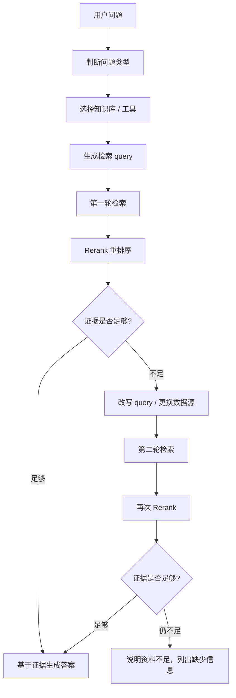

# RAG 相关信息和实际使用手册

本文整理了前面关于 Dify 知识库 RAG、chunk 设置、召回准确率优化、其他 RAG 方案，以及 Agentic RAG / 多轮 RAG 的问答内容。目标不是堆概念，而是帮助你理解“什么时候用什么方案、怎么配置、怎么判断效果有没有变好”。

## 1. RAG 是什么

RAG 是 Retrieval-Augmented Generation，中文通常叫“检索增强生成”。它解决的问题是：大模型本身不知道你的私有文档、内部制度、产品手册、接口说明、工单记录，所以需要先从知识库里检索相关内容，再把检索结果和用户问题一起交给大模型生成回答。

最基础的 RAG 流程是：

```text
用户问题
-> 检索知识库
-> 召回相关 chunk
-> 拼接上下文
-> 大模型生成答案
```

一个更完整的 RAG 流程通常是：

```text
文档上传
-> ETL 解析
-> 清洗
-> Chunk 切分
-> Embedding 向量化
-> 写入向量数据库
-> 用户提问
-> 语义/关键词/混合检索
-> Rerank 重排序
-> 拼接上下文
-> LLM 生成回答
```

## 2. Dify 中的知识库 RAG 基于什么实现

Dify 的知识库 RAG 不是绑定某一个单独框架，而是一套组合式 RAG 流程。它主要由以下部分组成：

| 环节 | 作用 |
|---|---|
| 文档解析 / ETL | 把 PDF、Markdown、Docx、网页等资料抽取成文本 |
| 文本清洗 | 去掉无意义空行、页眉页脚、重复内容等 |
| Chunk 切分 | 把长文档切成适合检索的小块 |
| Embedding | 把文本转成向量 |
| 向量数据库 | 存储和检索向量，Dify 自托管默认向量库通常是 Weaviate |
| 检索策略 | 支持语义检索、关键词检索、混合检索等 |
| Rerank | 对召回结果重新排序 |
| LLM 生成 | 把召回内容作为上下文生成答案 |

Dify 的 RAG 底层主要依赖三类能力：

- Embedding 模型：决定语义相似度怎么计算。
- 向量数据库：负责存储和召回向量。
- 检索与重排序策略：决定能不能找准、排准、过滤掉噪音。

Dify 不是固定绑定某个向量库或某个模型。自托管环境中可以通过配置选择不同向量数据库，例如 Weaviate、Qdrant、Milvus、pgvector、Chroma、OpenSearch、Elasticsearch 等。

## 3. Chunk 到底怎么设置

Chunk 不是单纯“按大小切”或“按 Markdown 标题切”二选一。更准确地说，Dify 的 chunk 通常是：

```text
先按分隔符规则切分
如果某段超过最大 chunk length
再按最大长度强制切开
```

所以它既可以按大小切，也可以利用 Markdown 标题、换行、段落、句号等结构切。

### 3.1 General Mode

General Mode 适合普通文档。核心配置通常包括：

- Chunk identifier / delimiter：分隔符，可以是换行、段落，也可以是正则。
- Maximum chunk length：最大 chunk 长度。
- Overlap：相邻 chunk 的重叠部分。

如果文档是 Markdown，可以尝试用标题作为分隔符，例如：

```regex
\n#{1,6}\s+
```

但要注意，这更像“按分隔符切文本”，不一定等于完整理解 Markdown AST 层级。也就是说，它不一定天然知道“一级标题包含二级标题，二级标题包含正文”。所以设置后一定要看 Preview Chunk 的实际效果。

### 3.2 Parent-child Mode

如果是 Markdown 技术文档、产品手册、政策制度、操作指南，优先考虑 Parent-child Mode。

它的思路是：

```text
Parent chunk：保留较完整的上下文，例如一个章节或段落
Child chunk：切得更小，用来精准召回，例如一句话或短段
```

检索时先命中 child chunk，再带出对应 parent chunk 给大模型。这样既能精准命中，又不容易丢上下文。

推荐起步配置：

```text
Parent delimiter：
按标题或较大段落切，例如 Markdown 标题

Child delimiter：
按句号、换行、小段落切

Parent chunk length：
800-1500 tokens 起步

Child chunk length：
150-300 tokens 起步
```

### 3.3 不同文档的切分建议

| 文档类型 | 推荐方式 |
|---|---|
| FAQ、短问答 | General Mode，按问答对或段落切 |
| Markdown 技术文档 | Parent-child Mode，标题/章节做 parent，句子/短段做 child |
| 产品手册、政策制度 | Parent-child Mode |
| API 文档 | 按接口、标题、错误码切，不要只按固定长度 |
| 长 PDF | 先转 Markdown 或清洗后再导入 |
| 表格很多的文档 | 尽量先整理成结构化 Markdown 或 CSV，再导入 |

一个实用原则是：**优先按文档结构切，大小只是兜底限制。**

## 4. 如何提高解析准确率

RAG 效果不好，很多时候不是模型不行，而是源文档解析后已经乱了。解析不准，召回和生成都会跟着偏。

建议：

- 优先上传结构清晰的 Markdown、TXT、HTML、DOCX。
- 复杂 PDF 尽量先转成 Markdown。
- 扫描版 PDF 先做 OCR。
- 删除页眉、页脚、目录页、版权页、重复导航、广告。
- 表格类内容单独整理，避免表头和数据被切断。
- 一个知识库尽量只放一个领域，不要把产品文档、合同、客服话术、接口文档混在一起。
- 如果默认 ETL 对复杂文档解析不好，可以考虑使用更强的文档解析工具或启用 Unstructured ETL。

解析阶段的目标不是“把所有内容都塞进去”，而是让进入知识库的内容干净、稳定、可检索。

## 5. 如何提高召回准确率

召回准确率可以从 Embedding、检索模式、Rerank、TopK、阈值、Metadata、测试集几个方面调整。

### 5.1 选择合适的 Embedding 模型

Embedding 决定“语义相似”算得准不准。

建议：

- 中文内容选择中文或多语言 Embedding。
- 中英混合内容选择 multilingual embedding。
- 技术文档要测试接口名、错误码、产品名、缩写是否能召回。
- 更换 Embedding 模型后，通常需要重新索引知识库。

如果召回结果经常“语义好像相关，但事实不对”，可能是 Embedding 模型不适合当前语料。

### 5.2 使用 Hybrid Search

单纯向量检索不一定够。向量检索擅长语义相似，关键词检索擅长精确词、型号、错误码、接口名、专有名词。

更稳的通用方案是：

```text
BM25 / 全文检索
+ 向量检索
+ Metadata 过滤
+ Rerank 模型
```

适合开启 Hybrid Search 的场景：

- 用户会输入错误码、型号、接口名。
- 文档里有大量专有名词。
- 用户问题既有自然语言，也有精确关键词。
- 单纯向量检索经常召回“意思差不多但不是答案”的片段。

### 5.3 使用 Rerank

Rerank 是对初步召回结果重新排序。它通常会比向量数据库原始相似度更接近“这段内容是否真的能回答问题”。

建议：

- 召回结果多但排序差：开启 Rerank。
- Hybrid Search 后结果来源较杂：开启 Rerank。
- TopK 调大后噪音变多：开启 Rerank。
- 企业知识库、政策制度、技术文档：优先考虑 Rerank。

### 5.4 调整 TopK 和相似度阈值

TopK 不是越大越好。太小容易漏召回，太大容易把不相关内容塞进上下文。

建议起步：

```text
FAQ / 简单问答：
TopK 3-5

复杂政策 / 长文档：
TopK 5-8

开启 Rerank 后：
初召回 TopK 可以稍大
Rerank 后保留较少高质量片段
```

判断标准不是“最终回答看起来顺不顺”，而是“召回片段是否真的包含答案”。

### 5.5 使用 Metadata 过滤

Metadata 可以让检索先缩小范围，再做语义匹配。

例如给文档加：

```text
product: dify
version: 1.15
doc_type: faq
department: support
language: zh
```

典型用法：

- 问 A 产品时，只检索 A 产品文档。
- 问 1.15 版本时，只检索对应版本。
- 问接口错误码时，只检索 API 文档。
- 问客服话术时，只检索 FAQ 或工单知识。

Metadata 过滤尤其适合多产品、多版本、多部门的企业知识库。

## 6. RAG 调优闭环

不要只凭感觉调 RAG。更可靠的方法是准备一组真实问题做测试集。

测试表可以这样设计：

| 问题 | 正确答案所在文档 | 应召回 chunk | 当前是否命中 | 问题类型 |
|---|---|---|---|---|
| 如何重置管理员密码？ | admin-guide.md | 第 3 节 | 是/否 | 操作步骤 |
| API 401 是什么原因？ | api-error.md | 401 错误码 | 是/否 | 错误码 |
| 企业版支持 SSO 吗？ | pricing.md | SSO 说明 | 是/否 | 产品功能 |

调优顺序建议：

```text
清洗文档
-> 小批量导入
-> 选择合适 chunk 模式
-> 调 chunk 和 overlap
-> 选择合适 Embedding
-> 开启 Hybrid Search
-> 开启 Rerank
-> 调 TopK / 阈值
-> 加 Metadata 过滤
-> 用 Test Retrieval 反复验证
```

每次只改一个变量，然后用同一批问题复测。这样才能知道到底是哪项配置带来了提升。

## 7. 除了 Dify，还有哪些 RAG 方案

Dify 属于平台型、低代码、通用 RAG。它适合快速搭建 AI 应用、知识库问答、Workflow 和 Agent。但如果你追求更高准确率、更强可控性，可以根据问题类型选择其他路线。

| 场景 | 更推荐 |
|---|---|
| 快速搭 AI 应用 | Dify |
| 文档解析复杂，PDF/表格很多 | RAGFlow |
| 想代码级深度定制 RAG | LlamaIndex |
| 生产级检索管道 | Haystack |
| 多文档、多实体、多跳关系推理 | GraphRAG |
| 长文档全局理解 | RAPTOR |
| 通用知识库准确率提升 | Hybrid Search + Rerank |
| 业务数据库问答 | Text-to-SQL / API Retrieval |

### 7.1 RAGFlow

RAGFlow 更偏文档解析质量，适合 PDF、扫描件、表格、Word、PPT、图片混排文档。它主打 deep document understanding、可视化 chunk、人为干预、引用溯源、多路召回和融合重排。

适合：

- 企业制度文档。
- 合同、标书、说明书。
- 扫描 PDF。
- 表格很多的文档。
- 想人工检查 chunk 质量的场景。

### 7.2 LlamaIndex

LlamaIndex 更像一个 RAG 工程框架，适合有开发能力的团队。它提供 ingestion、indexing、retriever、query engine、node parser、metadata extraction、evaluation 等模块，可以细粒度控制 RAG 流程。

适合：

- 自定义 chunk 策略。
- 多索引路由。
- 文档 + 数据库 + API 混合检索。
- Graph RAG / Agentic RAG。
- 需要写代码深度定制的项目。

### 7.3 Haystack

Haystack 更偏生产级检索管道。它把 converter、preprocessor、embedder、retriever、ranker、generator、evaluator 等组件拆得比较清楚，适合做可维护的企业检索系统。

适合：

- 企业内部搜索。
- 可观测、可替换组件的 RAG pipeline。
- Elasticsearch / OpenSearch / Qdrant / Weaviate 等后端。
- BM25 + 向量 + Rerank 的稳定工程。

### 7.4 GraphRAG

GraphRAG 不是简单向量检索，而是从文本中抽取实体、关系、claim，构建知识图谱和社区摘要，再用图结构辅助检索和总结。

适合：

- 公司、组织、人、项目、事件、产品之间关系复杂。
- 问题需要跨文档推理。
- 需要总结全局主题、风险、趋势。
- 研究报告、情报分析、投研、风控。

缺点是索引成本高、构建慢、复杂度比普通 RAG 高很多。

### 7.5 RAPTOR

RAPTOR 的思路是把 chunk 递归聚类、摘要，构建树状索引。查询时可以从不同抽象层级检索内容。

适合：

- 长篇报告。
- 法规政策。
- 论文集。
- 大型产品手册。
- 需要“局部细节 + 全局概括”的问答。

### 7.6 Text-to-SQL / API Retrieval

如果数据本来是结构化的，例如订单、库存、用户、工单、财务数据，不一定应该切 chunk 放进向量库。更好的方式可能是：

```text
用户问题
-> 意图识别
-> 生成 SQL / API 查询
-> 查数据库
-> LLM 总结结果
```

适合：

- 报表问答。
- 业务数据查询。
- 工单统计。
- CRM / ERP / 数据仓库。
- 有明确字段和权限控制的系统。

## 8. Agentic RAG 怎么理解

Agentic RAG 可以理解为：把传统 RAG 的固定检索流程，变成由 Agent 自己规划、检索、判断、重试、整合答案的过程。

传统 RAG 通常是：

```text
用户问题
-> 向量检索 TopK
-> 拼接上下文
-> LLM 回答
```

Agentic RAG 更像：

```text
用户问题
-> Agent 判断问题类型
-> 决定查哪个知识库 / 工具 / 数据源
-> 改写查询词
-> 多轮检索
-> 阅读片段
-> 判断证据是否足够
-> 不够就继续查
-> 够了再生成答案
-> 输出引用来源
```

核心区别是：**检索不再是一次性的固定动作，而是 Agent 可以主动决定怎么查、查几次、查哪里、是否需要补查。**

## 9. 什么场景需要 Agentic RAG

适合：

- 问题需要多跳推理。
- 知识分散在多个库，例如产品文档、FAQ、工单、API 文档、数据库。
- 用户问题很模糊，需要先拆解或改写。
- 一次 TopK 经常召回不全。
- 需要查结构化数据、API、实时系统，而不是只查文档。
- 需要回答时带证据、出处、置信度。

不适合：

- FAQ 很简单。
- 文档结构清晰，普通 Hybrid Search + Rerank 已经够用。
- 成本和响应速度要求很严。
- 模型工具调用能力不稳定。

判断标准：

```text
普通 RAG：我先查一把，然后回答。
Agentic RAG：我先想该怎么查，查完判断够不够，不够再换办法查，最后基于证据回答。
```

## 10. 多轮 RAG 的典型流程

多轮 RAG 是 Agentic RAG 中最实用的一种落地方式。它不是无限循环，而是有限轮次地改写查询、补充检索、判断证据。



建议先做有限轮次：

```text
最多检索 2-3 轮
每轮都记录使用了什么 query
每轮都判断证据是否足够
证据不足时不要硬答
```

## 11. 在 Dify 中如何做 Agentic / 多轮 RAG

Dify 里可以用两种方式接近 Agentic RAG。

### 11.1 Agent 应用 + 工具 + 知识库

让 Agent 可以调用多个知识库、HTTP 工具、插件工具或外部 API。

可以设计这些工具：

```text
search_product_docs：查询产品文档
search_api_docs：查询 API 参数和错误码
search_faq：查询常见问题
query_ticket_db：查询工单或问题记录
```

工具描述要写清楚用途，避免 Agent 乱选。

提示词示例：

```text
你是企业知识库问答助手。
回答前必须先判断用户问题应该使用哪个工具。
如果一次检索结果不足，需要改写查询词再次检索。
最终答案必须基于检索到的证据。
如果证据不足，不要猜测，明确说明缺少哪些信息。
回答时尽量列出引用来源。
```

### 11.2 Workflow / Chatflow 编排

如果你希望流程更可控，可以用 Workflow 或 Chatflow 把多轮 RAG 拆成节点。

一个简单流程：

```text
用户问题
-> LLM 判断问题类型
-> 条件分支选择知识库
-> 知识库检索
-> Rerank
-> LLM 判断证据是否充分
-> 不充分则换 query 再检索
-> 生成答案
```

如果循环能力不方便，可以先做“两轮固定检索”：

```text
第一轮：原始问题检索
第二轮：LLM 根据第一轮结果补充检索
最终：汇总证据回答
```

## 12. Agentic RAG 的配置建议

- 知识库要拆分，不要所有资料混在一个库。
- 工具描述要明确，例如“只查 API 参数和错误码”。
- 限制最大检索轮数，例如 2-3 轮。
- 开启 Rerank，减少 Agent 被低质量 chunk 带偏。
- 要求输出引用来源。
- 加一个“证据是否足够”的判断节点。
- 对高风险场景加人工确认或只读权限。
- 记录每次检索 query 和召回片段，便于调试。
- 对外部 API 工具设置超时、权限和数据脱敏。

Agentic RAG 会提升复杂问题处理能力，但也会增加成本、延迟和不确定性。不要为了“看起来高级”把简单 FAQ 做成 Agent。

## 13. 实际使用路线建议

如果你现在已经在用 Dify，可以按下面顺序推进：

```text
第一阶段：普通 RAG 跑通
- 文档清洗
- 正确 chunk
- 合适 Embedding
- 基础检索可用

第二阶段：召回调优
- Hybrid Search
- Rerank
- Metadata 过滤
- 测试集评估

第三阶段：多知识库和工具
- 按产品/版本/文档类型拆知识库
- 增加 API 查询、数据库查询、工单查询工具

第四阶段：Agentic / 多轮 RAG
- 判断问题类型
- 自动选工具
- 改写 query
- 多轮检索
- 证据充分性判断
- 引用来源输出
```

不要一开始就上复杂 Agent。先把普通 RAG 的地基打稳，效果仍然不够时，再引入多轮检索和工具调用。

## 14. 常见问题

### 14.1 召回结果看起来相关，但答不到点

可能原因：

- Embedding 模型不适合当前语言或领域。
- Chunk 太大，噪音太多。
- Chunk 太小，上下文缺失。
- 没有开启 Rerank。
- 只用向量检索，没有关键词检索。

优先尝试：

```text
Parent-child chunk
-> Hybrid Search
-> Rerank
-> 调低或调高 TopK
-> 用测试集复测
```

### 14.2 用户问错误码、接口名、型号，经常召回不到

这类问题不要只依赖向量检索。应该使用关键词检索或 Hybrid Search。

如果有 Metadata，可以按 `doc_type=api`、`version=xxx` 先过滤，再检索。

### 14.3 文档很多，答案来自多个文件

普通 RAG 可能只召回局部片段。可以考虑：

- 多轮 RAG。
- Agentic RAG。
- GraphRAG。
- RAPTOR。
- 多知识库路由。

### 14.4 业务数据问答是否应该放进向量库

不一定。结构化数据更适合 Text-to-SQL 或 API Retrieval。

例如订单数量、销售额、库存、工单统计，这些应该查数据库或 API，再让 LLM 总结，而不是把数据表切成 chunk。

## 15. 总结

RAG 的核心不是“把文档向量化”这么简单，而是一个完整工程：

```text
文档质量
-> 切分策略
-> Embedding
-> 检索方式
-> Rerank
-> Metadata
-> 测试评估
-> 多轮检索 / Agent
```

Dify 适合快速搭建通用知识库和 AI 应用。先把文档清洗、chunk、Hybrid Search、Rerank、Metadata 做好。如果仍然不能解决复杂问题，再考虑 RAGFlow、LlamaIndex、Haystack、GraphRAG、RAPTOR、Text-to-SQL，或者在 Dify 中用 Agent / Workflow 做多轮 RAG。

一个最实用的选择原则：

```text
解析差 -> RAGFlow 或更强 ETL
召回差 -> Hybrid Search + Rerank
长文档理解差 -> RAPTOR
多跳关系差 -> GraphRAG
需要深度定制 -> LlamaIndex / Haystack
结构化数据问答 -> Text-to-SQL / API Retrieval
复杂多源问题 -> Agentic RAG / 多轮 RAG
```

## 参考资料

- Dify Knowledge：<https://docs.dify.ai/en/cloud/use-dify/knowledge/readme>
- Dify Chunking and Cleaning：<https://docs.dify.ai/versions/3-0-x/en/user-guide/knowledge-base/create-knowledge-and-upload-documents/chunking-and-cleaning-text>
- Dify Knowledge Base Creation：<https://docs.dify.ai/versions/3-0-x/en/user-guide/knowledge-base/knowledge-base-creation/introduction>
- Dify Hybrid Search and Rerank：<https://dify.ai/blog/hybrid-search-rerank-rag-improvement>
- RAGFlow：<https://github.com/infiniflow/ragflow>
- LlamaIndex：<https://developers.llamaindex.ai/python/framework/>
- Haystack：<https://docs.haystack.deepset.ai/>
- Microsoft GraphRAG：<https://microsoft.github.io/graphrag/>
- RAPTOR Paper：<https://arxiv.org/abs/2401.18059>
- HyDE Paper：<https://arxiv.org/abs/2212.10496>
