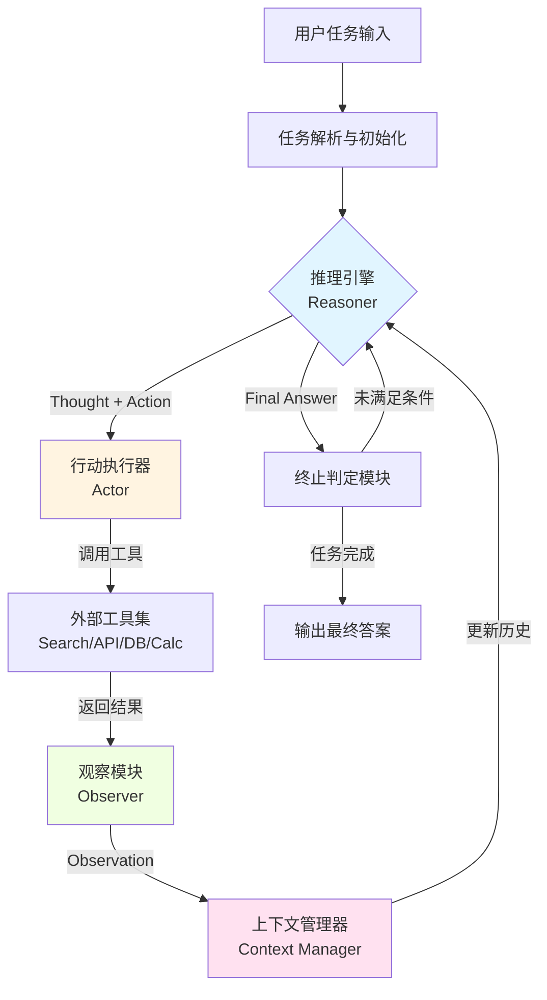
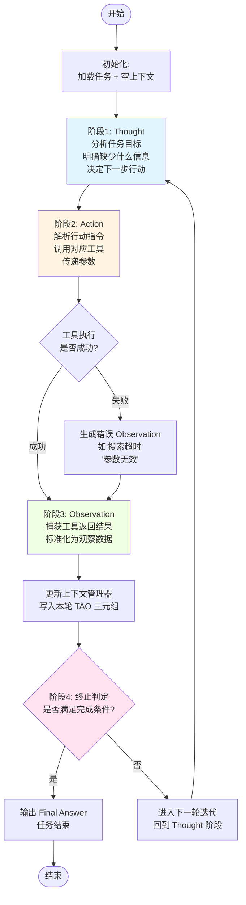
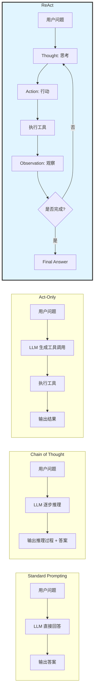
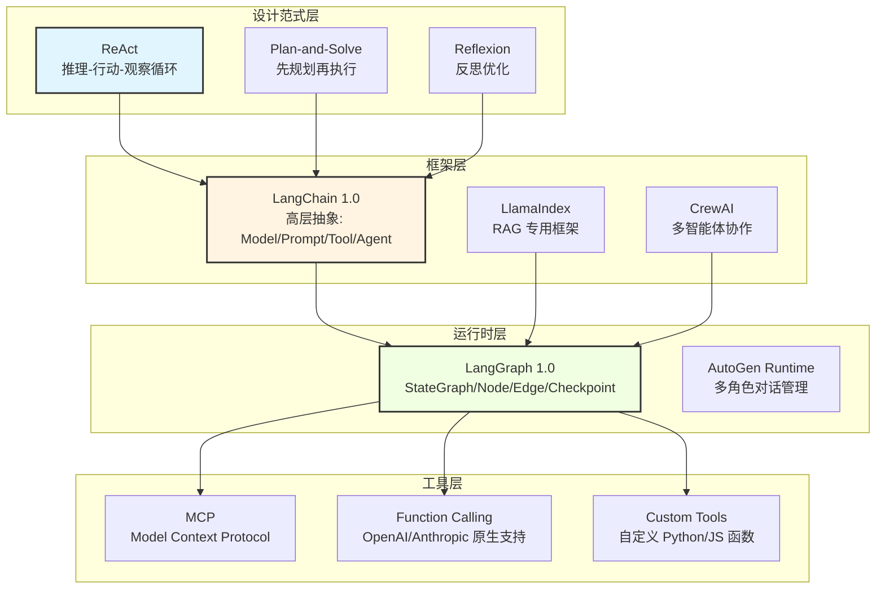
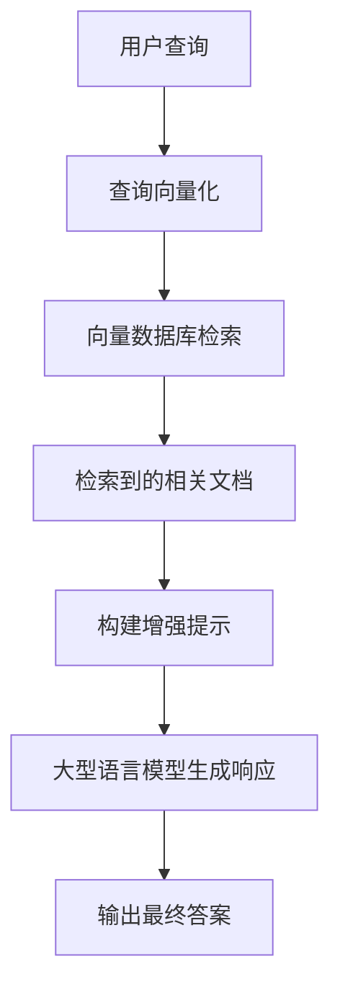

# ReAct 深入理解

## 目录

1. [ReAct 是什么](#1-react-是什么)
2. [ReAct 出现背景和发展历程](#2-react-出现背景和发展历程)
3. [ReAct 核心功能特性](#3-react-核心功能特性)
4. [系统架构与数据流向](#4-系统架构与数据流向)
5. [TAO 循环详解](#5-tao-循环详解)
6. [ReAct 的设计理念](#6-react-的设计理念)
7. [为什么需要 ReAct?](#7-为什么需要-react)
8. [ReAct 与其他框架的对比](#8-react-与其他框架的对比)
9. [ReAct 和 RAG 的联系](#9-react-和-rag-的联系)
10. [ReAct 和 LangChain、LangGraph 的联系与区别](#10-react-和-langchainlanggraph-的联系与区别)
11. [如何实现 ReAct](#11-如何实现-react)
12. [实际项目中 ReAct 的作用](#12-实际项目中-react-的作用)
13. [实战 Demo Case](#13-实战-demo-case)
14. [工程化落地挑战与缺陷处理](#14-工程化落地挑战与缺陷处理)
15. [总结与建议](#15-总结与建议)
16. [参考文献](#16-参考文献)

---

## 1. ReAct 是什么

**ReAct** 是 **Reasoning and Acting**（推理与行动）的缩写，是目前构建 AI 智能体（AI Agent）最核心的框架和设计模式之一。它模拟了人类解决问题的思维方式：**先思考，再行动，最后根据行动结果评估是否需要调整**。

### 核心定义

ReAct 本质上是一种让语言模型通过与外部工具、环境动态交互完成复杂任务的智能体架构范式。其核心目标是打破传统语言模型"输入-输出"的单向链路，构建"**感知-决策-执行-反馈**"的智能闭环，使模型从"被动应答者"升级为"主动问题解决者"。

与传统 AI 技术相比，ReAct 具备三个核心特征：

- **显式推理轨迹**：模型在执行行动前会生成可追溯的"推理过程"（Thought），清晰说明行动的决策依据，解决了传统模型"黑箱决策"的可解释性问题；
- **外部环境锚定**：通过调用搜索、计算、数据库查询等外部工具（Act）获取客观反馈（Observe），将推理过程锚定到真实数据，从根源上抑制"事实幻觉"；
- **少量样本泛化**：依托 LLM 的上下文学习能力，仅需 1-5 个包含"推理-行动-观察"的完整示例，即可快速适配多场景任务，无需大规模微调。

### 核心公式

```
思考（Reason）→ 行动（Act）→ 观察（Observe）→ 再思考 → 再行动...
```

这个循环持续进行，直到任务完成或达到终止条件。

---

## 2. ReAct 出现背景和发展历程

### 2.1 大模型的"缸中之脑"困境

在 ReAct 出现之前，我们通常是怎么使用大模型的？

- **Standard Prompting（标准提示）**：直接问"北京今天穿什么？"模型根据历史数据瞎猜一个温度回答你。（缺点：容易幻觉，缺乏实时信息）
- **Chain of Thought / CoT（思维链）**：在 Prompt 里加一句"请一步步思考"。模型会输出："因为北京现在是冬天，所以天气应该很冷..."（缺点：虽然逻辑变好了，但依然基于旧知识，无法与外部世界交互）
- **Act-Only（纯行动）**：直接让模型输出调用天气的代码。（缺点：缺乏前置思考，一旦报错，模型不知道如何补救）

大语言模型（LLM）本质上是一个"**缸中之脑**"，它被困在服务器里，没有手脚，也无法感知当下真实的世界。为了让它成为真正能干活的 Agent，我们需要赋予它一套行动规划框架。

### 2.2 ReAct 的诞生

2022 年，普林斯顿大学和 Google 联合提出了一篇里程碑式的论文：《[ReAct: Synergizing Reasoning and Acting in Language Models](https://arxiv.org/abs/2210.03629)》。作者发现：如果把"**推理（Reasoning）**"和"**行动（Acting）**"结合起来，大模型的能力会发生质的飞跃。

就像人类解决问题一样：先想一想，做个动作，看看结果，再接着想。

### 2.3 发展历程

- **2022 年**：ReAct 论文发表，提出 TAO（Thought-Action-Observation）循环机制
- **2023 年**：LangChain、LlamaIndex 等框架开始内置 ReAct Agent 实现
- **2024 年**：ReAct 成为 AI Agent 开发的标准范式，广泛应用于客服、数据分析、自动化办公等场景
- **2025 年**：随着 LangChain 1.0 和 LangGraph 1.0 的发布，ReAct 底层运行时更加成熟，支持持久化状态、人机交互（HITL）、多智能体协作等高级特性

---

## 3. ReAct 核心功能特性

### 3.1 动态规划能力

ReAct Agent 不是按照预设的固定流程执行，而是根据当前任务状态和工具返回结果，**动态决定下一步该做什么**。这使得它能够处理复杂、不确定的任务场景。

### 3.2 工具调用能力

Agent 可以调用预定义的外部工具，包括：

- 搜索引擎（Google、Bing、百度等）
- 计算器（数学运算、单位转换）
- API 接口（天气查询、股票行情、航班预订）
- 数据库查询（SQL、向量检索）
- 文件操作（读写、解析、生成）
- 自定义业务逻辑（订单处理、审批流程）

### 3.3 可解释性极强

每一步都有 **Thought** 记录，如果 Agent 出错了，开发者可以立刻看出是"想错了"还是"工具用错了"，极其方便 Debug。

### 3.4 容错能力（Self-Correction）

如果遇到 API 报错，Observation 会返回错误信息。模型在下一轮 Thought 看到错误后，通常会自动调整策略（比如换一个搜索词、重试工具、降级方案）。

### 3.5 少样本学习

通过 Few-shot 示例，Agent 可以快速适应新领域任务，无需重新训练模型。

---

## 4. 系统架构与数据流向

ReAct 框架由 **5 个核心组件**构成，组件间通过"上下文状态"串联，形成闭环：

| 组件 | 核心职责 |
|-----|-----|
| **任务输入模块** | 接收用户原始任务（如"查询 2025 年人工智能顶会 ICML 的举办时间和地点"），标准化任务描述 |
| **推理引擎（Reasoner）** | 核心组件，基于"任务 + 历史上下文 + 观察结果"，输出「思考（Thought）」和「行动指令（Action）」 |
| **行动执行器（Actor）** | 解析推理引擎输出的行动指令，调用外部工具 / 接口（如搜索引擎、数据库、API），执行具体操作 |
| **观察模块（Observer）** | 捕获行动执行结果（工具返回的信息、操作成功 / 失败状态），标准化为"观察结果（Observation）" |
| **上下文管理器** | 存储任务全生命周期的信息：原始任务、每一轮的 Thought/Action/Observation、当前任务状态（未完成 / 完成 / 失败） |
| **终止判定模块** | 基于上下文判断任务是否完成，若完成则输出最终结果；未完成则触发下一轮"推理 - 行动 - 观察" |

### ReAct 架构图



---

## 5. TAO 循环详解

ReAct 的核心是 **TAO（Thought-Action-Observation）循环**，每一轮迭代包含 4 个核心阶段，直到终止条件触发。

### 5.1 TAO 循环流程图



### 5.2 单轮迭代详细拆解

#### 阶段 1：初始化与首轮推理（Thought）

**输入**：原始任务 + 空上下文（首轮无历史信息）

**核心行为**：推理引擎完成 3 件事：

1. 分析任务目标，明确"当前缺少什么信息"
2. 评估"下一步能做什么"（可选行动：调用工具 / 直接回答 / 重试）
3. 给出"为什么选择该行动"的理由（避免无目的行动）

**输出格式**（标准化）：

```
Thought: [对任务的分析+下一步行动的理由]
```

#### 阶段 2：行动执行（Action）

**输入**：推理引擎输出的"行动指令"

**核心行为**：

- 行动执行器解析指令，匹配预设的工具集（如 Search/Calculate/DatabaseQuery）
- 调用对应工具，传递参数（如 `Search: 2025 ICML 举办时间 地点`）
- 捕获工具执行状态（成功 / 失败，如"搜索超时""返回结果为空"）

**输出格式**（标准化）：

```
Action: [ToolName: Param1, Param2,...]
```

> ⚠️ 工具名需提前定义，参数需符合工具调用规范

#### 阶段 3：结果观察（Observation）

**输入**：行动执行器的输出（工具返回结果 / 执行状态）

**核心行为**：

- 观察模块清洗 / 标准化结果（如将网页文本提取为关键信息、将错误状态转为可读描述）
- 把结果写入上下文管理器，更新任务状态

**输出格式**（标准化）：

```
Observation: [工具返回的关键信息/执行状态描述]
```

#### 阶段 4：终止判定与迭代

**输入**：更新后的上下文（含本轮 Thought/Action/Observation + 历史信息）

**核心行为**：

- 终止判定模块校验"是否满足完成条件"（如"信息足够回答任务""行动失败且无法重试"）
- 若满足终止条件：输出最终结果
- 若未满足：回到「阶段 1」，推理引擎基于新上下文生成下一轮 Thought

**终止条件示例**：

- **正向终止**：获取到任务所需的全部信息
- **反向终止**：多次行动失败（如搜索 3 次均无结果）、任务本身无法完成（如"查询 2025 年世界杯举办地"，实际 2025 年无世界杯）
- **最大迭代次数**：设置上限（如最多 5 轮），防止死循环

---

## 6. ReAct 的设计理念

### 6.1 环境锚定原则

强制模型在涉及事实性问题时优先调用外部工具获取证据，禁止仅凭内部知识生成结论。例如在"核查 2024 年诺贝尔物理学奖得主"任务中，模型必须通过搜索工具获取权威信息，而非依赖预训练记忆。

### 6.2 可解释性优先原则

要求推理轨迹必须包含"任务现状-行动目的-预期结果"三个要素，确保人类可追溯决策逻辑。例如推理过程需明确"当前缺少 XX 信息，调用 XX 工具可获取，预期得到 XX 结果"。

### 6.3 模块解耦原则

将推理逻辑、行动执行、循环调度拆分为独立模块，通过标准化接口通信。这种设计使 ReAct 可快速适配不同场景，仅需替换工具集即可从"多跳问答"切换到"机器人控制"。

### 6.4 容错性设计原则

通过异常捕获、行动重试、上下文裁剪等机制处理工具调用失败、格式解析错误等问题，提升系统鲁棒性。例如当搜索工具超时后，模型会生成"搜索失败，尝试更换关键词重新搜索"的推理与行动。

### 6.5 格式约束原则

ReAct 的落地依赖严格的格式约束（避免大模型输出混乱），主流的标准化格式模板如下：

```markdown
# 任务
{用户原始任务}

# 迭代轮次 N
Thought: {本轮推理：分析当前信息、下一步行动的理由}
Action: {ToolName: 参数1, 参数2}
Observation: {行动执行后的结果/状态}

# 迭代轮次 N+1
Thought: {基于上一轮观察结果的新推理}
Action: {新的工具调用指令}
Observation: {新的行动结果}

...

# 终止
Final Answer: {任务的最终答案}
```

---

## 7. 为什么需要 ReAct?

### 7.1 解决传统方法的局限性

| 方法 | 优点 | 缺点 |
|-----|-----|-----|
| **Standard Prompting** | 简单直接 | 容易幻觉，缺乏实时信息 |
| **Chain of Thought (CoT)** | 逻辑更清晰 | 仍基于静态知识，无法与外部交互 |
| **Act-Only** | 可直接调用工具 | 缺乏前置思考，出错后无法自我修正 |
| **ReAct** | 结合推理与行动，可解释性强，容错性好 | Token 消耗较大，延迟较高 |

### 7.2 ReAct vs 其他 Prompting 范式对比图



### 7.3 ReAct 的独特价值

1. **打破"缸中之脑"限制**：赋予 LLM 与真实世界交互的能力
2. **动态适应能力**：可根据工具返回结果调整策略，而非僵化执行
3. **可调试性**：每一步 Thought 都是天然的日志，便于定位问题
4. **通用性**：一套框架可适配多种任务类型（问答、计算、搜索、自动化）

---

## 8. ReAct 与其他框架的对比

### 8.1 概念层级区分

首先需要明确：**ReAct 是一种设计范式（Pattern），而 LangChain/LangGraph 是实现框架（Framework）**。

- **ReAct**：一种智能体设计思想，定义了"推理-行动-观察"的循环机制
- **LangChain**：一个用于构建 LLM 应用的高层框架，内置了 ReAct Agent 的实现
- **LangGraph**：一个底层的有状态工作流编排引擎，LangChain 1.0 的智能体底层运行在 LangGraph 上

### 8.2 技术栈关系图



### 8.3 LangChain vs LangGraph 对比

| 维度 | LangChain 1.0 | LangGraph 1.0 |
|-----|-----|-----|
| **主要定位** | 用于快速原型设计和生产级 LLM 应用的高层智能体框架 | 用于持久、有状态和复杂智能体工作流的底层编排引擎 |
| **架构** | 基于 LCEL 的声明式链式调用 | 基于节点、边和持久状态构建的图运行时 |
| **执行控制** | 抽象化控制，追求简洁 | 细粒度控制，支持自定义分支、重试和检查点 |
| **持久性** | 短暂（Ephemeral）会话 | 跨会话的持久状态和可恢复执行 |
| **集成层级** | 即插即用集成（100+ 模型和 API） | 与 LangChain 1.0 运行时深度集成以执行图 |
| **学习曲线** | 较低，适合初学者和快速迭代 | 中等到高，需要理解状态图和运行时逻辑 |
| **人机交互 (HITL)** | 通过高层封装支持 | 原生支持暂停/恢复及人工验证 |
| **最佳适用场景** | 构建快速原型、聊天机器人、RAG 管道或工具增强型智能体 | 部署长运行、多智能体或人机交互系统 |

> 💡 **关键结论**：LangChain 1.0 的智能体现在后台直接运行在 LangGraph 的运行时（Runtime）上。两者不是替代关系，而是互补关系。

---

## 9. ReAct 和 RAG 的联系

### 9.1 RAG 简介

**RAG（Retrieval-Augmented Generation，检索增强生成）** 是一种结合信息检索与生成式人工智能的技术框架，旨在提升大型语言模型（LLM）的输出准确性和实用性。通过在生成响应前引入外部知识库的信息，RAG 使得模型能够访问训练数据之外的最新或特定领域的知识，无需重新训练模型。

**RAG 工作流程**：



### 9.2 ReAct vs RAG

| 维度 | RAG | ReAct |
|-----|-----|-----|
| **核心目标** | 补充静态知识，减少幻觉 | 动态调用工具，解决多步推理任务 |
| **数据来源** | 预构建的向量数据库/知识库 | 实时 API、搜索引擎、计算器等外部工具 |
| **执行方式** | 单次检索 + 生成 | 多轮 TAO 循环迭代 |
| **适用场景** | 文档问答、知识检索、FAQ | 复杂任务规划、多跳推理、自动化流程 |
| **可解释性** | 中等（可追溯引用来源） | 强（每步 Thought 清晰可见） |

### 9.3 ReAct + RAG 的结合场景

两者可以完美结合：**ReAct Agent 可以调用 RAG 系统作为其工具之一**。

**典型应用场景**：

1. **企业知识库问答助手**：
   - ReAct Agent 接收用户问题
   - 第一轮 Thought：判断是否需要查询内部知识库
   - Action：调用 RAG 检索工具
   - Observation：返回相关文档片段
   - 第二轮 Thought：基于检索结果生成答案
   - Final Answer：输出综合回答

2. **多源信息整合**：
   - ReAct Agent 同时调用 RAG（内部文档）+ 搜索引擎（外部资讯）+ API（实时数据）
   - 通过多轮 TAO 循环整合多方信息，生成全面回答

3. **动态知识更新**：
   - RAG 的知识库可能过时，ReAct Agent 可通过搜索工具获取最新信息
   - 对比内部知识与外部实时数据，做出更准确的判断

---

## 10. ReAct 和 LangChain、LangGraph 的联系与区别

### 10.1 三者关系总结

- **ReAct**：一种智能体设计范式，定义了"推理-行动-观察"的循环机制
- **LangChain**：一个用于构建 LLM 应用的高层框架，内置了 ReAct Agent 的实现
- **LangGraph**：一个底层的有状态工作流编排引擎，LangChain 1.0 的智能体底层运行在 LangGraph 上

### 10.2 LangChain 中的 ReAct 实现

LangChain 提供了开箱即用的 ReAct Agent 创建函数 `create_react_agent`，开发者只需定义工具和 Prompt 模板即可快速搭建 Agent。

**核心组件**：

1. **工具定义**：使用 `@tool` 装饰器将普通函数转换为 Agent 可调用的工具
2. **Prompt 模板**：明确规定 Thought/Action/Observation 格式
3. **AgentExecutor**：驱动 TAO 循环的执行器

### 10.3 LangGraph 的优势

当任务需要以下特性时，应优先考虑使用 LangGraph：

- **持久化状态**：跨会话恢复执行进度（如多日审批流程）
- **复杂分支逻辑**：条件判断、并行执行、循环重试
- **人机交互（HITL）**：在关键节点暂停，等待人工审核后再继续
- **多智能体协作**：多个 Agent 协同完成复杂任务
- **细粒度控制**：自定义节点、边、检查点机制

### 10.4 选型建议

| 场景 | 推荐方案 |
|-----|-----|
| 快速原型、简单工具调用 Agent | LangChain 1.0 `create_agent` |
| 聊天机器人、RAG 管道 | LangChain 1.0 |
| 长运行任务、多阶段审批 | LangGraph 1.0 + Checkpoint |
| 需要人工审核的关键流程 | LangGraph 1.0 + HITL |
| 多智能体协作系统 | LangGraph 1.0 + Subgraph |
| 生产级高可用 Agent | LangChain 1.0（底层基于 LangGraph） |

---

## 11. 如何实现 ReAct

### 11.1 手搓极简 ReAct 引擎

为了理解 ReAct 的本质，我们先用原生 Python 代码手写一个极简 ReAct 引擎（不依赖任何高级 Agent 库）。

#### 步骤 1：定义系统 Prompt

```python
system_prompt = """
你是一个聪明的 AI 助手，你可以通过遵循以下格式来解决用户的问题。
你必须严格按照这三个步骤循环：

Thought: 思考你需要做什么
Action: 执行具体的动作，必须是如下格式：函数名(参数)
Observation: 观察动作的结果

你可以使用的工具有：
1. calculate(expression: str): 计算数学表达式，例如 calculate("2 + 2")
2. search_weather(city: str): 查询城市天气，例如 search_weather("北京")

当你得到了最终答案，请使用以下格式结束：
Thought: 我已经知道了最终答案
Action: Finish("你的最终回答")
"""
```

#### 步骤 2：模拟外部工具（Tools）

```python
def calculate(expression):
    try:
        return str(eval(expression))
    except Exception as e:
        return f"计算错误: {e}"

def search_weather(city):
    # 这里模拟调用天气 API
    weather_data = {
        "北京": "晴，-2度",
        "上海": "小雨，10度",
        "广州": "阴，20度"
    }
    return weather_data.get(city, "未知天气信息")

# 工具路由字典
tools_map = {
    "calculate": calculate,
    "search_weather": search_weather
}
```

#### 步骤 3：实现 ReAct 循环控制引擎

```python
import openai
import re

client = openai.Client(api_key="your_api_key")

def react_agent(query):
    # 初始化历史对话记录
    messages = [
        {"role": "system", "content": system_prompt},
        {"role": "user", "content": query}
    ]
    
    max_iterations = 5  # 防止死循环的保险丝
    
    for i in range(max_iterations):
        print(f"\n--- 第 {i+1} 轮思考 ---")
        
        # 1. 让 LLM 输出 Thought 和 Action
        response = client.chat.completions.create(
            model="gpt-4",
            messages=messages,
            stop=["Observation:"]  # 核心技巧：一旦 LLM 准备输出 Observation，就立刻停住！
        )
        llm_output = response.choices[0].message.content.strip()
        print(llm_output)
        messages.append({"role": "assistant", "content": llm_output})
        
        # 2. 解析 Action（使用正则提取工具名和参数）
        if "Finish" in llm_output:
            final_answer = re.search(r'Finish\("(.*?)"\)', llm_output, re.S)
            print("\n🎉 任务完成：", final_answer.group(1) if final_answer else llm_output)
            break
        
        action_match = re.search(r'Action:\s*(\w+)\((.*?)\)', llm_output)
        if action_match:
            func_name = action_match.group(1)
            arg_str = action_match.group(2).strip('"\'')
            
            # 3. 执行工具，生成 Observation
            print(f"🔧 系统拦截到动作，执行工具：[{func_name}] 参数：[{arg_str}]")
            if func_name in tools_map:
                obs_result = tools_map[func_name](arg_str)
            else:
                obs_result = "错误：找不到该工具"
            
            observation = f"\nObservation: {obs_result}"
            print(observation)
            
            # 4. 把 Observation 加入上下文，进入下一轮
            messages.append({"role": "user", "content": observation})
        else:
            print("解析 Action 失败，要求重试...")
            messages.append({"role": "user", "content": "请严格遵循 Thought 和 Action 格式"})

# 测试我们手搓的 Agent
react_agent("北京的天气怎么样？如果温度加上25度是多少？")
```

#### 运行过程全解析

```
--- 第 1 轮思考 ---
Thought: 用户问了两个问题，第一个是北京的天气，我需要先查一下北京天气。
Action: search_weather("北京")
🔧 系统拦截到动作，执行工具：[search_weather] 参数：[北京]
Observation: 晴，-2度

--- 第 2 轮思考 ---
Thought: 刚才查到了北京气温是-2度。第二个问题是温度加上25度是多少。我需要计算 -2 + 25。
Action: calculate("-2 + 25")
🔧 系统拦截到动作，执行工具：[calculate] 参数：[-2 + 25]
Observation: 23

--- 第 3 轮思考 ---
Thought: 我已经计算出了结果，可以回答用户了。
Action: Finish("北京今天是晴天，气温-2度。将温度加上25度后的结果是23度。")
🎉 任务完成：北京今天是晴天，气温-2度。将温度加上25度后的结果是23度。
```

> 💡 **划重点**：注意代码中的 `stop=["Observation:"]`。这是一个非常关键的 Trick。如果不加这个，LLM 可能会自言自语，连带把伪造的观察结果也一起输出（即幻觉）。通过 Stop 参数，我们在它"准备看结果"的那一刹那打断它，让真实的程序接管工具调用，再把真实的观测塞回去。

### 11.2 使用 LangChain 实现 ReAct

#### 项目结构

```
react-agent-demo/
├── tools.py      # 工具定义
├── agent.py      # Agent 配置
├── main.py       # 入口程序
└── .env          # 环境变量配置
```

#### 工具定义（tools.py）

```python
from langchain_core.tools import tool

@tool
def calculate(expression: str) -> float:
    """执行计算并返回结果 - 使用 Python 语法,必要时请使用浮点数语法"""
    return eval(expression)

@tool
def ask_fruit_unit_price(fruit: str) -> str:
    """询问水果的价格"""
    fruit = fruit.strip()
    if fruit.casefold() in ["apple", "苹果"]:
        return "苹果单价是 10元/公斤"
    if fruit.casefold() in ["banana", "香蕉"]:
        return "香蕉单价是 6元/公斤"
    return f"{fruit} 单价是 20元/公斤"
```

> ⚠️ **安全警告**：生产环境千万别直接用 `eval`！这里只是演示用。实际项目建议用 `ast.literal_eval` 或者专门的数学表达式解析库，否则会被注入恶意代码。

#### Agent 配置（agent.py）

```python
import os
import dotenv
from langchain.agents import AgentExecutor, create_react_agent
from langchain_core.prompts import PromptTemplate
from langchain_openai import ChatOpenAI
from tools import calculate, ask_fruit_unit_price

# ReAct Prompt 模板
prompt = PromptTemplate.from_template('''Answer the following questions as best you can. You have access to the following tools:
{tools}
Use the following format:
Question: the input question you must answer
Thought: you should always think about what to do
Action: the action to take, should be one of [{tool_names}]
Action Input: the input to the action
Observation: the result of the action
... (this Thought/Action/Action Input/Observation can repeat N times)
Thought: I now know the final answer
Final Answer: the final answer to the original input question
Begin!
Question: {input}
Thought:{agent_scratchpad}''')

def create_agent() -> AgentExecutor:
    """创建 ReAct Agent 执行器"""
    dotenv.load_dotenv()
    
    llm = ChatOpenAI(
        openai_api_key=os.getenv("OPENAI_API_KEY"),
        openai_api_base=os.getenv("OPENAI_API_BASE"),
        model=os.getenv("AI_MODEL", "deepseek-chat"),
        temperature=0.1,  # 推理场景使用低 temperature 保证确定性
    )
    
    tools = [calculate, ask_fruit_unit_price]
    agent = create_react_agent(llm=llm, tools=tools, prompt=prompt)
    
    return AgentExecutor(
        agent=agent,
        tools=tools,
        verbose=True  # 打印详细执行过程
    )
```

#### 入口程序（main.py）

```python
from agent import create_agent

if __name__ == '__main__':
    # 创建 Agent
    agent = create_agent()
    
    # 执行 Agent
    result = agent.invoke({
        "input": "3公斤苹果和2公斤香蕉的总价格是多少?"
    })
    
    # 打印结果
    print(result)
```

#### 运行效果

```
> Entering new AgentExecutor chain...
我需要计算总价格。首先，我应该找到苹果和香蕉的单价。

Thought: 我需要找到苹果的单价
Action: ask_fruit_unit_price
Action Input: 苹果
Observation: 苹果单价是 10元/公斤

Thought: 现在我需要找到香蕉的单价
Action: ask_fruit_unit_price
Action Input: 香蕉
Observation: 香蕉单价是 6元/公斤

Thought: 我已经知道了两种水果的价格。苹果是10元/公斤，香蕉是6元/公斤。现在我需要计算总成本：3公斤苹果和2公斤香蕉。
Action: calculate
Action Input: 3 * 10 + 2 * 6
Observation: 42

Thought: 我现在知道最终答案了
Final Answer: 3公斤苹果和2公斤香蕉的总价格是42元。

> Finished chain.
{'input': '3公斤苹果和2公斤香蕉的总价格是多少?', 'output': '3公斤苹果和2公斤香蕉的总价格是42元。'}
```

---

## 12. 实际项目中 ReAct 的作用

### 12.1 客服自动查询系统

**场景**：用户咨询订单状态、物流信息、退款进度

**ReAct Agent 工作流程**：

1. **Thought**：用户想查询订单状态，需要调用订单查询 API
2. **Action**：调用 `query_order(order_id="12345")`
3. **Observation**：返回订单详情（已发货、物流单号 SF123456789）
4. **Thought**：用户可能还想知道物流进度，调用物流查询 API
5. **Action**：调用 `query_logistics(tracking_no="SF123456789")`
6. **Observation**：返回物流轨迹（已到达北京分拣中心）
7. **Final Answer**：综合回答用户

**价值**：减少人工客服工作量 70%，响应速度从分钟级降至秒级

### 12.2 数据分析助手

**场景**：业务人员提问"上个月销售额最高的前 5 个产品是什么？"

**ReAct Agent 工作流程**：

1. **Thought**：需要查询数据库获取销售数据
2. **Action**：调用 `execute_sql("SELECT product_name, SUM(sales) FROM orders WHERE date >= '2025-06-01' AND date <= '2025-06-30' GROUP BY product_name ORDER BY SUM(sales) DESC LIMIT 5")`
3. **Observation**：返回 SQL 查询结果（表格数据）
4. **Thought**：数据已获取，可以生成可视化图表
5. **Action**：调用 `generate_chart(data=..., type="bar")`
6. **Observation**：返回图表 URL
7. **Final Answer**：输出文字总结 + 图表链接

**价值**：业务人员无需写 SQL，自然语言即可获取数据洞察

### 12.3 自动化办公助手

**场景**：用户说"帮我整理上周的会议纪要，并发给参会人"

**ReAct Agent 工作流程**：

1. **Thought**：需要从会议录音中提取纪要
2. **Action**：调用 `transcribe_audio(file_path="/recordings/meeting_20250701.mp3")`
3. **Observation**：返回逐字稿文本
4. **Thought**：需要总结关键决策和行动项
5. **Action**：调用 `summarize_text(text=..., focus="decisions,action_items")`
6. **Observation**：返回结构化纪要
7. **Thought**：需要获取参会人邮箱
8. **Action**：调用 `get_meeting_participants(meeting_id="MTG001")`
9. **Observation**：返回参会人列表及邮箱
10. **Action**：调用 `send_email(recipients=[...], subject="会议纪要", body=...)`
11. **Final Answer**：告知用户邮件已发送

**价值**：将原本需要 30 分钟的手动操作压缩至 2 分钟自动化完成

### 12.4 智能投研助手

**场景**：投资经理问"分析一下宁德时代最近的股价走势和机构评级"

**ReAct Agent 工作流程**：

1. **Thought**：需要获取宁德时代最新股价数据
2. **Action**：调用 `get_stock_price(symbol="300750.SZ", period="1M")`
3. **Observation**：返回近 1 个月股价数据（开盘价、收盘价、涨跌幅）
4. **Thought**：需要查询最近机构研报
5. **Action**：调用 `search_news(keyword="宁德时代 机构评级", source="券商研报")`
6. **Observation**：返回 5 篇最新研报摘要
7. **Thought**：需要对比行业竞品表现
8. **Action**：调用 `compare_stocks(symbols=["300750.SZ", "002594.SZ", "600438.SH"])`
9. **Observation**：返回比亚迪、隆基绿能的同期表现对比
10. **Final Answer**：综合生成投资分析报告

**价值**：将原本需要数小时的研究工作压缩至几分钟，提升投资决策效率

---

## 13. 实战 Demo Case

### 13.1 案例背景

构建一个**智能旅行规划助手**，能够根据用户需求查询航班、酒店、景点信息，并生成完整行程。

### 13.2 工具集定义

```python
from langchain_core.tools import tool

@tool
def search_flights(origin: str, destination: str, date: str) -> str:
    """查询航班信息
    Args:
        origin: 出发城市
        destination: 目的地城市
        date: 出发日期 (YYYY-MM-DD)
    Returns:
        航班列表（包含航班号、起飞时间、到达时间、价格）
    """
    # 模拟 API 调用
    return f"查询到 {origin} 到 {destination} {date} 的航班：CA1234 (08:00-10:30, ¥800), MU5678 (14:00-16:30, ¥750)"

@tool
def search_hotels(city: str, check_in: str, check_out: str) -> str:
    """查询酒店信息
    Args:
        city: 城市名称
        check_in: 入住日期
        check_out: 退房日期
    Returns:
        酒店列表（包含酒店名、评分、价格）
    """
    return f"查询到 {city} 的酒店：希尔顿 (4.8星, ¥600/晚), 如家 (4.2星, ¥300/晚)"

@tool
def search_attractions(city: str) -> str:
    """查询景点信息
    Args:
        city: 城市名称
    Returns:
        景点列表（包含景点名、门票、开放时间）
    """
    attractions = {
        "北京": "故宫 (¥60, 08:30-17:00), 长城 (¥45, 06:30-18:00)",
        "上海": "外滩 (免费, 全天开放), 东方明珠 (¥180, 08:00-21:30)"
    }
    return attractions.get(city, "未找到相关景点")

@tool
def calculate_budget(flight_price: float, hotel_price_per_night: float, nights: int, attraction_tickets: float) -> float:
    """计算旅行总预算
    Args:
        flight_price: 机票价格
        hotel_price_per_night: 每晚酒店价格
        nights: 住宿天数
        attraction_tickets: 景点门票总价
    Returns:
        总预算
    """
    total = flight_price + (hotel_price_per_night * nights) + attraction_tickets
    return total
```

### 13.3 Prompt 模板设计

```python
from langchain_core.prompts import PromptTemplate

prompt = PromptTemplate.from_template('''你是一个专业的旅行规划助手。你可以帮助用户查询航班、酒店、景点信息，并计算旅行预算。

你可以使用的工具：
{tools}

请按照以下格式进行思考和行动：

Question: 用户的问题
Thought: 你应该始终思考下一步该做什么
Action: 要采取的行动，应该是以下之一：[{tool_names}]
Action Input: 行动的输入参数
Observation: 行动的结果
... (这个 Thought/Action/Action Input/Observation 可以重复 N 次)
Thought: 我现在知道最终答案了
Final Answer: 对原始问题的最终回答

开始！

Question: {input}
Thought:{agent_scratchpad}''')
```

### 13.4 Agent 执行示例

**用户问题**："我想下周一从北京去上海玩 3 天，帮我规划一下行程和预算"

**Agent 执行过程**：

```
> Entering new AgentExecutor chain...

Thought: 用户想从北京去上海玩 3 天，下周一出发。我需要先查询航班信息。假设下周一是 2025-07-07。
Action: search_flights
Action Input: {"origin": "北京", "destination": "上海", "date": "2025-07-07"}
Observation: 查询到 北京 到 上海 2025-07-07 的航班：CA1234 (08:00-10:30, ¥800), MU5678 (14:00-16:30, ¥750)

Thought: 已获取航班信息。接下来需要查询上海的酒店，用户玩 3 天，所以需要住 2 晚（7月7日入住，7月9日退房）。
Action: search_hotels
Action Input: {"city": "上海", "check_in": "2025-07-07", "check_out": "2025-07-09"}
Observation: 查询到 上海 的酒店：希尔顿 (4.8星, ¥600/晚), 如家 (4.2星, ¥300/晚)

Thought: 已获取酒店信息。接下来需要查询上海的景点，为用户推荐游玩路线。
Action: search_attractions
Action Input: {"city": "上海"}
Observation: 查询到 上海 的景点：外滩 (免费, 全天开放), 东方明珠 (¥180, 08:00-21:30)

Thought: 已获取所有必要信息。现在需要计算预算。选择较便宜的航班 MU5678 (¥750)，中等档次酒店如家 (¥300/晚 × 2晚 = ¥600)，景点门票假设只去东方明珠 (¥180)。
Action: calculate_budget
Action Input: {"flight_price": 750, "hotel_price_per_night": 300, "nights": 2, "attraction_tickets": 180}
Observation: 1530.0

Thought: 我现在知道最终答案了，可以生成完整的旅行规划。
Final Answer: 
## 北京 → 上海 3天旅行规划

### 📅 行程安排
- **出发日期**：2025-07-07（下周一）
- **返程日期**：2025-07-09（周三）

### ✈️ 航班推荐
- **MU5678**：14:00 北京起飞 - 16:30 上海到达，票价 ¥750

### 🏨 酒店推荐
- **如家酒店**：4.2星，¥300/晚 × 2晚 = ¥600

### 🎡 景点推荐
- **外滩**：免费，全天开放（建议傍晚前往欣赏夜景）
- **东方明珠**：¥180，08:00-21:30（建议白天登塔观景）

### 💰 预算估算
- 机票：¥750
- 酒店：¥600（2晚）
- 景点门票：¥180
- **总计：¥1530**

祝您旅途愉快！
```

### 13.5 关键要点总结

1. **工具描述要清晰**：每个工具的 docstring 必须准确描述功能、参数、返回值，这是 Agent 正确调用工具的关键
2. **Prompt 模板要规范**：明确规定 Thought/Action/Observation 格式，避免模型输出混乱
3. **Temperature 设置要低**：推理场景建议使用 0.1-0.2，保证确定性
4. **设置最大迭代次数**：防止死循环消耗大量 Token
5. **Verbose 模式便于调试**：开发阶段开启，生产环境关闭

---

## 14. 工程化落地挑战与缺陷处理

### 14.1 ReAct 的主要缺陷

#### 1. Token 消耗巨大

**问题**：每一轮都要把之前所有的 Thought、Action、Observation 历史作为 Prompt 传进去。如果任务需要十几个步骤，上下文会迅速膨胀，既贵又慢。

**解决方案**：

- **上下文裁剪**：只保留关键信息（每轮的核心 Thought 和有效 Observation），丢弃冗余内容
- **摘要压缩**：每隔 N 轮对历史对话进行摘要，用摘要替代完整历史
- **分层记忆**：短期记忆保留完整 TAO 三元组，长期记忆仅保留关键结论

#### 2. 陷入死循环

**问题**：对于弱智一点的模型（或者小参数模型），可能会出现反复调用同一个工具，或者在 Action 和 Observation 之间来回震荡"死机"的情况。

**解决方案**：

- **最大迭代次数限制**：设置上限（如 5-10 轮），超过则强制终止
- **重复检测**：检测是否连续 3 轮调用同一工具且参数相同，若是则触发降级策略
- **超时熔断**：单次工具调用超过阈值时间（如 30 秒）则判定失败

#### 3. 缺乏宏观规划

**问题**：ReAct 偏向于"走一步看一步"。对于需要拆解为几十个子任务的超级复杂目标，它容易"迷失方向"。

**解决方案**：

- **Plan-and-Solve 结合**：先让模型生成整体计划（Plan），再按步骤执行（Solve）
- **子任务分解**：将大任务拆分为多个独立的子任务，分别由不同的 Agent 处理
- **Hierarchical ReAct**：高层 Agent 负责任务分解，底层 Agent 负责具体执行

#### 4. 工具调用失败率高

**问题**：模型可能生成错误的工具名、参数格式不对、参数类型不匹配等。

**解决方案**：

- **严格的 Schema 校验**：使用 Pydantic 定义工具参数类型，自动校验
- **Few-shot 示例**：在 Prompt 中提供 2-3 个正确的工具调用示例
- **错误反馈机制**：当工具调用失败时，Observation 返回详细错误信息，引导模型修正

#### 5. 延迟较高

**问题**：多轮 TAO 循环意味着多次 LLM 调用，每次调用可能需要几秒，累积起来用户体验较差。

**解决方案**：

- **流式输出**：实时展示 Thought/Action/Observation，让用户感知进度
- **并行工具调用**：如果多个工具调用无依赖关系，可并行执行
- **缓存机制**：对常见查询结果进行缓存，避免重复调用

### 14.2 生产级最佳实践

#### 1. 监控与可观测性

- **日志记录**：记录每一轮的 Thought/Action/Observation，便于事后审计
- **指标监控**：跟踪平均迭代次数、Token 消耗、工具调用成功率、响应时间
- **异常告警**：当死循环率、失败率超过阈值时触发告警

#### 2. 成本控制

- **Token 预算**：为每个任务设置最大 Token 消耗上限
- **模型分级**：简单任务用小模型（如 DeepSeek-V2-Lite），复杂任务用大模型（如 GPT-4）
- **预检机制**：在执行前预估 Token 消耗，超出预算则拒绝执行或降级方案

#### 3. 安全防护

- **工具权限隔离**：敏感工具（如数据库写入、文件删除）需要额外鉴权
- **输入 sanitization**：对用户输入和工具参数进行清洗，防止注入攻击
- **沙箱执行**：在隔离环境中执行不可信的工具调用

#### 4. 用户体验优化

- **进度提示**：实时展示当前执行到哪一步（"正在查询航班..."、"正在计算预算..."）
- **中断恢复**：支持用户中途取消，下次可从断点继续
- **人工介入**：在关键决策点允许用户确认或修改 Agent 的选择

---

## 14.5 Agent 设计范式全景对比：ReAct、Plan-and-Solve、Reflection、Multi-Agent

在 ReAct 之后,AI Agent 领域涌现出多种设计范式,每种范式针对不同的任务场景和痛点进行了优化。本节将系统对比四种主流范式:ReAct、Plan-and-Solve、Reflection(反思)和 Multi-Agent(多智能体)。

### 14.5.1 四种范式的核心思想

#### ReAct(Reasoning + Acting):边思考边行动

**核心逻辑**:思考→行动→观察→循环

ReAct 像侦探查案——根据现场线索(观察)动态调整调查方向(思考),每一步行动都依赖上一步的反馈,边做边调整。

**形式化表达**:
```
(th_t, a_t) = π(q, (a_1, o_1), ..., (a_{t-1}, o_{t-1}))
o_t = T(a_t)
```

其中 `th_t` 是第 t 步的思考,`a_t` 是行动,`π` 是 LLM 决策策略,`q` 是用户问题,`(a_i, o_i)` 是历史轨迹,`T` 是工具执行函数,`o_t` 是观察结果。

**通俗示例**:
```
用户问:"华为最新手机是什么?卖点是什么?"
t=1: Thought="需搜索华为最新机型", Action=Search["华为最新手机"]
     Observation="Mate 70 和 Pura 80 Pro+,主打全焦段摄影"
t=2: Thought="已获取足够信息", Action=Finish["最终答案"]
```

#### Plan-and-Solve(规划求解):先规划后执行

**核心逻辑**:规划→执行(分步骤)

Plan-and-Solve 像建筑师建房——先画完整蓝图(规划),再严格按图纸施工(执行),不轻易偏离预设步骤。

**形式化表达**:
```
P = π_plan(q)                          # 规划阶段
s_i = π_solve(q, P, (s_1, ..., s_{i-1}))  # 执行阶段
```

其中 `P` 是行动计划(步骤列表),`π_plan` 是规划策略,`s_i` 是第 i 步的执行结果,`π_solve` 是执行策略。

**通俗示例**:
```
用户问:"周一卖15个苹果,周二是周一的2倍,周三比周二少5个,三天共卖多少?"
规划阶段:P=["计算周二销量:15×2", "计算周三销量:周二-5", "计算总销量:15+周二+周三"]
执行阶段:s₁=30, s₂=25, s₃=70
最终答案:70
```

#### Reflection(反思优化):先完成再反思

**核心逻辑**:执行→反思→优化→迭代

Reflection 像作家改稿——先写初稿(执行),再自我审阅(反思),根据问题优化(优化),反复迭代直到满意。

**形式化表达**:
```
F_i = π_reflect(Task, O_i)             # 反思阶段
O_{i+1} = π_refine(Task, O_i, F_i)    # 优化阶段
```

其中 `O_i` 是第 i 轮的执行结果,`F_i` 是反思反馈,`π_reflect` 是反思策略,`π_refine` 是优化策略。

**通俗示例**:
```
任务:"编写查找1到n素数的Python函数"
O₀:试除法代码(时间复杂度O(n√n))
F₀:"效率低,建议用埃拉托斯特尼筛法O(n log log n)"
O₁:筛法代码(优化后)
F₁:"已最优,无需改进"
最终结果:O₁
```

#### Multi-Agent(多智能体):分工协作

**核心逻辑**:角色分工→协同执行→结果整合

Multi-Agent 像团队作战——不同专业角色的 Agent 各司其职,通过消息传递或共享状态协同完成复杂任务。

**三种协作模式**:

1. **层级协作(Hierarchical)**:Orchestrator 分解任务,子 Agent 并行执行
2. **对等协作(Peer-to-Peer)**:多个 Agent 通过消息总线协商决策
3. **流水线协作(Pipeline)**:Agent A → Agent B → Agent C 顺序处理

**通俗示例**:
```
任务:"撰写AI Agent技术文章"
Researcher Agent:研究最新架构趋势 → 输出调研报告
Writer Agent:基于报告撰写文章 → 输出初稿
Reviewer Agent:审核并优化内容 → 输出终稿
```

### 14.5.2 四种范式对比表

| 维度 | ReAct | Plan-and-Solve | Reflection | Multi-Agent |
|-----|-----|-----|-----|-----|
| **核心思想** | 边想边做 | 先规划后执行 | 先完成再反思 | 分工协作 |
| **灵活性** | ⭐⭐⭐⭐⭐ 高 | ⭐⭐⭐ 中 | ⭐⭐⭐ 中 | ⭐⭐⭐⭐ 高 |
| **准确率** | ⭐⭐⭐ 中 | ⭐⭐⭐⭐ 中高 | ⭐⭐⭐⭐⭐ 高 | ⭐⭐⭐⭐ 高 |
| **成本** | ⭐⭐⭐⭐ 低 | ⭐⭐⭐ 中 | ⭐⭐ 高 | ⭐ 很高 |
| **复杂任务能力** | ⭐⭐⭐ 中 | ⭐⭐⭐⭐ 高 | ⭐⭐⭐⭐ 高 | ⭐⭐⭐⭐⭐ 极高 |
| **工具调用** | ⭐⭐⭐⭐⭐ 强 | ⭐⭐⭐ 中 | ⭐⭐⭐ 中 | ⭐⭐⭐⭐ 强 |
| **可解释性** | ⭐⭐⭐⭐⭐ 极强 | ⭐⭐⭐⭐ 强 | ⭐⭐⭐⭐ 强 | ⭐⭐⭐ 中 |
| **延迟** | ⭐⭐⭐ 中 | ⭐⭐⭐⭐ 较低 | ⭐⭐ 高 | ⭐ 很高 |
| **实现难度** | ⭐⭐⭐⭐ 简单 | ⭐⭐⭐ 中等 | ⭐⭐⭐ 中等 | ⭐ 困难 |

### 14.5.3 适用场景与选型建议

#### ReAct 适用场景

✅ **适合**:
- 需要调用外部工具获取实时信息(天气、股票、新闻)
- 任务不确定性高,需要根据反馈动态调整
- 中等复杂度任务(3-10 步即可完成)
- 对可解释性要求高,便于调试

❌ **不适合**:
- 超复杂任务(>20 步,容易迷失方向)
- 对延迟极度敏感的场景
- 成本极度受限的场景

**典型案例**:客服自动查询、数据分析助手、旅行规划

#### Plan-and-Solve 适用场景

✅ **适合**:
- 结构化任务,流程清晰(数学题、代码生成)
- 需要全局视角,避免走一步看一步
- 长文写作、项目规划、学术研究
- 软件工程、流程化任务

❌ **不适合**:
- 高度不确定性的探索型任务
- 需要频繁动态调整的场景
- 计划错误会导致全盘失败的风险场景

**典型案例**:代码审查 Agent、技术调研报告、数学推理

#### Reflection 适用场景

✅ **适合**:
- 高质量要求任务(代码生成、学术写作)
- 需要精准输出,减少幻觉和逻辑错误
- 可以接受较高成本和延迟的场景
- 有明确评判标准的任务(单元测试、语法检查)

❌ **不适合**:
- 成本敏感的场景(Token 消耗翻倍)
- 对延迟要求高的实时交互
- 缺乏明确评判标准的开放性任务

**典型案例**:Claude Code(写代码→测试→修复)、学术论文润色、数学计算验证

#### Multi-Agent 适用场景

✅ **适合**:
- 超复杂任务,单一 Agent 能力边界不足
- 需要多领域专业知识协同
- 长运行任务,上下文窗口溢出风险高
- 需要容错和负载均衡的生产级系统

❌ **不适合**:
- 简单任务(杀鸡用牛刀)
- 成本极度敏感的场景
- 协调开销大于收益的小团队

**典型案例**:CrewAI 多角色协作、AutoGen 对话式多 Agent、企业级自动化工作流

### 14.5.4 融合范式:当前最佳实践

现实中的先进 Agent 很少只采用一种范式,通常会融合多种范式形成闭环架构:

```
Plan ↓ ReAct ↓ Reflection
```

**典型融合架构**:

1. **Claude Code**:
   - Plan:分析用户需求,生成编码计划
   - ReAct:按步骤执行编码,调用工具(文件读写、终端命令)
   - Reflection:运行测试,分析报错,修复代码

2. **OpenManus**:
   - Plan:拆解复杂任务为子任务
   - ReAct:执行每个子任务,调用工具
   - Reflection:检查结果质量,必要时重新执行

3. **Deep Research**:
   - Plan:规划调研框架,确定信息来源
   - ReAct:搜索资料,交叉验证
   - Reflection:反思补充遗漏,输出报告

**融合优势**:
- Plan 提供全局视角,避免 ReAct 的短视
- ReAct 提供动态适应能力,弥补 Plan 的僵化
- Reflection 提供质量保证,纠正前两者的错误

### 14.5.5 未来演进方向

从单智能体向多智能体演化是当前主要趋势:

1. **Self-Evolving Agent(自我进化智能体)**:
   - 自动发现问题
   - 自动学习经验
   - 自动优化 Prompt 和工具集

2. **Agent Operating System(智能体操作系统)**:
   - 类似 Windows/Linux 的 Agent 版 OS
   - 用户只需提出需求,Agent 自动完成所有操作
   - 内置工具生态、权限管理、资源调度

3. **标准化协议普及**:
   - MCP(Model Context Protocol)统一工具接口
   - A2A(Agent-to-Agent)协议规范多 Agent 通信
   - 降低集成成本,促进生态繁荣

---

## 15. 总结与建议

### 15.1 ReAct 的核心价值

ReAct 本质上并不是什么高深晦涩的算法底层，而是一种巧妙的 **Prompt 提示工程结构 + 程序循环控制**。它巧妙地利用了 LLM 强大的文本推理能力，将其与外部真实世界搭起了一座桥梁。

**三大核心价值**：

1. **可解释性**：每一步 Thought 都是天然的日志，便于调试和优化
2. **动态适应**：可根据工具返回结果调整策略，而非僵化执行
3. **通用性**：一套框架可适配多种任务类型（问答、计算、搜索、自动化）

### 15.2 适用场景判断

**适合使用 ReAct 的场景**：

- ✅ 需要调用外部工具获取实时信息（天气、股票、新闻）
- ✅ 任务需要多步推理，且每步依赖上一步结果
- ✅ 需要高可解释性，便于调试和审计
- ✅ 任务复杂度中等（3-10 步即可完成）

**不适合使用 ReAct 的场景**：

- ❌ 简单的单步问答（直接用 Standard Prompting 或 CoT）
- ❌ 超复杂任务（>20 步，应考虑 Plan-and-Solve 或多 Agent 协作）
- ❌ 对延迟极度敏感的场景（ReAct 多轮调用导致响应慢）
- ❌ 成本极度受限的场景（Token 消耗较大）

### 15.3 技术选型建议

| 需求 | 推荐方案 |
|-----|-----|
| 快速原型、PoC 验证 | LangChain 1.0 `create_agent` |
| 生产级简单 Agent | LangChain 1.0（底层基于 LangGraph） |
| 长运行、持久化状态 | LangGraph 1.0 + Checkpoint |
| 需要人工审核 | LangGraph 1.0 + HITL |
| 多智能体协作 | LangGraph 1.0 + Subgraph / CrewAI |
| 企业级知识库问答 | ReAct + RAG 结合 |

### 15.4 学习路径建议

1. **理解原理**：先手搓一个极简 ReAct 引擎，理解 TAO 循环本质
2. **熟悉框架**：学习 LangChain 的 `@tool` 装饰器、Prompt 模板、AgentExecutor
3. **实战练习**：从简单工具调用开始（计算器、天气查询），逐步增加复杂度
4. **深入优化**：学习上下文管理、错误处理、成本控制、监控告警
5. **进阶探索**：研究 Plan-and-Solve、Reflexion、Multi-Agent 等高级范式

### 15.5 未来展望

ReAct 作为 AI Agent 的基础范式，仍在不断演进：

- **多模态 ReAct**：支持图像、音频、视频等多模态工具的调用
- **自主学习能力**：Agent 能够从历史执行记录中学习，优化工具调用策略
- **标准化协议**：MCP（Model Context Protocol）等标准协议的普及，使工具集成更加统一
- **端侧部署**：随着小模型能力提升，ReAct Agent 有望在本地设备运行，保护隐私

关于 AI Agent 的探索才刚刚开始。从 ReAct 出发，未来我们还有 Multi-Agent（多智能体协同）、Plan-and-Execute、Reflexion 等等更有趣的架构。

---

## 16. 参考文献

### 学术论文

1. Yao, S., et al. (2022). [ReAct: Synergizing Reasoning and Acting in Language Models](https://arxiv.org/abs/2210.03629). arXiv preprint arXiv:2210.03629.
2. Wei, J., et al. (2022). [Chain-of-Thought Prompting Elicits Reasoning in Large Language Models](https://arxiv.org/abs/2201.11903). NeurIPS 2022.

### 技术文档

3. [LangChain 官方文档 - Agents](https://python.langchain.com/docs/concepts/agents/)
4. [LangGraph 官方文档](https://langchain-ai.github.io/langgraph/)
5. [Prompt Engineering Guide - ReAct Technique](https://www.promptingguide.ai/zh/techniques/react)

### 博客文章

6. [AI Agent 核心原理解析：一文看懂 ReAct 规划框架](https://juejin.cn/post/7615063403867357199)
7. [ReAct大模型智能体交互范式:从原理到实践的完整指南](https://blog.csdn.net/CSDN_430422/article/details/156647882)
8. [Agent全面爆发！一文搞懂背后的核心范式ReAct！](https://cloud.tencent.com/developer/article/2608465)
9. [2025年LangChain与LangGraph终极对比：从高层框架到底层运行时](https://blog.csdn.net/datian1234/article/details/155807952)
10. [零基础 | 使用LangChain框架实现ReAct Agent](https://blog.csdn.net/zuozewei/article/details/157262320)

### 社区资源

11. [GitHub - LangChain](https://github.com/langchain-ai/langchain)
12. [GitHub - LangGraph](https://github.com/langchain-ai/langgraph)
13. [Hugging Face - ReAct Agent Examples](https://huggingface.co/spaces)

### 相关技术

14. [MCP (Model Context Protocol) 官方文档](https://modelcontextprotocol.io/)
15. [RAG 技术详解](https://cloud.tencent.com/developer/article/2542522)
