# SDD 开发范式：规范驱动开发完整指南

## 一、SDD 开发范式是什么，怎么理解

SDD（Specification-Driven Development，规范驱动开发）是一种以结构化、机器可读的规格说明书（Spec）为核心驱动力的软件开发范式。它的核心主张可以概括为一句话：**人类聚焦定义"做什么"及质量准则，AI 负责根据规范执行具体的代码实现与测试。**

传统开发的工作流是"需求 → 设计 → 手写代码 → 测试"，而 SDD 将其重构为"需求 → 详细规范 → AI 生成 → 验证"。规范在这里不是辅助性的文档，而是开发过程中最先产生、最具权威性的工件——"第一性产物"。代码从开发者直接创造的对象，降格为规范的一个实现结果。

这个转变的本质是**抽象层级的上移**：开发者的核心工作从"写代码"（how to do）提升到"写规范"（what to do）。规范成为版本控制的、人类可读的"超级提示词"，它既能被人类审阅，也能被 AI 精确解析执行。

理解 SDD 可以从三个维度切入：

第一，**规范即合同**。规范定义了系统应做什么、满足什么约束、遵循什么标准，是开发者与 AI 之间的"工作合同"。AI 的产出必须满足合同条款，否则视为不合格。

第二，**规范即资产**。与写完就丢弃的 prompt 不同，SDD 的规范纳入版本控制，随系统一起演进，是可长期维护的工程资产。

第三，**规范即闸门**。规范提供了明确的验证标准——AI 生成的代码是否正确、完整、安全，都以规范为判定依据。


### 1.1 术语速查表

为方便阅读，先把全文将反复出现的缩写和概念集中解释一次：

| 缩写 | 全称 | 中文 | 简要说明 |
|------|------|------|----------|
| **SDD** | Specification-Driven Development | 规范驱动开发 | 本文主角。以结构化规范作为开发"第一性产物"，驱动 AI 生成代码的范式 |
| **TDD** | Test-Driven Development | 测试驱动开发 | 先写测试再写代码，让测试用例充当行为规范。Kent Beck 推广 |
| **BDD** | Behavior-Driven Development | 行为驱动开发 | 在 TDD 基础上引入业务语言（GIVEN/WHEN/THEN），让非技术角色也能参与规范定义 |
| **DDD** | Domain-Driven Development（亦称 Domain-Driven Design） | 领域驱动设计 | Eric Evans 提出的方法论，强调以业务领域模型为核心组织代码 |
| **ADR** | Architecture Decision Record | 架构决策记录 | 用于记录架构决策的背景、选项、最终选择和后果的轻量级文档 |
| **DbC** | Design by Contract | 契约式设计 | Bertrand Meyer 提出，用前置条件、后置条件、不变式约束代码行为 |
| **MDD** | Model-Driven Development | 模型驱动开发 | 以 UML/DSL 等形式化模型为源头，自动生成代码的早期尝试 |
| **LLM** | Large Language Model | 大语言模型 | 如 GPT、Claude、Qwen 等，是 SDD 能落地的技术前提 |
| **Agent** | AI Agent | AI 智能体 | 能感知任务、自主调用工具、迭代执行的 AI 程序，是 SDD 的代码生成执行者 |
| **Spec** | Specification | 规范文档 | SDD 的核心制品，描述系统应做什么、满足什么约束 |
| **Delta Spec** | — | 增量规范 | OpenSpec 中用来描述"本次变更新增/修改/删除了什么"的临时文档 |
| **Constitution** | — | 项目宪法/原则文件 | Spec Kit 中跨所有 Spec 生效的全局规则文件 |
| **Vibe Coding** | — | 氛围编码 | 通过自然语言对话驱动 AI 写代码的非结构化方式，与 SDD 形成对照 |
| **Drift Detection** | — | 漂移检测 | 自动监测"代码实现"与"规范声明"是否仍然一致的机制 |
| **HITL** | Human-in-the-Loop | 人在环路 | 在 AI 自动化流程中保留人工决策点，用于审批关键变更 |
| **SAST** | Static Application Security Testing | 静态应用安全测试 | 不运行程序、直接对源码做安全扫描的技术 |
| **CI/CD** | Continuous Integration / Continuous Delivery | 持续集成/持续交付 | 自动化构建、测试、部署的工程实践 |
| **ROI** | Return on Investment | 投资回报率 | 评估方法/工具引入收益的指标 |

## 二、SDD 产生背景和发展历程

### 2.1 方法论的历史演进

SDD 并非凭空出现，而是软件工程规范化思想经过四十年演进的最新形态。

**第一阶段：形式化规范（1980s-1990s）**。以 Z Language、VDM、TLA+ 为代表，用数学语言精确描述系统行为。这类方法在安全关键系统（航天、核电）中发挥了作用，但工程成本极高，普通开发团队难以采纳。

**第二阶段：契约与测试驱动（1990s-2010s）**。Design by Contract（DbC）让规范开始"能跑"——前置条件、后置条件、不变式直接嵌入代码。TDD 将测试用例作为行为规范，BDD 将业务场景作为验收标准。这一阶段的贡献在于让"规范"从纸面文档走向了可执行验证。

**第三阶段：系统级规范（2010s-2020s）**。OpenAPI、AsyncAPI、GraphQL Schema 成为团队间的"接口合同"。这些规范已经能自动生成 SDK、mock 服务器和文档，验证了"规范驱动生成"的可行性。

**第四阶段：AI 驱动规范（2023-至今）**。大语言模型的突破带来了关键拐点——AI 能理解长上下文、稳定解析结构化规范、批量生成可运行的代码。规范不再只是"指导"实现，而是"直接驱动"实现。

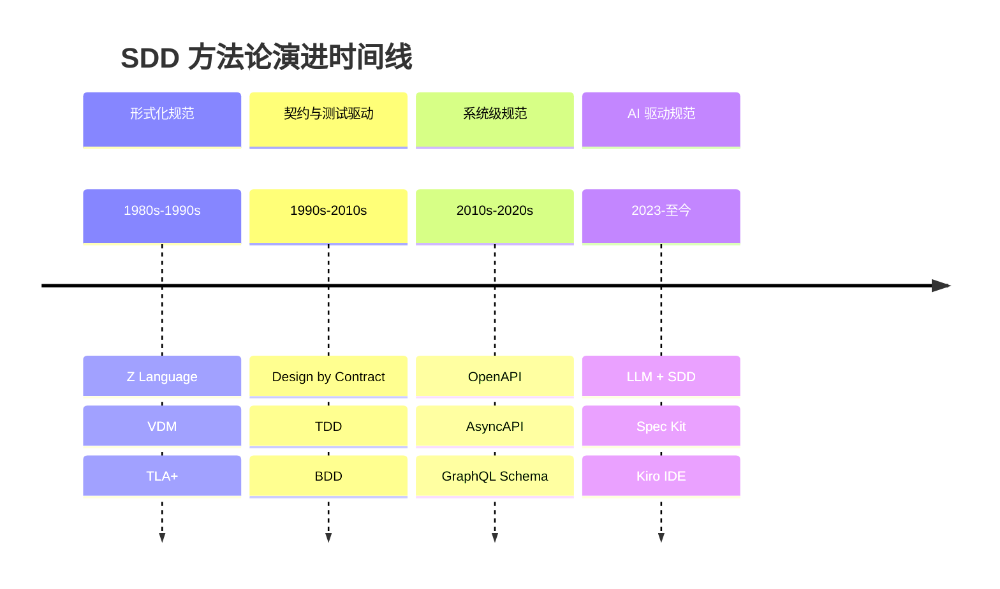

### 2.2 直接催化因素

SDD 在 2024-2025 年集中爆发有三个直接催化剂：

其一，**Vibe Coding 的困境暴露**。开发者发现用自然语言对话式编程（Vibe Coding）虽然在原型阶段极为高效，但在生产项目中频繁出现质量不稳定、上下文丢失、技术债累积等问题。团队急需一种既保留 AI 生产力优势、又能确保工程质量的方法。

其二，**大模型能力的临界突破**。当模型能处理 100K+ token 的上下文窗口、理解复杂的结构化文档、在多轮交互中保持一致性时，"用规范驱动生成"从理论变为了工程可行方案。

其三，**工业化工具链的出现**。GitHub Spec Kit、AWS Kiro、Tessl 等平台级工具的发布，将 SDD 从个人实践升级为团队工作流。

## 三、SDD 开发范式的核心特性

### 3.1 六大核心特征

**声明式意图表达**。开发者用结构化文档描述"系统应该做什么"，而非"如何实现"。规范聚焦于功能需求、约束条件和验收标准，将实现细节交给 AI 决策。

**规范即单一事实源**。整个开发链路以规范为最高权威，设计文档、代码、测试都是规范的派生产物。当代码与规范不一致时，以规范为准进行修正。

**结构化与可验证**。规范采用标准化格式（Markdown + YAML + 结构化模板），既便于人类审阅，也能被 AI 和自动化工具精确解析和验证。

**持续对齐机制**。代码必须与规范保持一致，通过漂移检测（Drift Detection）实时监控偏差。这将架构约束从"设计期文档"变为"运行期约束"。

**分层治理**。从战略层（Constitution/原则文件）到战术层（具体 Spec），形成层次化的规范体系。高层规范稳定不变，低层规范灵活迭代。

**可演进性**。规范不是一次性写完的静态文档，而是随系统一起演进的活性资产。每次需求变更都体现为规范的版本变更，代码随之重新生成或调整。

### 3.2 三大流派分类

根据规范在开发流程中的角色深度，SDD 存在三个递进的实践层次：

| 流派 | 核心主张 | 适用场景 | 代表工具 |
|------|----------|----------|----------|
| **Spec-First（轻量派）** | 规范作为初期"超级提示词"，代码生成后规范归档 | 快速原型、小团队工具、增量需求 | OpenSpec |
| **Spec-Anchored（传统派）** | 规范与代码双向同步，核心逻辑由人类把控 | 企业级长期演进应用 | Kiro |
| **Spec-as-Source（激进派）** | 代码仅是中间产物，人类只编辑规范，禁止手动修改代码 | 金融核心、电信协议等高一致性系统 | Tessl |

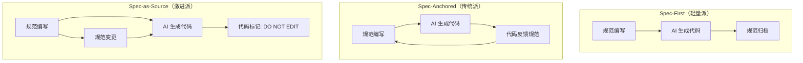

## 四、SDD 原理和架构

### 4.1 五层执行模型

SDD 的架构可以抽象为五层执行模型，从底向上依次为：

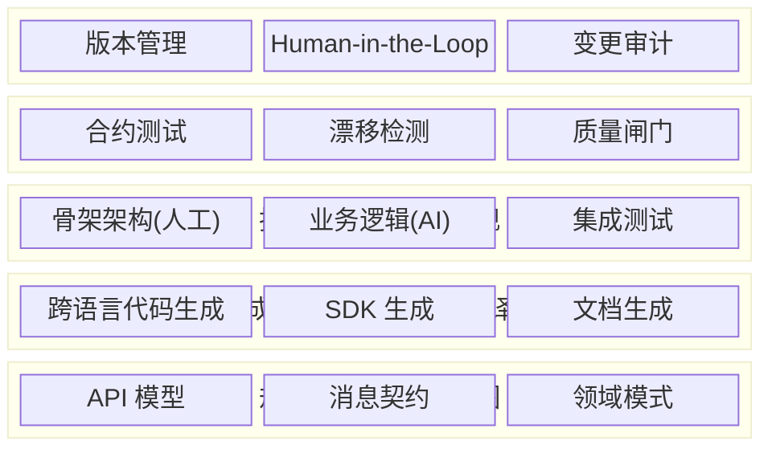

**规范层**：声明系统的意图和约束，包含 API 模型定义、消息契约、领域模式等结构化描述。这是整个系统的"北极星"。

**生成层**：充当规范到代码的"编译器"，将结构化规范翻译为可执行代码、SDK、测试桩等实现产物。

**执行层**：运行时的实现环境。骨架架构（项目结构、依赖管理、基础设施）由人工搭建，业务逻辑由 AI 根据规范填充。

**验证层**：通过合约测试和漂移检测确保实现与规范的实时对齐。任何偏差都会被自动捕获并报告。

**治理层**：管理规范的生命周期演化，包括版本管理、变更审批、Human-in-the-Loop 决策点等。

### 4.2 核心工作原理

SDD 的工作原理基于一个关键假设：**如果规范足够清晰、完整、结构化，AI 就能稳定地生成高质量代码。** 这个假设将"代码质量"问题转化为"规范质量"问题。

工作原理的三个核心机制：

**规范分解（Decomposition）**。将高层需求逐级分解为可执行的原子任务，每个任务有明确的输入、输出和约束条件。分解过程本身也可以由 AI 辅助完成，但需要人类审阅和确认。

**上下文注入（Context Injection）**。规范文件不是孤立存在的，它会携带项目的全局上下文（Constitution 文件、架构约定、技术栈信息）一起传递给 AI，确保生成的代码与整体系统风格一致。

**闭环验证（Closed-Loop Validation）**。AI 生成的代码必须通过规范定义的验证标准才能被接受。未通过的代码会触发"规范加注 → 重新生成"的迭代循环，通常 2-3 轮即可达到生产质量。

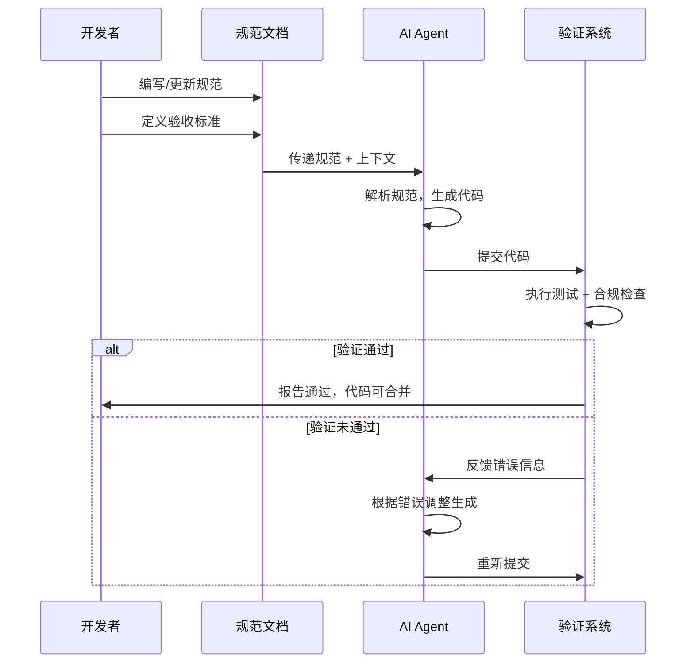

## 五、SDD 标准使用流程

### 5.1 四阶段标准流程

SDD 的标准工作流分为四个核心阶段，每个阶段有明确的输入、产出和质量门禁：

**阶段一：规范（Specification）**

输入为业务需求和产品目标，输出为结构化的规范文档。这一阶段需要回答：系统做什么？满足什么约束？如何验证正确性？

一份合格的规范文档应包含以下要素：

| 组成部分 | 内容说明 | 复杂度参考 |
|----------|----------|------------|
| 目标与价值 | 解决什么问题，为什么要做 | 2-3 句 |
| 上下文与约束 | 架构、依赖、环境、性能要求 | 视系统复杂度 |
| 功能需求 | 核心行为与特性描述 | 100-2000 字 |
| 非功能需求 | 安全、性能、可扩展、可访问性 | 视系统要求 |
| 边界与错误处理 | 异常场景定义和处理策略 | 列举所有已知边界 |
| 测试标准 | 验证准则和验收条件 | GIVEN/WHEN/THEN 格式 |
| 示例 | 输入/输出样例、使用场景 | 覆盖典型和边界情况 |

**阶段二：计划（Plan）**

将规范分解为技术实现方案。确定技术栈选型、组件划分、接口设计、依赖关系等。这一阶段产出的是"架构蓝图"，回答"用什么技术、按什么结构实现"。

**阶段三：任务（Tasks）**

将实现计划拆解为可执行的原子任务列表。每个任务应该是独立的、可验证的最小工作单元。任务粒度建议为"一个 API"或"一个组件"的级别。

**阶段四：实现（Implementation）**

AI Agent 按照任务列表逐一执行代码生成，开发者逐任务审查变更。每个任务完成后进行局部验证，全部完成后进行集成验证。

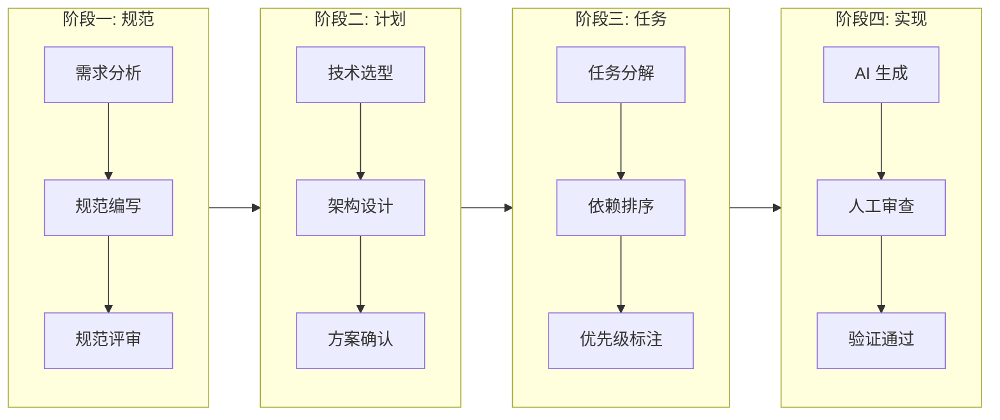

### 5.2 规范编写五项准则

高质量规范需要满足五项质量要求：

**清晰性**（Clear）：无歧义描述，避免"可能""大概""通常"等模糊用语。每条规则都应有唯一的确定性解释。

**完整性**（Complete）：覆盖所有已知的业务规则、边界条件和异常场景。"未描述的行为 = AI 的自由发挥 = 不可控风险"。

**上下文充分性**（Contextual）：提供足够的架构背景、领域知识和技术约束，让 AI 理解"为什么要这样做"。

**具体性**（Specific）：用实例胜过抽象描述。输入/输出样例、错误场景的具体表现，比笼统的规则声明更有效。

**可测性**（Testable）：每条需求都有对应的验证标准，通常采用 GIVEN/WHEN/THEN 格式的验收条件。

### 5.3 规范复杂度与编写时间参考

| 目标粒度 | 规范篇幅 | 编写时间 |
|----------|----------|----------|
| 基础函数/工具方法 | 100-200 字 | 15-30 分钟 |
| API 端点（含校验/错误处理） | 300-500 字 | 1-2 小时 |
| 组件或模块（多函数/有依赖） | 500-800 字 | 2-4 小时 |
| 系统架构（多组件协同） | 1000-2000 字 | 8-16 小时 |

## 六、SDD 相比其他开发范式的优势

### 6.1 与主流范式的对比

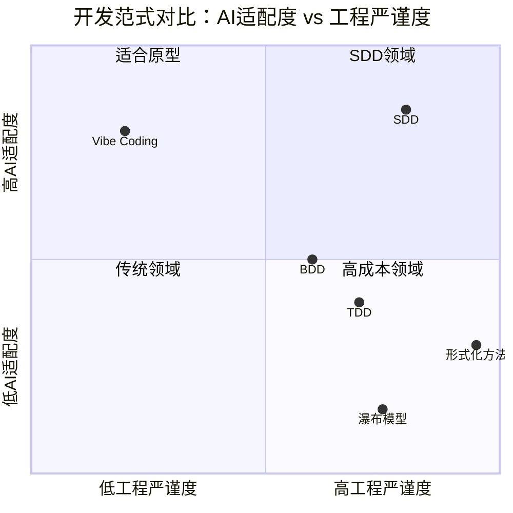

| 维度 | Vibe Coding | TDD | BDD | SDD |
|------|-------------|-----|-----|-----|
| 事实来源 | 对话历史 | 测试用例 | 业务场景 | 完整规范文档 |
| AI 适配度 | 高但不稳定 | 中等 | 中等 | 高且稳定 |
| 质量保障 | 弱 | 行为验证 | 场景验证 | 全维度验证 |
| 可维护性 | 差 | 中等 | 良好 | 优秀 |
| 团队协作 | 困难 | 需要经验 | 跨角色友好 | 结构化协作 |
| 适用规模 | 原型/小工具 | 模块级 | 功能级 | 系统级 |

### 6.2 SDD 为什么会火

**第一，解决了 Vibe Coding 的痛点。** Vibe Coding 在小规模项目中效率惊人，但在生产系统中暴露出严重问题：上下文丢失、质量波动大、技术债不可控。SDD 在保留 AI 生产力的同时，引入了结构化的质量保障机制。

**第二，重新定义了开发者的价值。** 在 AI 能写代码的时代，"手写代码"不再是稀缺能力。SDD 将开发者的核心价值重新定位为"精准表达意图"和"架构决策"——这恰好是 AI 难以替代的能力。

**第三，与现有工程实践兼容。** SDD 不是对 TDD/BDD/DDD 的替代，而是"元方法论"级别的整合。DDD 决定"规范写什么"，BDD 提供场景描述格式，TDD 作为验证层的子集，全部可以融入 SDD 框架。

**第四，工具链成熟度达到临界点。** 2024-2025 年，GitHub Spec Kit、AWS Kiro、Tessl 等企业级工具的密集发布，让 SDD 从"理论可行"变为"即插即用"。

**第五，ROI 数据有说服力。** 行业实践表明：规范完备的功能实现可节省 50-80% 的开发时间，团队每周普遍节省 2-3 小时，通常 3-6 个月即可看到净正 ROI。

### 6.3 SDD 作为元方法论

SDD 不替代其他方法论，而是在更高层面整合它们：

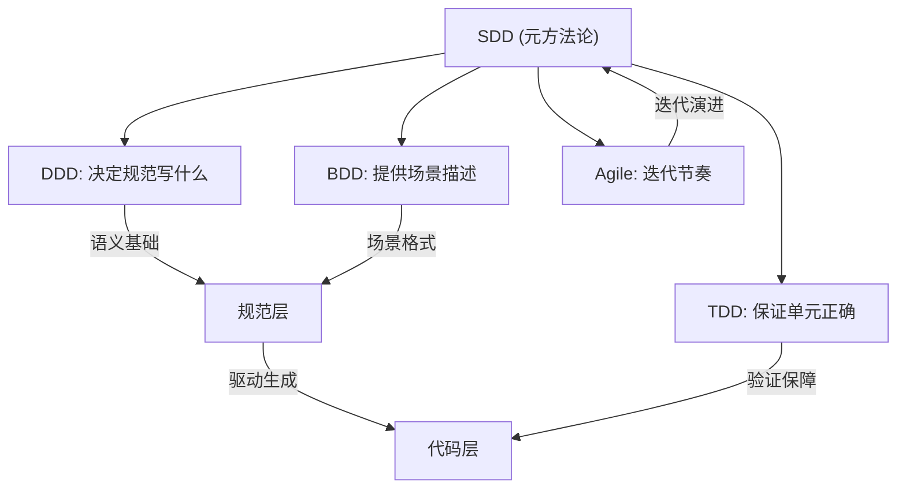

## 七、SDD 标准工作流程详解

### 7.1 完整开发链路

以 GitHub Spec Kit 为参考，SDD 的标准工作流可细化为七步：

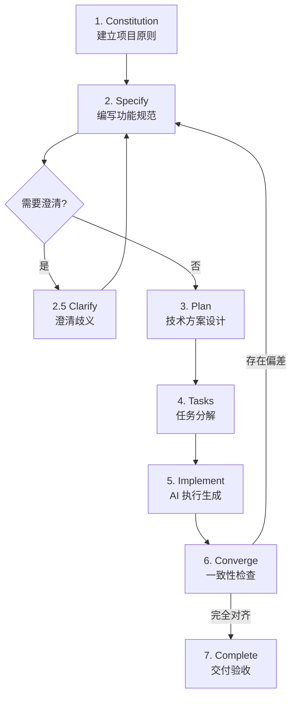

**Step 1 — Constitution（宪法/原则文件）**

在项目初始化时编写一次，极少修改。定义项目的不可变原则、编码标准、架构约束、安全红线等。它是所有后续规范的"宪法"，确保 AI 的每次生成都遵循全局规则。

Constitution 通常包含：技术栈声明、代码风格规则、目录结构约定、安全策略、性能基线等。

**Step 2 — Specify（规范编写）**

针对每个具体功能或变更请求，编写详细的规范文档。聚焦 What 和 Why，不涉及 How。采用用户故事 + 验收条件的结构化格式。

**Step 3 — Plan（方案设计）**

基于规范，制定技术实现方案。确定组件结构、接口设计、数据模型、第三方依赖、错误处理策略等。这是从"做什么"到"怎么做"的桥梁。

**Step 4 — Tasks（任务分解）**

将方案拆解为原子级任务列表。任务之间标注依赖关系和执行顺序。每个任务有清晰的完成标志和验证方式。

**Step 5 — Implement（AI 执行）**

AI Agent 按任务列表顺序执行代码生成。开发者逐任务审查产出，确认无误后进入下一个任务。

**Step 6 — Converge（收敛对齐）**

全部任务完成后，评估代码库与规范的整体一致性。检测是否存在遗漏的需求、偏离规范的实现，或任务间的集成问题。

**Step 7 — Complete（交付验收）**

通过五支柱验证框架（安全、测试、质量、性能、上线就绪），确认代码达到生产标准后正式交付。

### 7.2 五支柱验证框架

SDD 的质量保障不仅依赖规范本身，还需要系统化的验证机制：

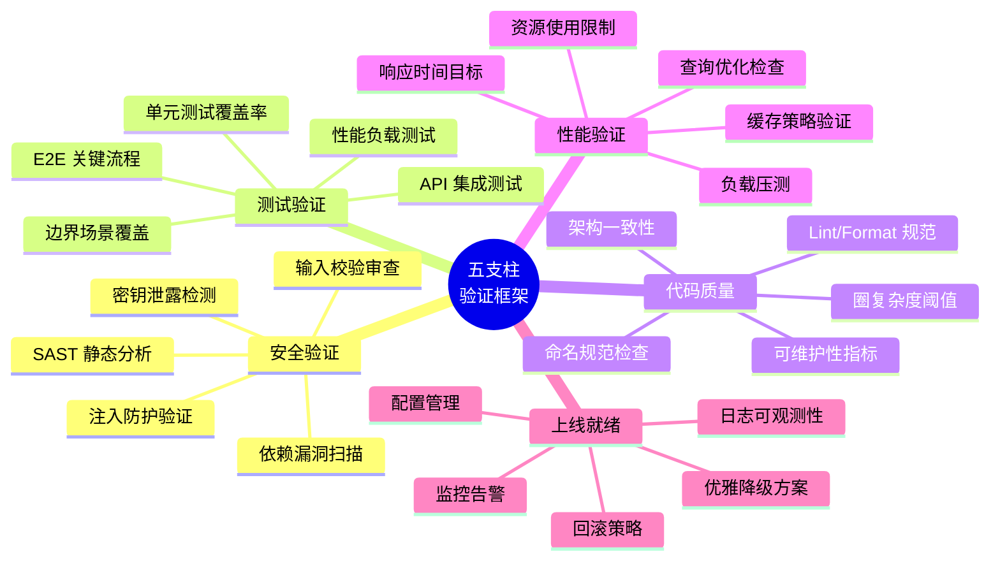

### 7.3 调试与迭代机制

当 AI 生成的代码未通过验证时，SDD 提供系统化的调试六步法：

1. 稳定复现问题
2. 检查规范是否清晰——"AI 犯错通常是规范不清晰的信号"
3. 识别常见 AI 错误模式（遗漏边界、误解依赖、过度简化等）
4. 将错误场景显式写回规范——通过反例和约束强化表述
5. 基于改良规范重新生成
6. 用扩展测试覆盖验证修复

在 CI/CD 中，这个过程自动化为"重试环"：初次生成 → 测试 → 捕获错误 → 规范加注 → 再生成。通常 2-3 轮即可达到生产质量。

## 八、在各大 AI 工具场景下的 SDD 实践

### 8.1 工具生态全景

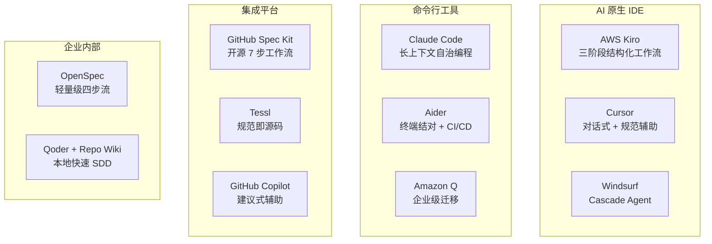

### 8.2 主流工具的 SDD 实践路径

**AWS Kiro 实践路径**

Kiro 提供了开箱即用的三阶段 SDD 体验。用户输入一段需求描述后，Kiro 自动生成 requirements.md（用户故事 + GIVEN/WHEN/THEN 验收条件）→ design.md（组件架构、数据模型、错误处理）→ tasks.md（逐步实现任务列表）。开发者在每个阶段都可以暂停、修改、确认后再继续。

适用场景：AWS 生态项目、需要结构化但不追求极致定制的团队。

**GitHub Spec Kit 实践路径**

Spec Kit 是当前最完整的开源 SDD 框架，提供 7 步 CLI 工作流和 30+ AI 编码代理的集成。通过 `/speckit.constitution` → `/speckit.specify` → `/speckit.plan` → `/speckit.tasks` → `/speckit.implement` 的命令链路驱动完整开发周期。支持 Bundle 系统实现角色化配置（产品经理、安全研究员、开发者等）。

适用场景：需要高度定制化和团队协作的中大型项目。

**Claude Code + SDD 实践路径**

Claude Code 的长上下文能力和自治编程模式天然适配 SDD。实践方式：将 AGENTS.md 作为 Constitution 文件，将 Spec 文件放在项目目录中，通过 Claude Code 的会话驱动实现。适合高级开发者和小团队的灵活 SDD 实践。

**轻量级 OpenSpec 路径**

四步流程：Propose（提出变更）→ Apply（实施代码）→ Verify（验证一致性）→ Archive（归档规范）。适合增量需求、UI 改动、实验性功能等不需要完整规范链路的场景，也专门为棕地（brownfield）项目设计。详细的命令、目录结构和实战示例见第九章。

### 8.3 工具选择决策矩阵

| 决策维度 | Kiro | Spec Kit | Claude Code | OpenSpec |
|----------|------|----------|-------------|---------|
| 学习曲线 | 低 | 高 | 中 | 极低 |
| 定制灵活度 | 低 | 极高 | 高 | 中 |
| 团队协作 | 良好 | 优秀 | 一般 | 一般 |
| 规范深度 | Spec-First | Spec-First/Anchored | 灵活 | Spec-First |
| 生态集成 | AWS | GitHub/30+ Agent | 独立 | 独立 |
| 适合规模 | 中小型 | 中大型 | 小型 | 小型/增量 |

### 8.4 企业级落地七步路径

对于企业级团队推行 SDD，推荐以下渐进式路径：

1. **选择试点项目**——优先选择相对边缘、风险较低的模块
2. **建立规范管理平台**——具备版本控制、模板管理、准入机制
3. **规范编写与评审**——需求分析 → 规范编写 → 多方评审 → 规范固化
4. **开发 AI 理解层**——必要时微调私有 LLM，适配企业领域术语
5. **建立 Agent 体系**——需求 Agent + 编码 Agent + 测试 Agent 协同
6. **制定人机协审制度**——AI 先审规则合规性，人类再审业务正确性
7. **逐步推广与优化**——总结经验、关注反馈、迭代流程

## 九、OpenSpec：轻量级 SDD 实战详解

OpenSpec 是 Fission-AI 团队开发的开源 SDD 框架，专为 AI 编码助手设计。与 Spec Kit 的"重规范"路线不同，OpenSpec 走的是"轻规范、可演进、面向棕地项目"的路线，其设计哲学可以概括为四句话：fluid not rigid（灵活而非僵化）、iterative not waterfall（迭代而非瀑布）、easy not complex（简单而非复杂）、built for brownfield not just greenfield（面向存量而非仅面向新项目）。

### 9.1 OpenSpec 的核心理念

OpenSpec 与其他 SDD 工具最大的不同，在于它维护了一份**"活的"统一规范文档**（Source of Truth Specification），而不是每次任务都生成一组孤立的规范文件。

这份统一规范代表系统当前的真实状态，随代码一起演进。每次变更先以"增量规范"（Delta Spec）的形式提议，待实施完成后再合并回统一规范，原始的 Delta 文件归档保留作为审计轨迹。这种设计解决了传统 SDD 三个痛点：

第一，系统整体意图难以宏观把握——因为存在唯一的真理源文档。

第二，特性间的交互直到实现阶段才被发现——因为每次变更都需要在统一规范上下文中提议。

第三，完整规范与运行系统无法校验——因为 Verify 阶段会强制对齐。

### 9.2 三类核心制品

OpenSpec 体系下存在三类规范制品：

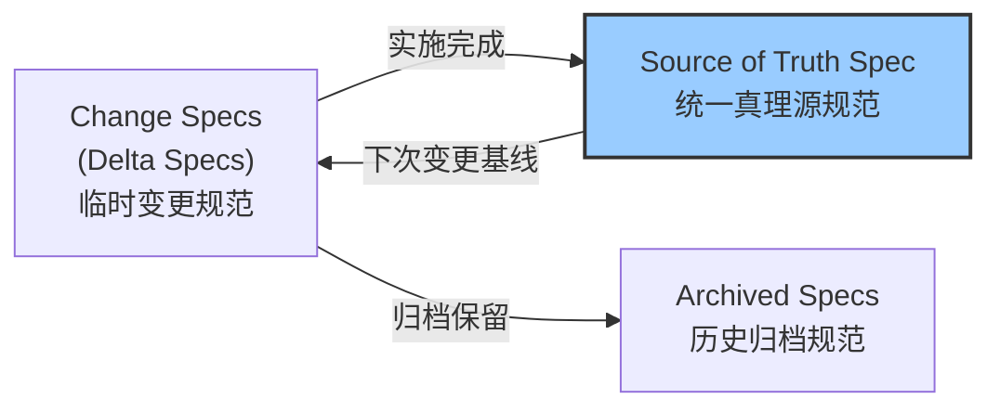

**Change Specifications（增量规范 / Delta Specs）**：代表当前正在提议的变更。使用 `ADDED`（新增）、`MODIFIED`（修改）、`REMOVED`（移除）三种标记清晰传达变更内容，让人类和 AI 都能快速理解"本次到底改了什么"，而不需要 diff 整份大文档。

**Source of Truth Specification（统一真理源规范）**：系统当前真实状态的权威描述。所有 Delta 完成实施后都会合并进这份主规范，形成可供利益相关方查阅的唯一标准。

**Archived Specifications（归档规范）**：Delta 合并入主规范后，原始 Delta 文件会被归档到日期前缀的目录，保留完整的历史脉络，便于追溯每个决策的来龙去脉。

### 9.3 OpenSpec 安装与初始化

OpenSpec 要求 Node.js 20.19.0 及以上版本。

```bash
# 全局安装
npm install -g @fission-ai/openspec@latest

# 进入项目目录初始化
cd your-project
openspec init
```

初始化后，项目根目录会出现 `openspec/` 文件夹和 `AGENTS.md`（供 AI 编码代理读取的全局上下文）。后续工作流通过斜杠命令在支持的 AI 编码代理（Claude Code、Codex、Cursor 等）中触发。

### 9.4 四阶段工作流：Explore → Propose → Apply → Archive

OpenSpec 的核心工作流由四个阶段组成，每个阶段都有对应的斜杠命令：

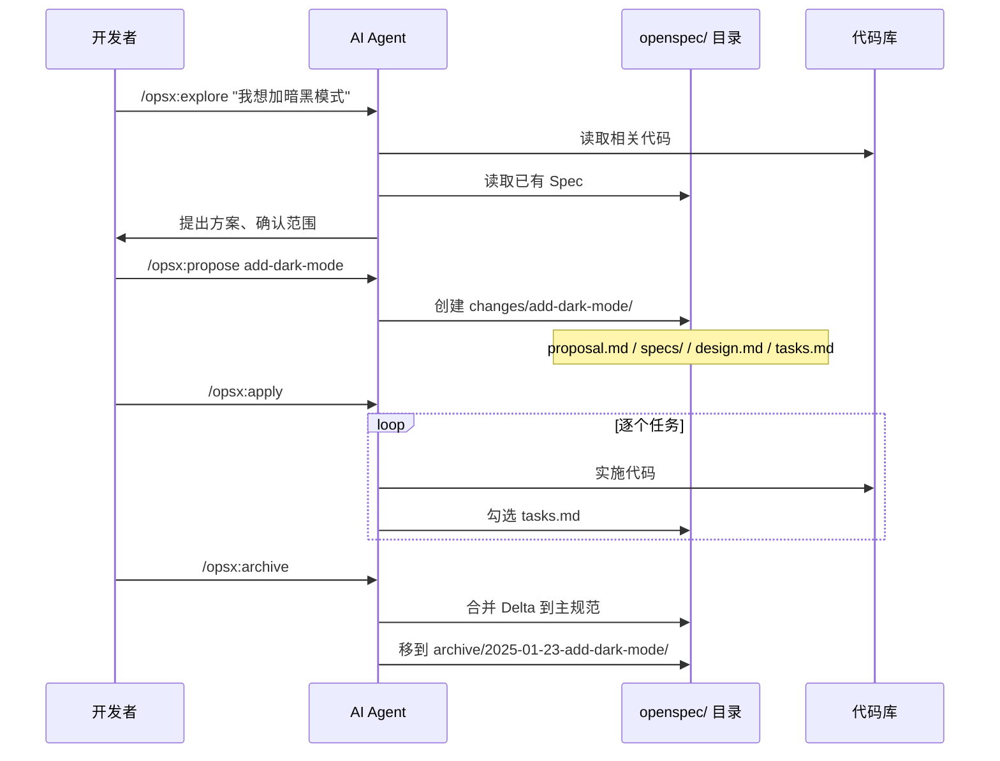

**Explore（探索）**：`/opsx:explore <想法>`。AI 充当"思考伙伴"，读取现有代码和规范，与开发者讨论可行方案、确认范围边界。这一步不写任何规范文件，只产出对话和决策。适合需求模糊、范围不清晰时使用。

**Propose（提议）**：`/opsx:propose <change-name>`。AI 在 `openspec/changes/<change-name>/` 下生成四件套：
- `proposal.md`：变更的动机和高层描述
- `specs/`：增量规范（带 ADDED/MODIFIED/REMOVED 标记）
- `design.md`：技术方案、组件设计、接口定义
- `tasks.md`：可勾选的原子任务清单

**Apply（实施）**：`/opsx:apply`。AI 按 `tasks.md` 的清单逐项实施代码，每完成一项就把对应的 checkbox 勾上。开发者可以中途暂停审查，或者一次性把整个 change 跑完。

**Archive（归档）**：`/opsx:archive`。Verify 通过后，AI 会把 Delta 规范合并进 Source of Truth，把原始 change 目录移动到 `openspec/changes/archive/<date>-<change-name>/`，留下完整的历史快照。

### 9.5 OpenSpec 的目录结构

一个典型的 OpenSpec 项目的目录布局如下：

```
your-project/
├── AGENTS.md                    # AI 编码代理的全局指令文件
├── openspec/
│   ├── specs/                   # Source of Truth：系统当前真实状态规范
│   │   ├── auth.md
│   │   ├── billing.md
│   │   └── ui-theme.md
│   ├── changes/                 # 进行中的变更
│   │   └── add-dark-mode/
│   │       ├── proposal.md      # 变更动机
│   │       ├── specs/           # Delta 规范（ADDED/MODIFIED/REMOVED）
│   │       │   └── ui-theme.md
│   │       ├── design.md        # 技术方案
│   │       └── tasks.md         # 任务清单
│   │   └── archive/             # 已归档变更
│   │       └── 2026-06-20-add-i18n/
│   │           └── ... (原 change 完整快照)
└── src/                         # 业务代码
```

### 9.6 一个完整的 OpenSpec 实战示例

以"给现有 React 应用添加暗黑模式"为例，走通 OpenSpec 全流程：

**第一步 — 探索**

```
You: /opsx:explore 我想给应用加一个暗黑模式，能记住用户选择
AI: 我看了下 src/styles/、src/contexts/、src/App.tsx，
    现有方案使用 Tailwind CSS，没有任何主题切换机制。
    建议采用 React Context + Tailwind dark: 前缀方案，
    用 localStorage 持久化用户选择。
    需要新增组件：ThemeProvider、ThemeToggle。
    是否符合预期？还有别的约束吗？
You: 同意。还需要尊重系统的 prefers-color-scheme
```

**第二步 — 提议**

```
You: /opsx:propose add-dark-mode
AI: ✓ Created openspec/changes/add-dark-mode/
    ├── proposal.md
    ├── specs/ui-theme.md      (Delta: ADDED dark-mode 章节)
    ├── design.md
    └── tasks.md (5 tasks)
```

生成的 `tasks.md` 示例：

```markdown
# Tasks for add-dark-mode

- [ ] 1.1 Add ThemeContext and ThemeProvider in src/contexts/ThemeContext.tsx
- [ ] 1.2 Create ThemeToggle component in src/components/ThemeToggle.tsx
- [ ] 1.3 Wire ThemeProvider into App.tsx root
- [ ] 1.4 Update tailwind.config.js to enable darkMode: 'class'
- [ ] 2.1 Add unit tests for ThemeContext (system pref + manual override)
```

**第三步 — 实施**

```
You: /opsx:apply
AI: ✓ 1.1 Add ThemeContext and ThemeProvider
    ✓ 1.2 Create ThemeToggle component
    ✓ 1.3 Wire ThemeProvider into App.tsx root
    ✓ 1.4 Update tailwind.config.js
    ✓ 2.1 Add unit tests for ThemeContext
    All tasks completed. Tests passing.
```

**第四步 — 归档**

```
You: /opsx:archive
AI: ✓ Verified Delta consistency with Source of Truth
    ✓ Merged into openspec/specs/ui-theme.md
    ✓ Archived to openspec/changes/archive/2026-06-26-add-dark-mode/
```

至此一个完整变更走完。下一次再做相关需求时，AI 会直接读取已更新的 `openspec/specs/ui-theme.md` 作为最新基线。

### 9.7 OpenSpec 的进阶模式

**并行特性开发**：在主分支上提议多个变更，每个变更分配独立的 Git WorkTree，由不同 SubAgent 并行实施。合并前每个 SubAgent 都会执行 Verify，确保 Source of Truth 始终一致。

**棕地（Brownfield）改造**：使用 `/opsx:onboard` 命令，AI 会扫描现有代码库、推断系统当前能力，自动生成初始版本的 Source of Truth Spec。后续就可以正常走 Propose-Apply-Archive 流程逐步演进。

**ADR 双轨制**：通过 `spec-driven-with-adr` 自定义 schema，让 Spec 捕获系统的"功能现状"，让 ADR 捕获系统的"架构决策"。两类制品都在 Change 归档后持久存在，避免重复发现已有结论。

**Backlog 集成**：通过 Linear MCP 在 Propose、Apply、Archive 三个阶段自动同步 backlog 状态，让业务用例（What）和技术实现（How）保持分离但联动。

### 9.8 OpenSpec 与 Spec Kit 的对比

| 维度 | OpenSpec | Spec Kit |
|------|----------|----------|
| 哲学 | 轻规范、灵活迭代 | 重规范、结构完备 |
| 规范模型 | 单一 Source of Truth + Delta | 每个 feature 独立 spec 树 |
| 工作流 | Explore→Propose→Apply→Archive | Constitution→Specify→Plan→Tasks→Implement |
| 适合场景 | 棕地系统、增量演进 | 0→1 系统、高严谨度新项目 |
| 学习曲线 | 极低 | 较高 |
| 上下文负担 | 单文档紧凑 | 多文件分散 |
| 历史可追溯 | 自动归档 | 依赖 Git 提交 |

## 十、SDD 实际落地项目示例：一步步走通完整场景

理论说得再清楚，不如走一遍真实场景。本章用一个具体项目——**"为电商后台新增订单导出 API"**——演示如何从零到一走完 SDD 全流程，覆盖工具选择、规范编写、代码生成、验证交付每个环节。

### 10.1 项目背景与目标

**业务场景**：某电商后台现有订单管理系统（Node.js + Express + PostgreSQL），运营团队希望增加一个"批量导出订单"的 API，支持按时间范围、订单状态筛选，导出为 CSV 文件。

**约束条件**：
- 单次导出最多 10 万条记录
- 包含敏感字段（手机号、地址），需做脱敏
- 导出过程不能阻塞其他请求
- 需要操作审计日志

**团队情况**：3 人小团队，已使用 Claude Code + AGENTS.md 工作方式。选择 OpenSpec 作为 SDD 工具，因为这是一个棕地项目，且变更范围相对独立。

### 10.2 完整落地流程的九个步骤

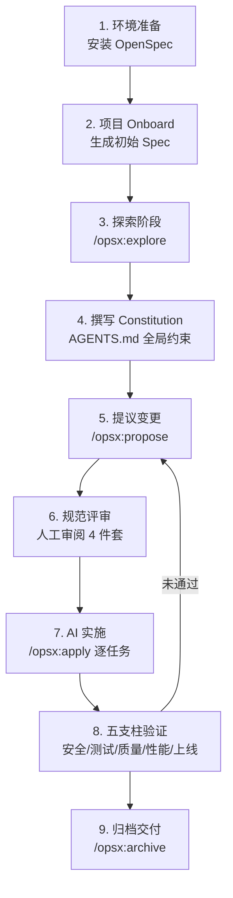

#### 步骤 1：环境准备

```bash
# 安装 Node.js 20+，然后全局安装 OpenSpec
npm install -g @fission-ai/openspec@latest

# 进入项目根目录初始化
cd order-management-backend
openspec init
```

初始化后项目根目录新增：
```
order-management-backend/
├── AGENTS.md         # 待填写的全局约束
├── openspec/
│   ├── specs/        # 空，等待 onboard 填充
│   └── changes/      # 空，等待 propose 填充
└── ... (原有代码)
```

#### 步骤 2：棕地项目 Onboarding

```
You: /opsx:onboard
AI: 我已扫描代码库，识别出以下能力域：
    - auth: JWT 认证、RBAC 权限
    - orders: 订单 CRUD、状态机
    - users: 用户管理、地址簿
    - audit: 操作日志（基础）
    
    正在为每个能力域生成初始 Spec...
    ✓ openspec/specs/auth.md
    ✓ openspec/specs/orders.md
    ✓ openspec/specs/users.md
    ✓ openspec/specs/audit.md
```

至此，AI 已经"理解"了项目现状，后续所有变更都会基于这份基线。

#### 步骤 3：探索阶段

```
You: /opsx:explore 想加一个订单批量导出 API，支持时间/状态筛选，
     导出 CSV，最多 10 万条，含字段脱敏
AI: 我看了 specs/orders.md 和现有 src/orders/ 目录。
    考虑到 10 万条数据量级，建议：
    1) 使用流式查询 + CSV 流式生成，避免内存溢出
    2) 复用现有 src/utils/maskingRules.ts 中的脱敏规则
    3) 同步导出方式会阻塞，建议采用异步任务 + 轮询模式
    4) 审计日志直接接入 specs/audit.md 的现有机制
    
    技术方案选择：
    A) 同步流式：实现简单，但请求长时间挂起
    B) 异步任务：创建导出任务、轮询状态、下载结果，体验更好但代码量大
    
    建议方案 B。是否采纳？
You: 采纳方案 B。文件存储用现有的 S3 客户端
```

#### 步骤 4：撰写 Constitution

在 `AGENTS.md` 中明确全局约束，这是项目级别的"宪法"，所有后续 Spec 都需遵守：

```markdown
# AGENTS.md — Order Management Backend

## 技术栈
- Runtime: Node.js 20.x
- Framework: Express 4.x
- Database: PostgreSQL 15 via Prisma
- Storage: AWS S3
- Test: Jest + Supertest

## 编码规范
- TypeScript strict 模式
- ESLint airbnb-typescript 规则
- 函数最大长度 50 行，超过需拆分

## 安全红线
- 任何包含手机号/地址/身份证号的输出必须经过 src/utils/maskingRules.ts 脱敏
- 所有数据导出操作必须写入 audit 日志
- 不允许在日志中输出原始敏感数据

## 性能基线
- API p99 < 500ms（导出类异步任务除外）
- 单次内存峰值 < 256MB

## 测试要求
- 单元测试覆盖率 ≥ 80%
- 关键路径必须有集成测试
```

#### 步骤 5：提议变更

```
You: /opsx:propose add-order-export
AI: ✓ Created openspec/changes/add-order-export/
```

生成的关键文件：

`proposal.md`：
```markdown
# Proposal: Add Order Export API

## Motivation
运营团队需要按时间范围和状态批量导出订单数据用于离线分析。
当前只有单条订单查询接口，缺少批量导出能力。

## Scope
- 新增异步导出任务接口（POST /api/orders/exports）
- 新增任务状态查询接口（GET /api/orders/exports/:id）
- 新增结果下载接口（GET /api/orders/exports/:id/download）
- 复用现有 audit、auth、masking 能力
```

`specs/orders.md`（Delta）：
```markdown
## ADDED: Order Export Capability

### Functional Requirements
- 用户可创建导出任务，指定时间范围（必填）和订单状态（可选）
- 单次导出上限 10 万条，超过返回 400 错误
- 任务异步执行，立即返回 task_id
- 任务状态：pending / running / succeeded / failed
- 成功后生成 S3 下载链接，有效期 1 小时

### Acceptance Criteria
GIVEN 用户身份为运营角色，提供时间范围
WHEN 调用 POST /api/orders/exports
THEN 返回 202 + task_id，任务进入 pending 状态

GIVEN 任务已成功完成
WHEN 调用 GET /api/orders/exports/:id/download
THEN 返回 302 重定向到 S3 预签名 URL

GIVEN 时间范围内订单超过 10 万条
WHEN 调用 POST /api/orders/exports
THEN 返回 400 + error_code: EXPORT_LIMIT_EXCEEDED

### Non-Functional Requirements
- 导出 1 万条订单耗时 < 30 秒
- 导出过程中其他订单查询接口 p99 < 500ms 不受影响
- 所有手机号、地址字段输出前必须脱敏
- 创建/下载操作均写入 audit 日志
```

`design.md`：
```markdown
# Design

## Components
- src/orders/export/exportController.ts  # HTTP 入口
- src/orders/export/exportService.ts     # 业务逻辑
- src/orders/export/exportWorker.ts      # 后台 worker
- src/orders/export/csvStreamer.ts       # 流式 CSV 生成器

## Data Model
新增表 order_exports:
  id, user_id, status, filter_json, row_count,
  s3_key, error_msg, created_at, completed_at

## Async Mechanism
使用现有 BullMQ 队列基础设施，新增 order-export 队列。
Worker 进程消费任务，通过 Prisma stream 读取数据，
管道传入 csv-stringify 流，最终 multipart upload 到 S3。

## Error Handling
- 数据库连接异常 → 任务 failed + 重试 3 次
- S3 上传失败 → 任务 failed + 告警
- 超过 10 万条 → 同步返回 400
```

`tasks.md`：
```markdown
# Tasks for add-order-export

## 1. Database
- [ ] 1.1 Add order_exports table migration
- [ ] 1.2 Update Prisma schema

## 2. Core Logic
- [ ] 2.1 Implement csvStreamer with masking integration
- [ ] 2.2 Implement exportService.createExport()
- [ ] 2.3 Implement exportService.getStatus()
- [ ] 2.4 Implement exportService.getDownloadUrl()
- [ ] 2.5 Implement exportWorker job handler

## 3. API Layer
- [ ] 3.1 Add POST /api/orders/exports route + controller
- [ ] 3.2 Add GET /api/orders/exports/:id route
- [ ] 3.3 Add GET /api/orders/exports/:id/download route
- [ ] 3.4 Wire audit logging on all three routes

## 4. Tests
- [ ] 4.1 Unit tests for csvStreamer masking behavior
- [ ] 4.2 Unit tests for exportService limit check
- [ ] 4.3 Integration test for full create→poll→download flow
- [ ] 4.4 Performance test: 1万条 < 30s
```

#### 步骤 6：规范评审

这是 SDD 中最关键的人工环节。团队 Code Review 时不是审代码，而是审上面这四份文档。重点关注：

- **完整性**：所有业务规则是否都覆盖了？例如"导出过程被取消怎么办"是否定义？
- **一致性**：Delta 中的字段是否与 Source of Truth 现有字段冲突？
- **可测性**：每条 Acceptance Criteria 是否都能转化为测试用例？
- **安全性**：脱敏规则、权限控制是否落实？

发现问题时，让 AI 修改规范而不是直接改代码。例如：

```
You: proposal 里没考虑导出任务超时怎么办，请补充
AI: ✓ 已在 specs/orders.md 增加：
    - 任务执行超过 10 分钟未完成 → 自动标记 failed
    - tasks.md 增加 2.6: Implement timeout handling
```

#### 步骤 7：AI 实施

规范确认无误后：

```
You: /opsx:apply
AI: 开始按 tasks.md 顺序实施...
    ✓ 1.1 Database migration created
    ✓ 1.2 Prisma schema updated
    ✓ 2.1 csvStreamer.ts created (integrating maskingRules)
    ✓ 2.2 exportService.createExport() implemented
    ✓ 2.3 exportService.getStatus() implemented
    ✓ 2.4 exportService.getDownloadUrl() implemented  
    ✓ 2.5 exportWorker.ts implemented
    ✓ 3.1-3.4 All API routes wired with audit
    ✓ 4.1-4.4 All tests passing
    
    Test results: 24 passed, 0 failed
    Coverage: 87% (≥ 80% threshold ✓)
```

期间开发者可以在每个任务完成后查看 Git diff、运行本地测试，发现问题及时反馈给 AI 调整。

#### 步骤 8：五支柱验证

代码生成完成不等于交付完成，还需要走完五支柱验证：

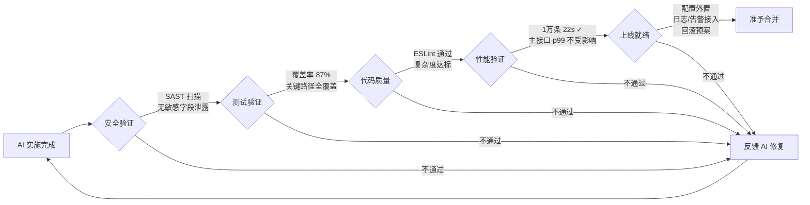

实战中可能发现的问题及修复方式：

- 安全扫描发现 CSV 中漏脱了 email 字段 → 让 AI 在 `specs/orders.md` 中补充 email 也属于敏感字段，重新生成 csvStreamer
- 性能测试发现 1 万条耗时 45 秒 → 让 AI 修改 design.md 改为批量读取（每批 1000 条），重新生成 worker

#### 步骤 9：归档交付

所有验证通过后：

```
You: /opsx:archive
AI: ✓ Verified Delta consistency with Source of Truth
    ✓ Merged Delta into openspec/specs/orders.md
    ✓ Updated openspec/specs/audit.md (导出操作类型新增)
    ✓ Archived to openspec/changes/archive/2026-06-26-add-order-export/
    
    Summary:
    - 4 spec files updated
    - 8 source files added
    - 1 migration created
    - 24 tests passing
    - Ready for PR
```

提交 PR 时附上 archive 目录的链接，Reviewer 可以直接看到完整的"规范变更 + 代码变更"对照，审查效率大幅提升。

### 10.3 这个项目带来的关键经验

**经验一：规范评审耗时占比 40%，但回报巨大。** 在第 6 步规范评审中，团队花了约 2 小时反复打磨规范文档，看似很慢，但因为 AI 实施阶段几乎"零返工"，整体项目反而比传统方式快了 30%。

**经验二：Constitution（AGENTS.md）是质量护城河。** 全局编码规范、安全红线写入 AGENTS.md 后，AI 生成的代码自然遵循团队风格。新人入职只需读这份文件就能理解所有约定。

**经验三：棕地项目用 OpenSpec 比 Spec Kit 更顺手。** Onboarding 一键生成初始 Spec，后续每次变更只看 Delta，避免了 Spec Kit"每次都要从 Constitution 重新走流程"的笨重感。

**经验四：五支柱验证不能省。** AI 生成的代码"看上去对"和"真的对"之间还有差距，特别是在性能、安全这类隐性维度。把验证流程标准化、自动化，才能真正达到生产质量。

**经验五：归档是知识资产。** 每次变更的 archive 目录都是后续相似需求的最佳参考。半年后再加一个"按用户维度导出"需求时，AI 可以直接复用 archive 中的设计模式。

## 十一、SDD 的不足与改进方向

### 11.1 当前已知不足

**过度规范化的问题。** Martin Fowler 网站的分析指出，对于小型变更，SDD 工具流程会"like using a sledgehammer to crack a nut"——一个简单 bug 修复被膨胀为多个用户故事和十几条验收标准。规范的编写和审查成本可能超过直接修复的时间。

**审查负担转移。** SDD 并没有消除审查工作，而是将其从"审代码"转移到"审规范 + 审代码"。Spec Kit 等重规范工具产生大量 markdown 文件，审查者坦言"I'd rather review code than all these markdown files"。

**虚假的控制感。** 即使有完善的规范和模板，AI Agent 仍然可能忽略指令、曲解约束、生成重复代码。更大的上下文窗口并不等于更高的指令遵循率。

**规范编写门槛高。** 编写高质量规范需要"既懂业务又懂技术"的复合能力，这类人才本身稀缺。初级开发者可能写不出有效规范，高级开发者可能觉得写规范效率不如直接写代码。

**新人成长困境。** 如果代码主要由 AI 生成，初级开发者缺少通过"手写代码"培养工程直觉的机会，可能导致行业知识断层。

**遗留系统迁移困难。** SDD 主要针对新项目或新功能设计，对于大规模存量遗留系统的改造，缺乏成熟的渐进式迁移路径。

**非确定性问题。** 与传统代码生成器不同，LLM 的生成结果具有随机性。相同的规范在不同次执行中可能产生不同的代码，这给版本管理和可复现性带来挑战。

### 11.2 改进方向与互补策略

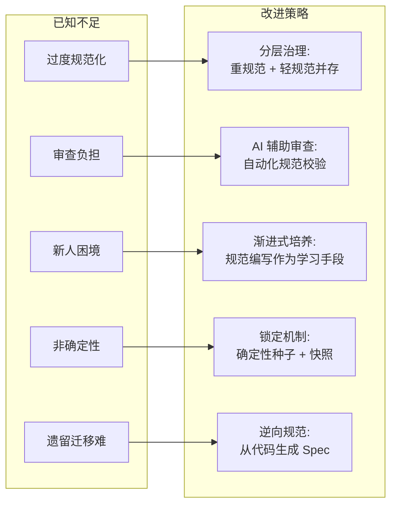

**分层治理模式**。成熟团队应同时采用重规范和轻规范两种路径：核心模块、高错误成本功能走完整 SDD 链路（Constitution → Spec → Plan → Tasks → Implement）；增量改动、UI 调整、实验性功能采用轻量 OpenSpec 路径。"不是所有需求都值得一套完整的规范链路。"

**AI 辅助规范质量评估**。建立规范质量的量化指标体系：清晰度评分、完整性覆盖率、可测性检查。用 AI 先行审查规范文档的质量，再用于驱动代码生成。

**ADR（Architecture Decision Record）互补**。SDD 关注"做什么"，ADR 记录"为什么这样做"。两者结合形成完整的决策链路：ADR 记录架构决策的背景和取舍，SDD 规范基于 ADR 决策编写具体实现要求。

**Experts 模式互补**。对于探索性、创意性工作，引入 Experts 模式——让多个"专家 Agent"并行提出方案、辩论取舍，最终收敛为规范。SDD 处理"已知问题的高质量实现"，Experts 处理"未知问题的方案探索"。

**逆向规范工具**。对于遗留系统，通过代码反向生成规范（如 Tessl 的 `tessl document --code`），先建立现状的规范基线，再逐步演进。

## 十二、总结与展望

### 12.1 核心认知

SDD 本质上是软件工程"关注点分离"原则在 AI 时代的最新体现。它将开发过程中最需要人类智慧的部分（意图定义、架构决策、质量标准制定）与最适合 AI 处理的部分（代码编写、测试生成、重复性工作）清晰分离。

几个关键认知：

规范不是一次性写完的静态文档，而是随系统一起演进的核心资产。高质量规范的价值远超代码本身——代码可以随时重新生成，但精准的意图表达不可复制。

SDD 不是银弹。它在"已知问题的高质量实现"场景中表现优异，但在探索性、创意性工作中可能过度约束。成熟的工程实践应该是"工具箱"思维——根据问题性质选择合适的范式。

真正成熟的团队，一定是重规范与轻规范并存，SDD 与 Vibe Coding 互补，而不是非此即彼的二元选择。

### 12.2 开发者角色转型

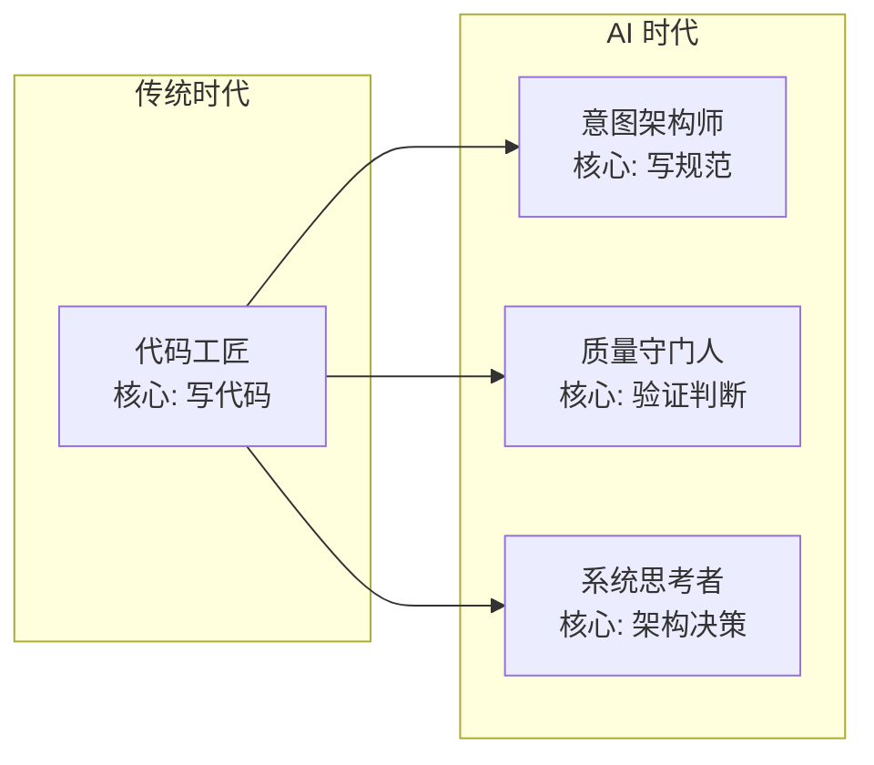

软件工程的重心"正在不可逆转地从实现层上移到规范层"。开发者的角色从"代码工匠"转向"意图架构师"——能精准传达系统意图、制定可验证标准的人，将成为 AI 时代最具价值的创造者。

### 12.3 实践建议

对于想要入手 SDD 的团队，建议按照以下优先级推进：

首先，选择一个中等复杂度的新功能作为试点，用最轻量的方式（OpenSpec 或 Kiro）体验"先写规范、再生成代码"的工作流。

其次，建立 Constitution 文件（项目原则和编码标准），这一步投入小但长期收益极高。

然后，逐步积累规范模板和最佳实践，形成团队自己的 SDD Playbook。

最后，根据团队规模和项目特点，选择合适的工具链（从 Kiro 到 Spec Kit），建立完整的规范驱动开发流水线。

---

**参考资料：**

- [Understanding Spec-Driven-Development: Kiro, spec-kit, and Tessl — Martin Fowler](https://martinfowler.com/articles/exploring-gen-ai/sdd-3-tools.html)
- [GitHub Spec Kit](https://github.com/github/spec-kit)
- [Fission-AI/OpenSpec — Spec-driven development for AI coding assistants](https://github.com/Fission-AI/OpenSpec)
- [OpenSpec | Spec-Driven Development — intent-driven.dev](https://intent-driven.dev/knowledge/openspec/)
- [Kiro and the future of AI spec-driven software development](https://kiro.dev/blog/kiro-and-the-future-of-software-development/)
- [规范驱动开发（SDD）：用 AI 写生产级代码的完整指南 — 腾讯云](https://cloud.tencent.com/developer/article/2586438)
- [规范驱动开发（Spec-Driven Development）深入解析 — 博客园](https://www.cnblogs.com/studyzy/p/19638317)
- [SDD规范驱动开发新范式：落地实践 — 腾讯云](https://cloud.tencent.com/developer/article/2615263)
- [Spec-Driven Development: From Code to Contract in the Age of AI — arXiv](https://arxiv.org/html/2602.00180v1)
- [How to make AI follow your instructions more for free (OpenSpec) — dev.to](https://dev.to/webdeveloperhyper/how-to-make-ai-follow-your-instructions-more-for-free-openspec-2c85)
- [Use a Reflection Harness to Level Up Your OpenSpec Workflow](https://www.dataleadsfuture.com/reflection-sdd-use-a-reflection-harness-to-level-up-your-openspec-workflow/)
