## 一、什么是 Skill

> **Anthropic 官方原文**：Agent Skills are modular capabilities that extend Claude's functionality. Each Skill packages instructions, metadata, and optional resources (scripts, templates) that Claude uses automatically when relevant.
>
> **译**：Agent Skills 是一种模块化能力，用于扩展 Claude（及其他 Agent）的功能。每个技能都将指令、元数据以及可选资源（脚本、模板）打包在一起，Agent 会在相关场景下自动调用。

简言之，**Skill 就是一个文件夹**：里面有一份带 YAML 元信息的 `SKILL.md`，附带若干脚本、参考资料和模板。它把零散的提示词、工作经验、SOP、脚本、外部资源全部装进一个**可加载、可演化、可分发**的"专业知识包"中，让 Agent 从"通用助手"变成"懂行的专家"。

需要警惕的常见误解：**Skill 不是更长的 Prompt**，而是"可复用的工作能力模块"。其定义可总结为：

> Skill = 指令（Instructions） + 资源（Resources） + 可执行脚本（Scripts）

它与传统 prompt 的差别在于：

- **prompt** 是一次性输入，每次都要重新打字或复制；
- **workflow** 是固定路径的可视化编排，灵活性差；
- **Skill** 是按需加载的"文件夹档案库"，**模型自主决定何时、如何使用**，并且可被版本化、可被组合、可被市场分发。

## 二、产生背景与发展历程

Anthropic 在 2024 推出 MCP 之后，社区在大规模落地中暴露了两个根本问题：

1. **上下文爆炸**：MCP 把所有工具的 JSON Schema 在连接时一次性塞进系统提示词，"单挂一个 Playwright MCP 就占掉 200k 上下文窗口的 8%"。
2. **能力鸿沟**：MCP 解决了"能够连接"，但没解决"知道如何使用"。Agent 能连数据库 ≠ 知道怎么写出高效安全的 SQL。

Skill 正是在这个空档里诞生的：它把"领域知识 + SOP + 工具调用顺序"封装为可惰性加载的文件夹，与 MCP 形成互补。Skill 的演化路径可以概括为：


Anthropic 提出的 Skill 很快被社区扩展为开放规范 [agentskills.io](https://agentskills.io)，并被 Cursor、Qoder、OpenClaw、OpenCode、Codex、Vercel、OneDay、卧虎、蚂蚁等众多工具与平台采纳。

## 三、Skill 与 Claude Skill 是什么关系

Claude Skill 是 **Anthropic 官方对 Skill 的首次落地实现**。它在 Claude Code、Claude Desktop、Claude API 中提供了：

- 一套 `SKILL.md` 规范（含 YAML frontmatter 字段）；
- 渐进式披露的加载器；
- 在沙盒虚拟机（VM）中执行脚本的运行时；
- `disable-model-invocation`、`allowed-tools` 等安全字段；
- `context: fork`、`subagent` 等高级能力。

社区在此基础上整理出 **Agent Skills 开放标准**（agentskills.io），让 Skill 不再绑定 Anthropic：

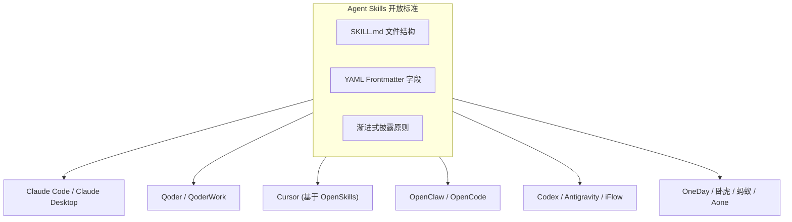

因此可以理解为：**Claude Skill ⊂ Agent Skill 标准**。各家工具都遵循这套规范，差异主要体现在加载路径、命名空间和扩展字段上。

## 四、Skill 是如何被 Agent 感知的：渐进式披露原则

Skill 的核心设计哲学是 **Progressive Disclosure（渐进式披露）**：分阶段、按需加载，绝不把所有信息一次性塞进上下文窗口。

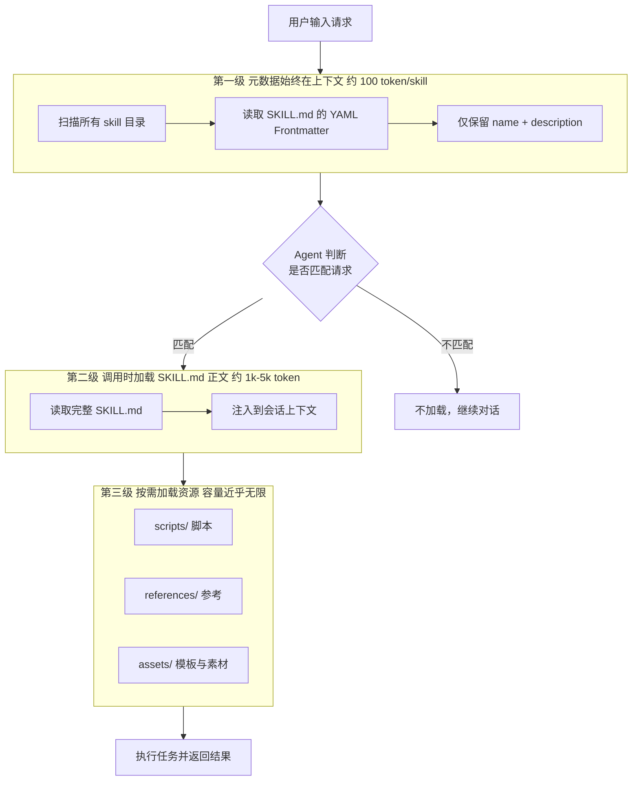

**关键参数（Claude Code 实测口径）**：

- 描述（description）默认占用约 **1% 模型上下文窗口预算**，可通过 `skillListingBudgetFraction` 调整；
- 单条描述上限 **1,536 字符**，可通过 `maxSkillDescriptionChars` 配置；
- SKILL.md 正文调用后保留约 **5,000 token** 在上下文窗口，并共享 25,000 token 的"已调用 skill"预算；
- 推荐 **SKILL.md 主体保持在 500 行以内**，其余内容外置为 references。

这种三级架构带来两个核心优势：

- **无限知识容量**：通过脚本可以查询任意大小的数据集，而不必把数据全部塞入上下文；
- **确定性执行**：复杂、需精确的计算交给脚本，避免大模型幻觉。

## 五、Skill 的标准目录结构

```bash
{skill-name}/
├── SKILL.md          # 必需：主入口（YAML Frontmatter + 主体说明）
├── scripts/          # 可选：可执行代码（Python / Node / Shell）
├── references/       # 可选：长篇参考资料（API 文档、SOP、PDF 解析等）
├── examples/         # 可选：使用示例 / few-shot 样例
├── assets/           # 可选：模板、图片、配置文件等静态资源
└── README.md         # 可选：面向开发者的说明
```

UML 视角下的组件关系：

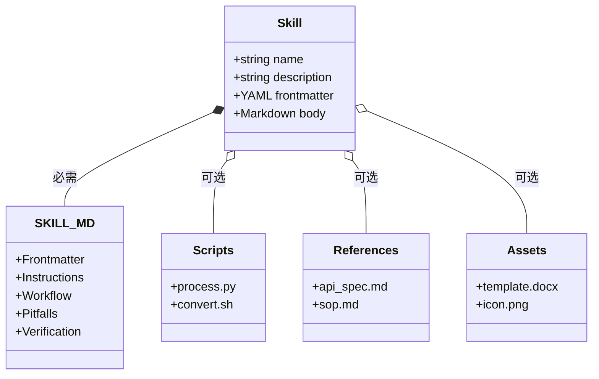

## 六、SKILL.md 文档结构规范

### 1. YAML Frontmatter 字段全集（以 Claude Code 为参照）

| 字段 | 必需 | 用途 |
| --- | --- | --- |
| `name` | 推荐 | 显示名称，默认取目录名，建议 kebab-case |
| `description` | **必需** | Agent 判断"何时调用此 skill"的唯一依据，决定召回率 |
| `when_to_use` | 可选 | 触发短语或示例请求，辅助 Agent 选择 |
| `argument-hint` | 可选 | 命令补全时的参数提示 |
| `arguments` | 可选 | 命名位置参数 |
| `allowed-tools` | 可选 | 预先批准的工具白名单 |
| `disallowed-tools` | 可选 | 移除的工具 |
| `disable-model-invocation` | 可选 | `true` 阻止 Agent 自动加载，仅允许显式 `/skill-name` 调用 |
| `user-invocable` | 可选 | `false` 从 `/` 菜单隐藏 |
| `model` / `effort` | 可选 | 模型与工作量级别覆盖 |
| `context: fork` | 可选 | 在分叉的 subagent 上下文中运行 |
| `agent` | 可选 | 配合 `fork` 使用的 subagent 类型 |
| `hooks` | 可选 | 仅在此 skill 生命周期内生效的 hooks |
| `paths` | 可选 | Glob 模式，限制激活条件 |
| `shell` | 可选 | `bash`（默认）或 `powershell` |
| `version` | 可选 | semver 版本号 |
| `tags` | 可选 | 分类标签 |

### 2. 标准主体结构

```markdown
---
name: skill-name
description: One-line 第三人称概述：做什么 + 何时使用（含触发关键词）
version: 1.0.0
---

# Skill Title

## Overview
一段话讲清楚这个 skill 解决什么问题、目标用户是谁。

## Prerequisites / Required Context
列出运行前提（依赖、登录态、文件路径、MCP 服务等）。

## Workflow / Steps
1. 第一步：精确的命令或动作
2. 第二步：……

## Pitfalls / 已知坑点
- 容易踩的坑及原因

## Verification / 验证方法
执行后如何确认成功。

## References
对 references/*.md 的引用与说明。
```

### 3. Description 写作要点

description 是 Agent 召回 skill 的唯一依据，必须包含三要素：

- **做什么**：动作 + 输出物
- **何时使用**：触发关键词 / 场景描述
- **独特价值**：与通用能力的差别

示例：

```yaml
description: >
  Generates PDF reports from markdown with styled cover pages,
  embedded charts, and footnotes. Use when the user asks for
  "导出 PDF"、"打印版"、"print-ready document"。
```

## 七、Skill 的工作流程

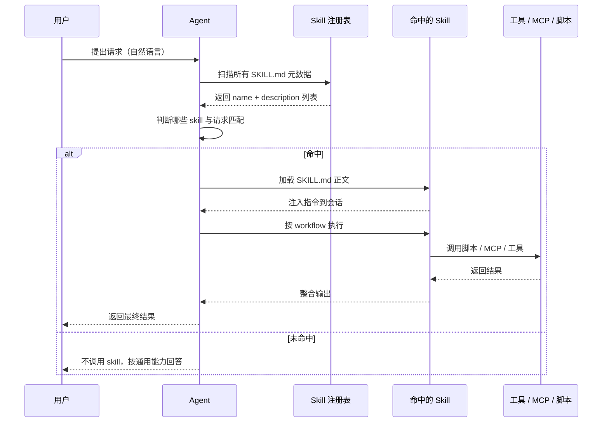

### 7.1 Skill 召回判断策略

Skill 的召回**不是**传统意义的关键词检索或向量召回，而是一次"**元数据预注入 + LLM 语义判断**"的过程，可拆为三步：

**Step 1 元数据预注入（启动期）**

Agent 启动时扫描所有 skill 目录，把每个 SKILL.md 的 YAML frontmatter 中的 `name + description`（部分实现还会带上 `when_to_use` / `tags` / `paths`）拼成清单，注入系统提示词。Claude Code 的实测口径是：

- 默认占用约 **1% 上下文窗口**（`skillListingBudgetFraction` 可调）；
- 单条 description 上限 **1,536 字符**（`maxSkillDescriptionChars` 可调）；
- 每条约 100 token。

也就是说，"召回"本质是把**候选 skill 清单**先告诉模型，让模型在对话中自行挑选。

**Step 2 模型语义判断（对话期）**

用户提问时，**LLM 本身**就是召回器，依据以下信号决定调用哪个 skill：

- 用户消息的意图（动词 + 对象 + 修饰词）；
- description 中的触发关键词与典型问法；
- `when_to_use` 中列出的示例请求；
- `paths` glob（若设置，会优先看当前操作的文件是否命中）；
- 历史对话上下文（是否已经在做某类任务）。

> 这意味着 **description 写得好不好直接决定召回准确率**，是 skill 工程里最关键的一环。

**Step 3 触发模式**

| 触发模式 | 触发方式 | 是否走判断 |
| --- | --- | --- |
| 自动触发 | 模型自主匹配后 `LoadSkill(name)` | 是 |
| 显式触发 | `/skill-name` 或 `@skill-name` | 否（强制） |
| 路径触发 | `paths` glob 命中操作文件 | 部分 |
| 被动预加载 | subagent `skills` 字段预声明 | 否（全量加载） |

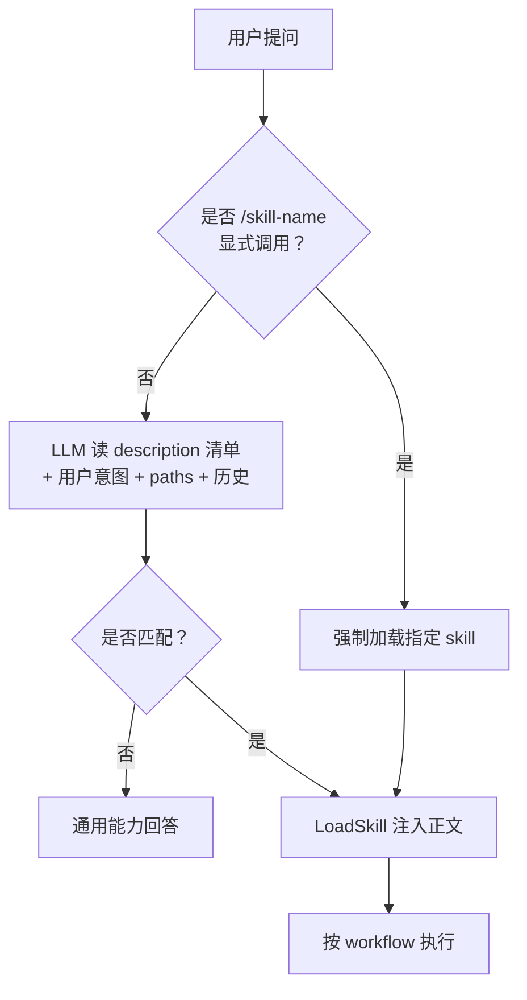

### 7.2 是否会召回多个 Skill

**会，而且很常见。** 多 skill 协同有两种形态：

**形态 A 并列加载（横向组合）**

同一轮里 Agent 判断需要多个 skill，依次 `LoadSkill` 全部加载到上下文。例如用户说"帮我把这篇文章配图后发到微信公众号"，会同时召回：

- `baoyu-article-illustrator`（配图）
- `baoyu-markdown-to-html`（格式转换）
- `baoyu-post-to-wechat`（发布）

注意 Claude Code 对已调用 skill 有**共享 25,000 token 总预算**，超过会触发自动压缩——一次叠太多 skill 会挤压上下文。

**形态 B 嵌套调用（纵向组合）**

一个 skill 在自己的 workflow 里**显式提到调用另一个 skill**。例如 `baoyu-article-illustrator` 在内部说"调用 `baoyu-image-gen` 生成图片"。这是**写在 SKILL.md 主体**的硬编码协同，不依赖 Agent 当场判断。

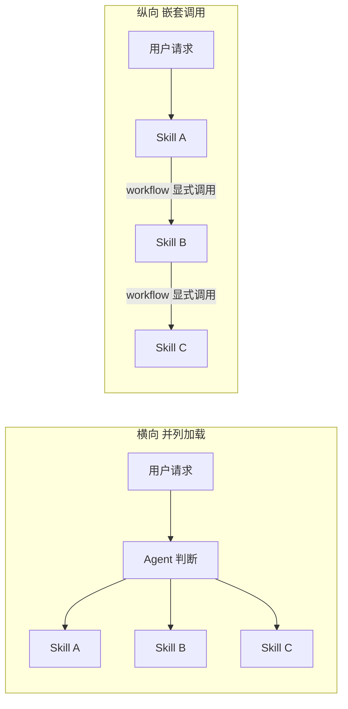

### 7.3 多 Skill 的使用顺序

顺序的决定权**主要在 Agent**，但有几条可以人为干预的杠杆：

**1. workflow 显式描述（最稳）**

在主 skill 的 workflow 章节用自然语言写清楚顺序：

```markdown
## Workflow
1. 先调用 baoyu-article-illustrator 完成配图，产出 illustrated.md
2. 再调用 baoyu-markdown-to-html，输入上一步产物
3. 最后调用 baoyu-post-to-wechat，使用第二步产出的 html
```

宝玉"五步法"中"分摊"的核心做法——**subagent 之间只传文件路径不传内容**——本质就是用文件链强制了顺序：上一个 skill 不产出文件，下一个 skill 没法启动。

**2. 模型自主排序**

没有显式编排时，Agent 会综合以下信号自行排序：

- **依赖关系**：A 的输入需要 B 的输出，则 B 先；
- **副作用最小化**：只读 skill 优先于写 skill，避免半成品发出去；
- **用户原话的时间词**："先 A 再 B" 会被尊重；
- **description 中暗示的阶段**："generate cover" vs "post to wechat" 模型能识别前后语义。

**3. 优先级与命名空间冲突**

**同名 skill** 出现在多个作用域时，按优先级解决：

```
企业级 > 个人级 > 项目级 > 插件级
```

被覆盖的版本不会消失，会用 `apps/web:deploy` 这种**目录限定名**仍可访问。

**4. 强制隔离：subagent + context: fork**

担心多个 skill 互相污染上下文或顺序错乱时，可以给某些 skill 配置 `context: fork` + `agent`，让它在独立的 subagent 上下文里跑完再把结果交回主线程——这是处理"长任务、多 skill 链"最稳的做法。

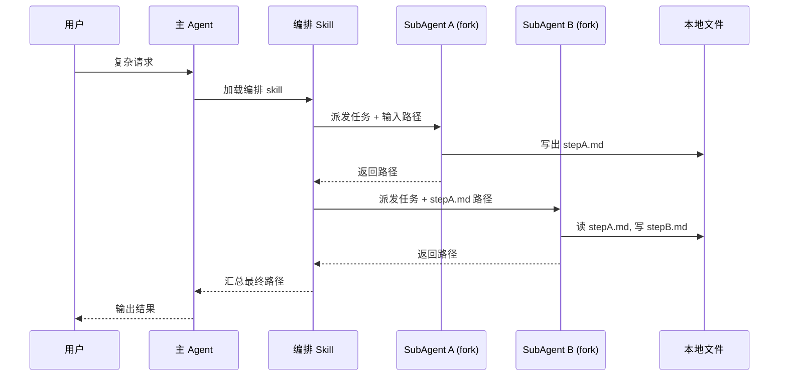

### 7.4 深入理解 `context: fork`

`context: fork` 是 SKILL.md YAML frontmatter 里的进阶字段，**一句话**：把这个 skill 的执行从主对话**"分叉"**到一个独立的 subagent 上下文里跑，跑完只把结果带回来。

#### 7.4.1 字段语义

```yaml
---
name: deep-codebase-review
description: 对整个仓库做架构级 code review，输出风险清单
context: fork          # 关键开关
agent: code-reviewer   # 指定要 fork 到哪种 subagent
allowed-tools: [Read, Grep, Bash]
---
```

`context` 字段两种取值：

| 取值 | 含义 |
| --- | --- |
| `inherit`（默认） | skill 内容直接注入**当前主对话**，与用户对话共享上下文窗口 |
| `fork` | skill 内容注入到一个**新开的 subagent 对话**，独立窗口、独立工具栈、独立模型 |

#### 7.4.2 底层原理

**(1) 默认 `inherit`：共享上下文**

skill 加载后，所有中间 tool output（Grep 5000 行、Read 大文件…）全部留在主对话窗口，**永远占用 token**，直到自动压缩或溢出。

**(2) `context: fork`：进程级隔离**

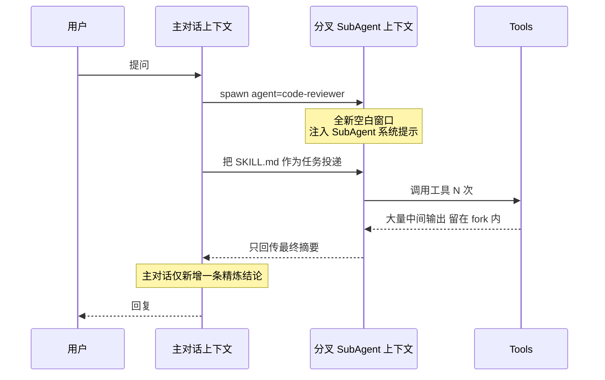

**(3) 系统提示与任务的双重组合**

| 启动方式 | 系统提示来源 | 任务来源 |
| --- | --- | --- |
| **Skill + `context: fork`** | `agent` 指定的 subagent 类型 markdown | **SKILL.md 内容** |
| Subagent + `skills` 字段 | Subagent markdown 正文 | 主 Agent 委派消息 |

注意：fork 模式下 **SKILL.md 本身被当作"派给 subagent 的任务说明书"**。所以官方警告：

> `context: fork` 仅对**具有明确任务**的 skill 有意义。若 skill 只是"指南/规则"而没有可执行任务，subagent 会拿到说明却不知道要做什么。

#### 7.4.3 适用场景

**场景 A 长任务 / 重 IO**

跨百文件代码审计、整库 Grep+Read、批量爬网页、长日志分析。所有中间内容不污染主对话，最终只回传"发现 12 个高风险点"。

**场景 B 并行多任务**

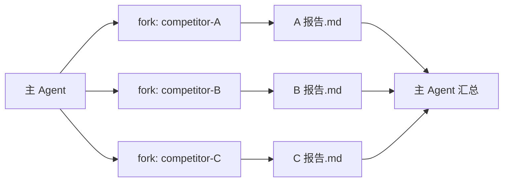

每个 subagent 独立窗口，**避免互相污染**，天然支持并行。

**场景 C 上下文洁癖（敏感数据）**

skill 会读到密钥、PII、内部敏感数据时，fork 后主对话从不接触这些内容，等于"用完即焚"。

**场景 D 工具权限隔离**

`allowed-tools` / `disallowed-tools` 在 fork 模式下只作用于 subagent。比如想给某 skill 临时开 `Bash` 但不让主对话有此权限：

```yaml
context: fork
agent: shell-runner
allowed-tools: [Bash, Read]
disallowed-tools: [Write]
```

**场景 E 固定剧本型 skill**

清晰的步骤列表（"第一步…第二步…输出格式：…"）非常适合 fork——subagent 拿到任务卡就开干，主对话只等结果。

#### 7.4.4 不适用场景

- **规则/指南型 skill**（代码风格规约、输出格式约定）——给主对话用的语境，fork 出去会"无事可做"；
- **需要与用户多轮对话的 skill**——fork 内的 subagent 通常不与用户直接交互；
- **轻量低 token 任务**——fork 启动有开销，得不偿失；
- **依赖主对话历史的 skill**——fork 拿不到主对话完整上下文，需要的信息必须显式放进 SKILL.md。

#### 7.4.5 与 Subagent + `skills` 字段的区别

| 维度 | Skill `context: fork` | Subagent 配 `skills` 字段 |
| --- | --- | --- |
| 入口 | 用户/主对话调用 skill 时触发 | 主 agent 用 Task 工具委派给 subagent |
| 谁是"任务" | SKILL.md 正文 | 主 agent 写的委派消息 |
| skill 加载时机 | 进入 fork 后即注入 | subagent 启动时**全量预加载** |
| 典型用法 | 把标准化的事丢出去做 | 派有领域知识的工人去解决任意问题 |

#### 7.4.6 最小完整示例

```yaml
---
name: ata-bulk-reader
description: 批量抓取 ATA 文章列表并产出摘要 markdown。使用场景：用户给一组 ATA URL 让你"批量提炼要点"。
context: fork
agent: web-researcher
allowed-tools: [Bash, Read, Write]
---

# 批量 ATA 抓取与提炼任务

## 任务
读取调用方传入的 URL 列表（在 references/urls.txt 中），逐个：
1. 调用 builtin_browser MCP 抓正文
2. 写到 ./out/<slug>.md
3. 在 out/INDEX.md 汇总 标题 + 一句话摘要

## 完成标准
- out/INDEX.md 存在且每个 URL 都有对应条目
- 失败的 URL 列在 out/INDEX.md 的"失败"段

## 回传
只回传 out/INDEX.md 的内容（不要回传所有正文）。
```

主对话调用它时，只会新增一条"成功处理 23 篇，失败 2 篇，详见 …"——干净、可控、可断点重跑。

#### 7.4.7 fork 与四角色关系全景

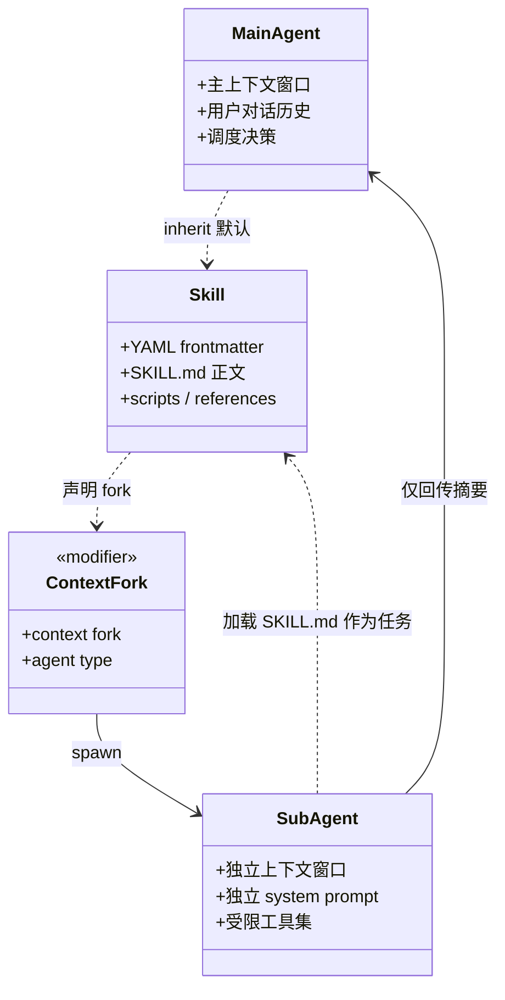

**一句话记忆**：`context: fork` = 把 skill 当作"任务卡"派给新开的 subagent 独立窗口跑，主对话只收最终摘要——用"进程隔离 + 结果回传"换取上下文卫生、并行能力和权限隔离。

### 7.5 一句话总结

**召回靠 description 让模型语义判断，可以同时召回多个，顺序优先看 workflow 显式编排、其次看文件依赖链、最后才交给模型自己排——想要稳，就把顺序写进 SKILL.md，并用中间文件强制串联。**

## 八、Skill 内引用资源的加载和解析

引用资源遵循"**按需读取**"原则，不会预加载：

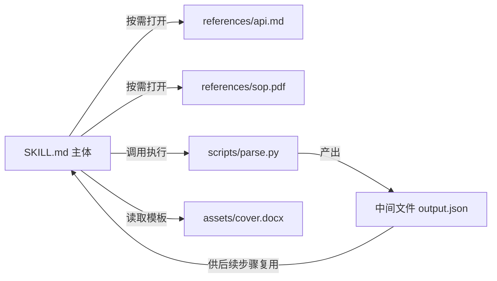

实践要点：

- 在 SKILL.md 主体中用相对路径引用：`参见 references/db_schema.sql`；
- Agent 读到该路径才会调用文件读取工具加载；
- 大型 PDF / Excel / 数据库 schema 一律外置，避免污染上下文；
- 中间产物**写入文件而非保留在内存**，可断点续传、可审计、可被 subagent 并行读取（宝玉"五步法"中的"存储"与"分摊"）。

## 九、Skill 中如何感知与调用 MCP

Skill 与 MCP 是**互补关系**：MCP 提供"手"，Skill 提供"操作手册"。

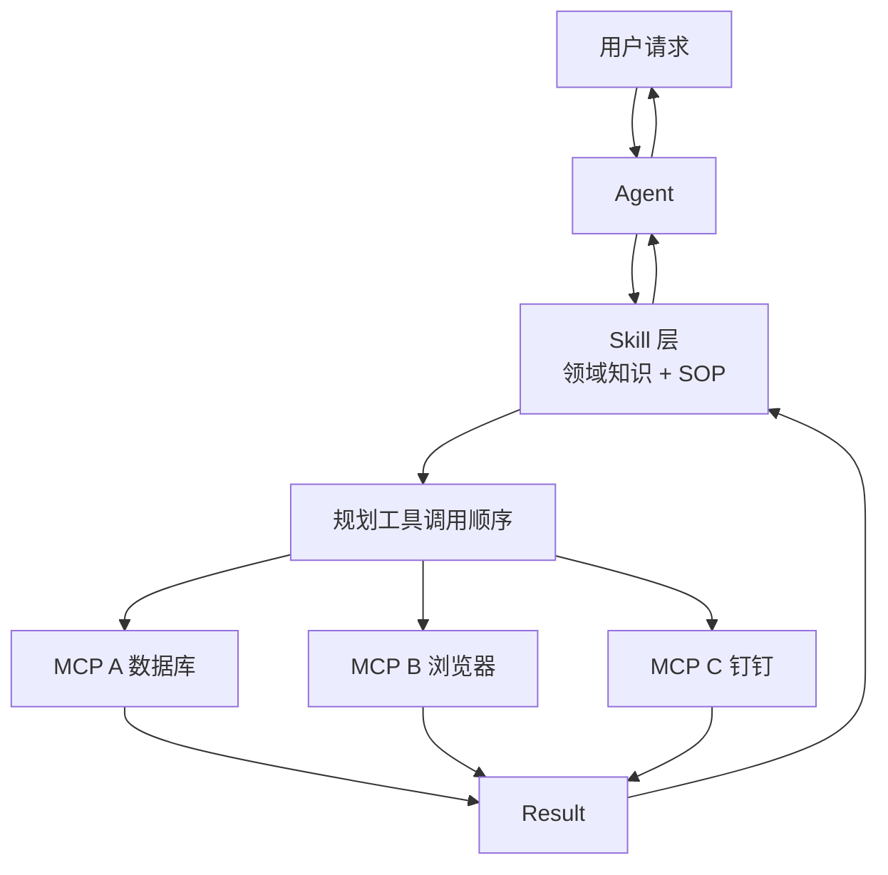

Skill 中感知 MCP 的常见方式：

- **YAML 字段声明**：`allowed-tools: ["mcp__yuque__*", "Bash"]` 圈定权限范围；
- **正文显式提示**：在 workflow 中写 "调用 `mcp__dms-mcp-server__executeScript` 执行查询"；
- **Skill 作为 MCP 网关**：把多 MCP 的复杂调用流程封装在 skill 中，Agent 只看到 skill，初始 token 消耗可从 16k 降至 500。

## 十、Skill 中如何调用与执行脚本

脚本是 Skill 中"确定性"的最后一道防线——凡是不依赖判断、需要精确计算的逻辑，都应交给脚本：

- **Python**：`python scripts/parse_excel.py input.xlsx`
- **Node / Bun**：`npx -y bun scripts/format.ts`
- **Shell**：`bash scripts/deploy.sh`

执行链路：

```mermaid
sequenceDiagram
    participant A as Agent
    participant S as SKILL.md
    participant Sh as Shell/Bash
    participant Py as Python 脚本
    participant FS as 本地文件
    A->>S: 加载 workflow
    S-->>A: 指令：运行 scripts/parse.py
    A->>Sh: 通过 Bash 工具执行
    Sh->>Py: python scripts/parse.py
    Py->>FS: 读输入 / 写输出
    FS-->>Py: 数据
    Py-->>Sh: stdout + exit code
    Sh-->>A: 命令输出
    A->>A: 解析结果继续后续步骤
```

注意点：

- 脚本路径用**相对路径**或 skill 根目录变量；
- 长输出建议写文件再读，避免占用上下文；
- 失败要有明确退出码与错误信息；
- 涉及破坏性操作（删除文件、发送消息）应有显式确认或干跑模式。

## 十一、沙箱机制

很多人聊"Skill 沙箱"时容易混在一起，其实是**两个独立的隔离层**：

| 层级 | 名称 | 作用 |
| --- | --- | --- |
| **L1 上下文沙箱** | Context Isolation | 隔离**对话上下文**，靠 `context: fork` + subagent 实现（已在 7.4 节展开） |
| **L2 执行沙箱** | Code Execution Sandbox | 隔离**代码/脚本/文件操作**，靠 VM / 容器 / 受限 shell 实现 |

本节专门讲 **L2 执行沙箱**——也就是 SKILL.md 里的 `scripts/` 在哪里、以什么权限运行。

### 11.1 为什么 Skill 需要执行沙箱

Skill 与传统 prompt 的本质差别是"可以跑代码"。一旦允许跑代码，就会面临三个直接风险：

1. **文件系统破坏**：脚本一个 `rm -rf` 就毁掉用户数据；
2. **网络外泄**：脚本把本地密钥/PII POST 到任意外网；
3. **进程逃逸**：脚本启动后台守护进程、修改 PATH、植入持久化。

Anthropic 在 Skill 设计文档里反复强调：

> Skills can include executable code for tasks where traditional programming is more reliable than token generation.

潜台词是——**既然要执行代码，就必须把代码"圈起来"跑**。这就是执行沙箱存在的根本理由。

### 11.2 沙箱强度梯度

Anthropic 在不同产品里用了不同强度的沙箱方案，按隔离强度排成一个梯度：

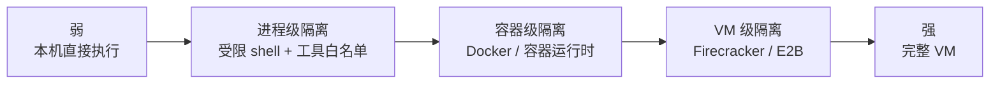

#### 11.2.1 Claude Code（本机直接执行 + 工具门控）

最常见、最轻量的实现，运行在用户本机：

- 脚本就是直接在用户 shell 里 `bash scripts/xxx.sh`、`python scripts/xxx.py`；
- "沙箱"靠**工具层授权**实现，而不是真正的进程隔离；
- 三层闸门：
  1. `allowed-tools` / `disallowed-tools` 决定 skill 能用哪些工具；
  2. `/permissions` 命令用户可单独允许/拒绝具体工具调用；
  3. 工作区信任（Workspace Trust）——项目级 skill 必须在用户接受信任后才会被加载。

特殊开关：

```jsonc
// settings.json
{
  "disableSkillShellExecution": true   // 完全禁用 !`<cmd>` 动态注入
}
```

设置后，所有 SKILL.md 里的 `` !`<command>` `` 动态命令将被替换为占位符不再执行。这是企业管控的常用做法。

#### 11.2.2 Claude.ai 沙盒 VM（最严的官方实现）

Claude.ai（Web 端）和 Claude API `code_execution_20250825` 工具在云端跑用户代码时，使用的是**真·VM 沙箱**：

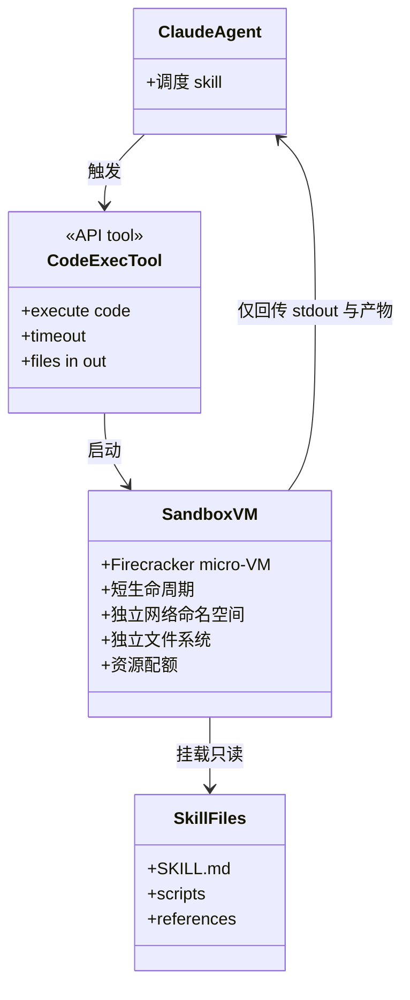

特点：

- 每次会话/任务启动一个**微型 VM**（Firecracker / gVisor 一类技术），生命周期短；
- VM 内自带 python、node、shell，但**对外网络默认关闭**或仅白名单；
- 用户上传的 skill 文件以**只读方式**挂载进 VM；
- VM 内产生的文件可以"导出"回主对话作为 artifact；
- VM 销毁后**所有状态清零**——下一次任务又是干净环境。

#### 11.2.3 QoderWork / 桌面态（受限 shell + 目录沙箱）

桌面态 Agent（Claude Code、QoderWork、OpenClaw 等）通常没法跑真 VM，会采用**目录沙箱 + 受限工具**的折中方案：

- 每个会话有一个 workspace 工作目录（QoderWork 的 `~/.qoderwork/workspace/<id>/`）；
- skill 优先在 workspace 内读写，主目录访问要走 `mcp__qoderwork__request_qoderwork_directory` 授权；
- 危险操作（`rm`、`shred`、`find -delete`）被工具层屏蔽，改走系统回收站；
- 凡是要写到 workspace 之外的路径，需要用户显式批准。

这是**"软沙箱"**——没有真隔离，但通过工具层把破坏面收敛到很小。

#### 11.2.4 第三方沙箱（E2B、Daytona、Modal、Codapi…）

社区把 skill 接入云端代码沙箱已经是常规打法：

- **E2B**：基于 Firecracker 的代码沙箱，2 秒内启动一个新 VM；
- **Daytona**：开发环境沙箱；
- **Modal**：函数级容器执行；
- **Codapi**：嵌入式代码运行环境。

用法是把 skill 的 `scripts/` 上传到沙箱跑，主 agent 通过 HTTP 调用沙箱拿结果——等效于把"本机 sandbox"换成"云端 sandbox"。

### 11.3 什么时候会触发沙箱执行

不是每次调用 skill 都跑沙箱。触发点有 5 类：

**触发 1：SKILL.md 中明确指令运行脚本**

```markdown
## Workflow
1. 运行 `python scripts/parse_excel.py input.xlsx`
2. 把输出 csv 喂给下一步
```

Agent 解析到 workflow 后通过 Bash/Shell 工具执行——在本机 shell 跑（Claude Code/QoderWork）或在 VM 跑（Claude.ai）。

**触发 2：动态 shell 注入**

```markdown
当前 Git 分支：!`git rev-parse --abbrev-ref HEAD`
今日日期：!`date +%Y-%m-%d`
```

这种命令在 **skill 加载时**就会执行——最容易被忽视的攻击面，可用 `disableSkillShellExecution` 关掉。

**触发 3：`allowed-tools` 包含执行类工具**

```yaml
allowed-tools: [Bash, Python, NodeRun]
```

只要 skill 里调用这些工具，就走对应运行时——本机或 VM。

**触发 4：Claude API code-execution-tool 工具被启用**

```json
{
  "tools": [{ "type": "code_execution_20250825" }],
  "skills": [...]
}
```

此时 skill 中的脚本会被路由到 **Anthropic 托管的沙箱 VM** 跑。

**触发 5：`context: fork` 内的脚本（双层沙箱）**

fork 出去的 subagent 自己也可能跑脚本，形成 **L1 上下文沙箱 + L2 执行沙箱**双重隔离：

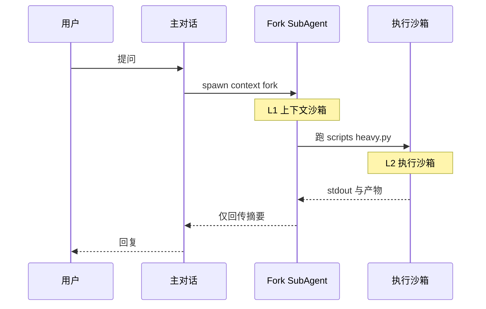

### 11.4 什么场景应该让脚本进沙箱

按风险等级倒序，**越往下越必须用沙箱**：

| 场景 | 是否必须沙箱 | 推荐方案 |
| --- | --- | --- |
| 纯计算（数学、文本处理） | 否 | 本机 python 即可 |
| 文件格式转换（pdf/docx/xlsx） | 否 | 本机 + 工具白名单 |
| 抓取公开网页并解析 | 建议 | 受限网络的容器/VM |
| 运行用户上传的脚本 | **必须** | 严格 VM 沙箱 |
| 跑模型生成的、未审计的代码 | **必须** | 严格 VM + 网络关闭 |
| 处理生产数据 / 含密钥 | **必须** | VM + 凭证隔离 + 只读挂载 |
| 多 skill 并行竞争资源 | 建议 | 多 VM 实例并发 |

### 11.5 沙箱安全相关 YAML 字段速查

写 skill 时常用的安全字段：

| 字段 | 作用 |
| --- | --- |
| `allowed-tools` | 工具白名单，最小权限原则 |
| `disallowed-tools` | 工具黑名单，移除危险工具 |
| `disable-model-invocation: true` | 禁止自动调用，必须 `/skill-name` 显式调用 |
| `context: fork` + `agent` | L1 上下文沙箱 |
| `paths` | 只在命中 glob 时激活，限制作用域 |
| `shell: bash` / `powershell` | 显式声明 shell 类型 |
| `hooks` | 在 skill 生命周期插入审计 / 拦截钩子 |

加上 settings 级：

| 设置项 | 作用 |
| --- | --- |
| `disableSkillShellExecution` | 禁用 `` !`...` `` 动态 shell 注入 |
| `Skill(name)` 权限规则 | 在 `/permissions` 中允许/拒绝特定 skill |
| 工作区信任 | 项目级 skill 必须接受信任才生效 |

### 11.6 给 skill 作者的安全清单

落地时按这份清单自检：

- ☐ scripts 里**不内嵌密钥**，从环境变量读
- ☐ 默认 **dry-run**，破坏性操作要 `--apply` 才执行
- ☐ 所有路径用**相对路径**或 skill 根目录变量
- ☐ 网络访问**列白名单**，不要 `curl <user-input>`
- ☐ stdin/参数**做转义**，避免命令注入
- ☐ 错误码与 stderr **明确语义**，便于 agent 处理
- ☐ 大输出**写文件**而不是直接打印
- ☐ 危险任务加 `context: fork` 走 subagent

### 11.7 一句话总结

> **Skill 沙箱 = "上下文沙箱（context: fork）" + "执行沙箱（VM / 受限 shell）" 的双层结构**。Claude.ai 用真 VM，桌面态 Agent 多用工具白名单 + workspace 目录的软沙箱。**只要 skill 涉及跑代码、动态 shell、写文件、访问网络，就应该至少启用一层沙箱**——零信任地对待自己的脚本，是 skill 工程化的底线。

## 十二、Claude 如何决定脚本在哪里执行

承接上一节自然产生的疑问：**写好一段 `python scripts/parse.py`，到底会落到本机 shell 还是沙箱 VM？Claude 怎么判断？**

### 12.1 核心结论

> **Claude（LLM）自己其实并不"判断"——决定权完全在运行时（runtime）层。**
>
> LLM 只生成"我要跑这条命令"的意图（tool_use），到底落到本机还是沙箱，由"它当前接的是哪个 Bash 工具实现"完全决定，与 SKILL.md、与模型本身都无关。

LLM 输出的永远只是一段 JSON：

```json
{"name": "Bash", "input": {"command": "python scripts/parse.py input.xlsx"}}
```

**"Bash"这个工具背后接的是谁，决定了它跑在哪。**

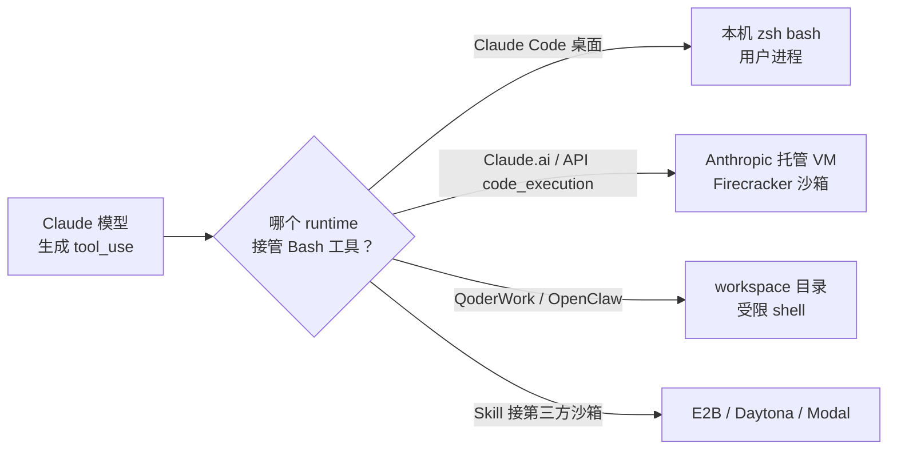

### 12.2 为什么会这样：tool_use 协议的设计

理解这点要回到 Anthropic 的工具调用协议：

1. **工具是"接口"，不是"实现"**：模型只知道工具的 schema（名字 + 参数），不知道实现细节；
2. **工具实现由宿主提供**：CLI 把 `Bash` 实现成 `child_process.spawn`；Claude.ai 把 `Bash` 实现成 "POST 到 sandbox VM 的 /exec"；
3. **同一个模型、同一个 skill，换一个宿主就换一种执行模式**——这就是 skill 跨工具可移植的根本原因。

举个对比：

| 宿主 | "Bash" 工具的实现 | 命令最终落到哪 |
| --- | --- | --- |
| Claude Code（本机） | `spawn('bash', ['-c', cmd])` | 用户的 zsh 进程 |
| Claude.ai（Web） | HTTP → Anthropic Sandbox API | 微 VM 容器 |
| API + `code_execution_20250825` | 同上 | 同上 |
| QoderWork 桌面 | `spawn(...)` + 路径白名单 + 危险命令拦截 | 用户的 shell（受限） |
| 接了 E2B 的 Agent 框架 | E2B SDK → `sandbox.commands.run()` | E2B 云上 VM |

**Claude 模型本身全程"以为"自己在跑同一个 Bash**——它不知道，也不需要知道。

### 12.3 真正的判断发生在哪：三层路由

虽然 LLM 不判断，但确实有"判断"在发生，只不过都在**宿主的工具路由层**：

**第 1 层：宿主选择实现**

Agent 启动时，宿主就决定了"我的 Bash 工具用哪个 backend"。例如 Claude API：

```python
client.messages.create(
    model="claude-sonnet-4",
    tools=[
        {"type": "code_execution_20250825"},   # ← 这一行决定 Bash 走云 VM
        # 不加这行，就走调用方自己实现的 Bash
    ],
    skills=[...]
)
```

只要加上 `code_execution_20250825`，**Anthropic 服务端就把所有代码执行类工具调用劫持到自己的沙箱**，调用方根本看不到。

**第 2 层：工具名前缀路由（多沙箱共存）**

有些宿主会同时挂多个执行工具，让 LLM 选：

```yaml
allowed-tools:
  - Bash               # 本机执行
  - SandboxBash        # 沙箱执行
  - E2BPython          # E2B 云执行
```

这时 SKILL.md 里写明：

```markdown
## Workflow
1. 在沙箱里跑模型生成的代码，用 `SandboxBash`
2. 在本机读 Excel，用 `Bash`
```

**LLM 是"按工具名"选的**——这是唯一可以让 SKILL.md 显式控制执行环境的方式。

**第 3 层：宿主内部再路由**

即使 LLM 调了 "Bash"，宿主内部也可能根据命令本身再路由——Claude Code 看到危险命令会拦下来；QoderWork 看到 `rm -rf` 会改写为 `mv ~/.Trash/`；某些框架会"嗅探"命令然后自动塞进容器跑。

### 12.4 Claude.ai 与 Claude Code 的真实差别

最容易混淆的一对，单独对比：

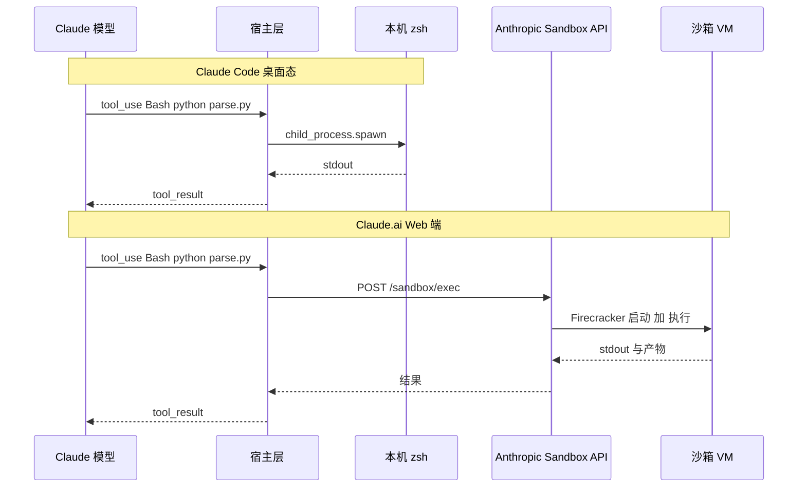

两条路径**对 LLM 完全透明，tool_use 长得一模一样**，唯一差别是"Host"那个盒子里发生了什么。

### 12.5 Skill 作者如何控制执行环境

既然 LLM 自己不判断，作者只能通过**工具选择**间接表达意图：

**方案 A：依赖宿主默认行为**

不写任何特殊字段，让宿主决定。这是最常见的做法——Claude.ai 用户跑这个 skill 就自动进沙箱，Claude Code 用户跑就自动在本机。Skill 不需要为此做任何事。

**方案 B：声明特定工具名**

```yaml
allowed-tools: [SandboxBash, SandboxPython]
disallowed-tools: [Bash]   # 禁掉本机 Bash
```

效果：LLM 只能调沙箱版本，本机直接关掉。这要求宿主真的提供了 `SandboxBash` 这种工具。

**方案 C：`context: fork` 间接进入"重沙箱模式"**

某些宿主把 fork 实现成"另开一个进程 + 更严的工具集"——例如 fork 出去的 subagent 只配沙箱 Bash 不配本机 Bash。

**方案 D：在 workflow 里写明**

```markdown
## Workflow
**重要：以下脚本必须在沙箱中执行，禁止在本机直接 bash。**
1. 调用 `SandboxBash` 执行 `python scripts/untrusted.py`
```

这是"提示词层"约束——但请记住：**如果宿主只挂了一个本机 Bash，写得再凶也没用**。

### 12.6 容易踩的坑

很多人以为：

> "我 SKILL.md 里写了 `context: fork`，脚本就进沙箱了。"

**错。** `context: fork` 只做 **L1 上下文隔离**——它换的是"对话上下文"，不是"shell 实现"。fork 出去的 subagent 默认还是用同一个宿主的 Bash 工具，**该在本机跑还在本机跑**。

要真进 L2 执行沙箱，必须靠：

- 宿主选择了沙箱 backend（最根本），或
- skill 里只允许调"沙箱版"的工具（最显式）

两条任一才行。

### 12.7 一句话总结

> **Claude 不"判断"，宿主才判断**——LLM 发出的 `Bash` 是一个抽象接口，运行时把它接到本机 shell 还是接到 VM 沙箱，决定权在宿主层。Skill 作者能做的只有两件事：**(1)** 信任宿主默认行为；**(2)** 通过 `allowed-tools` / `disallowed-tools` 显式选择沙箱版工具。`context: fork` 与 sandbox 是**两件正交的事**，不要把它们当同一个东西。

## 十三、用户级与项目级 Skill

Skill 可以放在三种作用域（以 Claude Code 为例，其他工具对应即可）：

| 作用域 | 路径 | 适用范围 | 优先级 |
| --- | --- | --- | --- |
| 企业 | 托管设置目录 | 组织所有用户 | 最高 |
| 个人/用户 | `~/.claude/skills/<name>/SKILL.md` | 所有项目 | 中 |
| 项目 | `<project>/.claude/skills/<name>/SKILL.md` | 当前项目 | 低 |
| 插件 | `<plugin>/skills/<name>/SKILL.md` | 启用该插件处 | 由插件管理 |

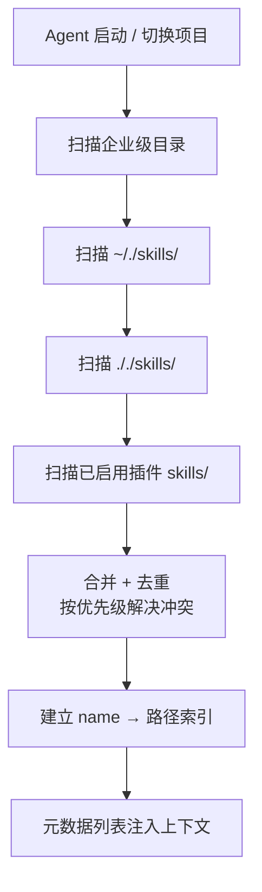

**嵌套发现**：从当前目录到仓库根的所有 `.claude/skills/` 都会被加载；monorepo 中可在子项目放专属 skill，冲突时使用目录限定名（如 `apps/web:deploy`）。

**实时变更**：现有目录下的增删改即时生效，无需重启；新增顶级 skills 目录通常需重启。

## 十四、Claude 源码层面的 Skill 处理（要点）

Claude Code 中关于 skill 的核心实现并未完全开源，但通过公开文档和社区逆向，可总结如下要点：

- **启动期**：递归扫描企业/用户/项目/插件四类目录，解析 YAML frontmatter，构造 `SkillIndex`；
- **对话期**：将 `name + description` 列表按 `skillListingBudgetFraction` 比例注入系统提示；
- **调用期**：当 Agent 决定使用某 skill 时，触发 `LoadSkill(name)`，把 SKILL.md 正文作为"单条 user/system message"注入会话；
- **资源期**：脚本与 references 走 Read/Bash 等工具按需读取，不进入预加载；
- **安全期**：`allowed-tools` 在工具调用栈前置过滤，`disable-model-invocation` 在 router 阶段直接屏蔽自动加载。

社区开源参考实现：

- `openskills`（[numman-ali/openskills](https://github.com/numman-ali/openskills)）：让任意 AI 工具支持 skill 规范的中间层；
- `skill_mcp`（[ephemeraldew/skill_mcp](https://github.com/ephemeraldew/skill_mcp)）：把 skill 当作 MCP Server 暴露给不原生支持的工具；
- `vercel-labs/skills`：Vercel 维护的开放 skill 集合与 CLI（`npx skills add ...`）。

## 十五、支持 Skill 的 AI 工具对比

| 工具 | 项目级目录 | 全局目录 | 备注 |
| --- | --- | --- | --- |
| Claude Code | `.claude/skills/<name>/` | `~/.claude/skills/<name>/` | 官方实现，能力最全 |
| Agent 通用 | `.agents/skills/<name>/` | `~/.agents/skills/<name>/` | OpenSkills 默认路径 |
| Qoder / QoderWork | `<project>/.qoder/skills/` | `~/.qoderwork/skills/` | 与 MCP/Connector 深度集成 |
| OpenClaw | `.openclaw/skills/` | `~/.openclaw/skills/` | 国产开源 Agent |
| OpenCode | `.opencode/skills/<name>/` | `~/.config/opencode/skills/<name>/` | 终端 Agent |
| Cursor | 暂不原生支持 | 借助 OpenSkills | 通过 MCP 桥接 |
| iFlow CLI | `.iflow/skills/` | `~/.iflow/skills/` | 阿里 CLI |
| Antigravity / Codex | 工具内置目录 | 同上 | 兼容 Claude skill 规范 |
| OneDay | — | [1d.alibaba-inc.com/skills](https://1d.alibaba-inc.com/skills) | 阿里内网工具 |

**机制差异主要在三处**：

1. 扫描路径与命名空间不同（部分支持插件命名空间）；
2. YAML 字段支持度不同（`context: fork`、`hooks` 是 Claude 特有）；
3. 安全/沙盒能力不同（Claude 提供 VM 沙盒，部分工具仅本机执行）。

## 十六、在各种 AI 工具中如何正确使用 Skill

**通用三种使用方式**：

1. **自动触发**：自然语言描述请求，Agent 根据 description 自动匹配并调用：
   ```text
   "帮我读取 report.pdf 的内容"  → 自动调用 pdf skill
   "把这篇文章发到微信公众号" → 自动调用 baoyu-post-to-wechat
   ```
2. **显式调用（Slash 命令）**：
   ```text
   /pdf 提取 report.pdf 中的表格
   /pptx 创建瓴羊公司介绍 PPT
   /agent-browser 登录 ATA 抓取最新文章
   ```
3. **在 skill 中调用 skill**：写在 SKILL.md 的 workflow 中，例如"调用 baoyu-cover-image 生成封面，然后调用 baoyu-post-to-wechat 发布"。

**Qoder/QoderWork 中的安装与使用**：

```bash
# 前置依赖
brew install node

# 通用 CLI 安装
npx skills add <owner/repo>
npx skills add vercel-labs/skills
npx skills add https://github.com/vercel-labs/skills --skill find-skills -a qoder

# 安装位置（QoderWork）
~/.qoderwork/skills/<name>/SKILL.md
```

## 十七、Skill vs Workflow：区别与优势

```mermaid
flowchart LR
    subgraph WF["Workflow 可视化拖拽"]
        W1["确定性高"]
        W2["可审计"]
        W3["平台锁定"]
        W4["复杂逻辑难表达"]
        W5["搭好就慢慢过时"]
    end
    subgraph SK["Skill 自然语言模块"]
        K1["按需加载"]
        K2["可组合"]
        K3["可版本化 / Git 管理"]
        K4["可演化 / 越用越好"]
        K5["跨工具可迁移"]
    end
```

**宝玉总结的核心论断**：大部分 workflow 编排场景，都可以被 Agent + Skills 取代。Skills 是"活的、可进化的自动化资产"。

## 十八、Workflow 如何快速稳定迁移到 Skill：五步法

借鉴宝玉博客《五步框架把 Workflow 变成可进化的 Skill》：

```mermaid
flowchart TB
    Start["现有 Workflow"] --> Step1
    Step1["1 拆分<br/>单一职责 skill / subagent"] --> Step2
    Step2["2 编排<br/>主 skill 用自然语言串联"] --> Step3
    Step3["3 存储<br/>所有中间结果落本地文件"] --> Step4
    Step4["4 分摊<br/>subagent 只传文件路径"] --> Step5
    Step5["5 迭代<br/>让 AI 自己修 prompt / system"]
    Step5 --> Better["越用越准的 Skill"]
```

具体到一个写作流的迁移：

```text
article-analyzer.md → outliner.md → writer-agent.md → polish.md
       ↓                  ↓                 ↓             ↓
   analysis.md       outline-a.md     draft.md        final.md
```

## 十九、Agent / SubAgent / Skill / MCP / 文档 / 脚本的关系

```mermaid
classDiagram
    class Agent {
        +接收用户请求
        +规划任务
        +调度 subagent
    }
    class SubAgent {
        +独立上下文窗口
        +专项任务执行
    }
    class Skill {
        +领域知识 SOP
        +指令 + 资源 + 脚本
    }
    class MCP {
        +外部工具连接
        +tools/resources/prompts
    }
    class Document {
        +references 长文档
        +外置避免污染上下文
    }
    class Script {
        +确定性执行
        +Python / Node / Shell
    }
    Agent o-- SubAgent : 委派
    Agent ..> Skill : 加载与调用
    SubAgent ..> Skill : 也可加载
    Skill o-- Document : 按需引用
    Skill o-- Script : 按需调用
    Skill ..> MCP : 调用工具
    Agent ..> MCP : 直接调用
```

工作流程中的协同关系：

- **Agent** 是大脑，负责理解请求、选择 skill、综合输出；
- **SubAgent** 是专门工人，吃下一份 skill 与一份文件路径，专注产出；
- **Skill** 是岗位说明书，告诉 Agent/SubAgent "怎么做这件事"；
- **MCP** 是工具箱，提供"做事的手"；
- **文档/脚本** 是工艺手册和精密仪器，Skill 在恰当时点引用。

## 二十、Skill 对 Agent 上下文的影响

**Skill 过大对上下文的影响主要有三类**：

1. **元数据膨胀**：description 太长 → 元数据列表占用过大，可能触发预算上限被截断；
2. **正文膨胀**：SKILL.md 主体超过 500 行 → 调用后长时间占用上下文，挤压用户问答空间；
3. **资源未外置**：把大段示例、数据、长文档塞入 SKILL.md 主体 → 一次加载吃掉数千 token。

**优化策略**：

- description 控制在 1–2 句；
- 主体保持 < 500 行；
- 长内容外置到 `references/`；
- 中间数据走文件、不走上下文；
- 用 subagent + skill 拆分长任务（context: fork）。

## 二十一、如何从 0 开始开发实用 Skill

```mermaid
flowchart LR
    A["1 选场景<br/>找高频痛点"] --> B["2 抽流程<br/>明确步骤与边界"]
    B --> C["3 写 SKILL.md<br/>YAML + workflow"]
    C --> D["4 拆资源<br/>scripts/references/assets"]
    D --> E["5 跑一遍<br/>在真实任务中验证"]
    E --> F["6 对照评测<br/>开/关 skill 跑同一任务"]
    F --> G["7 持续迭代<br/>记录坑点、补充示例"]
```

**开发要点**：

- 先用 `skill-creator` 或 `find-skills` 看市场是否已有现成；
- description 至少经过两轮"换个说法用户会怎么问"的打磨；
- 用 `skill-creator deep-dive` 中提倡的"基线对比法"（同一任务在启用/禁用 skill 下分别跑一次）评估真实增益，避免被书写 skill 的对话上下文蒙蔽；
- 失败重跑要可断点续传：用文件保存中间结果；
- 涉及秘钥、付费 API 的部分必须支持干跑（dry-run）。

## 二十二、Skill 编写注意事项（让 Agent 更稳更准）

- **单一职责**：一个 skill 只做一件事，宁可多写几个；
- **确定性前置**：复杂计算/格式化用脚本，避免依赖 LLM 自由发挥；
- **触发词富集**：在 description 与 when_to_use 中放足够多用户可能用到的同义词；
- **失败显式化**：脚本失败要 exit code + 明确 stderr，便于 Agent 自动恢复；
- **路径全部相对**：保证跨机器可移植；
- **避免破坏性默认**：删除/发送类操作默认 dry-run，需显式确认；
- **可观测性**：把每步关键决策与输出落到日志或中间文件中。

## 二十三、Skill 简洁还是覆盖多场景？度的把握

实战经验：

- **小而精** 通常优于 **大而全**。一个 SKILL.md 超过 500 行就该考虑拆分；
- 若任务存在 2–3 个**显著不同的分支**，用 if/else 描述即可；超过 5 个分支应拆为多个 skill；
- 把"通用工具型"（如 image-gen、format-markdown）做成原子 skill；
- 把"业务流程型"（如 article-illustrator）做成组合 skill，复用底层原子；
- 衡量标准：**新人接手 5 分钟内能否搞清楚这个 skill 做什么**。

## 二十四、AI 对话流程如何快速转成 Skill

可复制的工作流：

1. 让 AI 总结刚才对话中的"可复用步骤"；
2. 用 `/skill-creator` 让 AI 生成 SKILL.md 雏形；
3. 把对话里产生的关键提示词、命令、文件路径补到对应章节；
4. 用一次新对话从零跑通 skill，检验是否覆盖；
5. 把坑点、变体写到 `Pitfalls` 与 `examples/`；
6. 落入个人或团队的 skill 仓库，纳入 Git。

## 二十五、Skill 的应用场景与不适用场景

**适合 Skill 的场景**：

- 输入多变需要判断的任务（多种格式文档、各类数据分析）；
- 跨系统协调的复杂流程（搭配多 MCP 服务）；
- 需要频繁迭代的工作流；
- 团队内需要复用、分享的自动化逻辑。

**不适合 Skill 的场景**：

- 严格审计与合规要求的金融/医疗流程（更适合固定 workflow）；
- 每秒数百次的超高频简单任务（直接写脚本更划算）；
- 非技术用户自助调流程（可视化 workflow 更友好）；
- 任务过于一次性、没有复用价值。

## 二十六、Skill 开放市场

| 市场 | 地址 | 简介 |
| --- | --- | --- |
| skills.sh | <https://skills.sh/> | OpenClaw 官方 |
| Anthropic Skills | <https://github.com/anthropics/skills> | 官方仓库 |
| Awesome Claude Skills | <https://github.com/ComposioHQ/awesome-claude-skills> | 社区精选 |
| clawhub | <https://clawhub.ai/skills?sort=downloads> | 社区市场 |
| claudemarketplaces | <https://claudemarketplaces.com/skills> | 社区市场 |
| Qoder 社区 | <https://qoder-community.pages.dev/zh/skills/> | Qoder 生态 |
| 卧虎 Skills | <https://skill.antgroup-inc.cn/> | 蚂蚁内网 |
| 蚂蚁 Skills | <https://antskill.alipay.com/skills> | 蚂蚁内网 |
| Aone Skills | <https://open.aone.alibaba-inc.com/market?group=AGENT_SKILL> | 阿里内网 |
| OneDay 技能市场 | <https://1d.alibaba-inc.com/skills> | 阿里内网 |
| 虾小宝 AI Skills 地图 | <https://ai.skillatlas.cn/> | 中文聚合 |
| GitHub Topic skill | <https://github.com/topics/skill> | 全量索引 |

## 二十七、好用的 Skill 推荐

### 通用基础

- **find-skills**（`vercel-labs/skills`）：智能检索 skill 仓库
- **skill-creator**（`anthropics/skills`）：创建/优化你的 skill
- **prompt-optimizer / skill-optimizer**（`chujianyun/skills`）：优化提示词与 skill 本身
- **humanizer / Humanizer-zh**：去 AI 味
- **办公安全自检**（OpenClaw）：检查 skill 合规

### 文档/办公

- **pdf / pptx / docx / xlsx**（`anthropics/skills`）：办公套件
- **baoyu-format-markdown / baoyu-markdown-to-html**：排版与转换
- **obsidian skill**：依赖 `obsidian-cli`

### 浏览器/网页

- **agent-browser**（`vercel-labs/agent-browser`）：浏览器自动化
- **dev-browser**（`SawyerHood/dev-browser`）：开发友好的浏览器 skill
- **intranet-reader**：用 Chrome 登录态读内网页面（ATA / 语雀 / 钉钉文档）

### 内容创作（baoyu-skills 系列，强推）

- **baoyu-article-illustrator / baoyu-cover-image / baoyu-infographic**
- **baoyu-post-to-wechat / baoyu-post-to-weibo / baoyu-post-to-x**
- **baoyu-xhs-images**：小红书图文一键生成

### 钉钉/企业

- **dingtalk-ai-table / dingtalk-docs**（`aliramw`）：钉钉表格与文档 OpenClaw skill
- **dws**：钉钉全家桶（日历/通讯录/审批/AI 表格/听记…）

### 业务相关

- **专利创新提案撰写助手**（Aone）
- **小红书 Skill**（`white0dew/XiaohongshuSkills`）：发布/评论/检索
- **odps skill**：阿里内网数据分析

## 二十八、总结

Skill 的本质是把"高质量的工作经验"从隐性变成显性，从一次性变成可复用，从模型自由发挥变成可控、可演化的资产。它不是"更长的 prompt"，而是 **Agent 时代的 SOP + 工具箱 + 知识库**。

掌握 Skill 之后，你会经历三个阶段：

1. **使用者**：装 find-skills，用别人的 skill 提效；
2. **创作者**：把自己重复做的事沉淀成 skill，越用越准；
3. **生态者**：把团队/业务流程模块化成 skill 集合，借 MCP+SubAgent 跑成"自动化资产"。

**一句话记忆**：

> MCP 让 Agent "够得着"，Skill 让 Agent "会做事"，Subagent 让 Agent "做得起长任务"，文件让 Agent "记得住"。

---

## 参考文档

### 概念与原理

- [Claude Code Docs：使用 skills 扩展 Claude](https://code.claude.com/docs/zh-CN/skills)
- [Anthropic 官方 Skills 完整指南：17 个开源技能深度解析 - ClaudeWorld](https://claude-world.com/zh-tw/articles/anthropic-official-skills-complete-guide/)
- [hello-agents Extra05：Agent Skills 解读](https://github.com/datawhalechina/hello-agents/blob/main/Extra-Chapter/Extra05-AgentSkills%E8%A7%A3%E8%AF%BB.md)
- [hello-agents Extra08：如何写出好的 Skill](https://github.com/datawhalechina/hello-agents/blob/main/Extra-Chapter/Extra08-%E5%A6%82%E4%BD%95%E5%86%99%E5%87%BA%E5%A5%BD%E7%9A%84Skill.md)
- [一文读懂 Skills｜从概念到实操的完整指南 - 知乎](https://zhuanlan.zhihu.com/p/1999165163396436843)
- [Skills 教程 | 菜鸟教程](https://www.runoob.com/vibe-coding/skills-agent.html)
- [一文带你看懂，火爆全网的 Skills 到底是个啥 - 腾讯云开发者社区](https://cloud.tencent.com/developer/article/2616510)
- [Skill 被广泛应用，到底什么是 Skill - 掘金](https://juejin.cn/post/7620259259633942568)
- [Skill 功能介绍 - JoyAgent 智能体平台](https://docs.jdcloud.com/cn/agents/skill)

### 方法论与最佳实践

- [宝玉：你可能不再需要 workflow，大部分场景 skills 足矣](https://baoyu.io/blog/2026/01/10/agent-skills-replace-workflow)
- [Claude Skills 深度解析：从 skill-creator 看技能创建最佳实践](https://skills.deeptoai.com/zh/docs/development/skill-creator-deep-dive)
- [极速开发出一个高质量 Claude Agent Skills 最佳实践 - ATA](https://ata.atatech.org/articles/12020530837)
- [Claude Skills - 将 Agent 变为领域专家 - ATA](https://ata.atatech.org/articles/12020489617)
- [Skill 实践&测试：基于 iFlow CLI 的自定义 skill - ATA](https://ata.atatech.org/articles/11020532920)
- [Skills 真的可以帮我干活了：工单分析变 Skill - ATA](https://ata.atatech.org/articles/11020554851)
- [关于 Agent SKILL 落地中的一些思考以及不足 - ATA](https://ata.atatech.org/articles/11020534870)
- [Claude Agent Skills 原理解析 - ATA](https://ata.atatech.org/articles/12020537702)
- [Claude 进阶：Agent Skills & 与工作结合的示例 - ATA](https://ata.atatech.org/articles/12020555604)
- [Skills + Subagents 让你的 Agent 跑起长任务 - ATA](https://ata.atatech.org/articles/11020568428)
- [基于 SKILL+MCP 的 Claude Agent 实践：1688 广告效果诊断助手 - ATA](https://ata.atatech.org/articles/11020535212)
- [Skills 实践，论如何训练最符合"岗位"要求 - ATA](https://ata.atatech.org/articles/11020568435)
- [一份从"技术方案"到"专利创新提案"的提示词&SKILL - ATA](https://ata.atatech.org/articles/11020534550)
- [奇点学堂：Claude Skill 是一种文件夹式功能封装机制](https://grow.alibaba-inc.com/letters/5783)
- [《Skills 介绍》钉钉文档](https://alidocs.dingtalk.com/i/nodes/Qnp9zOoBVBDEydnQU52glgMM81DK0g6l)

### 工具与使用

- [在 Cursor 中使用 Skills - ATA](https://ata.atatech.org/articles/11020534846)
- [在 Qoder 玩转 Skills - ATA](https://ata.atatech.org/articles/11020586804)
- [如何在 Qoder/Qwen Code/Antigravity 中使用 Skills - ATA](https://ata.atatech.org/articles/12020535328)

### 开源仓库与市场

- [agentskills.io](https://agentskills.io/home)
- [vercel-labs/skills](https://github.com/vercel-labs/skills)
- [anthropics/skills](https://github.com/anthropics/skills)
- [JimLiu/baoyu-skills](https://github.com/JimLiu/baoyu-skills)
- [chujianyun/skills](https://github.com/chujianyun/skills)
- [cafe3310/public-agent-skills](https://github.com/cafe3310/public-agent-skills)
- [numman-ali/openskills](https://github.com/numman-ali/openskills)
- [ephemeraldew/skill_mcp](https://github.com/ephemeraldew/skill_mcp)
- [white0dew/XiaohongshuSkills](https://github.com/white0dew/XiaohongshuSkills)
- [aliramw/dingtalk-ai-table](https://github.com/aliramw/dingtalk-ai-table)
- [aliramw/dingtalk-docs](https://github.com/aliramw/dingtalk-docs)
- [ringhyacinth/Star-Office-UI](https://github.com/ringhyacinth/Star-Office-UI)

