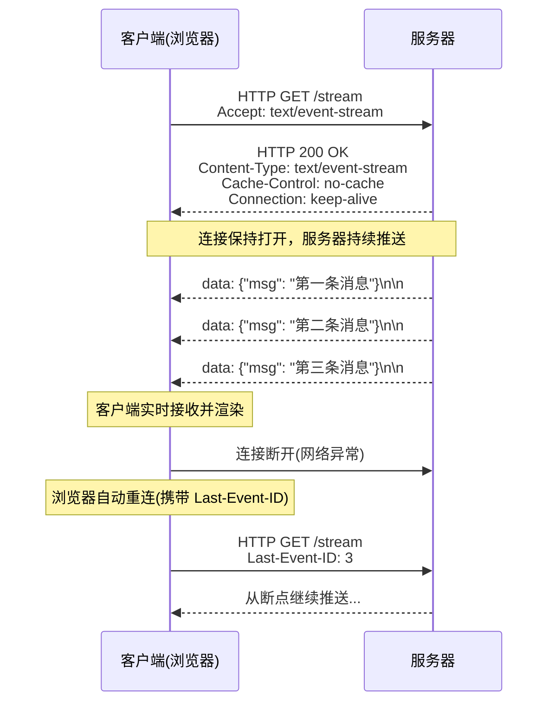
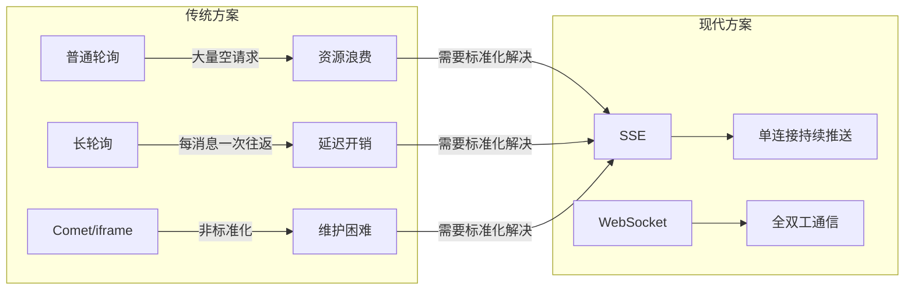
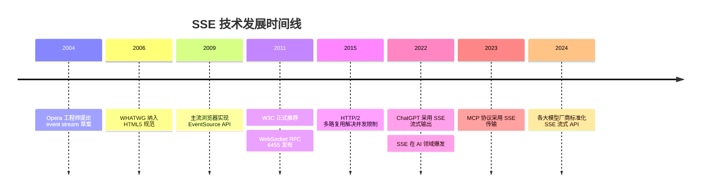
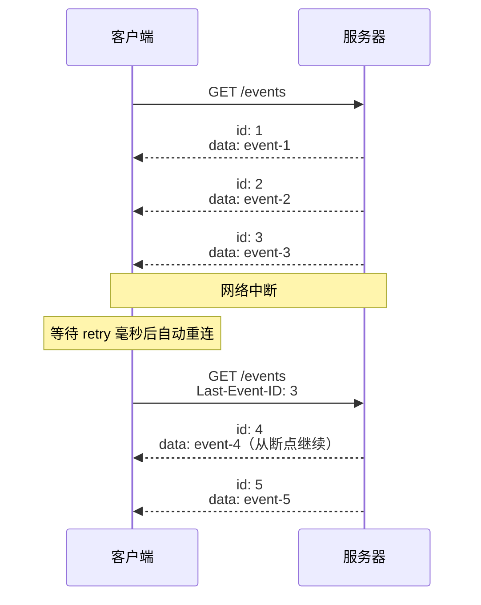
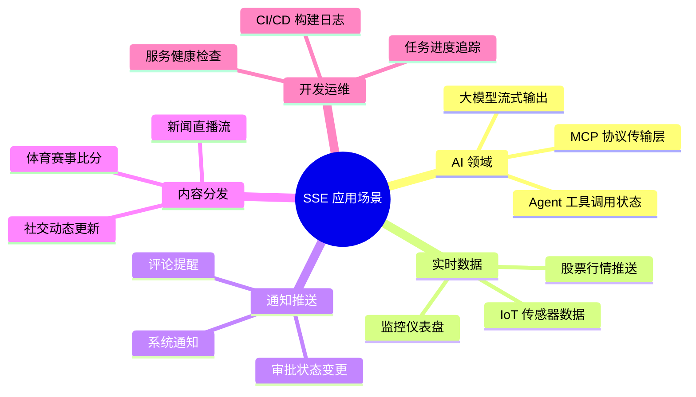
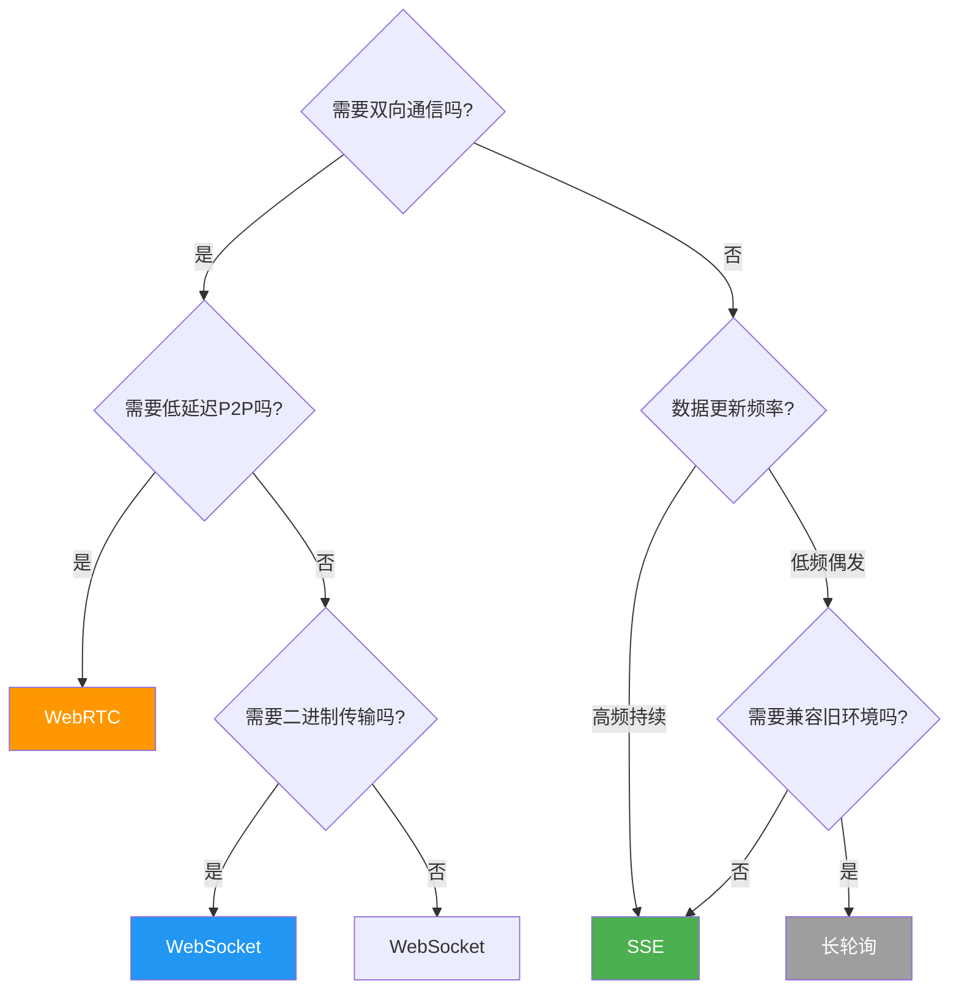
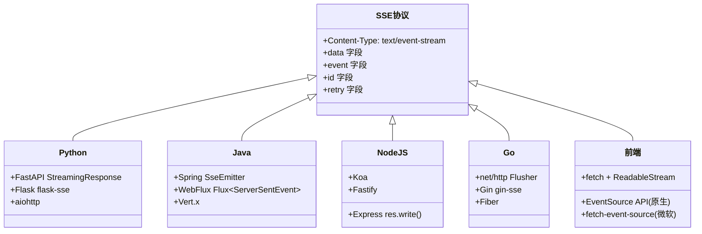
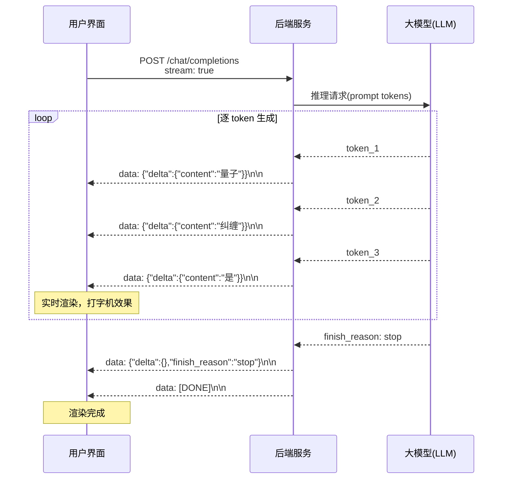
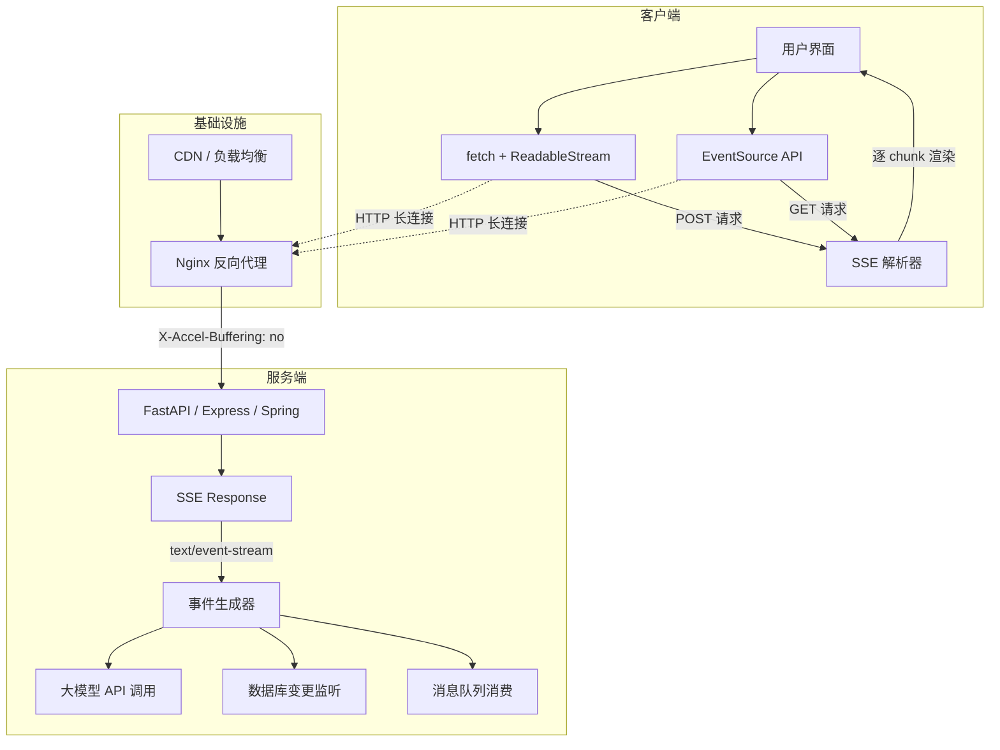

## SSE 是什么

SSE（Server-Sent Events，服务器发送事件）是一种基于 HTTP 协议的服务器推送技术，允许服务器通过一个持久化的 HTTP 连接，单向地向客户端实时推送数据。它由 W3C 标准定义，浏览器通过原生的 `EventSource` API 即可接收服务器推送的事件流，无需任何第三方库。

SSE 的本质是 **"HTTP 扩展字段 + Keep-Alive 长连接"**。客户端发起一个普通的 HTTP GET 请求，服务器不会一次性返回完整响应并关闭连接，而是保持连接打开，以 `text/event-stream` 格式持续向客户端推送文本数据。每当服务器有新数据产生时，就通过这个已建立的连接发送一个事件，客户端实时接收并处理。



SSE 具备三个核心特征：单向通信（服务器到客户端）、基于标准 HTTP 协议（无需协议升级）、浏览器原生支持自动重连。这些特性使它在需要服务器主动推送且不要求客户端反向发送大量数据的场景中，成为最简洁高效的选择。


## SSE 出现背景

Web 诞生之初采用"请求-响应"模型：客户端发起请求，服务器返回响应，连接即关闭。这种模型天然适合静态页面浏览，却无法满足实时数据推送的需求——服务器无法主动告知客户端"有新数据了"。

随着 Web 应用从静态页面演进为动态交互应用（如邮件客户端、股票行情、即时通讯），开发者不得不采用各种"变通方案"来模拟服务器推送：

**轮询（Polling）** 是最朴素的方案——客户端每隔固定时间（如 3 秒）向服务器发起请求，检查是否有新数据。这种方式实现简单，但代价巨大：绝大多数请求返回空结果，造成大量无效 HTTP 开销；缩短轮询间隔能提升实时性，但服务器压力成倍增长；延长间隔则实时性大打折扣。

**长轮询（Long Polling / Hanging GET）** 是对普通轮询的改进——客户端发起请求后，服务器不立即响应，而是将请求挂起，直到有新数据可用时才返回响应。客户端收到响应后立即再次发起新请求。这种方式减少了空响应，但每条消息仍需一次完整的 HTTP 请求-响应循环，且服务端需要维护大量挂起的连接。

**Comet 技术** 是一类利用浏览器"漏洞"实现推送的技巧总称，包括隐藏 iframe 流（在永不关闭的 iframe 中注入 `<script>` 标签执行回调）、ActiveX Streaming 等。这些方案缺乏标准化，跨浏览器兼容性差，实现复杂且难以维护。



正是这些痛点催生了 SSE 的出现——业界需要一种**标准化的、基于 HTTP 的、轻量级的**服务器推送机制，让服务器能够高效地向客户端持续推送数据，同时享有 HTTP 生态的所有好处（缓存、代理、认证、压缩等）。


## SSE 发展历程

SSE 的发展历程与 Web 实时通信技术的演进紧密交织：

**2004 年**——Opera 浏览器的工程师 Ian Hickson 提出"事件流"（event stream）概念的早期草案，这可以被视为 SSE 的雏形。彼时 Comet 技术正盛行，Ajax（XMLHttpRequest）刚被广泛采用。

**2006 年**——WHATWG（Web Hypertext Application Technology Working Group）将 Server-Sent Events 纳入 HTML5 规范草案。`EventSource` 接口被定义为浏览器原生 API，这意味着 SSE 不再是一种 hack，而是正式的 Web 标准。

**2009 年**——Chrome 6、Safari 5、Firefox 6 相继支持 EventSource API。SSE 的浏览器端实现逐步成熟。同一时期，WebSocket 协议（RFC 6455 于 2011 年正式发布）也在快速推进。

**2011-2015 年**——W3C 将 SSE 规范作为 HTML5 的一部分正式推荐。然而由于 WebSocket 的"全能"形象和各类实时框架（Socket.IO）的流行，SSE 在这一时期相对"低调"。

**2015-2020 年**——HTTP/2 的普及为 SSE 带来新的生命力。HTTP/2 的多路复用特性解决了 HTTP/1.1 下"每个域名最多 6 个并发连接"的限制，使同一个域名下可以同时维持大量 SSE 连接而不占用宝贵的连接槽位。

**2022 年至今**——大语言模型（LLM）的爆发让 SSE 重回聚光灯下。OpenAI 的 ChatGPT 采用 SSE 实现"打字机"式逐 token 流式输出，随后 Anthropic Claude、Google Gemini、各类国产大模型（通义千问、智谱 GLM、Kimi 等）纷纷以 SSE 作为流式 API 的标准协议。SSE 从一个"被低估的 HTML5 特性"一跃成为 AI 时代最热门的通信协议之一。

**2023-2024 年**——MCP（Model Context Protocol）协议最初采用 SSE 作为远程传输层之一，使 AI Agent 与外部工具的交互也基于 SSE 实现流式通信。后续 MCP 演进为 Streamable HTTP，但 SSE 的核心思想——基于 HTTP 的事件流——贯穿始终。




## SSE 实现原理

### 协议层：HTTP 响应头约定

SSE 完全构建在标准 HTTP 协议之上，不需要任何协议升级或握手。它通过特定的 HTTP 响应头告知浏览器"这是一个事件流连接，请保持打开"：

```http
HTTP/1.1 200 OK
Content-Type: text/event-stream
Cache-Control: no-cache
Connection: keep-alive
```

三个响应头的职责分别是：`Content-Type: text/event-stream` 标识响应体为事件流格式，触发浏览器的 EventSource 处理逻辑；`Cache-Control: no-cache` 防止代理或浏览器缓存事件流数据；`Connection: keep-alive` 确保 TCP 连接不被关闭（HTTP/1.1 默认行为，但显式声明增强兼容性）。

### 数据帧格式

事件流的数据格式极为简洁——纯文本行，每个字段以 `字段名: 值\n` 的形式表示，每条完整消息以空行（`\n\n`）分隔。SSE 定义了四个标准字段：

| 字段 | 作用 | 示例 |
|------|------|------|
| `data` | 消息数据主体，支持多行（自动以 `\n` 拼接） | `data: hello world` |
| `event` | 自定义事件类型名，客户端据此分发到对应监听器 | `event: userLogin` |
| `id` | 消息唯一标识，存入 `lastEventId`，重连时自动携带 | `id: 1001` |
| `retry` | 设置断线重连间隔（毫秒） | `retry: 5000` |

以冒号 `:` 开头的行为注释行，通常用作心跳保活（keep-alive），防止中间代理因超时关闭连接。

一个完整的事件流示例：

```
: 这是注释，可用作心跳

id: 1001
event: message
data: {"user": "Alice", "text": "你好"}

id: 1002
event: typing
data: {"user": "Bob"}

retry: 5000
data: 重连间隔已更新为5秒

```

### 自动重连与断点续传

SSE 最优雅的设计之一是**浏览器层面的自动重连机制**：

1. 当连接因网络波动、服务器重启等原因中断时，浏览器会在 `retry` 指定的间隔后自动重新发起请求
2. 重连请求自动携带 `Last-Event-ID` 请求头，其值为最后成功接收的事件 `id`
3. 服务器可根据此 ID 从断点处恢复推送，实现"断点续传"效果，不丢失中间消息



### 连接生命周期管理

服务器可以通过以下方式主动终止连接：返回非 200 状态码（如 204 No Content）、返回非 `text/event-stream` 的 Content-Type、或直接关闭连接。浏览器在收到这些信号后不会尝试重连。

客户端调用 `source.close()` 可主动关闭连接，状态从 `OPEN` 变为 `CLOSED`，同样不会触发重连。

### EventSource API

浏览器提供的 `EventSource` 接口使用极为简单：

```javascript
// 创建连接（支持跨域携带 Cookie）
const source = new EventSource('/api/stream', { withCredentials: true });

// readyState: 0=CONNECTING, 1=OPEN, 2=CLOSED

// 监听默认 message 事件（无 event 字段的消息触发此处）
source.onmessage = (e) => {
    const data = JSON.parse(e.data);
    console.log('收到消息:', data);
};

// 监听自定义事件
source.addEventListener('userLogin', (e) => {
    console.log('用户登录:', e.data);
});

// 连接建立
source.onopen = () => console.log('连接已建立');

// 错误处理
source.onerror = (e) => {
    if (source.readyState === EventSource.CLOSED) {
        console.log('连接已关闭');
    }
};

// 主动关闭
source.close();
```

需要特别注意：`onmessage` 只捕获**没有指定 `event` 字段**的消息；自定义命名事件必须通过 `addEventListener` 监听，不会触发 `onmessage`。


## SSE 应用场景

SSE 的技术特性——单向推送、基于 HTTP、自动重连、文本流——决定了它在以下场景中具有天然优势：

**AI 大模型流式输出**——这是当前 SSE 最热门的应用场景。大语言模型逐 token 生成文本，SSE 能实时将每个生成片段推送到前端，实现"打字机"效果，极大提升用户感知的响应速度。

**实时通知与消息推送**——系统通知、评论提醒、审批状态变更等，服务器在事件发生时即时推送到客户端，无需轮询。

**实时数据仪表盘**——股票行情、服务器监控指标、IoT 传感器数据等持续变化的数据流，SSE 能以极低延迟推送更新。

**新闻与社交媒体 Feed**——新闻直播流、社交动态更新、体育赛事实时比分等场景，信息从服务器单向流向大量客户端。

**日志与进度追踪**——CI/CD 构建日志实时输出、文件上传/处理进度推送、后台任务执行状态反馈等。

**协作编辑的光标/状态同步**——多人协作场景中，其他用户的光标位置、在线状态等轻量信息的实时广播。




## SSE 与其他实时通信技术对比

在选择实时通信方案时，需要根据场景特征做出权衡。以下从多个维度对比主流方案：

| 维度 | SSE | WebSocket | 长轮询 | WebTransport |
|------|-----|-----------|--------|-------------|
| **通信方向** | 单向（服务器→客户端） | 全双工双向 | 模拟双向 | 全双工双向 |
| **协议基础** | HTTP/1.1 或 HTTP/2 | 独立协议（ws://） | HTTP | HTTP/3 (QUIC) |
| **是否需要协议升级** | 否 | 是（Upgrade 握手） | 否 | 否 |
| **数据格式** | UTF-8 文本 | 文本 + 二进制帧 | 任意 | 文本 + 二进制 |
| **自动重连** | 浏览器原生支持 | 需手动实现 | 需手动实现 | 需手动实现 |
| **断点续传** | 内置（Last-Event-ID） | 需应用层实现 | 需应用层实现 | 需应用层实现 |
| **代理/防火墙兼容** | 优秀（标准 HTTP） | 较差（可能被拦截） | 优秀 | 较差（HTTP/3） |
| **浏览器 API** | `EventSource` | `WebSocket` | XHR/fetch | `WebTransport` |
| **连接数限制** | HTTP/1.1 下 6 个/域名 | 无明确限制 | 6 个/域名 | 无（HTTP/3 多路复用） |
| **实现复杂度** | 低 | 中 | 低 | 高 |
| **适用场景** | 服务器推送、流式输出 | 聊天、游戏、协作 | 兼容性降级 | 高性能实时应用 |



**选型口诀：** 单向推送选 SSE，双向交互选 WebSocket，P2P 音视频选 WebRTC，极致性能选 WebTransport，兜底降级选长轮询。


## SSE 跨语言实现

SSE 的协议本身极为简单（文本行 + 特定响应头），因此几乎所有后端语言和框架都能轻松实现。以下是主流技术栈的实现要点：

### Python（FastAPI / Starlette）

Python 的异步生态与 SSE 天然契合，FastAPI 的 `StreamingResponse` 是最常用的实现方式：

```python
from fastapi import FastAPI, Request
from fastapi.responses import StreamingResponse
import asyncio
import json

app = FastAPI()

async def event_generator(request: Request):
    """SSE 事件生成器"""
    count = 0
    while True:
        # 检测客户端是否断开
        if await request.is_disconnected():
            break
        
        count += 1
        data = json.dumps({"count": count, "message": f"事件 {count}"})
        yield f"id: {count}\ndata: {data}\n\n"
        
        await asyncio.sleep(1)

@app.get("/stream")
async def stream(request: Request):
    return StreamingResponse(
        event_generator(request),
        media_type="text/event-stream",
        headers={
            "Cache-Control": "no-cache",
            "Connection": "keep-alive",
            "X-Accel-Buffering": "no",  # 禁用 Nginx 缓冲
        }
    )
```

### Java（Spring Boot）

Spring 提供了两种 SSE 实现路径——基于 Servlet 的 `SseEmitter` 和基于 Reactive 的 `Flux<ServerSentEvent>`：

```java
// 方式一：SseEmitter（Spring MVC）
@GetMapping("/stream")
public SseEmitter stream() {
    SseEmitter emitter = new SseEmitter(Long.MAX_VALUE); // 避免默认30秒超时
    
    executorService.execute(() -> {
        try {
            for (int i = 0; i < 100; i++) {
                emitter.send(SseEmitter.event()
                    .id(String.valueOf(i))
                    .name("message")
                    .data("{\"count\":" + i + "}")
                    .reconnectTime(5000));
                Thread.sleep(1000);
            }
            emitter.complete();
        } catch (Exception e) {
            emitter.completeWithError(e);
        }
    });
    
    return emitter;
}

// 方式二：Flux（Spring WebFlux）
@GetMapping(value = "/stream", produces = MediaType.TEXT_EVENT_STREAM_VALUE)
public Flux<ServerSentEvent<String>> streamFlux() {
    return Flux.interval(Duration.ofSeconds(1))
        .map(seq -> ServerSentEvent.<String>builder()
            .id(String.valueOf(seq))
            .event("message")
            .data("{\"count\":" + seq + "}")
            .build());
}
```

### Node.js（Express）

Node.js 的流式特性使 SSE 实现非常直观：

```javascript
const express = require('express');
const app = express();

app.get('/stream', (req, res) => {
    res.writeHead(200, {
        'Content-Type': 'text/event-stream',
        'Cache-Control': 'no-cache',
        'Connection': 'keep-alive',
    });

    let id = 0;
    const interval = setInterval(() => {
        id++;
        res.write(`id: ${id}\n`);
        res.write(`data: ${JSON.stringify({ count: id })}\n\n`);
    }, 1000);

    // 客户端断开时清理
    req.on('close', () => {
        clearInterval(interval);
        res.end();
    });
});

app.listen(3000);
```

### Go（标准库 / Gin）

Go 的并发模型适合处理大量 SSE 连接：

```go
func streamHandler(w http.ResponseWriter, r *http.Request) {
    w.Header().Set("Content-Type", "text/event-stream")
    w.Header().Set("Cache-Control", "no-cache")
    w.Header().Set("Connection", "keep-alive")

    flusher, ok := w.(http.Flusher)
    if !ok {
        http.Error(w, "Streaming not supported", http.StatusInternalServerError)
        return
    }

    for i := 0; ; i++ {
        select {
        case <-r.Context().Done():
            return
        default:
            fmt.Fprintf(w, "id: %d\ndata: {\"count\": %d}\n\n", i, i)
            flusher.Flush()
            time.Sleep(time.Second)
        }
    }
}
```




## SSE 在大模型流式输出中的应用

### 为什么大模型选择 SSE

大语言模型的推理过程是**逐 token 生成**的——模型每一步预测一个 token（词或子词），然后将其拼接到已有序列中继续预测下一个。这意味着一段 500 token 的回复需要执行 500 次前向推理，耗时可能数秒到数十秒。

如果等待所有 token 生成完毕再一次性返回（非流式模式），用户将面对漫长的空白等待。而 SSE 的技术特性与大模型推理的产出模式是**"天作之合"**：

1. **单向匹配**——模型生成方向固定为服务器→客户端，无需客户端反向传输
2. **文本承载**——token 为文本片段，SSE 的 UTF-8 文本流天然适配
3. **HTTP 兼容**——无需 WebSocket 的协议升级，兼容 CDN、反向代理、企业防火墙
4. **自动重连**——长时间生成过程中若网络波动，浏览器自动恢复
5. **简单易用**——前端无需任何第三方库，几行代码即可接收

### OpenAI API 的 SSE 实现

以 OpenAI Chat Completions API 为例，开启流式只需设置 `stream: true`：

**请求：**
```json
{
    "model": "gpt-4",
    "messages": [{"role": "user", "content": "解释量子纠缠"}],
    "stream": true
}
```

**响应（事件流）：**
```
data: {"id":"chatcmpl-abc123","object":"chat.completion.chunk","created":1694144390,"model":"gpt-4","choices":[{"index":0,"delta":{"role":"assistant"},"finish_reason":null}]}

data: {"id":"chatcmpl-abc123","object":"chat.completion.chunk","created":1694144390,"model":"gpt-4","choices":[{"index":0,"delta":{"content":"量子"},"finish_reason":null}]}

data: {"id":"chatcmpl-abc123","object":"chat.completion.chunk","created":1694144390,"model":"gpt-4","choices":[{"index":0,"delta":{"content":"纠缠"},"finish_reason":null}]}

data: {"id":"chatcmpl-abc123","object":"chat.completion.chunk","created":1694144390,"model":"gpt-4","choices":[{"index":0,"delta":{"content":"是"},"finish_reason":null}]}

...

data: {"id":"chatcmpl-abc123","object":"chat.completion.chunk","created":1694144390,"model":"gpt-4","choices":[{"index":0,"delta":{},"finish_reason":"stop"}]}

data: [DONE]
```

关键设计要点：每个 chunk 的 `choices[].delta.content` 携带增量文本片段；`finish_reason` 为 `"stop"` 表示生成正常结束；最终的 `data: [DONE]` 是 OpenAI 约定的流结束标记。



### 各大模型厂商的 SSE 实现差异

虽然各厂商都采用 SSE 协议，但在数据格式上存在细微差异：

| 厂商 | 流结束标记 | delta 字段 | 特殊处理 |
|------|-----------|-----------|---------|
| OpenAI | `data: [DONE]` | `choices[].delta.content` | — |
| Anthropic Claude | `event: message_stop` | 使用命名事件区分类型 | `event: content_block_delta` |
| Google Gemini | `data: [DONE]` | `candidates[].content.parts[].text` | — |
| 智谱 GLM | `data: [DONE]` | 兼容 OpenAI 格式 | — |
| Kimi (Moonshot) | `data: [DONE]` | 兼容 OpenAI 格式 | — |
| 通义千问 | `data: [DONE]` | 兼容 OpenAI 格式 | 支持增量/全量两种模式 |

Anthropic 的实现较为特殊，采用了**命名事件**（named events）来区分不同类型的流式数据：

```
event: message_start
data: {"type":"message_start","message":{"id":"msg_01","role":"assistant"}}

event: content_block_start
data: {"type":"content_block_start","index":0,"content_block":{"type":"text","text":""}}

event: content_block_delta
data: {"type":"content_block_delta","index":0,"delta":{"type":"text_delta","text":"量子"}}

event: content_block_delta
data: {"type":"content_block_delta","index":0,"delta":{"type":"text_delta","text":"纠缠"}}

event: content_block_stop
data: {"type":"content_block_stop","index":0}

event: message_stop
data: {"type":"message_stop"}
```

这种设计的优势在于：前端可以精确区分消息开始、内容增量、工具调用、消息结束等不同阶段，有利于构建复杂的 AI 交互界面。


## SSE 实战 Demo

以下是一个完整的 Python 后端 + JavaScript 前端的 SSE 流式输出 Demo，模拟大模型的"打字机"效果。

### 后端：Python FastAPI + OpenAI 流式转发

```python
"""
SSE 流式输出 Demo - 大模型对话服务
依赖：pip install fastapi uvicorn httpx python-dotenv
运行：uvicorn main:app --reload --port 8000
"""

from fastapi import FastAPI, Request
from fastapi.responses import StreamingResponse, HTMLResponse
from fastapi.middleware.cors import CORSMiddleware
import httpx
import json
import asyncio
import os

app = FastAPI(title="SSE Demo - LLM 流式输出")

# 允许跨域（开发环境）
app.add_middleware(
    CORSMiddleware,
    allow_origins=["*"],
    allow_methods=["*"],
    allow_headers=["*"],
)

# OpenAI API 配置
OPENAI_API_KEY = os.getenv("OPENAI_API_KEY", "your-api-key")
OPENAI_BASE_URL = os.getenv("OPENAI_BASE_URL", "https://api.openai.com/v1")


async def openai_stream(prompt: str, request: Request):
    """调用 OpenAI API 并以 SSE 格式转发流式响应"""
    async with httpx.AsyncClient(timeout=60.0) as client:
        async with client.stream(
            "POST",
            f"{OPENAI_BASE_URL}/chat/completions",
            headers={
                "Authorization": f"Bearer {OPENAI_API_KEY}",
                "Content-Type": "application/json",
            },
            json={
                "model": "gpt-4",
                "messages": [{"role": "user", "content": prompt}],
                "stream": True,
            },
        ) as response:
            buffer = ""
            async for chunk in response.aiter_text():
                # 检测客户端是否断开
                if await request.is_disconnected():
                    return

                buffer += chunk
                while "\n\n" in buffer:
                    idx = buffer.index("\n\n")
                    event_block = buffer[:idx]
                    buffer = buffer[idx + 2:]

                    for line in event_block.split("\n"):
                        line = line.strip()
                        if not line.startswith("data:"):
                            continue
                        data_str = line[5:].strip()

                        if data_str == "[DONE]":
                            yield "data: [DONE]\n\n"
                            return

                        try:
                            data = json.loads(data_str)
                            content = (
                                data.get("choices", [{}])[0]
                                .get("delta", {})
                                .get("content", "")
                            )
                            if content:
                                payload = json.dumps(
                                    {"content": content}, ensure_ascii=False
                                )
                                yield f"data: {payload}\n\n"
                        except (json.JSONDecodeError, IndexError):
                            pass


async def mock_stream(prompt: str, request: Request):
    """模拟大模型流式输出（无需 API Key）"""
    response_text = f"您好！我收到了您的问题：「{prompt}」\n\n"
    response_text += "这是一个 SSE 流式输出的演示。每个文字都是逐步推送到您的浏览器的，"
    response_text += "模拟了大语言模型逐 token 生成的效果。\n\n"
    response_text += "SSE 技术使得用户无需等待完整响应生成，即可看到实时输出，"
    response_text += "显著提升了交互体验。"

    msg_id = 0
    for char in response_text:
        if await request.is_disconnected():
            return
        msg_id += 1
        payload = json.dumps({"content": char}, ensure_ascii=False)
        yield f"id: {msg_id}\ndata: {payload}\n\n"
        await asyncio.sleep(0.05)  # 模拟生成延迟

    yield "data: [DONE]\n\n"


@app.post("/api/chat/stream")
async def chat_stream(request: Request):
    """流式对话接口"""
    body = await request.json()
    prompt = body.get("prompt", "你好")
    use_mock = body.get("mock", True)

    generator = mock_stream(prompt, request) if use_mock else openai_stream(prompt, request)

    return StreamingResponse(
        generator,
        media_type="text/event-stream",
        headers={
            "Cache-Control": "no-cache",
            "Connection": "keep-alive",
            "X-Accel-Buffering": "no",
        },
    )


@app.get("/api/notifications")
async def notifications(request: Request):
    """SSE 通知推送示例（GET 请求，可用 EventSource）"""

    async def generate():
        count = 0
        while True:
            if await request.is_disconnected():
                break
            count += 1
            data = json.dumps(
                {"type": "notification", "message": f"通知 #{count}", "time": count},
                ensure_ascii=False,
            )
            yield f"id: {count}\nevent: notify\ndata: {data}\n\n"
            await asyncio.sleep(3)

    return StreamingResponse(
        generate(),
        media_type="text/event-stream",
        headers={"Cache-Control": "no-cache", "Connection": "keep-alive"},
    )


@app.get("/", response_class=HTMLResponse)
async def index():
    """返回前端演示页面"""
    return """
<!DOCTYPE html>
<html lang="zh-CN">
<head>
    <meta charset="UTF-8">
    <meta name="viewport" content="width=device-width, initial-scale=1.0">
    <title>SSE 流式输出 Demo</title>
    <style>
        * { margin: 0; padding: 0; box-sizing: border-box; }
        body { font-family: -apple-system, BlinkMacSystemFont, 'Segoe UI', sans-serif;
               background: #1a1a2e; color: #e0e0e0; min-height: 100vh; padding: 2rem; }
        .container { max-width: 800px; margin: 0 auto; }
        h1 { color: #64ffda; margin-bottom: 1.5rem; font-size: 1.5rem; }
        .chat-box { background: #16213e; border-radius: 12px; padding: 1.5rem;
                    min-height: 300px; margin-bottom: 1rem; white-space: pre-wrap;
                    line-height: 1.8; font-size: 0.95rem; overflow-y: auto; max-height: 500px; }
        .input-area { display: flex; gap: 0.5rem; }
        input { flex: 1; padding: 0.75rem 1rem; border-radius: 8px; border: 1px solid #333;
                background: #0f3460; color: #e0e0e0; font-size: 0.95rem; }
        button { padding: 0.75rem 1.5rem; border-radius: 8px; border: none;
                 background: #64ffda; color: #1a1a2e; font-weight: bold; cursor: pointer; }
        button:hover { background: #4fd1c5; }
        button:disabled { background: #555; cursor: not-allowed; }
        .cursor { display: inline-block; width: 2px; height: 1em;
                  background: #64ffda; animation: blink 1s infinite; vertical-align: text-bottom; }
        @keyframes blink { 50% { opacity: 0; } }
        .status { font-size: 0.8rem; color: #888; margin-top: 0.5rem; }
    </style>
</head>
<body>
    <div class="container">
        <h1>SSE 流式输出 Demo</h1>
        <div class="chat-box" id="output"></div>
        <div class="input-area">
            <input type="text" id="prompt" placeholder="输入您的问题..." value="请介绍一下 SSE 技术">
            <button id="sendBtn" onclick="sendMessage()">发送</button>
        </div>
        <div class="status" id="status">就绪</div>
    </div>

    <script>
    async function sendMessage() {
        const prompt = document.getElementById('prompt').value;
        const output = document.getElementById('output');
        const btn = document.getElementById('sendBtn');
        const status = document.getElementById('status');

        output.textContent = '';
        btn.disabled = true;
        status.textContent = '连接中...';

        try {
            const response = await fetch('/api/chat/stream', {
                method: 'POST',
                headers: { 'Content-Type': 'application/json' },
                body: JSON.stringify({ prompt, mock: true })
            });

            status.textContent = '接收中...';
            const reader = response.body.getReader();
            const decoder = new TextDecoder();
            let buffer = '';

            while (true) {
                const { done, value } = await reader.read();
                if (done) break;

                buffer += decoder.decode(value, { stream: true });

                while (buffer.includes('\\n\\n')) {
                    const idx = buffer.indexOf('\\n\\n');
                    const eventBlock = buffer.slice(0, idx);
                    buffer = buffer.slice(idx + 2);

                    for (const line of eventBlock.split('\\n')) {
                        if (line.startsWith('data: ')) {
                            const dataStr = line.slice(6);
                            if (dataStr === '[DONE]') {
                                status.textContent = '完成';
                                btn.disabled = false;
                                return;
                            }
                            try {
                                const data = JSON.parse(dataStr);
                                if (data.content) {
                                    output.textContent += data.content;
                                    output.scrollTop = output.scrollHeight;
                                }
                            } catch(e) {}
                        }
                    }
                }
            }
        } catch (err) {
            status.textContent = '错误: ' + err.message;
        }
        btn.disabled = false;
    }

    // EventSource 示例（通知推送）
    function startNotifications() {
        const source = new EventSource('/api/notifications');
        source.addEventListener('notify', (e) => {
            console.log('通知:', JSON.parse(e.data));
        });
        source.onerror = () => console.log('通知连接断开，将自动重连');
    }

    // 启动通知监听
    startNotifications();
    </script>
</body>
</html>
"""


if __name__ == "__main__":
    import uvicorn
    uvicorn.run(app, host="0.0.0.0", port=8000)
```

### 前端：使用 fetch + ReadableStream 处理 POST SSE

由于 `EventSource` 仅支持 GET 请求且不能自定义请求头，在需要 POST 请求体的大模型对话场景中，通常使用 `fetch` API 配合 `ReadableStream` 来解析 SSE 事件流：

```javascript
/**
 * 通用 SSE 流式请求函数
 * 支持 POST 方法、自定义 Header、AbortController 取消
 */
async function fetchSSE(url, options = {}) {
    const {
        method = 'POST',
        headers = {},
        body = null,
        onMessage,       // (data: object) => void
        onError,         // (error: Error) => void
        onDone,          // () => void
        signal,          // AbortSignal
    } = options;

    try {
        const response = await fetch(url, {
            method,
            headers: { 'Content-Type': 'application/json', ...headers },
            body: body ? JSON.stringify(body) : null,
            signal,
        });

        if (!response.ok) {
            throw new Error(`HTTP ${response.status}: ${response.statusText}`);
        }

        const reader = response.body.getReader();
        const decoder = new TextDecoder();
        let buffer = '';

        while (true) {
            const { done, value } = await reader.read();
            if (done) break;

            buffer += decoder.decode(value, { stream: true });

            // 按 \n\n 分割事件
            while (buffer.includes('\n\n')) {
                const idx = buffer.indexOf('\n\n');
                const eventBlock = buffer.slice(0, idx);
                buffer = buffer.slice(idx + 2);

                // 解析事件块中的 data 行
                for (const line of eventBlock.split('\n')) {
                    if (line.startsWith('data: ')) {
                        const dataStr = line.slice(6);
                        if (dataStr === '[DONE]') {
                            onDone?.();
                            return;
                        }
                        try {
                            const data = JSON.parse(dataStr);
                            onMessage?.(data);
                        } catch (e) {
                            // 非 JSON 数据，忽略
                        }
                    }
                }
            }
        }
        onDone?.();
    } catch (error) {
        if (error.name !== 'AbortError') {
            onError?.(error);
        }
    }
}

// 使用示例
const controller = new AbortController();

fetchSSE('/api/chat/stream', {
    body: { prompt: '解释 SSE 技术', mock: true },
    signal: controller.signal,
    onMessage: (data) => {
        document.getElementById('output').textContent += data.content;
    },
    onError: (err) => console.error('SSE Error:', err),
    onDone: () => console.log('流式输出完成'),
});

// 取消请求
// controller.abort();
```

### 架构总览




## 生产环境注意事项

在将 SSE 部署到生产环境时，需要关注以下关键问题：

**反向代理缓冲**——Nginx 等反向代理默认会缓冲上游响应，导致 SSE 事件被"攒批"发送而非实时推送。解决方案是在响应头中添加 `X-Accel-Buffering: no`，或在 Nginx 配置中设置 `proxy_buffering off`。

**连接数限制**——HTTP/1.1 下浏览器对同一域名的并发连接限制为 6 个，SSE 连接会占用其中一个槽位。如果页面中有多个 SSE 订阅，可能影响其他 HTTP 请求。解决方案包括：升级到 HTTP/2（多路复用）、使用 Leader Election 模式（同域名下只保持一个 SSE 连接，通过 BroadcastChannel 分发给其他 Tab）。

**心跳保活**——长时间无数据时，中间代理可能因超时关闭连接。服务端应定期发送注释行（`: heartbeat\n\n`）作为心跳，典型间隔为 15-30 秒。

**内存泄漏**——服务端需正确监听客户端断开事件（如 Python 的 `request.is_disconnected()`、Java 的 `SseEmitter.onCompletion()`），及时清理连接资源，避免"僵尸连接"累积导致内存泄漏。

**UTF-8 截断处理**——网络分块可能在多字节 UTF-8 字符中间截断。客户端解码时需使用 `TextDecoder` 的 `{ stream: true }` 选项，将不完整的字节缓存等待后续数据到达。

**认证与安全**——`EventSource` 不支持自定义请求头，因此 Token 认证不能放在 Header 中。常用方案包括：通过 Cookie 自动携带认证信息（设置 `withCredentials: true`）、在 URL 查询参数中携带临时 token、或改用 `fetch` API 替代 `EventSource`。


## SSE 总结

SSE 是一项"古老"却在 AI 时代焕发新生的 Web 技术。它的核心价值在于**以最低的实现成本和最高的兼容性**，解决了服务器到客户端的实时数据推送需求。

从技术本质来看，SSE 就是一个"不关闭的 HTTP 响应"——它没有引入新协议，没有复杂的握手流程，完全复用 HTTP 生态的一切基础设施。正是这种"简单到极致"的设计哲学，使它成为大模型流式输出的首选方案：模型逐 token 产出的特性与 SSE 逐行推送的机制完美匹配，HTTP 兼容性确保了在任何网络环境下都能工作。

SSE 不是万能的——需要双向通信时应选择 WebSocket，需要 P2P 音视频时应选择 WebRTC。但在"服务器单向推送"这个精确的问题域内，SSE 是最优雅、最可靠、最易维护的解决方案。

随着 AI Agent、MCP 协议、实时 AI 应用的持续演进，SSE（以及基于其思想的 Streamable HTTP）将继续作为 AI 基础设施的重要组成部分，在可预见的未来持续发挥关键作用。


## 参考文档

- [SSE（Server-Sent Events）是什么？ - 知乎](https://zhuanlan.zhihu.com/p/634581294)
- [AI大模型爆火的SSE技术到底是什么？万字长文，一篇读懂SSE！- 腾讯云开发者社区](https://cloud.tencent.com/developer/article/2606885)
- [Server-Sent Events 教程 - 阮一峰的网络日志](https://www.ruanyifeng.com/blog/2017/05/server-sent_events.html)
- [什么是 SSE？SSE 调试工具推荐 - Apifox](https://apifox.com/apiskills/what-is-sse-and-sse-debug-tool/)
- [流式输出技术SSE：前后端实践 - 极光推送](https://www.jiguang.cn/blog/66)
- [一文读懂 SSE - 掘金](https://juejin.cn/post/7504896997004509235)
- [什么是服务器发送事件（SSE）？它有什么好处？ - 支流科技](https://www.apiseven.com/blog/what-is-sse)
- [解析智能文档处理的普通模式与SSE模式 - 阿里云](https://help.aliyun.com/zh/oss/user-guide/sse-mode-description)
- [SSE（Server-Sent Events）圣经：底层原理+应用开发+技术对比 - 博客园](https://www.cnblogs.com/crazymakercircle/p/19065461)
- [Stream updates with server-sent events - web.dev](https://web.dev/articles/eventsource-basics)
- [通俗易懂：AI大模型基于SSE的实时流式响应技术原理和实践示例 - 博客园](https://www.cnblogs.com/imteck4713/p/19037378)
- [ChatGPT流式输出效果的实现原理 - 知乎](https://zhuanlan.zhihu.com/p/634018241)
- [WebSockets vs Server-Sent-Events vs Long-Polling vs WebRTC vs WebTransport - RxDB](https://rxdb.info/articles/websockets-sse-polling-webrtc-webtransport.html)
- [Server-Sent Events (SSE) vs WebSockets vs Long Polling - dev.to](https://dev.to/haraf/server-sent-events-sse-vs-websockets-vs-long-polling-whats-best-in-2025-5ep8)
