# Claude Code 源码深度学习

> 本文基于 Claude Code v2.1.88 泄露源码（约 1900+ 源文件、51 万行 TypeScript）与多篇社区深度解析撰写。文中所有结论均可在末尾参考文档中追溯到出处。Claude Code 已成为 Coding Agent 领域的「事实标准」，其工程实现展现了一个 LLM 应用从底层 Loop、工具、上下文、记忆到多智能体协作的完整范式。

---

## 一、Claude Code 项目结构和代码规模

Claude Code 是一款以终端为载体的 Coding Agent，由 Anthropic 出品。源码暴露的契机是 `npm` 发布包中保留了 `.js.map`，可通过 source map 反向还原出几乎完整的 TypeScript 工程。

代码体量可用四个数字概括：

- 源文件约 **1902** 个、TypeScript 行数约 **513,237** 行
- 内置工具 **40+** 个、Slash Command **50–95** 个
- 单文件最大约 **3000+ 行**（`services/api/claude.ts`）
- 核心引擎 `QueryEngine.ts` 约 **1295 行**，入口 `main.tsx` 约 **975 行**

主要目录（按 `cc-haha` 反编译后整理）如下：

```
src/
├── entrypoints/cli.tsx       # CLI 主入口
├── main.tsx                  # TUI 主逻辑（Commander.js + React/Ink）
├── setup.ts / init.ts        # 启动初始化、配置加载
├── localRecoveryCli.ts       # 降级 Recovery CLI
├── screens/REPL.tsx          # 交互 REPL 主屏
├── ink/                      # 自研 Ink 终端渲染引擎
├── components/               # TUI 组件（Messages/PromptInput/...）
├── query/                    # 执行内核：QueryEngine、AgentLoop、StreamingToolExecutor
├── tools/                    # 40+ 内置工具
├── commands/                 # 50+ 斜杠命令
├── skills/                   # Skill 加载与运行时
├── services/
│   ├── api/                  # Anthropic / 第三方模型通道
│   ├── mcp/                  # MCP 客户端
│   ├── permissions/          # 四层权限链
│   ├── memory/               # 记忆系统、AutoDream
│   └── session/              # 会话存储与 Resume
├── hooks/                    # 用户可编程生命周期钩子
└── utils/
```

> 之所以在工程层面如此庞大，是因为 Claude Code 把许多原本属于「云端编排器」的责任全部下沉到本地：上下文压缩、工具调度、并发流式执行、权限审计、子代理隔离、记忆整合，乃至于 Computer Use、IM 远控全部内置。它本质上是一个本地化的 Agent Runtime（Harness）。

---

## 二、Claude Code 架构解析

Claude Code 的整体结构可以用一张「双面 + 单核 + 三翼」的草图概括：

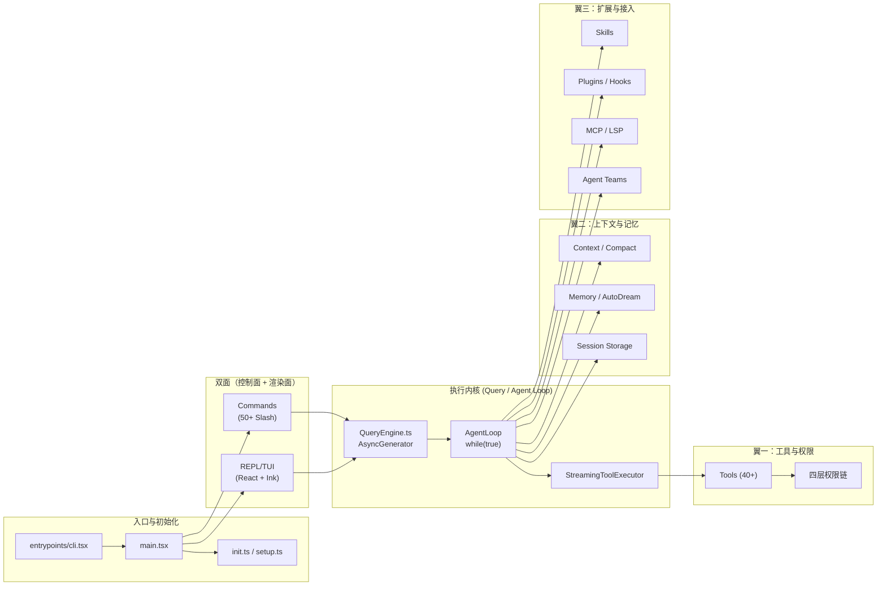
```mermaid
flowchart LR
    subgraph EntryLayer["入口与初始化"]
        CLI["entrypoints/cli.tsx"]
        MAIN["main.tsx"]
        INIT["init.ts / setup.ts"]
    end

    subgraph SurfaceLayer["双面（控制面 + 渲染面）"]
        CMD["Commands<br/>(50+ Slash)"]
        REPL["REPL/TUI<br/>(React + Ink)"]
    end

    subgraph Kernel["执行内核 (Query / Agent Loop)"]
        QE["QueryEngine.ts<br/>AsyncGenerator"]
        LOOP["AgentLoop<br/>while(true)"]
        EXEC["StreamingToolExecutor"]
    end

    subgraph WingTools["翼一：工具与权限"]
        TOOLS["Tools (40+)"]
        PERM["四层权限链"]
    end

    subgraph WingMem["翼二：上下文与记忆"]
        CTX["Context / Compact"]
        MEM["Memory / AutoDream"]
        SESS["Session Storage"]
    end

    subgraph WingExt["翼三：扩展与接入"]
        SKILL["Skills"]
        PLUGIN["Plugins / Hooks"]
        MCP["MCP / LSP"]
        TEAM["Agent Teams"]
    end

    CLI --> MAIN --> INIT
    MAIN --> CMD
    MAIN --> REPL
    CMD --> QE
    REPL --> QE
    QE --> LOOP --> EXEC
    EXEC --> TOOLS
    TOOLS --> PERM
    LOOP --> CTX
    LOOP --> MEM
    LOOP --> SESS
    LOOP --> SKILL
    LOOP --> PLUGIN
    LOOP --> MCP
    LOOP --> TEAM
```

- **双面**：控制面（命令、提示输入）与渲染面（终端 UI）解耦，二者都把请求转交给执行内核
- **单核**：`QueryEngine` 是统一入口，内部用 `AsyncGenerator` 流式吐出 SDKMessage
- **三翼**：工具/权限、上下文/记忆、扩展/接入三个子系统围绕内核共同协作

---

## 三、核心结论深度分析：while(true) 循环 vs DAG

业界对 Agent 的形态历来有两条路线之争：**「DAG 编排」** 与 **「While 循环」**。Claude Code 的工程选择，明确给出了答案：用一个朴素的 `while(true)` 跑到底。

### 1. DAG 范式解析

DAG（有向无环图）范式代表性产品如 LangChain Expression、Dify Workflow、Flowise 等。它的特征是：

- 把任务编排成可视化节点图：意图识别 → 检索 → 工具 → 总结
- 每个节点的输入输出 schema 在设计期固定
- 适合「流程已知、子任务边界清晰」的场景（客服分流、表单处理）

但在真正的 Coding 场景下，DAG 的弱点会被放大：

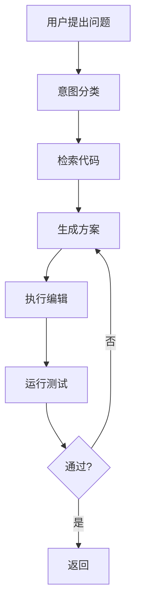
```mermaid
flowchart TD
    A["用户提出问题"] --> B["意图分类"]
    B --> C["检索代码"]
    C --> D["生成方案"]
    D --> E["执行编辑"]
    E --> F["运行测试"]
    F --> G{"通过?"}
    G -- 是 --> H["返回"]
    G -- 否 --> D
```

只要任务一深，节点和边就会指数级膨胀，遇到「读了文件发现要装依赖」这种横切关注点，DAG 就需要重新设计图。**任务图无法预先穷举** 是 DAG 的死结。

### 2. Claude Code 的 while(true) 循环

Claude Code 的核心循环可以浓缩为伪代码：

```typescript
async function* agentLoop(initialMessages) {
  let messages = initialMessages;
  while (true) {
    const response = await callModel(messages);   // 1. 让模型说话
    yield response;                               // 2. 流式吐给 UI
    if (response.stop_reason === "end_turn") break; // 3. 模型主动结束
    const toolUses = extractToolUses(response);
    if (toolUses.length === 0) break;
    const toolResults = await executor.run(toolUses); // 4. 并发执行工具
    messages = [...messages, response, ...toolResults]; // 5. 回灌
  }
}
```

特征：

- **没有固定流程**：是否调用工具、调用哪个工具、循环几轮，完全由模型在每一轮自由决定
- **状态简单**：唯一的状态就是 `messages` 数组，便于压缩、持久化、回放
- **可与流式共生**：`AsyncGenerator` 天然支持 SSE 流式吐字与中途取消

### 3. ReAct 循环的工程演进

学术界的 ReAct（Reason + Act）范式提供了「思考 → 行动 → 观察」三段式雏形。Claude Code 把它工程化：

- **Reason**：模型隐式思考（Anthropic 模型支持 `thinking` 字段）
- **Act**：通过 `tool_use` block 表达
- **Observe**：`tool_result` block 回写

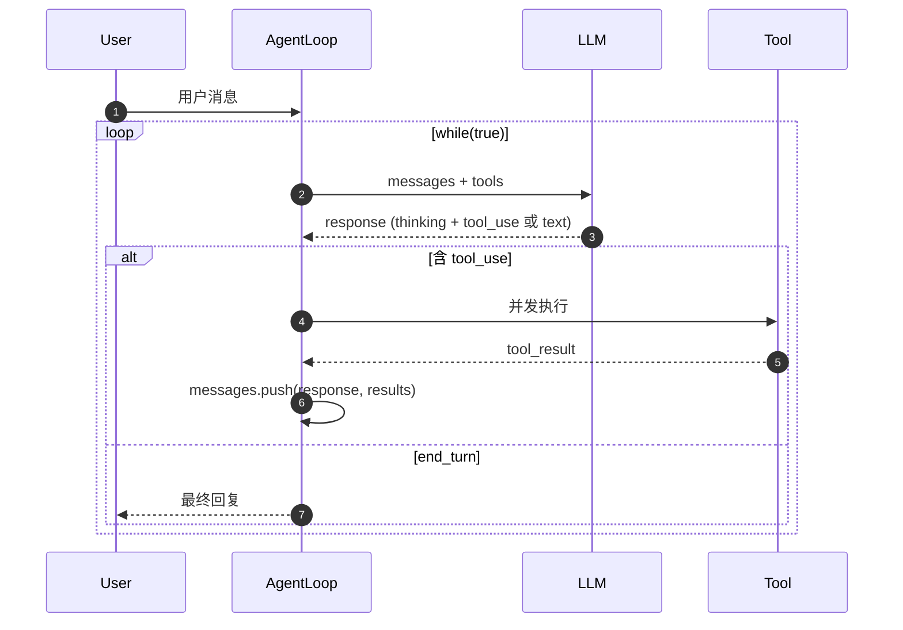
```mermaid
sequenceDiagram
    autonumber
    participant U as User
    participant L as AgentLoop
    participant M as LLM
    participant T as Tool

    U->>L: 用户消息
    loop while(true)
        L->>M: messages + tools
        M-->>L: response (thinking + tool_use 或 text)
        alt 含 tool_use
            L->>T: 并发执行
            T-->>L: tool_result
            L->>L: messages.push(response, results)
        else end_turn
            L-->>U: 最终回复
        end
    end
```

### 4. 为什么 while(true) 更适合 Agent

| 维度 | DAG | while(true) |
|------|-----|-------------|
| 任务边界 | 必须预先建模 | 由模型动态决定 |
| 错误恢复 | 需要在节点边写 retry | 模型下一轮自然纠错 |
| 并发 | 节点级并发，受图约束 | Tool 级并发，无图约束 |
| 上下文 | 节点间需要显式 schema | 全部沉淀在 messages |
| 可观测性 | 图可视化更直观 | 需要二次构建展示 |
| 模型能力依赖 | 弱模型也能跑 | 强烈依赖模型规划能力 |

结论：**当模型足够强时，把规划权交给模型；当模型还不够强时，DAG 是补丁。** Claude Code 之所以敢押注 while(true)，是因为它服务的是 Sonnet/Opus 级模型。这也是它能写出复杂代码任务的根本前提。

---

## 四、Agent Loop：系统的心脏

Agent Loop 实现在 `query/QueryEngine.ts` 中，关键设计点：

- **AsyncGenerator 全链路**：`submitMessage` 返回 `AsyncGenerator<SDKMessage>`，UI 通过 `for await...of` 消费。任何中间节点都可以 yield 增量，天然支持 SSE
- **可中断**：UI 持有迭代器，按 ESC 即调用 `return()` 终止
- **可分叉**：子代理可以在任意位置创建新的 generator，并发推进
- **可重放**：因为 messages 是唯一状态，Resume 时把 messages 加载回来即可

执行内核与三个外部子系统的关系：

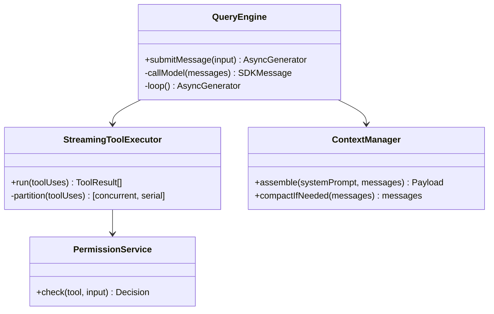
```mermaid
classDiagram
    class QueryEngine {
      +submitMessage(input) AsyncGenerator
      -callModel(messages) SDKMessage
      -loop() AsyncGenerator
    }
    class StreamingToolExecutor {
      +run(toolUses) ToolResult[]
      -partition(toolUses) [concurrent, serial]
    }
    class ContextManager {
      +assemble(systemPrompt, messages) Payload
      +compactIfNeeded(messages) messages
    }
    class PermissionService {
      +check(tool, input) Decision
    }
    QueryEngine --> StreamingToolExecutor
    QueryEngine --> ContextManager
    StreamingToolExecutor --> PermissionService
```

关于「单次循环里都发生了什么」，一条 Query 的完整生命周期可参考社区文章《一条 Query 的万里长征》：

1. 用户输入 → REPL 把输入封成 `user` 消息
2. ContextManager 装配 System Prompt、CLAUDE.md、Memory、可用工具列表
3. 调 LLM，流式接收 `text` / `thinking` / `tool_use` 块
4. UI 在收到第一个 token 后立即增量渲染
5. 收齐 `tool_use` → 走 `StreamingToolExecutor` 并发/串行执行
6. 把 `tool_result` 拼回 messages，继续下一轮
7. 模型输出 `end_turn` 后退出循环并完成 trace 持久化

---

## 五、插件系统：像搭积木一样扩展 Claude Code

Claude Code 的插件系统不是「外挂」，而是把所有可扩展点（命令、工具、Skill、Hook、Agent、MCP）打包成一个 **可分发单元**。

插件的目录约定：

```
my-plugin/
├── plugin.json            # 元信息（name, version, entry...）
├── commands/              # 注入新的 /xxx 命令
├── tools/                 # 注入新的工具
├── skills/                # 注入新的 Skill
├── hooks/                 # 注入新的生命周期钩子
├── agents/                # 注入新的子 Agent 定义
└── mcp.json               # 描述插件捆绑的 MCP server
```

加载优先级（低 → 高，覆盖关系）：

```
built-in → plugin → user → project → flag → policy
```

插件让团队层面的能力沉淀成为可能：把内部「代码评审 SOP」做成插件后，所有成员一键安装即可在 `/review` 中得到完全一致的行为。

---

## 六、Hook 系统深度分析：用户可编程的生命周期

Hook 是 Claude Code 把控制权回让给用户的「插口」。常见 Hook 类型：

- `PreToolUse` / `PostToolUse`：工具执行前后
- `PreMessage` / `PostMessage`：模型调用前后
- `SessionStart` / `SessionEnd`：会话级
- `Notification`：UI 通知
- `Stop` / `UserPromptSubmit`：交互节点

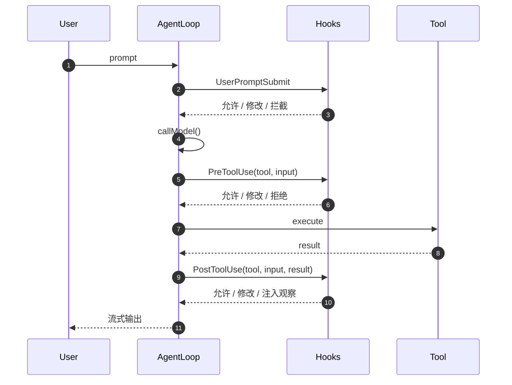
```mermaid
sequenceDiagram
    autonumber
    participant U as User
    participant L as AgentLoop
    participant H as Hooks
    participant T as Tool

    U->>L: prompt
    L->>H: UserPromptSubmit
    H-->>L: 允许 / 修改 / 拦截
    L->>L: callModel()
    L->>H: PreToolUse(tool, input)
    H-->>L: 允许 / 修改 / 拒绝
    L->>T: execute
    T-->>L: result
    L->>H: PostToolUse(tool, input, result)
    H-->>L: 允许 / 修改 / 注入观察
    L-->>U: 流式输出
```

Hook 的最大价值不是「监听」，而是 **「拦截 + 改写」**：例如在 `PreToolUse` 里把 `rm -rf` 改写为 `mv → trash`，或在 `PostToolUse` 把测试结果摘要喂回模型。它让用户可以在不改源码的前提下，把企业级合规策略写进 Agent。

---

## 七、工具系统深度分析

### 1. 工具注册与发现

工具抽象 `Tool.ts`（约 792 行）的核心字段：

```typescript
interface Tool<I, O> {
  name: string;
  description: string;
  inputSchema: ZodSchema<I>;   // 类型与 prompt 描述并存
  call: (input: I, ctx: Ctx) => AsyncGenerator<O>;
  checkPermissions?: (input: I) => Decision;
  isReadOnly?: () => boolean;
  isConcurrencySafe?: () => boolean;
  maxResultSizeChars?: number;
}
```

- **Lazy Loading**：非核心工具会标 `defer_loading: true`，模型只看到一个虚拟的 `ToolSearch`，按关键词检索后才真正加载工具描述。在大型项目下，可以省下大量 Token
- **`CLAUDE_CODE_SIMPLE` 模式**：仅保留 3 个基础工具，专门用于性能基准与轻量场景
- **`assembleToolPool()`**：把 built-in 与 MCP 工具按字典序合并（MCP 作后缀），保证 Prompt 哈希稳定，提升缓存命中

### 2. 工具执行管理

`StreamingToolExecutor` 是执行调度核心：

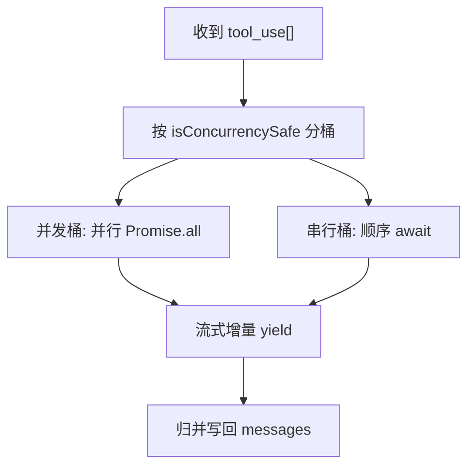
```mermaid
flowchart TD
    A["收到 tool_use[]"] --> B["按 isConcurrencySafe 分桶"]
    B --> C["并发桶: 并行 Promise.all"]
    B --> D["串行桶: 顺序 await"]
    C --> E["流式增量 yield"]
    D --> E
    E --> F["归并写回 messages"]
```

- 文件读取、Grep、Glob、Bash（只读）这类只读工具会进入并发桶
- 文件编辑、Bash（写）、AskUserQuestion 进入串行桶以避免冲突
- 工具输出按 chunk 流式 yield，渲染层可以边跑边显示

### 3. 内置工具速览

| 类别 | 工具 |
|------|------|
| 文件 | FileRead、FileEdit、FileWrite、NotebookEdit |
| 检索 | Glob、Grep、Find |
| 网络 | WebFetch、WebSearch |
| 任务 | TodoWrite、AskUserQuestion |
| 系统 | Bash、Tmux |
| Agent | Agent、SendMessage、TaskCreate/Get/Update/List/Stop/Output |
| 计划 | EnterPlanMode、ExitPlanMode |
| 扩展 | SkillTool、ListMcpResources、ReadMcpResource、LSPTool |

---

## 八、Command 命令系统

Slash Command 是用户主动触发的「快捷模板」。常用命令包括 `/commit`、`/review`、`/compact`、`/memory`、`/remember`、`/dream`、`/buddy`、`/doctor`、`/skill-name` 等。

命令分两类：

1. **代码内置**：在 `commands/` 目录注册，可直接调用工具或修改上下文
2. **基于 Skill 派生**：当 Skill 的 `user-invocable: true` 时，自动生成同名 `/skill-name` 命令

命令与工具的关键区别：

- **命令**：用户主动触发，可直接接管渲染
- **工具**：模型主动调用，受权限链约束

---

## 九、Skill 技能系统

### 1. Skill 加载流程

Skill 是「带 frontmatter 的 Markdown」，承载一段可复用的提示词 + 行为配置。

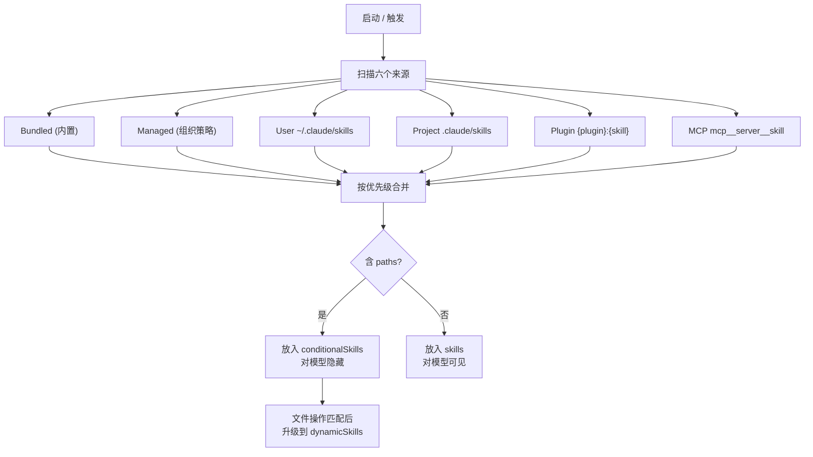
```mermaid
flowchart TD
    A["启动 / 触发"] --> B["扫描六个来源"]
    B --> B1["Bundled (内置)"]
    B --> B2["Managed (组织策略)"]
    B --> B3["User ~/.claude/skills"]
    B --> B4["Project .claude/skills"]
    B --> B5["Plugin {plugin}:{skill}"]
    B --> B6["MCP mcp__server__skill"]
    B1 & B2 & B3 & B4 & B5 & B6 --> C["按优先级合并"]
    C --> D{"含 paths?"}
    D -- 是 --> E["放入 conditionalSkills<br/>对模型隐藏"]
    D -- 否 --> F["放入 skills<br/>对模型可见"]
    E --> G["文件操作匹配后<br/>升级到 dynamicSkills"]
```

### 2. SkillTool —— 模型驱动的技能调用

模型看到的不是一堆 Skill 的完整内容，而是一个 `SkillTool`（节省 Token）。模型选定某个 Skill 后，再由 SkillTool 把对应的 `SKILL.md` 注入对话。

执行上下文分两种：

| 维度 | Inline | Fork |
|------|--------|------|
| Token 预算 | 共享父对话 | 独立 |
| 上下文访问 | 完整历史 | 只看 Skill 提示词 |
| 结果返回 | 直接出现在对话 | 包装在 tool_result |
| 适用场景 | 短指令 | 长任务、独立运算 |

- **Inline** 适合「轻量指导」（比如 `/commit` 模板）
- **Fork** 适合「跨多轮的子任务」（比如 PDF 处理、文档迁移）

---

## 十、权限体系：系统的免疫系统

Claude Code 的权限被设计成 **四层级联**：

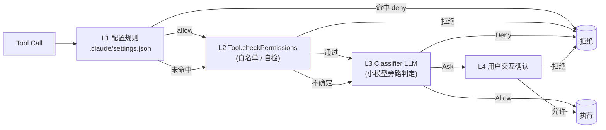
```mermaid
flowchart LR
    A["Tool Call"] --> L1["L1 配置规则<br/>.claude/settings.json"]
    L1 -- 命中 deny --> X1[("拒绝")]
    L1 -- allow --> L2
    L1 -- 未命中 --> L2["L2 Tool.checkPermissions<br/>(白名单 / 自检)"]
    L2 -- 拒绝 --> X1
    L2 -- 通过 --> L3
    L2 -- 不确定 --> L3["L3 Classifier LLM<br/>(小模型旁路判定)"]
    L3 -- Allow --> EXEC[("执行")]
    L3 -- Deny --> X1
    L3 -- Ask --> L4["L4 用户交互确认"]
    L4 -- 允许 --> EXEC
    L4 -- 拒绝 --> X1
```

- **L1 配置规则**：用户/组织在 `settings.json` 维护的 allow/deny rule（支持 `Skill:commit`、`Skill:review:*` 这种前缀语法）
- **L2 Tool 自检**：例如 `BashTool` 内置危险命令白名单（`rm -rf`、`sudo` 等）
- **L3 Classifier**：当不确定时，调用一个更小、更便宜的 LLM 做侧信道判定，输入「精简 transcript + 待执行命令」，输出 Allow / Deny
- **L4 用户交互**：最后兜底，弹出 Allow / Deny / Always 选项；Always 会写回 L1

Auto Mode 把 L3 转为常态，配合 **Denial Tracking** 实现「失败温降」：连续被拒后自动收敛策略。

---

## 十一、Agent Teams 的多智能体协作架构

### 1. Agent Teams 整体架构

Claude Code 把多智能体抽象成「Team Lead + Member」结构。Coordinator 模式下，主代理被剥离掉直接操作文件的工具，只保留 `Agent`、`SendMessage`、`TaskStop`，仅负责规划与分发。

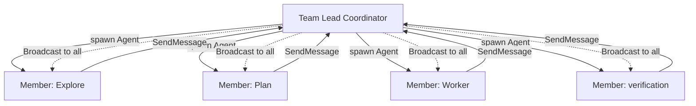
```mermaid
flowchart TB
    LEAD["Team Lead Coordinator"]
    M1["Member: Explore"]
    M2["Member: Plan"]
    M3["Member: Worker"]
    M4["Member: verification"]
    LEAD -->|spawn Agent| M1
    LEAD -->|spawn Agent| M2
    LEAD -->|spawn Agent| M3
    LEAD -->|spawn Agent| M4
    M1 -->|SendMessage| LEAD
    M2 -->|SendMessage| LEAD
    M3 -->|SendMessage| LEAD
    M4 -->|SendMessage| LEAD
    LEAD -.->|Broadcast to all| M1
    LEAD -.->|Broadcast to all| M2
    LEAD -.->|Broadcast to all| M3
    LEAD -.->|Broadcast to all| M4
```

内置六种 Agent：

| Agent | 工具范围 | 模型 | 用途 |
|-------|---------|------|------|
| general-purpose | 全部 | 继承 | 通用多步任务 |
| Explore | 只读 | Haiku | 代码库快速探索 |
| Plan | 只读 | 继承 | 架构设计与规划 |
| verification | 只读 | 继承 | 独立验证（PASS/FAIL/PARTIAL）|
| claude-code-guide | Bash/Read/Web | Haiku | 文档查询 |
| statusline-setup | Read+Edit | Sonnet | 状态栏配置 |

### 2. 关键机制

- **Fork 继承缓存**：子代理直接继承父代理的 Prompt Cache 前缀，开销极低
- **隔离探索**：子代理拥有独立上下文窗口，「中间输出 / 报错」不污染主对话
- **结论回写**：子代理用 `<task-notification>` XML 把蒸馏后的结论传回 Lead
- **执行后端**：默认 in-process；可切到 tmux / iTerm2 实现真正的多进程

任务类型涵盖 `local_bash`、`local_agent`、`remote_agent`、`in_process_teammate`、`local_workflow`、`dream` 六种，其中 `in_process_teammate` 是真正实现并发 Agent 的关键。

### 3. 权限控制

每个 Agent 可独立配置 `permissionMode`（default / plan / acceptEdits / bypassPermissions / dontAsk / auto / bubble），子代理触发的工具调用按其自身权限模式决定是否冒泡向 Lead 请求。

### 4. 生命周期和上下文管理

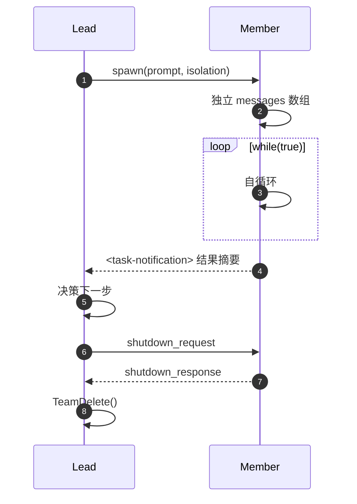
```mermaid
sequenceDiagram
    autonumber
    participant L as Lead
    participant M as Member
    L->>M: spawn(prompt, isolation)
    M->>M: 独立 messages 数组
    loop while(true)
        M->>M: 自循环
    end
    M-->>L: <task-notification> 结果摘要
    L->>L: 决策下一步
    L->>M: shutdown_request
    M-->>L: shutdown_response
    L->>L: TeamDelete()
```

子代理可在 Worktree 隔离模式下工作（`isolation: "worktree"`），相当于在独立 git 分支推进，结束后才合并。这是处理「破坏性重构」的关键设施。

### 5. 与 Cursor、Qoder 专家团等模式对比

- **Cursor Agent**：偏向「单 Agent + 流水线 IDE 集成」，多 Agent 在 UI 侧由用户手动开多窗口
- **Qoder 专家团**：内置一组「角色化专家」，由 Coordinator 自动路由
- **Claude Code**：Coordinator 模式 + 显式 `Agent()` API + Team Memory，把多智能体作为一等公民

差异本质：Claude Code 把多智能体下放到 **Agent 自己** 决定何时分叉、与谁通信，而非由 UI/产品侧固定。

---

## 十二、System Prompt 工程：Context Engineering 的极致实践

System Prompt 不是一段静态文本，而是一份按层级、按缓存友好度精心装配的「**结构化合约**」。Claude Code 用 `SYSTEM_PROMPT_DYNAMIC_BOUNDARY` 把它劈成两半：

- **静态段**：模型身份、安全规则、代码风格约束、基础工具指导
- **动态段**：当前工作目录、Git 状态、MCP 指令、用户配置、记忆

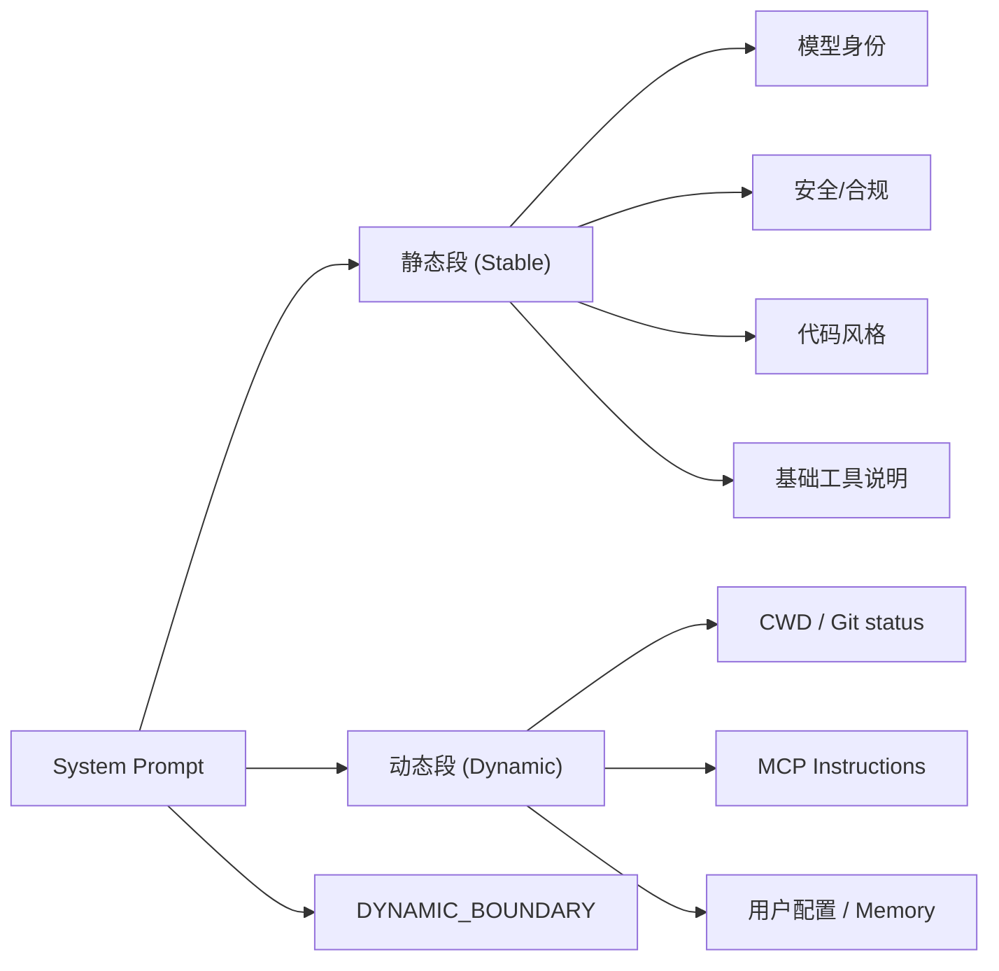
```mermaid
flowchart LR
    A["System Prompt"] --> S["静态段 (Stable)"]
    A --> D["动态段 (Dynamic)"]
    S --> S1["模型身份"]
    S --> S2["安全/合规"]
    S --> S3["代码风格"]
    S --> S4["基础工具说明"]
    D --> D1["CWD / Git status"]
    D --> D2["MCP Instructions"]
    D --> D3["用户配置 / Memory"]
    A --> BD["DYNAMIC_BOUNDARY"]
```

工程细节：

- **字典序**：所有工具描述按字母序排序（built-in + MCP 后缀），保证 Prompt 哈希稳定
- **路径哈希化**：把用户路径替换为内容哈希后再拼入 Prompt，防止机器名/绝对路径波动击穿缓存
- **状态外置**：Agent 列表从 Tool description 迁出到 Message Attachments，社区观察显示可降低约 10.2% 的 Cache Creation Tokens
- **优先级链**：Override > Coordinator > Agent > Custom > Default

Claude Code 在这里给所有 LLM 应用上了同一节课：**Prompt 不是写出来的，而是工程化装配出来的。**

---

## 十三、上下文窗口管理深度分析：真正的工程深水区

上下文是 Agent 永远不够用的稀缺资源。Claude Code 在三个层面同时下手：

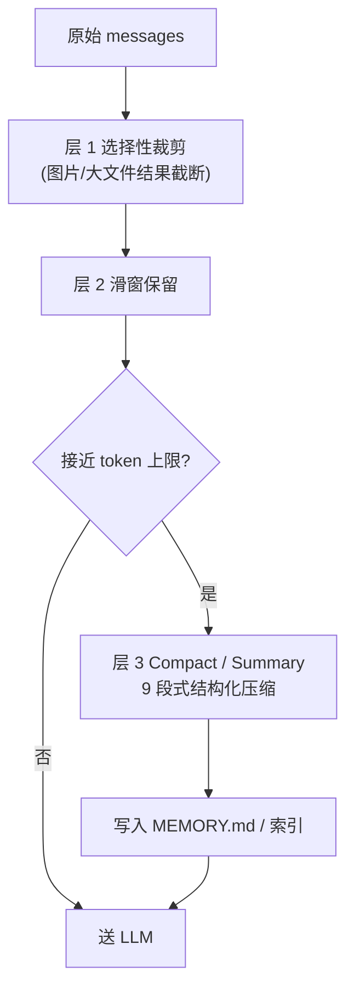
```mermaid
flowchart TD
    A["原始 messages"] --> B["层 1 选择性裁剪<br/>(图片/大文件结果截断)"]
    B --> C["层 2 滑窗保留"]
    C --> D{"接近 token 上限?"}
    D -- 否 --> Z["送 LLM"]
    D -- 是 --> E["层 3 Compact / Summary<br/>9 段式结构化压缩"]
    E --> F["写入 MEMORY.md / 索引"]
    F --> Z
```

**9 段式 Compact 模板**：

1. Session goals
2. Completed tasks
3. Incomplete tasks
4. Key decisions / rationale
5. Code change summary
6. Issues found
7. Hypotheses to verify
8. User preferences
9. Key context info

强制结构化的好处是：模型在压缩后仍然知道「哪些字段必须存在」，避免随机性丢失关键信息。

压缩还会触发 **「上下文重生」**：压缩后的摘要会作为新的「first user message」回写，对话历史被替换为 1～2 段精炼内容 + 关键 messages，余下空间用来跑接下来的循环。

> 这一招的本质：用「编程模型自身的复述能力」当 lossy 压缩器，比固定窗口策略表达力强一个数量级。

---

## 十四、StreamingToolExecutor 并发执行和流式输出

`StreamingToolExecutor` 把工具按 `isConcurrencySafe()` 划分为「并发桶 / 串行桶」，并以 AsyncGenerator 流式返回。它解决了三个工程难题：

- **可观察性**：长耗时工具（Bash、WebFetch）可以边跑边输出
- **取消性**：用户按 ESC 可以传播到工具内部（每个工具被强制实现 abort signal）
- **背压**：渲染层消费速度慢时，自然反向阻塞工具产出

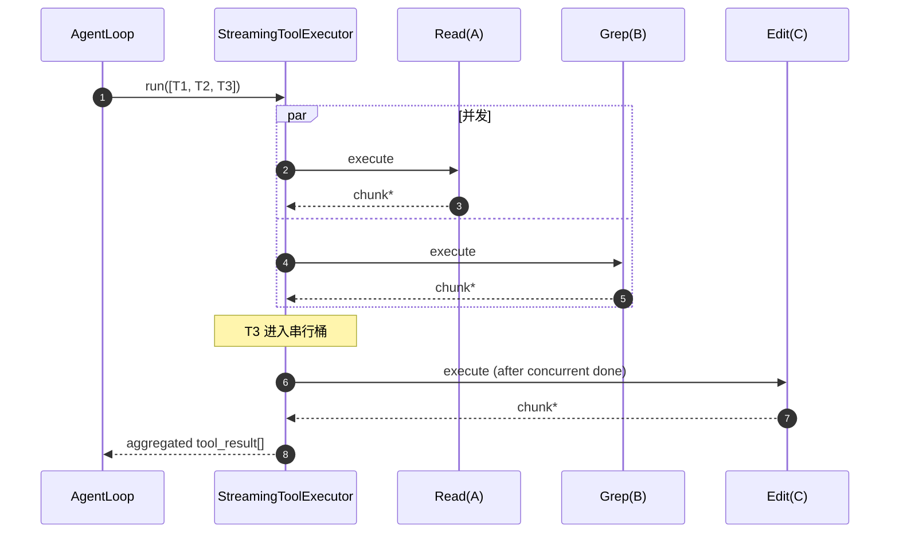
```mermaid
sequenceDiagram
    autonumber
    participant L as AgentLoop
    participant E as StreamingToolExecutor
    participant T1 as Read(A)
    participant T2 as Grep(B)
    participant T3 as Edit(C)

    L->>E: run([T1, T2, T3])
    par 并发
        E->>T1: execute
        T1-->>E: chunk*
    and
        E->>T2: execute
        T2-->>E: chunk*
    end
    Note over E: T3 进入串行桶
    E->>T3: execute (after concurrent done)
    T3-->>E: chunk*
    E-->>L: aggregated tool_result[]
```

---

## 十五、MCP 集成：标准化的外部工具接入

MCP（Model Context Protocol）是 Anthropic 提出的、客户端与 Tool/Resource Server 之间的标准协议。Claude Code 是 MCP 落地最完整的客户端之一：

- 启动期通过 `services/mcp/` 建立到每个 MCP server 的 stdio / SSE / Streamable HTTP 通道
- 把每个 server 暴露的 Tool / Prompt / Resource 注入 `assembleToolPool()`
- Tool 命名为 `mcp__{server}__{tool}`，自动做权限隔离与字典序合并
- 失败的 server 不会阻塞主流程，错误会进入 UI 与 `doctor` 命令视图

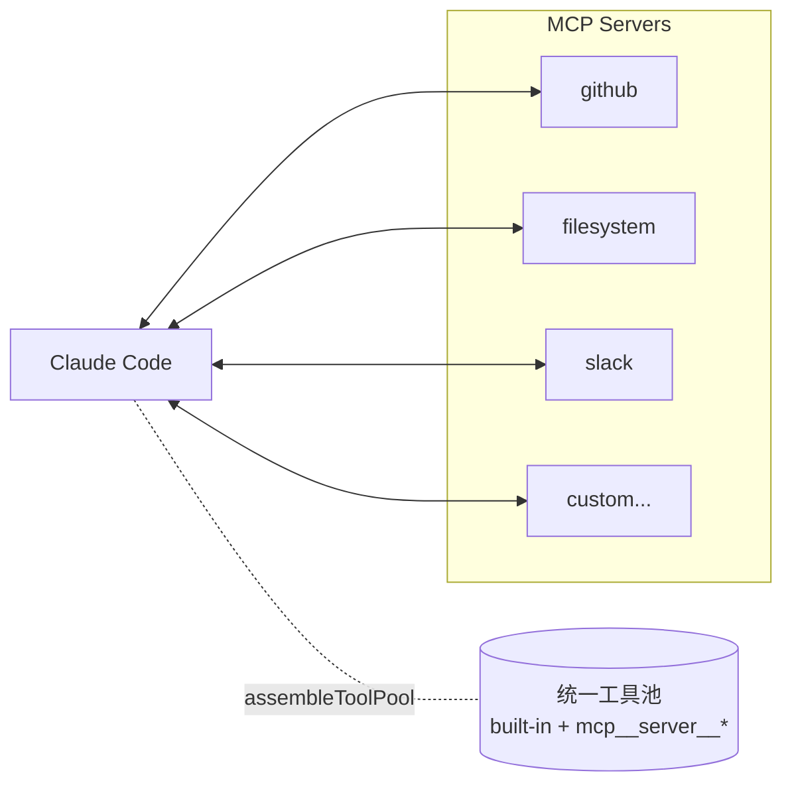
```mermaid
flowchart LR
    CC["Claude Code"]
    subgraph MCPServers["MCP Servers"]
        S1["github"]
        S2["filesystem"]
        S3["slack"]
        S4["custom..."]
    end
    CC <--> S1
    CC <--> S2
    CC <--> S3
    CC <--> S4
    CC -. assembleToolPool .- POOL[("统一工具池<br/>built-in + mcp__server__*")]
```

值得注意的是：**MCP Skills 严禁内联 Shell**，因为它来自不受信的远程，安全模型上视为外部代码。

---

## 十六、Memory 系统深度分析：跨会话的记忆

### 1. 三层记忆架构

Claude Code 的记忆体系是「**短期 / 中期 / 长期**」三层结构：

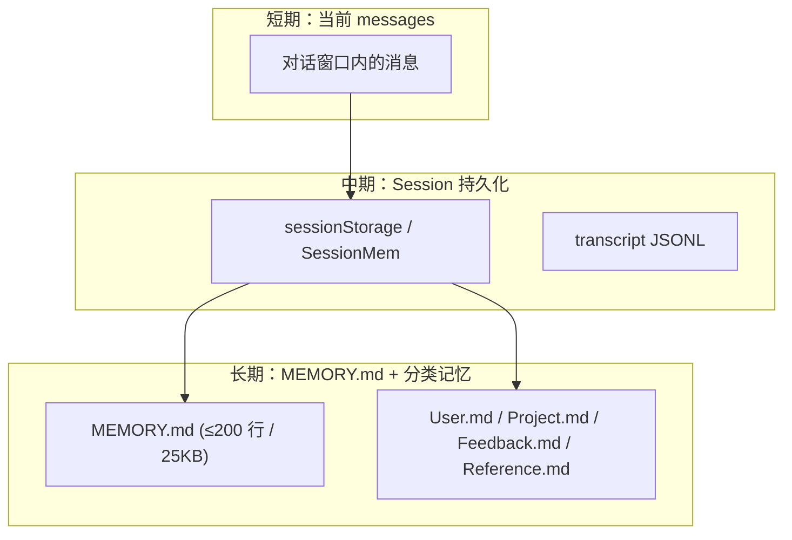
```mermaid
flowchart TB
    subgraph Short["短期：当前 messages"]
        SM["对话窗口内的消息"]
    end
    subgraph Mid["中期：Session 持久化"]
        SS["sessionStorage / SessionMem"]
        T["transcript JSONL"]
    end
    subgraph Long["长期：MEMORY.md + 分类记忆"]
        M["MEMORY.md (≤200 行 / 25KB)"]
        U["User.md / Project.md / Feedback.md / Reference.md"]
    end
    SM --> SS
    SS --> M
    SS --> U
```

### 2. Agent Memory 作用域

- **User**：用户画像、偏好（角色、语言、工具习惯）
- **Feedback**：对 Claude 行为方式的纠正与肯定
- **Project**：项目层面的非代码信息（业务背景、上下游约定）
- **Reference**：仪表板、工单系统、外部链接

> 核心原则：「只记忆那些无法从代码推断出来的东西」。

### 3. 记忆检索和加载流程

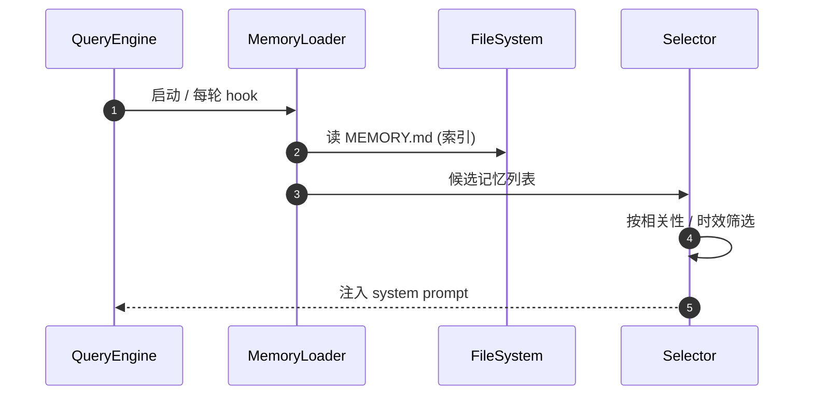
```mermaid
sequenceDiagram
    autonumber
    participant Q as QueryEngine
    participant L as MemoryLoader
    participant F as FileSystem
    participant S as Selector

    Q->>L: 启动 / 每轮 hook
    L->>F: 读 MEMORY.md (索引)
    L->>S: 候选记忆列表
    S->>S: 按相关性 / 时效筛选
    S-->>Q: 注入 system prompt
```

- `MEMORY.md` 是「索引页」始终入上下文（≤ 200 行 / 25 KB）
- 详细记忆按需加载，路径为 `~/.claude/projects/{hash}/memory/`
- 引用具体文件路径或函数名的记忆，使用前会 grep 校验「是否仍存在」

### 4. 记忆类型与 frontmatter

```yaml
---
type: feedback
created: 2026-06-19
why: 用户在 React 项目中偏好 functional component
how-to-apply: 在编写 React 组件时默认使用 hooks，不要使用 class
---
```

每条记忆同时包含 **Why（为何沉淀）** 与 **How to apply（如何使用）**，这让记忆具备「可解释、可验证」属性。

### 5. AutoDream：像人一样的整合机制

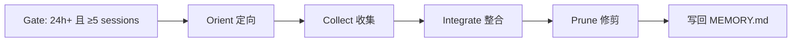
```mermaid
flowchart LR
    G["Gate: 24h+ 且 ≥5 sessions"] --> O["Orient 定向"]
    O --> C["Collect 收集"]
    C --> I["Integrate 整合"]
    I --> P["Prune 修剪"]
    P --> Z["写回 MEMORY.md"]
```

- 触发：距上次整合 ≥ 24 小时，且累计 ≥ 5 个会话
- 文件锁：多进程同时整合时，使用 lock 文件确保单写
- 进度可视：状态栏显示 `dreaming`，可通过 `Shift+Down` 查看、`x` 终止
- 手动触发：`/dream`

### 6. Team Memory

多智能体共享的「团队记忆」，存放在 Team 维度的目录下，所有成员可读可写。它让一个团队跨多次会话也能维持一致的「行话」与「约定」。

### 7. 与 System Prompt 的集成

记忆经历的完整生命周期：

```
提取 → 写入 → 加载 → 智能选择 → 注入上下文 → 验证/更新
```

记忆的写入时机：

- 自动提取：每个会话结束由后台子代理分析
- 显式指令：`记住这个 / 忘记这个`
- 命令：`/memory` 编辑、`/remember` 审查并提议升级到 CLAUDE.md（变更需批准）

---

## 十七、Session Resume 与 Bridge 深度分析

Session 是 Claude Code 的「**可序列化原子**」。Resume 就是把 messages + 元信息从 JSONL 文件加载回 AgentLoop，继续 yield。

- **存储位置**：`~/.claude/projects/{hash}/sessions/*.jsonl`
- **元信息**：起止时间、模型、Token 消耗、参与的 Skill / Agent / MCP
- **Bridge**：把会话桥接到 IM（Telegram、Feishu、WeChat、DingTalk）或 H5 远程客户端，远端发命令 → 本地真实执行 → 结果回流

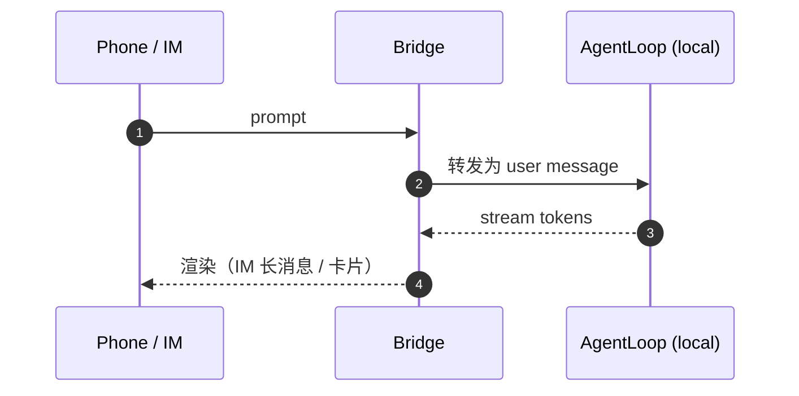
```mermaid
sequenceDiagram
    autonumber
    participant U as Phone / IM
    participant B as Bridge
    participant L as AgentLoop (local)
    U->>B: prompt
    B->>L: 转发为 user message
    L-->>B: stream tokens
    B-->>U: 渲染（IM 长消息 / 卡片）
```

Bridge 的真正价值在于：**Agent 仍然跑在你的开发机上**（拥有真实文件、git、网络），但你可以从任意设备发指令。这是「移动办公的 Coding Agent」的真正形态。

---

## 十八、终端 UI：自研 React 终端渲染引擎

Claude Code 用了一套自研的「Ink-flavored」终端渲染层，关键设计：

- **React 渲染到终端**：组件状态变化 → 计算 diff → 用 ANSI 序列局部刷新
- **流式增量**：与 AsyncGenerator 配套，模型每吐出一个 token 就触发一次 `setState`
- **键盘语义化**：ESC=取消、Shift+Down=查看后台进度、Ctrl+R=Resume 等
- **可绑定多面板**：左侧 chat、右侧文件 diff、底部 status line 同屏并存

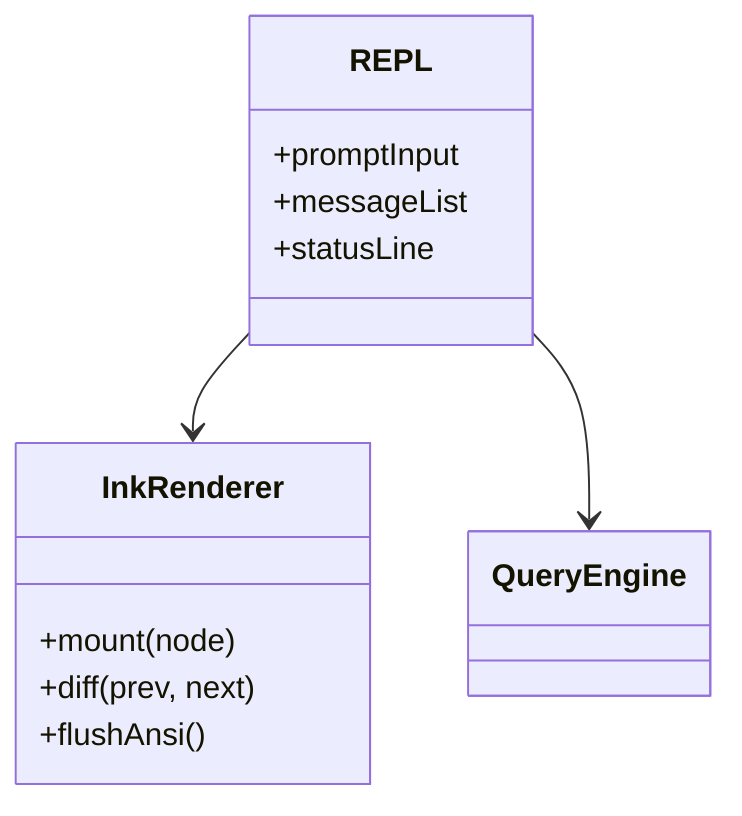
```mermaid
classDiagram
    class InkRenderer {
      +mount(node)
      +diff(prev, next)
      +flushAnsi()
    }
    class REPL {
      +promptInput
      +messageList
      +statusLine
    }
    REPL --> InkRenderer
    REPL --> QueryEngine
```

终端 UI 是「Coding Agent 的灵魂载体」：足够轻、可 SSH、可 tmux 多开，跟 IDE 类产品形成差异化定位。

---

## 十九、入口流程深度分析：从用户敲下回车到 Agent 启动

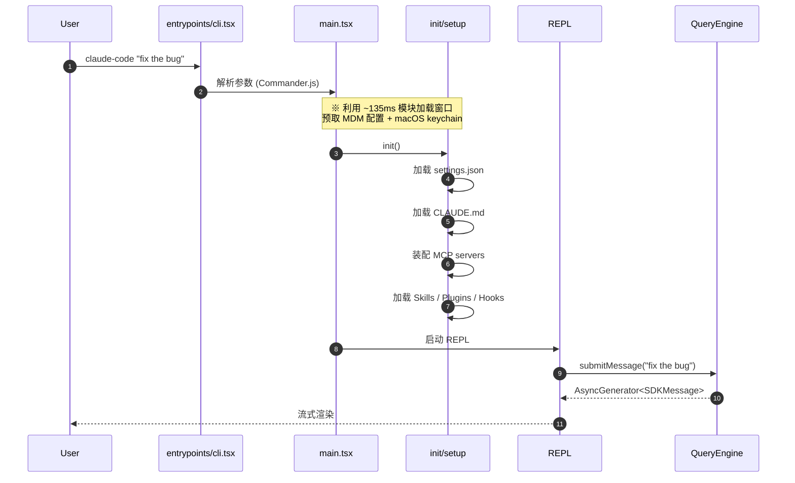
```mermaid
sequenceDiagram
    autonumber
    participant U as User
    participant CLI as entrypoints/cli.tsx
    participant M as main.tsx
    participant I as init/setup
    participant R as REPL
    participant Q as QueryEngine

    U->>CLI: claude-code "fix the bug"
    CLI->>M: 解析参数 (Commander.js)
    Note over M,I: ※ 利用 ~135ms 模块加载窗口<br/>预取 MDM 配置 + macOS keychain
    M->>I: init()
    I->>I: 加载 settings.json
    I->>I: 加载 CLAUDE.md
    I->>I: 装配 MCP servers
    I->>I: 加载 Skills / Plugins / Hooks
    M->>R: 启动 REPL
    R->>Q: submitMessage("fix the bug")
    Q-->>R: AsyncGenerator<SDKMessage>
    R-->>U: 流式渲染
```

启动期的精巧之处在于：`main.tsx` 大约 975 行，包含「在 `import` 副作用阶段就触发慢启动操作（MDM 配置、Keychain 读取）」的技巧，借模块加载窗口节省约 65 ms 启动延时。

---

## 二十、七个 Continue Site 完整分析

> 「Continue Site」是 Claude Code 内部对「**Agent 在哪些点会决定继续 / 中断**」的工程化命名。共有七个站点：

| # | Site | 决策内容 |
|---|------|----------|
| 1 | After model response | 是否还有 tool_use？没有就 end_turn |
| 2 | After tool result | 是否需要再调用一次 model |
| 3 | After compact | 压缩后是否需要重置 messages 并继续 |
| 4 | After permission | 用户拒绝后是否注入 denial 反馈再继续 |
| 5 | After hook | Hook 返回的 mutate / block 决定继续与否 |
| 6 | After sub-agent return | 子代理结论是否触发主代理新一轮 |
| 7 | After error | 工具/模型报错后是降级、重试还是退出 |

每个 Continue Site 实质上都是「在 `while(true)` 内部的小型决策」。Claude Code 把它们抽象成统一接口（`shouldContinue(ctx): Continue | Stop | Branch`），让循环主体保持极简，所有复杂控制逻辑下沉到决策点。

```mermaid
flowchart TD
    S1["model response"] --> D1{"含 tool_use?"}
    D1 -- 否 --> ENDN(("end_turn"))
    D1 -- 是 --> S2["tool result"]
    S2 --> D2{"需要再 call?"}
    D2 -- 否 --> ENDN
    D2 -- 是 --> S3["compact?"]
    S3 -- 触发 --> COMP["执行 compact"] --> S4["permission"]
    S3 -- 否 --> S4
    S4 --> D4{"拒绝?"}
    D4 -- 是 --> INJ["注入 denial 反馈"] --> S5["hook"]
    D4 -- 否 --> S5
    S5 --> S6["sub-agent 返回?"]
    S6 --> S7["error 检查"]
    S7 --> LOOP(("回到下一轮"))
```

---

## 二十一、Claude Code 设计理念启发和学习

通读源码后，可以总结出几条「**Anthropic 式的 Agent 工程信条**」：

1. **模型为本，工程为骨**：当模型能力上限够高时，把规划权交给模型；工程只负责让它顺畅地跑
2. **状态最小化**：唯一权威状态是 messages，方便压缩、回放、迁移、分叉
3. **缓存先于算力**：所有装配（System Prompt、工具列表、文件路径）都为 Prompt Cache 的命中率服务
4. **流式优先**：从模型到工具到 UI，全链路 AsyncGenerator，让用户「看到」Agent 在思考
5. **权限是免疫系统**：四层级联 + Classifier LLM 是真实场景下唯一能扛住「破坏性操作」的解
6. **多智能体不是花拳绣腿**：Coordinator/Worker、Fork 继承缓存、独立上下文、Worktree 隔离，是真正可用的范式
7. **记忆要可解释**：Why + How to apply 双字段，让 Agent 知道「为什么这条记忆该用」
8. **入口流程值得抠到毫秒级**：从模块加载窗口预取 MDM 到 Skill Lazy Loading，每一处都在抠延时与 Token
9. **扩展点压满**：Hook、Skill、Plugin、MCP、Agent 五条互补线，把可扩展性做到位
10. **终端是值得守护的阵地**：当 IDE 厂商在做插件时，Anthropic 选择在终端做一个完整 OS，反而获得了跨环境优势

对于希望自研 Coding Agent 的团队，最值得抄的「**最小可用 Harness**」是：

```
while(true) + AsyncGenerator + ToolPool + 四层权限 + Compact + MEMORY.md
```

这是 Claude Code 之所以 work 的「不变量」。其余如 Skills、Agent Teams、AutoDream 都是这条主干上长出来的枝叶。

---

## 参考文档

### 源码与代码地图

- [NanmiCoder/cc-haha · Claude Code 泄露源码本地可运行版本](https://github.com/NanmiCoder/cc-haha)
- [cc-haha 在线演示](https://claudecode-haha.relakkesyang.org/)
- [liuup/claude-code-analysis · 静态分析文档集](https://github.com/liuup/claude-code-analysis)
- [Claude Code Source Snapshot · Gitee](https://gitee.com/jeecg/claude-code)
- [Claude Code 源码分析地图](https://code.claudecn.com/)
- [学习 Claude Code · Claude Code 源码学习专题](https://www.xuanyuancode.com/learn-claude-code)

### 社区文章

- [Claude Code 源码优秀解读整理 · 知乎](https://zhuanlan.zhihu.com/p/2022605516262614921)
- [我用 Claude Code 深度解读 51 万行 Claude Code 源码 · 知乎](https://zhuanlan.zhihu.com/p/2022433246449780672)
- [Claude Code 源码泄露：5 个 Agent 设计模式拆解 · 腾讯云开发者社区](https://cloud.tencent.com/developer/article/2649112)
- [我翻看了 Claude Code 泄露的源码，Anthropic 的代码库简直是疯狂的 · Reddit/r/ClaudeAI](https://www.reddit.com/r/ClaudeAI/comments/1s8lkkm/i_dug_through_claude_codes_leaked_source_and/)
