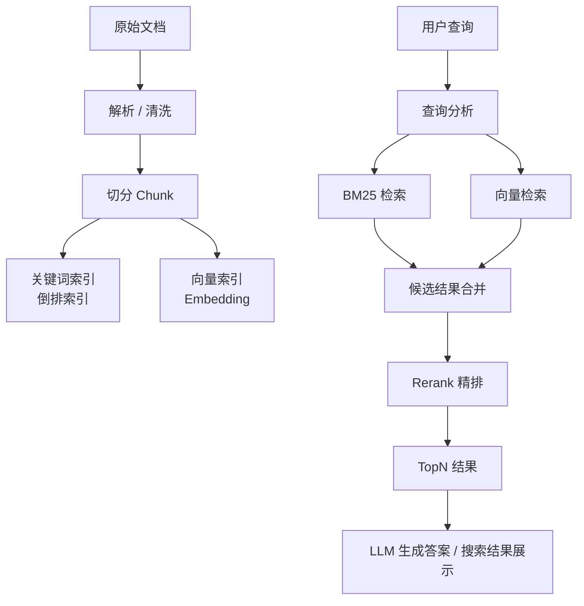
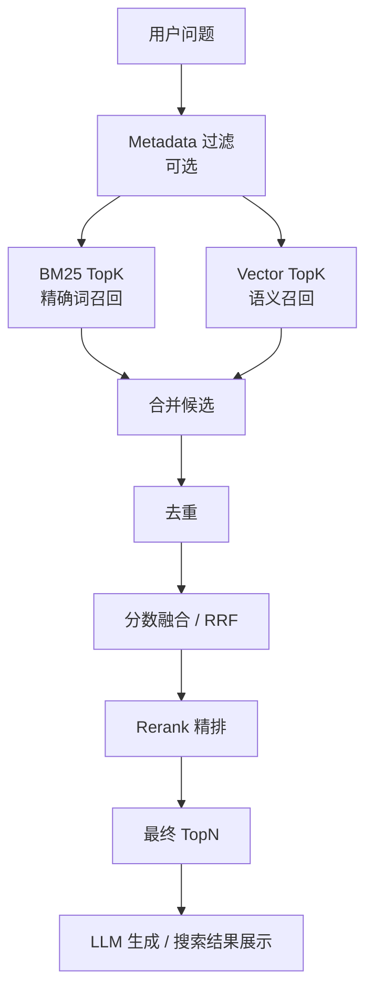

# 搜索引擎与 RAG 检索方法手册

本文整理 BM25、向量检索、Rerank、Hybrid Search 的核心原理、使用方式、效果指标和优化路径。适合用于理解搜索引擎、知识库问答、RAG 系统和企业内部检索系统的基础能力。

一句话先建立全局认知：

```text
BM25 负责精确词命中
向量检索负责语义相似
Rerank 负责候选结果精排
Hybrid Search 负责把多种检索能力组合起来
评估指标负责判断“到底有没有变好”
优化路径负责定位问题出在哪里
```

## 1. 搜索系统的基本流程

无论是传统搜索引擎，还是 RAG 知识库检索，大体都可以拆成两个阶段：入库阶段和查询阶段。



传统搜索系统可能只用关键词索引和 BM25；现代 RAG 系统通常会把 BM25、向量检索和 Rerank 组合起来。

## 2. BM25 介绍、原理和使用

### 2.1 BM25 是什么

BM25 全称是：

```text
Best Matching 25
```

它是信息检索领域经典的关键词相关性排序算法，常见于 Lucene、Elasticsearch、OpenSearch、Solr 等搜索系统。

BM25 本身不是分词器，它是一个打分公式。真正负责分词的是搜索引擎里的 Analyzer / Tokenizer。BM25 的作用是：在文档和查询词已经被分词、倒排索引已经建立后，计算某篇文档和用户查询有多相关。

### 2.2 BM25 的核心思想

BM25 主要考虑三个因素：

| 因素 | 含义 |
|---|---|
| TF | 查询词在文档中出现得越多，相关性通常越高 |
| IDF | 查询词越稀有，区分度越高，权重越大 |
| 文档长度归一化 | 长文档更容易包含关键词，需要避免字多占便宜 |

简化理解：

```text
BM25 得分 =
查询词稀有程度
× 查询词在文档里的出现程度
× 文档长度校正
```

更直白一点：

```text
一个词在文档里出现了，说明可能相关；
这个词出现多次，说明更相关；
这个词全库很少见，说明更重要；
文档特别长，需要做长度惩罚。
```

### 2.3 BM25 是怎么分词和查询的

BM25 的完整搜索链路通常是：

```text
文档入库
-> Analyzer 分词
-> 建倒排索引
-> 用户查询
-> 查询词分词
-> 查倒排索引
-> BM25 打分
-> 按分数排序
-> 返回 TopK
```

例如有三篇文档：

```text
doc1: Dify 知识库 RAG 召回优化
doc2: Elasticsearch BM25 检索原理
doc3: RAG 向量检索和混合搜索
```

分词后建立倒排索引：

```text
dify -> doc1
知识库 -> doc1
rag -> doc1, doc3
召回 -> doc1
优化 -> doc1
elasticsearch -> doc2
bm25 -> doc2
检索 -> doc2, doc3
向量 -> doc3
混合搜索 -> doc3
```

用户搜索：

```text
Dify RAG 怎么优化召回
```

查询分词后可能是：

```text
dify
rag
优化
召回
```

搜索引擎会从倒排索引找到候选文档，再用 BM25 给每篇文档打分。`doc1` 命中更多关键词，所以通常会排得更靠前。

### 2.4 BM25 适合什么场景

BM25 非常适合精确关键词检索：

```text
错误码
接口名
配置项
产品名
型号
人名
日志文本
代码片段
版本号
专有名词
```

例如：

```text
ERR_401_TOKEN_EXPIRED
/api/v1/chat-messages
SEARCH_PASSWORD
docker compose up -d
v1.15.0
```

这些场景里，BM25 通常比纯向量检索更稳。

### 2.5 BM25 的短板

BM25 依赖词面匹配，不擅长同义表达。

例如：

```text
用户问：怎么找回管理员账号？
文档写：重置 admin 凭据的方法
```

两句话意思相近，但字面词不完全一致，BM25 可能召回不好。这个时候向量检索更有优势。

### 2.6 BM25 使用建议

- 中文场景要重视分词器，例如 IK、jieba、smartcn、HanLP。
- 技术文档要保护专有词，不要把错误码、接口路径、变量名拆坏。
- 建自定义词典，例如 `Dify`、`RAG`、`Agentic RAG`、`SEARCH_PASSWORD`。
- 配置同义词词典，例如“找回密码”和“重置密码”。
- 对标题、摘要、正文设置不同字段权重。
- 对短查询、精确词查询，优先使用 BM25 或提高 BM25 权重。

## 3. 向量检索介绍、原理和使用

### 3.1 向量检索是什么

向量检索是把文本转成 embedding 向量，再在向量空间里查找和查询最接近的内容。

例如：

```text
用户问题：怎么重置管理员密码？
```

会被 embedding 模型转成一串数字：

```text
[0.12, -0.08, 0.31, ..., 0.04]
```

文档 chunk：

```text
管理员密码重置方法
```

也会被转成：

```text
[0.10, -0.07, 0.29, ..., 0.06]
```

然后向量数据库计算两组向量的相似度，返回最接近的 TopK 文档片段。

### 3.2 向量检索完整流程

```text
文档入库：
文档解析
-> Chunk 切分
-> Embedding 模型
-> 文本向量
-> 写入向量数据库

用户查询：
用户问题
-> 同一个 Embedding 模型
-> Query 向量
-> 计算 Query 向量和文档向量的相似度
-> 返回 TopK 最相似 chunk
```

一个关键要求是：

```text
文档向量和查询向量必须使用同一个 Embedding 模型。
```

如果文档用模型 A 向量化，查询用模型 B 向量化，两个向量空间不一致，相似度就没有意义。

### 3.3 常见相似度计算方式

#### Cosine Similarity 余弦相似度

余弦相似度看两个向量的方向是否接近。

```text
cosine = A · B / (|A| * |B|)
```

可以理解为：

```text
方向越接近，语义越相似。
```

RAG 场景里余弦相似度很常见。

#### Dot Product 内积

内积公式：

```text
dot = A · B
```

它会同时受到方向和向量长度影响。如果向量已经归一化，那么：

```text
Dot Product ≈ Cosine Similarity
```

很多向量数据库和模型会使用 dot product，因为计算效率高。

#### Euclidean Distance 欧氏距离

欧氏距离看两个向量之间的直线距离：

```text
distance = sqrt((a1-b1)^2 + (a2-b2)^2 + ...)
```

距离越小，越相似。

要注意：

```text
similarity 越大越好
distance 越小越好
```

### 3.4 为什么向量能表示语义

Embedding 模型在训练时学习了大量文本之间的上下文关系。语义接近的句子，在向量空间中通常会更近。

例如：

```text
如何重置密码
忘记密码怎么办
找回账号登录凭证
```

它们用词不同，但语义接近，向量距离会比较近。

而：

```text
如何重置密码
如何部署 Docker
```

语义差异较大，向量距离会比较远。

### 3.5 向量检索怎么做到很快

如果有 100 万个 chunk，每次查询都和所有向量逐个计算，会很慢。实际工程里会使用 ANN 近似最近邻索引。

常见索引包括：

```text
HNSW
IVF
PQ
ScaNN
DiskANN
```

ANN 的含义是：

```text
不一定 100% 找到全库最相似结果，
但能非常快地找到足够接近的 TopK。
```

所以向量搜索也有速度和召回率的权衡。

### 3.6 向量检索适合什么场景

适合：

- 自然语言问答。
- 同义表达。
- 概念解释。
- 模糊问题。
- 用户问题和文档表述不完全一致的场景。

不擅长：

- 错误码。
- 接口路径。
- 变量名。
- 型号。
- 精确版本号。
- 一字不差的关键词匹配。

### 3.7 向量检索使用建议

- 中文内容选择中文或多语言 Embedding。
- 技术文档测试专有名词、变量名和错误码召回能力。
- 更换 Embedding 模型后要重新索引。
- 合理设置 TopK，太小会漏召回，太大容易引入噪音。
- 设置相似度阈值，过滤低相关结果。
- 对重要场景加入 Rerank 精排。
- 不要把结构化数据强行向量化，订单、库存、统计数据更适合数据库查询。

## 4. Rerank 介绍、原理和使用

### 4.1 Rerank 是什么

Rerank 是重排序。它通常不是直接从全库检索，而是接收 BM25、向量检索或 Hybrid Search 召回的一批候选结果，然后重新判断每个结果和用户问题的相关性。

可以理解为：

```text
BM25 / 向量检索负责“找一批可能相关的内容”
Rerank 负责“从这批内容里排出真正最相关的”
```

### 4.2 Rerank 和向量检索的区别

向量检索通常是双塔结构：

```text
Query -> 向量
Document -> 向量
计算向量相似度
```

Rerank 通常更像交叉编码：

```text
把 Query 和 Document 放在一起
让模型判断这个 Document 是否能回答 Query
```

因此 Rerank 更慢，但更准。

### 4.3 Rerank 的典型流程

```text
用户查询
-> BM25 / 向量 / Hybrid 初召回 20-100 个候选
-> Rerank 模型逐个打分
-> 选出前 3-8 个
-> 交给 LLM 生成答案
```

### 4.4 Rerank 适合什么场景

适合：

- 初召回结果很多但排序不准。
- Hybrid Search 合并后结果来源较杂。
- 知识库内容相似度高，容易互相干扰。
- 企业制度、技术文档、政策文件、API 文档。
- RAG 回答经常被低质量 chunk 带偏。

不适合：

- 极低延迟场景。
- 候选结果已经非常准确。
- 成本非常敏感的场景。

### 4.5 Rerank 使用建议

- 先扩大初召回 TopK，再用 Rerank 缩小最终 TopN。
- 对复杂知识库，初召回可以设为 20-50，最终保留 3-8。
- Rerank 前可以先做 Metadata 过滤，减少无关候选。
- Rerank 后仍要检查最终 chunk 是否真的包含答案。
- 对中文知识库选择中文或多语言 Rerank 模型。

## 5. Hybrid Search 如何整合多种方法

### 5.1 Hybrid Search 是什么

Hybrid Search 通常是：

```text
BM25 关键词检索
+ 向量语义检索
+ Rerank 重排序
```

它的目标是：

```text
既能搜到精确关键词，
又能理解语义相似，
最后再把真正最相关的结果排到前面。
```

### 5.2 为什么需要 Hybrid Search

单独使用 BM25 或向量检索都有短板。

| 方法 | 优点 | 短板 |
|---|---|---|
| BM25 | 精确词强、快、可解释 | 不懂同义表达 |
| 向量检索 | 语义强、适合自然语言 | 专有名词、数字、错误码不一定稳 |
| Rerank | 判断相关性更准 | 成本更高、速度更慢 |

Hybrid Search 的组合方式是：

```text
BM25 防止精确词漏掉
向量检索补足语义理解
Rerank 把真正有用的结果排到前面
```

### 5.3 Hybrid Search 典型流程



### 5.4 候选结果如何融合

BM25 分数和向量相似度不是同一套单位，不能直接粗暴相加。常见融合方式有三类。

#### 加权融合

把不同检索器的分数归一化后加权：

```text
最终分 = 0.4 * BM25归一化分 + 0.6 * 向量相似度归一化分
```

如果专有名词多，可以提高 BM25 权重。  
如果自然语言问答多，可以提高向量权重。

#### RRF 融合

RRF 是 Reciprocal Rank Fusion。它不太依赖原始分数，而是按排名融合。

直觉上：

```text
一个 chunk 在 BM25 排第 2，在向量检索排第 5，
它的综合排名应该比较靠前。
```

RRF 的好处是对不同检索器的分数尺度不敏感。

#### 合并后直接 Rerank

很多 RAG 系统会先把 BM25 和向量检索召回结果合并去重，再交给 Rerank 模型重新排序。

这种方式简单直接，但 Rerank 成本会随候选数量上升。

### 5.5 Hybrid Search 使用建议

推荐组合：

```text
Metadata 过滤
+ BM25 TopK
+ Vector TopK
+ RRF / 加权融合
+ Rerank
+ 最终 TopN
```

场景调参：

| 场景 | 建议 |
|---|---|
| 错误码、接口文档、配置项多 | 提高 BM25 权重 |
| 产品说明、政策、FAQ 多 | 提高向量权重 |
| 结果很多但排序不好 | 开启 Rerank |
| 召回不到答案 | 增大初召回 TopK |
| 答案噪音太多 | 降低最终 TopN 或提高阈值 |
| 多产品、多版本混召回 | 加 Metadata 过滤 |

## 6. 搜索效果指标

搜索优化不能只看最终回答“像不像”。应该先看检索是否找到了正确证据，再看生成答案是否忠于证据。

### 6.1 召回类指标

#### Recall@K

看正确答案是否出现在前 K 个结果里。

```text
Recall@5 = 正确答案是否在前 5 个召回结果中
```

RAG 里非常重要，因为答案没召回，大模型很容易胡编。

#### Hit Rate

看某次查询是否命中了正确文档或正确 chunk。

```text
命中 = 1
未命中 = 0
```

适合用来做小规模测试集评估。

### 6.2 排序类指标

#### Precision@K

看前 K 个结果里有多少是真的相关。

```text
Precision@5 = 前 5 个结果中相关结果数量 / 5
```

如果 Precision 低，说明召回噪音太多。

#### MRR

MRR 是 Mean Reciprocal Rank，看第一个正确答案排得靠不靠前。

```text
第一个正确结果排第 1 -> 得分 1
第一个正确结果排第 2 -> 得分 1/2
第一个正确结果排第 5 -> 得分 1/5
```

适合问答场景，因为用户通常最关心第一个正确结果能不能靠前。

#### NDCG

NDCG 衡量排序质量，尤其适合结果有不同相关性等级的情况。

例如：

```text
完全相关 = 3
部分相关 = 2
弱相关 = 1
无关 = 0
```

越相关的结果排得越靠前，NDCG 越高。

### 6.3 生成类指标

#### Faithfulness

看最终答案是否忠于召回证据。

如果检索到了正确内容，但模型回答时编造了不存在的信息，Faithfulness 就低。

#### Answer Relevance

看最终回答是否真正回答了用户问题。

#### Citation Accuracy

看答案引用的来源是否真的支持回答内容。

企业知识库和 RAG 问答里，这个指标很关键。

### 6.4 工程指标

| 指标 | 含义 |
|---|---|
| Latency | 查询耗时 |
| Cost | Embedding、Rerank、LLM 调用成本 |
| Indexing Time | 文档入库和索引耗时 |
| Freshness | 新文档入库后多久能被搜到 |
| Stability | 查询结果是否稳定 |
| Coverage | 知识库是否覆盖主要问题 |

## 7. 搜索优化路径

搜索效果不好时，不要一上来就换大模型。更稳的排查顺序是：

```text
数据质量
-> 文档解析
-> Chunk 切分
-> 分词 / 词典
-> Embedding 模型
-> 检索策略
-> Rerank
-> Metadata
-> Prompt / 生成约束
-> 评估闭环
```

### 7.1 召回不到答案

表现：

```text
正确文档或正确 chunk 不在 TopK 里
```

可能原因：

- 文档没有入库。
- 文档解析失败。
- chunk 切得太碎或太大。
- 中文分词不准。
- Embedding 模型不适合当前语料。
- TopK 太小。
- Metadata 过滤过严。

优化：

- 检查原文是否存在。
- 查看 chunk 是否包含答案。
- 调整 chunk 大小和 overlap。
- 增加自定义词典和同义词。
- 换更适合语言和领域的 Embedding。
- 增大初召回 TopK。
- 放宽过滤条件。

### 7.2 召回结果太杂

表现：

```text
TopK 里有很多看似相关但不能回答问题的 chunk
```

可能原因：

- TopK 太大。
- 知识库混了多个产品、版本、领域。
- chunk 太大，包含太多噪音。
- 只用向量检索，语义相似但事实不对。

优化：

- 加 Metadata 过滤。
- 按产品、版本、文档类型拆知识库。
- 降低最终 TopN。
- 开启 Rerank。
- 调整 chunk，让每个 chunk 更聚焦。

### 7.3 排序不准

表现：

```text
正确 chunk 被召回了，但排得很靠后
```

优化：

- 开启 Rerank。
- 使用 RRF 融合 BM25 和向量结果。
- 调整 BM25 / 向量权重。
- 提高标题、摘要等字段权重。
- 建立测试集观察 MRR 和 NDCG。

### 7.4 错误码、接口名、配置项搜不到

表现：

```text
用户搜 SEARCH_PASSWORD、ERR_401、/api/v1/message，结果不稳定
```

优化：

- 使用 BM25 或提高 BM25 权重。
- 检查分词器是否拆坏专有词。
- 增加自定义词典。
- 对代码、接口、配置字段使用 keyword 类型或精确匹配字段。
- 建立同义词和别名映射。

### 7.5 语义相近问题搜不到

表现：

```text
用户说法和文档说法不同，BM25 命中差
```

优化：

- 使用向量检索。
- 选择更适合当前语言的 Embedding。
- 做 query rewrite。
- 使用 HyDE 或多查询改写。
- 开启 Hybrid Search。

### 7.6 最终回答胡编

表现：

```text
召回结果不足，LLM 仍然给出确定答案
```

优化：

- Prompt 中要求只基于证据回答。
- 增加“证据是否足够”判断。
- 没有证据时明确回答“不知道”。
- 输出引用来源。
- 降低无关 chunk 注入。
- 对高风险问题加人工审核。

## 8. 推荐落地流程

### 8.1 建测试集

先准备 30-100 个真实问题：

| 问题 | 正确文档 | 正确 chunk | 问题类型 |
|---|---|---|---|
| 如何重置管理员密码？ | admin.md | 第 3 节 | 操作步骤 |
| SEARCH_PASSWORD 怎么配置？ | deploy.md | 环境变量部分 | 配置项 |
| API 401 是什么原因？ | api-error.md | 401 错误码说明 | 错误码 |

### 8.2 先看检索，再看生成

调试顺序：

```text
1. 正确 chunk 是否被召回
2. 正确 chunk 排第几
3. 注入上下文是否干净
4. LLM 是否忠于证据
```

不要只看最终答案，因为最终答案可能掩盖检索问题。

### 8.3 推荐默认配置

通用知识库可以从这个组合开始：

```text
Chunk：按结构切分，必要时 parent-child
BM25：开启
Vector：开启
Hybrid：RRF 或加权融合
Rerank：开启
TopK 初召回：20-50
最终 TopN：3-8
Metadata：按产品、版本、文档类型过滤
```

### 8.4 迭代优化

```text
小批量文档
-> 建测试集
-> 跑检索评估
-> 调 chunk / 分词 / embedding
-> 开启 Hybrid + Rerank
-> 比较 Recall@K、MRR、NDCG
-> 再扩大知识库
```

## 9. 总结

BM25、向量检索、Rerank、Hybrid Search 不是互相替代的关系，而是分工不同。

```text
BM25：精确词强，适合错误码、接口名、配置项、专有名词。
向量检索：语义强，适合自然语言、同义表达、模糊问题。
Rerank：排序强，适合从候选结果中挑出真正相关内容。
Hybrid Search：组合强，用多路召回扩大覆盖，再用融合和 Rerank 压低噪音。
```

真正的搜索优化不是只调一个参数，而是围绕数据、索引、召回、排序、生成和评估形成闭环。

最实用的一句话：

```text
先保证正确答案能被召回，
再保证正确答案排得靠前，
最后再让模型基于证据回答。
```
