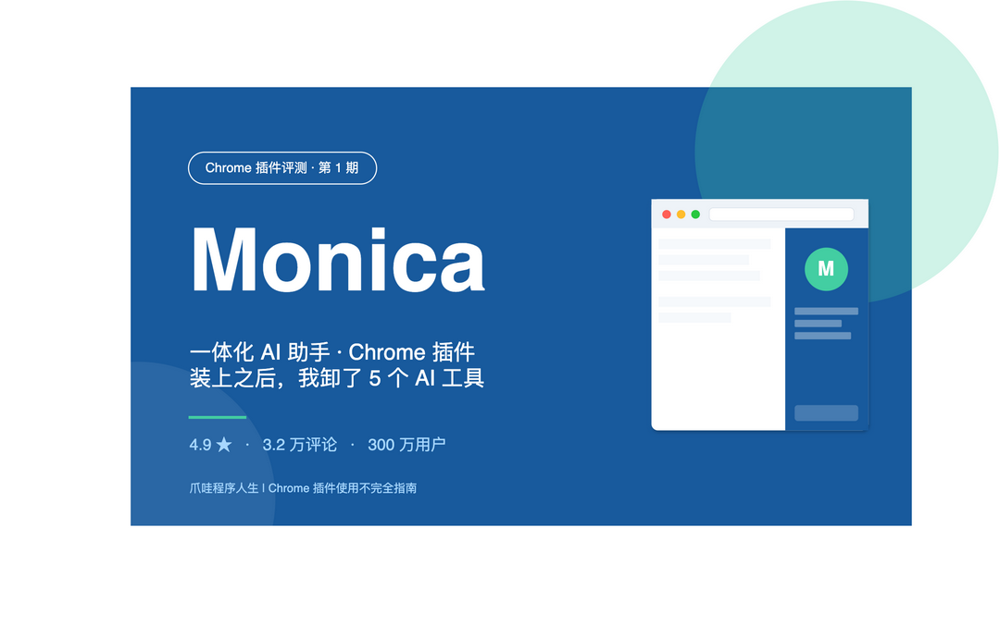
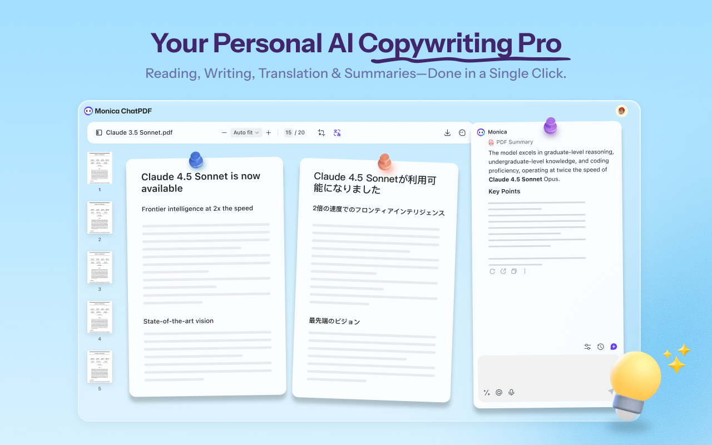
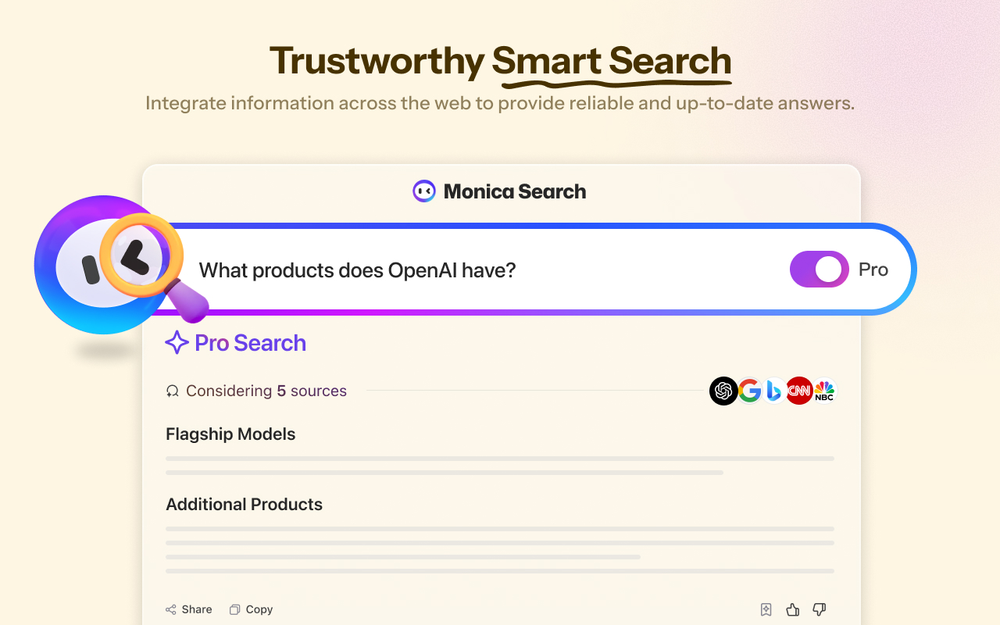
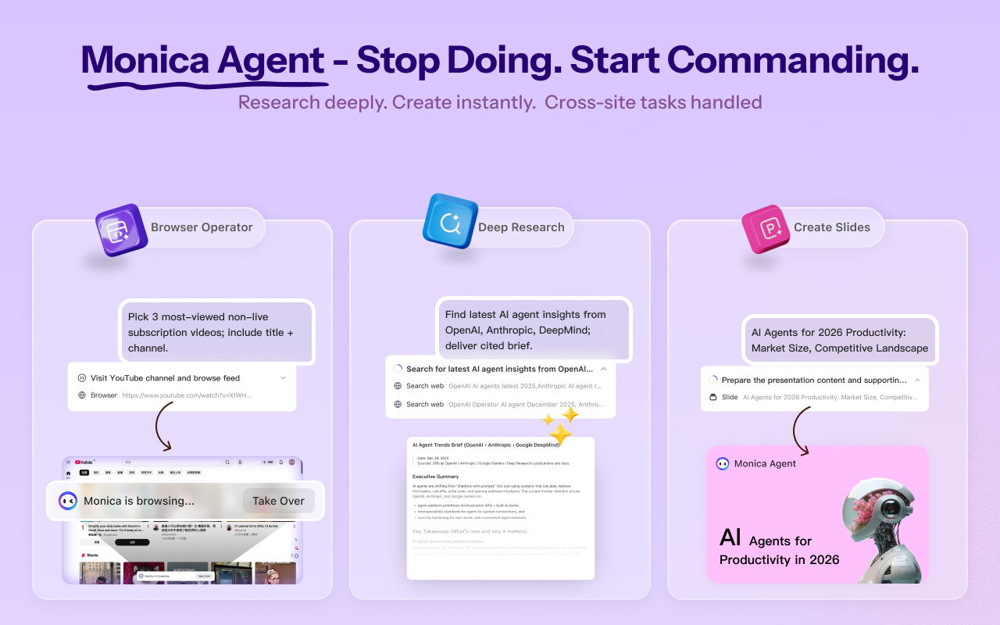
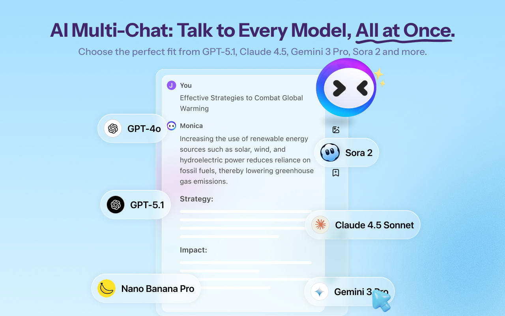

# 这个 Chrome 插件让我同时拥有 GPT-5、Claude 和 Gemini，3 个月卸了 5 个 AI 工具

> 作者：从 ChatGPT 网页、Claude 网页、Gemini 网页、Kimi、字节豆包之间反复横跳了半年的我，最近终于把这些标签页全关了。原因只有一个：Chrome 上多了一个叫 Monica 的插件。

## 先看一组数据

打开 Chrome 应用商店，搜「Monica」，第一条结果是这个：

- 评分 **4.9 / 5**
- 评分人数 **3.2 万**
- 用户量 **300 万**
- 类别：扩展程序 / 工具
- 开发者：BUTTERFLY EFFECT PTE. LTD.（新加坡）

我用 Chrome 这么多年，能在「工具」分类下同时拿到 4.9 分和 300 万用户的插件，一只手数得过来。所以我装上用了 90 天，今天来说说它到底凭什么。

---

## 这是个什么插件

一句话定位：**一个塞进浏览器侧边栏的全模型 AI 助手**。

| 字段 | 内容 |
|---|---|
| 插件名 | Monica：一体化 AI 助手 & 最智能 AI 代理 |
| 一句话 | 在任何网页按 Cmd/Ctrl + M 唤出 AI，支持 GPT-5、Claude 4、Gemini 3、DeepSeek 等主流模型 |
| 开发团队 | BUTTERFLY EFFECT PTE. LTD. |
| 商店地址 | https://chromewebstore.google.com/detail/ofpnmcalabcbjgholdjcjblkibolbppb |
| 评分 | 4.9 / 5（3.2 万 评分） |
| 用户量 | 300 万+ |
| 价格 | 免费版每天有限次数 / Plus 月付（约 $9.9） |
| 兼容 | Chrome / Edge / Brave / Arc 全部 Chromium 系浏览器 |
| 数据权限 | 需要读取你正在访问的网页内容（用于划词、总结、问答） |

权限那一栏先讲清楚——Monica 会读你当前网页内容，因为它要做划词翻译和网页总结。能不能接受请自己判断；我个人的取舍是：相比同时挂着 5 个 AI 网页 tab、每个都要登录态，Monica 一家承担访问权限反而更可控。

---

## 安装：三步搞定

### Step 1：打开 Chrome 商店搜 Monica

直接进 [chromewebstore.google.com](https://chromewebstore.google.com/detail/ofpnmcalabcbjgholdjcjblkibolbppb) 或在 Chrome 工具栏点拼图图标 → 商店 → 搜「Monica」。

### Step 2：点「添加至 Chrome」

弹窗会列出权限：读取浏览数据、修改剪贴板等。看清楚再点「添加扩展程序」。

### Step 3：固定到工具栏 + 注册账号

装好默认是隐藏的。点 Chrome 右上角拼图图标 → Monica 那一行 → 点图钉，固定到工具栏。

第一次点开会让你注册或用 Google 登录。免费账号每天有 40 次基础问答额度，够个人轻度使用。

提示：装完按一次 **Cmd/Ctrl + M**，从此唤出它都不用动鼠标。

---

## 五个让我离不开的功能

### 功能 1：划词即用，翻译 / 解释 / 改写一键完成

任何网页选中一段英文，旁边会冒出一个小 Monica 图标，点一下就能选「翻译」「解释」「改写」「总结」「找语法错误」。

我读 GitHub Issue 时最常用「解释」——遇到不熟的术语直接划，它会在原位给你一段中文解释，不用切窗口。**这个动作我每天大概触发 30 次**，原来切到 ChatGPT 网页要 5 秒，现在 0.5 秒。

### 功能 2：模型自由切换，GPT、Claude、Gemini、DeepSeek 一个账号搞定

最让我惊喜的是它把主流模型都接进来了。一个对话里可以随时切换：写作让 Claude 上，做数学题让 GPT 上，总结超长文档让 Gemini 上（200 万 token 上下文很香）。

之前我为了用 Claude 单独开美区账号，为了用 Gemini Pro 又得另一个账号，光记密码就要开个文档。Monica 一个账号全打通，**会员费比单独订阅 ChatGPT Plus 还便宜**。

### 功能 3：网页 / PDF / YouTube 一键总结

点工具栏 Monica 图标，唤出右侧侧边栏，里面有「总结当前页面」按钮。

实测下来：

- **网页文章**：3000 字技术博客，6 秒出 5 条要点摘要
- **PDF 论文**：22 页 ICLR 论文，30 秒出大纲 + 关键贡献
- **YouTube 视频**：1 小时英文 podcast，调出字幕直接总结成时间轴笔记，省下听全程的 1 小时

我现在看英文论文的流程是：浏览器打开 PDF → 让 Monica 出大纲 → 自己挑感兴趣的章节细读 → 让它逐段翻译。**比纯用 ChatGPT 网页快 3 倍**，因为不用复制粘贴。

### 功能 4：AI 写作助手（嵌入任何输入框）

在任何网页的输入框（公众号后台、微博、Gmail、知乎答题区）右键，会有「Monica AI 写作」选项：续写、扩写、缩写、改语气、纠错。

我写公众号文章时常用「改正式语气」和「检查重复」。比起开个 ChatGPT 新窗口、复制粘贴、再贴回来，**少了 4 个动作**。日积月累下来真不是一点半点的效率差。

### 功能 5：AI 画图（Nano Banana / Sora 2 / GPT Image 2）

侧边栏里有专门的「AI Image」入口，描述一句中文也能出图。模型走的是 Nano Banana（Google 的 imagen）和 GPT Image 2，风格挺自然，没有那种一眼假的 AI 油腻感。

文章封面、PPT 配图、随手出个梗图，都不用再切到 Midjourney 或者 DALL·E 网页。

---

## 我自己的两个真实场景

**场景一：读 arXiv 论文**

以前一篇 PDF 要在 ChatGPT、Google 翻译、原文 PDF 三个 tab 之间切。现在浏览器开 PDF，左边读，右边 Monica 侧边栏跟着问，「这一段的 ablation 实验是怎么设计的」「为什么这里 baseline 用 GPT-4 不是 GPT-4o」。一边读一边问，**90 分钟一篇 9 页论文 → 现在 35 分钟**。

**场景二：调研写文章前的资料阶段**

写文章前我会一次开 15-20 个参考链接。以前每篇要点一下读完做笔记。现在每个 tab 唤出 Monica 让它出 3 句话摘要，自己快速挑出真正要细读的 3-5 篇。**调研阶段从 2 小时压缩到 40 分钟**，文章质量没下降。

---

## 谁该装 / 谁可以观望

**应该装**：

- 每天和 AI 工具打交道超过 3 次的人（程序员、研究员、内容创作者、外贸 / 跨境从业者）
- 经常读英文资料、看英文视频的人
- 同时订阅了多家 AI 服务、想砍重复开销的人

**可以观望**：

- 已经深度依赖 ChatGPT 客户端、习惯了它的工作流的人
- 对网页内容读取权限非常敏感的人

**几个替代方案**（思路各不同，可以一起对比）：

- **Sider**：思路类似的「全网模型聚合 + 侧边栏」，免费额度更慷慨，但 UI 没 Monica 精致
- **MaxAI**：偏写作和总结，模型选择没 Monica 多
- **ChatGPT for Google**：只接 OpenAI，但和 Google 搜索结果联动得最好

---

## 最后

Monica 不是「最强大」的 AI 产品，但它解决了一个被严重忽视的问题：**AI 工具切换成本**。当一个东西把这个成本降到趋近于零，它就不再是个工具，而是浏览器的一部分。

我用了 90 天，已经把 ChatGPT、Claude、Gemini 三个网页书签全删了。下次再看到它们，可能是在某篇博客里被人比较的时候。

下载链接（按你的浏览器和网络情况挑一个）：

| 渠道 | 适用场景 | 地址 |
|---|---|---|
| **Chrome 应用商店** | Chrome 用户、能访问 Google 服务 | https://chromewebstore.google.com/detail/ofpnmcalabcbjgholdjcjblkibolbppb |
| **Edge Add-ons** | Edge 浏览器直接装，国内可直连 | https://microsoftedge.microsoft.com/addons/detail/fhimbbbmdjiifimnepkibjfjbppnjble |
| **极简插件（国内中转）** | 不能科学上网时的稳妥选择 | https://chrome.zzzmh.cn/info/ofpnmcalabcbjgholdjcjblkibolbppb |
| **CRX 搜搜（国内备选）** | 极简插件打不开时的备胎 | https://www.crxsoso.com/ （搜索 Monica） |

几点说明：

- Edge 装 Chrome 商店的扩展也完全 OK，但 Edge 自己的 Add-ons 商店访问更顺，推荐 Edge 用户走第二条
- 极简插件下载下来是 .crx 文件，安装方法：Chrome 输入 `chrome://extensions` → 打开「开发者模式」→ 把 .crx 拖进去
- Brave / Arc 这类 Chromium 系浏览器都能装 Chrome 商店的扩展，方法和 Chrome 一样

按 **Cmd/Ctrl + M**，开始你的浏览器 AI 化改造。
