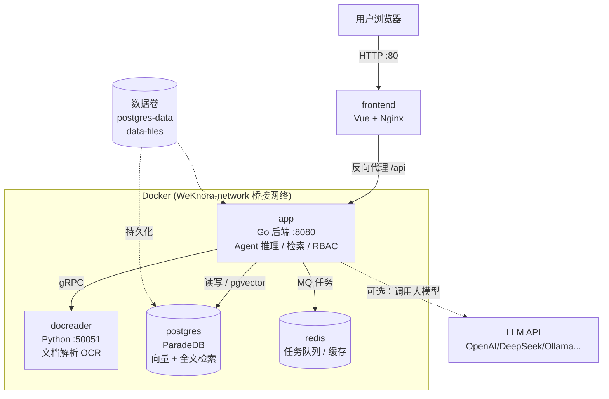
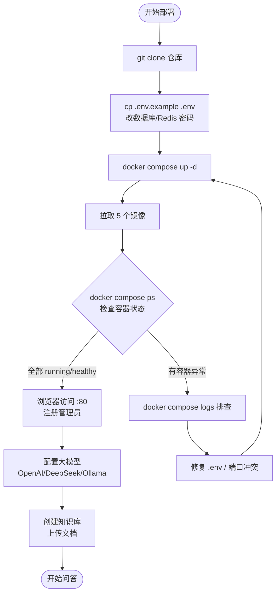
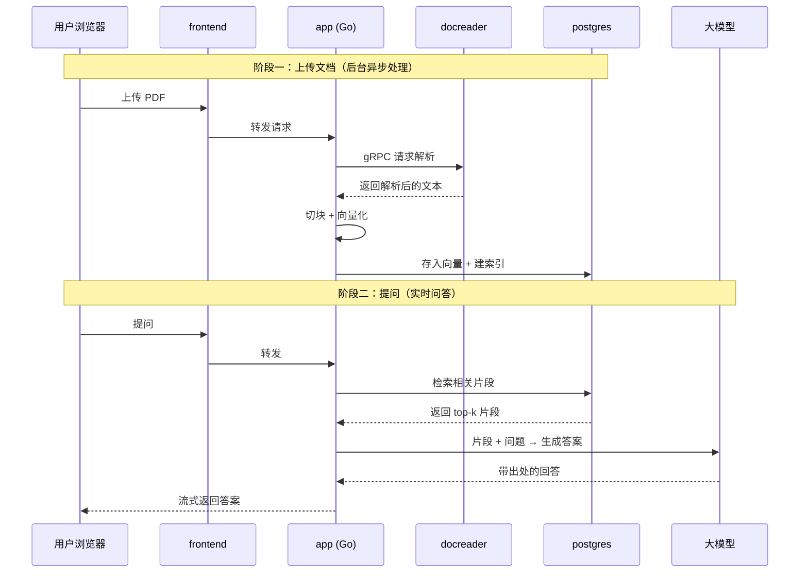

# 用 Docker 把腾讯 WeKnora 跑起来：一套私有化知识库问答系统的完整部署

公司里几百份文档散落在各处：产品手册、技术方案、会议纪要、Excel 报表，还有一堆扫描件 PDF。有人问"上次那个退款政策文档在哪、具体怎么写的"，你只能翻群记录、翻网盘。想搭个"能回答这些文档内容的 AI 助手"，又不敢把公司资料传到公网 SaaS。

WeKnora（维娜拉）是腾讯开源的知识库问答框架，MIT 协议，可完全私有化部署，也是微信对话开放平台背后的核心技术框架。它把文档解析、切块、建索引、检索、多步推理这一整套 RAG（检索增强生成）流程打包好了，你只要用 Docker Compose 起几个容器，就能得到一个带出处、可追溯的文档问答系统。

这篇讲怎么用 Docker 把它稳稳地部署起来——从核心 5 个容器的最小启动，到按需挂知识图谱、对象存储、链路追踪，再到生产环境该怎么加固。

## 先认识这个项目

| 项目 | 信息 |
|---|---|
| 仓库 | [Tencent/WeKnora](https://github.com/Tencent/WeKnora) |
| Star | 约 18.5k |
| 出品方 | 腾讯，微信对话开放平台核心框架 |
| 语言 | Go（后端）+ Python（文档解析）+ Vue（前端） |
| 协议 | MIT |
| 参考版本 | v0.7.0（迭代很快，部署时请以最新 Release 为准） |
| 部署方式 | Docker Compose / Kubernetes (Helm) |
| 官网 | [weknora.weixin.qq.com](https://weknora.weixin.qq.com) |

三个核心玩法值得先了解，它们直接决定你要不要开启对应的可选组件：

- **RAG 快速问答**：检索相关文档片段 + 大模型生成答案，带出处。核心服务就能跑。
- **ReAct Agent**：复杂多步任务，AI 自己编排"检索、调 MCP 工具、上网搜"，一步步推理。想让它上网搜，需要额外开 SearXNG。
- **Wiki 模式**：让 Agent 把原始文档自动整理成带目录、带内部链接、带知识图谱的 Markdown 知识库。想要知识图谱可视化，需要额外开 Neo4j。

## 部署架构：核心 5 个容器

WeKnora 默认（不加任何 profile）启动 5 个容器，它们各管一段：



拆开说每个容器的职责：

- **frontend**（`wechatopenai/weknora-ui`）：Vue 前端 + Nginx，对外暴露 80 端口，把 `/api` 请求反向代理给 app。用户只跟它打交道。
- **app**（`wechatopenai/weknora-app`）：Go 后端，主力。Agent 推理、检索、会话、RBAC 权限、任务调度都在这。监听 8080。
- **docreader**（`wechatopenai/weknora-docreader`）：Python 服务，专职啃文档（PDF/Word/Excel/图片 OCR），通过 gRPC 跟 app 通信。50051 端口只在容器网络内可见，不对外暴露。
- **postgres**（`paradedb/paradedb:v0.22.2-pg17`）：注意不是原版 PostgreSQL，而是 ParadeDB——它内置了 pgvector（向量检索）和 pg_search（BM25 全文检索），WeKnora 的混合检索靠它。
- **redis**（`redis:7.0-alpine`）：异步任务队列（文档解析、向量化、Wiki 生成都是后台任务）和缓存。

为什么文档解析要单独拆一个 Python 服务？因为**文档解析这件事 Python 生态的库最全**（PyMuPDF、python-docx、PaddleOCR…），而高并发调度用 Go 更合适。各用所长，用 gRPC 缝起来。

这是一个多服务项目，比单容器的应用复杂，但 Compose 已经把服务依赖、健康检查、网络都编排好了，实际部署并不难。

## 环境准备

WeKnora 的部署不是拉一个镜像跑 `docker run` 就行——它的 Compose 需要挂载仓库里的 `config/config.yaml`、`.env.example` 等文件，所以**必须先 clone 仓库**。

先确认机器满足要求：

| 项目 | 最低 | 推荐 |
|---|---|---|
| 操作系统 | Linux / macOS / Windows(WSL2) | Linux amd64 |
| 内存 | 4 GB | 8 GB 及以上（开 Neo4j/Langfuse 更多） |
| 磁盘 | 20 GB | 50 GB 及以上（文档 + 向量 + 镜像） |
| Docker | 20.10+ | 最新稳定版 |
| Docker Compose | v2（`docker compose` 子命令） | v2.24+ |

检查 Docker 环境：

```bash
# 确认 Docker 和 Compose v2 可用
docker --version
docker compose version
```

如果 `docker compose version` 报错，说明装的是旧版 `docker-compose`（带横线），建议升级到 Docker 自带的 Compose v2 插件。

## 快速部署：核心服务跑起来

### 第一步：克隆仓库

```bash
# 克隆到 /opt 目录（生产环境习惯放这）
cd /opt
git clone https://github.com/Tencent/WeKnora.git
cd WeKnora
```

### 第二步：准备 .env 配置

```bash
# 从官方示例复制一份，然后按注释编辑
cp .env.example .env
```

`.env` 里最需要关心的是数据库和 Redis 的凭据——**默认示例里的密码务必改掉**。用编辑器打开 `.env`，重点确认以下几项：

```bash
# ===== 数据库（ParadeDB / PostgreSQL）=====
DB_DRIVER=postgres
DB_HOST=postgres          # 容器服务名，不要改成 localhost
DB_PORT=5432
DB_USER=weknora           # 自定义用户名
DB_PASSWORD=改成你的强密码  # 必改
DB_NAME=weknora

# ===== Redis =====
REDIS_ADDR=redis:6379     # 容器服务名
REDIS_PASSWORD=改成你的强密码  # 必改，compose 用它启动 redis

# ===== docreader（文档解析服务）=====
DOCREADER_ADDR=docreader:50051

# ===== 时区 / 语言 =====
TZ=Asia/Shanghai
WEKNORA_LANGUAGE=zh-CN

# ===== 端口（如与现有服务冲突再改）=====
FRONTEND_PORT=80          # Web UI 对外端口
APP_PORT=8080             # 后端 API 对外端口
```

**这里有个容易踩的坑**：`DB_HOST` 和 `REDIS_ADDR` 用的是 Compose 里的**服务名**（`postgres`、`redis`），不是 `localhost`。容器之间靠服务名在 `WeKnora-network` 桥接网络里互相寻址，写成 `localhost` 会连不上自己容器内不存在的数据库。

### 第三步：启动核心服务

```bash
# 拉取镜像并后台启动核心 5 个容器
docker compose up -d
```

首次启动会从 Docker Hub 拉 5 个镜像（app、frontend、docreader、paradedb、redis），app 和 docreader 镜像较大，视网速可能要几分钟。国内拉取慢的话看下面的加速方案。

### 第四步：确认容器状态

```bash
# 查看所有容器状态
docker compose ps

# 跟踪启动日志
docker compose logs -f app
```

正常的话，`docker compose ps` 里 5 个容器都应该是 `running`，其中 app、postgres、docreader 会显示 `healthy`（它们配了健康检查）。app 的健康检查有 60 秒宽限期，刚启动时短暂显示 `starting` 是正常的。

### 第五步：访问

浏览器打开 `http://服务器IP`（默认 80 端口，本机就是 `http://localhost`）。首次进入会引导你注册管理员账号——WeKnora 从 v0.1.3 起内置了登录鉴权。

服务地址速查：

| 服务 | 地址 |
|---|---|
| Web UI | `http://localhost` |
| 后端 API | `http://localhost:8080` |

## 国内镜像加速

如果 `docker compose up -d` 拉镜像超时，用国内镜像源。WeKnora 的镜像在 Docker Hub 上（`wechatopenai/*`、`paradedb/*`、`redis`），最省事的做法是配置 Docker Daemon 全局加速器：

```bash
# 一键配置镜像加速（复制即用）
sudo mkdir -p /etc/docker
sudo tee /etc/docker/daemon.json <<'EOF'
{
  "registry-mirrors": [
    "https://docker.1ms.run",
    "https://docker.m.daocloud.io",
    "https://docker.1panel.live",
    "https://docker-0.unsee.tech",
    "https://hub.rat.dev",
    "https://docker.xuanyuan.me"
  ]
}
EOF
sudo systemctl daemon-reload
sudo systemctl restart docker
```

配完重新 `docker compose up -d` 即可，所有 `docker pull` 自动走加速。

如果只想单独拉某个镜像，也可以替换前缀手动拉：

```bash
# 替换镜像前缀直接拉取（无需配置 daemon）
docker pull docker.1ms.run/wechatopenai/weknora-app:latest
docker pull docker.m.daocloud.io/paradedb/paradedb:v0.22.2-pg17
```

> 以上镜像源可能因维护变动而暂时不可用，如遇失败请依次尝试其他地址。

另外，clone 仓库慢的话，可以用 GitHub 加速代理或把仓库地址换成国内镜像站，但要注意仓库更新频繁，尽量用官方源保证是最新的。

## 部署流程全景

把上面的步骤串起来，一次完整部署的流程是这样：



关键点：容器起来只是第一步，WeKnora 要能回答问题，还得**配置大模型**（在 Web UI 的设置里填 API Key，或指向本地 Ollama）和**创建知识库上传文档**。没配模型的话，问答会报错。

## 首次配置：接入大模型

WeKnora 自己不含大模型，它是"编排层"，需要你接一个 LLM。进入 Web UI 后，在模型设置里配置。它兼容非常多的厂商：OpenAI、Azure、Claude、DeepSeek、Qwen（阿里云）、智谱、混元、豆包、Gemini、MiniMax、Ollama 等。

如果想完全本地化、不调外部 API，用 Ollama 是最常见的选择。Compose 里 app 容器已经预置了 `OLLAMA_BASE_URL=http://host.docker.internal:11434`，并配了 `host.docker.internal` 的 host-gateway 映射，所以容器能访问到宿主机上的 Ollama：

```bash
# 在宿主机上启动 Ollama（先装好 ollama）
ollama serve > /dev/null 2>&1 &

# 拉一个对话模型和一个 embedding 模型
ollama pull qwen2.5
ollama pull bge-m3
```

然后在 WeKnora 设置里把大模型和 Embedding 模型都指向 Ollama 即可。

## 按需开启可选组件（Profile）

WeKnora 的可选功能通过 Compose 的 profile 机制挂载，用 `--profile` 叠加。这套设计的好处是：**不用的组件根本不会启动，不占资源**。

| Profile | 增加的能力 | 启动命令 |
|---|---|---|
| （默认） | 核心问答 | `docker compose up -d` |
| `neo4j` | 知识图谱可视化 | `docker compose --profile neo4j up -d` |
| `minio` | 对象存储（大量文件） | `docker compose --profile minio up -d` |
| `langfuse` | 链路追踪 / 可观测 | `docker compose --profile langfuse up -d` |
| `searxng` | Agent 网络搜索 | `docker compose --profile searxng up -d` |
| `full` | 一次性全开 | `docker compose --profile full up -d` |

多个 profile 可以叠加：

```bash
# 同时开启知识图谱 + 对象存储
docker compose --profile neo4j --profile minio up -d
```

几点实际建议：

- **个人试用 / 小团队**：默认核心服务就够了，PostgreSQL 里的 pgvector 已经能做向量检索。
- **要 Wiki 知识图谱可视化**：加 `--profile neo4j`。Neo4j 会额外占用较多内存，机器内存小别开。
- **文档量很大（上万份）**：加 `--profile minio`，把文件存到对象存储，别都堆在本地卷。
- **想调试 Agent 每一步在想什么**：加 `--profile langfuse`。它会额外起 ClickHouse + 专用 MinIO + worker + web 四个容器，比较重，Langfuse UI 在 `http://localhost:3000`。

> 注意：`langfuse` 这套自建可观测栈里，`.env` 有 `LANGFUSE_SALT`、`LANGFUSE_ENCRYPTION_KEY`、`LANGFUSE_NEXTAUTH_SECRET` 等占位密钥，**生产环境务必用 `openssl rand` 重新生成**，别用示例默认值。

WeKnora 还支持把默认的 PostgreSQL 向量库换成 Qdrant / Milvus / Weaviate / Elasticsearch / Apache Doris 等，对应的 profile 分别是 `qdrant`、`milvus`、`weaviate`、`doris`。除非你已有这些基础设施或有特殊性能需求，否则默认的 ParadeDB 足够。

## 一次问答的完整流转

理解了组件，再看你上传一份 PDF、然后提问，系统内部怎么跑：



文档处理是**异步**的（上传后进 Redis 队列，后台慢慢解析、向量化），问答是**实时**的（现场检索 + 生成）。所以你上传大文档后，要等它在后台处理完才能问到里面的内容——这也是为什么 Redis 队列是核心组件之一。

## 生产环境建议

把 WeKnora 用于正式环境，下面几点别省。

### 部署在内网，别裸奔到公网

这是官方明确强调的安全建议。WeKnora 里存的是你的核心文档资产，**不要把 80/8080 端口直接暴露到公网**。正确做法：

- 部署在内网 / VPC，通过 VPN 或跳板机访问；
- 如必须对外，前面套一层带认证的反向代理（Nginx / Caddy），配 HTTPS。

### 用 Nginx/Caddy 配 HTTPS

在 WeKnora 前面加一层反向代理，把 80 端口的 HTTP 升级成 HTTPS。用 Caddy 最省事，自动签发证书：

```bash
# /etc/caddy/Caddyfile
knora.yourcompany.com {
    reverse_proxy localhost:80
}
```

配好后 Caddy 会自动向 Let's Encrypt 申请证书，用户走 `https://knora.yourcompany.com` 访问。注意：这台机器要能被 Let's Encrypt 验证到域名（内网纯离线环境则用自签证书或企业内部 CA）。

### 锁定镜像版本

`.env` 里有个 `WEKNORA_VERSION`，默认 `latest`。生产环境**别用 latest**——WeKnora 半个月一个版本，`latest` 会让你在不经意的重启后拉到不兼容的新版。锁到具体版本：

```bash
# .env 里锁定版本
WEKNORA_VERSION=v0.7.0
```

升级时改成新版本号，先看 CHANGELOG 确认没有破坏性变更，再 `docker compose pull && docker compose up -d`。WeKnora 内置了数据库自动迁移，版本升级时会自动跑迁移。

### 定期备份数据

WeKnora 的状态全在数据卷里：`postgres-data`（向量 + 元数据）、`data-files`（上传的文件 + 加密密钥）。备份要连这两个卷一起备：

```bash
# 停服务保证数据一致
docker compose stop

# 备份 postgres 数据卷 + 上传文件卷 + 配置
docker run --rm \
  -v weknora_postgres-data:/pg \
  -v weknora_data-files:/files \
  -v $(pwd):/backup \
  alpine tar -czf /backup/weknora-backup-$(date +%F).tar.gz /pg /files

# 单独备份 .env（含数据库密码和密钥）
cp .env .env.backup-$(date +%F)

docker compose up -d
```

> 特别提醒：`data-files` 卷里有个 `.crypto_state.json`，是加密 AppSecret 等敏感字段的主密钥。**丢了它，已加密的数据就解不开了**。备份务必包含这个卷，或在 `.env` 里显式设置 `CRYPTO_MASTER_KEY` / `CRYPTO_SALT` 并妥善保管。

## 踩坑记录

**① `DB_HOST` / `REDIS_ADDR` 写成 localhost 连不上。** 容器间通信用服务名 `postgres`、`redis`，这是新手最常见的错。

**② 首次 clone 后忘了 `cp .env.example .env` 就 `up`。** Compose 里 app 用 `env_file: .env`，缺了 `.env` 会直接报错。官方启动脚本会兜底 touch 一个空 `.env`，但配置还是得自己填。

**③ 80 端口被占用。** 机器上已经跑了 Nginx/其他服务占了 80，改 `.env` 里的 `FRONTEND_PORT`，比如 `FRONTEND_PORT=8081`。

**④ 配了模型还是答不出。** 检查两点：一是 Embedding 模型有没有配（只配对话模型不够，检索要靠 embedding）；二是文档有没有"处理完成"——大文档后台解析要时间，状态没变成完成前问不到内容。

**⑤ app 一直 `starting` 不 `healthy`。** 大概率是连不上 postgres。看 `docker compose logs app`，常见是数据库密码 `.env` 和实际不一致，或 postgres 还没初始化完（首次启动有 30 秒宽限）。

**⑥ 开了 Langfuse 但用的是默认密钥。** 示例密钥是公开的，等于没加密。生产环境用 `openssl rand -hex 32` / `openssl rand -base64 32` 重新生成 `LANGFUSE_ENCRYPTION_KEY` / `LANGFUSE_SALT`。

## 常见问题

**Q：镜像只有 amd64 吗？ARM 机器（Apple Silicon / 树莓派）能跑吗？**
官方镜像主要面向 x86-64。Apple Silicon Mac 上 Docker Desktop 一般能通过模拟运行，但性能有损耗；生产建议用 amd64 机器。

**Q：能不能不用 PostgreSQL，换成 MySQL？**
目前不行。WeKnora 的向量检索依赖 ParadeDB（pgvector + pg_search），社区有换 MySQL 的呼声（Issue #1418）但尚未支持。可以换的是向量库（Qdrant/Milvus/Weaviate 等）。

**Q：Compose 里那么多服务，是不是都会启动？**
不会。带 `profiles:` 的服务只有指定对应 profile 才启动。默认 `docker compose up -d` 只起 frontend、app、docreader、postgres、redis 这 5 个。

**Q：想改代码 / 二次开发怎么办？**
用官方的快速开发模式：`make dev-start` 起基础设施，`make dev-app` 和 `make dev-frontend` 分别起后端和前端（各开一个终端），支持热重载，不用每次重建镜像。

**Q：文档更新频繁，版本号写哪个？**
本文用 v0.7.0 举例，实际部署请到 GitHub Releases 看当前最新稳定版，替换 `.env` 里的 `WEKNORA_VERSION`。

## 下一步

核心服务跑通、能问答之后，可以按这个顺序推进：

1. **接一个稳定的大模型**——本地化选 Ollama + Qwen，追求效果用 DeepSeek / OpenAI API。
2. **建第一个知识库**，上传一批真实文档，测测检索准不准，调一下检索阈值。
3. **需要多步推理**再开 Agent 模式，想让它上网搜就挂 `--profile searxng`。
4. **要给团队用**，配好 RBAC 空间权限，前面套 Caddy 上 HTTPS，锁定镜像版本，设好自动备份。
5. **想集成到现有系统**，看 API 文档用 REST API，或装 weknora CLI / Chrome 插件。

WeKnora 功能很多、配置项也多，别想一次全开。先把核心问答跑顺，再根据实际需求逐个挂可选组件——这也是它用 profile 拆分服务的用意。

---

<!-- IMAGE_PROMPT: gpt-image2
为「使用 Docker 部署 WeKnora」技术教程文章设计封面图。画面元素：中心是抽象化的知识库/文档转化为智能问答的表达（一摞文档流入，一个带出处的对话气泡流出）；左侧 Docker 鲸鱼 + 容器图形；右侧知识图谱节点网络；底部命令行终端示意；顶部预留文字区域（不生成文字）。视觉风格：现代极简技术插画，16:9 画幅，主色 #3366CC，辅色 #2496ED（Docker 蓝），浅色背景，清晰线条，等距 2.5D 风格。
-->

<!-- IMAGE_PROMPT: gpt-image2
生成一张「WeKnora Docker 部署架构图」技术信息图。布局：顶部项目名 WeKnora + 一句话定位"私有化知识库问答框架"；左侧用户浏览器入口；中间 Docker 容器组（frontend 前端 / app Go后端 / docreader 文档解析 / postgres 向量库 / redis 队列）用圆角矩形，数据库用圆柱体；底部持久化存储层（postgres-data / data-files 数据卷）；连接线展示请求流和数据流方向。视觉风格：技术架构信息图，16:9 画幅，主色 #3366CC，辅色 #2496ED，背景 #F7F8FA，中文标签，PingFang SC 字体。
-->
