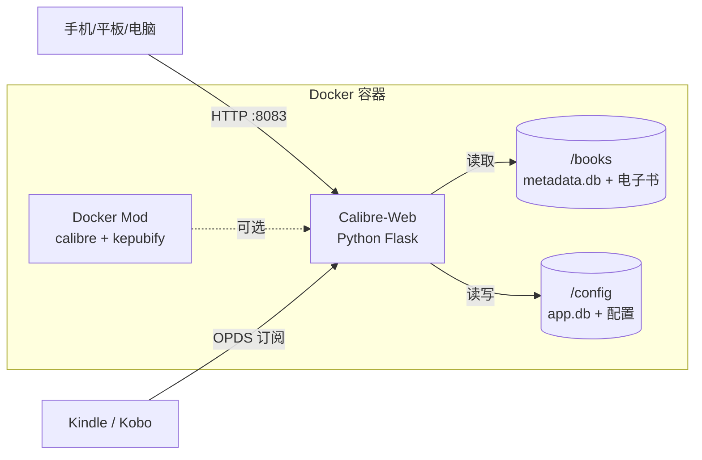
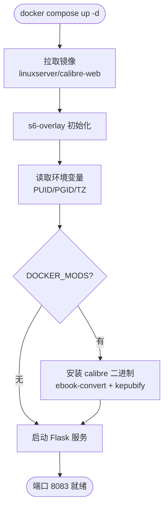

# 使用 Docker 部署 Calibre-Web：把电子书库变成在线阅读平台

家里 NAS 里塞了几百本电子书，想用手机在沙发上看、用平板在地铁上翻，总不能每次都开电脑传文件。Calibre-Web 干的就是这件事——把你的 Calibre 书库变成一个网页端，支持在线阅读、一键推送到 Kindle、OPDS 订阅给第三方阅读器。

Calibre 客户端本身太重了（Java 桌面应用），Calibre-Web 是它的轻量前端，只需要一个 Docker 容器就能跑起来。

## 项目速览

| 项目 | 内容 |
|---|---|
| 项目名称 | Calibre-Web |
| 官方地址 | [calibre-web](https://github.com/janeczku/calibre-web) |
| GitHub | [janeczku/calibre-web](https://github.com/janeczku/calibre-web) |
| Docker 镜像 | `lscr.io/linuxserver/calibre-web:latest` |
| 开源协议 | GPL v3 |
| 默认端口 | 8083 |
| 数据目录 | `/config`（应用配置）、`/books`（书库） |
| 推荐部署方式 | Docker Compose |

## 为什么选 Calibre-Web

和同类方案比一比：

- **vs Kavita**：Kavita 是独立书库系统，支持漫画和 PDF 很出色，但 Calibre-Web 直接复用 Calibre 的 metadata.db，如果你已经用 Calibre 整理过书库，迁移成本为零。
- **vs Calibre Content Server**：Calibre 自带的 Content Server 功能比较原始——界面老旧、没有用户管理、不支持 OPDS。Calibre-Web 在这几点上做得更完整。
- **不适合的场景**：如果你完全没用过 Calibre、书库格式混杂（大量 PDF 漫画），Kavita 或 Komga 可能更合适。

Calibre-Web 的核心优势是**与 Calibre 生态的深度绑定**——元数据编辑、格式转换、Kobo 同步都依赖 Calibre 的命令行工具，通过 Docker Mod 一行环境变量就能加载。

## 架构分析

单容器架构，Python 3 + Flask 后端，SQLite 存储应用配置。书库数据来自你已有的 Calibre 库（metadata.db），不额外拷贝。

### 部署架构图



### 容器启动流程



## 部署前准备

### 服务器要求

| 项目 | 最低要求 | 推荐配置 |
|---|---|---|
| 系统 | Linux / macOS / WSL2 | Ubuntu 22.04+ / NAS DSM |
| CPU | 1 核 | 2 核（开启格式转换时） |
| 内存 | 512 MB | 1 GB（开启 Calibre Mod 需 2 GB） |
| 磁盘 | 200 MB + 书库大小 | 按书库实际容量预留 |
| 端口 | 8083 | - |

### 准备 Calibre 书库

Calibre-Web 不能凭空运行——它需要一个已存在的 Calibre 数据库。如果你还没有书库，可以先用桌面版 Calibre 导入几本书，或者直接下载官方提供的示例库：

```bash
# 创建书库目录
mkdir -p /opt/calibre-web/books

# 下载示例 metadata.db（体验用，正式使用请替换为自己的书库）
curl -L -o /opt/calibre-web/books/metadata.db \
  https://github.com/janeczku/calibre-web/raw/master/library/metadata.db
```

如果你已经有 Calibre 书库，直接把书库目录映射到容器的 `/books` 路径就行，后面会写具体怎么映射。

### 安装 Docker

```bash
# 检查是否已安装
docker --version
docker compose version
```

没装的话参考 [Docker 官方安装文档](https://docs.docker.com/engine/install/)，NAS 用户（群晖、威联通、绿联、极空间）一般在系统自带的应用市场或 Docker 管理界面安装。

### 国内镜像加速

直接拉取 `lscr.io/linuxserver/calibre-web` 可能超时，用国内源替换前缀：

```bash
# 替换镜像前缀直接拉取（任选一个）
docker pull docker.1ms.run/linuxserver/calibre-web:latest
docker pull docker.m.daocloud.io/linuxserver/calibre-web:latest
docker pull docker.1panel.live/linuxserver/calibre-web:latest
docker pull hub.rat.dev/linuxserver/calibre-web:latest
```

> 💡 公共镜像源偶尔维护变动，失败了换一个试。拉取成功后，Docker Compose 文件里的 image 也要改成对应的加速地址。

或者配置 Docker Daemon 全局加速（适合经常拉镜像的场景）：

```bash
sudo mkdir -p /etc/docker
sudo tee /etc/docker/daemon.json <<'EOF'
{
  "registry-mirrors": [
    "https://docker.1ms.run",
    "https://docker.m.daocloud.io",
    "https://docker.1panel.live",
    "https://docker-0.unsee.tech",
    "https://hub.rat.dev",
    "https://docker.xuanyuan.me"
  ]
}
EOF
sudo systemctl daemon-reload
sudo systemctl restart docker
```

## Docker 快速部署

适合临时体验或不想写配置文件的场景：

```bash
# 创建数据目录
mkdir -p /opt/calibre-web/config
mkdir -p /opt/calibre-web/books

# 拉取镜像
docker pull lscr.io/linuxserver/calibre-web:latest

# 启动容器
docker run -d \
  --name calibre-web \
  --restart unless-stopped \
  -p 8083:8083 \
  -e PUID=1000 \
  -e PGID=1000 \
  -e TZ=Asia/Shanghai \
  -v /opt/calibre-web/config:/config \
  -v /opt/calibre-web/books:/books \
  lscr.io/linuxserver/calibre-web:latest
```

参数说明：

- `-e PUID=1000 -e PGID=1000`：让容器以你的用户身份运行，避免挂载目录的权限冲突。用 `id` 命令查看自己的 UID/GID，NAS 用户一般是 1000 或 1026。
- `-v /opt/calibre-web/books:/books`：你的 Calibre 书库目录。`metadata.db` 必须在 `/books` 下能找到，否则初始化会报错。
- `-v /opt/calibre-web/config:/config`：Calibre-Web 自己的应用配置和用户数据，别和书库混在一起。

验证：

```bash
docker ps | grep calibre-web
docker logs -f calibre-web
```

日志中出现 `Calibre-Web server started` 就说明跑起来了。浏览器访问 `http://服务器IP:8083`。

## Docker Compose 完整部署

长期使用推荐 Compose——配置集中管理、升级方便、方便加 Calibre Mod。

### 创建项目目录

```bash
mkdir -p /opt/calibre-web
cd /opt/calibre-web
```

### 编写环境变量

创建 `.env` 文件：

```env
TZ=Asia/Shanghai
PUID=1000
PGID=1000
# 需要格式转换功能的话，取消下面这行注释（仅 x86-64）
# DOCKER_MODS=linuxserver/mods:universal-calibre
```

### 编写 Compose 文件

创建 `docker-compose.yml`：

```yaml
services:
  calibre-web:
    image: lscr.io/linuxserver/calibre-web:latest
    container_name: calibre-web
    restart: unless-stopped
    ports:
      - "8083:8083"
    environment:
      - PUID=${PUID}
      - PGID=${PGID}
      - TZ=${TZ}
      # - DOCKER_MODS=${DOCKER_MODS}  # 格式转换需要时取消注释
    volumes:
      - ./config:/config
      - /path/to/your/calibre/library:/books
```

**注意**：`/books` 的宿主机路径改成你实际的 Calibre 书库位置。比如 NAS 上可能是 `/volume1/books` 或 `/mnt/data/calibre-library`。

### 启动服务

```bash
docker compose up -d
docker compose ps
docker compose logs -f
```

## 首次配置

浏览器打开 `http://服务器IP:8083`，第一次会看到初始化页面：

1. **书库路径**：填 `/books`（容器内路径，不是宿主机路径）
2. **登录**：默认管理员账号 `admin`，密码 `admin123`
3. 登录后进入管理界面，建议**第一时间修改默认密码**

### 开启格式转换（可选，x86-64）

如果你需要在线转换 EPUB/MOBI/PDF 格式，在 `.env` 里启用 Calibre Mod：

```env
DOCKER_MODS=linuxserver/mods:universal-calibre
```

重启容器后，进入管理界面 → 基本配置 → 外部二进制工具：

| 配置项 | 路径 |
|---|---|
| Calibre E-Book Converter | `/usr/bin` |
| Unrar | `/usr/bin/unrar` |
| Kepubify | `/usr/bin/kepubify`（Kobo 用户需要） |

Kepubify 是镜像内置的，不需要额外安装。它把 EPUB 转成 Kobo 原生格式，用 Kobo 阅读器的话这个是刚需。

### 开启书籍上传

管理界面 → 基本配置 → 勾选「启用上传功能」。不开这个选项的话，上传按钮不会出现在界面上。

### OPDS 订阅

Calibre-Web 自带 OPDS feed，地址是 `http://服务器IP:8083/opds`。在 KyBook、Moon+ Reader、FBReader 等阅读 App 里添加这个地址就能直接浏览和下载书库。

## 日常管理

### 常用命令

| 操作 | 命令 |
|---|---|
| 查看状态 | `docker compose ps` |
| 查看日志 | `docker compose logs -f` |
| 重启服务 | `docker compose restart` |
| 进入容器 | `docker compose exec calibre-web /bin/bash` |
| 停止服务 | `docker compose stop` |

### 重置管理员密码

忘记密码不用重装，直接在容器里重置：

```bash
docker exec -it calibre-web \
  python3 /app/calibre-web/cps.py -p /config/app.db -s admin:新密码
```

注意路径必须是 `/config/app.db`，写成 `app.db` 不会报错但重置不生效（踩过这个坑）。

### 数据备份

```bash
docker compose stop
tar -czvf calibre-web-backup-$(date +%F).tar.gz \
  ./config ./.env ./docker-compose.yml
docker compose up -d
```

书库（`/books`）本身不需要备份——它就是你原始的 Calibre 库，按你自己的备份策略处理就行。`/config` 里存的是 Calibre-Web 的用户数据和设置，丢了要重新配置。

## 更新升级

```bash
cd /opt/calibre-web

# 先备份配置
tar -czvf calibre-web-pre-update-$(date +%F).tar.gz ./config ./.env

# 拉取新镜像并重启
docker compose pull
docker compose up -d

# 检查日志确认启动正常
docker compose logs -f
```

LinuxServer 镜像不建议在容器内自更新（管理界面的 Self-Update 按钮）。正确的做法是拉取新镜像、重建容器，`/config` 挂载目录会保留所有配置。

## 卸载清理

```bash
cd /opt/calibre-web
docker compose down
# 删除配置数据（谨慎！书库不在这里）
rm -rf ./config
# 可选：清理镜像
docker image prune -a
```

书库目录不会被删除，还在原来的位置。

## 常见问题

### metadata.db 找不到

启动后页面提示找不到数据库，检查两件事：
- `/books` 目录下确实有 `metadata.db` 文件
- 初始化页面填的路径是 `/books`，不是宿主机路径

### NAS 权限报错

群晖/威联通等 NAS 用户，PUID 和 PGID 要匹配实际访问书库目录的用户：

```bash
# 查看目录所有者
ls -ld /volume1/books
# 输出中的 uid/gid 填到 .env 里
```

### 格式转换失败

Calibre Mod（`linuxserver/mods:universal-calibre`）只支持 x86-64 架构。ARM 设备（树莓派、部分 NAS）加载这个 Mod 会导致容器启动失败，去掉这行环境变量就行。

### Kobo 同步不工作

确保配置了 Kepubify 路径（`/usr/bin/kepubify`），并且 Kobo 设备连接时用的是 Calibre-Web 的 OPDS 地址而非直接 USB 传输。

## 生产环境建议

- **HTTPS**：用 Nginx 或 Caddy 反向代理，加上 Let's Encrypt 证书。Calibre-Web 本身不支持 HTTPS。
- **版本锁定**：Compose 文件里用 `image: lscr.io/linuxserver/calibre-web:0.6.24-ls350` 这类具体版本，而不是 `latest`，避免升级时意外。
- **日志管理**：加一行 `logging` 配置限制日志大小，不然长期运行会把磁盘撑满：

```yaml
    logging:
      driver: json-file
      options:
        max-size: "10m"
        max-file: "3"
```

- **定期备份**：crontab 跑备份脚本，保留最近 7 天的配置快照。

## 下一步

Calibre-Web 搭好后，下一步可以做的事：
- 配置 Nginx 反向代理 + HTTPS，支持外网访问
- 接入 LDAP 或 OAuth 登录，免去手动管理账号
- 用 Calibre 桌面端的「发送到设备」功能把新书自动同步到书库
- 部署 Watchtower 自动拉取新版本（LinuxServer 官方不推荐，但社区用得挺多）
