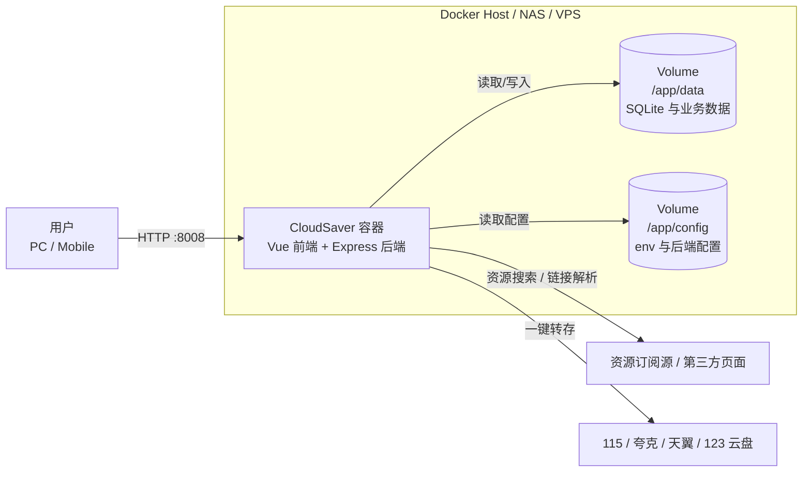
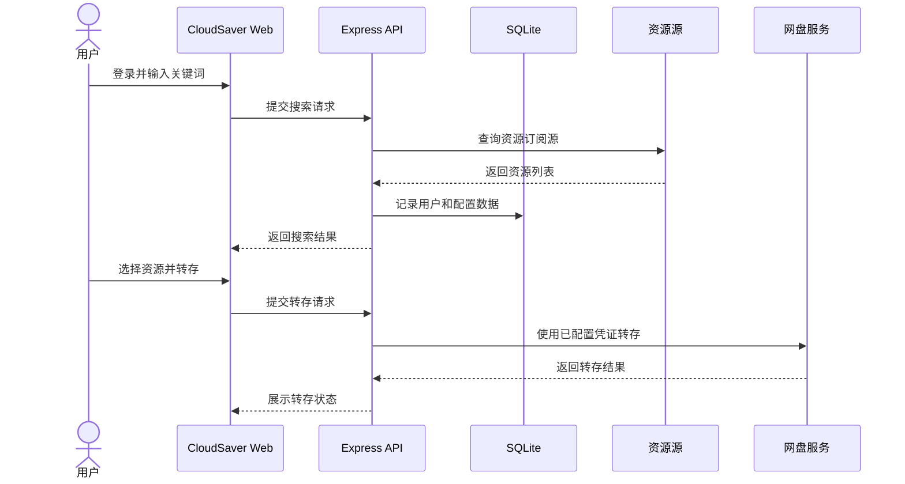

# Docker 部署 CloudSaver：网盘资源搜索与转存工具私有化部署指南

CloudSaver 是一个开源的网盘资源搜索与转存工具，支持多源资源搜索、资源链接解析、豆瓣热门榜单展示，以及 115 网盘、夸克网盘、天翼网盘、123 云盘的一键转存。项目采用前后端分离架构，前端基于 Vue 3，后端基于 Node.js + Express，数据存储使用 SQLite3。

这个项目有一个非常明确的使用前提：建议私有化部署。因为网盘转存通常需要配置 Cookie、账号凭证或其他敏感信息，使用陌生人部署好的在线服务会带来账号泄露风险。官方 README 也反复提醒不要使用非自建服务，推荐通过官方仓库代码和自主服务器部署。

本文会从项目介绍、功能特性、架构分析、Docker 快速部署、Docker Compose 完整部署、更新、卸载、使用和常见问题几个角度，整理一份可以照着操作的 CloudSaver 部署文档。

## 项目速览

| 项目 | 内容 |
|---|---|
| 项目名称 | CloudSaver |
| 官方仓库 | <https://github.com/jiangrui1994/CloudSaver> |
| Docker Hub 镜像 | `jiangrui1994/cloudsaver:latest` / `jiangrui1994/cloudsaver:test` |
| GitHub Container Registry 镜像 | `ghcr.io/jiangrui1994/cloudsaver:latest` / `ghcr.io/jiangrui1994/cloudsaver:test` |
| 默认端口 | `8008` |
| 数据目录 | `/app/data` |
| 配置目录 | `/app/config` |
| 技术栈 | Vue 3、TypeScript、Vite、Node.js、Express、SQLite3 |
| 推荐部署方式 | Docker Compose |
| 开源协议 | MIT |

## 功能特性

- 多源资源搜索：支持多个资源订阅源搜索。
- 关键词搜索与资源链接解析：可以通过关键词查找资源，也可以解析已有资源链接。
- 豆瓣热门榜单：可以查看热门影视内容，再结合资源搜索使用。
- 网盘资源转存：支持 115 网盘、夸克网盘、天翼网盘、123 云盘一键转存。
- 转存文件夹选择：转存时可以展示和选择目标文件夹。
- 多用户系统：支持用户注册登录，区分管理员和普通用户权限。
- 响应式设计：同时适配 PC 端和移动端。

## 适用场景

- 个人自用：在自己的服务器或 NAS 上部署，集中管理网盘资源搜索和转存。
- 家庭内网：给家庭成员提供统一入口，但仍由自己控制账号和数据。
- 学习 Docker 部署：项目是单容器应用，适合练习端口映射、数据卷、配置挂载和 Compose 管理。
- 轻量服务：后端使用 SQLite3，不需要额外部署 MySQL 或 PostgreSQL。

不建议把 CloudSaver 暴露成公开在线服务。它涉及 Cookie 和网盘账号信息，公开服务会显著增加账号安全风险。

## 架构分析

CloudSaver 的部署形态比较轻量。容器内部包含前端静态资源和后端服务，后端负责用户登录、资源搜索、链接解析、转存请求、配置读取和 SQLite 数据读写。宿主机通过数据卷挂载 `/app/data` 和 `/app/config`，用于保存数据库、配置文件和运行数据。

图表使用 Mermaid 语法，适合 GitHub 和多数 Markdown 预览工具直接渲染。

### 部署架构图



### 请求链路图



## 部署前准备

### 服务器要求

- 系统：Linux 服务器、NAS、软路由或支持 Docker 的主机。
- CPU：1 核起步即可，资源搜索和转存频繁时建议 2 核以上。
- 内存：512MB 起步，建议 1GB 以上。
- 磁盘：根据数据库、日志和缓存增长情况预留空间。
- 端口：默认使用 `8008`。
- 网络：资源搜索需要能访问对应资源源，官方说明中提到资源搜索需要配置代理环境。

### 安装 Docker 和 Compose

```bash
docker --version
docker compose version
```

如果使用旧版 Compose，命令可能是：

```bash
docker-compose --version
```

生产环境建议使用 Docker Compose v2，也就是 `docker compose` 命令。

## Docker 快速部署

如果只是想先跑起来体验，可以使用单容器部署。这里使用 Docker Hub 稳定版镜像：

```bash
mkdir -p /opt/cloudsaver/data /opt/cloudsaver/config
```

启动容器：

```bash
docker run -d \
  -p 8008:8008 \
  -v /opt/cloudsaver/data:/app/data \
  -v /opt/cloudsaver/config:/app/config \
  --name cloud-saver \
  --restart unless-stopped \
  jiangrui1994/cloudsaver:latest
```

查看容器状态：

```bash
docker ps
```

查看运行日志：

```bash
docker logs -f cloud-saver
```

访问地址：

```text
http://服务器IP:8008
```

如果想体验测试版，可以把镜像改成：

```text
jiangrui1994/cloudsaver:test
```

测试版包含最新功能和修复，但稳定性可能不如 `latest`。长期使用建议选择稳定版。

## Docker Compose 完整部署

Docker Compose 更适合长期部署。它能把镜像、端口、数据目录和重启策略写进一个文件，后续更新、备份和迁移都更清楚。

创建目录：

```bash
mkdir -p /opt/cloudsaver/data /opt/cloudsaver/config
cd /opt/cloudsaver
```

创建 `docker-compose.yml`：

```yaml
services:
  cloudsaver:
    image: jiangrui1994/cloudsaver:latest
    container_name: cloud-saver
    ports:
      - "8008:8008"
    volumes:
      - /opt/cloudsaver/data:/app/data
      - /opt/cloudsaver/config:/app/config
    restart: unless-stopped
```

启动服务：

```bash
docker compose up -d
```

查看服务状态：

```bash
docker compose ps
```

查看日志：

```bash
docker compose logs -f
```

访问地址：

```text
http://服务器IP:8008
```

如果你更习惯使用 GitHub Container Registry，可以把镜像改成：

```yaml
image: ghcr.io/jiangrui1994/cloudsaver:latest
```

## 配置说明

CloudSaver 的 `/app/config` 目录可以放后端环境变量配置。官方 README 提到配置文件为 `env`，示例内容如下：

```bash
# JWT配置
JWT_SECRET=your_jwt_secret_here

# Telegram配置
TELEGRAM_BASE_URL=https://t.me/s

# Telegram频道配置，0.3.0及之后版本无效
TELE_CHANNELS=[{"id":"xxxx","name":"xxxx资源分享"}]
```

建议在宿主机创建配置文件：

```bash
vim /opt/cloudsaver/config/env
```

重点配置：

- `JWT_SECRET`：用于登录态和令牌签名，建议使用强随机字符串，不要使用示例值。
- `TELEGRAM_BASE_URL`：如果资源搜索依赖 Telegram 公开频道，可以按网络情况调整。
- `TELE_CHANNELS`：官方说明中标注 0.3.0 及之后版本无效，使用前需要以当前版本说明为准。

如果资源搜索失败，优先检查代理、网络连通性和资源源配置。

## 部署后检查

检查容器是否运行：

```bash
docker ps
docker compose ps
```

检查日志是否有报错：

```bash
docker logs -f cloud-saver
docker compose logs -f
```

重点确认：

- `8008` 端口是否开放。
- `/opt/cloudsaver/data` 是否有数据写入。
- `/opt/cloudsaver/config/env` 是否正确挂载。
- `JWT_SECRET` 是否已经改成自己的随机值。
- 搜索功能是否需要代理。
- 页面在 PC 和手机浏览器中是否都能正常打开。

## 使用指南

### 首次登录与注册

CloudSaver 支持多用户系统，用户可以注册登录，并区分管理员与普通用户权限。官方 README 中给出的默认注册码是：

```text
管理员：230713
普通用户：9527
```

建议部署后尽快完成管理员账号初始化，并根据自己的使用场景调整注册入口和权限策略。不要把默认注册码暴露给不可信用户。

### 配置网盘账号

资源转存通常需要配置对应网盘的 Cookie 或账号凭证。Cookie 等同于账号登录凭证，必须只保存在自己的私有部署环境中。

使用建议：

- 不要把 CloudSaver 暴露给公网陌生用户。
- 不要使用别人部署好的 CloudSaver 在线站点。
- 不要把 Cookie 发给任何第三方。
- 如果怀疑 Cookie 泄露，立即退出网盘登录态并重新登录。

### 搜索资源

进入页面后，可以通过关键词搜索资源，也可以解析已有资源链接。搜索结果是否稳定，取决于资源源可用性、代理环境和网络连通性。

### 一键转存

找到目标资源后，选择网盘和目标文件夹执行转存。转存成功与否取决于网盘账号状态、Cookie 有效期、资源链接可用性和网盘接口限制。

### 常用命令

单容器部署：

```bash
docker ps
docker logs -f cloud-saver
docker restart cloud-saver
docker stop cloud-saver
```

Compose 部署：

```bash
cd /opt/cloudsaver
docker compose ps
docker compose logs -f
docker compose restart
docker compose down
docker compose up -d
```

## 功能展示

### 登录页面

登录页用于用户注册和登录。首次部署后，建议先创建管理员账号，再考虑是否开放普通用户注册。

### 豆瓣榜单

豆瓣榜单可以帮助用户发现热门影视内容，再结合资源搜索能力查找对应资源。

### 资源搜索

资源搜索页面是核心入口。用户输入关键词后，CloudSaver 会从配置的资源源中搜索，并展示可用资源列表。

### 资源详情

资源详情页用于查看资源信息、网盘链接和可转存内容。写部署文章配图时，建议展示资源名称、来源和可转存状态。

### 资源转存

资源转存页用于选择网盘和目标文件夹。这个页面要重点说明 Cookie 安全，因为转存动作依赖网盘账号权限。

## 数据备份

CloudSaver 使用本地挂载目录保存数据和配置。备份时重点备份 `/opt/cloudsaver/data` 和 `/opt/cloudsaver/config`。

建议先停止服务：

```bash
cd /opt/cloudsaver
docker compose down
```

备份：

```bash
tar -czvf cloudsaver-backup-$(date +%F).tar.gz ./data ./config ./docker-compose.yml
```

重新启动：

```bash
docker compose up -d
```

如果你是单容器部署，也可以直接备份：

```bash
tar -czvf cloudsaver-backup-$(date +%F).tar.gz /opt/cloudsaver/data /opt/cloudsaver/config
```

## 更新升级

更新前先备份数据和配置。

### Docker 快速部署更新

拉取新镜像：

```bash
docker pull jiangrui1994/cloudsaver:latest
```

停止并删除旧容器：

```bash
docker stop cloud-saver
docker rm cloud-saver
```

用原挂载目录重新启动：

```bash
docker run -d \
  -p 8008:8008 \
  -v /opt/cloudsaver/data:/app/data \
  -v /opt/cloudsaver/config:/app/config \
  --name cloud-saver \
  --restart unless-stopped \
  jiangrui1994/cloudsaver:latest
```

### Docker Compose 更新

```bash
cd /opt/cloudsaver
docker compose pull
docker compose down
docker compose up -d
docker compose logs -f
```

更新后检查登录、搜索、链接解析、转存和移动端页面是否正常。

## 回滚版本

如果新版本异常，可以先保留日志：

```bash
docker logs cloud-saver > cloudsaver-error.log
```

如果你使用固定标签或自留镜像版本，可以把 `docker-compose.yml` 中的镜像改回旧版本，然后重启：

```bash
docker compose pull
docker compose down
docker compose up -d
```

如果只使用 `latest`，回滚会比较困难。更稳的做法是在生产环境中记录每次更新前使用的镜像 digest 或固定版本标签。

## 卸载清理

如果使用 Docker 单容器部署：

```bash
docker stop cloud-saver
docker rm cloud-saver
```

如果使用 Docker Compose 部署：

```bash
cd /opt/cloudsaver
docker compose down
```

确认不再使用后，可以删除部署目录：

```bash
rm -rf /opt/cloudsaver
```

注意：删除 `/opt/cloudsaver` 后，数据库、配置、账号、Cookie 相关配置和运行数据都会被删除，通常无法恢复。

## 常见问题

### 页面打不开

先检查容器状态：

```bash
docker ps
docker logs -f cloud-saver
```

再检查端口占用：

```bash
lsof -i :8008
```

如果端口被占用，可以把宿主机端口改成其他端口，例如：

```yaml
ports:
  - "18008:8008"
```

然后访问：

```text
http://服务器IP:18008
```

### 搜索不到资源

官方 README 中提到资源搜索需要配置代理环境。建议检查：

- 服务器是否能访问资源源。
- 代理配置是否正确。
- 资源订阅源是否仍然可用。
- 日志中是否出现网络超时或连接失败。

### 转存失败

常见原因：

- 网盘 Cookie 失效。
- 网盘账号需要重新登录。
- 资源链接已失效。
- 目标目录权限不足。
- 网盘接口限制或风控。

建议重新登录对应网盘，更新 Cookie 后再测试。

### 是否可以使用别人部署好的在线服务

不建议。CloudSaver 可能涉及 Cookie、网盘账号和转存权限。官方 README 也明确提醒不要使用非自建服务。安全做法是只使用自己部署、自己管理的实例。

## 安全建议

- 只做私有化部署，不要随意开放公网访问。
- 如果必须公网访问，建议加反向代理、HTTPS、访问控制和强密码。
- 修改 `JWT_SECRET`，不要使用示例值。
- Cookie 只保存在自己的服务器上。
- 定期备份 `/opt/cloudsaver/data` 和 `/opt/cloudsaver/config`。
- 不要把默认注册码公开给陌生用户。
- 生产环境使用稳定版镜像 `latest`，谨慎使用 `test`。

## 总结

CloudSaver 是一个适合个人私有化部署的网盘资源搜索与转存工具。它的部署方式很轻量：一个容器、一个端口、两个挂载目录，就可以完成基本运行。对于长期使用，推荐使用 Docker Compose 管理服务，这样更新、备份、迁移和排查问题都会更清晰。

真正需要重视的是安全边界。CloudSaver 的价值在于把搜索和转存流程集中到自己的环境中，而不是把 Cookie 和账号权限交给陌生服务。部署完成后，优先检查访问控制、配置文件、数据备份和代理环境，再开始日常使用。

## 参考资料

- CloudSaver GitHub 仓库：<https://github.com/jiangrui1994/CloudSaver>
- CloudSaver README：<https://raw.githubusercontent.com/jiangrui1994/CloudSaver/main/README.md>
- Docker 官方文档：<https://docs.docker.com/>
- Docker Compose 文档：<https://docs.docker.com/compose/>
