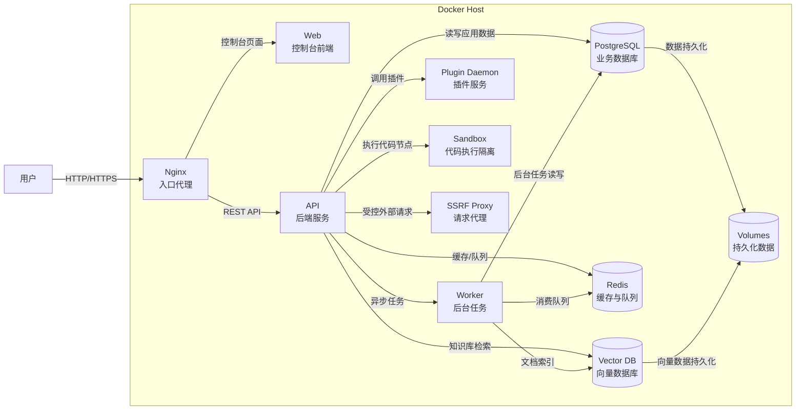
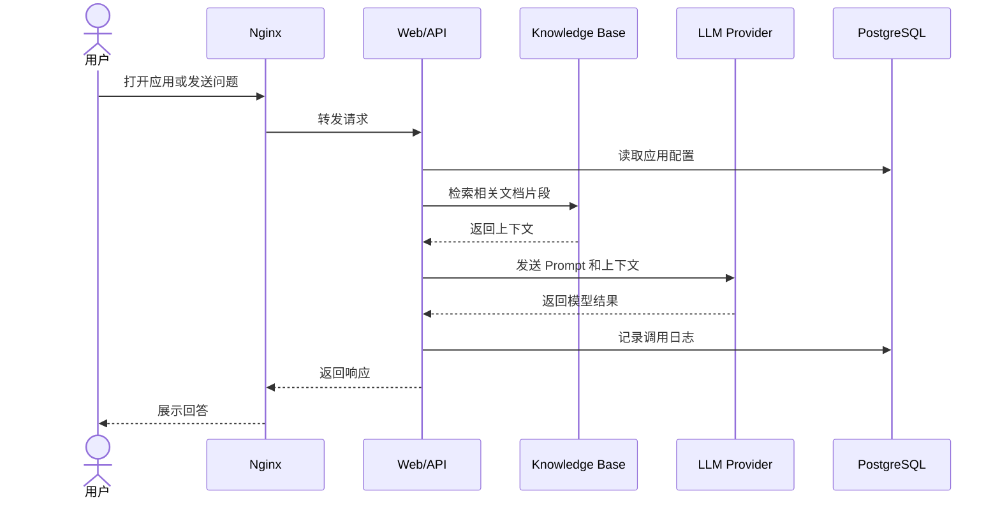

# Docker 部署 Dify：从项目介绍到本地私有化运行

Dify 是一个开源的大模型应用开发平台，适合用来搭建聊天助手、Agent、知识库问答、工作流自动化和面向业务系统的 LLM 应用。它把模型接入、Prompt 编排、RAG 知识库、工具调用、工作流、应用发布、日志观测等能力放在同一个 Web 控制台里，开发者不需要从零搭一套 LLM 应用后台。

如果你想在自己的服务器上运行一套可控的 AI 应用平台，Dify 的 Docker Compose 部署方式是最稳妥的入口。它不是一个简单的单容器项目，而是由 Web、API、Worker、数据库、缓存、向量库、插件服务、沙箱和反向代理等多个组件组成。本文会按“先跑起来，再部署完整，再学会维护”的顺序介绍。

截至 2026-06-30，Dify GitHub 最新正式版本为 `1.15.0`，发布于 2026-06-25。实际部署时请以官方仓库和 release 页面为准。

## 项目速览

| 项目 | 内容 |
|---|---|
| 项目名称 | Dify |
| 项目定位 | 开源 LLM 应用开发平台 |
| 官方仓库 | <https://github.com/langgenius/dify> |
| 官方文档 | <https://docs.dify.ai/> |
| 部署方式 | Docker Compose |
| 默认 Web 入口 | `http://服务器IP/install` |
| 默认 HTTP 端口 | `80`，可通过 `.env` 调整 |
| 主要组件 | Web、API、Worker、Plugin Daemon、PostgreSQL、Redis、Nginx、Sandbox、SSRF Proxy、Vector Database |
| 开源协议 | 以官方仓库 License 为准 |

## Dify 能做什么

Dify 的价值不只是“接一个大模型接口”。它更像一个 LLM 应用工作台，把应用开发中反复出现的环节做成了可配置能力。

- 应用编排：支持聊天助手、Agent、Chatflow、Workflow 等不同应用形态。
- 模型接入：可以配置 OpenAI、Anthropic、Azure OpenAI、本地模型服务或其他兼容接口。
- 知识库问答：内置文档导入、切分、向量检索和 RAG 编排能力。
- 工作流：可以把条件判断、模型调用、HTTP 请求、代码执行、知识库检索等节点串起来。
- 工具调用：适合把外部 API、插件或企业内部系统接入 LLM 应用。
- 发布与集成：应用可以通过 Web 页面、API、嵌入式页面等方式对外使用。
- 观测与调试：可以查看应用运行日志、模型调用、用户输入输出和异常信息。

## 适用场景

- 个人自托管：搭建自己的 AI 助手、知识库问答、文章辅助工具。
- 团队内部工具：为研发、运营、客服、产品等团队提供统一的 AI 应用入口。
- 企业原型验证：快速验证 RAG、Agent、工作流和模型效果。
- 私有化部署：在自己的服务器上控制数据、密钥、模型调用和访问权限。
- 学习 LLM 应用架构：理解一个完整 AI 应用平台如何组织 Web、API、Worker、向量库和插件系统。

## 架构分析

Dify 的 Docker 部署不是单个镜像跑完所有逻辑。官方 Compose 会编排多个容器：`web` 提供前端控制台，`api` 提供后端接口，`worker` 处理异步任务，`db` 保存业务数据，`redis` 负责缓存和队列，`nginx` 作为入口代理，`sandbox` 用于隔离执行代码，`ssrf_proxy` 用来降低服务端请求伪造风险，向量数据库用于知识库检索，`plugin_daemon` 负责插件运行和管理。

下面的图使用 Mermaid 语法，适合 GitHub 和多数 Markdown 预览工具直接渲染。如果你的发布平台只支持 PlantUML，需要把代码块语言和语法改回 PlantUML。

### 部署架构图



### 请求链路图



## 部署前准备

建议准备一台 Linux 服务器。测试环境可以用 2 核 4GB 起步，生产或多人使用建议提高 CPU、内存和磁盘规格。知识库文档较多时，向量库和数据库会持续占用磁盘。

需要提前安装：

- Docker
- Docker Compose v2
- Git

检查命令：

```bash
docker --version
docker compose version
git --version
```

如果服务器有防火墙或安全组，需要开放 HTTP/HTTPS 端口。默认情况下，Dify 通过 Nginx 暴露 Web 入口。

## Docker 快速部署

Dify 不适合用单条 `docker run` 完整部署。原因很简单：它依赖数据库、缓存、向量库、Worker、插件服务、沙箱和反向代理。用多个 `docker run` 手工串起来不但容易出错，后续升级和排查也会很痛苦。

因此，这里的“Docker 快速部署”采用官方 Docker Compose 快速启动方式。它的目标是先把 Dify 跑起来，适合本地体验、内网试用和功能验证。

下载源码：

```bash
git clone https://github.com/langgenius/dify.git
cd dify/docker
```

复制环境变量文件：

```bash
cp .env.example .env
```

启动服务：

```bash
docker compose up -d
```

查看容器状态：

```bash
docker compose ps
```

查看日志：

```bash
docker compose logs -f
```

浏览器访问：

```text
http://服务器IP/install
```

首次打开会进入初始化页面，按提示创建管理员账号。初始化完成后，就可以进入 Dify 控制台配置模型供应商、创建应用和导入知识库。

快速部署完成后，先确认三件事：

- 页面可以正常打开。
- 管理员账号可以登录。
- `docker compose ps` 中主要服务处于 running 或 healthy 状态。

## Docker Compose 完整部署

如果准备长期使用，不建议直接拿默认配置裸跑。完整部署至少要检查端口、访问域名、密钥、数据目录、模型供应商、向量库和备份策略。

进入部署目录：

```bash
cd dify/docker
```

编辑 `.env`：

```bash
vim .env
```

常见需要关注的配置包括：

| 配置项 | 说明 |
|---|---|
| `EXPOSE_NGINX_PORT` | 宿主机 HTTP 端口，默认通常为 `80` |
| `EXPOSE_NGINX_SSL_PORT` | 宿主机 HTTPS 端口，默认通常为 `443` |
| `CONSOLE_API_URL` | 控制台访问 API 的地址，配置域名时需要检查 |
| `APP_API_URL` | 应用访问 API 的地址 |
| `SERVICE_API_URL` | 服务端 API 地址 |
| `SECRET_KEY` | 应用密钥，生产环境应使用强随机值 |
| `DB_*` | PostgreSQL 数据库配置 |
| `REDIS_*` | Redis 配置 |
| `VECTOR_STORE` | 向量数据库类型 |
| `STORAGE_TYPE` | 文件存储类型，本地或对象存储 |

修改配置后启动：

```bash
docker compose up -d
```

如果服务器上已有 Nginx、Caddy、Traefik 或云厂商负载均衡，也可以只把 Dify 暴露到内网端口，再由外部反向代理统一处理 HTTPS 证书和域名转发。

### 推荐目录结构

生产环境建议把 Dify 放在固定目录，方便备份和运维：

```text
/opt/dify/
  docker/
    docker-compose.yaml
    .env
    volumes/
```

如果你是通过 Git 克隆仓库部署，也可以保留官方目录结构，但要记住真正需要重点备份的是 `.env` 和持久化数据目录。

### 初始化访问

部署完成后访问：

```text
http://服务器IP/install
```

如果配置了域名，则访问：

```text
https://你的域名/install
```

初始化时建议使用团队可管理的邮箱作为管理员账号，并把 `.env`、域名、模型供应商 Key、备份位置记录到内部运维文档中。

## 部署后检查

查看服务：

```bash
docker compose ps
```

查看全部日志：

```bash
docker compose logs -f
```

只查看 API 日志：

```bash
docker compose logs -f api
```

只查看 Worker 日志：

```bash
docker compose logs -f worker
```

重点检查：

- `api` 是否正常启动。
- `worker` 是否持续运行。
- `db` 和 `redis` 是否可用。
- `nginx` 是否正确暴露端口。
- 插件服务是否正常。
- Web 页面能否打开并完成初始化。
- 创建知识库后，文档索引是否能正常完成。

## 使用指南

### 配置模型供应商

登录控制台后，先进入模型供应商配置页面。这里需要填入你准备使用的模型服务，例如 OpenAI、Azure OpenAI、本地兼容 OpenAI API 的模型网关，或其他 Dify 支持的模型供应商。

建议先配置一个聊天模型和一个 Embedding 模型。聊天模型用于回答问题，Embedding 模型用于知识库向量化。如果只配置聊天模型，知识库功能可能无法正常索引文档。

### 创建第一个聊天应用

进入应用创建页面，选择聊天助手或 Chatflow。第一次使用可以先创建最简单的聊天助手：

- 填写应用名称。
- 选择模型。
- 写一段系统提示词。
- 在调试窗口输入问题。
- 确认回答效果后发布应用。

发布后，Dify 可以提供 Web 应用入口，也可以通过 API 集成到你自己的系统里。

### 创建知识库问答

知识库是 Dify 很常用的能力。基本流程是：

- 创建知识库。
- 上传 PDF、Markdown、TXT、网页文本或其他文档。
- 选择切分方式和 Embedding 模型。
- 等待索引完成。
- 在应用中关联知识库。
- 测试问题是否能命中正确文档片段。

写企业内部问答、产品文档助手、客服知识库时，建议从小批量文档开始测试，先观察召回质量，再逐步扩大文档范围。

### 使用 Workflow

Workflow 适合处理多步骤任务，例如：

- 接收用户输入。
- 判断问题类型。
- 检索知识库。
- 调用 HTTP API。
- 调用大模型生成结果。
- 输出结构化内容。

它比单轮聊天更适合做稳定的业务流程。比如合同审查、工单分类、内容生成、数据查询助手，都可以用 Workflow 拆成多个节点。

## 功能展示

### 控制台首页

控制台首页主要用于查看和管理应用。读者可以在这里看到已经创建的聊天助手、Workflow、Agent 或其他应用入口。

### 应用调试页面

应用调试页面是 Dify 最常用的工作区之一。左侧通常是 Prompt、模型和上下文配置，右侧可以直接输入问题测试效果。写文章配图时，建议展示一次真实问题输入和模型返回结果。

### 知识库页面

知识库页面适合展示文档上传、切分、索引和召回效果。截图时最好包含文档状态，让读者知道文档是否已经被成功处理。

### Workflow 编排页面

Workflow 页面适合展示节点式编排能力。可以放一张包含开始节点、知识库检索节点、LLM 节点、条件判断节点和结束节点的流程图，读者能更直观看出 Dify 不只是聊天框。

### 日志与观测

日志页面可以展示一次应用调用的输入、输出、模型耗时和 Token 消耗。这个页面对调试 Prompt、控制成本和排查异常很有价值。

## 数据备份

备份前建议先停止服务，避免数据库或向量库正在写入。

```bash
cd dify/docker
docker compose down
```

备份 `.env` 和持久化目录：

```bash
tar -czvf dify-backup-$(date +%F).tar.gz .env volumes
```

重新启动：

```bash
docker compose up -d
```

如果你把 PostgreSQL、Redis、向量库或文件存储换成了外部服务，需要按照对应服务的备份方式单独处理。生产环境不要只依赖服务器快照，最好定期做可恢复性验证。

## 更新升级

更新前先备份 `.env` 和 `volumes`。如果是生产环境，建议先阅读目标版本的 release notes，确认是否有数据库迁移、环境变量变更或不兼容调整。

进入部署目录：

```bash
cd dify
```

拉取最新代码：

```bash
git pull
```

进入 Docker 目录：

```bash
cd docker
```

对比 `.env.example` 和当前 `.env`，把新版本需要的环境变量补进去。不要直接覆盖自己的 `.env`。

拉取镜像并重启：

```bash
docker compose pull
docker compose down
docker compose up -d
```

查看日志：

```bash
docker compose logs -f
```

升级后重点检查：管理员登录、应用调试、知识库索引、Workflow 执行、插件服务和 API 调用。

## 回滚版本

如果新版本启动失败或核心功能异常，先保留现场日志：

```bash
docker compose logs > dify-upgrade-error.log
```

然后切回上一个可用版本：

```bash
cd dify
git checkout [上一个稳定版本Tag]
cd docker
docker compose pull
docker compose down
docker compose up -d
```

注意：如果新版本已经执行过数据库迁移，直接回滚旧版本可能不兼容。生产环境升级前一定要备份数据库和持久化目录。

## 卸载清理

如果只是停止 Dify：

```bash
cd dify/docker
docker compose down
```

如果确认不再使用，并且要删除容器、网络和本地数据，需要先备份，再删除部署目录：

```bash
cd /opt
rm -rf dify
```

如果 Compose 创建了独立 Docker volume，需要先查看再删除：

```bash
docker volume ls
docker volume rm [volume_name]
```

删除数据目录或 Docker volume 后，应用配置、账号、知识库、上传文件和运行日志通常都无法恢复。

## 常见问题

### 页面打不开

先检查容器是否运行：

```bash
docker compose ps
```

再检查 Nginx 日志：

```bash
docker compose logs -f nginx
```

常见原因是端口被占用、安全组没开放、`.env` 中端口配置不正确，或者服务还没完全启动。

### 初始化后模型不能用

检查模型供应商配置是否完整，尤其是 API Key、Base URL、模型名称和网络连通性。如果使用本地模型网关，要确认 Dify 容器能访问该地址。

### 知识库一直索引失败

优先看 `worker` 日志：

```bash
docker compose logs -f worker
```

常见原因包括 Embedding 模型未配置、文档格式不支持、向量库未正常启动、Worker 异常或模型接口超时。

### 插件无法安装或运行

检查 `plugin_daemon` 日志：

```bash
docker compose logs -f plugin_daemon
```

插件能力依赖对应服务正常运行。生产环境还要注意插件的网络访问权限和安全边界。

### 端口被占用

查看端口占用：

```bash
lsof -i :80
```

如果 80 端口已经被系统 Nginx 或其他服务占用，可以修改 `.env` 中暴露端口，或者改成由外部反向代理转发到 Dify。

## 生产环境建议

- 使用固定版本，不要长期依赖 `latest`。
- 修改默认密钥，`SECRET_KEY` 等敏感值要使用强随机字符串。
- 使用 HTTPS，避免控制台和 API 明文暴露。
- 做好访问控制，不要把管理后台暴露给不可信网络。
- 定期备份 `.env`、数据库、向量库和文件存储。
- 升级前阅读 release notes，并先在测试环境验证。
- 给服务器配置监控，关注磁盘、内存、容器重启次数和日志异常。
- 如果知识库规模较大，考虑外部 PostgreSQL、Redis、对象存储和独立向量数据库。

## 总结

Dify 很适合用来学习和落地 LLM 应用。它把模型接入、知识库、工作流、插件、发布和日志观测整合在一起，能让团队更快从“调模型接口”走到“交付可用应用”。

部署上要记住一个重点：Dify 不是单容器应用。快速体验可以直接使用官方 Docker Compose 跑起来；长期使用则要认真处理 `.env`、域名、HTTPS、密钥、数据备份和升级策略。只要这些基础工作做稳，Dify 就可以成为一套相当实用的私有化 AI 应用平台。

## 参考资料

- Dify GitHub 仓库：<https://github.com/langgenius/dify>
- Dify 官方文档：<https://docs.dify.ai/>
- Dify Docker Compose 部署文档：<https://docs.dify.ai/getting-started/install-self-hosted/docker-compose>
- Dify 环境变量文档：<https://docs.dify.ai/getting-started/install-self-hosted/environments>
- Dify Releases：<https://github.com/langgenius/dify/releases>
- Docker 官方概览：<https://docs.docker.com/get-started/docker-overview/>
- Docker Compose 文档：<https://docs.docker.com/compose/>
