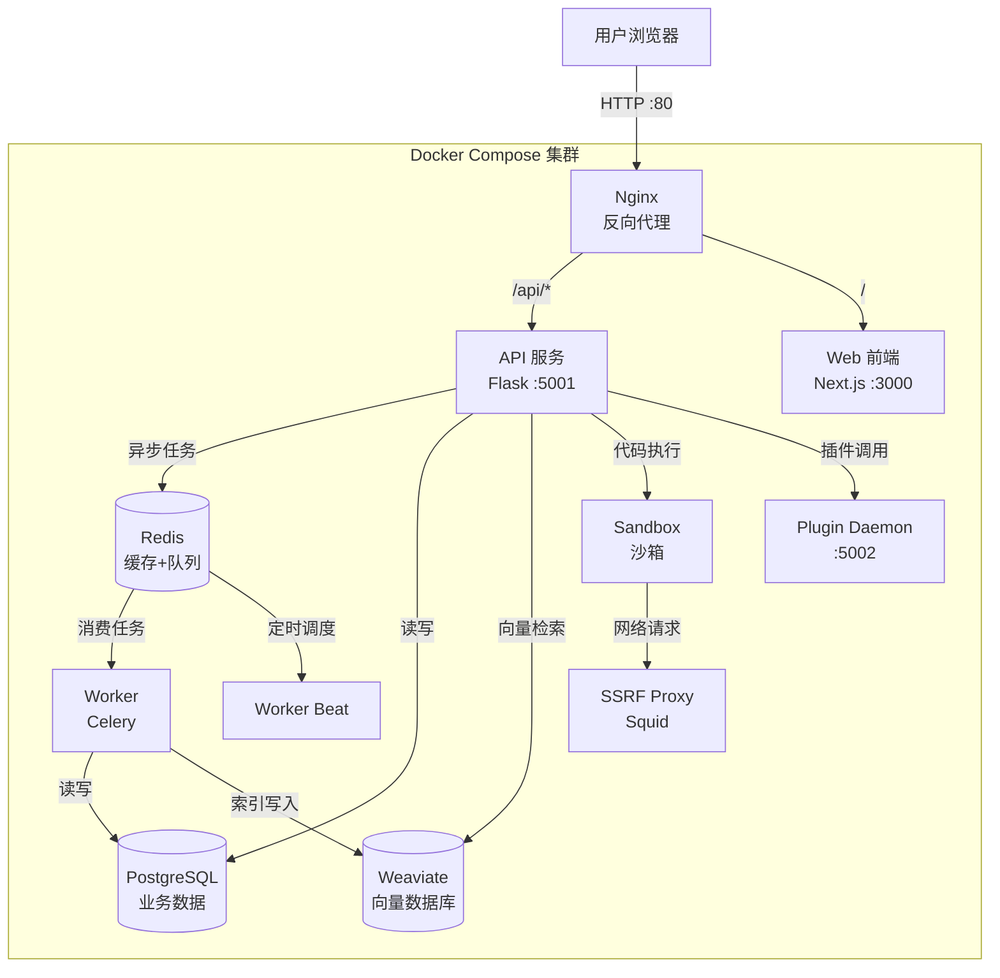
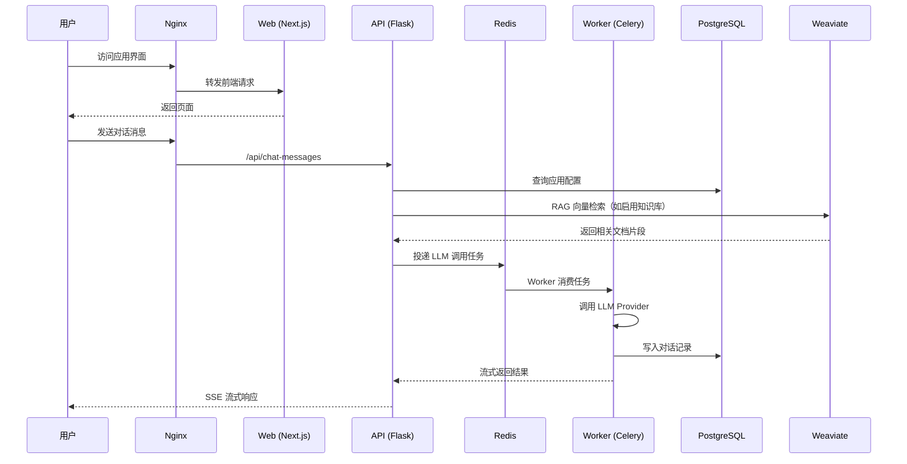
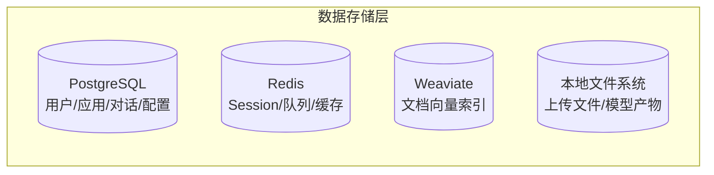

# 使用 Docker 部署 Dify：私有化 LLM 应用开发平台搭建指南

搭建一个团队内部能用的 AI 应用平台，选型时绕不开几个问题：能不能接入自己的模型？RAG 知识库好不好用？工作流编排够不够灵活？Dify 把这些需求打包成了一个平台——可视化工作流 + RAG Pipeline + Agent 能力 + 模型管理 + 应用发布，Docker Compose 一键拉起 11 个容器就能跑。以下是从环境准备到生产加固的部署全流程。

## 项目速览

| 项目 | 内容 |
|---|---|
| 项目名称 | Dify |
| 官方地址 | [dify.ai](https://dify.ai) |
| GitHub | [langgenius/dify](https://github.com/langgenius/dify) |
| Docker 镜像 | `langgenius/dify-api`、`langgenius/dify-web` 等 |
| 开源协议 | Dify Open Source License（基于 Apache 2.0） |
| 最新版本 | 1.10.1 |
| 默认端口 | 80（Nginx 统一入口） |
| 数据存储 | PostgreSQL + Redis + Weaviate + 本地文件 |
| 容器数量 | 11 个 |

## 为什么选 Dify

选型时跟几个同类产品对比过：

- FastGPT 上手更快，但工作流编排能力偏弱，复杂场景得绕路
- MaxKB 做知识库问答够用，模型供应商支持少很多（只有几十种），RAG 管线也没有 Dify 成熟
- LangFlow 更像是一个编排工具，不是完整平台——没有用户管理、API 发布、日志监控这些生产环境需要的东西
- Dify 的优势在于工作流可视化编排 + Agent 工具调用 + 数百种模型供应商，适合需要「一个平台搞定所有 AI 应用」的团队
- 不适合的场景：只需要一个简单的 ChatBot 前端接 OpenAI API，Dify 体量偏重（11 个容器起步）

## 架构分析

Dify 采用前后端分离 + 异步任务队列 + 向量存储的多层架构。11 个容器各司其职：

| 服务 | 镜像 | 职责 |
|---|---|---|
| **api** | langgenius/dify-api | 核心 API 服务（Flask + Gunicorn） |
| **worker** | langgenius/dify-api | Celery 异步任务（文档索引、LLM 调用） |
| **worker_beat** | langgenius/dify-api | Celery Beat 定时任务调度 |
| **web** | langgenius/dify-web | Next.js 前端 |
| **plugin_daemon** | langgenius/dify-plugin-daemon | 插件运行时 |
| **nginx** | nginx:latest | 反向代理 + 静态资源 |
| **db_postgres** | postgres:15-alpine | 关系型数据库 |
| **redis** | redis:6-alpine | 缓存 + 消息队列 |
| **weaviate** | semitechnologies/weaviate | 向量数据库（RAG 检索） |
| **sandbox** | langgenius/dify-sandbox | 代码执行沙箱 |
| **ssrf_proxy** | ubuntu/squid | SSRF 防护代理 |

### 部署架构图



### 请求处理流程



### 数据存储分层



## 部署前准备

### 服务器要求

| 项目 | 最低要求 | 推荐配置（10 人团队） |
|---|---|---|
| 系统 | Linux 64-bit | Ubuntu 22.04 / Debian 12 |
| CPU | 2 核 | 4 核+ |
| 内存 | 4 GiB | 8 GiB+（向量索引吃内存） |
| 磁盘 | 20 GB | 50 GB+（知识库文件 + 向量索引） |
| 端口 | 80, 443 | - |

> macOS / Windows (WSL2) 也能跑，但 Docker Desktop 需要分配 ≥ 8 GiB 内存。生产环境建议 Linux。

### 安装 Docker

```bash
docker --version        # 需要 19.03+
docker compose version  # 需要 2.24.0+（注意不是 docker-compose V1）
```

没装？

```bash
curl -fsSL https://get.docker.com | sh
systemctl enable --now docker
```

### 国内镜像加速

Dify 涉及多个镜像源（Docker Hub 官方镜像 + langgenius 私有镜像），拉取超时的解决方案：

**方案一：替换镜像前缀直接拉取**

```bash
# 以下镜像源免配置，直接替换前缀即可（如遇失败依次尝试其他地址）
docker pull docker.1ms.run/langgenius/dify-api:1.10.1
docker pull docker.m.daocloud.io/langgenius/dify-web:1.10.1
docker pull docker.1panel.live/library/nginx:latest
docker pull hub.rat.dev/library/postgres:15-alpine
docker pull docker.xuanyuan.me/library/redis:6-alpine
```

> 替换规则：`langgenius/dify-api:1.10.1` → `docker.1ms.run/langgenius/dify-api:1.10.1`；官方镜像如 `nginx:latest` → `docker.1ms.run/library/nginx:latest`

**方案二：配置 Docker daemon 加速器（全局生效）**

```bash
cat > /etc/docker/daemon.json << 'EOF'
{
  "registry-mirrors": [
    "https://docker.1ms.run",
    "https://docker.m.daocloud.io",
    "https://docker.1panel.live",
    "https://hub.rat.dev",
    "https://docker.xuanyuan.me"
  ]
}
EOF
systemctl daemon-reload && systemctl restart docker
```

如果你的服务器在阿里云/腾讯云/华为云上，可以额外去对应平台的容器镜像控制台获取专属加速地址，速度通常比公共源更快。

**方案三：离线导入**

在可访问外网的机器上批量导出：
```bash
# 导出所有 Dify 相关镜像
docker save langgenius/dify-api:1.10.1 langgenius/dify-web:1.10.1 \
  langgenius/dify-plugin-daemon:0.4.1-local langgenius/dify-sandbox:0.2.12 \
  postgres:15-alpine redis:6-alpine semitechnologies/weaviate:1.27.0 \
  nginx:latest ubuntu/squid:latest \
  -o dify-images.tar

# 传到目标机器后加载
docker load -i dify-images.tar
```

**方案四：修改 docker-compose.yaml 中的镜像前缀**

如果有可用的三方 mirror，直接替换 `langgenius/` 前缀。

## Docker Compose 完整部署

Dify 官方推荐且唯一支持的部署方式就是 Docker Compose——不需要自己拼 Compose 文件，项目仓库里已经配好了。

### 拉取代码

```bash
# 拉取最新稳定版（自动获取最新 Release tag）
git clone --branch "$(curl -s https://api.github.com/repos/langgenius/dify/releases/latest | jq -r .tag_name)" https://github.com/langgenius/dify.git
```

如果服务器无法访问 GitHub：
```bash
# 手动指定版本
git clone --branch 1.10.1 https://github.com/langgenius/dify.git

# 或者从 Gitee 镜像（社区维护）
git clone https://gitee.com/mirrors/dify.git
cd dify && git checkout 1.10.1
```

### 进入 Docker 目录

```bash
cd dify/docker
```

### 配置环境变量

```bash
cp .env.example .env
```

`.env` 文件里这几个值上线前得改一下：

| 变量 | 默认值 | 说明 |
|---|---|---|
| `SECRET_KEY` | 空（自动生成） | 加密密钥，生产环境建议手动设一个固定值（32+ 字符随机字符串） |
| `INIT_PASSWORD` | 空 | 管理员初始密码，不设则首次访问时手动注册 |
| `DB_PASSWORD` | difyai123456 | PostgreSQL 密码，**生产环境必须改** |
| `REDIS_PASSWORD` | difyai123456 | Redis 密码，**生产环境必须改** |
| `NGINX_PORT` | 80 | 对外暴露端口 |
| `VECTOR_STORE` | weaviate | 向量数据库类型，支持 weaviate/milvus/qdrant/pgvector 等 |
| `STORAGE_TYPE` | opendal | 文件存储方式，默认本地文件系统 |

生成随机密钥：
```bash
openssl rand -base64 42
```

### 启动所有服务

```bash
docker compose up -d
```

等待 30-60 秒，所有容器拉起后确认状态：
```bash
docker compose ps
```

11 个容器都起来的话，状态应该全部显示 `Up` 或 `healthy`：
```
NAME                     STATUS
docker-api-1             Up
docker-worker-1          Up
docker-worker_beat-1     Up
docker-web-1             Up
docker-plugin_daemon-1   Up
docker-nginx-1           Up
docker-db_postgres-1     Up (healthy)
docker-redis-1           Up
docker-weaviate-1        Up
docker-sandbox-1         Up
docker-ssrf_proxy-1      Up
```

### 验证访问

浏览器打开：
```
http://服务器IP/install
```

首次访问进入管理员注册页面——设置邮箱和密码后即可登录。

## 首次配置

### 1. 接入模型

登录后第一步：「设置」→「模型供应商」→ 添加你的 LLM API Key。

支持的供应商包括：
- OpenAI（GPT-4o / GPT-4 / GPT-3.5）
- Anthropic（Claude 3.5）
- 本地模型（通过 Ollama / vLLM / LocalAI 接入）
- Azure OpenAI / Google Gemini / 阿里通义 / 百度文心 / 讯飞星火 等数十种

### 2. 创建应用

「工作室」→「创建应用」，四种类型：
- **聊天助手**：对话型应用（类 ChatGPT）
- **文本生成**：Prompt 模板批量处理
- **Agent**：带工具调用的智能体
- **工作流**：可视化编排的复杂流程

### 3. 知识库（RAG）

「知识库」→「创建知识库」→ 上传文档（PDF/Word/TXT/Markdown）→ 自动切分和向量化。

创建应用时关联知识库，即可实现基于私有文档的问答。

## 日常管理

### 常用命令

| 操作 | 命令 |
|---|---|
| 查看所有容器状态 | `docker compose ps` |
| 查看实时日志 | `docker compose logs -f` |
| 只看 API 日志 | `docker compose logs -f api` |
| 重启全部服务 | `docker compose restart` |
| 只重启 API | `docker compose restart api worker` |
| 进入 API 容器 | `docker compose exec api bash` |
| 停止服务 | `docker compose stop` |

### 数据备份

Dify 的数据分散在多处，完整备份需要覆盖：

```bash
cd /path/to/dify/docker

# 1. 停止服务（避免写入不一致）
docker compose stop

# 2. 备份 PostgreSQL 数据
docker compose exec db_postgres pg_dump -U postgres dify > dify-db-$(date +%F).sql

# 3. 打包所有持久化数据
tar -czvf dify-backup-$(date +%F).tar.gz \
  ./volumes/db/data \
  ./volumes/weaviate \
  ./volumes/app/storage \
  ./.env

# 4. 重新启动
docker compose up -d
```

### 日志管理

默认日志写入容器内 `/app/logs/server.log`，通过 `docker compose logs` 查看。

生产环境建议在 `.env` 中调整：
```env
LOG_LEVEL=WARNING          # 减少日志量
LOG_FILE_MAX_SIZE=50       # 单文件最大 50MB
LOG_FILE_BACKUP_COUNT=3    # 保留 3 个备份
```

## 更新升级

Dify 更新频繁（几乎每周有版本），升级流程：

```bash
cd /path/to/dify

# 1. 备份数据（参考上方备份步骤）

# 2. 拉取最新代码
git fetch --all --tags
git checkout $(git describe --tags $(git rev-list --tags --max-count=1))

# 3. 对比环境变量变更
diff docker/.env.example docker/.env
# 新增的变量需要手动补充到 .env 中

# 4. 进入 docker 目录重新部署
cd docker
docker compose down
docker compose pull
docker compose up -d

# 5. 确认服务正常
docker compose ps
docker compose logs -f --tail 50
```

> 每次升级后都要对比 `.env.example` 和当前 `.env`，Dify 经常新增环境变量。漏了可能导致某些功能异常。

## 卸载清理

```bash
cd /path/to/dify/docker

# 停止并删除所有容器和网络
docker compose down -v   # -v 同时删除 Docker volumes

# 删除项目目录
rm -rf /path/to/dify

# 清理镜像（可选）
docker image prune -a
```

## 常见问题

### 容器启动失败：db_postgres 不健康

```bash
docker compose logs db_postgres
```
常见原因：
- 磁盘空间不足 → `df -h` 检查
- 端口 5432 被宿主机 PostgreSQL 占用 → 关掉宿主机的 pg 或改 Dify 的端口
- 数据目录权限问题 → `chmod -R 777 volumes/db/data`（临时方案）

### Worker 启动报错 "Connection refused to Redis"

Redis 还没就绪时 Worker 就尝试连接了。正常情况下 Compose 的 `depends_on` 会处理顺序，但如果持续报错：
```bash
docker compose restart worker worker_beat
```

### 访问 /install 页面白屏

- 检查 Nginx 容器是否正常：`docker compose logs nginx`
- 检查 Web 容器：`docker compose logs web`
- 如果是端口冲突，修改 `.env` 中的 `EXPOSE_NGINX_PORT`

### 文档上传后知识库索引失败

- 查看 Worker 日志：`docker compose logs -f worker`
- 确认 Weaviate 正常运行：`docker compose ps weaviate`
- 内存不足会导致 Weaviate 被 OOM Kill：`dmesg | grep -i oom`

### 拉取镜像超时

参考上方「国内镜像加速」章节，优先用离线导入方式（11 个镜像打包一次导出/导入）。

## 生产环境建议

### HTTPS 配置

修改 `.env`：
```env
NGINX_HTTPS_ENABLED=true
NGINX_SSL_CERT_FILENAME=fullchain.pem
NGINX_SSL_CERT_KEY_FILENAME=privkey.pem
```

将证书文件放到 `docker/nginx/ssl/` 目录下，重启 Nginx。

或者：在 Dify 前面加一层 Caddy/Traefik 自动管理证书。

### 资源限制

在 `docker-compose.yaml` 中为关键服务添加内存限制，避免单服务占满资源：

```yaml
services:
  api:
    deploy:
      resources:
        limits:
          memory: 2G
  weaviate:
    deploy:
      resources:
        limits:
          memory: 4G
```

### 版本锁定

`.env` 中不使用 `latest` 标签，明确写版本号。Dify 的 docker-compose.yaml 中镜像版本已经通过 `.env` 管理：
```env
# 确保 git checkout 的是固定版本 tag
```

### 定期备份

```bash
# crontab -e
0 3 * * * cd /path/to/dify/docker && docker compose exec -T db_postgres pg_dump -U postgres dify > /backup/dify-db-$(date +\%F).sql
```

### 外部数据库

生产环境如果已有托管的 PostgreSQL / Redis 实例（如阿里云 RDS / ElastiCache），可以在 `.env` 中指向外部服务，Compose 中注释掉内置的 db_postgres 和 redis 容器。

## 下一步

体验功能的话到这里就够了。要上生产，先把上面提到的默认密码改掉、HTTPS 配上、定时备份设好。如果团队有 10 人以上高频使用，建议把内存拉到 8G 以上，Weaviate 吃内存比较凶。

<!-- IMAGE_PROMPT: gpt-image2
为「使用 Docker 部署 Dify」技术教程文章设计封面图。
画面元素：左侧 Docker 鲸鱼叠加多层容器方块（暗示多服务），中心一个发光的 AI 工作流节点图形（代表 LLM 编排），右侧服务器机架 + 数据库圆柱体。底部命令行终端。整体有数据流动粒子。
视觉风格：现代极简技术插画，16:9 画幅，主色 #2496ED（Docker 蓝），辅色 #1677FF（Dify 品牌蓝），浅色渐变背景，等距 2.5D 视角，无文字。
-->
