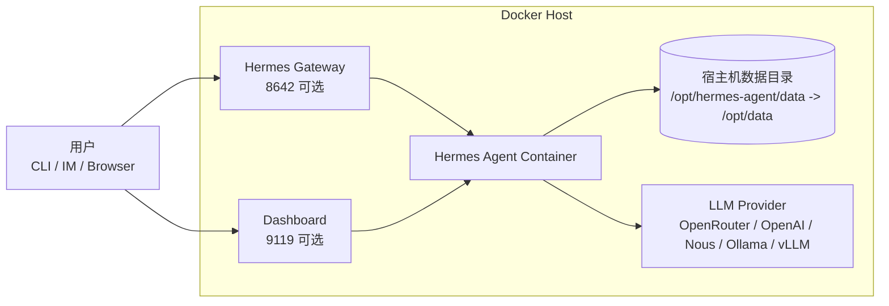
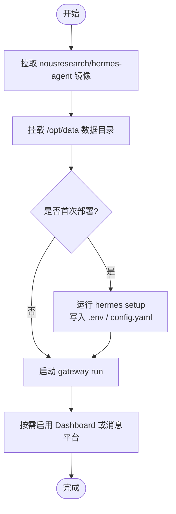

# Docker 部署 Hermes Agent：从安装到使用的完整指南

## 1. 项目介绍

Hermes Agent 是 Nous Research 开源的常驻式 AI Agent。它不只是一个命令行聊天工具，更像一个可以长期运行、连接消息平台、记住会话和技能、支持自动化任务的个人或团队智能体。

它的核心特点是“会持续成长”：Hermes 可以保存会话、记忆、技能、配置和工具状态；可以通过 CLI、Telegram、Discord、Slack、WhatsApp、Signal 等入口使用；也可以作为 gateway 长期运行在 VPS 或云服务器上。

本文以 Docker 部署为主，覆盖快速体验、Compose 长期运行、Dashboard、Gateway、数据备份、升级、卸载和常见问题。

## 2. 项目速览

| 项目 | 内容 |
|---|---|
| 项目名称 | Hermes Agent |
| 官方网站 | <https://hermes-agent.nousresearch.com> |
| GitHub | <https://github.com/NousResearch/hermes-agent> |
| Docker 镜像 | `nousresearch/hermes-agent:latest` |
| 开源协议 | MIT |
| Gateway 端口 | `8642`，可选 |
| Dashboard 端口 | `9119`，启用 `HERMES_DASHBOARD=1` 后可用 |
| 容器数据目录 | `/opt/data` |
| 推荐宿主机目录 | `/opt/hermes-agent/data` 或 `~/.hermes` |
| 推荐部署方式 | Docker Compose |

## 3. 功能特性

- 多入口使用：支持 CLI/TUI，也支持通过 Telegram、Discord、Slack、WhatsApp、Signal 等消息平台访问。
- 长期记忆与技能：会话、记忆、技能、配置都保存在数据目录中，容器本身可以无状态升级。
- Gateway 常驻运行：适合部署到 VPS，让 Agent 24 小时在线。
- Dashboard：提供 Web 管理界面，端口默认为 `9119`。
- 多模型支持：可接入 Nous Portal、OpenRouter、OpenAI 兼容接口、本地 vLLM、Ollama 等。
- 工具执行能力：镜像内置 Python、Node.js、Playwright/Chromium、ripgrep、ffmpeg、git、docker-cli、openssh-client 等常用工具。
- 多 profile：可以在同一个容器内运行多个独立 Agent profile。

## 4. 适用场景

- 个人长期 Agent：把 Hermes 放在云服务器上，通过聊天软件随时调用。
- 团队内部助手：连接 Slack、Discord 或企业 IM，用于问答、自动化、报告生成。
- 研发辅助：让 Agent 在容器中执行脚本、搜索代码、调用工具。
- 本地模型接入：配合 Ollama、vLLM 或 OpenAI 兼容服务使用。
- 低暴露部署：如果只接入消息平台，可以不开放任何入站端口。

## 5. 架构分析

Hermes 的 Docker 部署可以理解为：容器运行 Hermes 主程序、gateway 和可选 dashboard；所有可变状态都写入宿主机挂载目录；外部模型服务可以来自云 API，也可以来自同一 Docker 网络里的 vLLM/Ollama。



容器启动流程：



## 6. 部署前准备

建议服务器配置：

| 资源 | 最低 | 推荐 |
|---|---:|---:|
| CPU | 1 核 | 2 核以上 |
| 内存 | 1 GB | 2-4 GB |
| 磁盘 | 500 MB | 2 GB 以上 |
| 系统 | Linux / macOS / WSL2 | Linux VPS |

如果启用浏览器自动化工具，建议至少 2 GB 内存，并给容器增加共享内存：

```bash
--shm-size=1g
```

确认 Docker 和 Compose 已安装：

```bash
docker --version
docker compose version
```

## 7. Docker 快速部署

创建数据目录：

```bash
sudo mkdir -p /opt/hermes-agent/data
sudo chown -R "$USER":"$USER" /opt/hermes-agent/data
```

首次运行配置向导：

```bash
docker run -it --rm \
  -v /opt/hermes-agent/data:/opt/data \
  nousresearch/hermes-agent:latest setup
```

这个步骤会把 API Key、模型配置、gateway 配置等写入 `/opt/data`，对应宿主机目录 `/opt/hermes-agent/data`。

配置完成后，以 gateway 模式后台运行：

```bash
docker run -d \
  --name hermes \
  --restart unless-stopped \
  --shm-size=1g \
  -v /opt/hermes-agent/data:/opt/data \
  nousresearch/hermes-agent:latest gateway run
```

如果你只通过 Telegram、Discord、Slack、飞书等消息平台使用，可以不映射端口。这是更安全的“零入站端口暴露”模式。

如果需要开放 gateway API：

```bash
docker run -d \
  --name hermes \
  --restart unless-stopped \
  --shm-size=1g \
  -v /opt/hermes-agent/data:/opt/data \
  -p 8642:8642 \
  -e API_SERVER_ENABLED=true \
  -e API_SERVER_HOST=0.0.0.0 \
  -e API_SERVER_KEY="$(openssl rand -hex 32)" \
  nousresearch/hermes-agent:latest gateway run
```

查看状态：

```bash
docker ps
docker logs -f hermes
```

## 8. Docker Compose 完整部署

创建项目目录：

```bash
sudo mkdir -p /opt/hermes-agent/data
sudo chown -R "$USER":"$USER" /opt/hermes-agent/data
cd /opt/hermes-agent
```

创建 `.env`：

```env
HERMES_VERSION=latest
HERMES_DATA=/opt/hermes-agent/data
HERMES_UID=1000
HERMES_GID=1000

API_SERVER_KEY=change-this-to-a-random-string

HERMES_DASHBOARD_BASIC_AUTH_USERNAME=admin
HERMES_DASHBOARD_BASIC_AUTH_PASSWORD=change-this-password
HERMES_DASHBOARD_BASIC_AUTH_SECRET=change-this-to-a-random-secret
```

创建 `docker-compose.yml`：

```yaml
services:
  hermes:
    image: nousresearch/hermes-agent:${HERMES_VERSION}
    container_name: hermes
    restart: unless-stopped
    command: gateway run
    shm_size: "1gb"
    ports:
      - "127.0.0.1:8642:8642"
      - "127.0.0.1:9119:9119"
    volumes:
      - ${HERMES_DATA}:/opt/data
    environment:
      - HERMES_UID=${HERMES_UID}
      - HERMES_GID=${HERMES_GID}
      - API_SERVER_ENABLED=true
      - API_SERVER_HOST=0.0.0.0
      - API_SERVER_KEY=${API_SERVER_KEY}
      - HERMES_DASHBOARD=1
      - HERMES_DASHBOARD_BASIC_AUTH_USERNAME=${HERMES_DASHBOARD_BASIC_AUTH_USERNAME}
      - HERMES_DASHBOARD_BASIC_AUTH_PASSWORD=${HERMES_DASHBOARD_BASIC_AUTH_PASSWORD}
      - HERMES_DASHBOARD_BASIC_AUTH_SECRET=${HERMES_DASHBOARD_BASIC_AUTH_SECRET}
```

启动：

```bash
docker compose up -d
docker compose logs -f
```

这里把 `8642` 和 `9119` 都绑定到 `127.0.0.1`，默认只允许服务器本机访问。远程访问 Dashboard 时建议使用 SSH 隧道：

```bash
ssh -L 9119:127.0.0.1:9119 user@server-ip
```

然后在本地浏览器打开：

```text
http://127.0.0.1:9119
```

## 9. 首次使用

进入交互式 CLI：

```bash
docker run -it --rm \
  -v /opt/hermes-agent/data:/opt/data \
  nousresearch/hermes-agent:latest
```

常用命令：

```bash
hermes              # 开始对话
hermes setup        # 重新运行配置向导
hermes model        # 选择模型和 Provider
hermes tools        # 配置工具
hermes gateway      # 管理消息网关
hermes doctor       # 诊断问题
```

如果容器已经在后台运行，也可以执行：

```bash
docker exec -it hermes hermes status
docker exec -it hermes hermes model
docker exec -it hermes hermes gateway status
```

## 10. 连接本地模型服务

如果 vLLM 或 Ollama 和 Hermes 在同一个 Compose 网络中，配置里要用容器名，不要写 `localhost`。

示例：Ollama 容器名为 `ollama` 时，`config.yaml` 可写：

```yaml
model:
  provider: custom
  model: llama3
  base_url: http://ollama:11434/v1
  api_key: "none"
```

如果模型服务在宿主机上：

- macOS / Windows Docker Desktop：用 `host.docker.internal`
- Linux：可以考虑 `--network host`，此时 `-p` 端口映射会被忽略

连通性检查：

```bash
docker exec hermes curl -s http://ollama:11434/v1/models
```

## 11. 数据备份

Hermes 的关键数据都在 `/opt/data`，宿主机对应 `/opt/hermes-agent/data`。里面通常包含：

- `.env`：API Key 和密钥
- `config.yaml`：模型、工具、gateway 配置
- `SOUL.md`：Agent 个性设定
- `sessions/`：会话历史
- `memories/`：长期记忆
- `skills/`：技能
- `cron/`：定时任务
- `logs/`：运行日志

备份：

```bash
cd /opt
tar -czvf hermes-agent-backup-$(date +%F).tar.gz hermes-agent
```

备份前建议先停止服务：

```bash
cd /opt/hermes-agent
docker compose down
```

## 12. 更新升级

Docker run 部署：

```bash
docker pull nousresearch/hermes-agent:latest
docker rm -f hermes

docker run -d \
  --name hermes \
  --restart unless-stopped \
  --shm-size=1g \
  -v /opt/hermes-agent/data:/opt/data \
  nousresearch/hermes-agent:latest gateway run
```

Compose 部署：

```bash
cd /opt/hermes-agent
docker compose pull
docker compose up -d
docker compose logs -f
```

官方 Docker 设计里，镜像是无状态的；配置、会话、技能和记忆都在数据目录里，所以正常升级不会丢数据。

## 13. 回滚版本

如果你使用固定版本标签：

```env
HERMES_VERSION=previous-tag
```

然后执行：

```bash
docker compose pull
docker compose up -d
```

如果一直使用 `latest`，建议升级前先备份 `/opt/hermes-agent`，必要时恢复数据目录并指定旧镜像标签。

## 14. 卸载清理

停止并删除容器：

```bash
docker rm -f hermes
```

Compose 部署：

```bash
cd /opt/hermes-agent
docker compose down
```

删除数据目录：

```bash
sudo rm -rf /opt/hermes-agent
```

注意：删除数据目录后，配置、密钥、会话、记忆和技能都会丢失。

## 15. 常见问题

### 容器启动后立刻退出

查看日志：

```bash
docker logs hermes
```

常见原因是没有先运行 `setup`，或者 `.env` / `config.yaml` 配置不完整。

### Permission denied

如果宿主机目录 UID/GID 和容器内用户不一致，可以在 Compose 里设置：

```env
HERMES_UID=$(id -u)
HERMES_GID=$(id -g)
```

或者修复目录权限：

```bash
sudo chown -R "$USER":"$USER" /opt/hermes-agent/data
```

### Dashboard 不能公网裸奔

官方文档已经移除了无鉴权公网 Dashboard 的逃生通道。生产环境建议：

- 绑定 `127.0.0.1`
- 用 SSH 隧道、VPN、Tailscale 或反向代理访问
- 如果必须开放，至少配置 Basic Auth、OAuth 或 OIDC

### 浏览器工具不可用

给容器增加共享内存：

```bash
--shm-size=1g
```

Compose 中写：

```yaml
shm_size: "1gb"
```

### Hermes Agent 能直接打开浏览器操作网页吗

可以。Docker 镜像里已经预装了 Playwright 相关依赖，并在构建阶段安装了 Chromium headless shell。部署完成后，Hermes Agent 可以通过 Playwright 在容器内打开网页、点击按钮、填写表单、抓取页面内容、生成截图，适合做网页自动化、资料检索、后台配置、页面测试等任务。

需要注意的是，这里的“打开浏览器”通常指后台无界面浏览器，也就是 headless Chromium。它不会像桌面 Chrome 一样在服务器屏幕上弹出一个窗口。如果需要观察过程，可以让 Agent 保存截图、导出页面内容、输出操作日志，或者改造为带 VNC/远程桌面的自定义镜像。

部署后推荐按下面流程使用：

1. 确认容器正在运行。

```bash
docker ps
docker logs -f hermes
```

2. 确认 Compose 中已经配置共享内存。

```yaml
services:
  hermes:
    image: nousresearch/hermes-agent:${HERMES_VERSION}
    shm_size: "1gb"
```

3. 进入 Hermes 交互式 CLI。

```bash
docker exec -it hermes hermes
```

4. 在对话中直接描述网页任务。

```text
请打开 https://example.com，读取首页标题和主要内容，并保存一张截图。
```

也可以给出更具体的操作流程：

```text
请用浏览器打开这个后台页面，登录后进入设置页，检查 Webhook 地址是否配置正确。每一步完成后告诉我当前页面标题，并在关键页面截图。
```

5. 如果通过 Dashboard 使用，先建立 SSH 隧道。

```bash
ssh -L 9119:127.0.0.1:9119 user@server-ip
```

然后打开：

```text
http://127.0.0.1:9119
```

在 Dashboard 里输入同样的自然语言任务即可。

6. 如果需要检查 Playwright/Chromium 是否存在，可以进入容器查看浏览器目录。

```bash
docker exec -it hermes sh
ls -lah /opt/hermes/.playwright
```

如果网页任务经常失败，优先检查三件事：容器是否能访问目标网站、是否配置了 `shm_size: "1gb"`、目标网站是否需要验证码或多因素登录。遇到验证码、短信验证、企业 SSO 这类强人工校验场景，Agent 通常需要人工配合完成登录。

## 16. 总结

Docker 部署 Hermes Agent 的关键是把 `/opt/data` 挂好。只要数据目录保留，容器就可以删除、重建、升级和迁移。

临时体验可以用 `docker run`；长期在线建议用 Docker Compose。只通过消息平台使用时，可以不开放任何端口；需要 Dashboard 或 Gateway API 时，优先绑定本机地址并加鉴权。

## 参考资料

- [Hermes Agent GitHub](https://github.com/NousResearch/hermes-agent)
- [Hermes Agent Docker 官方文档](https://hermes-agent.nousresearch.com/docs/zh-Hans/user-guide/docker)
- [Hermes 部署路径说明](https://hermes-agent.us/zh/deploy)
- [openEuler/CSDN：服务器 Docker 部署 Hermes Agent 到飞书](https://openeuler.csdn.net/69eb39930a2f6a37c5a5d850.html)

注：知乎参考链接在本次环境中未能成功读取正文，因此未把它作为事实来源。
