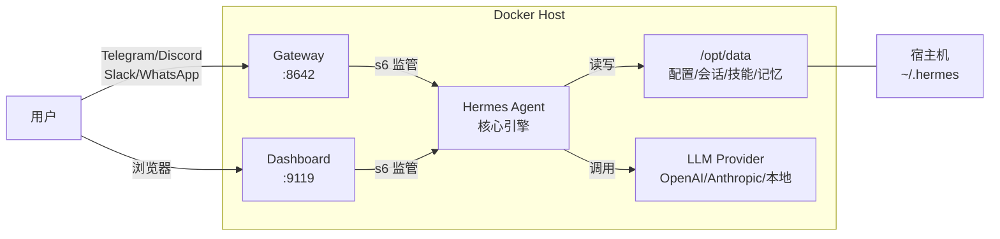
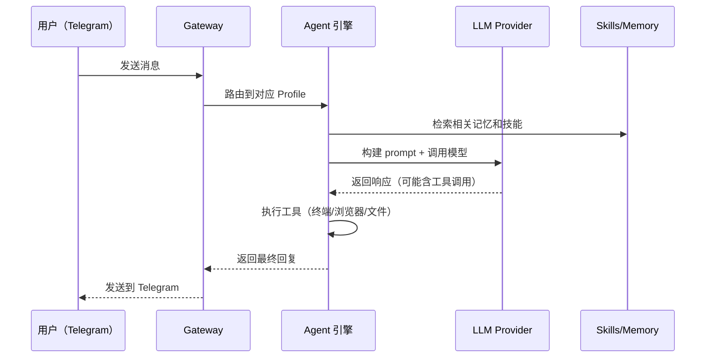

# 用 Docker 部署 Hermes Agent：在 5 美元的 VPS 上跑一个会自我进化的 AI 助手

你大概见过这样的场景：想跑一个 AI Agent，发现它需要 Python 3.11、Node.js 22、Playwright、ripgrep、ffmpeg……光是装依赖就够喝一壶。装完跑起来了，换个环境又得重来一遍。

Hermes Agent 的 Docker 镜像把这些全打包好了——Python 运行时、浏览器自动化、消息网关、Dashboard，一个容器搞定。而且它有个其他 Agent 没有的特性：会从使用经验中自动创建技能（Skills），越用越顺手。

这篇覆盖从首次安装到长期运行的完整流程，包括 Dashboard 配置、多 Profile 管理、对接本地大模型。

## 项目速览

| 项目 | 内容 |
|---|---|
| 项目名称 | Hermes Agent |
| 官方地址 | [hermes-agent.nousresearch.com](https://hermes-agent.nousresearch.com) |
| GitHub | [NousResearch/hermes-agent](https://github.com/NousResearch/hermes-agent) |
| Docker 镜像 | `nousresearch/hermes-agent:latest` |
| 开源协议 | MIT |
| 默认端口 | 8642（Gateway API）、9119（Dashboard） |
| 数据目录 | 容器内 `/opt/data`，挂载到宿主机 `~/.hermes` |
| 最新版本 | v2026.7.1（209k Stars） |
| 镜像大小 | ~901.7 MB（amd64） |

## Hermes Agent 和同类 Agent 的区别

和 AutoGPT、Open Interpreter 这类工具比，Hermes 的差异点不在"能做什么"，而在"怎么持续运行"：

- **学习闭环**：完成复杂任务后自动创建 Skill，下次遇到类似场景直接调用。AutoGPT 没有这个机制，每次都是从头开始。
- **多平台消息网关**：一个进程同时对接 Telegram、Discord、Slack、WhatsApp、Signal。不是在每个平台装一个 bot，而是同一个 Agent 在所有平台上都有上下文。
- **不绑定你的笔记本**：跑在 VPS 上，通过 Telegram 和它对话。AutoGPT 基本只能在本地跑。

短板也有：镜像体积 900 MB 起步（装了 Playwright + Chromium），如果不需要浏览器自动化功能，这个体积有点浪费。另外它没有内置 Web UI（Dashboard 是后来加的，功能还在完善中），日常交互主要靠 CLI 和消息平台。

## 架构分析

Hermes Agent 是单容器部署，内部由 s6-overlay v3 作为 PID 1 管理所有进程。

### 部署架构图



### 请求处理流程



## 部署前准备

### 服务器要求

| 项目 | 最低要求 | 推荐配置 |
|---|---|---|
| 系统 | Linux / macOS / WSL2 | Ubuntu 22.04+ |
| CPU | 1 核 | 2 核 |
| 内存 | 1 GB（不用浏览器工具） | 2-4 GB（用浏览器工具） |
| 磁盘 | 500 MB | 2 GB+（会话和技能会增长） |
| 端口 | 8642, 9119 | - |

### 安装 Docker

```bash
# 检查是否已安装
docker --version
docker compose version
```

没有的话，一行命令装好：

```bash
curl -fsSL https://get.docker.com | sh
```

### 国内镜像加速

拉取 `nousresearch/hermes-agent` 如果超时，换前缀就行：

```bash
# 方式一：替换前缀直接拉取（不用改任何配置）
docker pull docker.1ms.run/nousresearch/hermes-agent:latest
docker pull docker.m.daocloud.io/nousresearch/hermes-agent:latest
docker pull docker.1panel.live/nousresearch/hermes-agent:latest
```

> 💡 以上镜像源可能因维护变动暂时不可用，失败了换下一个试。

如果经常拉镜像，建议全局配置加速器：

```bash
sudo mkdir -p /etc/docker
sudo tee /etc/docker/daemon.json <<'EOF'
{
  "registry-mirrors": [
    "https://docker.1ms.run",
    "https://docker.m.daocloud.io",
    "https://docker.1panel.live",
    "https://docker-0.unsee.tech",
    "https://hub.rat.dev",
    "https://docker.xuanyuan.me"
  ]
}
EOF
sudo systemctl daemon-reload
sudo systemctl restart docker
```

## 首次安装：交互式 Setup

第一次跑 Hermes 需要先配置 API Key 和基本设置。用交互模式启动 setup 向导：

```bash
# 创建数据目录
mkdir -p ~/.hermes

# 启动 setup 向导（交互式）
docker run -it --rm \
  -v ~/.hermes:/opt/data \
  nousresearch/hermes-agent setup
```

向导会依次问你：
1. **LLM Provider**：选 OpenAI、Anthropic、OpenRouter 还是 Nous Portal（一个订阅覆盖 300+ 模型）
2. **API Key**：填入对应的密钥
3. **消息平台**（可选但推荐）：配置 Telegram Bot Token 或 Discord Bot Token，这样就能通过聊天工具和 Agent 对话

配置完成后，所有设置保存在 `~/.hermes/` 目录下。这个目录就是 Hermes 的"大脑"——会话、记忆、技能、配置文件全在里面。

> 有个坑：别用 VPS 厂商提供的浏览器控制台执行上面的命令。有些控制台会吞掉特殊字符（`:`、`@`、`=`），导致参数传错。用 SSH 连进去再执行。

## Docker 快速部署

Setup 完成后，就可以用后台模式跑 Gateway 了。

### 纯 Gateway 模式（通过消息平台交互）

```bash
docker run -d \
  --name hermes \
  --restart unless-stopped \
  -v ~/.hermes:/opt/data \
  -p 8642:8642 \
  nousresearch/hermes-agent gateway run
```

参数说明：
- `-d`：后台运行
- `--restart unless-stopped`：崩了自动重启，手动 `docker stop` 不会重启
- `-v ~/.hermes:/opt/data`：数据持久化，容器删了数据还在
- `-p 8642:8642`：Gateway 的 OpenAI 兼容 API 端口（如果只用 Telegram/Discord 不暴露也行）

容器内部由 s6-overlay 监管 Gateway 进程——如果 Gateway 崩了，s6 会在几秒内自动拉起来，不需要重建容器。

### Gateway + Dashboard 模式（推荐）

Dashboard 提供了一个 Web 界面来查看会话、管理配置：

```bash
docker run -d \
  --name hermes \
  --restart unless-stopped \
  -v ~/.hermes:/opt/data \
  -p 8642:8642 \
  -p 9119:9119 \
  -e HERMES_DASHBOARD=1 \
  -e HERMES_DASHBOARD_BASIC_AUTH_USERNAME=admin \
  -e HERMES_DASHBOARD_BASIC_AUTH_PASSWORD=你的密码 \
  nousresearch/hermes-agent gateway run
```

Dashboard 必须配置认证——2026 年 6 月的安全更新移除了无认证模式（之前暴露的 Dashboard 被扫描器利用来植入后门）。上面的用户名密码是最简单的认证方式，适合内网和 VPN 环境。

浏览器访问 `http://服务器IP:9119`，输入用户名密码即可进入。

### 开启 OpenAI 兼容 API

如果想让 Open WebUI、LobeChat 等第三方客户端对接 Hermes 的 Gateway：

```bash
docker run -d \
  --name hermes \
  --restart unless-stopped \
  -v ~/.hermes:/opt/data \
  -p 8642:8642 \
  -e API_SERVER_ENABLED=true \
  -e API_SERVER_HOST=0.0.0.0 \
  -e API_SERVER_KEY="$(openssl rand -hex 32)" \
  -e API_SERVER_CORS_ORIGINS='*' \
  nousresearch/hermes-agent gateway run
```

`API_SERVER_KEY` 最少 8 个字符，`openssl rand -hex 32` 生成一个 64 字符的随机密钥。第三方客户端连接时用这个 Key 作为 API Key。

## Docker Compose 完整部署

日常使用推荐 Compose——配置集中管理，更新方便，资源限制也能写在文件里。

### 创建项目目录

```bash
mkdir -p /opt/hermes-agent
cd /opt/hermes-agent
```

### 编写 Compose 文件

创建 `docker-compose.yml`：

```yaml
services:
  hermes:
    image: nousresearch/hermes-agent:latest
    container_name: hermes
    restart: unless-stopped
    command: gateway run
    ports:
      - "8642:8642"
      - "9119:9119"
    volumes:
      - ~/.hermes:/opt/data
    environment:
      - HERMES_DASHBOARD=1
      - HERMES_DASHBOARD_BASIC_AUTH_USERNAME=admin
      - HERMES_DASHBOARD_BASIC_AUTH_PASSWORD=改成你自己的密码
      # 如果用环境变量传 API Key（而不是写在 .env 文件里）：
      # - ANTHROPIC_API_KEY=${ANTHROPIC_API_KEY}
      # - OPENAI_API_KEY=${OPENAI_API_KEY}
      # - TELEGRAM_BOT_TOKEN=${TELEGRAM_BOT_TOKEN}
    deploy:
      resources:
        limits:
          memory: 4G
          cpus: "2.0"
```

如果要用浏览器自动化工具（Playwright），加上 `shm_size`：

```yaml
    shm_size: '1g'
```

不加的话 Chromium 会因为没有足够的共享内存而崩溃。不用浏览器功能就不用加。

### 启动服务

```bash
docker compose up -d
docker compose ps
docker compose logs -f
```

看到 Gateway 启动日志后，打开 Dashboard 验证：`http://服务器IP:9119`。

## 日常使用

### CLI 交互模式

不用消息平台的话，也可以直接在终端里和 Hermes 对话：

```bash
docker run -it --rm \
  -v ~/.hermes:/opt/data \
  nousresearch/hermes-agent
```

或者在已经运行的容器里：

```bash
docker exec -it hermes /opt/hermes/.venv/bin/hermes
```

### 常用管理命令

| 操作 | 命令 |
|---|---|
| 查看状态 | `docker compose ps` |
| 查看日志 | `docker compose logs -f` |
| 重启服务 | `docker compose restart` |
| 进入容器 | `docker exec -it hermes bash` |
| 查看资源占用 | `docker stats hermes` |
| 查看最近日志 | `docker logs --tail 50 hermes` |

### 多 Profile 管理

Hermes 支持在同一个容器里跑多个独立的 Agent（不同的人格、技能、记忆、会话）：

```bash
# 创建新 Profile
docker exec hermes hermes profile create coder

# 启动/停止/重启某个 Profile 的 Gateway
docker exec hermes hermes -p coder gateway start
docker exec hermes hermes -p coder gateway stop

# 查看某个 Profile 的状态
docker exec hermes hermes -p coder gateway status
```

每个 Profile 有独立的 s6 监管服务，崩了自动重启，互不影响。日志也是独立的，在 `~/.hermes/logs/gateways/<profile>/` 下。

> 注意：多个 Profile 共享 8642 端口。如果要用 OpenAI 兼容 API 对接多个 Profile，给每个 Profile 配不同的 `API_SERVER_PORT`。

## 对接本地大模型

如果你在用 Ollama 或 vLLM 跑本地模型，Hermes 可以直接对接。

### Ollama（同一台机器）

在 Compose 中加上 Ollama 服务，放在同一个网络里：

```yaml
services:
  ollama:
    image: ollama/ollama:latest
    container_name: ollama
    ports:
      - "11434:11434"
    volumes:
      - ollama-data:/root/.ollama
    networks:
      - hermes-net

  hermes:
    image: nousresearch/hermes-agent:latest
    # ... 其他配置不变
    networks:
      - hermes-net

networks:
  hermes-net:
    driver: bridge

volumes:
  ollama-data:
```

然后在 `~/.hermes/config.yaml` 中配置：

```yaml
model:
  provider: custom
  model: llama3
  base_url: http://ollama:11434/v1
  api_key: "none"
```

关键是 hostname 用容器名 `ollama` 而不是 `localhost`——在 Docker 网络里 `localhost` 指向容器自己。

## 数据备份

```bash
# 先停服务
docker compose stop

# 打包备份
tar -czvf hermes-backup-$(date +%F).tar.gz \
  ~/.hermes ./docker-compose.yml

# 恢复后重启
docker compose up -d
```

`~/.hermes/` 里的内容就是 Hermes 的全部状态——配置文件、API 密钥、会话历史、技能、记忆。丢了就真没了，定期备份。

## 更新升级

```bash
cd /opt/hermes-agent

# 先备份
tar -czvf hermes-pre-update-$(date +%F).tar.gz ~/.hermes

# 拉新镜像并重建容器
docker compose pull
docker compose up -d
```

升级时容器会自动对 `~/.hermes/config.yaml` 做 schema 迁移，需要时会先写一份带时间戳的备份。如果想跳过自动迁移，设 `HERMES_SKIP_CONFIG_MIGRATION=1`。

## 卸载清理

```bash
cd /opt/hermes-agent
docker compose down

# 删除数据（不可恢复，谨慎操作）
rm -rf ~/.hermes /opt/hermes-agent

# 可选：清理镜像
docker image prune -a
```

## 常见问题

### 容器启动就退出

```bash
docker logs hermes
```

大概率是 `.env` 里缺少 API Key——先跑一次 `docker run -it --rm -v ~/.hermes:/opt/data nousresearch/hermes-agent setup` 完成配置。

### 权限被拒绝

容器内 Hermes 以 UID 10000 运行。如果宿主机的 `~/.hermes/` 属于其他用户：

```bash
# 方法一：修改目录权限
chmod -R 755 ~/.hermes

# 方法二：告诉容器用你的 UID（NAS 用户常用）
docker run -d \
  --name hermes \
  -e PUID=1000 -e PGID=10 \
  -v ~/.hermes:/opt/data \
  nousresearch/hermes-agent gateway run
```

Synology / unRAID 等 NAS 上，数据目录通常是 bind mount，容器改不了权限，只能走方法二。

### 浏览器工具不工作

Playwright 的 Chromium 需要共享内存，加 `--shm-size=1g`：

```bash
docker run -d \
  --name hermes \
  --shm-size=1g \
  --restart unless-stopped \
  -v ~/.hermes:/opt/data \
  nousresearch/hermes-agent gateway run
```

或者在 Compose 里加 `shm_size: '1g'`。

### Gateway 断线后不自动重连

`--restart unless-stopped` 能处理大部分情况。如果卡住了，直接重启容器：

```bash
docker restart hermes
```

## 生产环境建议

- **版本锁定**：Compose 里把 `latest` 换成具体版本号（如 `v2026.7.1`），避免意外升级导致不兼容
- **HTTPS**：Dashboard 不要直接暴露到公网，用 Nginx/Caddy 反向代理 + Let's Encrypt 证书
- **资源限制**：Compose 里配 `deploy.resources.limits`，防止 Agent 跑飞时拖垮整台机器
- **日志轮转**：s6 已经内置了 per-profile 的日志轮转（10 份 × 1MB），但 `docker logs` 不会轮转——配 Docker 的 `json-file` logging driver 限制大小
- **定期备份**：crontab 每天备份 `~/.hermes/`，保留最近 7 天

```bash
# 示例：每天凌晨 3 点备份
0 3 * * * cd /opt/hermes-agent && tar -czvf hermes-backup-$(date +\%F).tar.gz ~/.hermes && find . -name "hermes-backup-*.tar.gz" -mtime +7 -delete
```

## 下一步

部署跑起来之后，可以接着折腾这些：

- **配置 Skills**：`docker exec hermes hermes skills` 查看和安装技能，或者直接告诉 Agent "帮我创建一个每天总结新闻的 Skill"
- **Cron 定时任务**：用自然语言设置——"每天早上 9 点把昨天的对话摘要发到 Telegram"
- **MCP 集成**：对接外部工具服务，扩展 Agent 能力
- **Hermes Desktop**：桌面客户端，通过 Dashboard 连接远程 Agent
