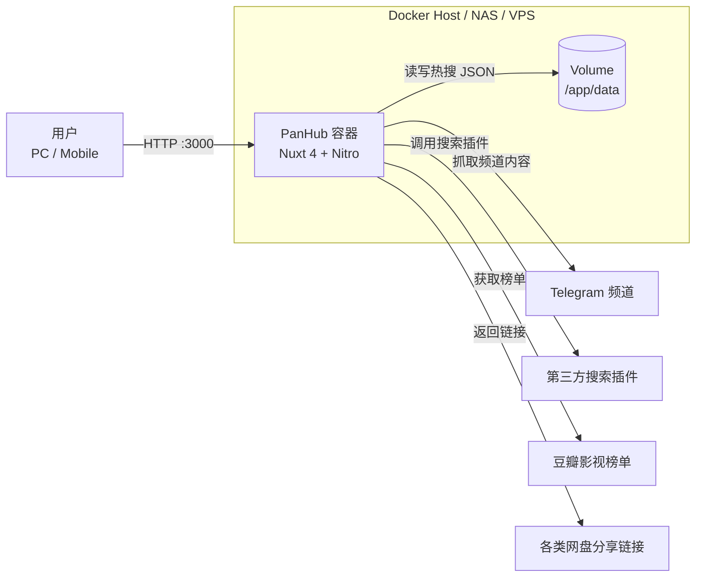
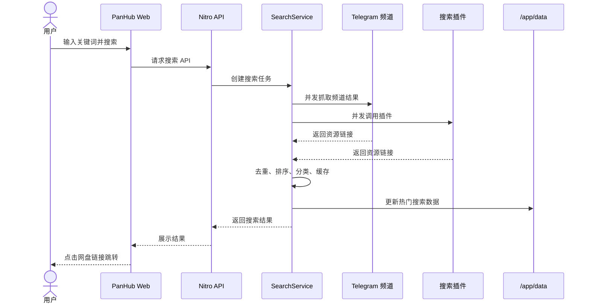

# Docker 部署 PanHub：全网网盘资源聚合搜索工具部署指南

PanHub 是一个开源的网盘资源聚合搜索工具，项目标语是“一个搜索框，搜遍全网网盘资源”。它可以同时搜索 Telegram 频道和第三方搜索插件，展示阿里云盘、夸克网盘、百度网盘、115 网盘、迅雷云盘、UC 网盘、天翼云盘、123 网盘、移动云盘等多类资源链接，并提供豆瓣影视榜单、热门搜索、深色模式、响应式页面和密码门保护。

本文基于 `docker-open-source-deploy-article-template.md` 模板整理，同时参考了本地文档 `/Users/a416727/obsidian/NAS/NAS 部署 PanHub 网盘搜索工具.md` 中收集的 NAS 部署资料和相关生态链接。需要注意的是，用户提供的仓库是 `joyce677/panhub`，该仓库 README 与部署镜像仍指向上游项目 `wu529778790/panhub.shenzjd.com`，Docker 镜像使用 `ghcr.io/wu529778790/panhub.shenzjd.com:latest`。

PanHub 适合部署在 NAS、家用服务器、软路由或 VPS 上，用作个人或家庭内部的网盘资源搜索入口。项目本身不存储资源文件，只聚合公开网络中的资源链接。使用时仍应遵守相关法律法规和平台使用条款。

## 项目速览

| 项目 | 内容 |
|---|---|
| 项目名称 | PanHub |
| GitHub 仓库 | <https://github.com/joyce677/panhub> |
| 上游/镜像来源 | `ghcr.io/wu529778790/panhub.shenzjd.com:latest` |
| 在线体验 | <https://panhub.shenzjd.com> |
| 默认端口 | `3000` |
| 数据目录 | `/app/data` |
| 推荐部署方式 | Docker Compose |
| 前端技术栈 | Nuxt.js 4、Vue 3、TypeScript、原生 CSS |
| 后端技术栈 | Nitro、Cheerio、ofetch、Vitest |
| 开源协议 | MIT |

## 功能特性

- 多源聚合搜索：同时搜索 Telegram 频道和第三方搜索插件。
- 优先级调度：优先频道可以更快返回首屏搜索结果。
- 批量并发：可通过设置面板配置优先频道、普通频道和插件。
- 暂停/继续：搜索过程中可以暂停，找到目标后不必等所有源返回。
- 自动重试：网络请求失败时支持重试。
- 智能缓存：使用 LRU 缓存和过期清理减少重复请求。
- 豆瓣影视榜单：支持 Top250、新片榜、口碑榜、北美票房等榜单。
- 热门搜索：展示其他用户搜索过的关键词，并支持 JSON 文件持久化。
- 密码门：通过 `SEARCH_PASSWORD` 开启搜索密码保护，Cookie 默认有效 30 天。
- 响应式设计：适配桌面、平板和手机。
- 深色模式：支持深色主题并可跟随系统偏好。

## 支持的网盘类型

PanHub README 中列出的支持平台包括：

| 平台 | 说明 |
|---|---|
| 阿里云盘 | 支持分享链接解析 |
| 夸克网盘 | 支持分享链接解析 |
| 百度网盘 | 支持分享链接解析 |
| 115 网盘 | 支持分享链接解析 |
| 迅雷云盘 | 支持分享链接解析 |
| UC 网盘 | 支持分享链接解析 |
| 天翼云盘 | 支持分享链接解析 |
| 123 网盘 | 支持分享链接解析 |
| 移动云盘 | 支持分享链接解析 |

## 适用场景

- NAS 自托管：在群晖、绿联、威联通、TrueNAS、CasaOS、1Panel 等环境中部署。
- 家庭影音搜索：配合影视榜单快速搜索公开网盘资源。
- 个人收藏入口：作为浏览器书签或内网首页中的资源搜索工具。
- 轻量学习项目：学习 Nuxt/Nitro 应用的 Docker 部署、数据卷挂载和环境变量配置。
- 资源搜索聚合演示：用于技术学习和搜索聚合能力验证。

不建议把 PanHub 部署成无保护的公开站点。虽然它不像 CloudSaver 那样直接做账号转存，但公开搜索服务可能带来访问滥用、源站压力、合规风险和服务器资源消耗。

## 架构分析

PanHub 是一个 Nuxt/Nitro 应用，Docker 容器内部同时提供前端页面和服务端 API。用户在浏览器中输入关键词后，前端调用 Nitro API，后端搜索编排器会并发请求 Telegram 频道和第三方插件，随后对结果做去重、分类、排序和缓存。热门搜索数据会写入 `/app/data`，因此 Docker 部署时建议挂载数据卷。

图表使用 Mermaid 语法，适合 GitHub 和多数 Markdown 预览工具直接渲染。

### 部署架构图



### 搜索请求链路图



## 部署前准备

### 服务器要求

- 系统：任意支持 Docker 的 Linux、NAS、软路由或 VPS。
- CPU：1 核即可起步，并发搜索较多时建议 2 核以上。
- 内存：512MB 起步，建议 1GB 以上。
- 磁盘：热搜数据占用很小，但建议预留日志和缓存空间。
- 端口：默认使用 `3000`。
- 网络：需要能访问 Telegram 频道、第三方搜索插件和豆瓣相关页面。

如果部署在家庭 NAS 上，建议先在内网使用。需要公网访问时，优先通过反向代理、HTTPS 和访问控制开放。

### 安装 Docker 和 Compose

```bash
docker --version
docker compose version
```

如果 NAS 只提供图形化 Docker 管理界面，也可以按本文的镜像、端口、环境变量和数据卷配置手动创建容器。

## Docker 快速部署

如果只是想快速体验，可以直接用 `docker run` 启动。

创建数据目录：

```bash
mkdir -p /opt/panhub/data
```

拉取镜像：

```bash
docker pull ghcr.io/wu529778790/panhub.shenzjd.com:latest
```

启动容器：

```bash
docker run -d \
  --name panhub \
  --restart unless-stopped \
  -p 3000:3000 \
  -e NODE_ENV=production \
  -e PORT=3000 \
  -e HOST=0.0.0.0 \
  -e LOG_LEVEL=info \
  -v /opt/panhub/data:/app/data \
  ghcr.io/wu529778790/panhub.shenzjd.com:latest
```

查看容器状态：

```bash
docker ps
```

查看运行日志：

```bash
docker logs -f panhub
```

访问地址：

```text
http://服务器IP:3000
```

如果只在内网使用，这样就能满足基本需求。若准备长期运行，建议改用 Docker Compose 管理。

## Docker Compose 完整部署

Docker Compose 更适合长期部署。它能把端口、环境变量、数据卷和健康检查写在一个文件里，后续迁移和更新更清楚。

创建项目目录：

```bash
mkdir -p /opt/panhub/data
cd /opt/panhub
```

创建 `.env` 文件：

```env
TZ=Asia/Shanghai
APP_PORT=3000
LOG_LEVEL=info
SEARCH_PASSWORD=
```

创建 `docker-compose.yml`：

```yaml
services:
  panhub:
    image: ghcr.io/wu529778790/panhub.shenzjd.com:latest
    container_name: panhub
    restart: unless-stopped
    ports:
      - "${APP_PORT}:3000"
    volumes:
      - ./data:/app/data
    environment:
      - NODE_ENV=production
      - PORT=3000
      - HOST=0.0.0.0
      - LOG_LEVEL=${LOG_LEVEL}
      - SEARCH_PASSWORD=${SEARCH_PASSWORD}
    healthcheck:
      test: ["CMD", "node", "-e", "require('http').get('http://localhost:3000/api/health', (r) => {process.exit(r.statusCode === 200 ? 0 : 1)})"]
      interval: 30s
      timeout: 10s
      retries: 3
      start_period: 40s
```

启动服务：

```bash
docker compose up -d
```

查看服务状态：

```bash
docker compose ps
```

查看日志：

```bash
docker compose logs -f
```

访问地址：

```text
http://服务器IP:3000
```

如果宿主机 `3000` 端口已经被占用，可以把 `.env` 里的 `APP_PORT` 改成 `8080` 或其他端口：

```env
APP_PORT=8080
```

然后访问：

```text
http://服务器IP:8080
```

## 环境变量说明

PanHub README 中列出的主要环境变量如下：

| 变量名 | 默认值 | 说明 |
|---|---|---|
| `LOG_LEVEL` | `info` | 日志级别，可选 `debug`、`info`、`warn`、`error` |
| `NITRO_PRESET` | `auto-detect` | 部署预设，通常 Docker 部署不需要手动配置 |
| `PORT` | `3000` | 容器内服务端口 |
| `SEARCH_PASSWORD` | 空 | 非空时启用搜索密码门，搜索时需输入正确密码 |

如果部署在公网或多人可访问环境，建议设置 `SEARCH_PASSWORD`：

```env
SEARCH_PASSWORD=请换成一个强密码
```

启用后，用户搜索时需要输入密码解锁，Cookie 默认有效 30 天。它不是完整的用户系统，但能挡住大部分随意访问。

## 部署后检查

检查容器状态：

```bash
docker ps
docker compose ps
```

检查健康接口：

```bash
curl http://127.0.0.1:3000/api/health
```

检查日志：

```bash
docker logs -f panhub
docker compose logs -f
```

重点确认：

- Web 页面能否打开。
- 搜索是否能返回结果。
- 豆瓣榜单是否能加载。
- 热搜是否能持久化到 `/opt/panhub/data`。
- 如果设置了 `SEARCH_PASSWORD`，搜索前是否出现密码校验。
- 如果搜索慢或失败，服务器网络是否能访问 Telegram 和第三方搜索源。

## 使用指南

### 搜索资源

进入首页后，在搜索框输入关键词并回车。PanHub 会先返回优先频道或更快的搜索源结果，后续结果继续加载。搜索过程中可以暂停或继续，找到目标资源后不必等待所有搜索源完成。

### 查看豆瓣榜单

PanHub 支持豆瓣 Top250、新片榜、口碑榜、北美票房等榜单。点击影视名称后，可以自动发起网盘资源搜索。这个功能适合在 NAS 上做一个家庭影视资源入口。

### 使用热门搜索

热门搜索会展示其他用户搜索过的关键词。Docker 部署时，如果挂载了 `/app/data`，热搜 JSON 数据可以持久化保存；如果没有挂载，容器删除后热搜数据会丢失。

### 设置面板

右上角设置按钮可以配置：

- 插件管理：启用或禁用第三方搜索插件。
- TG 频道：配置优先频道和普通频道。
- 性能参数：调整并发数、超时时间、缓存时长。

如果你部署在性能较弱的 NAS 上，可以适当降低并发数，避免瞬间发起太多网络请求。

### 常用命令

Docker 快速部署常用命令：

```bash
docker ps
docker logs -f panhub
docker restart panhub
docker stop panhub
docker rm panhub
```

Docker Compose 完整部署常用命令：

```bash
cd /opt/panhub
docker compose ps
docker compose logs -f
docker compose restart
docker compose down
docker compose up -d
```

## 功能展示

### 首页搜索

首页是一个聚合搜索框。输入关键词后，系统会从多个来源并发搜索资源，并按照类型、时间或相关性展示结果。

### 搜索结果

搜索结果会展示资源名称、来源、网盘类型和跳转链接。用户点击结果后，会跳转到对应网盘分享页。

### 豆瓣榜单

豆瓣榜单适合做影视发现入口。用户可以从榜单中选择电影或剧集名称，一键带入搜索。

### 热门搜索

热门搜索展示近期高频关键词。对于家庭或小团队内部使用，它可以让常用资源入口更集中。

### 设置面板

设置面板用于管理插件、频道和性能参数。部署文章配图时，建议展示插件开关和并发设置，让读者知道 PanHub 不只是一个静态搜索框。

## 数据备份

PanHub 的持久化数据主要是 `/app/data`，Docker Compose 部署时对应宿主机目录 `/opt/panhub/data`。

备份前建议先停止服务：

```bash
cd /opt/panhub
docker compose down
```

备份数据和配置：

```bash
tar -czvf panhub-backup-$(date +%F).tar.gz ./data ./.env ./docker-compose.yml
```

重新启动：

```bash
docker compose up -d
```

如果是单容器部署，备份：

```bash
tar -czvf panhub-backup-$(date +%F).tar.gz /opt/panhub/data
```

## 更新升级

更新前建议先备份 `/opt/panhub/data`、`.env` 和 `docker-compose.yml`。

### Docker 快速部署更新

拉取最新镜像：

```bash
docker pull ghcr.io/wu529778790/panhub.shenzjd.com:latest
```

停止并删除旧容器：

```bash
docker stop panhub
docker rm panhub
```

用原数据目录重新启动：

```bash
docker run -d \
  --name panhub \
  --restart unless-stopped \
  -p 3000:3000 \
  -e NODE_ENV=production \
  -e PORT=3000 \
  -e HOST=0.0.0.0 \
  -e LOG_LEVEL=info \
  -v /opt/panhub/data:/app/data \
  ghcr.io/wu529778790/panhub.shenzjd.com:latest
```

### Docker Compose 更新

```bash
cd /opt/panhub
docker compose pull
docker compose down
docker compose up -d
docker compose logs -f
```

更新后检查首页、搜索、豆瓣榜单、热搜和设置面板是否正常。

## 回滚版本

如果新版本异常，先保留日志：

```bash
docker logs panhub > panhub-error.log
```

如果你使用固定版本标签，可以把 `docker-compose.yml` 中的镜像改回旧版本，再执行：

```bash
docker compose pull
docker compose down
docker compose up -d
```

如果一直使用 `latest`，回滚会比较困难。更稳的做法是在正式环境中记录每次更新前的镜像 digest。

## 卸载清理

如果使用 Docker 单容器部署：

```bash
docker stop panhub
docker rm panhub
```

如果使用 Docker Compose 部署：

```bash
cd /opt/panhub
docker compose down
```

确认不再使用后，可以删除部署目录：

```bash
rm -rf /opt/panhub
```

注意：删除 `/opt/panhub` 后，热搜数据、Compose 配置和 `.env` 都会被删除。删除前请确认已经备份。

## 常见问题

### 页面打不开

检查容器状态：

```bash
docker ps
docker logs -f panhub
```

检查端口占用：

```bash
lsof -i :3000
```

如果端口被占用，修改 `.env`：

```env
APP_PORT=8080
```

然后重启：

```bash
docker compose up -d
```

### 搜索结果很少或搜索失败

常见原因：

- 服务器无法访问 Telegram 频道。
- 第三方插件对应站点不可用。
- 网络超时或 DNS 解析异常。
- 并发数过高导致请求失败。
- 搜索源内容本身变化。

可以尝试在设置面板中调整插件、频道、并发数和超时时间。

### 热搜数据没有持久化

确认是否挂载了数据目录：

```yaml
volumes:
  - ./data:/app/data
```

如果没有挂载，容器删除后热搜 JSON 数据会丢失。

### 搜索入口是否需要密码

如果只是内网使用，可以不设置 `SEARCH_PASSWORD`。如果开放到公网或多人可访问环境，建议设置：

```env
SEARCH_PASSWORD=请换成一个强密码
```

这个密码门不是完整的账号权限系统，但能降低被随意访问和滥用的风险。

### PanHub 和 CloudSaver 有什么区别

本地参考文档中也提到了 PanHub 和 CloudSaver 的对比问题。可以简单理解：

| 项目 | 重点 |
|---|---|
| PanHub | 聚合搜索、榜单、热搜、跳转网盘分享链接 |
| CloudSaver | 搜索 + 账号 Cookie 配置 + 网盘转存 |

如果你只想搜索并跳转链接，PanHub 更轻量。如果你需要一键转存到自己的网盘，CloudSaver 更贴近这个场景，但也更需要注意 Cookie 和账号安全。

## 安全与合规建议

- 本项目仅用于技术学习和搜索聚合演示。
- 不要用它存储、传播或盈利化分发受版权保护的内容。
- 尽量内网使用，公网访问时加 HTTPS、反向代理和 `SEARCH_PASSWORD`。
- 不要把服务暴露给不可信用户高频调用。
- 遵守当地法律法规和相关平台使用条款。
- 如果插件或频道来源失效，不要盲目替换成不可信来源。

## 总结

PanHub 是一个很适合 NAS 自托管的轻量网盘资源聚合搜索工具。它的部署门槛低：一个镜像、一个端口、一个数据目录，就能跑起来。相比需要配置网盘 Cookie 的转存类工具，PanHub 的风险边界更简单，核心是搜索聚合和跳转。

长期使用建议采用 Docker Compose 部署，并挂载 `/app/data` 保存热搜数据。如果服务需要开放到公网，建议配置 `SEARCH_PASSWORD`、反向代理和 HTTPS。对于 NAS 用户来说，PanHub 可以作为一个轻量的影视和资源搜索入口，但仍应把它定位为学习和自用工具，避免公开滥用。

## 参考资料

- PanHub GitHub 仓库：<https://github.com/joyce677/panhub>
- PanHub README：<https://raw.githubusercontent.com/joyce677/panhub/main/README.md>
- PanHub Docker Compose：<https://raw.githubusercontent.com/joyce677/panhub/main/docker-compose.yml>
- 本地参考文档：`/Users/a416727/obsidian/NAS/NAS 部署 PanHub 网盘搜索工具.md`
- Docker 官方文档：<https://docs.docker.com/>
- Docker Compose 文档：<https://docs.docker.com/compose/>
