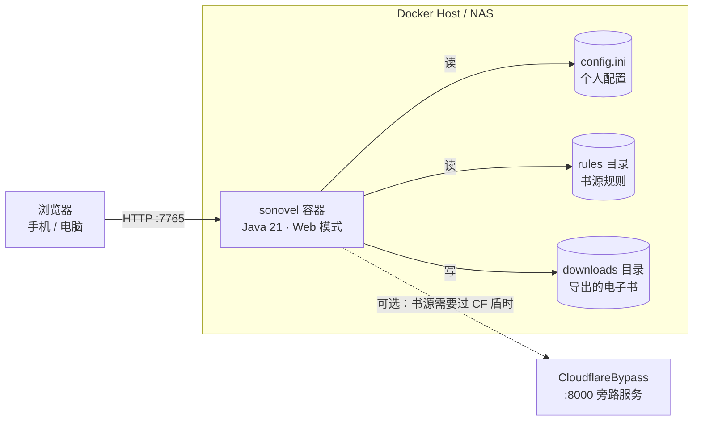
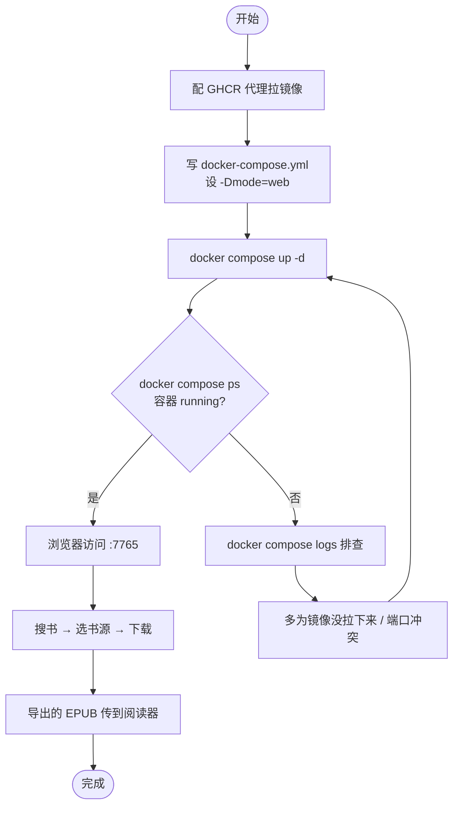

# 用 Docker 在 NAS 上搭 So Novel：一个容器搞定全网小说搜、下、读

在 NAS 上看小说是个麻烦事：想追的书散在各种网站，广告弹窗一堆，想导到 Kindle 或 Readest 上离线看还得手动复制粘贴、转格式。So Novel 把这件事简化成一个网页——搜索书名、选书源、点下载，直接产出 EPUB / TXT / PDF。

So Novel（freeok/so-novel）是一款网页内容处理与导出工具，能从网页抓取结构化内容并导出成标准电子书格式，适合学习采集、格式转换、电子书制作。它有 TUI、CLI、Web 三种界面，其中 **Web 版最适合跑在 NAS 或服务器上**——起一个容器，全家设备浏览器访问就能用。

这篇讲怎么用 Docker 把 Web 版稳稳部署起来。它是个单容器 Java 应用，部署很简单，但有两个点容易卡住新手：**镜像在 GHCR 不在 Docker Hub**，国内拉取要用对加速地址；以及**书源和配置怎么持久化**。下面重点说这两块。

## 先认识这个项目

| 项目 | 信息 |
|---|---|
| 仓库 | [freeok/so-novel](https://github.com/freeok/so-novel) |
| 定位 | 网页内容处理与导出工具（小说下载 → EPUB/TXT/PDF） |
| 运行时 | Java 21（内置 JRE，ZGC） |
| 界面 | TUI / CLI / Web 三选一 |
| 镜像 | `ghcr.io/freeok/sonovel:latest`（GitHub Container Registry） |
| 端口 | 7765（Web 版） |
| 协议 | 见仓库 LICENSE，使用前请阅读项目免责声明 |
| 版本 | 迭代活跃，部署时以 [Releases](https://github.com/freeok/so-novel/releases) 最新为准 |

一句话使用逻辑：进 Web 界面 → 搜书 → 选书源 → 下载 → 拿到电子书文件。书源规则和个人配置放在 `config.ini` 和 `rules` 目录里，下载好的书落在 `downloads`。

> ⚠️ 合规提醒：这类工具用于抓取网页内容，请只用于个人学习和已授权内容，遵守目标网站的服务条款和版权法规。项目自己也放了免责声明，部署前建议读一遍。

## 部署架构：就一个容器

So Novel Web 版不需要数据库、不需要缓存，一个容器跑 Java 应用，数据全落在挂载的卷里。架构简单到一张图就说清：



三个挂载点分工明确：`config.ini` 存你的偏好（导出格式、书源开关、CF 绕过地址等），`rules` 是书源规则（决定能搜哪些站），`downloads` 是产出的电子书。只要把这三个持久化，容器删了重建数据也不丢。

那个虚线的 CloudflareBypass 是**可选**的——只有当你要用的书源套了 Cloudflare 盾、直接抓不到时才需要，绝大多数情况用不上，后面单独说。

## 环境准备

单容器应用，要求很低：

| 项目 | 要求 |
|---|---|
| 操作系统 | 任意支持 Docker 的系统（群晖/威联通 NAS、Linux、macOS、Windows） |
| 内存 | 512MB 以上即可（Java 应用，建议留 1GB） |
| 磁盘 | 视下载量而定，程序本身很小 |
| Docker | 20.10+，装了 Compose v2 更方便 |
| 架构 | 支持 x64 和 arm64（NAS 常见的 ARM 也能跑） |

确认 Docker 可用：

```bash
docker --version
docker compose version
```

## 关键前提：镜像在 GHCR，国内要配对加速

So Novel 的镜像发布在 **GitHub Container Registry（`ghcr.io`）**，不是 Docker Hub。这点很重要——**大多数国内 Docker 镜像加速源只代理 `docker.io`，不代理 `ghcr.io`**，所以直接 `docker pull ghcr.io/freeok/sonovel` 在国内经常拉不动或超时。

解决办法是用支持 GHCR 的代理前缀。下面几个可用（择一，失败换下一个）：

```bash
# DaoCloud 的 GHCR 代理（推荐先试）
docker pull ghcr.m.daocloud.io/freeok/sonovel:latest

# 南京大学镜像站的 GHCR 代理
docker pull ghcr.nju.edu.cn/freeok/sonovel:latest
```

拉下来后，打个 tag 还原成原名，后面 compose 就能直接用原始镜像名：

```bash
# 把代理拉的镜像重命名回官方名
docker tag ghcr.m.daocloud.io/freeok/sonovel:latest ghcr.io/freeok/sonovel:latest
```

> 以上代理可能因维护变动失效，如都不可用，可在有网络的机器上 `docker pull` 后用 `docker save` / `docker load` 离线导入。注意：`docker.1ms.run` 这类只代理 Docker Hub 的源对 GHCR 无效，别白试。

## 部署方式一：Docker Compose（NAS 首选）

在 NAS 上用 Compose 最省心——群晖/威联通的 Docker 套件都支持直接贴 compose 配置。

### 创建目录和配置文件

```bash
# 建项目目录
mkdir -p /opt/sonovel && cd /opt/sonovel
```

创建 `docker-compose.yml`：

```yaml
services:
  sonovel:
    image: ghcr.io/freeok/sonovel:latest
    container_name: sonovel
    ports:
      - "7765:7765"
    environment:
      JAVA_OPTS: "-Dmode=web"   # 关键：以 Web 模式启动，不写会进 TUI 模式
    volumes:
      - sonovel_data:/sonovel   # 用命名卷持久化全部数据
    restart: unless-stopped

volumes:
  sonovel_data:
```

这里 `JAVA_OPTS: "-Dmode=web"` 是**必须的**——So Novel 默认以 TUI（终端界面）模式启动，容器里没有交互终端，不指定 Web 模式的话进不去网页。

### 启动

```bash
# 后台拉起
docker compose up -d

# 看状态和日志
docker compose ps
docker compose logs -f
```

日志里出现 Web 服务监听 7765 的提示后，浏览器访问 `http://NAS的IP:7765` 就能用了。

## 部署方式二：docker run（想精细控制挂载）

如果你想把配置、书源、下载目录分别挂到宿主机上直接管理（而不是闷在命名卷里），用 `docker run` 加 bind mount：

```bash
# 先准备好宿主机上的 config.ini 和 rules 目录（可从容器里拷或从仓库下）
docker run -d \
  --name sonovel \
  -p 7765:7765 \
  -e JAVA_OPTS='-Dmode=web' \
  -v /opt/sonovel/config.ini:/sonovel/config.ini \
  -v /opt/sonovel/rules:/sonovel/rules \
  -v /opt/sonovel/downloads:/sonovel/downloads \
  --restart unless-stopped \
  ghcr.io/freeok/sonovel:latest
```

**这里有个坑**：bind mount 挂载 `config.ini` 时，宿主机上必须**先存在这个文件**，否则 Docker 会把它当成目录创建，导致程序读取配置失败。稳妥做法是先用命名卷跑一次，进容器把默认 `config.ini` 和 `rules` 拷出来，再改用 bind mount。或者干脆用方式一的命名卷，省事。

## 部署流程全景



## 首次使用：搜书、配书源、导出

进入 Web 界面后基本是"所见即所得"：输入书名搜索，从结果里选一本，选好书源和导出格式（EPUB/TXT/PDF），点下载。下载完的文件在 `downloads` 目录（或命名卷里）。

几个值得调的地方，都在 `config.ini`：

- **导出格式**：默认 EPUB，想要 TXT 或 PDF 可以改。
- **书源开关**：`rules` 目录里是各站点的抓取规则，能搜哪些站取决于这里。
- **编码**：部分繁体/GBK 站点可能需要调编码，遇到乱码时查这项。

拿到 EPUB 后，桌面端推荐 Readest / Koodo Reader / Calibre，移动端 Apple Books / Moon+ Reader / Kindle。如果 WPS、掌阅打不开导出的 EPUB，是已知兼容问题，项目 issue #199 有说明。

## 可选：书源被 Cloudflare 挡住时

有些小说站套了 Cloudflare 人机验证，So Novel 直接抓会失败。这时才需要额外起一个 CloudflareBypass 服务来过盾。

参考项目 [CloudflareBypassForScraping](https://github.com/sarperavci/CloudflareBypassForScraping) 部署它（也是 Docker 一条命令），然后在 So Novel 的 `config.ini` 里设置绕过地址：

```ini
# config.ini 中指向 CF 绕过服务
cf-bypass = 127.0.0.1:8000
```

注意：如果 CF 绕过服务和 So Novel 都在容器里，`127.0.0.1` 指向的是各自容器内部，两者要能互通得放到同一 Docker 网络里用服务名互相寻址，或用宿主机 IP。不需要抓 CF 盾站点的话，这一步完全跳过。

## 日常维护

### 更新到新版

So Novel 更新比较勤，书源规则也会跟着更新。更新步骤：

```bash
# 重新拉镜像（记得走 GHCR 代理），再重建容器
docker compose pull
docker compose up -d
```

如果 `docker compose pull` 拉原始 `ghcr.io` 地址超时，先用代理拉再打 tag（见前面加速那节）。

生产环境建议**别一直用 `latest`**——虽然这是个人工具、影响不大，但锁定到具体版本 tag 能避免某次更新后书源规则变动导致行为不一致。可以在 [Releases](https://github.com/freeok/so-novel/releases) 看版本号，把 compose 里的 `:latest` 换成具体版本。

### 数据备份

要备份的就是那三样：配置、书源、下载。用命名卷的话这样备：

```bash
# 停容器保证文件一致
docker compose stop

# 备份整个命名卷
docker run --rm \
  -v sonovel_sonovel_data:/data \
  -v $(pwd):/backup \
  alpine tar -czf /backup/sonovel-backup-$(date +%F).tar.gz /data

docker compose up -d
```

命名卷的实际名字是 `项目目录名_卷名`（这里是 `sonovel_sonovel_data`），用 `docker volume ls` 可以确认。

### 别把 7765 直接暴露公网

So Novel Web 版没有登录鉴权，7765 端口任何人访问到都能用你的实例下载。放在家里 NAS 内网用没问题，但**不要把 7765 直接映射到公网**。确实要外网访问，前面套一层带密码的反向代理，用 Caddy 最省事：

```bash
# /etc/caddy/Caddyfile
novel.yourdomain.com {
    reverse_proxy localhost:7765
    basic_auth {
        # 用 caddy hash-password 生成密码哈希
        yourname $2a$14$...(哈希值)
    }
}
```

Caddy 会自动申请 HTTPS 证书，并加一道 HTTP Basic 认证。

## 踩坑记录

**① 忘了 `-Dmode=web`。** 不加这个环境变量，容器进 TUI 模式，网页访问不了，日志看着也"正常启动"了，很迷惑。Web 部署必加。

**② 直接 `docker pull ghcr.io/...` 拉不动。** GHCR 不是 Docker Hub，国内多数加速源不代理它，得用 `ghcr.m.daocloud.io` 这类 GHCR 专用代理。

**③ bind mount 挂 config.ini 时文件不存在。** Docker 会把它创建成目录，程序读配置报错。先准备好文件，或用命名卷。

**④ 搜不到书 / 下载失败。** 大概率是书源规则过期或该站挂了，去仓库看有没有 rules 更新，或换个书源；套了 CF 盾的站需要配绕过服务。

**⑤ 导出的 EPUB 在某些阅读器打不开。** 已知的 WPS/掌阅兼容问题，换 Readest / Calibre，或用 Calibre 转一次格式。

## 下一步

容器跑起来、能搜能下之后：

1. **进 `config.ini` 调导出格式和编码**，把默认行为改成你习惯的。
2. **理顺书源**——常用哪几个站，确认对应 rules 可用，失效的关掉。
3. **接阅读器**——把 `downloads` 目录同步到你的阅读设备，或用 Calibre 建个书库统一管理。
4. **要外网访问**再上反向代理 + 认证 + HTTPS，内网自用就别开公网口子。
5. **遇到 CF 盾站点**再按需部署 CloudflareBypass，不用则忽略。

单容器工具的好处就是这样：起得快、维护省心。把配置和下载目录持久化好，剩下的就是安心追书了。

---

<!-- IMAGE_PROMPT: gpt-image2
为「使用 Docker 部署 So Novel」技术教程文章设计封面图。画面元素：中心是一本翻开的电子书/电子墨水阅读器，书页里流出文字流转化为 EPUB/TXT/PDF 文件图标；左侧 Docker 鲸鱼 + 单个容器图形（强调"一个容器"）；右侧 NAS/服务器图形；底部命令行终端示意；顶部预留文字区域（不生成文字）。视觉风格：现代极简技术插画，16:9 画幅，主色 #2496ED（Docker 蓝），辅色 #8B5CF6（书籍紫），浅色背景，清晰线条，等距 2.5D 风格。
-->

<!-- IMAGE_PROMPT: gpt-image2
生成一张「So Novel Docker 部署架构图」技术信息图。布局：顶部项目名 So Novel + 一句话定位"全网小说搜下读，导出 EPUB/TXT/PDF"；左侧用户浏览器（手机+电脑）入口；中间单个 Docker 容器 sonovel（Java 21 · Web 模式 · 端口 7765）用圆角矩形；底部持久化存储层三个数据卷（config.ini 配置 / rules 书源规则 / downloads 电子书）用圆柱体；右侧标注可选的 CloudflareBypass 旁路服务（虚线连接）。视觉风格：技术架构信息图，16:9 画幅，主色 #2496ED，辅色 #8B5CF6，背景 #F7F8FA，容器用圆角矩形，数据卷用圆柱体，中文标签，PingFang SC 字体。
-->
