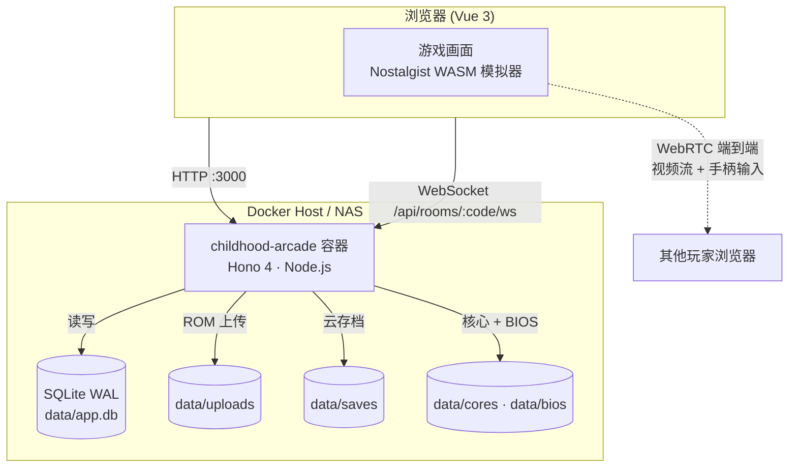
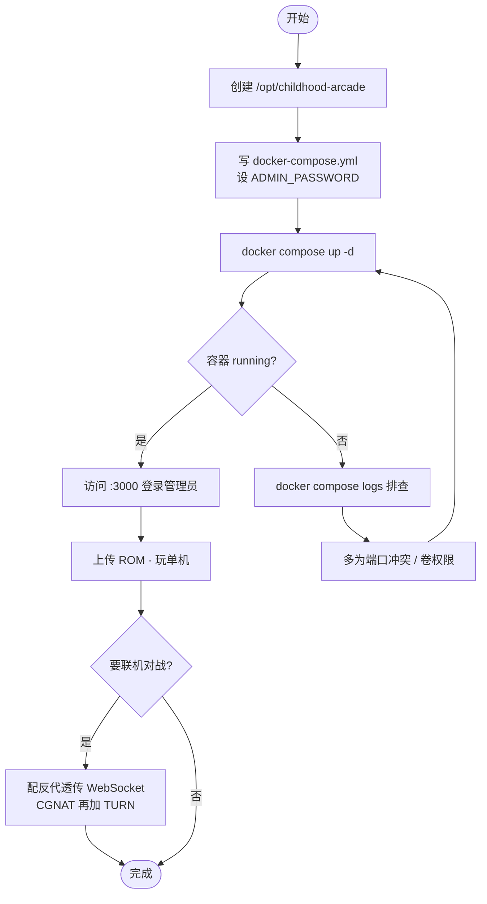

# 在 NAS 上开一间童年游戏厅：Docker 部署 childhood-arcade，浏览器直接玩 FC/街机/PS1

小时候在游戏厅投币玩《街头霸王》《魂斗罗》，现在想找回这份感觉，通常要么装一堆模拟器、各配各的核心，要么每个平台开一个网站。想和朋友联机对战？还得让对方也装客户端、对好端口。

childhood-arcade（童年游戏厅）把这些揉成了一个网页应用：街机 / FC / SFC / GB / GBA / MD / PS1 等 14 个平台统一收藏，浏览器打开就能玩，云存档多端同步，还能生成一个房间码让朋友进来对战——游客不登录也能围观。底层用 libretro 核心，全部本地托管，不装任何客户端。

它是个单容器 Node.js 应用，部署本身很简单。真正需要花点心思的是**联机对战依赖 WebSocket 和 WebRTC**——如果你要套反向代理上 HTTPS，配置和普通 Web 应用不一样，配错了就是"单机能玩、联机开不了房"。这篇重点把这块讲透。

## 先认识这个项目

| 项目 | 信息 |
|---|---|
| 仓库 | [yize8888/childhood-arcade](https://github.com/yize8888/childhood-arcade) |
| 定位 | 自托管网页复古游戏厅，14 平台 + 云存档 + 浏览器联机 |
| 技术栈 | Vue 3 + Hono 4 + SQLite + Nostalgist（libretro WASM） |
| 镜像 | `yize8888/childhood-arcade:latest`（Docker Hub） |
| 端口 | 3000（HTTP 和 WebSocket 共用一个端口） |
| 协议 | MIT |
| 示例站 | [game.520hello.cn](https://game.520hello.cn/) |

它和其他网页模拟器最不一样的几点：核心（`data/cores/`，约 100MB）全部预置在镜像里，不依赖海外 CDN，完全离线可用；按键按平台原生命名和配色（街机 ABCD、MD 六键、PS1 的 ◯✕△□）；房间是常驻的，房主刷新页面房间不会没。

> ⚠️ 合规提醒：项目**不附带任何 ROM 或游戏版权内容**，请自备合法 ROM。仓库内置的街机 BIOS 仅供研究和个人备份。玩什么游戏是你自己的责任。

## 部署架构：一个容器，数据全在一个卷里

childhood-arcade 用 SQLite 存数据（用户、房间、存档、收藏），不需要外部数据库和缓存。整个应用就一个容器，所有状态落在挂载的 `./data` 目录里。



这里有个关键设计要理解：**联机对战的视频流和手柄输入是浏览器之间点对点（WebRTC）传的，服务器不参与转发**。服务器（那个 Hono 容器）只做两件事——提供网页/API，以及在建立连接时用 WebSocket 帮两个浏览器"牵线"（信令）。所以联机流畅不流畅主要看两边浏览器的网络，不是看你 NAS 的带宽。

数据卷 `./data` 是唯一要持久化的东西，里面有 SQLite 数据库、上传的 ROM、云存档、核心和 BIOS。备份它就等于备份了整个游戏厅。

## 环境准备

单容器 Node 应用，要求不高：

| 项目 | 要求 |
|---|---|
| 操作系统 | 任意支持 Docker 的系统（群晖/威联通/飞牛 NAS、Linux、VPS） |
| 内存 | 建议 1GB 以上（模拟在浏览器跑，服务端压力小） |
| 磁盘 | 镜像含约 100MB 核心，另留空间放 ROM 和存档 |
| Docker | 20.10+，建议装 Compose v2 |
| 端口 | 3000（可改） |

```bash
docker --version
docker compose version
```

## 快速部署：Docker Compose

在 NAS 上用 Compose 最顺手。建目录、写配置、起容器三步。

### 创建目录

```bash
mkdir -p /opt/childhood-arcade && cd /opt/childhood-arcade
```

### 写 docker-compose.yml

```yaml
services:
  childhood-arcade:
    image: yize8888/childhood-arcade:latest
    container_name: childhood-arcade
    restart: unless-stopped
    ports:
      - "3000:3000"
    environment:
      MAX_UPLOAD_BYTES: "104857600"   # 单个 ROM 上限，默认 100MB
      # 首次启动会 seed 默认管理员 admin / admin123
      # 强烈建议这里直接设成自己的初始账号
      ADMIN_USERNAME: "admin"
      ADMIN_PASSWORD: "换成你的强密码"
    volumes:
      - ./data:/data
```

配置项都是可选的，但有两个建议动一下：

- `ADMIN_PASSWORD`：默认管理员是 `admin/admin123`，公开可查。**别用默认值**——要么在这里设好初始密码，要么第一次登录后立刻在后台改掉。
- `MAX_UPLOAD_BYTES`：单个 ROM 上传上限，默认 100MB（`104857600` 字节）。PS1 这类光盘镜像可能超，按需调大。

其他环境变量（`PORT`、`DB_PATH`、`UPLOADS_DIR`、`BIOS_DIR`、`SAVES_DIR`、`CORES_DIR`）都有合理默认值，不用管，除非你想改端口或目录布局。

### 启动

```bash
docker compose up -d
docker compose ps
docker compose logs -f
```

浏览器访问 `http://服务器IP:3000`，用你设的管理员账号登录，就能开始传 ROM、开玩了。

## 国内镜像加速

镜像在 Docker Hub（`yize8888/childhood-arcade`），国内拉取慢的话配置 Docker Daemon 加速器：

```bash
# 一键配置镜像加速（复制即用）
sudo mkdir -p /etc/docker
sudo tee /etc/docker/daemon.json <<'EOF'
{
  "registry-mirrors": [
    "https://docker.1ms.run",
    "https://docker.m.daocloud.io",
    "https://docker.1panel.live",
    "https://docker-0.unsee.tech",
    "https://hub.rat.dev",
    "https://docker.xuanyuan.me"
  ]
}
EOF
sudo systemctl daemon-reload
sudo systemctl restart docker
```

配完重新 `docker compose up -d` 即可。或者单独替换前缀拉：

```bash
# 替换镜像前缀直接拉取（无需配置 daemon）
docker pull docker.1ms.run/yize8888/childhood-arcade:latest
docker pull docker.m.daocloud.io/yize8888/childhood-arcade:latest
```

> 以上镜像源可能因维护变动失效，如遇失败请依次尝试其他地址。

## 部署流程全景



## 关键：要联机就得配对反向代理

单机玩、内网玩，直接 `http://IP:3000` 就够了。但只要你想上 HTTPS（外网访问几乎必须），或者要让联机对战稳定工作，就得正确配反向代理。

childhood-arcade 的 3000 端口**同时跑 HTTP 和 WebSocket**（联机信令走 `/api/rooms/:code/ws`）。普通反代配置只转发 HTTP，会把 WebSocket 的升级握手吃掉，表现就是：网页能开、游戏能玩，但**开房、进房一直转圈连不上**。

用 Caddy 最省事，它默认就正确处理 WebSocket 升级，还自动签 HTTPS 证书：

```
# /etc/caddy/Caddyfile
arcade.yourdomain.com {
    reverse_proxy localhost:3000
}
```

如果你用 Nginx，必须手动透传 `Upgrade` 和 `Connection` 头，并把超时拉长（联机是长连接）：

```nginx
server {
    listen 443 ssl;
    server_name arcade.yourdomain.com;
    # ssl_certificate / ssl_certificate_key 自行配置

    location / {
        proxy_pass http://127.0.0.1:3000;
        proxy_http_version 1.1;
        proxy_set_header Upgrade $http_upgrade;        # WebSocket 升级，必须
        proxy_set_header Connection "upgrade";         # 必须
        proxy_set_header Host $host;
        proxy_set_header X-Real-IP $remote_addr;
        proxy_read_timeout 3600s;                      # 长连接，别用默认 60s
    }
}
```

`proxy_read_timeout` 官方建议至少 60 秒，我直接给到 3600 秒——联机一局可能打很久，超时断了体验很差。

### WebRTC 和 NAT 穿透

联机的视频/输入走 WebRTC 点对点。项目默认用 Google 和 Cloudflare 的公共 STUN 服务器帮双方发现彼此的公网地址，大多数家庭宽带能直连。

但如果你或对方在**运营商级 NAT（CGNAT）**后面——常见于一些手机热点、校园网、部分宽带——STUN 打洞会失败，这时需要自建一个 TURN 服务器（比如 coturn）做中继。这是联机场景里最容易卡住的一环，纯内网自用可以先不管。

## 首次使用

进后台（管理员账号登录）能做这些：上传 ROM（拖拽即可，注意单个别超 `MAX_UPLOAD_BYTES`）、管理用户、开关联机功能、看 BIOS 列表。

普通玩法：在游戏库选一个游戏直接开玩，存档会自动同步到云端（`data/saves`），换个设备登录同一账号能接着玩。想联机就在游戏里开房，把房间码发给朋友，对方浏览器输入房间码进来——登录了能当 P2 对战，不登录也能围观直播 + 聊天。

PS1 游戏要注意：仓库预置了街机和 FDS 的 BIOS，但 **PSX BIOS 需要你自己准备**，放到 `data/bios/psx/` 目录下才能跑 PS1 游戏。

## 日常维护

### 更新

```bash
docker compose pull
docker compose up -d
```

ROM、存档、数据库都在 `./data` 卷里，更新镜像不会丢。生产环境建议把 `:latest` 换成具体版本 tag（去仓库 Releases 看），避免某次更新引入不兼容变化。

### 备份

整个游戏厅的状态就是 `./data` 目录，直接打包它：

```bash
# 停容器保证 SQLite 数据一致（WAL 模式下尤其建议停）
docker compose stop

# 打包整个 data 目录（含数据库、ROM、存档、BIOS）
tar -czf childhood-arcade-backup-$(date +%F).tar.gz ./data

docker compose up -d
```

`./data` 里的 ROM 和核心可能有几个 GB，如果只想备份"账号 + 存档 + 收藏"这些真正无法重建的数据，单独备 `data/app.db*`（SQLite 的 WAL 模式会有 `.db`、`.db-wal`、`.db-shm` 几个文件）和 `data/saves` 即可。

### 别裸奔公网

游戏厅有账号系统，但默认管理员密码是公开的。放公网前务必：改掉默认密码、套 HTTPS 反代（顺便解决 WebSocket）、按需在后台关掉开放注册。

## 踩坑记录

**① 用了默认 admin/admin123。** 密码公开可查，暴露公网等于门户大开。第一时间改。

**② 套了反代后联机开不了房。** 十有八九是 WebSocket 没透传。Nginx 要加 `Upgrade`/`Connection` 头，Caddy 默认就对。

**③ 联机能开房但连不上/卡。** 双方或一方在 CGNAT 后面，公共 STUN 打洞失败，需要自建 TURN 中继。

**④ PS1 游戏加载不了。** PSX BIOS 没放。自备后放进 `data/bios/psx/`。

**⑤ 大 ROM 传不上去。** 超过 `MAX_UPLOAD_BYTES`（默认 100MB）。调大这个环境变量再重启容器。

**⑥ 反代默认 60 秒超时导致联机中途掉线。** 把 `proxy_read_timeout` 拉长到几百上千秒。

## 下一步

容器跑起来、能玩之后：

1. **改管理员密码**，进后台熟悉用户管理和站点设置。
2. **传几个 ROM** 试试单机存档能不能多端同步。
3. **要联机**就先在内网测通开房流程，再上反代 + HTTPS + WebSocket 透传。
4. **玩家在 CGNAT 后连不上**再考虑自建 coturn TURN 服务器。
5. **给一群朋友用**就把 `:latest` 锁到具体版本，设好 `./data` 的自动备份。

单容器 + SQLite 的组合让它部署门槛很低，适合放在 NAS 上当家庭娱乐。真正的复杂度不在部署，而在联机的网络穿透——那部分按需处理就好，自己内网玩完全用不上。

---

<!-- IMAGE_PROMPT: gpt-image2
为「使用 Docker 部署 childhood-arcade 童年游戏厅」技术教程文章设计封面图。画面元素：中心是一台复古街机/像素风游戏机，屏幕里显示像素游戏画面；左侧 Docker 鲸鱼 + 单个容器图形；右侧两个游戏手柄用连线相连（象征联机对战）；底部命令行终端示意；顶部预留文字区域（不生成文字）。视觉风格：现代极简技术插画混搭 8-bit 像素元素，16:9 画幅，主色 #2496ED（Docker 蓝），辅色 #6366F1（Indigo 靛蓝），浅色背景，清晰线条，等距 2.5D 风格。
-->

<!-- IMAGE_PROMPT: gpt-image2
生成一张「childhood-arcade Docker 部署架构图」技术信息图。布局：顶部项目名"童年游戏厅 Childhood Arcade" + 一句话定位"自托管网页复古游戏厅，14 平台 + 云存档 + 浏览器联机"；左侧用户浏览器（含 Nostalgist WASM 模拟器）；中间单个 Docker 容器 childhood-arcade（Hono 4 · Node.js · 端口 3000）用圆角矩形；底部持久化存储层 data 卷（SQLite app.db / uploads ROM / saves 云存档 / cores+bios 核心）用圆柱体；右侧另一个玩家浏览器，与左侧浏览器之间用虚线标注 WebRTC 端到端（视频流+手柄输入）。视觉风格：技术架构信息图，16:9 画幅，主色 #2496ED，辅色 #6366F1，背景 #F7F8FA，容器用圆角矩形，数据卷用圆柱体，中文标签，PingFang SC 字体。
-->
