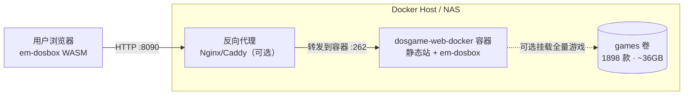
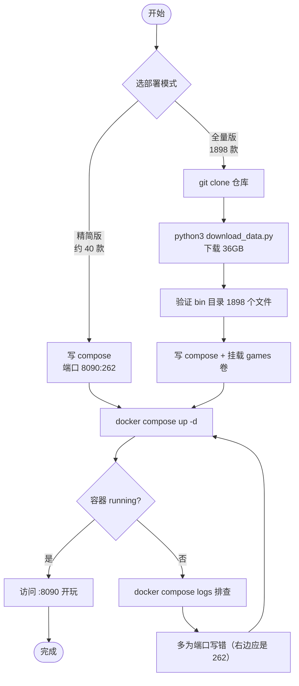

# 浏览器里重温 1898 款中文 DOS 游戏：Docker 部署 chinese-dos-games

《仙剑奇侠传》《金庸群侠传》《三国志》《大富翁》——这些名字对 80、90 后是一整个童年。想再玩一遍，装 DOSBox、找游戏、配置一堆参数太折腾，手机上更是没法玩。

chinese-dos-games 把 1898 款经典中文 DOS 游戏搬进了浏览器：打开网页点一下就能玩，靠 em-dosbox（DOSBox 的 WebAssembly 移植）在浏览器里跑，手机、平板、电脑都能开，还支持存档。用 Docker 部署，几条命令就能在自己的服务器或 NAS 上开一间怀旧游戏厅。

有一点要先说清楚：**官方仓库本身不提供 Docker 镜像**，它是一套静态网站 + 游戏数据。社区打包了现成镜像，部署起来也简单，但有两种模式要选、有个反常的端口号要注意、全量游戏数据有 36GB——这些坑这篇讲明白。

## 先认识这个项目

| 项目 | 信息 |
|---|---|
| 官方仓库 | [rwv/chinese-dos-games](https://github.com/rwv/chinese-dos-games) |
| 定位 | 中文 DOS 游戏合集，1898 款，浏览器直接玩 |
| 底层 | em-dosbox（Emscripten 移植的 DOSBox）+ emularity |
| 官方站 | [dos.lol](https://dos.lol) |
| 社区镜像 | `oldiy/dosgame-web-docker:latest`（非官方，内置约 40 款） |
| 容器内端口 | **262**（注意不是常见的 80，映射时要写对） |
| 全量数据 | 约 36GB（1898 款，需自行下载） |

它跟"装个模拟器"最大的区别：游戏在浏览器里跑，不用装任何客户端；给一群人用只要发个网址。项目作者已经很久没更新了，但游戏是老游戏，不更新也不影响玩。

> ⚠️ 版权提醒：项目作者在仓库里明确写了"此项目存在版权上的侵权"，并留了邮箱供版权方联系删除。这类怀旧游戏合集游走在灰色地带，**建议仅自己或小范围怀旧使用，不要公开架站对外提供服务、更不要商用**。

## 部署架构：一个容器装静态站，游戏数据可选外挂

chinese-dos-games 部署后就是一个静态网站——HTML + JS（em-dosbox）+ 游戏文件。社区镜像把网站和一批游戏打包在一起，容器内用一个轻量 Web 服务监听 262 端口对外提供页面。没有数据库、没有缓存，架构非常简单。



关键设计只有一个选择题：**用镜像内置的约 40 款游戏，还是外挂全量 1898 款**。内置版拉下镜像就能玩，省磁盘；全量版要额外 `git clone` 仓库再跑 Python 脚本下 36GB 数据，然后挂载进容器。游戏本身是静态文件，DOSBox 完全在浏览器端运行，服务器只负责把文件发出去。

## 环境准备

| 项目 | 要求 |
|---|---|
| 操作系统 | 任意支持 Docker 的系统（Linux VPS、群晖/威联通/飞牛 NAS） |
| 内存 | 512MB 以上即可（模拟在浏览器跑，服务端几乎不吃资源） |
| 磁盘 | 内置版几百 MB；**全量版需 ≥40GB 空闲**（数据约 36GB） |
| 带宽 | 下全量数据时越大越好，海外服务器下载更快 |
| Docker | 20.10+，建议 Compose v2 |
| 端口 | 宿主机任选（如 8090），容器内固定 262 |

```bash
docker --version
docker compose version
```

## 模式一：精简版（内置约 40 款，最快上手）

只想快速体验、磁盘不宽裕，直接用镜像内置游戏，不挂载数据卷。

### 创建目录和配置

```bash
mkdir -p /opt/dosgame && cd /opt/dosgame
```

写 `docker-compose.yml`：

```yaml
services:
  dosgame:
    image: oldiy/dosgame-web-docker:latest
    container_name: dosgame
    restart: unless-stopped
    ports:
      - "8090:262"      # 宿主机 8090 → 容器内 262（容器端口固定 262）
```

这里唯一容易错的是端口：**容器内部监听的是 262**，不是 80。映射写成 `8090:262`，冒号右边必须是 262，写错了访问就是空白页。左边 8090 可换成任意未占用端口。

### 启动

```bash
docker compose up -d
docker compose ps
```

浏览器打开 `http://服务器IP:8090`，就能看到游戏列表，点进去直接玩。

## 模式二：全量版（1898 款，需下载 36GB）

想要全部 1898 款游戏，就得自己下载游戏数据再挂载进容器。

### 先下载游戏数据

```bash
cd /opt/dosgame

# 克隆官方仓库（含下载脚本）
git clone https://github.com/rwv/chinese-dos-games.git

cd chinese-dos-games

# 运行 Python 3 脚本下载全部游戏数据（约 36GB，耗时较长）
python3 download_data.py
```

如果提示 `git: command not found` 或 `python: command not found`，先装一下：

```bash
sudo apt update && sudo apt install -y git python3
```

36GB 数据在国内小带宽机器上可能要下很久，建议用带宽大的海外服务器，或挂 `screen`/`nohup` 让它后台慢慢下，别让 SSH 断开中断任务。

下完验证一下游戏数量和体积：

```bash
# 游戏文件数量，应显示 1898
ls -l /opt/dosgame/chinese-dos-games/bin | grep "^-" | wc -l

# 总大小，应显示约 36G
du -sh /opt/dosgame/chinese-dos-games
```

### 挂载数据卷启动

改 `docker-compose.yml`，把下载好的游戏目录挂进容器的 `/app/static/games`：

```yaml
services:
  dosgame:
    image: oldiy/dosgame-web-docker:latest
    container_name: dosgame
    restart: unless-stopped
    ports:
      - "8090:262"
    volumes:
      - /opt/dosgame/chinese-dos-games:/app/static/games   # 外挂全量 1898 款
```

```bash
docker compose up -d
```

现在访问 `http://服务器IP:8090`，游戏列表就是完整的 1898 款了。

## 国内镜像加速

社区镜像在 Docker Hub（`oldiy/dosgame-web-docker`），拉取慢就配置 Docker Daemon 加速器：

```bash
# 一键配置镜像加速（复制即用）
sudo mkdir -p /etc/docker
sudo tee /etc/docker/daemon.json <<'EOF'
{
  "registry-mirrors": [
    "https://docker.1ms.run",
    "https://docker.m.daocloud.io",
    "https://docker.1panel.live",
    "https://docker-0.unsee.tech",
    "https://hub.rat.dev",
    "https://docker.xuanyuan.me"
  ]
}
EOF
sudo systemctl daemon-reload
sudo systemctl restart docker
```

或者不配置 daemon，直接替换前缀拉镜像：

```bash
docker pull docker.1ms.run/oldiy/dosgame-web-docker:latest
docker pull docker.m.daocloud.io/oldiy/dosgame-web-docker:latest
```

> 以上镜像源可能因维护变动失效，失败就依次换其他地址。注意：**这些加速只对镜像有效**，模式二里 36GB 的游戏数据是从 GitHub 相关地址下载的，那部分快不快取决于你服务器到 GitHub 的线路。

## 部署流程全景



## 上 HTTPS：配反向代理

用 IP + 端口能玩，但要用域名访问、加 HTTPS，就在前面挂个反向代理。这是个纯静态站，反代配置很常规，没有 WebSocket 之类的特殊要求。

Caddy 最省事，自动签证书：

```
# /etc/caddy/Caddyfile
dos.yourdomain.com {
    reverse_proxy localhost:8090
}
```

用 Nginx 的话：

```nginx
server {
    listen 443 ssl;
    server_name dos.yourdomain.com;
    # ssl_certificate / ssl_certificate_key 自行配置

    location / {
        proxy_pass http://127.0.0.1:8090;
        proxy_set_header Host $host;
        proxy_set_header X-Real-IP $remote_addr;
        proxy_set_header X-Forwarded-For $proxy_add_x_forwarded_for;
        proxy_set_header X-Forwarded-Proto $scheme;
    }
}
```

前面提过版权问题，这里再强调一次：**加了域名和 HTTPS 意味着更容易被公开访问和索引**，怀旧自用建议用内网或加个访问密码（Nginx 的 `auth_basic`、Caddy 的 `basicauth`），别做成一个人人可搜到的公开游戏站。

## 日常维护

### 更新

作者早已停更，一般不需要更新。真要更新镜像：

```bash
cd /opt/dosgame
docker compose pull
docker compose up -d
docker image prune   # 清理旧的悬空镜像
```

### 备份存档

游戏存档存在浏览器本地（不同游戏机制不同），服务端主要要备份的是**全量模式下那 36GB 游戏数据**——它下载耗时最久，最不想重来。直接打包游戏目录即可：

```bash
tar -czf dosgame-data-backup.tar.gz /opt/dosgame/chinese-dos-games
```

精简模式没有外挂数据，重装容器就能恢复，不用备份。

### 版本锁定

镜像用 `:latest` 即可（项目停更，标签稳定）。真要固定，去 Docker Hub 看 `oldiy/dosgame-web-docker` 的具体 tag 替换。

## 踩坑记录

**① 端口映射写成 `8090:80`，访问空白。** 容器内是 262，右边必须写 262：`8090:262`。

**② 挂了数据卷但游戏还是只有 40 款。** 挂载路径要对准容器内 `/app/static/games`，且宿主机目录得是下载完成、`bin` 下有 1898 个文件的那个 `chinese-dos-games` 目录。

**③ download_data.py 卡住/中断。** 36GB 大文件，小带宽机器很慢。用 `screen` 后台跑，或换海外大带宽服务器。

**④ `python: command not found`。** 用 `python3 download_data.py`，并先 `apt install python3`。

**⑤ 云服务器访问不了。** 阿里云/腾讯云等要在安全组/防火墙放行你映射的端口（如 8090）。

**⑥ 部分游戏没有按键说明。** 老游戏常用键：方向键、Enter、空格、Shift、Alt、Z、X，自己试。

## 下一步

容器起来能玩之后：

1. **先用精简版**跑通，确认端口、访问都正常，再决定要不要下全量。
2. **要全量 1898 款**就找台带宽大的机器，挂 `screen` 下那 36GB，下完挂载卷重启。
3. **想用域名**就配 Caddy/Nginx 反代 + HTTPS，同时加个 `basicauth` 别裸奔。
4. **下载最费时**，把 `chinese-dos-games` 目录备份一份，省得以后重下。

整个项目没有数据库、不吃内存，唯一的门槛是那 36GB 数据的下载。想轻量就用内置版，几分钟开玩；想集全就耐心下一次数据，之后随时重温童年。

---

<!-- IMAGE_PROMPT: gpt-image2
为「使用 Docker 部署 chinese-dos-games 中文 DOS 游戏合集」技术教程文章设计封面图。画面元素：中心是一台复古 CRT 显示器/老式电脑，屏幕显示绿色/琥珀色像素文字界面（DOS 命令行风格，不含任何真实游戏画面或商标）；左侧 Docker 鲸鱼 + 容器图形；右侧一叠软盘/游戏光盘图形；底部命令行终端示意；顶部预留文字区域（不生成文字）。视觉风格：现代技术插画混搭 80 年代复古 CRT 像素风，16:9 画幅，主色 #2496ED（Docker 蓝），辅色 #16A34A（复古终端绿），深色背景带扫描线质感，等距 2.5D 风格。
-->

<!-- IMAGE_PROMPT: gpt-image2
生成一张「chinese-dos-games Docker 部署架构图」技术信息图。布局：顶部项目名"中文 DOS 游戏合集 Chinese DOS Games" + 定位"1898 款经典 DOS 游戏，浏览器直接玩"；左侧用户浏览器（含 em-dosbox WASM 模拟器）；中间单个 Docker 容器 dosgame-web-docker（静态站 + em-dosbox，容器内端口 262）用圆角矩形；底部持久化存储层 games 卷（1898 款游戏 · 约 36GB，可选外挂）用圆柱体，用虚线连接表示可选；标注宿主机端口 8090 映射到容器 262。视觉风格：技术架构信息图，16:9 画幅，主色 #2496ED，辅色 #16A34A，背景 #F7F8FA，容器用圆角矩形，数据卷用圆柱体，中文标签，PingFang SC 字体。
-->
