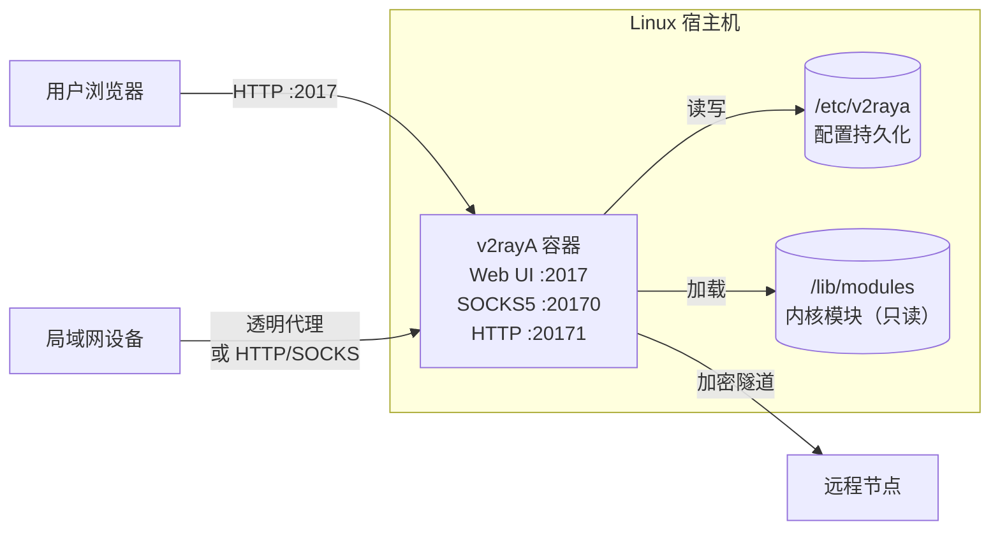
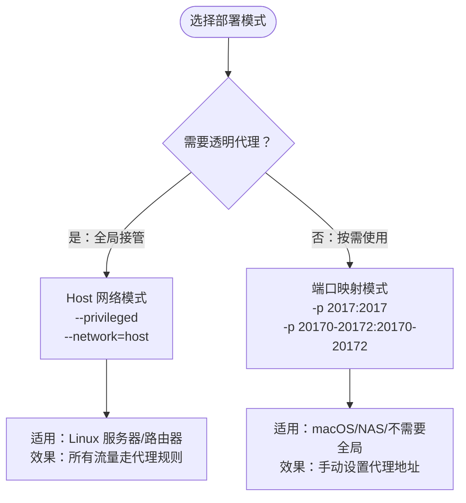

# 使用 Docker 部署 v2rayA：浏览器管理代理规则的最简方案

在 Linux 服务器或 NAS 上配置代理，最麻烦的不是安装某个核心程序，而是手写那堆 JSON 配置——路由规则、分流策略、订阅更新，每改一行都得重启进程确认效果。v2rayA 用一个 Web 面板把这些操作图形化了，跑在 Docker 里不到 40MB，改配置所见即所得。

这篇覆盖两种 Docker 部署方式：透明代理模式（全局接管流量）和端口转发模式（按需使用），附带 Docker Compose 配置和国内镜像拉取方案。

## 项目速览

| 项目 | 内容 |
|---|---|
| 项目名称 | v2rayA |
| 官方地址 | [v2raya.org](https://v2raya.org) |
| GitHub | [v2rayA/v2rayA](https://github.com/v2rayA/v2rayA) |
| Docker 镜像 | `mzz2017/v2raya` |
| 开源协议 | AGPL-3.0 |
| Web 管理端口 | 2017 |
| 代理端口 | 20170（SOCKS5）、20171（HTTP）、20172（带分流的 HTTP） |
| 配置目录 | `/etc/v2raya` |
| 镜像大小 | ~38MB |
| 支持架构 | amd64 / arm64 |

## 为什么用 v2rayA 而不是直接装 v2ray

- **配置门槛**：v2ray/xray 要手写 JSON 路由规则，v2rayA 提供点选界面，导入订阅链接即可用
- **协议覆盖**：兼容 VMess、VLESS、Shadowsocks、ShadowsocksR、Trojan、Tuic、Juicity，不需要为不同协议装不同客户端
- **透明代理**：Linux 下可接管整机流量，局域网设备无需单独配置——路由器、NAS 场景尤其实用
- **不适合的场景**：如果你需要精细到每条规则都可编程控制，或需要 Kubernetes 级别的流量管理，v2rayA 的 GUI 抽象层会限制你

## 架构分析

v2rayA 是单容器应用，内部集成了 xray-core（默认）或 v2ray-core，无外部数据库依赖。所有配置、订阅、规则存储在 `/etc/v2raya` 目录的文件中。

### 部署架构图



### 两种运行模式对比



## 部署前准备

### 服务器要求

| 项目 | 最低要求 | 推荐配置 |
|---|---|---|
| 系统 | Linux（内核 ≥ 4.15） | Debian 11+ / Ubuntu 20.04+ |
| CPU | 1 核 | 1 核（代理不吃 CPU） |
| 内存 | 64MB | 128MB |
| 磁盘 | 100MB | 200MB |
| 端口 | 2017, 20170-20172 | - |

> macOS 和 Windows 用户也能跑，但无法使用透明代理功能，只能用端口转发模式。

### 安装 Docker

```bash
docker --version
docker compose version
```

没装？一条命令搞定：

```bash
curl -fsSL https://get.docker.com | sh
systemctl enable --now docker
```

### 国内镜像加速

拉取 `mzz2017/v2raya` 如果超时，三种解决方案：

**方案一：配置镜像加速器**

编辑 `/etc/docker/daemon.json`：
```json
{
  "registry-mirrors": [
    "https://你的加速器地址"
  ]
}
```
```bash
systemctl daemon-reload && systemctl restart docker
```

可用加速器来源：阿里云容器镜像服务（个人实例免费）、各大云厂商提供的 mirror。

**方案二：替换镜像前缀**

部分三方 mirror 支持前缀替换：
```bash
docker pull mirror.example.com/mzz2017/v2raya
docker tag mirror.example.com/mzz2017/v2raya mzz2017/v2raya
```

**方案三：离线导入**

在能访问外网的机器上导出镜像文件，传到目标机器：
```bash
# 外网机器
docker pull mzz2017/v2raya
docker save mzz2017/v2raya -o v2raya.tar

# 目标机器
docker load -i v2raya.tar
```

## Docker 快速部署

### 模式一：透明代理（Linux 全局接管）

这是 v2rayA 的核心能力——容器接管宿主机的 iptables/nftables 规则，让所有出站流量经过代理。

```bash
docker run -d \
  --restart=always \
  --privileged \
  --network=host \
  --name v2raya \
  -e V2RAYA_LOG_FILE=/tmp/v2raya.log \
  -e V2RAYA_V2RAY_BIN=/usr/local/bin/xray \
  -e V2RAYA_NFTABLES_SUPPORT=off \
  -e IPTABLES_MODE=legacy \
  -v /lib/modules:/lib/modules:ro \
  -v /etc/resolv.conf:/etc/resolv.conf \
  -v /etc/v2raya:/etc/v2raya \
  mzz2017/v2raya
```

参数说明：
- `--privileged`：容器需要操作宿主机网络栈（iptables 规则注入），必须特权模式
- `--network=host`：使用宿主机网络命名空间，不做端口映射
- `V2RAYA_V2RAY_BIN`：容器内预装了 v2ray 和 xray，默认用 xray
- `V2RAYA_NFTABLES_SUPPORT`：宿主机用 nftables 就设 `on`，用 iptables-legacy 设 `off`
- `IPTABLES_MODE`：`legacy` 对应传统 iptables，`nftables` 对应 nft 后端
- `/lib/modules:ro`：只读挂载内核模块目录，iptables 需要加载内核模块
- `/etc/v2raya`：配置持久化目录，容器重建后数据不丢

**怎么判断宿主机用 nftables 还是 iptables？**

```bash
# 有输出说明用了 nftables
nft list ruleset 2>/dev/null | head -5

# 或者检查 iptables 是哪个后端
iptables --version
# 输出含 "nf_tables" → 设 IPTABLES_MODE=nftables
# 输出含 "legacy"    → 设 IPTABLES_MODE=legacy
```

### 模式二：端口转发（macOS / 不需要全局代理）

不用特权模式，不用 host 网络，代理端口映射到宿主机：

```bash
docker run -d \
  --restart=always \
  --name v2raya \
  -p 2017:2017 \
  -p 20170-20172:20170-20172 \
  -e V2RAYA_LOG_FILE=/tmp/v2raya.log \
  -e V2RAYA_V2RAY_BIN=/usr/local/bin/xray \
  -v /etc/v2raya:/etc/v2raya \
  mzz2017/v2raya
```

这种模式下：
- 2017 端口提供 Web 管理面板
- 20170 端口提供 SOCKS5 代理
- 20171 端口提供 HTTP 代理
- 应用程序需要手动设置代理地址为 `服务器IP:20170` 或 `服务器IP:20171`

验证容器运行状态：
```bash
docker ps | grep v2raya
docker logs v2raya --tail 20
```

浏览器打开 `http://服务器IP:2017`，看到注册页面说明部署成功。

## Docker Compose 部署

Compose 的好处：配置文件集中管理，一行命令启停，方便备份迁移。

### 创建项目目录

```bash
mkdir -p /opt/v2raya
cd /opt/v2raya
```

### 编写环境变量

创建 `.env` 文件：
```env
# v2rayA 配置
V2RAYA_VERSION=latest
V2RAYA_LOG_FILE=/tmp/v2raya.log
V2RAYA_V2RAY_BIN=/usr/local/bin/xray

# 透明代理模式设置（端口转发模式可忽略这两项）
NFTABLES_SUPPORT=off
IPTABLES_MODE=legacy
```

### Compose 文件（透明代理模式）

创建 `docker-compose.yml`：
```yaml
services:
  v2raya:
    image: mzz2017/v2raya:${V2RAYA_VERSION}
    container_name: v2raya
    restart: always
    privileged: true
    network_mode: host
    environment:
      - V2RAYA_LOG_FILE=${V2RAYA_LOG_FILE}
      - V2RAYA_V2RAY_BIN=${V2RAYA_V2RAY_BIN}
      - V2RAYA_NFTABLES_SUPPORT=${NFTABLES_SUPPORT}
      - IPTABLES_MODE=${IPTABLES_MODE}
    volumes:
      - /lib/modules:/lib/modules:ro
      - /etc/resolv.conf:/etc/resolv.conf
      - ./config:/etc/v2raya
```

### Compose 文件（端口转发模式）

```yaml
services:
  v2raya:
    image: mzz2017/v2raya:${V2RAYA_VERSION}
    container_name: v2raya
    restart: always
    ports:
      - "2017:2017"
      - "20170-20172:20170-20172"
    environment:
      - V2RAYA_LOG_FILE=${V2RAYA_LOG_FILE}
      - V2RAYA_V2RAY_BIN=${V2RAYA_V2RAY_BIN}
    volumes:
      - ./config:/etc/v2raya
```

### 启动服务

```bash
docker compose up -d
docker compose logs -f
```

## 首次配置

1. 浏览器打开 `http://服务器IP:2017`
2. 首次访问会要求创建管理员账号——设置用户名和密码
3. 进入主界面后，点击右上角「导入」，粘贴订阅链接
4. 等待节点列表刷新完毕，选中一个节点
5. 左上角点击「启动」按钮

如果使用透明代理模式：
- 「设置」→「透明代理」中选择规则模式（大陆白名单 / GFWList / 全局）
- 启动后整机流量自动走代理，无需额外配置

如果使用端口转发模式：
- 在需要代理的应用中设置 SOCKS5 代理为 `服务器IP:20170`
- 或者设置 HTTP 代理为 `服务器IP:20171`

## 日常管理

| 操作 | 命令 |
|---|---|
| 查看运行状态 | `docker compose ps` |
| 实时日志 | `docker compose logs -f` |
| 重启 | `docker compose restart` |
| 停止 | `docker compose stop` |
| 进入容器调试 | `docker compose exec v2raya sh` |

### 数据备份

v2rayA 的所有数据都在 `./config`（映射的 `/etc/v2raya`）目录中：

```bash
tar -czvf v2raya-backup-$(date +%F).tar.gz \
  ./config ./.env ./docker-compose.yml
```

### 重置管理员密码

如果忘记密码，用环境变量重置：
```bash
docker run --rm \
  -v /opt/v2raya/config:/etc/v2raya \
  -e V2RAYA_RESET_PASSWORD=NEW_PASSWORD \
  mzz2017/v2raya
```

重置后删掉这个环境变量，正常启动容器即可。

## 更新升级

```bash
cd /opt/v2raya

# 更新前备份
tar -czvf v2raya-pre-update-$(date +%F).tar.gz ./config ./.env

# 拉取最新镜像
docker compose pull

# 重启容器（配置自动保留）
docker compose down && docker compose up -d

# 确认版本和运行状态
docker compose logs --tail 5
```

## 卸载清理

```bash
cd /opt/v2raya

# 如果开了透明代理，先在 Web 面板中点「停止」，让 iptables 规则清除
# 然后停止并删除容器
docker compose down

# 删除数据（不可恢复）
rm -rf /opt/v2raya

# 清理镜像
docker rmi mzz2017/v2raya
```

> 透明代理模式下，如果直接删容器不先在面板停止服务，iptables 规则可能残留，导致网络不通。兜底方案：`iptables -F` 清空所有规则（生产环境慎用）。

## 常见问题

### 容器启动后 Web 面板打不开

```bash
docker logs v2raya --tail 30
```
常见原因：
- 端口 2017 被占用 → `lsof -i :2017` 检查
- 使用 host 模式但防火墙拦了 2017 → `ufw allow 2017` 或 `firewall-cmd --add-port=2017/tcp`

### 透明代理开启后宿主机断网

说明 iptables 规则生效了但节点不通。在 Web 面板中：
1. 先点「停止」关闭透明代理
2. 检查节点是否可达（ping / tcping）
3. 切换到另一个节点再启动

如果面板也进不去（因为网络断了），用本机直接操作：
```bash
docker exec v2raya /bin/sh -c "v2raya --reset-iptables"
# 或者暴力清空
iptables -F && iptables -t nat -F && iptables -t mangle -F
```

### nftables 与 iptables 模式选错

症状：透明代理启动报错 `iptables: command not found` 或规则不生效。

```bash
# 确认系统使用哪种
cat /etc/alternatives/iptables 2>/dev/null
iptables --version
```

在 `.env` 中对应调整 `NFTABLES_SUPPORT` 和 `IPTABLES_MODE`。

### ARM 设备（树莓派等）运行

`mzz2017/v2raya` 镜像支持 arm64，Docker 会自动拉取正确架构的镜像。armv7（32位 ARM）不支持，需要自行编译。

## 总结

- Docker 部署 v2rayA 的核心价值：一个容器替代 v2ray-core + 配置文件手动管理 + systemd 服务编排
- 透明代理模式用 `--privileged` + `--network=host`，端口转发模式用 `-p` 映射
- 配置持久化挂载 `/etc/v2raya`，容器随便重建不丢数据
- 国内环境拉镜像超时用离线导入最稳

<!-- IMAGE_PROMPT: gpt-image2
为「使用 Docker 部署 v2rayA」技术教程文章设计封面图。
画面元素：左侧 Docker 鲸鱼与容器图形，中心一个发光的网络节点拓扑（代表代理路由），右侧一台服务器终端屏幕显示 Web 面板轮廓。底部有简约命令行。
视觉风格：现代极简技术插画，16:9 画幅，主色 #2496ED（Docker 蓝），辅色 #7C3AED（紫色代表网络隧道），浅灰背景，等距 2.5D 视角，无文字。
-->
