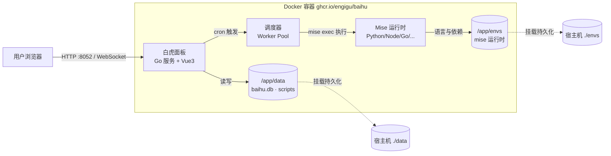
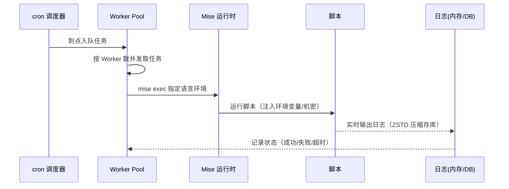

# 用 Docker 部署白虎面板：一个把 CPU 占用压下来的轻量定时任务面板

如果你用过青龙面板跑签到、监控脚本，大概率遇到过这个场景：1C2G 的小机器上，一个每 30 秒跑一次的 Python `requests` 脚本，执行瞬间 CPU 能飙到 50% 以上。白虎面板（Baihu Panel）的作者自己就是青龙用户，嫌它太吃资源，于是用 Go + Vue3 重写了一个——同样的定时场景，CPU 跳变压到了 20% 以内。

下面这套流程覆盖单容器 SQLite 快速起步、GHCR 镜像的国内加速（和拉 Docker Hub 镜像不是一回事，这里有坑）、多语言运行时持久化、可选的 MySQL 多服务方案，以及机密密钥、WebSocket 终端这几个容易翻车的点。

## 项目速览

| 项目 | 内容 |
|---|---|
| 项目名称 | 白虎面板（Baihu Panel） |
| GitHub | [engigu/baihu-panel](https://github.com/engigu/baihu-panel) |
| 技术栈 | Go（后端）+ Vue3（前端）+ Mise（多语言运行时） |
| Docker 镜像 | `ghcr.io/engigu/baihu:latest`（Debian 12，内置 Python 3.13 + Node.js 23） |
| 开源协议 | Apache License 2.0 |
| 默认端口 | 8052 |
| 数据目录 | `/app/data`（数据库+脚本）、`/app/envs`（语言运行时） |
| 数据库 | SQLite（默认）/ MySQL（可选） |

## 为什么选白虎面板

它和青龙面板算是同一个赛道，定位很明确：给资源有限的机器用。几个具体的判断点：

- **资源占用**是它最大的卖点。青龙基于 Node.js，白虎用 Go 编译成单二进制，同样负载下 CPU 和内存都更省。1C1G 的小鸡跑它比跑青龙舒服。
- **多语言不是靠堆镜像**，而是集成了 Mise 运行时管理器——Python、Node.js、Go、Rust、PHP 等主流语言都能在面板里点几下动态安装、多版本切换，依赖统一管理。
- **兼容青龙仓库格式**，如果你手头有青龙的脚本仓库，能直接按青龙命令格式导入，解析脚本注释里的 cron 和环境变量自动建任务，迁移成本低。

要说短板也有：白虎是个人业余项目，生态和社区脚本积累远不如青龙丰富，README 里作者自己也标了"按原样提供"的免责声明。如果你要的是海量现成脚本和成熟社区支持，青龙仍然是更稳的选择；如果你要的是省资源 + 自己维护脚本，白虎更合适。

## 架构分析

白虎默认是个纯单容器应用。一个 Go 二进制里跑着 Web 服务（前端 + API + WebSocket 终端）和 cron 调度器，数据默认落 SQLite。真正有意思的是它的运行时层：容器启动时 `docker-entrypoint.sh` 会把 Mise 环境同步到 `/app/envs`，之后你在面板里装的每一门语言、每一个依赖都存在这个目录——只要挂出来，升级重启都不用重装。

### 部署架构图



### 任务执行流程



## 部署前准备

### 服务器要求

白虎本体很省，但要留意：如果你打算装多门语言运行时，`/app/envs` 目录会随语言数量增长。

| 项目 | 最低要求 | 推荐配置 |
|---|---|---|
| 系统 | 支持 Docker 的 Linux（不支持 Alpine 镜像，见下方说明） | Ubuntu 22.04 / Debian 12 |
| CPU | 1 核 | 1-2 核（白虎本身就是为低配设计的） |
| 内存 | 512 MB | 1 GB |
| 磁盘 | 2 GB | 5 GB+（装的语言越多占越多） |
| 端口 | 8052 | - |

### 镜像标签怎么选

官方给了三个标签，选之前先想清楚：

| 标签 | 基础镜像 | 适合谁 |
|---|---|---|
| `latest` | Debian 12 | 默认推荐，内置 Python 3.13 + Node.js 23，装完就能跑 py/js 脚本 |
| `latest-debian13` | Debian 13 | 想尝鲜 Trixie 的人 |
| `latest-minimal` | Debian 13 | 只要 Mise 底座、语言全部自己装，追求最小体积 |

大多数人用 `latest` 就对了。有个硬限制要记住：**白虎不再提供 Alpine 镜像**——因为 Mise 依赖 glibc，在 Alpine 的 musl 上跑不起来。所以别去找 alpine 标签，没有。

### 安装 Docker

```bash
docker --version
docker compose version
```

没装的话用官方脚本：`curl -fsSL https://get.docker.com | sh`。

### 国内镜像加速（GHCR 镜像，和 Docker Hub 不一样）

这里是白虎和大多数教程不同的地方：它的镜像托管在 **GitHub Container Registry（ghcr.io）**，不是 Docker Hub。这带来一个必须知道的坑——

> ⚠️ 平时配 `/etc/docker/daemon.json` 里的 `registry-mirrors` **只对 docker.io（Docker Hub）生效，对 ghcr.io 无效**。所以拉白虎镜像超时，配那个加速器是没用的，只能用"替换前缀"的方式换成支持 GHCR 的镜像源。

**方式一：替换前缀，用支持 GHCR 的镜像源（推荐）**

```bash
# DaoCloud 的 GHCR 镜像（把 ghcr.io 换成 ghcr.m.daocloud.io）
docker pull ghcr.m.daocloud.io/engigu/baihu:latest

# 南京大学镜像站（同样支持 ghcr）
docker pull ghcr.nju.edu.cn/engigu/baihu:latest
```

拉下来后打回原始 tag，写 compose 时就能用回官方镜像名：

```bash
docker tag ghcr.m.daocloud.io/engigu/baihu:latest ghcr.io/engigu/baihu:latest
```

**方式二：离线导入（完全无外网时）**

```bash
# 在能访问 ghcr 的机器上导出
docker save ghcr.io/engigu/baihu:latest -o baihu.tar
# 拷到目标机器导入
docker load -i baihu.tar
```

> 💡 GHCR 镜像源比 Docker Hub 少，上面两个都失败的话，可以试试给 Docker 配 HTTP 代理（`HTTPS_PROXY`）直连 ghcr.io，这对 GHCR 是最稳的兜底。

## Docker 快速部署（SQLite 单容器）

最简单的玩法，一条命令起一个用 SQLite 的白虎，适合个人自用。

```bash
# 建数据目录（data 存库和脚本，envs 存语言运行时）
mkdir -p /opt/baihu/data /opt/baihu/envs

docker run -d \
  --name baihu \
  --restart unless-stopped \
  -p 8052:8052 \
  -v /opt/baihu/data:/app/data \
  -v /opt/baihu/envs:/app/envs \
  -e TZ=Asia/Shanghai \
  -e BH_DB_TYPE=sqlite \
  -e BH_DB_PATH=/app/data/baihu.db \
  -e BAIHU_SECRET_KEY=请改成你自己的一段随机字符串 \
  ghcr.io/engigu/baihu:latest
```

几个关键点：

- `-v /opt/baihu/envs:/app/envs`：**这行别省**。你在面板里装的 Python、Node 版本和第三方依赖全在这里，不挂出来的话容器一重建，装好的环境全没，得重来。
- `-e BAIHU_SECRET_KEY=...`：机密加密密钥，用来加密你存的 Secret（类似 GitHub Secrets）。**这个值只能用环境变量设、不能写配置文件，而且一旦设定就不能改**——改了之后已加密的机密就解不开了。生成一段随机串填进去，记到你的密码管理器里。
- `-e TZ=Asia/Shanghai`：时区，不设的话 cron 触发时间和日志时间会按 UTC 走，容易把定时任务算错。

起来之后先看日志拿密码（下一节说），别急着开浏览器。

## Docker Compose 部署（推荐长期使用）

长期跑用 Compose，配置留档、备份迁移都方便。

### 创建项目目录

```bash
mkdir -p /opt/baihu
cd /opt/baihu
```

### 编写环境变量

创建 `.env`：

```env
# 宿主机映射端口
BH_PORT=8052
# 机密加密密钥：随机生成一段，设定后不要再改
BAIHU_SECRET_KEY=换成你自己生成的随机字符串
```

生成随机密钥可以用 `openssl rand -hex 32`，把输出贴到上面。

### 编写 Compose 文件

创建 `docker-compose.yml`：

```yaml
services:
  baihu:
    image: ghcr.io/engigu/baihu:latest
    container_name: baihu
    restart: unless-stopped
    ports:
      - "${BH_PORT}:8052"
    volumes:
      - ./data:/app/data
      - ./envs:/app/envs
    environment:
      - TZ=Asia/Shanghai
      - BH_SERVER_HOST=0.0.0.0
      - BH_DB_TYPE=sqlite
      - BH_DB_PATH=/app/data/baihu.db
      - BH_DB_TABLE_PREFIX=baihu_
      - BAIHU_SECRET_KEY=${BAIHU_SECRET_KEY}
    logging:
      driver: json-file
      options:
        max-size: "10m"
        max-file: "3"
```

这份配置直接抄了官方推荐的 `logging` 限制——白虎的执行日志虽然不落文件（存内存和 DB），但容器 stdout 日志还是会涨，加上 `max-size` / `max-file` 免得撑爆磁盘。

### 启动服务

```bash
docker compose up -d
docker compose ps
docker compose logs -f
```

## 首次登录：密码在日志里

白虎不用固定默认密码。首次启动会生成一个 12 位随机密码打到日志里，得自己去捞：

```bash
docker compose logs | grep 管理员账号创建成功
```

用户名是 `admin`，密码就是那行日志里打印的随机串。浏览器打开 `http://服务器IP:8052` 登录，进去第一件事就是改密码。

万一日志被刷掉了、密码没记住，进容器用内置 CLI 重置：

```bash
docker compose exec baihu baihu resetpwd
```

进面板后的典型上手路径：「编程语言」页面用 Mise 装好脚本要用的语言版本 →「依赖管理」装 pip/npm 包 →「脚本管理」上传或在线编辑脚本 →「定时任务」写 cron 表达式建任务。

## 进阶：换 MySQL + 多服务部署

个人自用 SQLite 完全够。但如果你要多实例共享数据、或者本来就有 MySQL，白虎支持切到 MySQL——这时就从单容器变成了多服务编排。

先在 MySQL 里建好库：

```sql
CREATE DATABASE baihu CHARACTER SET utf8mb4;
```

然后 Compose 改成连 MySQL（这里用外部已有的 MySQL，只需改环境变量）：

```yaml
services:
  baihu:
    image: ghcr.io/engigu/baihu:latest
    container_name: baihu
    restart: unless-stopped
    ports:
      - "8052:8052"
    volumes:
      - ./data:/app/data
      - ./envs:/app/envs
    environment:
      - TZ=Asia/Shanghai
      - BH_DB_TYPE=mysql
      - BH_DB_HOST=192.168.1.100   # 改成你的 MySQL 地址
      - BH_DB_PORT=3306
      - BH_DB_USER=root
      - BH_DB_PASSWORD=你的MySQL密码
      - BH_DB_NAME=baihu
      - BH_DB_TABLE_PREFIX=baihu_
      - BAIHU_SECRET_KEY=${BAIHU_SECRET_KEY}
```

**注意**：即使用了 MySQL，`/app/data` 和 `/app/envs` 挂载依然要保留——脚本文件和语言运行时不在数据库里，仍然落在这两个目录。

白虎新版已经内置了钉钉、企业微信、飞书、Telegram、Bark 等十几种推送渠道，不再强依赖外部推送服务。旧版那套配合 `message-nest` 消息网关的方案，官方现在只作为"重度企业需要中心化通知网关"的可选参考保留，一般人用不到。

## 反向代理与 HTTPS

挂公网必须上 HTTPS，而且白虎有在线终端功能，走 WebSocket，反代配置里**一定要加 WebSocket 升级头**，否则终端连不上。Nginx 关键配置：

```nginx
map $http_upgrade $connection_upgrade {
    default upgrade;
    ''      close;
}

server {
    listen 443 ssl http2;
    server_name example.com;

    ssl_certificate     /etc/letsencrypt/live/example.com/fullchain.pem;
    ssl_certificate_key /etc/letsencrypt/live/example.com/privkey.pem;

    location / {
        proxy_pass http://127.0.0.1:8052;
        proxy_set_header Host $http_host;
        proxy_set_header X-Real-IP $remote_addr;
        proxy_set_header X-Forwarded-Proto https;

        # 终端功能必需，漏了在线终端就用不了
        proxy_http_version 1.1;
        proxy_set_header Upgrade $http_upgrade;
        proxy_set_header Connection $connection_upgrade;
        proxy_buffering off;
    }
}
```

如果要部署在子路径（比如 `example.com/baihu/`），给容器加 `-e BH_SERVER_URL_PREFIX=/baihu`，Nginx 里 `proxy_pass` 也带上对应路径。

## 日常管理

### 常用命令

| 操作 | 命令 |
|---|---|
| 查看状态 | `docker compose ps` |
| 查看日志 | `docker compose logs -f` |
| 重启服务 | `docker compose restart` |
| 进入容器 | `docker compose exec baihu bash` |
| 重置密码 | `docker compose exec baihu baihu resetpwd` |
| 恢复备份 | `docker compose exec baihu baihu restore <file>.zip` |

### 数据备份

停服务再打包，把 `data`、`envs`、`.env` 一起备份——`.env` 里有 `BAIHU_SECRET_KEY`，丢了机密就解不开了，务必一起存：

```bash
docker compose stop
tar -czvf baihu-backup-$(date +%F).tar.gz ./data ./envs ./.env ./docker-compose.yml
docker compose up -d
```

## 更新升级

```bash
cd /opt/baihu

# 先备份，尤其是 .env 里的密钥
tar -czvf baihu-pre-update-$(date +%F).tar.gz ./data ./envs ./.env

docker compose pull
docker compose up -d
docker compose logs -f
```

一个升级警告要提前知道：**2026.02.13 之后的版本彻底换成了 Mise 动态运行时**，从更早的旧版本升上来，原有的静态 Python/Node 环境数据没法迁移，需要清空 `envs/` 目录让新容器重新初始化，再在面板里重装语言和依赖。如果你是老用户，升级前务必先看官方更新日志。

## 常见问题

### 8052 端口被占用

```bash
lsof -i :8052
# 改 .env 里的 BH_PORT，比如 9052，再 docker compose up -d
```

### 拉镜像一直超时

别配 daemon.json（对 ghcr 无效），用前面的 `ghcr.m.daocloud.io` 前缀替换法拉，或给 Docker 挂代理直连 ghcr。

### 在线终端连不上

多半是反向代理漏了 WebSocket 升级配置，检查 Nginx 的 `Upgrade` / `Connection` 头是否加了。

### 装的语言/依赖重启后没了

检查 `-v ./envs:/app/envs` 挂载是不是漏了。Mise 运行时全在 `/app/envs`，这个挂载缺失，容器重建就得重装所有语言环境。

### 机密（Secret）突然解不开了

大概率是 `BAIHU_SECRET_KEY` 变了。这个密钥设定后不能改，换了值旧的加密机密就全部作废，只能重新录入。

## 生产环境建议

- **HTTPS + WebSocket**：Nginx/Caddy 反代 + Let's Encrypt，记得带 WebSocket 升级头。
- **锁密钥**：`BAIHU_SECRET_KEY` 生成后写进 `.env` 并备份，永远别改。
- **锁版本**：跨大版本升级前读更新日志，Mise 重构这种破坏性变更要格外小心。
- **资源与日志**：Compose 里配 `logging` 限制 + 「系统设置 → 调度设置」调 Worker 数量（默认 4），低配机器可以调小防止并发把内存打满。
- **定期备份**：把备份命令写进 crontab，`data` + `envs` + `.env` 一起打包保留 7 天。

## 下一步做什么

先按单容器 SQLite 把面板跑起来，登录改密码，再去「编程语言」装一个你脚本要用的语言版本、跑通一个测试任务，确认 cron 触发和实时日志都正常。之后把内置推送渠道配上（钉钉或 Bark），这样任务半夜挂了能收到告警。等确认稳定，再套 Nginx 上 HTTPS，把它变成一个能随时访问、还很省资源的私人任务面板。
