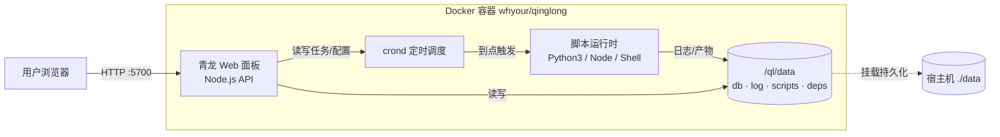
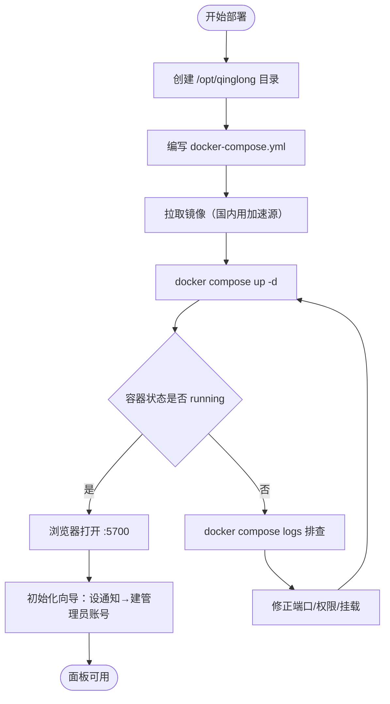

# 用 Docker 搭建青龙面板：10 分钟拥有一个跑脚本的定时任务管家

手上攒了一堆签到、抢券、监控的脚本，散落在本地电脑或云服务器的 crontab 里，改一个环境变量就要 SSH 登录、翻目录、编辑 crontab，出错了还看不到日志。青龙（qinglong）就是来收拾这个烂摊子的——它把定时任务、脚本、环境变量、依赖、日志全搬进一个网页面板，Python3、JavaScript、Shell、TypeScript 四种脚本都能托管。

下面这套流程覆盖 `docker run` 快速起步、Docker Compose 长期维护、国内镜像加速、首次初始化，以及几个容易踩的坑（非 root 运行、镜像选型、数据丢失）。

## 项目速览

| 项目 | 内容 |
|---|---|
| 项目名称 | 青龙（qinglong） |
| GitHub | [whyour/qinglong](https://github.com/whyour/qinglong) |
| Docker 镜像 | `whyour/qinglong:latest`（alpine）/ `whyour/qinglong:debian` |
| 开源协议 | SSPL-1.0 |
| 默认端口 | 5700 |
| 数据目录 | `/ql/data` |
| 数据存储 | SQLite + 文件（无需外部数据库） |
| 推荐部署方式 | Docker Compose |

## 为什么选青龙

青龙脱胎于早期的 crontab-ui，但走得更远。几个实际的判断依据：

- 和裸 `crontab` 比，青龙把任务管理搬到了网页上——改定时规则、看某次执行的完整日志、临时禁用某个任务，都不用再 SSH 进服务器翻文件。
- 和 Jenkins 这类 CI 工具比，青龙更轻。Jenkins 在任务编排、流水线、插件生态上强得多，但对"我只想定时跑几个脚本"这个需求来说太重了，青龙一个容器就够。
- 它的杀手锏是**在线依赖管理**：脚本要用的 Python 包、Node 模块，直接在面板里点几下就装好，不用进容器敲 `pip install`。

如果你要的是企业级的 DAG 编排、任务依赖图、失败重试策略，那该看 Airflow 或 DolphinScheduler；青龙的定位是个人和小团队的脚本托管，别拿它当工作流引擎用。

## 架构分析

青龙是个典型的单容器应用。一个镜像里塞了三部分：一个 Node.js 写的 Web 面板（前端 + API）、一个负责定时触发的 crond 进程、以及承载脚本运行时的 Python3 / Node 环境。数据不依赖外部数据库，全部落在容器内的 `/ql/data` 目录下——只要把这个目录挂出来，容器删了重建数据也不丢。

### 部署架构图



### 容器启动到可用的流程



## 部署前准备

### 服务器要求

青龙很省资源，一台最低配的云服务器就能跑。

| 项目 | 最低要求 | 推荐配置 |
|---|---|---|
| 系统 | 任意支持 Docker 的 Linux（CentOS 7+ / Ubuntu 18.04+ / Debian 10+） | Ubuntu 22.04 |
| CPU | 1 核 | 2 核 |
| 内存 | 512 MB | 1 GB（脚本多、装依赖时更稳） |
| 磁盘 | 2 GB | 5 GB+（依赖和日志会累积） |
| 端口 | 5700 | - |

### 安装 Docker

```bash
# 检查是否已装
docker --version
docker compose version
```

没装的话，官方一键脚本最省事：`curl -fsSL https://get.docker.com | sh`，装完记得 `systemctl enable --now docker`。

### 镜像选型：latest 还是 debian

这是第一个要做的决定，选错了后面会返工：

- `whyour/qinglong:latest`：基于 alpine 构建，体积小、启动快，**默认以 root 运行**。绝大多数人用这个。
- `whyour/qinglong:debian`：基于 debian-slim，体积大一些。如果你的脚本依赖 alpine 装不上的库（比如某些需要 glibc 的二进制），或者你要以非 root 用户运行容器，用它。

有个坑：alpine 镜像的 crond 需要 root 权限，所以 latest 镜像不能用 `--user` 指定非 root 运行。真要非 root 跑，必须换 debian 镜像并加 `--user qinglong`。

### 国内镜像加速

直接拉 `whyour/qinglong` 经常卡在超时。两种解法，先说不用配置的那种。

**方式一：替换镜像前缀直接拉取（推荐，免配置）**

```bash
# whyour/qinglong 是第三方镜像，替换前缀即可
docker pull docker.1ms.run/whyour/qinglong:latest
docker pull docker.m.daocloud.io/whyour/qinglong:latest
docker pull docker.1panel.live/whyour/qinglong:latest
docker pull docker-0.unsee.tech/whyour/qinglong:latest
docker pull hub.rat.dev/whyour/qinglong:latest
docker pull docker.xuanyuan.me/whyour/qinglong:latest
```

拉下来后打个官方 tag，后面写 compose 就能用原始镜像名了：

```bash
docker tag docker.1ms.run/whyour/qinglong:latest whyour/qinglong:latest
```

**方式二：配置 Docker Daemon 加速器（全局生效，适合频繁拉取）**

```bash
sudo mkdir -p /etc/docker
sudo tee /etc/docker/daemon.json <<'EOF'
{
  "registry-mirrors": [
    "https://docker.1ms.run",
    "https://docker.m.daocloud.io",
    "https://docker.1panel.live",
    "https://docker-0.unsee.tech",
    "https://hub.rat.dev",
    "https://docker.xuanyuan.me"
  ]
}
EOF
sudo systemctl daemon-reload
sudo systemctl restart docker
```

配完 `docker pull whyour/qinglong:latest` 就自动走加速了。

**方式三：云厂商专属加速（可选）**

服务器在云上的话，用对应平台的加速更稳：阿里云登录 [cr.console.aliyun.com](https://cr.console.aliyun.com/cn-hangzhou/instances/mirrors) 拿专属地址；腾讯云 CVM 内网直接用 `https://mirror.ccs.tencentyun.com`；华为云在 [SWR 控制台](https://console.huaweicloud.com/swr/) 获取。

> 💡 上面这些公共源会因为维护而临时挂掉，一个不行就换下一个。

## Docker 快速部署

只想先摸一摸面板长什么样，`docker run` 一条命令就够。

```bash
# 创建数据目录
mkdir -p /opt/qinglong/data

# 启动容器
docker run -d \
  --name qinglong \
  --restart unless-stopped \
  -p 5700:5700 \
  -v /opt/qinglong/data:/ql/data \
  whyour/qinglong:latest
```

几个参数的意思：

- `-d`：后台跑，不占着当前终端。
- `--restart unless-stopped`：服务器重启或容器异常退出后自动拉起，但你手动 `stop` 的话不会自作主张重启。
- `-p 5700:5700`：把宿主机的 5700 映射到容器的 5700。左边可以改，比如 `-p 8090:5700` 就用 8090 访问。
- `-v /opt/qinglong/data:/ql/data`：把容器里的 `/ql/data` 挂到宿主机——这行最关键，脚本、任务、依赖、日志全在这里，不挂出来容器一删就全没了。

验证：

```bash
docker ps | grep qinglong
docker logs -f qinglong
```

容器都起来的话，日志末尾会显示服务已监听。浏览器打开 `http://服务器IP:5700`，看到青龙的初始化界面就成了。

## Docker Compose 完整部署

长期用还是上 Compose——配置写在文件里，备份迁移直接拷目录，改端口改版本一目了然。

### 创建项目目录

```bash
mkdir -p /opt/qinglong
cd /opt/qinglong
```

### 编写环境变量

创建 `.env`：

```env
# 镜像版本，别用 latest（下面解释原因）
QL_VERSION=2.19.0
# 宿主机映射端口
QL_PORT=5700
```

这里把版本号单独拎出来，是为了更新时只改一个地方。至于为什么不推荐 `latest`：青龙偶尔会有版本升级后面板结构变动的情况，锁死版本号能保证你哪天 `pull` 到的还是同一个已验证能跑的版本，出问题也好回滚。当前最新稳定版请到 [Releases 页面](https://github.com/whyour/qinglong/releases) 确认后替换。

### 编写 Compose 文件

创建 `docker-compose.yml`：

```yaml
services:
  qinglong:
    image: whyour/qinglong:${QL_VERSION}
    container_name: qinglong
    restart: unless-stopped
    ports:
      - "${QL_PORT}:5700"
    environment:
      # 容器内监听端口，改了上面 5700 映射也要跟着改，一般不动
      - QlPort=5700
    volumes:
      - ./data:/ql/data
    networks:
      - qinglong-net

networks:
  qinglong-net:
    driver: bridge
```

青龙不需要外挂数据库，所以这份 Compose 就一个服务。`QlPort` 是容器内部监听端口，默认 5700，除非你要做二级目录反代，否则保持默认即可。

### 启动服务

```bash
docker compose up -d
docker compose ps
docker compose logs -f
```

浏览器访问 `http://服务器IP:5700`。

## 首次配置

第一次打开面板会进初始化向导，两步：

1. **配置通知方式**：让任务失败时能推消息给你（钉钉、企业微信、Bark、Telegram 等）。这一步可以直接跳过，之后在「系统设置 → 通知设置」里再配。
2. **创建管理员账号**：设置登录用的用户名和密码。青龙没有内置默认账号密码，这里设的就是唯一入口，**记牢，忘了只能进容器改配置文件重置**。

进面板后典型的上手路径是：「订阅管理」拉取脚本仓库 →「定时任务」新建任务并写 cron 表达式 →「环境变量」填脚本要用的 token/cookie →「依赖管理」装脚本需要的 Python/Node 包。

## 日常管理

### 常用命令

| 操作 | 命令 |
|---|---|
| 查看状态 | `docker compose ps` |
| 查看日志 | `docker compose logs -f` |
| 重启服务 | `docker compose restart` |
| 进入容器 | `docker compose exec qinglong bash` |
| 停止服务 | `docker compose stop` |

进容器后可以用青龙内置的 `ql` 命令做批量操作，比如 `ql update` 更新系统、`ql check` 检查修复。

### 数据备份

青龙的数据全在 `./data` 里，备份就是打包这个目录。备份前先停服务，避免 SQLite 正在写入导致文件不一致：

```bash
docker compose stop
tar -czvf qinglong-backup-$(date +%F).tar.gz ./data ./.env ./docker-compose.yml
docker compose up -d
```

迁移到新服务器时，把这个 tar 包拷过去解压，`docker compose up -d` 就能原样恢复，账号、任务、脚本全在。

## 更新升级

```bash
cd /opt/qinglong

# 先备份，别偷懒
tar -czvf qinglong-pre-update-$(date +%F).tar.gz ./data ./.env

# 编辑 .env，把 QL_VERSION 改成新版本号

docker compose pull
docker compose up -d
docker compose logs -f
```

升级后如果面板打不开或任务异常，`.env` 版本号改回旧的，`docker compose up -d` 就回滚了——这就是前面坚持锁版本号的价值。

## 卸载清理

```bash
cd /opt/qinglong
docker compose down

# 删数据，不可恢复，确认没用了再执行
rm -rf /opt/qinglong

# 可选：清理镜像
docker image prune -a
```

## 常见问题

### 端口 5700 被占用

```bash
lsof -i :5700
# 改 .env 里的 QL_PORT 为别的端口，比如 8090，再 docker compose up -d
```

### 容器起来了但面板打不开

先看日志 `docker compose logs -f`。最常见的两个原因：一是云服务器安全组 / 防火墙没放行 5700 端口（在云控制台加入站规则）；二是数据目录权限问题——如果你用了 debian 镜像 + `--user qinglong`，确保宿主机 `./data` 目录对该用户可写。

### 脚本能跑但装依赖失败

依赖装不上多半是网络问题。在「系统设置 → 其他设置」里可以给 pip、npm 配国内源；或者用 debian 镜像，兼容性比 alpine 好。

### 数据没持久化，容器重建后任务全没了

检查 `-v` / `volumes` 挂载是不是漏了或路径写错了。青龙所有数据都在 `/ql/data`，这个挂载一旦缺失，容器删除即数据蒸发。

## 生产环境建议

个人自用单容器就够了，但如果要挂到公网长期跑，补几样：

- **HTTPS + 反向代理**：别把 5700 直接暴露公网。用 Nginx 或 Caddy 反代 + Let's Encrypt 证书，Caddy 一行 `reverse_proxy localhost:5700` 就带自动证书。
- **限制访问**：面板虽然有登录，但公网裸奔仍有风险，可以在反代层加 IP 白名单或 basic auth 做二道锁。
- **定期备份**：把上面的备份命令写进 crontab，每天凌晨打包一次、保留最近 7 天。
- **日志控制**：脚本多了日志会涨，在 Compose 里加 `logging` 驱动限制单文件大小，别让日志撑爆磁盘。

## 下一步做什么

面板起来后，先去「订阅管理」加一个你常用的脚本仓库拉下来跑通一个任务，确认定时触发和日志都正常;然后把通知配上，这样任务半夜挂了你早上能收到消息，而不是等某个签到断了好几天才发现。等熟悉了面板逻辑，再考虑套上 HTTPS 反代把它变成一个能随时随地访问的私人任务中心。
