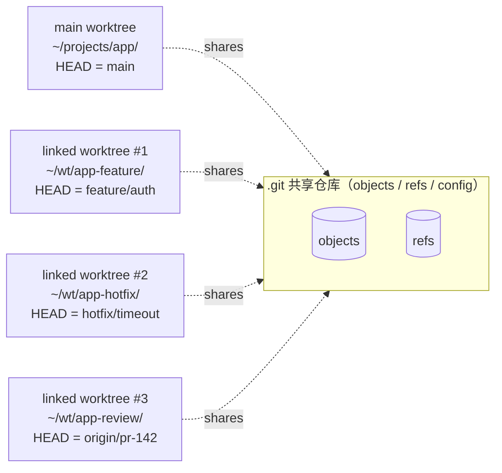
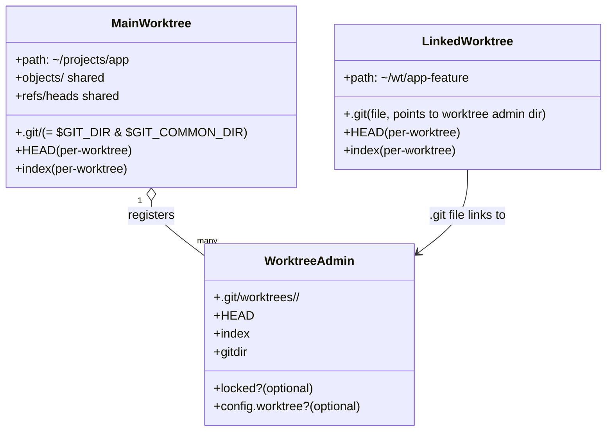
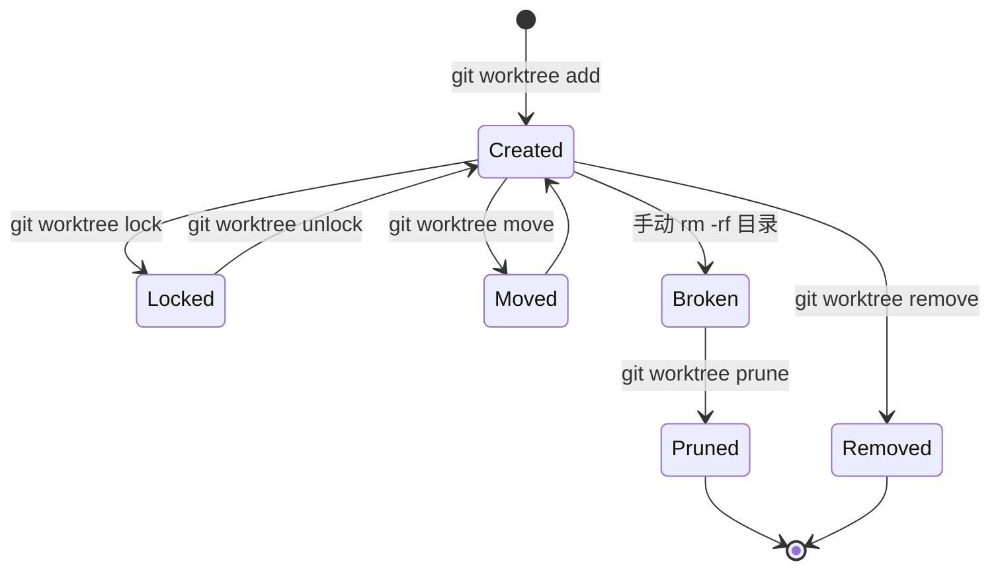
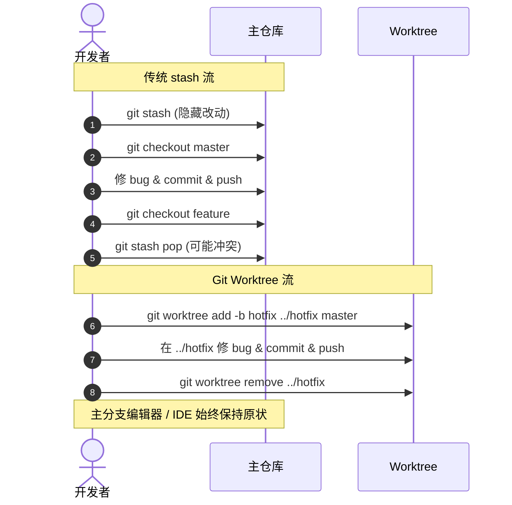
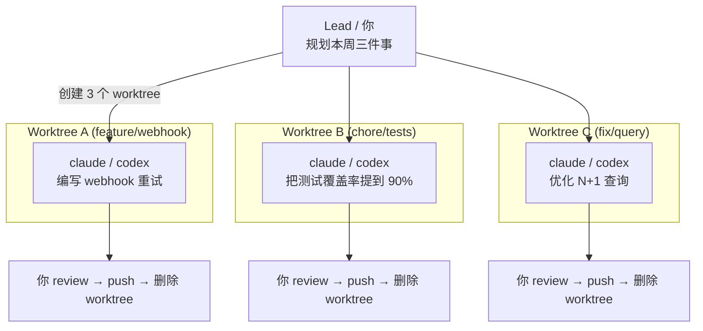

## 引言：一个熟悉的"中断之痛"

下面这个场景，几乎每个开发者都经历过：

> 你正在 `feature/auth` 分支上重构认证模块，编辑器里有十几个文件处于半改未提交的状态，思路正在线上。这时 IM 弹出消息——"线上有个紧急 Bug，麻烦立刻看一下"。你下意识地敲下 `git stash`，切到 `master`，半小时后修完 Bug 切回来，`git stash pop`，结果迎面一堆冲突；更糟的是，你昨晚开着的 Claude Code 正在那个分支上跟你协同改代码，它的上下文也被你这一通操作打散了。

这不是一个孤立的小问题。从 2015 年 Git 2.5 版本引入 worktree 起，它一直只是少数玩家的"小众便利"；但 AI 编程时代的到来，让它从可选项变成了几乎必备的工具。本文围绕几个核心问题展开：什么是 Git Worktree、它的内部原理是什么、日常工作怎么用、AI 编程场景怎么用、以及社区围绕它演化出的工具（如 worktrunk）做了什么。所有命令均通过实测整理，UML 图示采用 Mermaid 语法（Obsidian 原生支持渲染）。

## 一、什么是 Git Worktree

Git Worktree 让一个仓库可以在多个目录中维护多份"工作副本"（working tree）。每个 worktree 各自检出一个分支、各自有独立的工作区、独立的 `HEAD` 和 `index`，但所有 worktree **共享同一份 `.git` 对象库与 ref 数据库**。

可以把它理解为"一份仓库，多个分身"：你不需要重复 clone，也不必占用额外的网络带宽与磁盘空间，每一个 worktree 都是真实的、独立可工作的目录，互不阻塞。



### 1.1 与 git clone / git stash 的横向对比

| 维度 | `git checkout` + `git stash` | 多次 `git clone` | `git worktree` |
| --- | --- | --- | --- |
| 同时开多个分支 | ❌ 同一时刻只能一个 | ✅ 但管理麻烦 | ✅ 体验完美 |
| 切换成本 | 高：stash → pop 容易冲突 | 高：要切目录 + 同步 | 低：换目录即可 |
| 磁盘占用 | 最小 | 最大（每份都是完整历史） | 几乎只多了一份工作区文件 |
| 网络拉取 | 不需要 | 每个仓库都要重新 fetch | 不需要，共享对象库 |
| 依赖目录（如 `node_modules`） | 频繁重装 | 各自重装 | 各自独立缓存，不互相覆盖 |
| AI 智能体隔离 | ❌ 文件状态会被覆盖 | ✅ 但启动慢 | ✅ 启动快、状态干净 |
| 适用场景 | 单任务开发 | 真正完全独立的环境 | 频繁、并行处理多分支 |

### 1.2 主 worktree vs 链接 worktree

Git 把通过 `git init` / `git clone` 创建的"原始工作树"称为 **main worktree**，把后续通过 `git worktree add` 创建的称为 **linked worktree**。一个仓库有且只有一个 main，可以有任意多个 linked。`git worktree remove` 只能移除 linked，不能动 main。

## 二、内部原理：目录布局与 ref 共享

理解原理可以让你在出问题时不至于慌乱。Git 用以下结构落地 worktree：



### 2.1 关键文件

当执行 `git worktree add /path/other/feat next` 时，Git 会：

1. 在主仓库的 `.git/worktrees/feat/` 下创建一个管理目录，存放该 worktree 的 `HEAD`、`index`、`gitdir`（指回工作目录路径），如果命名冲突会自动加数字后缀（如 `feat1`）；
2. 在新目录顶层写一个 `.git` 文件（不是目录），内容是 `gitdir: /path/to/main/.git/worktrees/feat`，让 Git 在该目录运行时能找到真正的仓库；
3. 在 linked worktree 里，`$GIT_DIR` 指向 admin 目录，`$GIT_COMMON_DIR` 指向主仓库的 `.git`，二者共同决定哪些数据是 per-worktree、哪些是共享的。

### 2.2 哪些数据共享、哪些独立

官方文档给出了一条简明规则：

- 所有伪 ref（`HEAD`、`FETCH_HEAD`、`ORIG_HEAD` 等）**per-worktree**；
- 所有 `refs/` 下的 ref **共享**；
- 例外是 `refs/bisect`、`refs/worktree`、`refs/rewritten` —— **per-worktree**。

要访问别的 worktree 的 per-worktree ref，可以用两个特殊路径：

- `main-worktree/HEAD` 表示主 worktree 的 HEAD；
- `worktrees/<name>/HEAD` 表示某个 linked worktree 的 HEAD。

实际使用时通过 `git rev-parse` 或 `git update-ref` 来读写，不要直接去 `.git` 里翻文件。

### 2.3 锁与可移动性

`git worktree lock` 会在 admin 目录下写一个 `locked` 文件，内容是 `--reason` 给出的原因。被锁定的 worktree 不会被 prune、不能被 move、不能被 remove（除非 `-f -f`）。这个特性对放在外置盘 / 网络盘上的 worktree 特别有用。

如果你手动把 linked worktree 目录搬走了，记得回到主 worktree 跑 `git worktree repair`，让 admin 目录里的 `gitdir` 重新指向正确路径；反过来主 worktree 被搬，则要在主目录里跑 `repair`。

## 三、命令全集

一张表先看全貌，再分别讲常用项：

| 子命令 | 说明 |
| --- | --- |
| `add <path> [<commit-ish>]` | 创建 worktree 并检出某个提交 / 分支 |
| `list [-v\|--porcelain [-z]]` | 列出所有 worktree |
| `lock [--reason <text>] <worktree>` | 锁定 worktree，防止被 prune / remove |
| `unlock <worktree>` | 解锁 |
| `move <worktree> <new-path>` | 移动 linked worktree（main 不能用本命令移动） |
| `remove [-f] <worktree>` | 移除 linked worktree（脏状态需 `-f`） |
| `prune [-n] [--expire <time>]` | 清理失效的 admin 目录 |
| `repair [<path>...]` | 修复因手动移动而错乱的链接 |

### 3.1 `add` 的关键选项

`git worktree add` 是最常用、也最容易踩坑的子命令。重点选项：

```bash
# 1) 在已有分支上开新 worktree（最常见）
git worktree add ../app-feat feature/payment

# 2) 创建新分支并放进 worktree（-b 用于"还没存在"的分支）
git worktree add -b feature/new-auth ../app-auth main

# 3) -B 表示"分支已存在就强制重置"，慎用
git worktree add -B exp ../app-exp main

# 4) 不指定 <commit-ish>，Git 会用 basename(path) 当分支名
git worktree add ../hotfix      # 等价于 add -b hotfix ../hotfix （若 hotfix 不存在）

# 5) 拉远端 PR 来 review，免污染主分支
git worktree add ../pr-142 origin/feature/user-dashboard

# 6) 一次性 detached HEAD，不创建分支（实验/对比版本时好用）
git worktree add -d ../bench v1.4.0

# 7) 创建即锁定，避免被自动 prune（移动盘、长期保留场景）
git worktree add --lock --reason "kept on USB" ../release-2024 v1.0.0
```

`add` 还有几条"约束"值得记住：

- **同一分支默认不允许被两个 worktree 同时检出**，要破例需要 `-f`。这是有意为之，避免两个进程（或两个 AI 智能体）同时改一个分支造成混乱。
- 如果 `<commit-ish>` 是分支名但本地不存在、远端恰好有同名 tracking 分支，Git 会自动按 `add --track -b <branch> <path> <remote>/<branch>` 处理；多个远端都存在时可用 `checkout.defaultRemote` 消歧。
- 加 `--guess-remote` 时，省略 `<commit-ish>` 也能让 Git 帮你猜远端分支。

### 3.2 `list` 的输出格式

```bash
$ git worktree list
/Users/me/projects/finpay              a1b2c3d [main]
/Users/me/wt/finpay-webhook            d4e5f6g [feature/webhook-retry]
/Users/me/wt/finpay-hotfix             7891011 (detached HEAD)
/Users/me/wt/finpay-bench              acdf123 (brancha) locked
/Users/me/wt/finpay-stale              5678abc (detached HEAD) prunable
```

加 `-v` 会多一行说明 `locked` 的原因或 `prunable` 的原因；脚本里建议用 `--porcelain` 拿稳定结构。

### 3.3 `remove` / `prune` / `repair` 的边界

- `remove` 要求 worktree 干净（无未跟踪、无未提交），否则用 `-f`；如果该 worktree 被 lock，则需要 `-f -f`。
- 如果你直接 `rm -rf` 删了目录，admin 目录里的 `gitdir` 会变成"指向不存在的位置"，下一次 `git worktree list` 会标记 `prunable`，运行 `git worktree prune` 即可清理。`gc.worktreePruneExpire` 控制自动清理的时间窗口（默认 3 个月）。
- `repair` 是当你手动搬过目录后救场用的工具，主目录搬要在主目录里跑、linked 搬要在 linked 里跑。

## 四、Worktree 生命周期

下面这张状态图描述了一个 worktree 从生到死的全过程，对应到我们日常运维它的命令：



把生命周期记在心里，是写自动化脚本的前提——你需要知道在什么状态下该跑什么命令。

## 五、日常工作中如何使用 Git Worktree

这一节是高频场景的"食谱"，每个场景给出可直接复制的命令片段。

### 5.1 紧急 Hotfix 不打断主开发

最经典的场景，对比传统 stash 流程的差异如下：



落地命令：

```bash
# 在主 worktree 当前目录执行
git worktree add -b hotfix/payment-timeout ../app-hotfix master
cd ../app-hotfix
# ...修 bug、跑测试、提交、推送...
git push -u origin hotfix/payment-timeout
cd -                           # 回到原来正在改的 feature 分支目录
git worktree remove ../app-hotfix
```

整个过程不需要 `stash`，不需要重启编辑器，也不会破坏 feature 分支上未提交的工作。

### 5.2 不影响本地工作地审查同事 PR

```bash
git fetch origin
git worktree add ../app-pr-142 origin/feature/user-dashboard
cd ../app-pr-142
npm ci && npm test           # 安装依赖、跑测试都在新目录里进行
# 审查完毕
cd -
git worktree remove ../app-pr-142
```

主 worktree 的 `node_modules`、构建产物、IDE 索引都没有被污染。

### 5.3 长跑测试 + 并行修复

你跑一个 1 小时的集成测试，期间不想动工作区。再 `git worktree add ../app-fix bugfix-x`，去新目录改代码就行——主目录的测试管道、tail 着的日志全程不打扰。

### 5.4 多版本维护

一个产品同时维护 `release/v1.x`、`release/v2.x`、`main` 三个版本时：

```bash
git worktree add ../app-v1 release/v1.x
git worktree add ../app-v2 release/v2.x
# main 仍然在原目录
```

每个版本一个 IDE 窗口，互不串扰；CI / 灰度发布脚本也可以独立运行。

### 5.5 依赖隔离（前端尤其受益）

前端项目的 `node_modules` 通常被 `.gitignore`，所以频繁切分支会触发反复 `npm install`。worktree 让每个分支拥有自己的 `node_modules`、`.next`、`dist`，从此跟"装依赖装到怀疑人生"说再见。

### 5.6 实验性重构

你想试一个完全推倒重来的方案：

```bash
git worktree add -b experiment/repository-pattern ../app-exp main
cd ../app-exp
# 放手做大改动
# 成功 → push、merge；失败 → 一键销毁，主分支毫发无损
git worktree remove --force ../app-exp
git branch -D experiment/repository-pattern
```

worktree 把"实验代价"压缩到几乎为零。

### 5.7 Shell 别名让一切提速

如果你每天都用，可以把如下别名加进 `~/.zshrc` / `~/.bashrc`：

```bash
alias gwl='git worktree list'

# gwt <branch> —— 基于当前 main 创建并切入新 worktree
gwt() {
  local branch=$1
  local dir_name=$(echo "$branch" | sed 's|/|-|g')
  local repo_name=$(basename "$(git rev-parse --show-toplevel)")
  local target=~/wt/${repo_name}-${dir_name}
  git worktree add "$target" -b "$branch" main && cd "$target"
}

# gwr <branch> —— 移除某分支对应的 worktree
gwr() {
  local branch=$1
  local dir_name=$(echo "$branch" | sed 's|/|-|g')
  local repo_name=$(basename "$(git rev-parse --show-toplevel)")
  git worktree remove ~/wt/${repo_name}-${dir_name}
}
```

之后 `gwt feature/payment` 一条命令即可"换房间"。

## 六、AI 编程时代为什么 worktree 变得不可或缺

过去十年里，worktree 一直是"会用但不必用"的工具。2025 年开始，它变成了"几乎必备"。原因可以归纳为三条：

**1) AI 智能体需要独占文件系统**。Claude Code、Codex、Cursor、Copilot Workspace 这类工具的工作方式是"读取文件构建上下文 → 推理 → 写回改动"。两个智能体在同一个目录里同时跑，势必出现：

```
reviewer  → read app.py（看到版本 A）
developer → edit app.py（改成版本 B）
reviewer  → edit app.py 时 old_string=版本A  →  ❌ 找不到匹配 → 失败
```

或者更糟，两个智能体先后 `write_file` 同一个文件，后写的直接覆盖前写的，数据无声丢失。这本质上是"多 Agent 文件冲突"，跟一群人不开分支直接往 `main` 上 push 没有区别。**给每个智能体一个独立的 worktree（独立分支），冲突就从"编辑时互相覆盖"延迟到"merge 时显式解决"。**

**2) 上下文质量决定输出质量**。如果你的工作区里到处是半成品函数、调试 `console.log`、临时注释，AI 看到的就是一片混乱。一个新建的 worktree 是干净的、明确的——它精确呈现"这条分支当前的样子"，AI 才能基于一致的事实推理。

**3) 瓶颈从打字速度变成并行度**。AI 把 30 分钟的编码工作压到 2 分钟时，限制产出的就不是手速，而是"你能同时编排多少任务"。worktree 打破了单工作区的并发上限。

### 6.1 工作流：并行运行 N 个 AI 智能体



落地命令：

```bash
# 1. 设置 worktree
cd ~/projects/finpay
git worktree add -b feature/webhook-retry  ~/wt/finpay-webhook main
git worktree add -b chore/expand-tests     ~/wt/finpay-tests   main
git worktree add -b fix/query-optimization ~/wt/finpay-perf    main

# 2. 三个终端分别启动智能体
# Terminal 1
cd ~/wt/finpay-webhook && claude "为失败的支付通知实现带指数退避的 webhook 重试机制"
# Terminal 2
cd ~/wt/finpay-tests   && claude "将支付服务模块的测试覆盖率提升到 90%"
# Terminal 3
cd ~/wt/finpay-perf    && codex  "优化交易仪表盘接口中的 N+1 查询"

# 3. 谁先完成就先 review、push、删除
```

> 把三天的串行流水线，压缩成半天的并行冲刺。

### 6.2 tmux + worktree 的组合拳

一个终端窗口同时盯三个智能体的进度：

```bash
tmux new-session  -s ai-work -c ~/wt/finpay-webhook
tmux split-window -h         -c ~/wt/finpay-tests     # 水平分屏
tmux split-window -v         -c ~/wt/finpay-perf      # 在右侧再垂直分屏
```

或者直接借助 VS Code "多根工作区"功能：把多个 worktree 目录拖进一个工作区文件，资源管理器里每个 worktree 就是一个顶级文件夹，跨 worktree 搜索、对比都很方便。

### 6.3 Claude Code 的原生 worktree 支持

Claude Code（以及 Codex 的部分版本）已经把 worktree 内置成了一等公民，几个亮点：

- **`--worktree` / `-w` 启动标志**：`claude -w "实现 webhook 重试"` 一条命令完成"创建 worktree + 切目录 + 启动智能体"。
- **子智能体 worktree 隔离**：主智能体在做规划，把具体任务分发给 subagent，每个 subagent 在临时 worktree 里独立工作，完成后把 diff 汇报回主对话——你甚至不必手动开多个终端。
- **桌面端"+新会话"自动 worktree**：默认存放在 `<repo>/.claude/worktrees/`，可在设置里改路径、改分支前缀，归档时一键清理。
- **Agent Teams（实验特性）**：通过 `CLAUDE_CODE_EXPERIMENTAL_AGENT_TEAMS=1` 启用，一个 leader 协调多个 subagent，互相通信、汇总结果——本质上就是把 5.1 的并行编排做进 SDK 里。

### 6.4 多智能体"工作隔离"的工程化

如果你像 miniagent / Hermes / Devix 那样自己实现一个多智能体框架，worktree 是天然的"执行面"基础设施。一个简化的设计：

```text
.tasks/        ← 控制面：每个任务一个 JSON（目标、状态、归属）
.worktrees/    ← 执行面：每个任务一个 git worktree
events.jsonl   ← 生命周期事件审计：created / locked / removed
```

每个 worktree 一个分支，命名形如 `task-{task_id}`；leader 在分配任务时 `worktree add`，完成后 `worktree remove --force`（保留分支用于 review）；冲突全部留到 `git merge` 阶段统一解决。这种"控制面 / 执行面"分离的思路，正是工业级多智能体系统在做的事。

## 七、worktrunk：把 worktree 包装成 AI 时代的开发壳

[max-sixty/worktrunk](https://github.com/max-sixty/worktrunk) 是社区里围绕 worktree 演化出的一个 CLI 工具（Rust 实现），定位是"为并行运行 AI 智能体打造的 worktree 管理器"。作者吐槽 Git 原生 worktree 操作太啰嗦——"新建一个 worktree 要把分支名敲三次"——于是把"按分支名寻址，路径自动模板生成"做成了核心抽象。

### 7.1 命令对照

| 任务 | Worktrunk | 原生 git |
| --- | --- | --- |
| 切到分支 / worktree | `wt switch feat` | `cd ../repo.feat` |
| 新建 + 启动 Claude | `wt switch -c -x claude feat` | `git worktree add -b feat ../repo.feat && cd ../repo.feat && claude` |
| 清理 | `wt remove` | `cd ../repo && git worktree remove ../repo.feat && git branch -d feat` |
| 列出（带状态） | `wt list` | `git worktree list`（只有路径） |

`wt list` 的输出会用一组短符号显示状态：`@` 当前 worktree、`+` 有暂存改动、`↑1` 领先 main 1 个提交、`⇡` 有未推送提交。

### 7.2 与 AI 智能体的天作之合

并行启动三个 Claude，每个负责一件事：

```bash
wt switch -x claude -c feature-a -- 'Add user authentication'
wt switch -x claude -c feature-b -- 'Fix the pagination bug'
wt switch -x claude -c feature-c -- 'Write tests for the API'
```

`-x` 表示切换后运行的命令，`--` 之后的参数会原样传给该命令。

### 7.3 工程化能力

worktrunk 在原始 worktree 之上叠了一层"工作流自动化"：

- **Hooks**：在 create / pre-merge / post-merge 等节点跑自定义命令；
- **LLM commit messages**：用大模型基于 diff 自动写 commit message；
- **`wt merge main`**：一条命令完成 squash → rebase → fast-forward merge → 清理；
- **Copy build caches**：在 worktree 间共享 `target/` / `node_modules/`，避免冷启动；
- **`wt list --full`**：每个分支展示 CI 状态 + LLM 生成的摘要；
- **PR checkout**：`wt switch pr:123` 直接切到 PR 分支；
- **每 worktree 唯一 dev server 端口**：`hash_port` 模板过滤器为每个 worktree 分配独立端口，多个本地开发服务并行不打架；
- **Aliases & per-branch variables**：自定义 `wt <name>` 命令、分支级状态变量供 hook 模板使用。

安装很简单（macOS）：

```bash
brew install worktrunk
wt config shell install   # 必须，安装 shell 集成才能在切换时改变当前 shell 的目录
```

如果你已经习惯用 git worktree 但觉得每天敲的命令太长，worktrunk 是一个值得一试的"瑞士军刀"；如果你只是偶尔用，原生命令足矣。

## 八、注意事项与陷阱

把容易踩坑的地方集中列一下，避免你重复趟雷：

- **`git stash` 是全局的**。在一个 worktree 里 stash，所有 worktree 都能看到这条 stash。最佳实践：在 worktree 中要么 commit 要么 discard，**不要依赖 stash 做隔离**。
- **同一分支默认只能被一个 worktree 检出**。别想着两边同时改 `feature/x`——Git 会拒绝，必要时用 `-f`，但你得自己处理后果。
- **`.git/hooks` 是共享的**。`pre-commit`、`commit-msg` 在每个 worktree 都会跑、跑的是同一份脚本。如果某个 worktree 需要不同的 hook，启用 `extensions.worktreeConfig` 后用 `config.worktree` 单独配置 `core.hooksPath`。
- **不要把 worktree 创建在另一个 worktree 内部**。这会让 Git 误以为它是子模块，行为不可预期。统一放在 `~/wt/` 或 `../wt/` 这种"平级"目录。
- **`gc.worktreePruneExpire` 默认 3 个月**。长期不动的 worktree 如果意外被自动 prune，可以用 `lock` 锁住；想加速清理则手动 `prune`。
- **`extensions.worktreeConfig` 与旧 Git 不兼容**。开了之后，必须用更新的 Git 才能访问该仓库；老同事的工具链跟不上时要注意。
- **多 worktree + 子模块仍是"实验性"**。官方 BUGS 章节明确说不推荐对 superproject 做多 checkout，子模块场景请谨慎。
- **依赖目录不会自动同步**。每个 worktree 是独立的 `node_modules` / `target`，新建后记得各自装一次（或参考 worktrunk 的 `copy_build_caches`）。

## 九、写在最后：从单线程开发到多智能体编排

一年前，绝大多数开发者是单线程工作的——一次一条分支，一次一个上下文。瓶颈就是你那双在键盘上敲字的手。

AI 智能体改变了这条约束。你不再受限于打字速度，而是受限于**你能同时指挥、审查、整合多少任务**。在这个语境下，能脱颖而出的开发者会有一个共同特征：他们学会了编排——同时启动多个智能体，每个智能体有一个干净的上下文、一个独立的分支、一个不会被打扰的工作区，等结果出来再 review、合并、清理。

Git Worktree 早在 AI 之前就存在了，但它的真正用武之地恰恰在这个时代。一句话总结：

> 旧时代用 worktree 是"懒得重新克隆"；新时代用 worktree 是"懒得让智能体互相打架"。

下次再被一个紧急 Bug 打断时，先别 `git stash`——试试 `git worktree add` 或 `claude -w`，你会奇怪自己以前怎么没这么干。

## 参考文档

  - [Git 官方文档：git-worktree](https://git-scm.com/docs/git-worktree)
  - [掘金《git worktree 日常使用教程》](https://juejin.cn/post/7241760513204994103)
  - [腾讯云《Git Worktree 使用详解——分支管理与并行开发最佳实践》](https://cloud.tencent.com/developer/article/2636335)
  - [张小凯的博客《Git Worktree 的使用》](https://jasonkayzk.github.io/2020/05/03/Git-Worktree%E7%9A%84%E4%BD%BF%E7%94%A8/)
  - [max-sixty/worktrunk on GitHub](https://github.com/max-sixty/worktrunk) 与官方站 [worktrunk.dev](https://worktrunk.dev)
