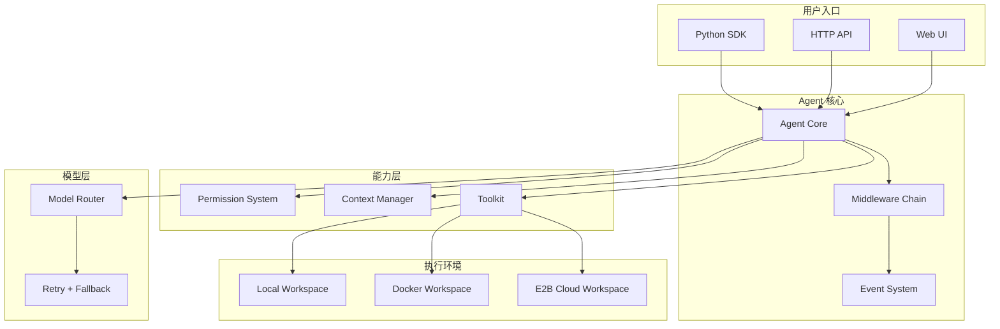
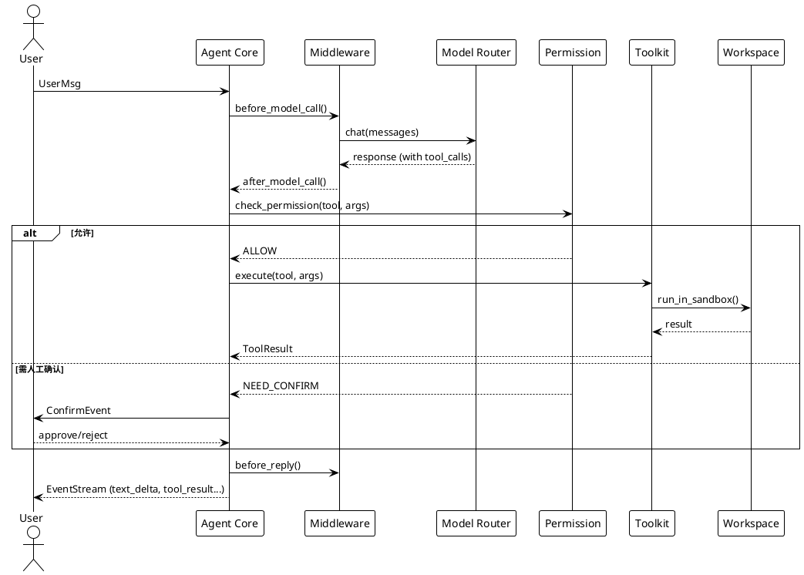

# AgentScope 2.0：阿里开源的 AI Agent 框架，凭什么拿下 17k Star？

> 你写了一个能用工具的 Agent，本地跑得挺好，但一到多用户、长任务、需要权限控制的场景就崩了。模型调用超时没有重试、工具执行没有沙箱、上下文窗口被撑爆——这些问题在 demo 阶段不会暴露，到了生产环境却致命。AgentScope 2.0 就是在解决这一类问题。

## 1. 项目速览

| 项目 | 内容 |
|---|---|
| 项目名称 | AgentScope |
| 一句话定位 | 生产级 AI Agent 开发框架：Build and run agents you can see, understand and trust |
| GitHub 地址 | [agentscope-ai/agentscope](https://github.com/agentscope-ai/agentscope) |
| 官方网站 | https://java.agentscope.io/ |
| 主要语言 | Python（另有 TypeScript / Java 版本） |
| 技术栈 | Python 3.11+、FastAPI、asyncio、uv |
| 开源协议 | Apache 2.0 |
| Star 数 | ⭐ 17.3k+（2026年7月） |
| 最新版本 | 2.0（2026年5月发布） |
| 维护状态 | 活跃（周均多次提交，2026年7月仍有 Release） |
| 适合人群 | 需要把 Agent 跑到生产环境的后端/AI 工程师 |

## 2. 它解决了什么问题

Agent 框架不缺。CrewAI、AutoGen、LangGraph 都能让你在 notebook 里跑通 demo。但 AgentScope 2.0 瞄准的不是"如何写一个 Agent"，而是"如何让 Agent 在生产环境中稳定运行"。

具体来说：

- **模型调用不稳定**：单次超时就中断整个任务链。AgentScope 内置重试 + 备用模型自动切换，开发者配两行参数就能搞定。
- **工具执行无边界**：Agent 能删文件、执行命令，但没有权限控制。AgentScope 的 Permission System 按工具类型、输入内容、目录范围做细粒度判断，高风险操作自动触发人工审批。
- **长任务上下文爆炸**：10 轮工具调用后 token 超限。AgentScope 的上下文管理不只是"截断历史"，而是结构化保留任务状态 + 工具结果截断 + 文件缓存，一套组合策略。

说白了，1.0 教你怎么搭 Agent，2.0 教你怎么把 Agent 当正经服务跑起来。

## 3. 核心功能特性

### 3.1 核心能力

- **Event System（事件系统）**：Agent 的每一步执行——模型调用开始、文本增量、工具调用、用户确认——都以事件流的形式实时输出。前端 UI 可以做到"看着 Agent 思考"，人工介入也不需要额外封装。

- **Permission System（权限系统）**：不是简单的黑白名单。根据静态规则 + 工具类型 + 输入内容三层判断，决定一次调用是放行、拒绝还是交给用户审批。文件读写会检查目录是否越权，命令执行会分析是否有 `rm -rf` 这类高危操作。

- **Workspace（执行环境抽象）**：同一个 Agent 逻辑，可以跑在本地文件系统、Docker 容器或 E2B 云沙箱里。切换环境不需要改 Agent 代码，只换一个 Workspace 后端配置。还内置了预热池，批量初始化环境时不用每次都从头建。

- **Agent Service**：基于 FastAPI 的多租户、多会话服务。Agent 不再只是一个 Python 脚本，而是一个可以被前端/工作流调用的 HTTP 服务。支持会话恢复（中断后继续）、后台任务管理（长耗时工具不阻塞对话）。

### 3.2 特色设计

- **Middleware 机制**：在 Agent 执行的关键节点（模型调用前后、工具执行前、system prompt 构造时）插入自定义逻辑。要加日志追踪、安全审计、业务上下文注入，不用改框架代码。类似 Express/Koa 的中间件思路。
- **多语言支持**：Python 版已是 2.0，TypeScript 版同步推出，Java 版近期跟进。跨语言团队不用各自造轮子。

### 3.3 功能边界

- ✅ 适合：需要多轮工具调用的复杂任务、多用户并发的 Agent 服务、需要权限控制和人工审批的企业场景
- ❌ 不适合：只想快速拼个 demo 发推文（CrewAI 上手更快）、纯 RAG 检索场景（用 LlamaIndex 更直接）
- ⚠️ 使用前确认：Python 3.11+ 硬性要求；目前中文文档集中在官方博客，英文文档在 GitHub docs 目录

<!-- IMAGE_PROMPT: gpt-image2
生成一张「AgentScope 2.0 功能结构全景图」信息图。

布局：
- 顶部标题：AgentScope 2.0 功能结构全景图 + 副标题「生产级 AI Agent 开发框架」
- 左侧输入层：用户请求、API 调用、前端 UI、工作流触发
- 中间核心层：Agent Core（推理循环）、Event System（事件总线）、Permission System（权限判断）、Middleware（中间件链）、Context Manager（上下文管理）、Toolkit（工具集）
- 底部支撑层：Model Layer（Qwen/Claude/GPT + 重试/Fallback）、Workspace（Local/Docker/E2B）、Session Store（会话持久化）
- 右侧输出层：事件流输出、HTTP API 响应、WebSocket 实时推送

视觉风格：
- 现代技术架构图，干净克制，16:9 画幅
- 主色 #3366CC，辅色 #5B8FF9，浅色背景
- 模块间清晰箭头连接，体现从输入到输出的流程
- 中文文字清晰可读，PingFang SC 字体
-->

## 4. 架构设计

### 4.1 整体架构



### 4.2 Agent 执行流（时序）



### 4.3 核心设计思想

- **推理驱动，不是编排驱动**：2.0 的设计哲学是"信任模型的推理能力"，不用硬编码的 DAG 约束 Agent 行为。Agent 自己决定下一步调什么工具，框架只负责提供边界（Permission）和环境（Workspace）。
- **事件流贯穿全链路**：从模型调用到工具执行，所有过程都产出事件。前端实时展示、后端日志记录、人工介入——都建立在同一条事件流上。
- **环境与逻辑解耦**：Agent 的推理逻辑不绑定执行环境。今天跑本地，明天套 Docker，后天换 E2B——只改配置不改代码。

## 5. 社区热点

### 5.1 从 Issues 和社区讨论看

AgentScope 的 Issues 区以功能请求为主（框架还在快速迭代期）。几个值得关注的讨论方向：

- **多模型 Fallback 策略**：社区讨论最活跃的话题之一——不同模型的 function calling 格式不一致，切换备用模型时如何保证工具调用兼容性
- **Workspace 的 Docker 后端稳定性**：容器环境下文件持久化和网络隔离的实际踩坑经验
- **与 MCP 协议的集成**：2.0 的 Workspace 已支持 MCP 服务发现，但社区在讨论如何更优雅地管理大量 MCP Server

### 5.2 社区健康度

- **维护响应**：核心团队来自阿里通义实验室，Issue 响应通常在 1-3 天内
- **Release 节奏**：2.0 发布后几乎每周都有小版本更新（2026-05 到 2026-07）
- **贡献者**：GitHub 显示 40+ contributors
- **文档**：英文 README 覆盖 Quickstart，深度文档在官方网站（java.agentscope.io）；中文技术博客更新及时

## 6. 竞品对比

| 维度 | AgentScope 2.0 | LangGraph | CrewAI | AutoGen |
|---|---|---|---|---|
| 核心定位 | 生产级 Agent 服务框架 | 基于图的 Agent 编排 | 快速搭建多 Agent 协作 | 微软的多 Agent 对话框架 |
| 执行模型 | 推理驱动（模型自主决策） | 显式状态图 | 角色分工 + 顺序/并行 | 对话驱动 |
| 生产能力 | 多租户/多会话/权限/沙箱 | 需要自行封装服务层 | 服务化能力弱 | 需额外部署 |
| 权限控制 | 内置细粒度 Permission | 无 | 无 | 无 |
| 上手成本 | 中（概念多但文档清晰） | 高（状态图思维转换） | 低（角色定义直觉） | 中（配置较多） |
| 适合场景 | 企业级 Agent 服务 | 复杂流程编排 | 快速原型 | 研究/实验 |

说实话，如果只是快速验证一个想法，CrewAI 三行代码就能跑起来。但如果你的 Agent 要跑在多用户环境、需要权限审批、要处理长任务——LangGraph 和 CrewAI 都没有开箱提供这些能力，你得自己造轮子。AgentScope 2.0 的卖点就是把这些"生产细节"内置了。

缺点也明显：概念多（Event/Permission/Middleware/Workspace/Service 一堆抽象），学习曲线比 CrewAI 陡；Python 3.11+ 的硬性要求会卡住一部分用户。

## 7. 快速上手

```bash
# 安装（需要 Python 3.11+）
uv pip install agentscope

# 或者从源码
git clone -b main https://github.com/agentscope-ai/agentscope.git
cd agentscope && uv pip install -e .
```

最小可运行示例：

```python
from agentscope.agent import Agent
from agentscope.tool import Toolkit, Bash, Read, Write
from agentscope.credential import DashScopeCredential
from agentscope.model import DashScopeChatModel
from agentscope.message import UserMsg
import os, asyncio

async def main():
    agent = Agent(
        name="Friday",
        system_prompt="You're a helpful assistant.",
        model=DashScopeChatModel(
            credential=DashScopeCredential(
                api_key=os.environ["DASHSCOPE_API_KEY"]
            ),
            model="qwen3.6-plus",
        ),
        toolkit=Toolkit(tools=[Bash(), Read(), Write()]),
    )
    async for evt in agent.reply_stream(UserMsg("User", "Hello!")):
        print(evt)

asyncio.run(main())
```

运行成功后应该看到：Agent 以事件流形式返回文本增量，终端逐字打印回复内容。

## 8. 项目结构

```text
agentscope/
├── agentscope/             # 核心框架代码
│   ├── agent/              # Agent 基类与实现
│   ├── event/              # 事件系统
│   ├── model/              # 模型接入层（Qwen/Claude/GPT/...）
│   ├── tool/               # 内置工具（Bash/Read/Write/Edit/...）
│   ├── credential/         # 凭证管理
│   ├── middleware/         # 中间件机制
│   ├── permission/         # 权限系统
│   ├── workspace/          # 执行环境抽象
│   ├── message/            # 消息模块（Content Block）
│   └── context/            # 上下文管理
├── examples/               # 示例代码
│   ├── agent_service/      # Agent 服务后端
│   └── web_ui/             # 前端 Web UI
├── docs/                   # 文档
└── tests/                  # 测试
```

### 代码阅读路线

1. 先看 `examples/` 目录跑通一个 Agent，理解使用方式
2. 再看 `agentscope/agent/` 理解 Agent 的推理循环
3. 接着看 `agentscope/event/` 理解事件流如何贯穿全链路
4. 深入 `agentscope/permission/` 和 `agentscope/workspace/` 理解生产能力
5. 扩展开发看 `agentscope/middleware/`

## 9. 部署方式

### 环境要求

| 项目 | 要求 |
|---|---|
| Python | ≥ 3.11 |
| 推荐包管理 | uv |
| 模型 API | DashScope / OpenAI / Anthropic 等（需配 API Key） |
| 可选 | Docker（Workspace 容器后端）、Node.js + pnpm（Web UI） |

### Agent Service 部署

```bash
# 启动后端服务
cd agentscope/examples/agent_service
python main.py

# 启动前端 UI（另开终端）
cd agentscope/examples/web_ui
pnpm install && pnpm dev
```

### 生产注意事项

- 使用固定版本号，别用 `latest`——2.0 迭代很快，接口可能有 breaking change
- Workspace 如果用 Docker 后端，确保容器内网络和文件挂载配置正确
- 配置 Permission 时先用 `bypass` 模式测通逻辑，再逐步收紧权限
- API Key 通过环境变量或 Credential 对象注入，别硬编码

## 10. 社区声量

### 英文社区

YouTube 上已有 AgentScope 2.0 的 first look 视频（标题："AgentScope 2.0: Alibaba's AI Agent Framework with APIs..."），评价以正面为主，重点关注其多租户能力和 Permission 系统。Reddit 和 HackerNews 上暂未发现大规模讨论帖（和 LangGraph/CrewAI 的曝光度有差距）。

### 中文社区

- 知乎专栏有多篇使用教程和入门指南
- CSDN/GitCode 上有"深入浅出 AgentScope 2.0"系列
- 阿里云官方有"5分钟上手 AgentScope"教程
- 2025年3月上过 GitHub Trending 日榜，当日增长 419 Star

中文社区的讨论热度明显高于英文社区，毕竟出自阿里团队，国内开发者是主力用户群。

## 11. 我的判断

### 优缺点速览

| 维度 | 评价 |
|---|---|
| 上手成本 | 中偏高——概念多（Event/Permission/Middleware/Workspace/Service），但每个概念都有明确边界 |
| 功能完整度 | 高——从开发到部署到运维一条线覆盖，不需要额外造轮子 |
| 文档质量 | 中——官方博客写得好，但 API 文档和 examples 还在补充中 |
| 维护活跃度 | 高——阿里通义实验室团队专职维护，2.0 后几乎周周有更新 |
| 扩展能力 | 高——Middleware + Workspace + 多模型路由，扩展点设计清晰 |

### 建议

如果你的场景是"把 Agent 当正经服务跑"——多用户、需要权限控制、工具要跑在沙箱里、任务可能持续几分钟——AgentScope 2.0 值得投入时间学。它把这些生产细节都内置了，不用你自己从 FastAPI + Redis + Docker 一点点拼。

如果你只是想快速验证一个 Agent 想法，或者团队对 Python 3.11+ 有顾虑，CrewAI 或 LangGraph 上手更快。

我的建议是：先跑通 `examples/agent_service`，体验一下完整的前后端交互流程。如果那个体验让你觉得"对，我的项目就需要这些能力"，再深入学 Permission、Middleware、Workspace 这些模块。

---

> 📌 项目地址：https://github.com/agentscope-ai/agentscope
> 👤 作者：agentscope-ai (阿里通义实验室) ｜ 💻 语言：Python ｜ 📜 License：Apache 2.0

<!-- IMAGE_PROMPT: gpt-image2
为 AgentScope (Python AI Agent 框架) 设计封面图。
主题：生产级智能体框架——从 Demo 到 Service 的跨越
风格：现代极简，主色 #3366CC
画面中心：一个半透明的蓝色机器人（Agent）站在生产流水线上，身后是多个并行运转的齿轮（代表多租户/多会话），周围有安全盾牌图标（Permission）和容器图标（Workspace）
右上角：⭐ 17k+ Stars 贴纸徽章
画幅 16:9，适合公众号/博客首图
-->
