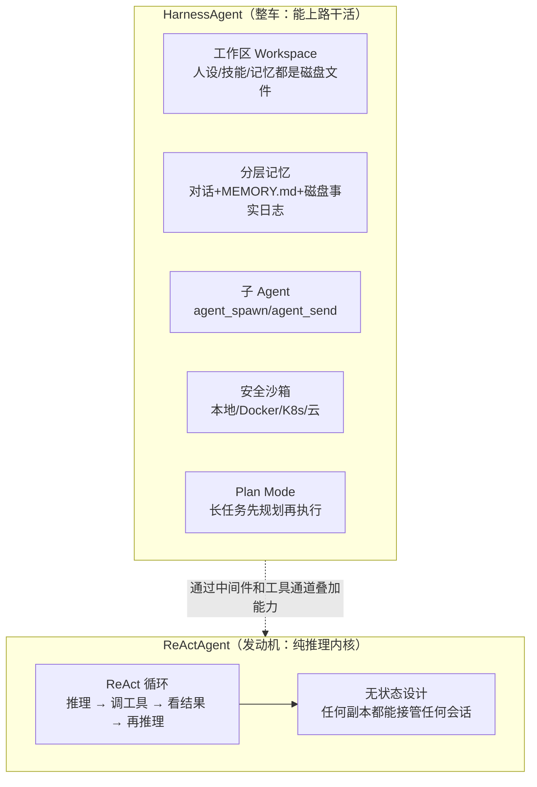
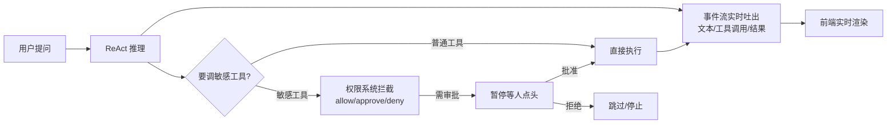
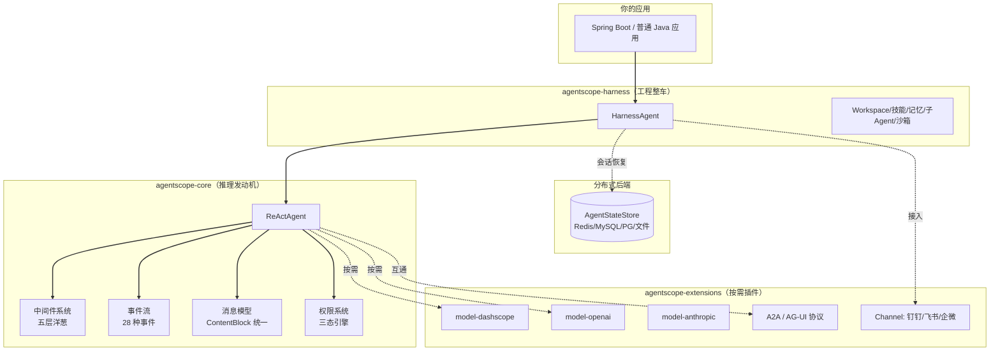

# AgentScope Java 2.0 源码解剖：Java 程序员终于有了自己的"企业级 Agent 底盘"

> 一句话概括：过去做 AI Agent 基本被 Python 框架垄断，AgentScope Java 让 Java 团队能用自己熟悉的技术栈，搭出能跑在生产环境、能扛多租户、能安全执行不可信代码的智能体系统。

## 先认识一下这个项目

| 项目 | 信息 |
|---|---|
| 仓库 | [agentscope-ai/agentscope-java](https://github.com/agentscope-ai/agentscope-java) |
| 出品方 | 阿里巴巴通义实验室（ModelScope 之后在 Agent 层的战略项目） |
| 当前版本 | v2.0.0 GA（2026 年 7 月刚正式发布） |
| 语言 | Java（要求 JDK 17+） |
| 协议 | Apache-2.0（宽松，可自由商用） |
| 分发 | Maven Central，`io.agentscope` |
| 文档 | [java.agentscope.io](https://java.agentscope.io/)（中英双语，很全） |

说明一下：AgentScope 本身是阿里 2024 年 2 月开源的多智能体框架，最早是 Python 版。这个仓库是它的 **Java 版**，而且 2.0 是刚在这个月（2026-07）打上"GA / 生产可用"标签的新东西。所以你现在看到的是一个非常新、但设计相当成熟的框架。Star 数因为 GitHub 页面抓取超时没取到精确值，以仓库页实时显示为准。

## 它到底解决什么问题？

先说一个很现实的痛点。市面上好用的 Agent 框架——LangChain、LangGraph、AutoGen、包括 AgentScope 自己的 Python 版——**几乎都是 Python 写的**。可是国内大量企业的核心系统是 Java 写的：银行、电商、政务、ERP……这些团队想做 AI Agent，要么被迫学 Python 另起炉灶，要么让 Java 服务通过 HTTP 去调一个 Python 服务，多一层网络、多一层运维、多一层坑。

AgentScope Java 就是来补这个缺口的：**让 Java 开发者用 Spring 那一套熟悉的姿势，直接在 JVM 里把 Agent 跑起来。**

但它的野心不止"翻译一个 Python 框架"。2.0 版本瞄准的是一个更难的问题——**让 Agent 能在真正的生产环境里长期稳定地干活**。这句话拆开有三层含义：

1. **任务能跑很久**：真实任务不是问一句答一句，而是可能跑几个小时、要记住中间状态、要积累经验。
2. **能扛住企业级压力**：多个租户共用、要安全地跑不可信的代码、服务滚动重启时不能把正在进行的对话搞丢。
3. **底层要好用**：消息、事件、扩展模型要清爽，人工介入（HITL）和事件流是框架的原生能力，而不是打补丁加上去的。

## 最核心的设计：把 Agent 拆成"发动机"和"整车"两层

理解 AgentScope Java 2.0，抓住一个词就够了——**双层 Agent 架构**。官方把它拆成 `ReActAgent` 和 `HarnessAgent` 两层，用汽车打个比方最好懂：

- **`ReActAgent` = 发动机**。它只干一件最核心的事：跑 ReAct 循环——"**推理 → 调工具 → 看结果 → 再推理**"，转一圈解决一轮思考。它是**无状态**的，纯粹、干净、不掺杂七七八八的工程杂事。
- **`HarnessAgent` = 整车**。光有发动机不能上路，你还需要底盘、油箱、导航、安全气囊。HarnessAgent 就是在发动机外面套上一整套"工程基础设施"：工作区、长期记忆、会话持久化、子 Agent、沙箱……



**这个"发动机/整车分离"最妙的地方在哪？** 在于它没有去改发动机。README 里有句话很关键：*"the reasoning core stays untouched, capabilities layer on"*——推理内核一行不动，所有工程能力都是**叠加**上去的。这意味着：你要个最轻量的裸 Agent，只依赖 `agentscope-core` 就行；你要企业级全家桶，加一个 `agentscope-harness` 依赖，工作区、持久化、沙箱自动全有了。想加就加、想减就减，互不干扰。

它靠什么实现这种"能力叠加"？答案是下面要重点讲的**中间件系统**。

## 源码深挖之一：中间件系统，一套"五层洋葱"

这是整个框架最见功力的地方，位于 `agentscope-core` 的 `io.agentscope.core.middleware` 包。所有工程能力（日志、追踪、限流、权限、动态提示词……）都是通过它挂上去的。

### 它给你五个"下钩子"的位置

Agent 干活的过程有几个关键节点，中间件让你在**不改 Agent 和模型代码**的前提下，往这些节点里塞自己的逻辑：

| 钩子位置 | 类型 | 管的是什么 |
|---|---|---|
| `onAgent` | 洋葱型 | 包裹一次完整回复（所有 ReAct 轮次都在里面） |
| `onReasoning` | 洋葱型 | 包裹一轮推理（组装输入→调模型→解码流） |
| `onActing` | 洋葱型 | 包裹一次工具调用 |
| `onModelCall` | 洋葱型 | 包裹最底层那一下模型 API 调用（离模型最近） |
| `onSystemPrompt` | 转换型 | 系统提示词组装时触发，一个个接力改写 |

它们的嵌套关系，官方文档画得很清楚——像剥洋葱一样一层套一层：

```
onAgent/
└── ReAct 循环（每一轮）/
    ├── onReasoning/
    │   ├── onSystemPrompt（组装系统提示词）
    │   └── onModelCall（真正调模型 API）
    └── onActing（每次工具调用）
```

### 两种类型的区别：洋葱 vs 流水线

这里有个特别值得说的设计——中间件分了**两种截然不同的类型**，很多框架都是一刀切，AgentScope 分得很细：

- **洋葱型（Onion）**：中间件把"下一层"包在里面。你能在 `next.apply(input)` 前后插逻辑，就像洋葱一层包一层。适合做"环绕"的事——计时、追踪、异常兜底。
- **转换型（Transformer）**：中间件排成一条流水线，上一个的输出是下一个的输入，没有"里外层"的概念。只有 `onSystemPrompt` 是这种——因为改提示词就是"你改完我接着改"的接力，用流水线最自然。

### 看段真实代码：一个"模型故障自动切备用"的中间件

光说概念太虚，看官方给的这段真实源码就懂了。这个中间件的作用是：**主模型调用失败时，自动切换到备用模型重试**——生产环境的刚需。

```java
public class ModelFallbackMiddleware implements MiddlewareBase {
    private final Model fallback;

    public ModelFallbackMiddleware(Model fallback) { this.fallback = fallback; }

    @Override
    public Flux<AgentEvent> onModelCall(
            Agent agent, ModelCallInput input, Function<ModelCallInput, Flux<AgentEvent>> next) {
        return next.apply(input)                       // 先正常调主模型
            .onErrorResume(err -> {                    // 一旦出错
                System.err.println("主模型挂了，切备用: " + err.getMessage());
                return next.apply(                     // 用备用模型重新调一次
                    new ModelCallInput(input.messages(), input.tools(), input.options(), fallback));
            });
    }
}
```

几个能看出功底的细节：

1. **基于 Reactor（`Flux`/`Mono`）**。返回的是 `Flux<AgentEvent>`——事件流。整个框架从底层就是响应式、流式的，天然支持"边想边吐字"的实时 UI。这是 Java 后端做 AI 应用该有的样子。
2. **`onErrorResume` 兜底**。这是 Reactor 的错误处理算子，主模型抛异常就无缝接住、换备用模型。用户完全无感。
3. **入参是不可变 record**。`ModelCallInput` 是个 record，想改传给下一层的内容，就 new 一个新的——干净、线程安全、无副作用。

### 执行顺序：先进的包在最外面

多个中间件叠在一起时，顺序是这样的（洋葱型）：

```
middlewares = [mw1, mw2]
// 执行顺序：mw1 前置 → mw2 前置 → 内核 → mw2 后置 → mw1 后置
```

列表里第一个在最外层。这个顺序设计得很直觉——你把日志中间件放第一个，它就能包住所有其他中间件，记录到最完整的耗时。

**一句话总结这个模块的价值**：它把"框架怎么运行"和"我想加什么能力"彻底解耦了。HarnessAgent 那些花哨的工程能力，本质上都是一组预置的中间件。你想加自己的（限流、鉴权、审计），照着 `MiddlewareBase` 实现一两个钩子就行。

## 源码深挖之二：事件流 + 人工介入，把"实时"和"可控"做进骨子里

第二个核心设计是**事件流（Event Stream）**。传统的 Agent 调用是"你问，等半天，它一次性把答案甩给你"。AgentScope Java 不是——它把 Agent 干活的每一步都变成一个**带类型的事件**，一共 28 种，通过 `streamEvents()` 实时吐出来。

看 README 里的入门代码就明白了：

```java
// 阻塞式调用：适合后台任务，等它算完
agent.call(new UserMessage("Hello!"), ctx).block();

// 流式事件：适合实时 UI，边算边渲染
agent.streamEvents(new UserMessage("总结今天三点"), ctx)
    .doOnNext(event -> {
        switch (event.getType()) {
            case TEXT_BLOCK_DELTA ->                    // 模型每吐一个字
                System.out.print(((TextBlockDeltaEvent) event).getDelta());
            case TOOL_CALL_START ->                     // 开始调某个工具
                System.out.println("\n[调工具] " + ((ToolCallStartEvent) event).getToolCallName());
            default -> { }
        }
    })
    .blockLast();
```

`call()` 和 `streamEvents()` 是统一执行内核的两个出口：一个给你最终结果，一个给你实时过程。**这一步为什么重要？** 因为它让前端能做到"打字机效果 + 实时显示 AI 正在调哪个工具"，而不是转圈等半天。用户体验差距巨大。

更进一步，事件流不只是给人看的，它还是**人工介入（HITL）**的基础。整条链路是这样的：



配合**三态权限引擎**（放行 / 要人审批 / 拒绝），敏感操作（比如"删库""转账""发邮件"）可以强制停下来等人点头，人一批准，Agent 就从**刚才暂停的地方精确恢复**继续跑。这种"随时能暂停、精确能恢复"的能力，对企业级应用来说是安全底线。

## 模块关系全景

AgentScope Java 2.0 是个 Maven 多模块项目，按需引入。核心就三块，加上一堆可插拔的扩展：



实线是强依赖，虚线是按需/可选。可以看到 `ReActAgent` 是绝对的中心，中间件、事件、消息、权限都长在它身上；`HarnessAgent` 在外面包一层工程能力；模型 provider、IM 渠道、协议支持全是可插拔的独立 Maven 模块，用哪个引哪个，包不臃肿。

## 分布式：为什么它敢说"企业级"

企业级不是喊口号，AgentScope Java 2.0 在这块下了真功夫，核心是一个词——**无状态（stateless）**：

- **任何副本接管任何用户**：Agent 本身不存状态，状态全丢进 `AgentStateStore`（可选 Redis / MySQL / PostgreSQL / JSON 文件 / 内存）。你部署 10 个副本，用户的对话打到哪个副本都能接着聊。
- **滚动重启零丢失**：靠同一组 `(userId, sessionId)` 就能在任意进程上恢复完整对话。发版时滚动重启，正在进行的任务不会断。
- **多租户隔离**：按 session / user / agent / org 四个维度隔离，`RuntimeContext` 的 key 会一路贯穿到工作区路径、KV 命名空间、沙箱状态槽。租户之间的数据互不串门。
- **安全沙箱**：工具代码跑在隔离环境里（本地子进程 / Docker / K8s / 云沙箱），还能快照和恢复，长任务扛得住重启。

这几条加起来，就是它区别于"玩具级 Agent Demo"的核心竞争力。很多开源 Agent 框架能跑通 Demo，但一到"多租户 + 高可用 + 滚动发布"就露馅，AgentScope Java 是奔着这个场景设计的。

## 和几个相关项目的关系

| 对比对象 | 关系/区别 |
|---|---|
| **AgentScope（Python 版）** | 同源兄弟。Java 版不是简单移植，2.0 针对 JVM 和企业级分布式做了重新设计。 |
| **Spring AI / Spring AI Alibaba** | 定位不同。Spring AI 更偏"把 LLM 能力接进 Spring 应用"；AgentScope Java 是**原生为 Agent 范式设计**，核心是"会自主思考和行动的 Agent"。 |
| **LangChain / LangGraph（Python）** | 生态更成熟、社区更大，但都是 Python。Java 团队用它们要跨语言，AgentScope Java 是同语言原生方案。 |
| **Dify / Coze** | 那些是"平台/产品"，可视化搭建；AgentScope Java 是"框架/代码库"，给开发者写代码用。 |

一句话选型建议：**Java 技术栈 + 要做能上生产的 Agent + 看重多租户和分布式** → AgentScope Java 很合适；**只是想给现有 Spring 应用加点 LLM 调用** → Spring AI 可能更轻；**团队是 Python** → 直接用 Python 版或 LangGraph 生态更省事。

## 快速上手

要求 JDK 17+。Maven 引入 harness 包（推荐入口，工程能力全含），再按需加一个模型 provider：

```xml
<!-- 推荐入口：包含工作区/持久化/沙箱等全套工程能力 -->
<dependency>
    <groupId>io.agentscope</groupId>
    <artifactId>agentscope-harness</artifactId>
    <version>2.0.0</version>
</dependency>

<!-- 按需加一个模型 provider，这里用阿里 DashScope -->
<dependency>
    <groupId>io.agentscope</groupId>
    <artifactId>agentscope-extensions-model-dashscope</artifactId>
    <version>2.0.0</version>
</dependency>
```

然后几行代码就能起一个 Agent（模型字符串会自动读对应的环境变量 API key）：

```java
HarnessAgent agent = HarnessAgent.builder()
        .name("assistant")
        .sysPrompt("You are a helpful AI assistant.")
        .model("dashscope:qwen-plus")               // 也可以填 openai:gpt-4.1 等
        .workspace(Paths.get(".agentscope/workspace"))
        .build();

RuntimeContext ctx = RuntimeContext.builder().sessionId("demo").userId("alice").build();
agent.call(new UserMessage("Hello!"), ctx).block();
```

只要一个裸 `ReActAgent`、不需要工作区和沙箱，那就只依赖 `agentscope-core`。

## 深度总结：它做对了什么

拆完设计，AgentScope Java 2.0 有几个判断值得记下来：

1. **"发动机/整车"双层分离是神来之笔**。推理内核 `ReActAgent` 保持纯净不动，工程能力靠中间件叠加到 `HarnessAgent`——这套设计让"轻量"和"企业级全家桶"能在同一个框架里共存，按需取用。
2. **中间件分洋葱型和转换型，分得比大多数框架细**。基于 Reactor 的响应式事件流从底层贯穿到顶层，实时 UI 和 HITL 是原生能力而非补丁。
3. **奔着真·生产环境去的**。无状态 + AgentStateStore + 多租户隔离 + 安全沙箱，这套组合拳直接瞄准"多租户、高可用、滚动发布"，不是玩具。
4. **填了一个真实的生态空白**。国内海量 Java 团队想做 Agent 又不想跨语言，这个框架来得正是时候。

它的短板也得实话实说：**太新了**——v2.0 GA 是 2026 年 7 月这个月才发布的，生态、教程、踩坑经验都还在积累，Issue 里也能看到大家在追问稳定版时间线。相比 Python 那边成熟的 LangChain 生态，它的第三方工具和社区案例还很少。**生产环境上马前，建议先在非核心链路小范围试跑，别一上来就压到核心业务上。**

但如果你是 Java 团队、又确实要做一个能长期跑、扛得住企业级压力的 Agent 系统，这大概是目前 JVM 上最"对路"的选择之一。

---

<!-- IMAGE_PROMPT: gpt-image2
A clean 16:9 technical architecture infographic for "AgentScope Java 2.0", primary color #3366CC on white background. Top center: bold title "AgentScope Java 2.0" with a Java coffee-cup icon and an Apache-2.0 badge. Left side: input — a user message bubble and a Spring Boot logo feeding in. Center: two concentric layers illustrated as an engine inside a car chassis — inner core labeled "ReActAgent (reasoning engine: reason -> act -> observe loop)", outer layer labeled "HarnessAgent (workspace, memory, sandbox, sub-agents)". Between them, five thin rings labeled "Middleware: onAgent / onReasoning / onActing / onModelCall / onSystemPrompt". Bottom: infrastructure row with database cylinders labeled "Redis / MySQL / PostgreSQL (AgentStateStore)" and a shielded "Sandbox (Docker/K8s)". Right side: output — a real-time event stream shown as flowing typed event chips (text delta, tool call, tool result) into a UI window. Modern flat design, thin lines, generous whitespace, professional developer-tool aesthetic, English labels.
-->

<!-- IMAGE_PROMPT: gpt-image2
A 16:9 conceptual cover image symbolizing AgentScope Java as an enterprise-grade agent chassis. Central metaphor: a sleek car built around a glowing engine core, where the engine is stamped with a small ReAct loop symbol and the car body is labeled with workspace/memory/sandbox icons. The car drives on a highway made of Java-coffee-bean patterns, with subtle distributed-server silhouettes (multiple replicas) in the background suggesting horizontal scaling. Color palette dominated by #3366CC blue with white and warm orange (Java) accents. Clean, modern, slightly cinematic tech-illustration style, minimal text.
-->
