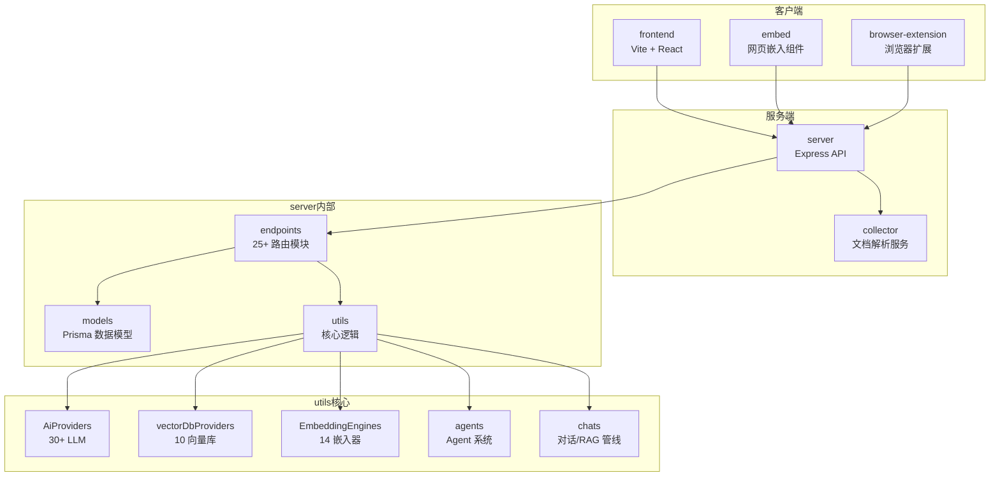
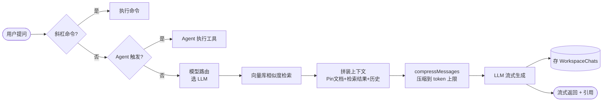
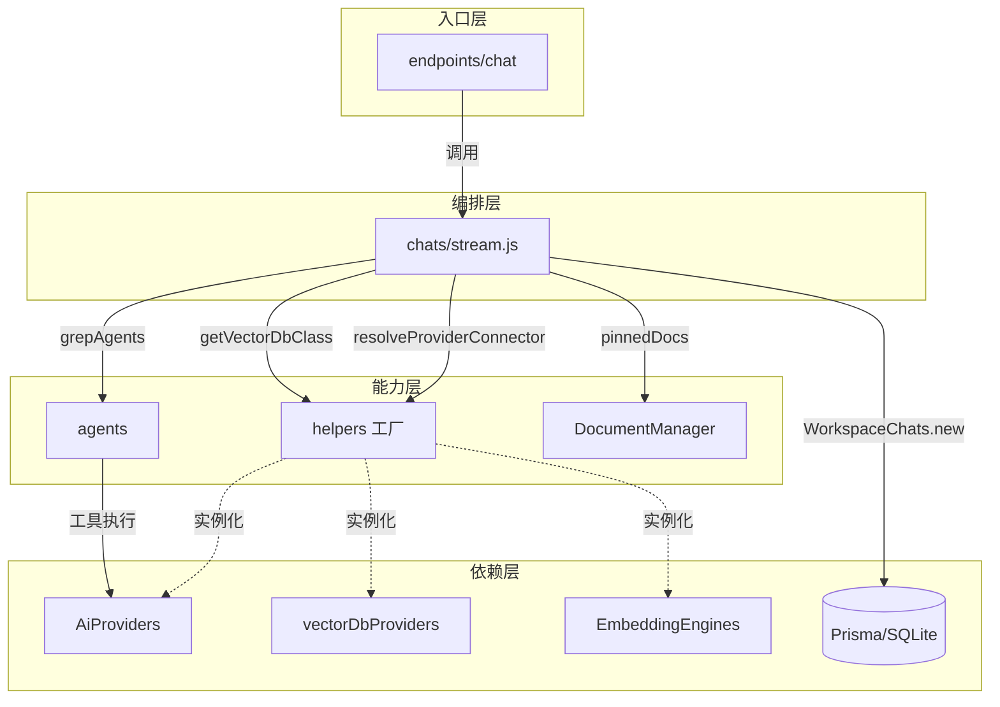

# AnythingLLM 深度拆解：一个 63k Star 的本地 AI 应用，是怎么把 30 多个模型接口塞进一个 switch 里的

> 你想在自己电脑上跑一个私有版 ChatGPT，能读你的 PDF、能联网搜索、还能多人共用。市面上工具一大堆：Ollama 只管跑模型、LM Studio 界面友好但没文档管理、Open WebUI 功能全但配起来累。AnythingLLM 的野心是把这些都揉进一个 Docker 容器——装完就能用，不用碰配置文件。

## 1. 项目速览

| 项目 | 内容 |
|---|---|
| 项目名称 | AnythingLLM |
| 一句话定位 | 开箱即用的全功能本地 AI 应用（文档对话 + AI Agent + 多用户） |
| GitHub 地址 | [Mintplex-Labs/anything-llm](https://github.com/Mintplex-Labs/anything-llm) |
| 官方文档 | https://docs.anythingllm.com |
| 主要语言 | JavaScript（NodeJS + React） |
| 技术栈 | Vite + React 前端 / Express 后端 / Prisma ORM / LanceDB 向量库 |
| 开源协议 | MIT |
| Star 数 | ⭐ 63k（Fork 6.9k） |
| 维护方 | Mintplex Labs Inc（商业公司背书） |
| 部署形态 | Docker / 桌面版（Mac/Win/Linux）/ 裸机 / 云一键部署 |
| 适合人群 | 想自托管私有 AI、需要文档 RAG、需要多用户权限的个人和团队 |

## 2. 它解决了什么问题

本地 AI 工具的现状是"各管一段"：

- **Ollama / llama.cpp**：负责把模型跑起来，但只给你一个 API，没有界面、没有文档管理
- **LM Studio**：桌面界面舒服，模型下载方便，但不做知识库、不支持多用户
- **PrivateGPT / 各种 RAG demo**：能读文档，但要自己搭前端、配向量库、写文档解析

结果就是：想要一个"能读我文档、能联网、能多人用、还能跑 Agent"的完整应用，你得自己把四五个工具拼起来。

AnythingLLM 的答案是**做一个大而全的应用层**：底层模型交给你选（OpenAI 也行、本地 Ollama 也行），它负责上面的所有事——文档解析、向量化、检索、多用户权限、Agent 编排、定时任务。用它的原话说，就是 "no frustrating setup required"（不用折腾配置）。

代价也很明显：它不是一个轻量库，而是一个带前后端的完整 Web 应用。你要么跑 Docker，要么装桌面版，没有"pip install 两行代码"这种玩法。

## 3. 核心功能特性

### 3.1 核心功能

- **文档对话（RAG）**：拖拽上传 PDF/TXT/DOCX，自动切块、向量化、检索，回答带来源引用
- **三种对话模式**：`query`（只用文档内容答，查不到就拒答）、`chat`（文档+模型通用知识）、`automatic`（自动判断，含 Agent 触发）
- **AI Agent**：工作区内的 Agent 能联网搜索、跑 SQL、读写文件，还支持无代码 Agent Flow 编排
- **多用户与权限**：Docker 版支持多用户实例，按用户隔离访问权限（桌面版是单机）

### 3.2 特色能力

- **动态模型路由（Dynamic Model Routing）**：按你定义的规则，把不同对话自动分给最合适的模型，源码里作为特殊的 `anythingllm-router` provider 单独处理
- **记忆系统（Memories）**：让模型记住关于你或工作区的关键信息，自动或手动管理
- **定时任务（Scheduled Tasks）**：用 cron 表达式跑周期性 prompt，且带完整 Agent 能力
- **智能技能选择**：官方称能在开启无限工具的同时，把每次查询的 token 消耗降低最多 80%
- **MCP 兼容**：可以接入 Model Context Protocol 的 server，扩展工具生态

### 3.3 功能边界

- ✅ 适合：想一个容器搞定文档 RAG + Agent + 多用户的团队；需要数据不出本地的隐私场景
- ❌ 不适合：只想要一个纯净聊天界面（功能太多显臃肿）；想把它当轻量 SDK 嵌进自己代码（它是应用不是库）
- ⚠️ 实测短板：社区反馈 RAG 摘要类任务效果不稳定，有用户在 Reddit 抱怨"想让它总结一个文件几乎做不到，只有 pin（固定）文档后才好用"——这和它默认走向量检索、检索不全就漏内容的机制有关

<!-- IMAGE_PROMPT: gpt-image2
生成一张「AnythingLLM 功能结构全景图」信息图。

布局：
- 顶部标题：AnythingLLM 全功能本地 AI 应用 + 副标题「Chat with docs · AI Agents · Multi-user」+ ⭐ 63k 徽章
- 左侧输入层：文档上传（PDF/DOCX/TXT）、用户提问、网页/浏览器扩展
- 中间核心层 5 模块：Collector（文档解析）→ Embedder（向量化）→ Vector DB（LanceDB 等）→ Chat Engine（RAG 检索+对话）→ Agent Engine（工具调用/Flow）
- 底部支撑层：Provider 抽象（OpenAI/Anthropic/Ollama/LM Studio 等 30+ LLM）、Prisma+SQLite、多用户权限、Docker
- 右侧输出层：流式回答 + 来源引用 / Agent 执行结果 / 定时任务

视觉风格：
- 现代技术架构图，干净克制，16:9 画幅
- 主色 #3366CC，辅色 #5B8FF9，浅色背景
- 模块间清晰箭头连接
- 中文文字清晰可读，PingFang SC 字体
-->

## 4. 架构设计

### 4.1 整体架构

AnythingLLM 是一个 Monorepo，README 里明确列了六大部分：



### 4.2 数据流

一次带文档的提问，数据是这样流动的：



### 4.3 核心设计思想

- **一切皆 Provider，用 ENV 切换**：LLM、Embedder、Vector DB 三类外部依赖全部抽象成 Provider 接口，靠环境变量选具体实现。想从 OpenAI 换成本地 Ollama，改一个 `LLM_PROVIDER` 变量就行，不动业务代码
- **Workspace 为核心隔离单位**：每个工作区对应向量库里的一个 namespace（`workspace.slug`），文档、对话历史、模型配置都按工作区隔离
- **检索与引用分离**：源码里有段耐人寻味的注释——喂给 LLM 的上下文（contextTexts）比展示给用户的引用（sources）更多。这是为了减少"LLM 引用了看起来不相关的文档"这类 GitHub issue

## 5. 源码深度分析

> 本次聚焦 `server` 端。AnythingLLM 前端是常规 React SPA，真正的工程价值在 server 的 Provider 抽象层和 RAG 对话管线。我重点读了 `index.js`（入口）、`utils/helpers/index.js`（Provider 工厂，721 行）、`utils/chats/stream.js`（对话管线，377 行）三个文件。

### 5.1 模块全景

| 模块 | 目录 | 核心职责 | 分析级别 |
|---|---|---|---|
| Provider 工厂 | `server/utils/helpers/` | LLM/Embedder/VectorDB 三大工厂 | P0 深度 |
| 对话/RAG 管线 | `server/utils/chats/` | streamChatWithWorkspace 全流程 | P0 深度 |
| API 端点 | `server/endpoints/` | 25+ 路由模块，Express 挂载 | P0 深度 |
| Agent 系统 | `server/utils/agents/` | grepAgents 触发 + 工具执行 | P1 关键流程 |
| 向量库实现 | `server/utils/vectorDbProviders/` | 10 个向量库各自适配 | P1 关键流程 |
| 数据模型 | `server/models/` | Prisma ORM，WorkspaceChats 等 | P1 关键流程 |
| 文档解析 | `collector/` | 独立服务，解析各类文档 | P2 说明 |
| 定时任务 | `server/jobs/` | cron 调度 | P2 说明 |

### 5.2 Provider 工厂：一个 switch 撑起 30+ 模型

`server/index.js` 是标准的 Express 装配文件，把 25 个端点模块挂到 `/api` 路由下：

```javascript
app.use("/api", apiRouter);
systemEndpoints(apiRouter);
workspaceEndpoints(apiRouter);
chatEndpoints(apiRouter);
agentWebsocket(apiRouter);
mcpServersEndpoints(apiRouter);
scheduledJobEndpoints(apiRouter);
memoryEndpoints(apiRouter);
// ...共 25+ 个
```

真正的架构精髓在 `utils/helpers/index.js`。整个系统对"外部依赖"的处理，就是三个工厂函数，每个都是一个大 switch：

```javascript
function getLLMProvider({ provider = null, model = null } = {}) {
  const LLMSelection = provider ?? process.env.LLM_PROVIDER ?? "openai";
  const embedder = getEmbeddingEngineSelection();
  switch (LLMSelection) {
    case "openai":
      const { OpenAiLLM } = require("../AiProviders/openAi");
      return new OpenAiLLM(embedder, model);
    case "ollama":
      const { OllamaAILLM } = require("../AiProviders/ollama");
      return new OllamaAILLM(embedder, model);
    // ...一路排到 case "cerebras"，共 30+ 个 provider
    default:
      throw new Error(`ENV: No valid LLM_PROVIDER value found...`);
  }
}
```

同样的模式复制了三遍：`getVectorDbClass()` 管 10 个向量库（默认 LanceDB），`getEmbeddingEngineSelection()` 管 14 个嵌入器（默认 Native 本地嵌入）。

**这套设计的取舍值得说道**。好处很直接：每个 provider 用 `require` 懒加载，只有选中的那个才会被引入，避免把所有 SDK 都塞进内存；新增一个模型商，就是加一个 case、写一个适配类，改动面极小。代价是这三个 switch 会越长越长——现在 LLM 那个已经 100 多行，且每加一个 provider 都要动这个核心文件。这是典型的"用简单换扩展位置集中"，对一个社区贡献频繁的项目反而是好事：新人照着现有 case 抄一个就能提 PR。

有个细节能看出踩过的坑：`anythingllm-router`（动态模型路由）这个 provider 在 switch 里被特意 `throw` 掉了，注释说明它必须走 `AnythingLLMModelRouter` 类单独处理，不能从这里直接实例化。说明路由逻辑复杂到无法塞进工厂的统一签名里。

### 5.3 核心流程：一次文档对话的完整链路

`utils/chats/stream.js` 的 `streamChatWithWorkspace()` 是整个产品的心脏。追踪一遍它的调用链：

```javascript
async function streamChatWithWorkspace(response, workspace, message, chatMode = "automatic", ...) {
  const updatedMessage = await grepCommand(message, user);        // 1. 先看是不是斜杠命令
  if (Object.keys(VALID_COMMANDS).includes(updatedMessage)) { ... return; }

  const isAgentChat = await grepAgents({ ... });                  // 2. 是不是 Agent 对话，是则走 Agent 分支
  if (isAgentChat) return;

  const { connector: LLMConnector, prefetchedContext } =          // 3. 模型路由，选出 LLM
    await resolveLLMConnector({ workspace, message, ... });

  const VectorDb = getVectorDbClass();                            // 4. 拿向量库
  const vectorSearchResults = await VectorDb.performSimilaritySearch({
    namespace: workspace.slug, input: updatedMessage,
    similarityThreshold: workspace?.similarityThreshold,
    rerank: workspace?.vectorSearchMode === "rerank",             // 支持 rerank 模式
  });

  contextTexts = [...contextTexts, ...filledSources.contextTexts];// 5. 拼装上下文
  const messages = await LLMConnector.compressMessages({          // 6. 压缩到 token 上限
    systemPrompt, userPrompt: updatedMessage, contextTexts, chatHistory, attachments,
  });

  const stream = await LLMConnector.streamGetChatCompletion(messages, {...}); // 7. 流式生成
  completeText = await LLMConnector.handleStream(response, stream, { uuid, sources });
  await WorkspaceChats.new({ ... });                              // 8. 存库
}
```

这个流程的设计决策有几个亮点：

**query 模式的"拒答"保护**。如果工作区没有向量数据，或检索后 `contextTexts` 为空，query 模式会直接返回 `queryRefusalResponse`（"没有相关信息可回答"），绝不让 LLM 用通用知识硬答。这是防幻觉的硬手段——宁可拒答也不瞎编。

**上下文回填（fillSourceWindow）**。检索结果之外，还会用 `fillSourceWindow` 把历史对话里用过的来源补进上下文。配合前面说的"contextTexts 比 sources 多"的设计，既保证回答连贯，又不会在引用区列一堆用户觉得无关的文档。

### 5.4 模块关系全景



## 6. 社区热点（Issues 分析）

### 6.1 精选 Issue

| # | 标题 | 讨论要点 |
|---|---|---|
| [#4030](https://github.com/Mintplex-Labs/anything-llm/issues/4030) | API 请求下的 RAG 上下文异常（1.8.2） | pin 文档时先查向量库导致上下文错乱，暴露检索与固定文档的优先级问题 |
| [#4799](https://github.com/Mintplex-Labs/anything-llm/issues/4799) | Docker 版选完 LLM Provider 后加载失败 | 部署环境下 provider 切换的稳定性问题 |
| [#2927](https://github.com/Mintplex-Labs/anything-llm/issues/2927) | txt 文件嵌入 Chroma 失败 | 向量库 namespace 重置的正确操作方式 |
| [#2937](https://github.com/Mintplex-Labs/anything-llm/issues/2937) | 通过 API 做向量检索 | 开发者想直接调用检索能力的需求 |
| [#1717](https://github.com/Mintplex-Labs/anything-llm/issues/1717) | RAG + Chroma 使用问题 | 第三方向量库适配的兼容性 |

从 Issue 分布能看出：**大部分痛点集中在 RAG 检索质量和向量库适配**，而不是模型接入。这侧面印证了 5.2 的判断——Provider 工厂那套抽象足够稳，接模型基本不出问题；反而是检索逻辑（什么时候用 pin 文档、检索不全怎么办）是持续被吐槽的地方。

### 6.2 社区健康度

- **维护状态**：稳定活跃。有商业公司 Mintplex Labs 全职维护，还在做 Open Computer 新方向
- **社区规模**：63k star、6.9k fork、贡献者众多，Discord 社区活跃
- **文档完整度**：官方文档站 docs.anythingllm.com 完整，含多语言 README（中/日）
- **诚实评价**：不是所有人都满意。Reddit 上有一条高热帖标题直接是"AnythingLLM is a nightmare"，抱怨文档摘要难做。这类反馈恰恰说明它的定位——**开箱即用的广度**换来了**深度调优的受限**，重度 RAG 用户可能需要更可控的方案

## 7. 竞品对比

| 维度 | AnythingLLM | Open WebUI | LM Studio | Ollama |
|---|---|---|---|---|
| 定位 | 全功能 AI 应用 | 全功能聊天界面 | 桌面模型运行器 | 模型运行后端 |
| 文档 RAG | 内置，开箱即用 | 内置 | 弱/需插件 | 无 |
| AI Agent | 内置（联网/SQL/文件/Flow） | 有限 | 无 | 无 |
| 多用户 | Docker 版支持 | 支持 | 无 | 无 |
| 向量库 | 10 种可选 | 内置 | 无 | 无 |
| 部署 | Docker/桌面/云 | Docker | 桌面 | 桌面/服务 |
| 上手难度 | 低（装完即用） | 中 | 很低 | 低（但只有 API） |

几句实在话：如果你只想在本地跑个模型给别的程序调，**Ollama** 就够了，AnythingLLM 太重。如果你要的是纯聊天体验和极致易用，**LM Studio** 的桌面体验更顺。AnythingLLM 和 **Open WebUI** 才是真正的正面竞争——两者功能高度重叠，社区评测的普遍结论是：要"文档 RAG + 开箱即用的 Agent（能联网、跑 SQL、读文件）"选 AnythingLLM；要更极客、更可定制、社区插件更多选 Open WebUI。没有谁全面碾压。

## 8. 快速上手

最省事的方式是 Docker：

```bash
docker pull mintplexlabs/anythingllm

export STORAGE_LOCATION=$HOME/anythingllm
mkdir -p $STORAGE_LOCATION
docker run -d -p 3001:3001 \
  -v ${STORAGE_LOCATION}:/app/server/storage \
  -e STORAGE_DIR="/app/server/storage" \
  mintplexlabs/anythingllm
```

打开 `http://localhost:3001`，界面里选 LLM Provider（本地就选 Ollama）、选嵌入器（默认 Native 就行）、建工作区、拖文档进去，就能对话了。全程不用碰配置文件。

想从源码开发，README 给了清晰的四步：

```bash
yarn setup          # 生成各段的 .env 文件（记得去填 server/.env.development）
yarn dev:server     # 起后端
yarn dev:frontend   # 起前端
yarn dev:collector  # 起文档解析服务
```

注意三个服务要分别起——server、frontend、collector 是独立进程，这也印证了它的 Monorepo 多服务架构。

## 9. 深度总结

AnythingLLM 的工程价值，不在于用了什么高深算法，而在于**它把"接入任意 AI 组件"这件事做成了一套可复制的模式**：三个工厂函数 + 环境变量，就把 30 多个 LLM、14 个嵌入器、10 个向量库全部收编。新增任何一个，都是照葫芦画瓢加一个 case。这种设计对一个靠社区贡献扩展生态的项目来说，比任何花哨架构都实用。

它的天花板也来自这里。为了"全都支持、开箱即用"，检索管线做了大量默认决策（默认走向量检索、默认 topN、默认 similarity threshold），这些默认值对通用场景够用，但对"总结整篇文档"这类需要全量上下文的任务就会露怯——于是有了 Reddit 上的差评和一堆 RAG 相关 Issue。

一句话判断：**如果你要快速搭一个能读文档、能跑 Agent、能多人用的私有 AI，且不想在部署上花时间，AnythingLLM 是 63k star 里最稳妥的选择之一。但别指望它在 RAG 精调上给你 LangGraph 那种细粒度控制——它是应用，不是框架。**

<!-- IMAGE_PROMPT: gpt-image2
生成一张 AnythingLLM 的文章封面图。

核心隐喻：一个巨大的中央枢纽（象征 AnythingLLM 应用），周围有众多不同形状的插头/接口正在接入——代表 30+ LLM、10 向量库、14 嵌入器的"万物接入"能力。中央枢纽正在处理文档（纸张/文件图标流入）并输出对话气泡。

画面元素：
- 中央：一个发光的立方体或枢纽，表面有 "AnythingLLM" 字样
- 四周：多种颜色的接口线缆汇聚进来，线缆末端是不同的模型/数据库图标
- 一侧：文档图标（PDF/DOCX）流入，另一侧：对话气泡+引用标记流出
- 顶部：⭐ 63k Stars 徽章
- 底部标语：「Chat with your docs · Run AI Agents · 100% Local」

视觉风格：
- 科技感，深色背景 (#1e293b)，主色微软蓝到青色渐变
- 线缆用发光效果表现数据流动
- 16:9 宽高比
- 英文标语清晰，整体干净不杂乱
-->
