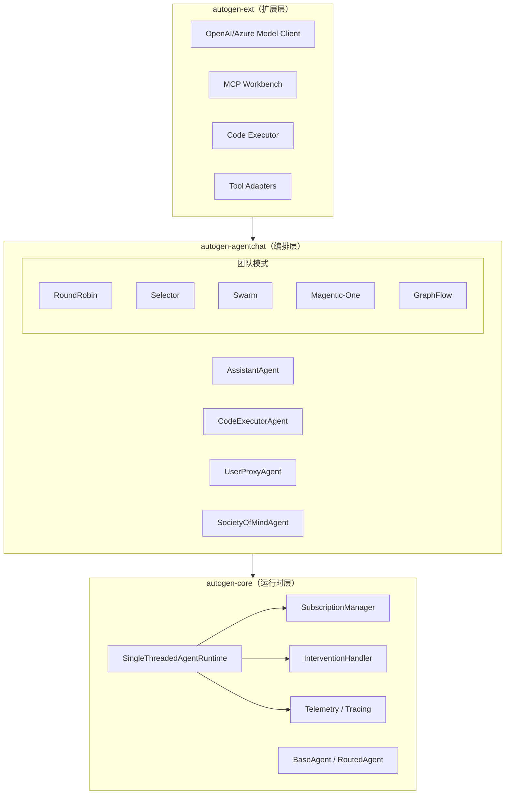
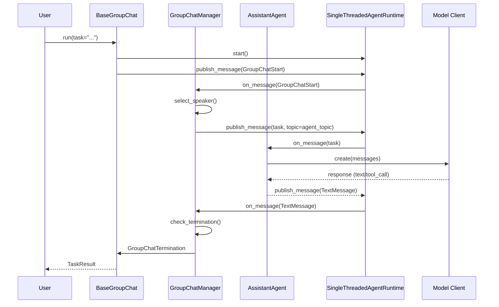
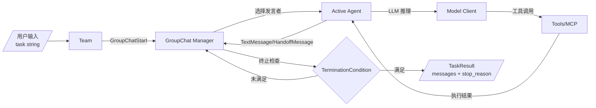
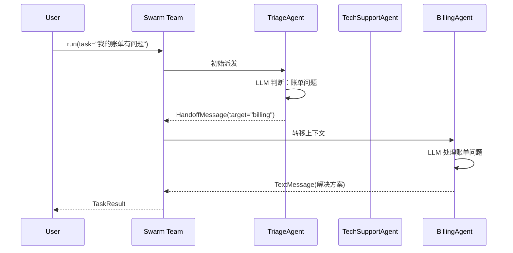
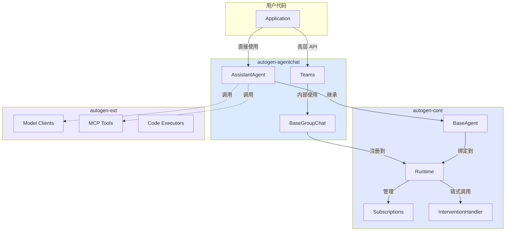

# 深度剖析 AutoGen：微软如何用 Actor 模型重构多智能体协作

> 2023 年底，"多智能体"从论文概念变成了工程需求——一个 LLM 调不好的任务，交给两个 Agent 互相较劲就能有结果。微软研究院的 AutoGen 在这波浪潮中冲到了 50k Star，但 2025 年中它突然进入维护模式（Maintenance Mode），微软把火力转向了 Microsoft Agent Framework。这篇文章拆解 AutoGen 的架构设计和源码实现，搞清楚它做对了什么、踩了哪些坑，以及为什么微软选择"另起炉灶"而不是继续迭代。

## 1. 项目速览

| 项目 | 内容 |
|---|---|
| 项目名称 | AutoGen |
| 一句话定位 | 基于 Actor 模型的多智能体 AI 编程框架 |
| GitHub 地址 | [microsoft/autogen](https://github.com/microsoft/autogen) |
| 官方网站 | https://microsoft.github.io/autogen/ |
| 主要语言 | Python（主体）、.NET（跨语言支持） |
| 技术栈 | asyncio + Actor 模型 + Pub/Sub + OpenTelemetry |
| 开源协议 | MIT（代码）+ CC BY 4.0（文档） |
| Star 数 | ⭐ 50,400+（2025 年 7 月） |
| 最新版本 | v0.4+（2025 年 1 月完全重写） |
| 维护状态 | 🟠 维护模式（不再新增功能，社区驱动） |
| 适合人群 | 已有 AutoGen 项目需要维护的团队；想深入理解多智能体架构设计的工程师 |

## 2. 它解决了什么问题

单 Agent 的天花板很低：遇到复杂任务时，一个 LLM 调用链不断堆工具和 prompt，到第五六步就开始"迷路"——上下文爆炸、决策漂移、错误无法自纠。

AutoGen 的解法是把单一调用链拆成多个独立角色：

- **Coder** 写代码，**Reviewer** 审代码，**Executor** 跑代码——各管各的上下文
- 通过消息传递（而非共享内存）协作，天然隔离了上下文污染
- 用 "终止条件"（Termination Condition）控制对话收敛，避免无限循环

v0.4 更进一步，引入 Actor 模型（每个 Agent 是一个 Actor，拥有独立地址和消息队列），解锁了分布式运行和跨语言互操作的可能性。

## 3. 核心能力拆解

### 3.1 三层架构（设计核心）

AutoGen 采用分层设计，每一层职责独立、向上组合：

| 层级 | 包名 | 职责 | 典型用户 |
|---|---|---|---|
| 底层 | `autogen-core` | Actor 运行时、消息路由、订阅管理 | 框架开发者 |
| 中层 | `autogen-agentchat` | 预设 Agent + 团队编排模式 | 应用开发者 |
| 上层 | `autogen-ext` | LLM 客户端、MCP、代码执行器 | 集成开发者 |

### 3.2 五种团队编排模式

AgentChat 层内置了 5 种多智能体协作模式，覆盖从简单轮转到复杂图编排：

1. **RoundRobinGroupChat**：Agent 按固定顺序轮流发言。适合流水线式任务（写代码→审代码→执行）
2. **SelectorGroupChat**：由 LLM 动态选择下一个发言的 Agent。适合开放式讨论
3. **Swarm**：Agent 之间通过 Handoff 互相移交控制权。适合客服路由、多步骤工作流
4. **MagenticOneGroupChat**：微软论文中的 Magentic-One 实现，Orchestrator 领导多个专家 Agent，能在 GAIA 基准测试上达到 38% 通过率
5. **GraphFlow**：DAG（有向无环图）编排，Agent 之间的流转关系可视化定义

### 3.3 MCP 原生集成

v0.4+ 内置了完整的 Model Context Protocol 支持：

```python
async with McpWorkbench(StdioServerParams(command="npx", args=["@playwright/mcp@latest"])) as mcp:
    agent = AssistantAgent("browser", model_client=client, workbench=mcp)
```

支持 Stdio、SSE、Streamable HTTP 三种传输方式，一个 Agent 可以挂载多个 MCP Server。

### 3.4 功能边界

- ✅ 适合：多 Agent 协作原型验证、学术研究、已有 AutoGen 系统维护
- ❌ 不适合：生产环境新项目起步（官方建议迁移到 Microsoft Agent Framework）
- ⚠️ 注意：维护模式意味着不再有新功能合入，安全补丁和 bug 修复由社区驱动

<!-- IMAGE_PROMPT: gpt-image2
生成一张「AutoGen 功能结构全景图」信息图。

布局：
- 顶部标题：AutoGen 功能结构全景图 + 副标题「基于 Actor 模型的多智能体 AI 编程框架」+ ⭐ 50.4k 徽章
- 左侧输入层：用户任务 / MCP Server / 外部 API / 代码文件
- 中间核心层（分 3 行）：
  - 第 1 行（Extensions）：OpenAI Client / Azure Client / MCP Workbench / Code Executor
  - 第 2 行（AgentChat）：AssistantAgent / CodeExecutorAgent / UserProxyAgent / SocietyOfMindAgent + Teams（RoundRobin / Selector / Swarm / Magentic-One / GraphFlow）
  - 第 3 行（Core）：SingleThreadedAgentRuntime / Actor Model / Pub/Sub / Intervention / Telemetry
- 底部基础设施：asyncio / OpenTelemetry / Pydantic / Protobuf Serialization
- 右侧输出层：对话结果 / 代码执行结果 / 流式输出 / 结构化 JSON

配色：#3366CC 为主色调，各层使用不同深浅的蓝色区分层级。
比例：16:9 横版。
风格：Flat design 扁平风格 + 圆角卡片，无多余装饰。
-->

## 4. 架构设计深度拆解

### 4.1 整体架构图



### 4.2 消息流转时序

一条用户消息在 AutoGen 内部的完整路径：



### 4.3 数据流全景



## 5. 源码深度分析

### 5.1 模块清单

| 模块 | 目录 | 核心职责 | 代码量 | 分析级别 |
|---|---|---|---|---|
| autogen-core | `python/packages/autogen-core/` | Actor 运行时、消息路由 | ~15k 行 | P0 深度 |
| autogen-agentchat | `python/packages/autogen-agentchat/` | Agent 实现 + 团队编排 | ~12k 行 | P0 深度 |
| autogen-ext | `python/packages/autogen-ext/` | LLM 客户端、MCP、工具 | ~20k 行 | P1 关键流程 |
| autogen-studio | `python/packages/autogen-studio/` | No-code GUI | ~8k 行 | P2 仅说明 |
| magentic-one-cli | `python/packages/magentic-one-cli/` | Magentic-One 命令行 | ~2k 行 | P2 仅说明 |

### 5.2 autogen-core：Actor 运行时

这是整个框架的地基。核心理念：每个 Agent 是一个 Actor，拥有唯一地址（AgentId），通过 Runtime 收发消息。

**核心类/函数表：**

| 类名 | 文件 | 核心职责 |
|---|---|---|
| `BaseAgent` | `_base_agent.py` | Agent 抽象基类，定义 `on_message_impl` 生命周期 |
| `RoutedAgent` | `_routed_agent.py` | 按消息类型路由到不同 handler 的 Agent |
| `SingleThreadedAgentRuntime` | `_single_threaded_agent_runtime.py` (1030 行) | 消息队列 + Agent 工厂 + 订阅管理 |
| `SubscriptionManager` | `_runtime_impl_helpers.py` | Topic → Agent 映射管理 |
| `InterventionHandler` | `_intervention.py` | 消息拦截器（可 Drop、修改、审计） |

**关键设计：消息传递的两种语义**

```python
# 1. 点对点 RPC（send_message）：有返回值
response = await runtime.send_message(msg, recipient=AgentId("agent_a", "default"))

# 2. 发布/订阅（publish_message）：无返回值，广播给所有订阅者
await runtime.publish_message(msg, topic_id=TopicId("chat", "session_1"))
```

Runtime 内部用一个 asyncio Queue 统一调度这两种消息（`SendMessageEnvelope` / `PublishMessageEnvelope`），保证在单线程模型下消息按序到达但 handler 并发执行。

**Agent 注册与实例化：**

```python
# BaseAgent.register() 是工厂模式
await MyAgent.register(
    runtime,
    type="my_agent",                      # Agent 类型标识
    factory=lambda: MyAgent("描述"),       # 延迟实例化
)
# 真正收到消息时才创建实例（Lazy Instantiation）
```

这个 lazy 设计意味着 1000 个 Agent 类型注册到 Runtime，只有实际被寻址时才会占内存。

### 5.3 autogen-agentchat：Agent 实现

**AssistantAgent（1704 行）**——整个框架最核心的 Agent 实现：

| 能力 | 实现方式 |
|---|---|
| 工具调用 | 自动将 Python 函数包装为 `FunctionTool`，支持并行调用 |
| 多轮工具迭代 | `max_tool_iterations` 控制循环次数 |
| Handoff | 通过特殊工具函数触发 `HandoffMessage`，将控制权转给目标 Agent |
| 流式输出 | `model_client_stream=True` 启用 token 级 streaming |
| 结构化输出 | `output_content_type` 指定 Pydantic 模型作为响应 schema |
| 上下文管理 | `ChatCompletionContext` 可选 Unbounded / Buffered / TokenLimited |
| 记忆 | `Memory` 接口支持外部记忆注入 |
| MCP | `workbench` 参数直接挂载 McpWorkbench |

**工具调用循环的核心逻辑（简化）：**

```python
for iteration in range(self._max_tool_iterations):
    result = await model_client.create(messages)
    if not result.content or not any(isinstance(c, FunctionCall) for c in result.content):
        break  # 模型没有请求工具调用，跳出
    # 并行执行所有工具调用
    tool_results = await asyncio.gather(*[execute_tool(call) for call in tool_calls])
    # 将结果追加到上下文
    messages.append(FunctionExecutionResultMessage(content=tool_results))
# 如果 reflect_on_tool_use=True，再做一次推理生成最终回答
```

### 5.4 autogen-agentchat：团队编排

**BaseGroupChat（835 行）** 是团队模式的骨架。它把 AgentChat 层的 Agent 包装成 Core 层的 Actor，注册到一个内嵌的 `SingleThreadedAgentRuntime` 中运行。

关键机制：

1. **Topic 隔离**：每个团队实例分配唯一 `team_id`，生成独立的 topic 类型（`group_topic_{uuid}`），防止多个团队并行时消息串台
2. **Manager 模式**：每种团队类型有一个 GroupChatManager 决定"下一个说话的是谁"
3. **消息工厂**：`MessageFactory` 注册所有合法消息类型，反序列化时能正确还原

**五种团队模式对比：**

| 模式 | 选人策略 | 适用场景 |
|---|---|---|
| RoundRobin | 固定顺序 | 流水线 |
| Selector | LLM 选择 | 开放讨论 |
| Swarm | Handoff 转移 | 工作流路由 |
| Magentic-One | Orchestrator 分配 | 复杂任务分解 |
| GraphFlow | DAG 静态定义 | 确定性流程 |

### 5.5 autogen-ext：MCP 集成

MCP（Model Context Protocol）集成是 v0.4 的重要能力。核心是 `McpWorkbench`：

```python
class McpWorkbench(Workbench):
    """统一管理一个或多个 MCP Server 的连接、工具发现和调用"""
```

支持三种传输：
- **Stdio**：启动子进程通过 stdin/stdout 通信
- **SSE**：HTTP Server-Sent Events
- **Streamable HTTP**：长连接 HTTP 流

设计要点：`McpWorkbench` 实现了 `Workbench` 接口（和 `BaseTool` 互斥），Agent 初始化时二选一。这个限制确保工具来源的统一性，避免 Tool 描述冲突。

### 5.6 核心流程追踪：Swarm 模式下的 Handoff

这是 AutoGen 最有特色的流程——Agent 之间动态移交控制权：



实现上，Handoff 是一个特殊的"工具调用"——当 LLM 返回的 tool_call 匹配某个 handoff target 时，AssistantAgent 不再向模型请求反思，而是直接构造 `HandoffMessage` 返回给 Swarm Manager，Manager 再把上下文路由给目标 Agent。

### 5.7 设计模式总结

| 模式 | 位置 | 作用 | Trade-off |
|---|---|---|---|
| Actor 模型 | Core 层 | 地址隔离 + 消息传递 | 单线程运行时限制了真正并发 |
| 工厂模式 | `BaseAgent.register()` | Lazy 实例化节省内存 | 首次消息有冷启动延迟 |
| 发布/订阅 | `TopicId` + `Subscription` | 解耦 Agent 间依赖 | 调试困难，消息流不直观 |
| 策略模式 | `GroupChatManager` | 团队选人策略可替换 | 每种策略都是独立类，代码分散 |
| 拦截器 | `InterventionHandler` | 消息审计/过滤/修改 | 拦截器链过长会影响延迟 |
| 组件化配置 | `Component` + `ComponentModel` | Agent 可序列化为 JSON/YAML | 不支持 lambda/闭包序列化 |

### 5.8 模块关系全景图



## 6. 社区热点与 Issues 洞察

### 6.1 关键里程碑

| 时间 | 事件 |
|---|---|
| 2023-09 | AutoGen v0.1 发布，论文公开（ICLR 2024 接收） |
| 2023-11 | Star 突破 10k，成为多智能体领域最热项目 |
| 2024-11 | Magentic-One 论文发布（GAIA 38%, WebArena 32.8%） |
| 2025-01 | v0.4 正式发布——完全重写架构（Actor 模型 + 三层设计） |
| 2025-06 | 进入维护模式，官方推荐迁移至 Microsoft Agent Framework |

### 6.2 社区反馈热点

**讨论度最高的问题方向：**

1. **v0.2 → v0.4 迁移困难**：v0.4 是破坏性重写，API 完全不兼容。大量用户在 Discussion #4208 中报告迁移痛点，AutoGen Studio 也跟着大改。
2. **Agent 记忆持久化**（Issue #6466）：早期版本 Agent 的对话历史在 session 间丢失，v0.4 引入 `save_state/load_state` 但社区反馈实现不够完整。
3. **流式输出集成**：Stack Overflow 上多次被问到如何在前端获取 token-level streaming，`model_client_stream` 模式解决了这个问题但文档滞后。
4. **选择 AutoGen vs CrewAI vs LangGraph**：Reddit/Medium 上持续出现对比贴，结论通常是：AutoGen 更底层可控，CrewAI 更快上手，LangGraph 更适合确定性流程。

### 6.3 社区健康度

| 维度 | 评分 | 依据 |
|---|---|---|
| 活跃度 | 🟡 中 | 维护模式后 commit 频率下降，但 559 贡献者基数大 |
| 文档完整度 | 🟢 高 | 三层都有独立文档站，教程覆盖完整 |
| Issue 响应 | 🟡 中 | 核心团队已转向 MAF，社区响应速度不稳定 |
| 生态扩展 | 🟢 高 | autogen-ext 支持 15+ LLM 提供商，MCP/A2A 协议原生支持 |
| 前景判断 | 🟠 稳定期 → 衰退 | 新用户被引导至 MAF，现有用户逐步迁移 |

## 7. 竞品对比：三大框架实战差异

| 维度 | AutoGen v0.4 | LangGraph | CrewAI |
|---|---|---|---|
| 核心抽象 | Actor + Pub/Sub | 状态机 + Graph | Role + Crew |
| 学习曲线 | 陡峭（三层概念多） | 中等 | 平缓 |
| 多 Agent 模式 | 5 种内置 | 自定义 Graph | Sequential/Hierarchical |
| 调试体验 | 有 OpenTelemetry | LangSmith 集成 | CrewAI+ 平台 |
| 分布式支持 | 设计支持（Core 层） | 依赖 LangGraph Platform | 无 |
| 生产就绪 | 🟠 维护模式 | 🟢 活跃开发 | 🟢 活跃开发 |
| MCP 支持 | 原生内置 | 社区插件 | 社区插件 |
| 跨语言 | Python + .NET | Python only | Python only |

AutoGen 的核心优势在于**架构设计的前瞻性**——Actor 模型、Pub/Sub、跨语言运行时这些都是面向分布式大规模部署设计的。但落地到 v0.4 时用户要消化的概念太多：AgentId、TopicId、Subscription、Runtime、Component……对比 CrewAI 的"给 Agent 一个 role 就完事"，门槛差距明显。

LangGraph 走了另一条路——用状态机精确控制每一步决策，适合需要强确定性的生产系统。AutoGen 的 GraphFlow 模式试图对标这种能力，但来得太晚。

## 8. 维护模式与 Microsoft Agent Framework

微软 2025 年 6 月宣布 AutoGen 进入维护模式，火力转向 [Microsoft Agent Framework (MAF)](https://github.com/microsoft/agent-framework)。

**为什么不继续迭代 AutoGen？**

1. **品牌重塑**：MAF 定位"企业级"，需要 stable API 承诺和 LTS 支持，AutoGen 的"研究院实验框架"标签不利于企业采购
2. **架构收敛**：MAF 吸收了 AutoGen v0.4 的 Core 层设计（Actor + Pub/Sub），但简化了 AgentChat 层的概念密度
3. **协议统一**：MAF 原生支持 A2A（Agent-to-Agent）和 MCP 双协议互操作，比 AutoGen 的实现更标准化
4. **跨团队整合**：Semantic Kernel、AutoGen、Microsoft 365 Copilot 各自为政的多智能体能力需要统一出口

**对现有用户的影响：**

- AutoGen v0.4 继续可用，PyPI 包不会下架
- 安全补丁和 critical bug fix 仍接受 PR
- 不会有新功能合入
- 官方提供了 [迁移指南](https://learn.microsoft.com/en-us/agent-framework/migration-guide/from-autogen/)

## 9. 快速上手指南

### 安装

```bash
# 基础安装
pip install -U "autogen-agentchat" "autogen-ext[openai]"

# 包含 MCP 支持
pip install -U "autogen-agentchat" "autogen-ext[openai,mcp]"

# AutoGen Studio（可视化界面）
pip install -U "autogenstudio"
```

### 最小示例：两个 Agent 协作

```python
import asyncio
from autogen_agentchat.agents import AssistantAgent
from autogen_agentchat.teams import RoundRobinGroupChat
from autogen_agentchat.conditions import TextMentionTermination
from autogen_ext.models.openai import OpenAIChatCompletionClient

async def main():
    client = OpenAIChatCompletionClient(model="gpt-4.1")
    
    coder = AssistantAgent("coder", model_client=client,
        system_message="你是一个 Python 程序员，写完代码后说 APPROVE")
    reviewer = AssistantAgent("reviewer", model_client=client,
        system_message="你是代码审查员，发现问题就指出，没问题就说 APPROVE")
    
    team = RoundRobinGroupChat(
        [coder, reviewer],
        termination_condition=TextMentionTermination("APPROVE"),
        max_turns=6,
    )
    result = await team.run(task="写一个快速排序函数")
    print(result.messages[-1].content)

asyncio.run(main())
```

## 10. 深度总结

AutoGen 的历史定位是"多智能体框架领域的先驱"。从 2023 年的论文到 2025 年的维护模式，不到两年的生命周期里它走完了从概念验证到架构成熟再到退出舞台的全过程。

**它做对的事情：**

- 用对话作为多智能体协作的核心抽象——简单、直观、LLM 原生
- v0.4 的 Actor 模型重写是正确的架构方向，但时间窗口不够
- Magentic-One 证明了"多 Agent 团队 > 单 Agent 堆工具"在复杂任务上的可行性（GAIA 38%）

**它踩的坑：**

- v0.2 到 v0.4 是破坏性重写，社区信任受损——大量教程、视频一夜过时
- "研究味"太重：概念多（AgentId/TopicId/Subscription/Runtime）、路径深，对应用开发者不友好
- 缺乏"最佳实践"共识：5 种团队模式选哪个？没有明确指导

**对从业者的启示：**

50k Star 不等于不可替代。当微软自己的企业客户需要"stable API + LTS + SLA"时，一个研究院出身的框架无论多火都可以被替换。技术选型时，"谁在维护"比"Star 数多少"更重要。如果你的项目还在 AutoGen 上运行，不急着迁移——v0.4 的代码质量很高，短期内不会出问题——但新项目别从 AutoGen 起步了。

<!-- IMAGE_PROMPT: gpt-image2
生成一张 AutoGen 文章封面图。

画面：一个巨大的控制台界面（深色主题），中央是一个由多个节点和连线组成的 Agent 网络图谱，节点发出蓝色光芒，代表多个 AI Agent 在协作通信。画面左上角有一个橙色"MAINTENANCE MODE"标签。右下角有微软标志和 ⭐ 50.4k 金色数字徽章。

风格：科技感、暗色调、信息密度高的封面图。
比例：16:9 横版。
主色：深色背景 (#0f172a) + 蓝色光效 (#3366CC) + 橙色高亮 (#f59e0b)。
-->
