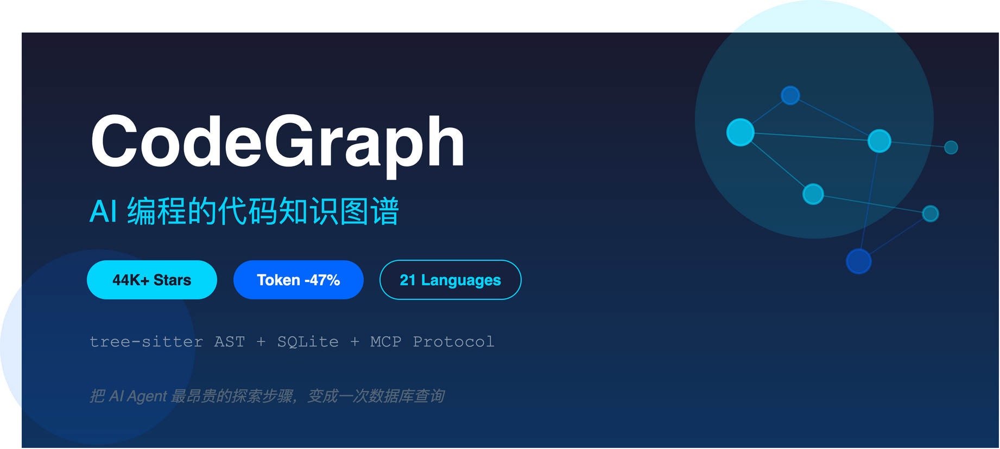
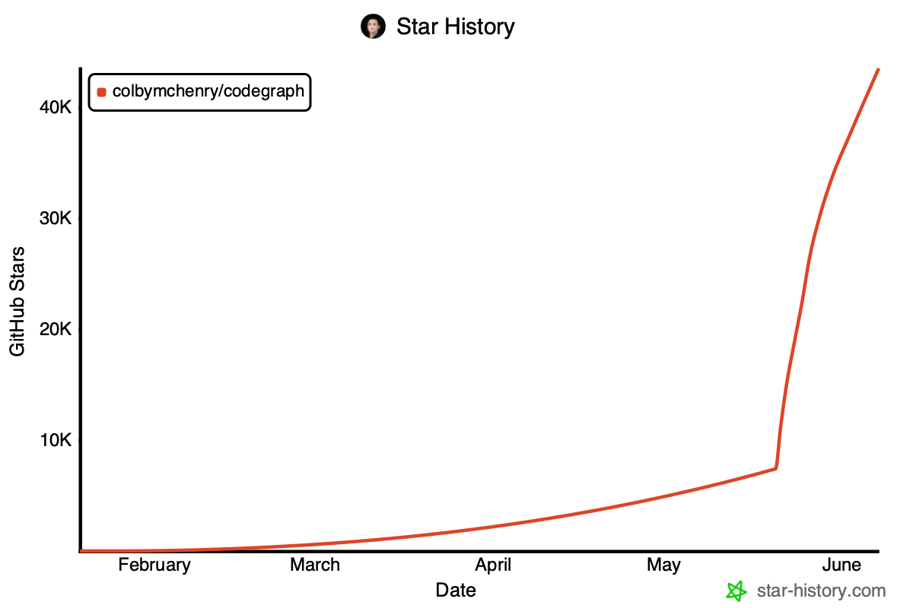
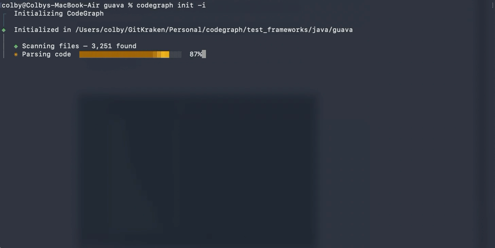
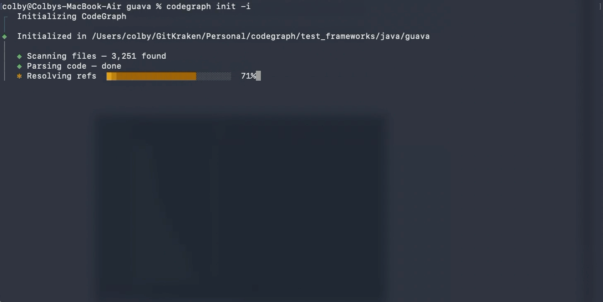
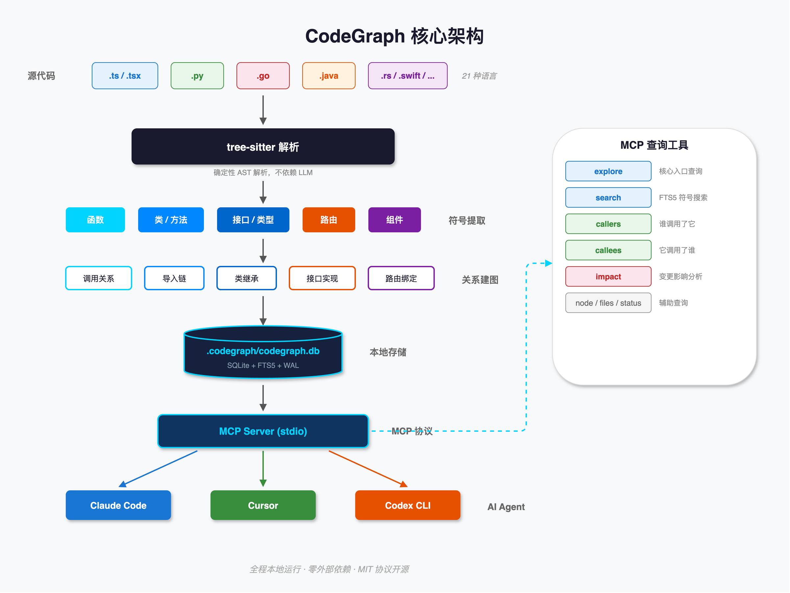

# 用了 CodeGraph 之后，Claude Code 的 Token 消耗几乎减半



上个月我盯着 Claude Code 的 Token 用量面板发了会儿呆。

一个"把 UserService 的鉴权逻辑抽到中间件"的任务，在一个 8000 多文件的 TypeScript 项目里，Claude 先启动了一个探索子 Agent，grep 了半天目录结构，又逐个 Read 了十几个文件，最后才搞清楚 UserService 被谁调用、鉴权逻辑散落在哪几个模块。**1.4M tokens 烧掉了**，真正动手改代码的部分不到三分之一。

剩下那三分之二去哪了？都交了"探索税"——Claude Code、Cursor、Codex CLI 这些工具，每次接到任务都要先把代码库翻个遍才能理解项目结构。启动子 Agent、调 grep、调 glob、调 Read，十几次工具调用下来，代码结构才算摸清。

CodeGraph 做的事情只有一件：**提前把这笔税交掉。** 用 tree-sitter 解析代码库的 AST，抽取符号，建立调用关系和导入链，存进本地 SQLite 数据库。AI Agent 再查"谁调用了 UserService.authenticate"，不用扫描文件——一次 MCP 工具调用，直接从图里拿结果。

两个月，GitHub 44000 Star。我用了一周，下面是我的记录。

## CodeGraph 到底是什么

一句话概括：**CodeGraph 是一个本地优先的代码知识图谱工具，专门为 AI 编程 Agent 而生。**

它做了四步：用 tree-sitter 把源代码解析成 AST，提取函数、类、方法等符号（**解析**）；在符号之间建立调用关系、导入链、类继承、接口实现等边（**建图**）；把整张图存进项目根目录下的 `.codegraph/codegraph.db`——一个本地 SQLite 数据库，启用了 FTS5 全文搜索，没有一个字节发到外部（**存储**）；最后通过 MCP 协议暴露查询工具给 AI Agent 调用（**服务**）。

关键特征是确定性：tree-sitter 解析不依赖 LLM 推理，不会"幻觉"。

| 资源 | 地址 |
|------|------|
| GitHub 仓库 | https://github.com/colbymchenry/codegraph |
| 官方文档站 | https://colbymchenry.github.io/codegraph/ |
| npm 包 | https://www.npmjs.com/package/@colbymchenry/codegraph |

项目使用 MIT 协议开源，TypeScript 编写（占比 92.6%），当前版本 v0.9.9，累计 418 次提交，146 个开放 PR。开发者 Colby McHenry 是一位独立开发者，商业化方向已经浮出水面——getcodegraph.com 展示了一个"CodeGraph 平台"的候补名单，承诺提供 PR 级别影响分析和测试推荐。

## Star 增长：两个月冲到 44000



这条 Star 曲线属于教科书级别的 hockey-stick：

- **2 月至 4 月中旬**：几乎为零
- **4 月下旬**：拐点出现，开始攀升
- **5-6 月**：指数增长，从几千直冲 44000

一篇来自 andrew.ooo 的评测提供了一个数据点：Star 数到 31000 时，**过去 7 天就新增了 21424 个**，当时位列 GitHub Trending 第二名。

这种增速的推手很直接：AI 编程用户基数在快速膨胀，"降低 AI 编程成本"是刚需；项目公开了完整的测试方法论，任何人都能跑出来验证；一行 curl 命令就能装好，不需要 Node.js、不需要 Docker、不需要 API Key。

## 5 分钟上手

安装体验是我用过的开发者工具里最顺滑的之一。自带运行时，不需要你本地装 Node.js。

**macOS / Linux**：

```bash
curl -fsSL https://raw.githubusercontent.com/colbymchenry/codegraph/main/install.sh | sh
```

**通过 npm**（已有 Node 环境）：

```bash
npm i -g @colbymchenry/codegraph
```

装完之后三步走：

```bash
# 1. 配置 Agent 集成（自动检测 Claude Code / Cursor / Codex 等 8 个 Agent）
codegraph install

# 2. 进入项目目录，初始化 + 建索引
cd your-project && codegraph init -i

# 3. 重启你的 AI Agent
```



索引速度：640 文件的 TypeScript 项目几秒钟搞定，VS Code 级别 10000 文件项目 1-2 分钟。

索引建完后，Agent 检测到 `.codegraph/` 目录就会自动加载 MCP 工具。你可以直接问：

- "UserService 的 authenticate 方法被谁调用了？"
- "修改 PaymentController 会影响哪些模块？"
- "/api/orders 这个路由对应的处理函数在哪？"

Agent 直接查图谱拿答案，不用再启动子 Agent 去 grep 整个项目。

## 实际用下来的感受

我拿了三个项目做测试：一个 2000 文件的 NestJS 后端、一个 800 文件的 React 前端、一个 300 文件的 Go 微服务。



**最明显的变化是工具调用次数的骤降。** 以前 Claude Code 接到一个重构任务，典型行为是先 grep 找文件、再逐个 Read、再 grep 找调用者、再 Read 调用者的上下文——一趟下来十几次工具调用是家常便饭。装了 CodeGraph 之后，一次 `codegraph_explore` 调用直接返回入口点、相关符号和代码片段，Agent 跳过了整个"摸底"环节。

**NestJS 项目效果最明显**——这个项目模块间依赖复杂，装饰器路由散落在几十个 Controller 里。之前问"哪些 Controller 调用了 AuthService"，Claude 要 grep `AuthService` 再逐个打开文件确认上下文，经常误判（比如只是 import 了但没实际调用）。CodeGraph 的 `codegraph_callers` 直接返回真实调用者，不含误判。

**Go 项目效果一般**——300 文件的项目 grep 本身就很快，CodeGraph 带来的边际收益不大。这跟官方 Benchmark 里 Gin（110 文件）的数据吻合：小项目的"探索税"本来就不高。

**有个场景特别值得提**：`codegraph_impact`（变更影响分析）。重构前我习惯先手动 trace 一遍调用链确认"改这个方法会炸掉哪些地方"。现在一个 `codegraph_impact` 调用就能看到完整的爆炸半径——直接调用者、间接调用者、受影响的路由、关联的测试文件。之前我做这种事要在编辑器里手动跳转四五层调用链，每次都怕漏掉什么。

但也有不顺的地方。**文件刚改完的前 2 秒是盲区**——CodeGraph 有个 2 秒防抖窗口，这期间查到的结果可能是过期的。如果你的 Agent 改完代码立刻查调用者，可能拿到旧数据。实际操作中我没怎么踩到这个坑，因为 Agent 通常改完代码后不会立刻回头查同一个符号，但值得知道。

还有一个预期管理的问题：**CodeGraph 不做语义搜索。** 你问"那个处理用户有两个邮箱的边界 case 在哪"，它回答不了。它只能回答结构化问题——谁调用了谁、谁实现了什么接口、哪个路由绑了哪个 handler。语义搜索得靠 Claude Context 或 Cursor 的 Codebase Index 这类向量方案。

## 性能数据：到底能省多少

项目官方在 7 个真实开源项目上做了基准测试，方法论公开透明：`claude -p`（headless 模式），`--strict-mcp-config`，每个配置跑 4 次取中位数。

### Opus 4.8 基准（2026 年 6 月 2 日）

| 项目 | 文件数 | 成本节省 | Token 减少 | 工具调用减少 |
|------|--------|---------|-----------|------------|
| VS Code | ~10k | 18% | 64% | 81% |
| Excalidraw | ~640 | 持平 | 25% | 40% |
| Django | ~3k | 8% | 60% | 77% |
| Tokio | ~790 | 持平 | 38% | 57% |
| OkHttp | ~645 | 25% | 54% | 50% |
| Gin | ~110 | 19% | 23% | 44% |
| Alamofire | ~110 | 40% | 64% | 58% |
| **平均** | | **~16%** | **~47%** | **~58%** |

几个关键观察：

**项目越大收益越明显。** VS Code（10000 文件）的工具调用从 55 次降到 8 次，减少 81%。Gin（110 文件）只减少 44%。这符合直觉——小项目的探索成本本来就低。

**Token 减少（47%）和成本节省（16%）之间有差距。** 这是因为 CodeGraph 的 MCP 工具响应本身也占 Token——它返回的符号信息和代码片段也要计入上下文。所以"Token 减少近半"是准确的，但不等于"费用减半"。成本节省的实际数字更像 15-25% 这个区间。

**社区实战数据更激进**：一位 Reddit 用户说在 20 万行 Java 服务上"平均会话成本从 $4 降到 $1.50"——节省 62.5%。大型、模块依赖复杂的项目收益确实更可观。

**诚实的局限**：每个项目只测了一个问题，真实场景不同类型问题收益差异很大。Excalidraw 和 Tokio 成本持平，说明对某些代码结构 grep 已经足够高效。

## 值得关注的进阶能力

除了基本的符号查询，有几个功能我认为被低估了：

**路由检测**——CodeGraph 能识别 14 个 Web 框架的路由定义（Django、Express、NestJS、Spring、Gin、Rails 等），自动关联 URL 路径和处理函数。问 Agent "/api/users 对应的处理逻辑在哪"，直接给答案，不用在路由配置文件里翻。这个对后端项目特别实用。

**跨语言桥接**——Swift/ObjC 互操作、React Native Bridge、Expo Modules 这些跨语言边界，CodeGraph 通过启发式规则建立关联。每条桥接边标记了 `provenance: 'heuristic'`，让 Agent 知道这是推断而非 AST 直接解析的。做移动端的同学会感受到这个的价值。

**CI/CD 集成**——`codegraph affected` 命令能根据 git diff 追溯依赖链，找出受影响的测试文件：

```bash
git diff --name-only HEAD | codegraph affected --stdin --quiet
```

在大型单仓项目里，这比"全量跑测试"高效得多。

**编程式 API**——如果你想在自己的工具链中集成 CodeGraph，可以直接用 TypeScript API。需要 Node 22.5+ 的内置 `node:sqlite`。

## 和其他工具怎么选

| 工具 | 方案 | 擅长 | 不足 |
|------|------|------|------|
| **CodeGraph** | AST 符号图 + SQLite | 结构查询、重构分析 | 不支持语义搜索 |
| Claude Context | BM25 + 嵌入向量 | 语义/模糊查询 | 需要向量数据库 |
| Cursor Codebase Index | 云端嵌入 | Cursor 用户开箱即用 | 仅限 Cursor |
| Sourcegraph Cody | 混合方案 + 图 | 企业级 | 基础设施重 |

我现在的做法是两类工具同时开着。CodeGraph 回答结构化问题（谁调用了 X、这个路由的 handler 在哪），向量方案回答语义问题（那个处理邮箱去重的逻辑在哪）。两套 MCP 同时挂着不冲突，Agent 会自己选。

## 该不该装

**装的理由**：
- 项目超过 1000 文件，AI Agent 的探索成本已经是个实际问题
- 经常做跨模块重构，需要频繁查调用链和影响范围
- 团队里多人用不同的 AI 工具（CodeGraph 通过 MCP 协议跨工具兼容）

**不装的理由**：
- 小项目（300 文件以下），grep 本身就够快
- 纯前端项目且只用 Cursor 内置的 codebase index
- 代码库语言不在 21 种支持列表内

我自己的体感：装了之后不太想卸。不是因为省了多少钱——说实话日常开发的 Token 费用我没有精确计算过——而是 Agent "摸底"的等待时间明显缩短了。以前一个重构任务前 5 分钟都在看 Agent 翻文件，现在几乎是直接开干。



---

**资料状态**

| 来源 | 状态 | 说明 |
|------|------|------|
| GitHub 仓库页面 | 成功 | 通过 WebFetch 获取完整 README 和项目信息 |
| 官方文档站 | 成功 | 获取了首页、Introduction、Quickstart、Languages 四个页面 |
| npm 包页面 | 失败 | 403 Forbidden，npm 反爬限制 |
| getcodegraph.com | 失败 | 403 Forbidden，可能有 Cloudflare 防护 |
| Star History 趋势图 | 成功 | SVG 下载并转换为 PNG |
| 英文评测文章 | 成功 | andrew.ooo、bighatgroup.com、pyshine.com 等 |
| 中文技术文章 | 成功 | cnblogs、CSDN、知乎、掘金等平台文章 |
| ATA 内部文章 | 未使用 | ATA MCP 需要登录授权，未完成认证 |
