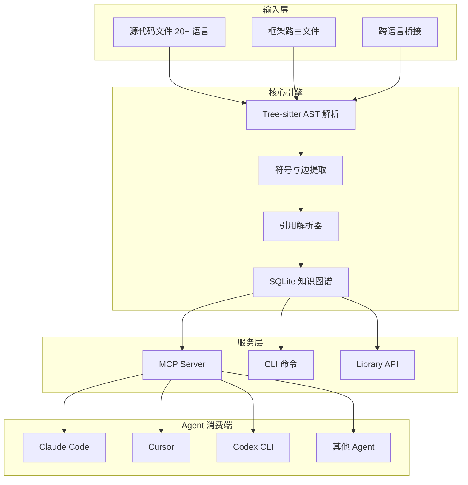
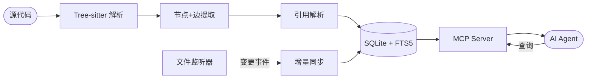

# 你的 AI 编码 Agent 还在逐文件 grep？CodeGraph 一条命令让它拿到全局代码地图

> 一个预索引代码知识图谱，让 Claude Code、Cursor、Codex 等 Agent 减少 58% 工具调用，提速 22%，文件读取降至接近零。

## 1. 一句话定位

**CodeGraph** 是一个 100% 本地运行的代码知识图谱工具——对你的代码库做一次索引，AI Agent 就能用一次 `codegraph_explore` 调用拿到精准的符号关系、调用链和影响范围，不再逐文件爬取。

| 维度 | 数据 |
|---|---|
| 仓库 | [colbymchenry/codegraph](https://github.com/colbymchenry/codegraph) |
| 语言 | TypeScript / JavaScript (Node.js) |
| License | MIT |
| 支持 Agent | Claude Code, Cursor, Codex CLI, opencode, Hermes Agent, Gemini CLI, Antigravity IDE, Kiro |
| 支持语言 | 26 种（TS/JS/Python/Go/Rust/Java/C#/PHP/Ruby/C/C++/ObjC/Metal/Swift/Kotlin/Scala/Dart/Svelte/Vue/Astro/Liquid/Pascal/Lua/R/Luau/CFML） |
| 安装方式 | `curl` 一键安装 / `npm i -g` / `npx` |

## 2. 解决了什么问题

当 AI Agent 需要理解代码结构时，典型的行为是：

```
grep → 找到符号 → Read 文件 → 追踪 import → Read 更多文件 → 终于开始干活
```

这个"发现结构"的过程在每次任务中重复，浪费 60-70% 的 token 预算。

CodeGraph 的解法很直接：**用 Tree-sitter 做一次全量解析，把符号、调用边、依赖关系存进本地 SQLite，Agent 直接查图拿结果。**

类比：搜索引擎在 1998 年学到的教训——你可以每次查询都重新 grep 全网，也可以建倒排索引直接查。CodeGraph 就是代码库的倒排索引。

## 3. 核心特性

| 特性 | 说明 |
|---|---|
| **精准上下文** | 一次工具调用返回入口点、相关符号和代码片段——不再逐文件探索 |
| **全文搜索** | FTS5 驱动，按名称即时定位全代码库符号 |
| **影响分析** | 修改前追踪 callers、callees 和完整影响半径 |
| **自动同步** | 原生 OS 事件（FSEvents/inotify）+ 2 秒防抖，改代码图谱即更新 |
| **26 种语言** | 覆盖主流语言及 Svelte/Vue/Astro/Liquid/Pascal/Lua/R/Luau/CFML 等 |
| **框架路由感知** | 跨 17 个框架识别 URL 路由到 handler 的映射关系 |
| **跨语言桥接** | Swift↔ObjC、React Native Bridge、Expo Modules、Fabric 全覆盖 |
| **100% 本地** | 无数据外传，无 API Key，SQLite 存储，适合企业合规 |

<!-- IMAGE_PROMPT: gpt-image2
生成一张专业技术架构信息图，标题：「CodeGraph 功能结构全景图」。

布局：
- 顶部：CodeGraph + "Pre-indexed Code Knowledge Graph" + MIT 徽章
- 左侧输入层：源代码文件（20+ 语言）、框架路由文件、跨语言桥接文件
- 中间核心层：6 个功能模块——Tree-sitter 解析器、符号提取引擎、引用解析器、SQLite 知识图谱(FTS5)、文件监听器(Auto-sync)、MCP 服务器
- 底部支撑层：SQLite WAL 模式、原生 OS 事件(FSEvents/inotify)、Node.js 运行时
- 右侧输出层：codegraph_explore 响应（源码 + 调用链 + 影响半径）

视觉风格：
- 现代扁平技术架构图，16:9 画幅
- 主色 #3366CC，辅色 #5B8FF9，背景浅灰 #F7F8FA
- 模块间用清晰箭头连接，体现从源码到 Agent 响应的流程
- 中文标签清晰可读，字体 PingFang SC
- 不使用真实公司 Logo
-->

## 4. 架构设计

### 4.1 整体架构



### 4.2 数据流



### 4.3 核心设计思想

- **预索引 vs 即时发现**：将 O(n) 的运行时文件爬取变成 O(1) 的图查询
- **单工具哲学**：`codegraph_explore` 一个工具覆盖 90% 场景，减少 Agent 决策成本
- **三层保鲜机制**：文件监听 + 防抖 + 连接时追赶同步，图谱永不过时
- **跨 Agent 共享**：一份 `.codegraph/` 索引服务所有支持 MCP 协议的 Agent

## 5. 社区热点（Issues 分析）

### 5.1 社区讨论要点

| 话题 | 讨论内容 |
|---|---|
| 大型仓库表现 | Swift 编译器（25,874 文件）索引不到 4 分钟，单问题 35 秒内回答 |
| 竞品对比 | Reddit 讨论指出 GitNexus 在跨仓准确度上更深，但 CodeGraph 在多 Agent 集成上优势明显 |
| 成本收益 | 小仓库（<1000 文件）收益不明显，5000+ 文件开始产生实质 token 节省 |
| 缺失能力 | 暂不支持跨仓库图谱、commit 级语义版本、概念级边（非语法边） |

### 5.2 社区健康度

- **维护响应**：作者 Colby McHenry 活跃维护，已发布 1.0 正式版
- **社区热度**：上线首日 2,434 Star，GitHub Trending #2
- **文档完整度**：README 极其详尽，覆盖安装/配置/Benchmark/故障排除
- **维护状态**：**快速成长期**——1.0 刚发布，功能快速迭代中

## 6. 竞品对比

| 维度 | CodeGraph | GitNexus | Understand-Anything | Repo Wiki (内置) |
|---|---|---|---|---|
| 核心定位 | AI Agent 的代码知识图谱 | 跨仓库深度代码分析 | 交互式代码知识图谱可视化 | IDE 内置语义索引 |
| Agent 支持 | 8 种 Agent | 有限 | 有限 | 单一绑定 |
| 索引方式 | Tree-sitter + SQLite | LLM-enhanced | 图数据库 | 各家私有方案 |
| 隐私 | 100% 本地 | 需确认 | 需确认 | 本地 |
| 跨语言桥接 | Swift/ObjC/RN/Expo | 部分 | 不支持 | 不支持 |
| 适合场景 | 多 Agent 工作流、大仓库 | 企业级跨仓分析 | 代码可视化探索 | 轻量单 Agent |

## 7. 快速上手

```bash
# macOS / Linux 一键安装
curl -fsSL https://raw.githubusercontent.com/colbymchenry/codegraph/main/install.sh | sh

# 或通过 npm
npm i -g @colbymchenry/codegraph
```

```bash
# 连接到你的 Agent
codegraph install

# 初始化项目（索引 + 自动同步）
cd your-project
codegraph init
```

三步完成。之后 Agent 会自动使用 CodeGraph——只要项目目录存在 `.codegraph/`。

### 常用命令速查

```bash
codegraph explore "how does X work"    # 一站式查询
codegraph callers <symbol>              # 谁调用了这个符号
codegraph impact <symbol>               # 修改影响范围
codegraph affected src/utils.ts         # 哪些测试受影响
codegraph status                        # 索引状态
codegraph upgrade                       # 升级到最新版
```

## 8. Benchmark 实测

在 7 个真实开源代码库上，对比 Agent 有/无 CodeGraph 的表现（Claude Opus 4.8，4 次中位数）：

| 代码库 | 语言 | 工具调用减少 | 速度提升 | 文件读取 | Token 减少 | 成本节省 |
|---|---|---|---|---|---|---|
| VS Code | TypeScript ~10k 文件 | 81% | 11% | 0 vs 9 | 64% | 18% |
| Excalidraw | TypeScript ~640 | 40% | 27% | 0 vs 7 | 25% | 持平 |
| Django | Python ~3k | 77% | 13% | 0 vs 9 | 60% | 8% |
| Tokio | Rust ~790 | 57% | 18% | 0 vs 8 | 38% | 持平 |
| OkHttp | Java ~645 | 50% | 31% | 0 vs 4 | 54% | 25% |
| Gin | Go ~110 | 44% | 24% | 1 vs 6 | 23% | 19% |
| Alamofire | Swift ~110 | 58% | 33% | 0 vs 9 | 64% | 40% |

> 测试环境：Claude Opus 4.8 Headless，每组 4 次取中位数，2026-06-02 重新验证。Token/Cost 节省与代码库规模正相关——小项目主要获得精准度和速度提升，大型代码库 + 团队日常使用时成本节省显著。

**通用结论**：58% fewer tool calls · 22% faster · file reads cut to ~zero · Token 消耗平均减少 47%。

## 9. 技术亮点深挖

### 9.1 单工具设计哲学

CodeGraph 的 MCP 接口只暴露一个主工具 `codegraph_explore`：

```
一次调用 → 返回相关符号源码 + 调用路径 + 影响半径
```

其他工具（`codegraph_node`/`codegraph_search`/`codegraph_callers` 等）保留功能但默认不列出。这不是偷懒——经过实测，单工具比多工具菜单让 Agent 决策更准确，每次会话节省一次"选哪个工具"的思考成本。

### 9.2 三层保鲜机制

```
Agent 写入文件 → 文件监听器触发 (<100ms)
                → 防抖等待 (默认 2s)
                → 增量同步完成
                → 下次查询拿到最新数据
```

防抖窗口期内，如果 Agent 查询了待同步文件，MCP 响应会附带 ⚠️ 标注让 Agent 直接 Read 该文件——不会返回过期数据。

### 9.3 框架路由感知

CodeGraph 识别 17 个 Web 框架的路由声明，建立 URL → Handler 的引用边。查询某个 Controller 的 callers 时，会自动浮出绑定它的路由路径——这是 grep 做不到的结构化关系。

### 9.4 Library 嵌入模式

```typescript
import CodeGraph from '@colbymchenry/codegraph';

const cg = await CodeGraph.init('/path/to/project');
await cg.indexAll({ onProgress: (p) => console.log(`${p.phase}: ${p.current}/${p.total}`) });

const results = cg.searchNodes('UserService');
const callers = cg.getCallers(results[0].node.id);
const impact  = cg.getImpactRadius(results[0].node.id, 2);

cg.watch();   // 开启自动同步
cg.close();
```

## 10. 适合谁用

| 场景 | 推荐度 |
|---|---|
| 代码库 > 5000 文件，每月 Agent 账单 > $200 | 强烈推荐 |
| 多 Agent 工作流（Claude + Codex + Cursor 切换） | 强烈推荐 |
| 企业合规要求代码不出本地 | 强烈推荐 |
| 大型 iOS 项目（Swift/ObjC/RN 混合） | 强烈推荐 |
| 小型项目 < 500 文件 | 收益有限，可观望 |
| 只用单一 Agent 且无切换计划 | 可用但非必须 |

## 11. 平台与环境支持

| 平台 | 架构 | 安装方式 |
|---|---|---|
| macOS | x64 / arm64 | shell 安装脚本 或 npm |
| Linux | x64 / arm64 | shell 安装脚本 或 npm |
| Windows | x64 / arm64 | PowerShell 安装脚本 或 npm |

自带运行时（Bundled Runtime），无需系统安装 Node.js。Library 嵌入模式需 Node 22.5+。

## 12. 配置（可选）

CodeGraph **零配置即可工作**。默认排除 `node_modules`、`vendor`、`dist`、`build`、`.venv`、`Pods` 等依赖/构建目录，以及 `.gitignore` 列出的所有路径和大于 1MB 的文件。

如需额外排除或自定义扩展名，在项目根目录创建 `codegraph.json`：

```json
{
  "exclude": ["static/", "**/vendor/**"],
  "extensions": {
    ".dota_lua": "lua",
    ".tpl": "php"
  }
}
```

修改映射后执行 `codegraph index` 重建索引。

## 13. CI/CD 集成：affected 命令

`codegraph affected` 可追踪 import 依赖链，找出哪些测试文件受变更影响：

```bash
# 找出当前 diff 影响的测试文件
git diff --name-only | codegraph affected --stdin

# 只运行受影响的测试（CI hook 示例）
AFFECTED=$(git diff --name-only HEAD | codegraph affected --stdin --quiet)
if [ -n "$AFFECTED" ]; then
  npx vitest run $AFFECTED
fi
```

支持 `--depth`（默认 5）控制传递深度，`--filter` 自定义测试文件 glob 模式。

## 14. 跨文件覆盖率实测

影响分析（impact/blast-radius）依赖图谱边的完整度。CodeGraph 在真实项目上测量的跨文件覆盖率：

| 语言 | 基准项目 | 覆盖率 |
|---|---|---|
| TypeScript/JS | CodeGraph 本身 | 95.8% |
| Python | psf/requests | 100% |
| Go | gin-gonic/gin | 96.6% |
| Rust | BurntSushi/ripgrep | 86.7% |
| Java | google/gson | 93.3% |
| Swift | Alamofire | 95.3% |
| C | redis/redis | 92.2% |
| C++ | google/leveldb | 94.8% |
| Kotlin | square/okhttp | 96.2% |
| Vue/Nuxt | nuxt/movies | 93.5% |

框架路由覆盖率：Express 100%、FastAPI 98%、Flask 100%、NestJS 96.8%、Gin 96.5%、Laravel 92%、Rails 89.6%、Django 74.1%。

## 15. 总结

CodeGraph 做了一件很朴素但极其有效的事：**把 AI Agent 每次重复的代码发现过程，变成了一次性的图谱构建。**

对于中大型代码库，这意味着：
- Agent 回答代码问题从 2 分钟缩短到 1 分钟
- 每次任务少花 50%+ 的 token（大型仓库可达 64%）
- 切换 Agent 无需重建索引
- CI 中用 `codegraph affected` 只跑受影响的测试

即将到来的 **CodeGraph Platform（getcodegraph.com）** 将提供托管版服务：每个 PR 自动告知你该测什么、什么可能 break、哪些业务流程受影响。

一行命令安装，零配置开始工作。如果你正为 AI 编码 Agent 的效率和成本头疼，CodeGraph 值得花 10 分钟试一下。

```bash
curl -fsSL https://raw.githubusercontent.com/colbymchenry/codegraph/main/install.sh | sh
codegraph install && cd your-project && codegraph init
```

---

<!-- IMAGE_PROMPT: gpt-image2
为 CodeGraph (TypeScript 开源项目) 设计封面图。
主题：AI Agent 的代码地图——一次索引，精准定位
风格：现代极简，主色 #3366CC，辅色 #5B8FF9
画面中心：一个发光的知识图谱网络节点图，节点代表代码符号（函数、类），边代表调用关系，左侧有一个 AI 机器人头像在查询图谱
右上角：MIT License 徽章
画幅 16:9，适合公众号/博客首图
-->
