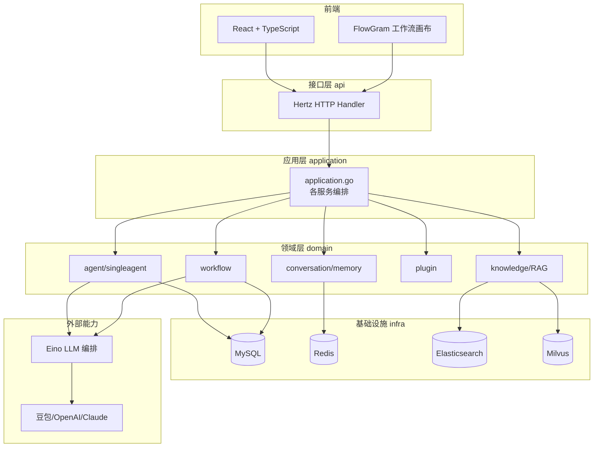
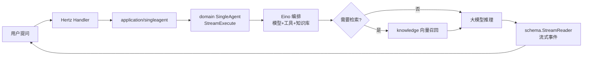
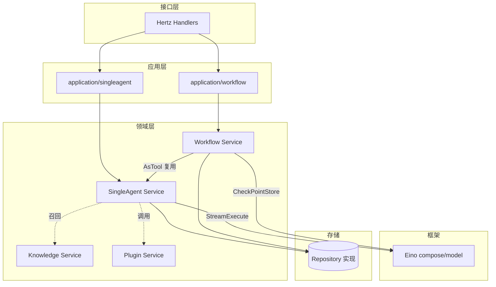

# Coze Studio 源码拆解：字节把服务过百万开发者的 Agent 平台，整套开源了

> 2025 年 7 月，字节跳动把商业产品 Coze（扣子）的核心引擎完整开源，取名 Coze Studio，协议直接给了 Apache-2.0。48 小时冲上 9K star，如今 21.2k。它不是"体验版"或"阉割版"——后端是一套教科书级的 Go 微服务 + DDD 架构，前端 React + TypeScript，Docker 一键拉起 MySQL/Redis/Elasticsearch/Milvus 全套依赖。这篇文章从源码视角拆开它：一个能生产落地的 AI Agent 平台，代码到底怎么组织。

## 1. 项目速览

| 项目 | 内容 |
|---|---|
| 项目名称 | Coze Studio |
| 一句话定位 | 一站式可视化 AI Agent 开发平台（扣子开发平台的开源内核） |
| GitHub 地址 | [coze-dev/coze-studio](https://github.com/coze-dev/coze-studio) |
| 母产品 | Coze / 扣子（字节跳动，服务上万企业、数百万开发者） |
| 后端 | Golang（>= 1.23.4），微服务 + DDD |
| 前端 | React + TypeScript |
| 核心框架 | Eino（LLM 编排）、Hertz（HTTP）、CloudWeGo（微服务治理）、FlowGram（前端工作流画布） |
| 开源协议 | Apache-2.0（商业友好） |
| Star / Fork | ⭐ 约 21.2k / 🍴 3.1k |
| 部署 | Docker Compose，最低 2C4G |
| 默认模型 | 火山方舟 doubao-seed-1.6（可换 OpenAI/Claude） |
| 适合人群 | 想私有化搭 Agent 平台的团队、想读大厂级 DDD 后端的 Go 开发者 |

## 2. 它解决了什么问题

想做一个能查知识库、能调外部 API、还能按业务流程编排的 AI 助手，从零写要处理一堆脏活：多模型接入、RAG 检索、插件鉴权、工作流的分支循环、会话记忆、发布版本管理……每一块都不小。

Coze 商业版把这些都做完了，但闭源、要钱、数据在别人手里。Coze Studio 的意义就在这：**它把商业版的核心引擎原样搬出来开源**，你在自己机器上 `docker compose up`，就有一个和扣子官网体感接近的可视化 Agent 平台——零代码/低代码拖拽建 agent、连知识库、配插件、画工作流，还带 OpenAPI 和 Chat SDK 能嵌进自己的业务。

要说实话的地方也得说：它 2025 年 7 月才开源，文档还在 Wiki 里慢慢补，社区插件生态跟深耕两年的 Dify 比还差一截。README 里那段安全警告也很直白——公网部署要自己评估账号注册、工作流 Python 代码节点执行、SSRF 等一堆风险。这是"大厂内部系统突然开源"的典型状态：内核很硬，外围还在长。

## 3. 核心功能特性

### 3.1 六大能力模块

- **模型服务**：统一管理模型列表，接 OpenAI、火山方舟、Claude 等，靠 Eino 的模型抽象屏蔽差异
- **智能体（Agent）**：可视化建 agent，挂知识库、插件、工作流等资源，一键发布
- **应用（App）**：把 agent + 工作流组合成完整应用发布
- **工作流（Workflow）**：拖拽节点画业务逻辑，支持条件分支、循环，是平台的中枢
- **资源体系**：插件、知识库、数据库、Prompt 统一当"资源"管理
- **API & SDK**：OpenAPI 发起会话，Chat SDK 把 agent 嵌进自己的网站/App

### 3.2 值得单独拎出来的设计

- **多模型不锁定**：底层用豆包、GPT-4 还是 Claude，对上层业务透明，靠成本/合规随时切
- **RAG 内建**：知识库模块集成向量检索（Docker 里默认起了 Milvus），直接解决模型幻觉和私域知识
- **工作流即工具**：一个工作流可以被 agent 当成一个"工具"来调用（源码里的 `AsTool` 接口），这是编排能力复用的关键
- **断点续跑**：工作流引擎接了 Eino 的 checkpoint 机制，长流程能中断、恢复、取消

### 3.3 功能边界

- ✅ 适合：私有化部署一套 Agent 平台；POC 快速验证 AI 应用想法；中小团队没有算法团队也能落地
- ❌ 不适合：只想要个轻量对话机器人（杀鸡用牛刀，起一堆中间件）；对开箱即用文档要求极高的（Wiki 还在完善）
- ⚠️ 注意：公网部署前务必读 README 的安全警告；工作流代码节点能跑 Python，是把双刃剑

<!-- IMAGE_PROMPT: gpt-image2
生成一张「Coze Studio 功能结构全景图」信息图。

布局：
- 顶部标题：Coze Studio 一站式 AI Agent 开发平台 + 副标题「字节跳动开源 · Apache-2.0」+ ⭐ 21k 徽章
- 左侧输入层：可视化画布（拖拽建 agent/工作流）、OpenAPI、Chat SDK
- 中间核心层（DDD 三层竖向排列）：接口层 API(Hertz) → 应用层 Application(编排) → 领域层 Domain(agent/workflow/knowledge/plugin) → 基础设施层 Infra
- 底部支撑层：Eino(LLM编排) / MySQL / Redis / Elasticsearch / Milvus 向量库，全部 Docker 容器
- 右侧输出层：可发布的 Agent、App、Workflow + 多模型(豆包/OpenAI/Claude)

视觉风格：
- 现代企业级微服务架构图，干净克制，16:9 画幅
- 主色 #3366CC，辅色 #5B8FF9，浅色背景
- 分层用不同色块，模块间清晰箭头
- 中文文字清晰可读，PingFang SC 字体
-->

## 4. 架构设计

### 4.1 整体架构

Coze Studio 后端是一套标准四层 DDD：接口层暴露 HTTP，应用层做编排，领域层是业务核心，基础设施层隔离外部依赖。前端 React + FlowGram 画布，全部靠 Docker Compose 编排起来。



### 4.2 一次 Agent 对话的数据流



### 4.3 核心设计思想

- **四层 DDD，领域是灵魂**：`domain/` 下 17 个子域（agent、workflow、knowledge、plugin、memory、conversation……），每个子域再按 `entity / repository / service / internal` 战术分层。业务边界清晰，改一个域不牵连别的
- **接口与实现彻底分离**：领域对外只暴露 `Service` 和 `Repository` 接口，实现藏在 `internal/`，还用 `mockgen` 自动生成 mock。这是"可测试、可替换"的地基
- **Eino 贯穿始终**：模型抽象、RAG、工作流编排全建在 Eino 之上。换模型不改业务、工作流断点续跑用 Eino 的 checkpoint，都靠它
- **一切皆资源**：agent、workflow、plugin、knowledge、database 在概念上统一成"资源"，可互相引用、组合、发布

## 5. 源码深度分析

> 本次聚焦 `backend/domain` 下两个最能体现平台价值的核心域：`workflow`（工作流引擎，平台中枢）和 `agent/singleagent`（智能体运行时）。这两个域的对外接口文件，最能看出 Coze Studio 的架构品味。大型 monorepo 无法全读，其余域（knowledge/plugin/memory 等）遵循同一套 DDD 战术分层，此处不展开。

### 5.1 模块全景

| 模块 | 目录 | 核心职责 | 分析级别 |
|---|---|---|---|
| 工作流域 | `domain/workflow` | 工作流的增删改查、发布、执行、作为工具 | P0 深度 |
| 智能体域 | `domain/agent/singleagent` | agent 草稿/发布/流式执行 | P0 深度 |
| 知识库域 | `domain/knowledge` | RAG 索引与向量召回 | P1 关键流程 |
| 插件域 | `domain/plugin` | 插件注册、鉴权、调用 | P1 关键流程 |
| 应用层 | `application/*` | 编排领域对象、暴露给接口层 | P1 关键流程 |
| 会话/记忆 | `domain/conversation`、`domain/memory` | 会话上下文与长期记忆 | P2 说明 |
| 基础设施 | `infra/*` | idgen、storage、DB 等外部依赖抽象 | P2 说明 |
| 接口层 | `api/*` | Hertz handler + 模型定义 | P2 说明 |

### 5.2 工作流域：一个接口看懂"教科书级 DDD"

`domain/workflow/interface.go` 是全项目最值得读的文件之一。它把领域对外契约拆成两个接口：`Service`（业务操作）和 `Repository`（持久化）。

```go
type Service interface {
    ListNodeMeta(ctx context.Context, nodeTypes map[entity.NodeType]bool) (...)
    Create(ctx context.Context, meta *vo.MetaCreate) (int64, error)
    Save(ctx context.Context, id int64, schema string) error
    Publish(ctx context.Context, policy *vo.PublishPolicy) (err error)
    // ...
    Executable   // 工作流可被执行
    AsTool       // 工作流可作为工具被 agent 调用
    ChatFlowRole
    Conversation
}
```

几个直接能学的点：

- **接口组合而非大杂烩**：`Service` 里内嵌了 `Executable`、`AsTool`、`ChatFlowRole`、`Conversation` 这些小接口。Go 的接口组合用得很干净——工作流"能执行""能当工具""能聊天"这几种角色被拆成正交的能力，谁需要谁引用
- **`AsTool` 是点睛之笔**：工作流不只是被用户点"运行"，它还能被一个 agent 当成一个可调用的工具。这意味着"用工作流编排能力 → 封装成工具 → 喂给 agent"这条复用链路是打通的。平台的组合能力就靠这个撑起来
- **Repository 分离持久化**：几十个 `MGet/Create/Update` 方法全在 `Repository` 接口里，`Service` 只管业务。改存储实现不碰业务逻辑

再看它的依赖，能确认 Eino 的核心地位：

```go
import (
    "github.com/cloudwego/eino/compose"
    // ...
)

type Repository interface {
    // ...
    InterruptEventStore   // 中断事件
    CancelSignalStore     // 取消信号
    ExecuteHistoryStore   // 执行历史
    compose.CheckPointStore  // Eino 的检查点存储
    GetKnowledgeRecallChatModel() modelbuilder.BaseChatModel
}
```

`compose.CheckPointStore` 来自 Eino，工作流的**断点续跑**能力直接复用了 Eino 的 checkpoint 机制。`InterruptEventStore` / `CancelSignalStore` / `ExecuteHistoryStore` 三件套，说明这个工作流引擎是奔着"长时运行、可中断、可追溯"的生产级编排去设计的，而不是简单的顺序执行器。代价是——接口相当重，几十个方法，新人上手需要时间。

### 5.3 智能体域：流式执行是一等公民

`domain/agent/singleagent/service/single_agent.go` 定义了 agent 的领域服务接口，核心方法一眼就点出了设计取向：

```go
type SingleAgent interface {
    // 流式执行：返回 Eino 的 StreamReader，实时吐事件
    StreamExecute(ctx context.Context, req *AgentRequest) (
        *schema.StreamReader[*entity.AgentRespEvent], error)

    CreateSingleAgentDraft(ctx context.Context, creatorID int64,
        draft *entity.SingleAgent) (agentID int64, err error)
    UpdateSingleAgentDraft(ctx context.Context, agentID int64,
        updated *entity.SingleAgent) error
    // 发布、版本、查询 ...
}
```

- **`StreamExecute` 返回 `schema.StreamReader`**：agent 执行天生是流式的，返回 Eino 的 `StreamReader` 逐事件推送。对话式 AI 要的就是"边想边说"的打字机效果，把流式做成接口的一等返回值，而不是事后加的 SSE 补丁，这个取舍很对
- **草稿与发布分离**：`CreateSingleAgentDraft` / `UpdateSingleAgentDraft` 说明 agent 有完整的草稿态 → 发布态生命周期。你在画布上调 agent 都是改草稿，点发布才生成正式版本。这是给"多人协作、灰度上线"留的口子
- **实现藏在 internal**：接口在 `service/single_agent.go`，实现在 `single_agent_impl.go` 和 `internal/`。对外只给契约，符合前面 workflow 一样的分离原则

### 5.4 模块关系全景



## 6. 社区热点与维护现状

Coze Studio 2025 年 7 月开源即爆——48 小时 9K star，现在 21.2k、3.1k fork。字节这次是把开发平台（Coze Studio）、运维评测工具（Coze Loop）、编排框架（Eino）一起放出，凑齐了 Agent 开发-评测-运维的全链路开源拼图。

从 Issues 和讨论看，几个高频话题：

- **"这会不会杀死 Dify/FastGPT"**（[Issue #2](https://github.com/coze-dev/coze-studio/issues/2) 直接开麦讨论）：社区最关心它对现有开源竞品的冲击。字节下场，商业友好的 Apache-2.0，确实让人紧张
- **部署踩坑**：中间件起得多（MySQL/Redis/ES/Milvus），首次拉镜像慢、2C4G 只是最低配，实际跑得吃力，是新手最常见的问题
- **模型配置门槛**：默认绑火山方舟豆包，要改别的模型得手动复制 `backend/conf/model/template/` 下模板改 YAML，对不熟的人不算直观
- **Roadmap 透明**：官方维护了 [Q4 2025 Roadmap（#2218）](https://github.com/coze-dev/coze-studio/issues/2218)，维护态度是认真的

社区健康度：**高热度、快速成长期**。字节官方团队在维护，Roadmap 公开，但项目太新，文档、插件生态、疑难 case 的沉淀还需要时间。属于"值得押注但要接受它还在长身体"的阶段。

## 7. 竞品对比

| 维度 | Coze Studio | Dify | FastGPT | n8n |
|---|---|---|---|---|
| 出身 | 字节跳动开源 | 独立开源公司 | 国内开源 | 通用自动化平台 |
| 定位 | Agent 开发平台 | LLMOps 平台 | 企业知识库问答 | 工作流自动化 |
| 架构 | Go 微服务 + DDD | Python | Node/TS | Node |
| 交互体验 | 强（承袭扣子） | 中上 | 中 | 强（但偏通用） |
| RAG 能力 | 内建 Milvus | 强 | 深耕知识库 | 靠插件 |
| 工作流 | FlowGram 画布 + workflow-as-tool | 有 | 有 | 最强（通用编排） |
| 社区成熟度 | 新（2025.7 起步） | 高、全球化 | 中 | 高 |
| 协议 | Apache-2.0 | 有商业限制条款 | 有限制 | Fair-code |

说句公道话：**要论社区成熟度和文档，Dify 现在仍然更稳**——它深耕 LLMOps 两年，全球开发者社区大，遇到问题更容易搜到答案。FastGPT 在企业知识库这个垂直场景做得扎实，但工具生态偏弱。n8n 的通用工作流编排最强，但它不是为 LLM Agent 而生。

Coze Studio 的差异化在两点：一是**交互体验**，承袭扣子的可视化打磨，建 agent、画工作流的顺手程度是它的看家本领；二是**架构**，Go 微服务 + 教科书 DDD，天生适合高并发和二次开发，这是 Python 系竞品比不了的工程底子。再加上 Apache-2.0 比 Dify 的商业限制条款友好。如果你要的是私有化、可深度改造、扛得住量的 Agent 平台，它很能打；如果你现在就要一套文档齐全、社区答案多的成熟方案，Dify 仍是稳妥选择。

## 8. 快速上手

```bash
# 1. 克隆代码
git clone https://github.com/coze-dev/coze-studio.git
cd coze-studio

# 2. 配置模型（以火山方舟豆包为例）
cp backend/conf/model/template/model_template_ark_doubao-seed-1.6.yaml \
   backend/conf/model/ark_doubao-seed-1.6.yaml
# 编辑该文件，填入 id / api_key / model 三个字段

# 3. 一键起全套服务（coze-server + MySQL + Redis + ES + Milvus）
cd docker
cp .env.example .env
docker compose --profile '*' up -d
```

起来后访问 `http://localhost:8888/`，注册账号，去 `admin/#model-management` 加模型，就能开始建 agent 了。首次拉镜像慢，耐心等 "Container coze-server Started" 出现。最低 2C4G，但真跑起来建议给足内存。

## 9. 深度总结

Coze Studio 最大的价值，是它把一个**服务过百万开发者的商业系统的内核**，原样开源了。这不是刷 KPI 的边缘项目，而是字节在"亮家底"——用 Apache-2.0 的诚意去抢 Agent 平台的事实标准，顺带给火山引擎的模型 token 生意铺路。

对开发者，它有两层价值：

**当工具用**：私有化部署一套接近扣子体验的 Agent 平台，建 agent、连知识库、画工作流、发 API，中小团队没算法团队也能落地 AI 应用。

**当教材读**：它的后端是我近期见过组织得最干净的 Go 项目之一。四层 DDD、领域按 `entity/repository/service/internal` 战术分层、接口与实现彻底分离、`mockgen` 保证可测试、用 Go 接口组合把"工作流即工具"这种复用能力表达得优雅。想学大厂怎么写可维护的 Go 微服务，`domain/workflow/interface.go` 这一个文件就值得反复看。

短板也真实：太新，文档在 Wiki 里补，插件生态和社区答案沉淀不如 Dify；中间件重，部署门槛不低；深度绑定字节自家的 Eino/Hertz/CloudWeGo，二次开发得先爬这套框架的学习曲线。

一句话：**Coze Studio 是目前工程质量最高的开源 Agent 平台之一，架构底子甚至超过它今天的生态成熟度。** 押注它，你赌的是字节的持续投入和这套架构的生命力——从代码看，这个赌注不算冒险。

<!-- IMAGE_PROMPT: gpt-image2
生成一张 Coze Studio 的文章封面图。

核心隐喻：一个发光的中央"引擎/齿轮核心"（象征开源的核心引擎），四周环绕着积木式的模块方块——标注 Agent、Workflow、Knowledge、Plugin——它们像乐高一样可拼接组合，暗示"用积木搭 AI 应用"。整体从字节跳动的品牌蓝调延展，传达"大厂把成熟内核开源"的分量感与工程质感。

画面元素：
- 中央：一个精密的发光引擎/齿轮核心，透出蓝光
- 四周：4-5 个悬浮的积木方块，分别标注 Agent / Workflow / Knowledge / Plugin，用连接线与核心相连
- 底部：一排容器图标（Docker 鲸鱼、数据库、向量库）暗示全容器化
- 顶部：⭐ 21k Stars 徽章 + "Apache-2.0 开源"标签
- 标语：「字节跳动开源 · 一站式 AI Agent 开发平台」

视觉风格：
- 企业级科技感，精密而克制，浅色到蓝色渐变背景
- 主色 #3366CC，核心引擎用发光蓝表现"内核"
- 16:9 宽高比
- 中文标语清晰，整体干净不堆砌
-->
