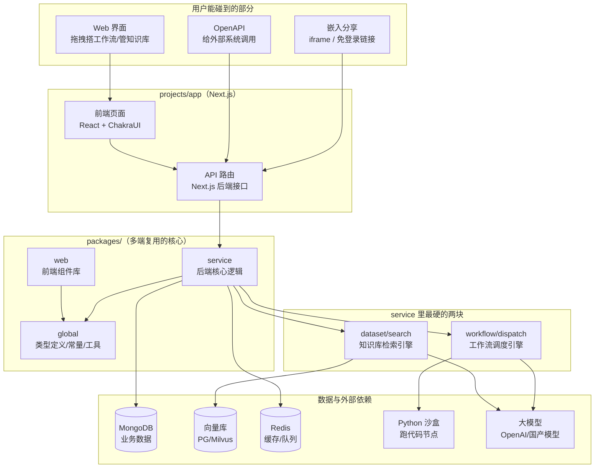
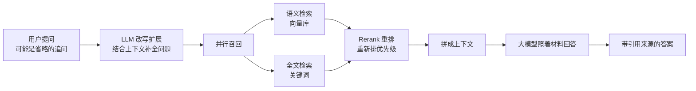
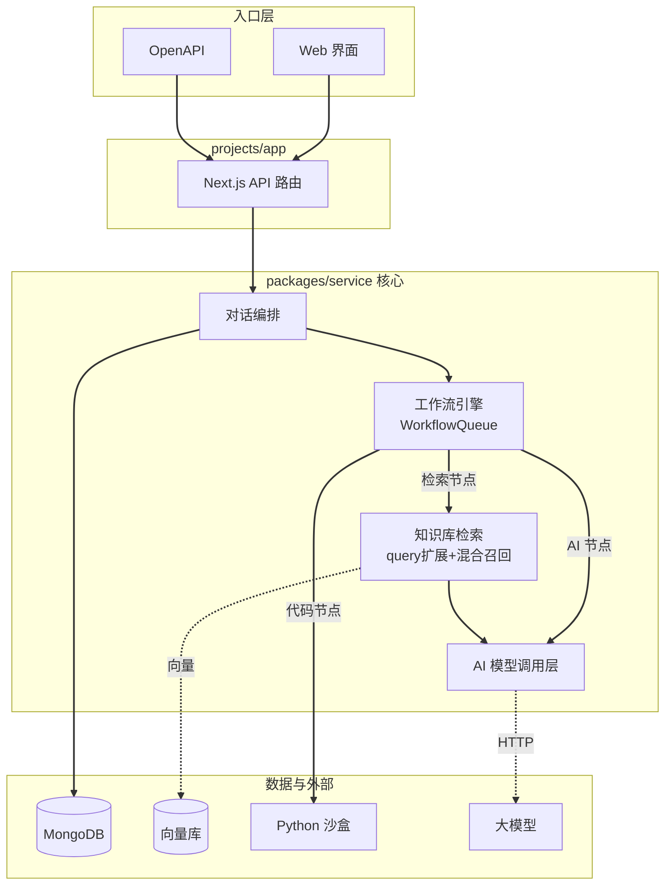

# FastGPT 源码解剖：29k Star 的知识库问答平台，到底把哪几件事做对了？

> 一句话概括：FastGPT 让你不写代码，就能把公司的文档、手册、FAQ 变成一个会聊天、会查资料、会按流程办事的 AI 助手。

## 先看一眼这个项目

| 项目 | 信息 |
|---|---|
| 仓库 | [labring/FastGPT](https://github.com/labring/FastGPT) |
| Star | ⭐ 29k（Fork 7.2k） |
| 背后团队 | labring（Sealos 云操作系统的同一拨人） |
| 语言 | 全栈 TypeScript |
| 技术栈 | Next.js + ChakraUI + MongoDB + 向量库（PostgreSQL/Milvus/Zilliz） |
| 部署 | Docker Compose 一条命令起全套 |
| 协议 | FastGPT Open Source License（可以自己商用，但不许拿去做 SaaS 卖） |
| 官网 | [fastgpt.io](https://fastgpt.io/) |

注意最后两行：它不是标准的 Apache/MIT。你可以把它部署在自己公司内部随便用，但**不能改一改就当成云服务卖给别人**——这是 labring 留的商业化口子。用之前最好让法务瞄一眼。

## 它到底解决什么问题？

设想一个很常见的场景：你们公司有一大堆 PDF 产品手册、Word 制度文档、Excel 报价表。新员工或者客户来问问题，每次都得有人翻文档回答，累且慢。

你想做一个"问它就答"的 AI 客服。如果从零搭，你要自己搞定这一串活儿：

1. 把 PDF/Word/Excel 拆成一小段一小段（切片）；
2. 把每段文字转成向量存进数据库（这样才能"按意思找"，而不是只按关键词找）；
3. 用户提问时，先从库里捞出最相关的几段；
4. 把这几段连同问题一起喂给大模型，让它照着材料回答；
5. 还得管账号、扣费、存对话记录、做个聊天界面……

这一整套就是业界说的 **RAG（检索增强生成）**，说人话就是"**开卷考试**"——不让 AI 凭记忆瞎答，而是先翻资料再答。FastGPT 把上面这五步全给你打包好了，还配了个可视化界面。你上传文档、点几下鼠标，一个知识库 AI 就上线了。

更进一步，如果简单的"问答"不够用，比如你要"先判断用户是要退货还是咨询，退货走 A 流程，咨询走 B 流程"，FastGPT 还给了一个**可视化工作流编排**——像拼流程图一样，把"判断""查知识库""调外部接口""回复"这些方块用线连起来，就能搭出复杂的业务逻辑。这是它和一堆普通"知识库工具"拉开差距的地方。

## 六大能力，挑重点说

README 列了五大类功能，去掉营销味，真正值得关注的是这几个：

- **可视化工作流（Flow）**：拖拽节点连线搭逻辑，支持条件分支、循环、用户交互、调用代码。这是核心竞争力。
- **知识库 + 混合检索**：多个库能混用；检索时"按语义找"和"按关键词找"两条路一起走，再用 rerank 模型重新排个序，比单一检索准得多。
- **双向 MCP**：既能把别人的工具接进来给自己的 AI 用，也能把自己的应用打包成工具给别的 AI 用。这是 2024-2025 最热的互联互通协议。
- **代码沙盒**：工作流里能塞一段 Python 代码跑，跑在隔离的沙盒容器里（`projects/sandbox`），不会把主服务搞崩。
- **完整调用链日志**：每次对话，每个节点怎么走的、花了多少 token、检索到了啥，全能查。排查问题时这个特别值钱。
- **嵌入与分享**：生成一个免登录链接，或者一行 iframe 代码嵌到任何网页里，AI 客服就挂上去了。

## 架构：一栋"全 TypeScript 的四层小楼"

FastGPT 是个 **monorepo**（一个仓库装多个项目），用 pnpm 管理。别被"微服务""全栈"这些词吓到，它的组织其实很清爽，可以想成一栋分工明确的小楼：



四层怎么分工，用大白话讲：

- **`projects/app`**：这就是你打开浏览器看到的那个 FastGPT。因为用了 Next.js，前端页面和后端接口住在同一个项目里——前端负责画界面，后端 API 路由负责接活儿。
- **`packages/global`**：全楼共用的"字典"。类型定义、常量、工具函数放这儿，前端后端都 import 它，保证两边对"一个工作流节点长什么样"的理解完全一致。这是全栈 TypeScript 的最大红利——**一套类型定义，前后端共用，不会对不上**。
- **`packages/service`**：真正干重活的后端核心。RAG 检索、工作流调度都在这里。
- **`packages/web`**：前端组件库，可复用的 UI 零件。
- **`projects/sandbox`**：独立的 Python 沙盒。工作流里如果有"代码执行"节点，代码就丢到这个隔离容器里跑，跑挂了也伤不到主服务。

数据层就是常规配置：MongoDB 存业务数据（用户、应用、对话），向量库存知识库切片的向量，Redis 做缓存和队列。这些用 Docker Compose 一条命令全拉起来。

## 源码深挖之一：工作流引擎，一台"会看红绿灯的流水线"

这是 FastGPT 最硬核的部分，位于 [`packages/service/core/workflow/dispatch`](https://github.com/labring/FastGPT/tree/main/packages/service/core/workflow/dispatch)。

### 它要解决的难题

你在界面上拖出来的工作流，本质是一张"图"：一个个**节点**（判断、查知识库、调模型……）用**连线（边）**串起来。引擎的活儿就是：**从入口出发，按连线顺序，一个个把节点跑完**。

听起来简单，但有三个坑：

1. **有分支**：判断节点会说"符合条件走这条线，不符合走那条线"，没走的那条线上的节点得**跳过**，不能瞎跑。
2. **有循环**：工作流允许"绕回去再来一遍"（比如 Agent 反复思考），图里就出现了"环"。处理环稍不小心就死循环或卡住。
3. **要并发又不能乱**：几个互不依赖的节点最好同时跑得快，但同一个节点绝不能被同时跑两遍。

### 它的解法：一个带"红绿灯"的任务队列

源码里的核心是一个叫 `WorkflowQueue` 的类。它没有用最直觉的"递归"（一个节点跑完就调用自己去跑下一个），因为工作流一大递归就容易爆栈。它改用了**队列 + 循环**的写法。作者自己在注释里把设计目标写得很清楚：

```typescript
/*
  工作流队列控制
  特点：
    1. 可以控制一个 team 下，并发 run 的节点数量。
    2. 每个节点，同时只会执行一个。一个节点不可能同时运行多次。
    3. 都会返回 resolve，不存在 reject 状态。
  方案：
    - 采用回调的方式，避免深度递归。
    - 使用 activeRunQueue 记录待运行检查的节点，并控制并发数量。
*/
```

**每个节点头顶都有一盏"红绿灯"**，源码里 `getNodeRunStatus` 就是那个看灯的函数，它只返回三种状态：

```typescript
static getNodeRunStatus = ({ node, nodeEdgeGroupsMap }) => {
  const edgeGroups = nodeEdgeGroupsMap.get(node.nodeId);

  // 没有输入边 → 它就是入口节点，直接跑
  if (!edgeGroups || edgeGroups.length === 0) return 'run';

  // 任意一组入边里，有一条是 active 且没有还在 waiting 的 → 绿灯，跑！
  if (edgeGroups.some(group =>
      group.some(edge => edge.status === 'active') &&
      group.every(edge => edge.status !== 'waiting')))
    return 'run';

  // 所有入边都被 skipped → 这条路没选中，跳过
  if (edgeGroups.every(group => group.every(edge => edge.status === 'skipped')))
    return 'skip';

  return 'wait'; // 还有上游没算完 → 黄灯，再等等
};
```

翻译成大白话：**一个节点要不要跑，不看它自己，看指向它的那些线亮什么灯。** 上游有一条线"点亮"了（active），它就跑；所有线都被判"此路不通"（skipped），它就跳过；还有线没算出结果（waiting），它就继续等。这个"边驱动"的设计非常巧妙——它天然就把分支的"该跳过谁"处理干净了。

### 最妙的一笔：用图论算法对付"循环"

工作流里一旦允许循环，就得先搞清楚"哪些节点卡在环里"。FastGPT 直接上了两个教科书级图论算法：

```typescript
// 第一步：全局 DFS 边分类，找出"回边"（也就是绕回去形成环的那条线）
const edgeTypes = classifyEdgesByDFS(runtimeNodes, edgeIndex);

// 第二步：Tarjan 算法找出所有强连通分量（SCC），也就是一个个"环"
const { nodeToSCC, sccSizes } = findSCCs(runtimeNodes, edgeIndex);
```

**为什么要费这个劲？** 因为在环里和不在环里的节点，处理规则不一样。不在环里的节点，所有入边当成一组看就行；在环里的节点，就得按"分支"把边细分成组，否则循环回来的那条边会干扰判断。搞清楚谁在环里，引擎才能既支持循环、又不会陷进死循环。

这里能看出 FastGPT 团队的工程功底——很多同类项目遇到"工作流带循环"直接摆烂不支持，或者用一堆 if-else 硬凑，FastGPT 是老老实实用 Tarjan SCC 把问题从根上解决。

### 并发控制：像餐厅"最多同时炒 10 个菜"

跑节点的主循环 `startProcessing` 用了一个"最多同时开工 N 个"的限流：

```typescript
// 检查并发限制：正在跑的节点数达到上限，就等最快的那个先跑完
if (this.activeRunQueue.size === 0 || runningNodePromises.size >= this.maxConcurrency) {
  if (runningNodePromises.size > 0) {
    await Promise.race(runningNodePromises); // 谁先完成就腾出一个名额
  }
  continue;
}
```

`maxConcurrency` 默认 10，意思是"一个团队的工作流，最多同时跑 10 个节点"。`Promise.race` 是关键——它不傻等所有节点，而是"谁先跑完就立刻补下一个进来"，把机器榨得很满，又不会一次开太多把服务压垮。这就像餐厅厨房：灶台就 10 个，哪个菜先出锅就马上上下一个，效率拉满还不乱。

## 源码深挖之二：知识库检索，一场"先改问题再翻书"的开卷考

第二个核心在 [`packages/service/core/dataset/search`](https://github.com/labring/FastGPT/tree/main/packages/service/core/dataset/search)。很多人以为 RAG 就是"把问题转向量、去库里捞相似的"，但 FastGPT 的入口函数告诉你：**捞之前还有一步很重要的"改写问题"**。

```typescript
export const defaultSearchDatasetData = async ({ ... }) => {
  const query = textQueries.join('\n');

  // 关键：先让 LLM 对原始问题做"查询扩展/改写"
  const { searchQueries, reRankQuery, aiExtensionResult } = query
    ? await datasetSearchQueryExtension({
        query,
        llmModel: ...,        // 用一个小模型改写问题
        embeddingModel: props.model,
        histories: props.histories, // 结合上下文对话
      })
    : { searchQueries: [], reRankQuery: query, aiExtensionResult: undefined };

  // 拿改写后的问题再去实际召回
  const result = await searchDatasetData({ ...props, reRankQuery, textQueries: searchQueries });
  return { ...result, queryExtensionResult: ... };
};
```

**为什么要先改写问题？** 举个例子：用户上一句问"iPhone 15 多少钱"，这一句只打了"那 16 呢"。如果直接拿"那 16 呢"去搜知识库，啥也搜不到。FastGPT 先让一个小模型结合上下文，把它改写成"iPhone 16 多少钱"，再去检索——**这一步经常是检索准不准的分水岭**，也是很多自研 RAG 效果差的原因（他们跳过了这步）。

改写完之后才进入真正的召回（`defaultRecall`），里面是 README 说的"混合检索 + 重排"：语义检索（按意思找）+ 全文检索（按关键词找）两路并行，最后用 rerank 模型把结果重新排个高下。此外还留了个 `deepRagSearch` 入口做更复杂的深度检索。

整条链路可以这么看：



值得夸一句：返回结果里带了完整的 `queryExtensionResult`——改写用了哪个模型、花了多少 token、耗时多久，全都记下来。这种"每一步都可观测"的工程习惯，贯穿了整个 FastGPT。

## 模块关系全景



实线是强依赖（直接调用），虚线是走网络/存储访问。可以看到工作流引擎 `WorkflowQueue` 处在正中央——它是"总调度"，检索、代码执行、模型调用都是它手底下的"工种"。

## 社区热度与真实评价

- **Star 增长很猛**：从网上几篇文章的时间线看，13.6k → 23.5k → 27.2k → 现在 29k，一路涨，是国产 AI 应用里少数进了 JS 年度明星榜的。
- **定位清晰**：社区普遍认为 FastGPT 就是**深耕"企业知识库问答"**这个场景，不贪大求全。
- **商业化路线明确**：labring 已推出商业版，部分高级功能（如更强的调试模式）在路线图上可能进商业版。开源版够用，但别指望所有功能都免费——这也是它那个特殊 License 的由来。
- **一个要注意的点**：它的开源协议不允许你拿去做 SaaS 售卖，和 Dify（Apache 2.0，更宽松）不同。选型时这条得算进去。

## 和几个常被拿来比较的项目

| 维度 | FastGPT | Dify | RAGFlow | n8n |
|---|---|---|---|---|
| 主打场景 | 知识库问答 + 工作流 | 通用 LLM 应用开发 | 深度文档解析 + RAG | 通用自动化（不止 AI） |
| 工作流可视化 | 强（支持循环/分支/代码） | 强 | 弱 | 极强 |
| RAG 检索 | 混合检索 + query 改写 + rerank | 有 | 最强（文档解析是招牌） | 需自己接 |
| 上手难度 | 低，中文文档友好 | 低 | 中 | 中 |
| 开源协议 | 特殊协议（禁 SaaS 转售） | Apache 2.0 | Apache 2.0 | Sustainable Use |
| 技术栈 | 全栈 TypeScript | Python + TS | Python | TypeScript |

一句话选型建议：**要中文知识库客服、团队 TS 背景、看重工作流** → FastGPT；**要做通用 AI 应用平台、协议要宽松** → Dify；**文档解析质量是命根子** → RAGFlow；**要连一堆非 AI 的系统做自动化** → n8n。

## 快速上手

官方给的部署命令确实简单，一条拉配置、一条起服务：

```bash
# 拉取 docker-compose 配置（会引导你填几个选项）
bash <(curl -fsSL https://doc.fastgpt.io/deploy/install.sh)

# 启动全套服务（FastGPT + MongoDB + 向量库 + Redis）
docker compose up -d
```

起来后访问 `http://localhost:3000`，默认账号 `root`、密码 `1234`（**记得马上改密码**）。想更省事就直接用云服务版 [fastgpt.io](https://fastgpt.io/) 或 Sealos 一键部署。

## 深度总结：它做对了什么

拆完源码，FastGPT 能到 29k Star 不是靠营销，而是几件事扎扎实实做对了：

1. **工作流引擎是真功夫**。用 Tarjan SCC + DFS 边分类处理循环、用边状态驱动分支跳过、用队列+并发控制替代递归——这套设计在开源同类项目里属于第一梯队。
2. **RAG 不只是"转向量捞相似"**。那一步"LLM 改写问题"是检索质量的隐形分水岭，很多自研 RAG 就栽在没做这步。
3. **全栈 TypeScript 的类型复用**。前后端共用 `global` 包的类型，改一处两边同步，工程一致性极强。
4. **可观测性刻进骨子里**。每个节点、每次检索、每笔 token 消耗都有记录，排障和计费都省心。

它的短板也很实在：**那个特殊开源协议限制了商用玩法**，想做 SaaS 转售的直接出局；功能虽多但**主战场就是知识库问答**，你要做花哨的多模态 Agent 平台，它未必是最优解。

但如果你的需求就是"把公司文档变成一个靠谱的 AI 客服/助手"，FastGPT 大概率是国产开源里最省心的那个。

---

<!-- IMAGE_PROMPT: gpt-image2
A clean 16:9 technical architecture infographic for "FastGPT", primary color #3366CC on white background. Top center: bold title "FastGPT" with a "⭐ 29k" star badge. Left side: input sources icons (PDF, Word, Excel, URL documents) flowing in. Center: three connected module blocks arranged horizontally — "Visual Workflow Engine" (flowchart nodes connected by lines), "Knowledge Base + Hybrid Retrieval" (documents turning into vectors), "LLM Orchestration" (chat bubble). Bottom: infrastructure row with database cylinder icons labeled "MongoDB", "Vector DB", "Redis", and a shielded "Python Sandbox". Right side: output — a chat window showing an AI answer with citation links, plus an embed/iframe icon. Modern flat design, thin lines, generous whitespace, professional developer-tool aesthetic, English labels.
-->

<!-- IMAGE_PROMPT: gpt-image2
A 16:9 conceptual cover image symbolizing FastGPT as a knowledge assistant. Central metaphor: a friendly robot librarian standing in front of a wall of documents, pulling out the exact right page and handing it over as a glowing answer bubble. Around the robot, subtle flowchart connectors (nodes and arrows) suggest a visual workflow. Color palette dominated by #3366CC blue with white and light purple accents. A small "⭐ 29k" badge in the top-right corner. Clean, modern, slightly playful tech-illustration style, no text except the star badge.
-->
