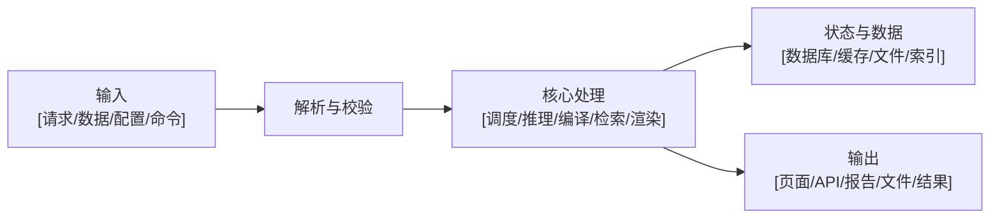
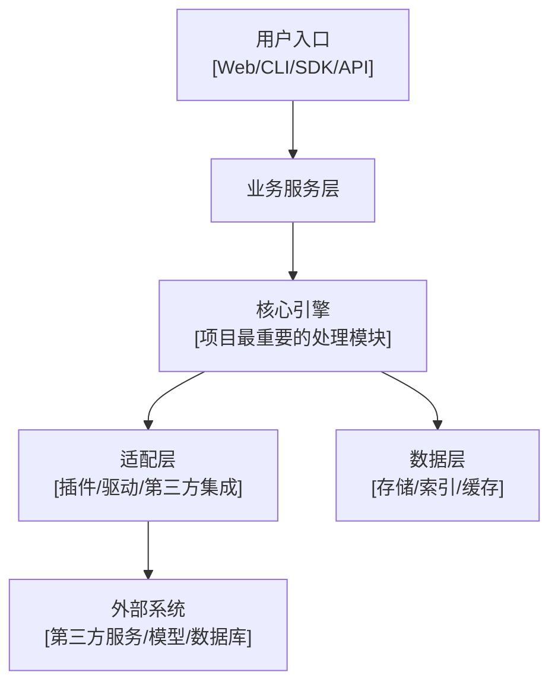

# GitHub 开源项目深度剖析文章模板

本文档用于撰写“针对 GitHub 开源项目进行深度剖析”的通用文章。模板覆盖项目介绍、功能特点、功能结构全景图提示词、项目原理、项目结构、代码信息、使用方法、安装部署、更新、卸载、适用场景、常见问题和总结等模块。

模板不是固定套壳。写作时需要先判断项目类型，再决定保留、删减或强化哪些章节：可运行软件重点写安装、部署和使用；开发库重点写 API、集成和示例；知识内容项目重点写内容体系、学习路径和贡献方式；模型、数据集或论文复现项目重点写环境、数据、推理、训练和评估。

## 参考资料

- GitHub 官方文档：<https://docs.github.com/>
- GitHub Repository 文档：<https://docs.github.com/en/repositories>
- GitHub Releases 文档：<https://docs.github.com/en/repositories/releasing-projects-on-github>
- GitHub Actions 文档：<https://docs.github.com/en/actions>
- GitHub Licenses 文档：<https://docs.github.com/en/repositories/managing-your-repositorys-settings-and-features/customizing-your-repository/licensing-a-repository>
- Open Source Guides：<https://opensource.guide/>

## 写作前信息采集清单

写文章前，优先从项目官方资料中提取信息，不要凭经验补全关键细节。

| 信息 | 来源 | 说明 |
|---|---|---|
| 项目名称 | GitHub 仓库名 / README | 使用官方写法 |
| 项目定位 | README / 官网 / 文档 | 一句话说明它解决什么问题 |
| 官方地址 | README / About / 文档 | 官网、Demo、文档站 |
| 仓库地址 | GitHub | 填写完整 URL |
| Star / Fork / Watch | GitHub | 可选，注明采集日期 |
| 主要语言 | GitHub Languages | 说明核心技术栈 |
| 开源协议 | LICENSE | 不要漏写商用限制 |
| 最新版本 | Releases / Tags | 如有发布版本，优先写稳定版 |
| 维护状态 | commits / issues / releases | 判断是否活跃 |
| 文档语言 | README / docs | 判断是否已有中文文档；如果只有英文文档，需要输出中文化说明 |
| 安装方式 | README / docs | npm、pip、Docker、源码编译等 |
| 部署方式 | docs / examples | 仅可部署项目需要填写 |
| 核心依赖 | package / requirements / go.mod / pom.xml | 只写关键依赖 |
| 示例入口 | examples / demo / docs | 方便读者快速体验 |

## 项目类型裁剪规则

写作前先给项目打一个或多个标签，再调整文章结构。

| 项目类型 | 重点章节 | 可弱化或删除 |
|---|---|---|
| Web 应用 / 自托管工具 | 功能特点、架构原理、部署、更新、卸载、备份 | 代码细节可适当压缩 |
| CLI 工具 | 安装方式、命令体系、典型场景、参数说明、源码入口 | Web 部署、截图展示 |
| SDK / 开发库 | API 设计、集成方式、核心抽象、示例代码、版本兼容 | 部署、运维、卸载 |
| 框架 / 中间件 | 架构设计、扩展机制、生命周期、性能边界 | 普通功能展示 |
| AI 模型 / 推理项目 | 模型能力、环境准备、推理流程、输入输出、性能指标 | 传统 Web 部署 |
| 数据集 / Benchmark | 数据结构、任务定义、评估方法、下载和引用 | 安装部署、卸载 |
| 知识库 / Awesome 列表 / 教程 | 内容体系、阅读路径、适合人群、更新机制、贡献方式 | 安装部署、代码结构 |
| 论文复现 / 实验项目 | 论文背景、环境、数据、训练、评估、复现实验注意事项 | 产品化使用指南 |
| 插件 / 扩展 | 宿主环境、安装启用、配置项、权限、兼容版本 | 独立部署 |

## 英文项目中文化输出规则

如果 GitHub 项目主要文档是英文，并且仓库没有官方中文 README、中文文档站或中文使用指南，文章中需要额外输出一份“中文化使用文档”。这部分不是逐句机器翻译，而是基于 AI 对项目 README、docs、examples、配置文件和源码入口的理解，重写成适合中文读者阅读的实用文档。

建议放在“项目使用方法”之后，或作为文章附录。

中文化文档至少包括：

- 项目一句话说明：用中文解释项目是什么、解决什么问题。
- 核心概念翻译：把项目里的关键术语翻译成中文，并保留英文原词，避免读者和官方文档对不上。
- 快速开始：用中文改写官方安装、运行、示例流程。
- 常用配置：解释关键配置项、环境变量、命令参数或 API 参数。
- 典型用法：把官方示例转换成中文场景说明。
- 常见问题：整理英文文档、Issue 或 README 中容易踩坑的点。
- 原文出处：标明内容依据来自 README、docs、examples、Release 或源码，不要伪装成官方中文文档。

如果项目已有质量较好的官方中文文档，则不需要重复翻译，只需在文章中引用并补充自己的理解、实践经验和项目剖析。

## 文章模板

# 深度剖析 [项目名称]：[一句话说明项目核心价值]

## 1. 项目介绍

[项目名称] 是一个 [项目定位，例如：开源工作流引擎 / AI Agent 框架 / 个人知识库工具 / 前端组件库 / 命令行效率工具]，主要用于解决 [核心问题]。

它适合 [目标用户，例如：开发者、运维、数据工程师、内容创作者、研究人员、团队管理员] 在 [典型场景] 中使用。和同类项目相比，[项目名称] 的特点是 [差异点 1]、[差异点 2] 和 [差异点 3]。

本文会从项目背景、功能特点、核心原理、代码结构、使用方式和安装部署等角度拆解 [项目名称]。如果该项目不是可运行软件，例如知识库、Awesome 列表、数据集或教程项目，可将安装部署章节替换为内容体系、阅读路径和贡献方式。

## 2. 项目速览

| 项目 | 内容 |
|---|---|
| 项目名称 | [项目名称] |
| 项目定位 | [一句话定位] |
| GitHub 地址 | [仓库链接] |
| 官方网站 / 文档 | [官网或文档链接] |
| Demo / 示例 | [在线 Demo 或 examples 目录] |
| 主要语言 | [TypeScript / Python / Go / Rust / Java 等] |
| 技术栈 | [框架、数据库、运行时、核心依赖] |
| 开源协议 | [MIT / Apache-2.0 / GPL / AGPL / 未声明等] |
| 最新版本 | [Release / Tag，注明采集日期] |
| Star 数 | [数量，注明采集日期] |
| 文档语言 | [英文 / 中文 / 多语言；是否需要中文化文档] |
| 适合人群 | [目标用户] |
| 推荐体验方式 | [在线 Demo / 本地运行 / Docker / API 调用 / 阅读文档] |

## 3. 这个项目解决了什么问题

先用具体场景解释痛点，不要只写抽象概念。

- 痛点一：[用户原本需要手工完成什么，成本在哪里]
- 痛点二：[现有方案有什么限制]
- 痛点三：[规模变大后会出现什么问题]

[项目名称] 的解决思路是：[用 1-2 段话说明项目如何把问题拆开，例如通过可视化编排、插件机制、声明式配置、统一 API、模型推理、索引检索、自动化调度等方式解决问题]。

## 4. 项目功能特点

这一节建议按“用户能感知到的能力”来写，不要直接照搬 README 的功能列表。

### 4.1 核心功能

- [功能 1]：说明这个功能做什么、适合什么场景、输入输出是什么。
- [功能 2]：说明它和项目主流程的关系。
- [功能 3]：说明它能否扩展、配置或自动化。
- [功能 4]：如果涉及权限、多用户、插件、API、任务调度、数据同步、可视化、模型推理等能力，需要写清楚使用边界。

### 4.2 特色能力

- [特色 1]：和同类项目相比，它强在哪里。
- [特色 2]：哪些设计让它更易用、更稳定或更容易二次开发。
- [特色 3]：如果项目有生态能力，例如插件市场、模板库、示例库、社区集成，需要单独说明。

### 4.3 功能边界

不要只写优点，也要写清楚边界。

- 适合：[适合的业务规模、用户类型、运行环境]
- 不适合：[不适合的场景，例如高并发生产系统、强合规场景、复杂权限模型、大规模训练等]
- 使用前需要确认：[许可证、数据安全、部署成本、依赖服务、硬件要求、平台兼容性]

### 4.4 项目功能结构全景图 gpt-image2 提示词

下面的提示词用于生成文章配图。生成前请把方括号占位符替换为项目真实信息。

```text
请生成一张专业、清晰、适合技术文章首屏阅读的「[项目名称] 功能结构全景图」。

画面主题：[项目名称] 是一个 [项目定位]，用于 [核心问题/核心场景]。

图中需要包含以下层次：
1. 顶部标题区：显示「[项目名称] 功能结构全景图」和一句副标题「[一句话说明项目价值]」。
2. 左侧输入层：展示项目接收的输入，例如 [用户请求 / 配置文件 / API 调用 / 数据文件 / 文档 / 模型输入 / 命令行参数]。
3. 中间核心能力层：用 4-6 个模块展示主要功能，模块名称分别是：[功能模块 1]、[功能模块 2]、[功能模块 3]、[功能模块 4]、[功能模块 5]、[功能模块 6]。每个模块用简短标签说明作用。
4. 底部支撑层：展示关键技术支撑，例如 [数据库 / 插件系统 / 任务队列 / 缓存 / 模型推理 / 向量索引 / 文件存储 / 权限系统 / CLI / SDK]。
5. 右侧输出层：展示项目产生的结果，例如 [Web 页面 / API 响应 / 自动化任务 / 报告 / 代码生成结果 / 检索答案 / 可视化图表 / 部署服务]。
6. 如果项目支持部署或集成，请在右下角补充「部署与集成」小区域，展示 [Docker / Kubernetes / npm / pip / GitHub Actions / Webhook / 第三方服务]。

视觉风格：
- 使用现代技术架构图风格，干净、克制、信息密度适中。
- 采用浅色背景，主色可以根据项目 Logo 或技术栈选择，但不要使用过于花哨的渐变。
- 模块之间用清晰箭头连接，体现从输入到处理再到输出的流程。
- 中文文字必须清晰可读，避免小字堆叠。
- 不要使用真实公司 Logo，除非项目官方允许；可以使用抽象图标表达模块。
- 画幅比例 16:9，适合公众号、博客和技术演示。
```

如果目标项目是知识库、Awesome 列表、教程或数据集，可将“输入层、核心能力层、输出层”改为“内容入口、主题模块、学习成果/使用成果”。

## 5. 适用场景

- 场景一：[具体用户] 在 [具体业务] 中使用它完成 [具体任务]。
- 场景二：[团队/个人] 用它替代 [原有工具或流程]。
- 场景三：[开发者] 基于它做 [二次开发、集成、自动化、实验复现]。
- 场景四：[学习者/研究者] 通过它理解 [技术方向、项目实践、论文方法]。

如果项目有明显不适合的场景，也放在这一节写清楚，读者会更信任文章。

## 6. 项目原理

这一节写项目“为什么能工作”。根据项目类型选择合适角度。

### 6.1 核心工作流程

用一段话说明：[项目名称] 从接收输入到产出结果，经历了哪些步骤。



### 6.2 关键模块关系



### 6.3 核心设计思想

- 抽象一：[项目把什么概念抽象成对象、节点、任务、组件、插件或资源]
- 流程一：[项目如何组织执行顺序、生命周期或状态流转]
- 扩展一：[项目如何支持插件、配置、API、Hook、中间件或自定义模块]
- 稳定性：[项目如何处理错误、重试、日志、缓存、权限或安全问题]

### 6.4 与同类项目的差异

| 对比维度 | [项目名称] | [同类项目 A] | [同类项目 B] |
|---|---|---|---|
| 核心定位 | [说明] | [说明] | [说明] |
| 上手成本 | [说明] | [说明] | [说明] |
| 扩展能力 | [说明] | [说明] | [说明] |
| 部署复杂度 | [说明] | [说明] | [说明] |
| 适合场景 | [说明] | [说明] | [说明] |

没有充分资料时，不要强行对比。可以改为“从公开资料看，它更偏向 [方向]”。

## 7. 项目结构

先给一段总览，再展示目录。目录不要把所有文件都列出来，重点解释核心目录。

```text
[project-name]/
├── README.md                 # 项目说明和快速开始
├── docs/                     # 官方文档
├── examples/                 # 示例代码或演示项目
├── src/                      # 核心源码
│   ├── [module-a]/           # [模块 A 说明]
│   ├── [module-b]/           # [模块 B 说明]
│   └── [entry-file]          # [入口文件说明]
├── tests/                    # 测试用例
├── scripts/                  # 构建、发布、辅助脚本
├── packages/                 # Monorepo 子包，如有
├── docker/                   # Docker 或部署配置，如有
├── package.json              # Node.js 项目依赖，如适用
├── pyproject.toml            # Python 项目配置，如适用
├── go.mod                    # Go 项目模块配置，如适用
├── Cargo.toml                # Rust 项目配置，如适用
└── LICENSE                   # 开源协议
```

### 7.1 目录解读

- `[目录/文件]`：说明它负责什么，读者什么时候需要看它。
- `[目录/文件]`：说明它和核心流程的关系。
- `[目录/文件]`：如果是二次开发入口，需要指出修改位置。

### 7.2 入口文件和主流程

| 入口 | 作用 | 适合阅读的人 |
|---|---|---|
| `[入口文件 1]` | [启动服务 / 注册命令 / 暴露 API] | [用户类型] |
| `[入口文件 2]` | [核心引擎 / 配置加载 / 路由注册] | [用户类型] |
| `[配置文件]` | [构建、依赖、脚本、运行参数] | [用户类型] |

## 8. 项目代码信息

这一节用于帮助读者快速判断项目质量、维护状态和二次开发成本。

### 8.1 技术栈

| 类别 | 技术 |
|---|---|
| 主要语言 | [语言] |
| 前端框架 | [React / Vue / Svelte / 无] |
| 后端框架 | [FastAPI / Express / Spring Boot / Gin / 无] |
| 数据存储 | [SQLite / PostgreSQL / Redis / 文件系统 / 无] |
| 构建工具 | [Vite / Webpack / Poetry / Maven / Cargo / Go tools] |
| 测试框架 | [Jest / Vitest / Pytest / JUnit / Go test] |
| CI/CD | [GitHub Actions / 其他] |

### 8.2 代码规模和活跃度

| 指标 | 内容 |
|---|---|
| 主要语言占比 | [GitHub Languages] |
| 最近提交 | [日期，注明采集日期] |
| 最近 Release | [版本和日期] |
| Issue 状态 | [打开数量 / 关闭数量 / 响应情况] |
| PR 状态 | [维护者是否活跃合并] |
| 测试覆盖 | [是否有 tests、CI、覆盖率徽章] |

注意：Star 数只能说明关注度，不能直接等于项目质量。需要结合提交、Issue、Release 和文档完整度一起判断。

### 8.3 核心代码阅读路线

建议给读者一条“从入口到核心模块”的阅读路线。

1. 先看 `[README / docs]`，理解项目使用方式。
2. 再看 `[入口文件]`，找到程序如何启动。
3. 接着看 `[核心模块]`，理解主要逻辑。
4. 如果要扩展功能，看 `[插件/适配器/API/配置模块]`。
5. 如果要排查问题，看 `[日志/错误处理/测试用例]`。

## 9. 项目使用方法

根据项目类型选择写法。

### 9.1 快速体验

适用于可运行项目、CLI、SDK、模型推理项目。

```bash
git clone [仓库地址]
cd [project-name]
[安装依赖命令]
[启动或运行命令]
```

运行成功后，读者应该看到：

```text
[预期输出 / 本地访问地址 / 生成文件 / 命令返回结果]
```

### 9.2 典型使用流程

- 第一步：[打开页面 / 执行命令 / 引入 SDK / 准备数据]
- 第二步：[配置关键参数]
- 第三步：[执行核心操作]
- 第四步：[查看结果、日志或输出文件]
- 第五步：[保存配置、导出结果或接入业务系统]

### 9.3 示例代码

如果是 SDK、库、框架或 API 项目，需要提供最小可运行示例。

```[language]
[最小示例代码]
```

解释示例中的关键点：

- `[参数/函数/类名]`：说明用途。
- `[返回值]`：说明结构和含义。
- `[异常/错误]`：说明常见原因。

### 9.4 知识内容类项目的使用方法

如果项目是知识库、教程、Awesome 列表、资料合集，可以改写为：

- 推荐阅读路径：[初学者路径 / 进阶路径 / 专题路径]
- 内容模块：[模块 1]、[模块 2]、[模块 3]
- 检索方法：[按目录 / 按标签 / GitHub 搜索 / 文档站搜索]
- 实践建议：[读完后可以做什么项目或练习]
- 贡献方式：[补充资料、修正错误、提交 PR、参与讨论]

### 9.5 英文文档中文化说明

如果项目只有英文文档，需要补充这一节；如果已有官方中文文档，可以删除。

> 说明：以下内容基于项目官方英文 README、docs、examples 和源码配置整理，不是官方中文文档。关键命令、参数和版本信息仍以官方仓库为准。

#### 9.5.1 项目中文简介

[用中文说明项目是什么、解决什么问题、适合谁使用。]

#### 9.5.2 核心术语对照

| 英文术语 | 中文解释 | 备注 |
|---|---|---|
| [Term] | [中文解释] | [在项目中出现的位置或含义] |
| [Term] | [中文解释] | [在项目中出现的位置或含义] |

#### 9.5.3 中文快速开始

```bash
[安装命令]
[运行命令]
[验证命令]
```

执行完成后，应该看到：[预期页面、命令输出或生成结果]。

#### 9.5.4 常用配置中文说明

| 配置项 / 参数 | 中文说明 | 默认值 | 什么时候需要修改 |
|---|---|---|---|
| `[KEY]` | [说明] | [默认值] | [使用场景] |

#### 9.5.5 常见问题中文整理

- 问题一：[英文文档或 Issue 中常见的问题，用中文解释原因和解决办法]
- 问题二：[配置、版本、环境或依赖导致的问题]
- 问题三：[使用边界或已知限制]

## 10. 项目安装和部署

如果项目不能安装或部署，例如纯知识库、Awesome 列表、论文列表、规范文档，请删除本节，改为“内容体系和阅读路径”。

### 10.1 环境要求

| 项目 | 要求 |
|---|---|
| 操作系统 | [macOS / Linux / Windows / Docker] |
| 运行时 | [Node.js / Python / Go / Java / Rust / CUDA 等] |
| 依赖服务 | [数据库 / Redis / 对象存储 / 模型文件 / 无] |
| CPU / 内存 | [最低和推荐配置] |
| 磁盘 | [源码、依赖、数据、模型占用] |
| 端口 | [Web 服务或 API 端口] |

### 10.2 本地安装

```bash
git clone [仓库地址]
cd [project-name]
[安装依赖命令]
```

常见语言示例，写作时只保留项目真实使用的一种或几种：

```bash
# Node.js
npm install
npm run dev

# Python
python -m venv .venv
source .venv/bin/activate
pip install -r requirements.txt
python [entry].py

# Go
go mod download
go run ./cmd/[name]

# Rust
cargo build
cargo run
```

### 10.3 Docker 部署

仅当项目官方提供 Dockerfile、镜像或 Compose 示例时保留。否则可以写“官方暂未提供 Docker 部署方式，不建议直接编造镜像配置”。

```bash
docker pull [镜像名称]:[版本号]
docker run -d \
  --name [project-name] \
  --restart unless-stopped \
  -p [宿主机端口]:[容器端口] \
  -e [KEY]=[VALUE] \
  -v /opt/[project-name]/data:[容器数据目录] \
  [镜像名称]:[版本号]
```

### 10.4 Docker Compose 部署

```yaml
services:
  app:
    image: [镜像名称]:${APP_VERSION}
    container_name: [project-name]
    restart: unless-stopped
    ports:
      - "${APP_PORT}:[容器端口]"
    environment:
      - TZ=Asia/Shanghai
      - [KEY]=[VALUE]
    volumes:
      - ./data:[容器数据目录]
```

启动服务：

```bash
docker compose up -d
docker compose logs -f
```

### 10.5 生产环境注意事项

- 配置 HTTPS、反向代理和访问控制。
- 使用固定版本，不要在生产环境长期使用 `latest`。
- 挂载数据目录，避免容器删除后数据丢失。
- 配置日志、备份、健康检查和监控。
- 如果项目采用 AGPL、GPL 等协议，需要确认分发和网络服务场景下的合规要求。

## 11. 更新、升级和卸载

如果项目不可安装部署，可以删除本节。若项目只是开发库，可改为“版本升级和兼容性”。

### 11.1 更新升级

源码方式：

```bash
cd [project-name]
git pull
[重新安装依赖命令]
[重新构建或启动命令]
```

包管理器方式：

```bash
[npm/pip/brew/cargo/go install 等更新命令]
```

Docker Compose 方式：

```bash
cd /opt/[project-name]
docker compose pull
docker compose up -d
docker compose logs -f
```

升级前需要确认：

- 是否有 breaking changes。
- 配置文件格式是否变化。
- 数据库是否需要迁移。
- 插件、扩展、第三方集成是否兼容。
- 是否已经备份数据。

### 11.2 回滚版本

```bash
git checkout [旧版本 tag]
[重新安装依赖和启动]
```

Docker 方式可改回旧镜像版本：

```env
APP_VERSION=[旧版本号]
```

然后重新启动服务。

### 11.3 卸载清理

源码或本地依赖方式：

```bash
cd ..
rm -rf [project-name]
```

Docker 方式：

```bash
docker stop [project-name]
docker rm [project-name]
```

Docker Compose 方式：

```bash
docker compose down
```

如果需要删除数据：

```bash
rm -rf /opt/[project-name]
docker volume rm [volume_name]
```

注意：删除数据目录或 Docker volume 后，项目数据通常无法恢复。

## 12. 常见问题

### 12.1 项目跑不起来

排查顺序：

- 运行时版本是否符合要求。
- 依赖是否安装完整。
- 环境变量是否缺失。
- 端口是否被占用。
- 数据库、模型文件、外部 API 是否可访问。
- 日志中是否有明确错误。

### 12.2 文档和实际行为不一致

优先确认当前使用的分支、版本和文档版本是否一致。很多 GitHub 项目的 README 对应主分支，Release 用户需要看对应 tag 的文档。

### 12.3 是否适合生产环境

从以下角度判断：

- 是否有稳定 Release。
- 是否有测试和 CI。
- 是否有安全更新记录。
- Issue 是否有人响应。
- 配置、备份、监控、权限是否完整。
- 开源协议是否允许当前使用方式。

## 13. 适合二次开发的方向

- 插件扩展：[说明可扩展点]
- API 集成：[说明如何和现有系统连接]
- UI 定制：[说明前端入口和主题机制]
- 数据适配：[说明如何接入自有数据源]
- 自动化流程：[说明如何接入 CI/CD、Webhook、定时任务]
- 私有化部署：[说明认证、权限、存储、审计等改造点]

## 14. 项目优缺点总结

| 维度 | 评价 |
|---|---|
| 上手成本 | [低 / 中 / 高，说明原因] |
| 功能完整度 | [说明核心能力是否完整] |
| 文档质量 | [说明 README、docs、examples 是否充分] |
| 代码质量 | [结合结构、测试、依赖、类型系统判断] |
| 维护活跃度 | [结合提交、Release、Issue 判断] |
| 扩展能力 | [说明插件、API、配置、模块化程度] |
| 部署难度 | [说明依赖、环境、数据持久化、运维成本] |
| 适合人群 | [适合哪些读者或团队] |

## 15. 总结

[项目名称] 的核心价值在于 [总结项目最重要的能力]。如果你正在面对 [具体问题]，它可以提供 [具体帮助]；如果你更关注 [另一个方向]，则需要注意 [限制或替代方案]。

整体来看，[项目名称] 更适合 [适合人群和场景]。建议读者先从 [Demo / examples / 最小部署 / 文档章节] 开始体验，再根据自己的需求决定是否深入源码、部署到长期环境或进行二次开发。

## 追加给 AI 的写作提示

- 不要机械套用所有章节。先判断项目类型，再决定是否保留安装部署、更新卸载、代码阅读、内容体系、模型推理或数据集说明。
- 所有关键事实以项目官方 README、docs、Release、LICENSE、源码配置为准；不确定时写“官方文档未明确说明”，不要编造。
- 项目介绍要具体，避免“强大、易用、灵活”这类空泛描述。尽量写它解决了什么真实问题。
- 功能特点不要直接复制 README 列表，需要转写成用户场景、输入输出和实际价值。
- 原理分析要围绕项目真实模块，不要套通用架构图。Mermaid 图里的模块名称要对应真实目录、类、服务或概念。
- 代码信息不要只看 Star。需要结合最近提交、Release、Issue、测试、CI、文档和 License 判断。
- 如果项目是知识库、Awesome 列表、教程或资料合集，重点写内容结构、阅读路线、资料质量、更新机制和贡献方式，不写安装部署。
- 如果项目是 SDK 或开发库，重点写 API 设计、最小示例、集成步骤、错误处理和版本兼容，不写服务器部署。
- 如果项目是 Web 应用或自托管工具，重点写部署、数据目录、环境变量、备份、升级、卸载和安全注意事项。
- 如果项目是 AI 模型或论文复现，重点写环境、模型权重、数据准备、推理、训练、评估指标和硬件要求。
- 如果项目只有英文文档且没有官方中文文档，需要基于官方英文 README、docs、examples 和源码配置输出中文化使用文档；翻译时保留关键英文术语，不要改写命令、参数名、配置键和 API 名称。
- 中文化文档要以“帮助中文读者理解和上手”为目标，可以重组结构、补充解释和示例，但不能虚构官方没有提供的能力、参数或部署方式。
- 功能结构全景图的 `gpt-image2` 提示词必须替换为项目真实模块，不要保留占位符直接生成。
- 文章要有判断，不要只有介绍。需要写出项目适合谁、不适合谁、二次开发成本在哪里。

## 可选增强模块

复杂项目可以根据需要增加以下章节：

- 安全分析：权限模型、认证方式、密钥管理、数据隔离、漏洞响应。
- 性能分析：并发能力、缓存策略、资源占用、瓶颈模块、压测结果。
- 数据流分析：数据从输入、处理、存储到输出的完整链路。
- API 说明：核心接口、请求示例、响应结构、鉴权方式。
- 插件机制：插件生命周期、注册方式、扩展点、示例插件。
- 配置详解：配置文件、环境变量、默认值、生产环境推荐配置。
- 贡献指南：开发环境、分支策略、测试命令、PR 规范。
- 商业化和许可证风险：商用限制、AGPL/GPL 影响、依赖许可证。
- 竞品对比：同类项目定位、优缺点、迁移成本。
- 实战案例：用项目完成一个真实任务，而不是只展示安装成功。
