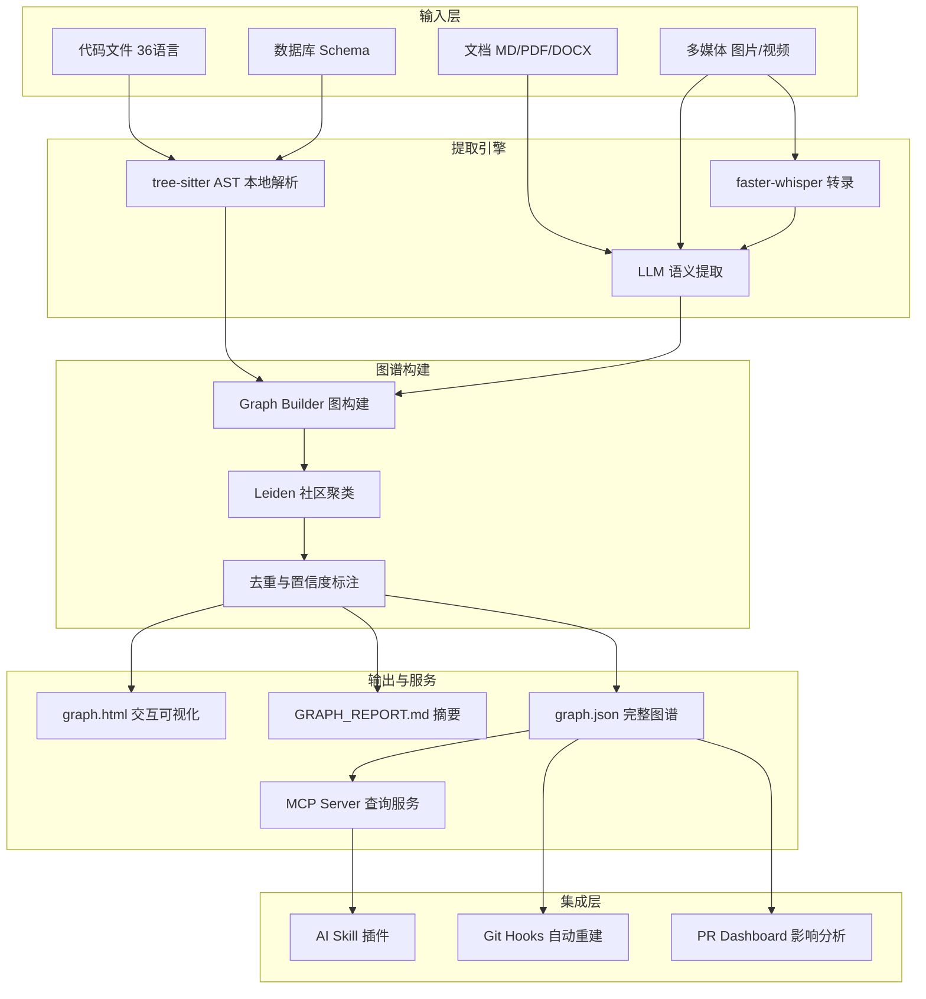

# 76k Star，一条命令让 AI 「读懂」你的整个项目：Graphify 如何把代码库变成可查询的知识图谱

> 你让 Claude Code 帮你改个 API，它先读了 auth.ts，又读了 routes.ts，再读了 database.ts——三个文件读完，token 已经烧了 12k，还没摸清模块之间的关系。如果它一开始就知道「auth 模块通过 middleware 连接到 routes，routes 依赖 database pool」，整个过程只需要 200 个 token。Graphify 做的就是这件事：把你的项目预先构建成知识图谱，让 AI 用查询代替暴力阅读。
> 一页纸：https://github.com/Shonee/html-tools/blob/master/pages/paper/graphify.html

## 1. 项目速览

| 项目 | 内容 |
|---|---|
| 项目名称 | Graphify |
| 一句话定位 | 面向 AI 编码助手的多模态知识图谱构建器 |
| GitHub 地址 | [safishamsi/graphify](https://github.com/safishamsi/graphify) |
| 官方网站 | [graphify.net](https://graphify.net/) |
| 主要语言 | Python |
| 技术栈 | tree-sitter AST + LLM 语义提取 + Leiden 社区发现 + MCP 协议 |
| 开源协议 | MIT |
| Star 数 | ⭐ 76.4k（2026-07-03） |
| 最新版本 | v0.9.5（2026-07-02） |
| PyPI 包名 | graphifyy（双 y，CLI 命令仍为 graphify） |
| 维护状态 | 极度活跃（日级发版，2.5 个月达 73k Star） |
| 适合人群 | 使用 AI 编码工具处理中大型项目的开发者，尤其是多文件/多模态项目 |

## 2. 它解决了什么问题

AI 编码助手面对大型项目时有三个致命瓶颈：

- **Token 浪费**：为了理解一个问题，Agent 逐文件阅读源码，一次上下文可能消耗 50k+ token，但 90% 是噪音
- **上下文窗口有限**：即使模型支持 200k token，一次性塞入全部源码也不现实
- **跨模态盲区**：Agent 能读代码，但读不了架构图 PDF、设计文档 DOCX、会议视频录屏——这些恰好包含「为什么这样设计」的信息

Graphify 的解法：**预处理 → 构图 → 查询**

1. 用 tree-sitter 本地解析代码 AST（零 API 调用），用 LLM 提取文档/图片/视频语义
2. 构建知识图谱（节点 = 概念/函数/模块，边 = 关系），Leiden 算法做社区聚类
3. AI 编码时查图谱而非读文件——节省 71x token，减少幻觉

官方数据：在 32k Star 的 chardet 重写项目中，使用 Graphify 后 Agent 的 token 消耗降低 71 倍。

## 3. 核心功能特性

### 3.1 多模态提取

| 类型 | 支持格式 | 处理方式 |
|---|---|---|
| 代码 | 36 种语言（Python/TS/Go/Rust/Java/C++ 等） | 本地 tree-sitter AST，零 API |
| 文档 | .md .html .txt .rst .yaml .docx .xlsx | LLM 语义提取 |
| PDF | .pdf | LLM 语义提取 |
| 图片 | .png .jpg .webp .gif | LLM 视觉识别 |
| 视频/音频 | .mp4 .mov .mp3 .wav + YouTube URL | faster-whisper 本地转录 |
| 数据库 | SQL schema + 实时 PostgreSQL 内省 | AST / live introspection |
| 基础设施 | Terraform .tf / MCP configs / package manifests | 专用解析器 |

### 3.2 20+ AI 工具集成

一条命令适配：Claude Code、Codex、Cursor、Gemini CLI、GitHub Copilot CLI、VS Code Copilot Chat、Kilo Code、Aider、Amp、OpenClaw、Factory Droid、Trae、Hermes、Kimi Code、Kiro、Pi、Devin CLI、Google Antigravity、CodeBuddy、OpenCode。

### 3.3 三种输出

```text
graphify-out/
├── graph.html       # 浏览器交互式可视化（点击节点、过滤、搜索）
├── GRAPH_REPORT.md  # 关键概念、意外连接、推荐问题
└── graph.json       # 完整图谱（后续查询无需重新提取）
```

### 3.4 核心命令

```bash
/graphify .                        # 构建当前目录图谱
/graphify ./docs --update          # 增量更新
graphify query "auth 如何连接到数据库？"  # 查询图谱
graphify export callflow-html      # 生成 Mermaid 调用流 HTML
graphify hook install              # Git 提交后自动重建
graphify prs --triage              # AI 排序 PR 审查队列
```

### 3.5 功能边界

- ✅ 适合：多文件项目、含文档/PDF/视频的知识密集型项目、团队协作
- ✅ 适合：需要减少 AI token 消耗、提升上下文质量的开发者
- ❌ 不适合：单文件脚本（构图 overhead 大于收益）
- ❌ 不适合：不使用 AI 编码助手的开发者（图谱为 AI 服务）
- ⚠️ 注意：>5000 节点时 HTML 可视化可能过大（可用 `--no-viz` 跳过）

<!-- IMAGE_PROMPT: gpt-image2
生成一张「Graphify 功能结构全景图」信息图。

布局：
- 顶部标题：Graphify 功能结构全景图 + 副标题「面向 AI 编码助手的多模态知识图谱」+ ⭐ 76.4k 徽章
- 左侧输入层：代码（36语言）、文档（MD/PDF/DOCX）、多媒体（图片/视频/音频）、数据库 Schema、基础设施（Terraform/MCP）
- 中间核心层：tree-sitter AST → LLM 语义提取 → 图构建 → Leiden 社区聚类 → 报告生成
- 底部支撑层：20+ AI 工具适配器 | MCP Server | Git Hooks | Neo4j/FalkorDB 推送
- 右侧输出层：graph.html（交互可视化）、GRAPH_REPORT.md（摘要报告）、graph.json（可查询图谱）

视觉风格：
- 现代技术架构图，16:9 画幅
- 主色 #3366CC，辅色 #5B8FF9，浅灰背景
- 每个模块带小图标
- 中文文字清晰可读，PingFang SC 字体
- 不使用真实公司 Logo
-->

## 4. 架构设计

### 4.1 整体架构



### 4.2 核心设计思想

- **本地优先**：代码和音视频在本地处理，只有文档/图片需要 LLM（可选 Ollama 全本地）
- **增量更新**：`--update` 只重新提取变更文件，AST 重建零 API 成本
- **置信度标注**：每条边标记 EXTRACTED / INFERRED / AMBIGUOUS，让 AI 知道哪些是推测
- **Team 友好**：`graphify-out/` 提交到 git，团队成员 pull 后立即可用
- **Hook 驱动**：post-commit 自动重建 + git merge driver 自动合并冲突

## 5. 社区热点（Issues 分析）

### 5.1 精选 Issue

| # | 标题 | 讨论要点 | 状态 |
|---|---|---|---|
| [#533](https://github.com/safishamsi/graphify/issues/533) | Codex 不支持 PreToolUse additionalContext | Codex 平台的 hook 机制限制 | Open |
| [#152](https://github.com/safishamsi/graphify/issues/152) | 集成 agentmemory 做时间记忆 | 图谱（结构知识）+ 时间记忆的互补方案 | Open |
| [#162](https://github.com/safishamsi/graphify/issues/162) | 文件/词数上限？ | 大型 monorepo 的扩展性边界 | Open |
| [#1475](https://github.com/safishamsi/graphify/issues/1475) | ObjC 提取器丢失 60% 关系 | AST 解析 bug，已修复 | Closed |
| [#792](https://github.com/safishamsi/graphify/issues/792) | 本地 LLM 性能优化 (Ollama) | 多核 CPU + graphify.yaml 配置 | Closed |
| [#369](https://github.com/safishamsi/graphify/issues/369) | 团队协作推荐工作流 | 提交 graphify-out/ + hook 自动合并 | Closed |

### 5.2 社区健康度

- **增长速度**：2.5 个月从 0 到 73k Star，2.2M+ PyPI 下载
- **维护响应**：作者日级活跃，Release 频率高（v0.8.x → v0.9.x 快速迭代）
- **Issue 处理**：有完善的标签分类，复杂 bug 通常 3 天内修复
- **贡献指引**：明确的 Git workflow（v8 分支开发）、测试要求、worked examples 优先
- **维护状态**：快速成长期（功能快速扩展中）

## 6. 竞品对比

| 维度 | Graphify | Codegraph | code-review-graph | Understand-Anything |
|---|---|---|---|---|
| 核心定位 | 多模态知识图谱 | 代码结构图 | PR 审查上下文 | 通用理解工具 |
| 多模态 | ✅ 代码+文档+PDF+图片+视频 | ❌ 仅代码 | ❌ 仅代码 | ✅ 多格式 |
| 本地处理 | ✅ AST 零 API | ✅ | ❌ | 部分 |
| AI 工具集成 | 20+ 工具 | Claude Code 为主 | Claude Code | 通用 |
| MCP Server | ✅ 内建 | ❌ | ❌ | ❌ |
| 团队协作 | ✅ git commit + merge driver | ❌ | ❌ | ❌ |
| Token 节省 | 71x（官方数据） | 未公布 | 中等 | 未公布 |
| Stars | 76.4k | ~15k | ~8k | ~20k |

Reddit 用户评价：「Graphify 在多模态场景优势明显，特别是 React 项目连接文档和图片」；「token 节省在大项目才有感觉，小项目 overhead 不划算」。

## 7. 快速上手

```bash
# 1. 安装（推荐 uv 隔离环境）
uv tool install graphifyy

# 2. 注册技能到 AI 助手
graphify install                    # Claude Code（默认）
graphify install --platform codex   # Codex
graphify cursor install             # Cursor

# 3. 在 AI 助手中使用
/graphify .                         # 构建知识图谱
```

```bash
# 构建完成后查询
graphify query "auth 模块如何连接到数据库？"
graphify path "UserService" "DatabasePool"
graphify explain "RateLimiter"

# 生成架构文档
graphify export callflow-html

# 设置自动重建
graphify hook install
```

三个输出文件即刻可用：浏览器打开 `graph.html` 看可视化，AI 自动读取 `graph.json` 做查询。

## 8. 项目结构

```text
graphify/
├── src/graphify/           # 核心 Python 包
│   ├── extract/            # 多模态提取器
│   │   ├── ast/            # tree-sitter 语法解析（36 语言）
│   │   ├── semantic/       # LLM 语义提取
│   │   └── media/          # 视频/音频 faster-whisper
│   ├── graph/              # 图谱构建与社区发现
│   ├── query/              # 查询引擎（BFS/DFS/路径）
│   ├── serve/              # MCP stdio/HTTP 服务
│   ├── hooks/              # Git hook 管理
│   ├── prs/                # PR dashboard
│   ├── export/             # callflow-html / GraphML / Neo4j
│   └── platforms/          # 20+ AI 工具适配层
├── tests/                  # pytest 测试套件
├── docs/                   # 文档
├── worked/                 # 社区实战案例
└── ARCHITECTURE.md         # 模块职责说明
```

### 代码阅读路线

1. 先看 `ARCHITECTURE.md` 理解模块边界
2. 再看 `src/graphify/extract/ast/` 理解本地 AST 提取
3. 接着看 `src/graphify/graph/` 理解图构建 + Leiden 聚类
4. 最后看 `src/graphify/platforms/` 理解 AI 工具集成机制

## 9. 安装部署

### 环境要求

| 项目 | 要求 |
|---|---|
| Python | 3.10+ |
| 包管理器 | uv（推荐）/ pipx / pip |
| AI 编码工具 | Claude Code / Codex / Cursor / Gemini CLI 等 20+ |
| 额外依赖 | 按需安装 extras（PDF/视频/Neo4j/Ollama 等） |

### 安装命令

```bash
# macOS
brew install python@3.12 uv
uv tool install graphifyy

# Windows
winget install astral-sh.uv
uv tool install graphifyy

# Linux
curl -LsSf https://astral.sh/uv/install.sh | sh
uv tool install graphifyy
```

### 可选扩展

```bash
uv tool install "graphifyy[pdf]"       # PDF 提取
uv tool install "graphifyy[video]"     # 视频/音频转录
uv tool install "graphifyy[office]"    # DOCX/XLSX
uv tool install "graphifyy[ollama]"    # 本地推理
uv tool install "graphifyy[neo4j]"     # Neo4j 推送
uv tool install "graphifyy[all]"       # 全部
```

### 更新与卸载

```bash
uv tool upgrade graphifyy              # 更新
graphify install                       # 更新技能文件
graphify uninstall                     # 从所有平台移除
graphify uninstall --purge             # 同时删除 graphify-out/
```

### 隐私说明

- 代码：tree-sitter 本地处理，不发送任何数据
- 视频/音频：faster-whisper 本地转录
- 文档/图片：通过 IDE 的模型 API 处理（无独立 API key 需求）
- **无遥测、无使用追踪、无分析**

## 10. 社区声量

### Reddit / Hacker News

- [r/ClaudeAI：73k stars，2.5 个月 2.2M 下载](https://www.reddit.com/r/ClaudeAI/comments/1ui6unv/) — 作者分享增长故事
- [r/ClaudeAI：26 天 40k Star](https://www.reddit.com/r/ClaudeAI/comments/1t18eeh/) — 初始发布后爆发式增长
- [r/ClaudeCode：Graphify vs code-review-graph](https://www.reddit.com/r/ClaudeCode/comments/1sme1zw/) — 社区对比讨论
- [r/ClaudeCode：Codegraph or Graphify?](https://www.reddit.com/r/ClaudeCode/comments/1ueobkd/) — 用户选择讨论
- [YouTube：Understand-Anything vs Graphify 实测](https://www.youtube.com/watch?v=Ynv_WYO_slw) — 视频对比评测

### 技术博客

- [GopenAI：Build a Knowledge Graph From Your Entire Codebase](https://blog.gopenai.com/graphify-build-a-knowledge-graph-from-your-entire-codebase-without-sending-your-code-to-anyone-1b6924474b50)
- [KnightLi：Graphify Guide 完整指南](https://knightli.com/en/2026/05/21/safishamsi-graphify-ai-code-knowledge-graph/)
- [Medium：Graphify vs Caveman 对比](https://medium.com/@shahsoumil519/graphify-vs-caveman-two-clever-tools-that-make-your-ai-coding-assistant-way-smarter-c6cd91378c59)
- [dev.to：Graphify + code-review-graph 联合使用](https://dev.to/mir_mursalin_ankur/graphify-code-review-graph-build-a-self-updating-knowledge-graph-for-claude-code-and-other-ai-j1m)
- [SkillsLLM 收录](https://skillsllm.com/skill/graphify) — 75.4k Star 热门 Skill

### 衍生生态

- **Penpax**：基于 Graphify 的全生命知识图谱（会议、浏览器历史、邮件、文件）
- **graphify global**：跨项目全局图谱（v0.9+ 新增）
- **MCP Server 模式**：团队共享 HTTP 服务，一人构图全员受益

## 11. 总结与建议

### 优缺点速览

| 维度 | 评价 |
|---|---|
| 上手成本 | 低——两条命令（install + /graphify .）即可使用 |
| 功能完整度 | 高——覆盖提取→构图→查询→可视化→团队协作全链路 |
| 多模态能力 | 最强——代码+文档+PDF+图片+视频+数据库 schema |
| AI 生态覆盖 | 最广——20+ AI 编码工具一键适配 |
| 隐私保障 | 代码不出本地，文档走 IDE 已有 API |
| 维护活跃度 | 极高——2.5 个月 76k Star，日级发版 |
| 扩展性 | MCP Server + Neo4j + FalkorDB + 全局图谱 |

### 我的判断

Graphify 是当前 AI 编码辅助领域「上下文工程」（Context Engineering）的标杆方案。它的核心洞察非常朴素：**与其让 AI 逐文件阅读你的项目，不如先花 30 秒把项目变成结构化知识图谱**。

**最适合的人**：项目超过 20 个文件、包含文档/PDF/数据库 schema 等多模态内容、频繁觉得 AI 不了解项目全貌的开发者。

**最佳使用姿势**：
1. `uv tool install graphifyy && graphify install`
2. 项目根目录执行 `/graphify .`
3. `graphify hook install` 设置自动重建
4. 将 `graphify-out/` 提交到 git（队友自动受益）

**一句话**：如果 Superpowers 管的是 Agent 的「行为纪律」，Graphify 管的就是 Agent 的「知识底座」——它不改变 AI 怎么干活，而是让 AI 在干活之前先看懂地图。

---

> 📌 项目地址：https://github.com/safishamsi/graphify
> 👤 作者：Safi Shamsi ｜ 💻 语言：Python ｜ 📜 License：MIT ｜ 📦 PyPI：graphifyy
