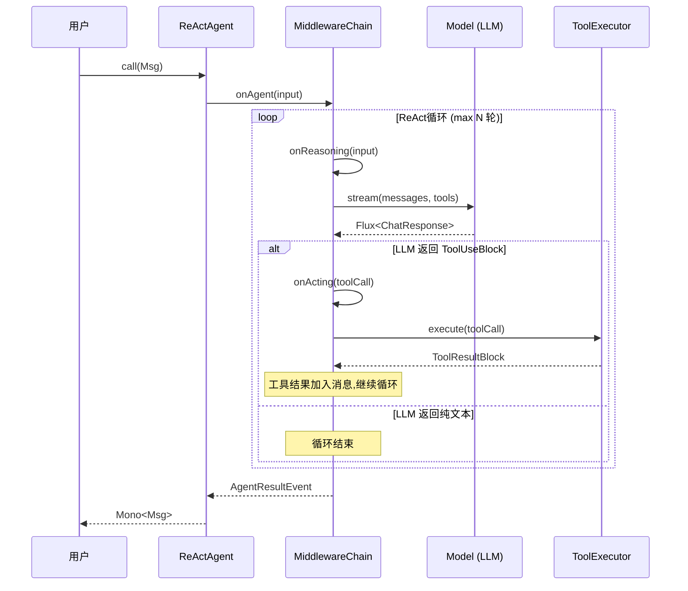
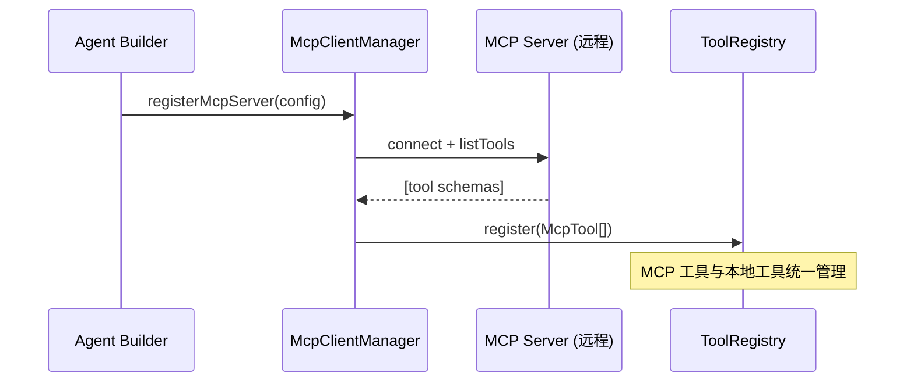
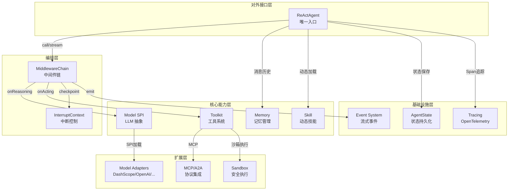

# 用 Java 构建生产级 AI Agent？AgentScope Java 源码级深度剖析

> 你在 Spring Boot 项目里接 LLM 接口，写一堆 if-else 做工具调用路由，然后发现 Agent 跑着跑着就失控了——该停停不下来，该恢复恢复不了。AgentScope Java 试图用一套完整的 Agent 编程框架解决这个问题。

## 1. 一句话定位

**AgentScope Java** 是阿里开源的 Java Agent 编程框架，核心卖点是 **ReAct 推理循环 + 生产级运行时控制**。不是一个 LLM API 封装库，而是从 Agent 生命周期管理、工具系统、中断恢复、多 Agent 协作到可观测性的完整解决方案。

| 指标 | 数值 |
|---|---|
| Star | ⭐ 4,270 |
| Fork | 929 |
| 主语言 | Java（94%）+ TypeScript（6%） |
| 最新版本 | v2.0.0-RC4（2026-06-18） |
| JDK 要求 | 17+ |
| 许可证 | Apache-2.0 |
| Maven 坐标 | `io.agentscope:agentscope:1.0.12` |

官网：[java.agentscope.io](https://java.agentscope.io/)

## 2. 谁该关注这个项目

- **Java 后端团队**想在现有微服务架构里嵌入 AI Agent 能力，但不想引入 Python 依赖
- 需要 **Agent 中断/恢复/人工介入** 的企业场景（审批流、高风险操作确认）
- 想用 **MCP 协议** 接入工具生态，或用 **A2A 协议** 做多 Agent 服务发现
- 已有 Spring Boot 基础设施，希望 **一个 Starter 就能跑起来**

不适合：只想快速包一层 ChatGPT API 做聊天机器人（太重了）、Python-first 的 ML 团队（用原版 AgentScope）。

## 3. 项目结构全景

```
agentscope-java/
├── agentscope-core/                # 核心框架（299 个 Java 类）
│   └── io.agentscope.core/
│       ├── ReActAgent.java         # 唯一的 Agent 实现（核心中的核心）
│       ├── agent/                  # Agent 接口体系 + 事件 + 流式
│       ├── model/                  # LLM 抽象层（SPI 机制）
│       ├── tool/                   # 工具系统（Toolkit 门面）
│       ├── middleware/             # 中间件链（2.0 新架构）
│       ├── hook/                   # Hook 系统（1.x 遗留，已 deprecated）
│       ├── memory/                 # 记忆管理（短期 + 长期）
│       ├── skill/                  # 动态技能加载
│       ├── message/               # 不可变消息体系
│       ├── state/                  # 状态持久化
│       ├── interruption/          # 中断/恢复机制
│       ├── rag/                   # RAG 集成
│       ├── tracing/               # OpenTelemetry 追踪
│       └── event/                 # 事件流系统
├── agentscope-extensions/          # 扩展生态
│   ├── agentscope-extensions-model/    # 模型适配（DashScope/OpenAI/Gemini/Ollama/Anthropic）
│   ├── agentscope-extensions-channel/  # 通道（钉钉/飞书/企微/GitHub/GitLab）
│   ├── agentscope-extensions-mem/      # 记忆后端（Mem0/百炼/Reme）
│   ├── agentscope-extensions-rag/      # RAG 后端（百炼/Dify/Haystack/RAGFlow/Simple）
│   ├── agentscope-extensions-sandbox/  # 安全沙箱（AgentRun/Daytona/E2B/K8s）
│   ├── agentscope-extensions-protocol/ # 协议（A2A/AGUI/Chat Completions）
│   ├── agentscope-extensions-scheduler/# 调度（Quartz/XXL-Job）
│   ├── agentscope-extensions-nacos/    # Nacos 集成（A2A注册/Prompt管理/Skill仓库）
│   ├── agentscope-extensions-studio/   # 可视化调试工具
│   └── agentscope-spring-boot-starters/# Spring Boot Starters（10+个）
├── agentscope-harness/             # Agent 运行环境（文件系统/消息总线/Workspace）
├── agentscope-examples/            # 示例 Agent
│   └── agents/
│       ├── agentscope-codingagent/ # 编程 Agent
│       ├── agentscope-dataagent/   # 数据分析 Agent
│       └── agentscope-paw/         # 通用 Agent Workspace
└── docs/                           # 文档
```

## 4. 源码深度分析

### 4.1 模块清单与优先级

| 模块 | 目录 | 核心职责 | 分析级别 |
|---|---|---|---|
| **ReActAgent** | `core/ReActAgent.java` | 推理-行动循环引擎 | P0 |
| **agent** | `core/agent/` | Agent 接口体系 + 生命周期 | P0 |
| **tool** | `core/tool/` | 工具注册/执行/MCP集成 | P0 |
| **middleware** | `core/middleware/` | 2.0 中间件链（洋葱模型） | P0 |
| **model** | `core/model/` | LLM 抽象 + SPI 扩展 | P1 |
| **memory** | `core/memory/` | 短期记忆 + 长期记忆 | P1 |
| **skill** | `core/skill/` | 动态技能加载 | P1 |
| **interruption** | `core/interruption/` | 中断/恢复/HITL | P1 |
| **harness** | `agentscope-harness/` | Agent 运行环境 | P2 |
| **extensions** | `agentscope-extensions/` | 生态扩展 | P2 |

### 4.2 核心模块剖析：Agent 体系

**定位**：定义 Agent 的核心契约，所有 Agent 实现必须遵守的接口协议。

**接口继承关系**：

```
Agent (完整接口)
├── CallableAgent        → call(Msg): Mono<Msg>     处理消息并生成回复
├── StreamableAgent      → stream(Msg): Flux<Event> 流式事件输出
└── ObservableAgent      → observe(Msg): void       接收消息不回复（多Agent协作）
```

**核心类解析**：

| 类/接口 | 文件 | 核心职责 | 关键设计 |
|---|---|---|---|
| `Agent` | `agent/Agent.java` | 顶层接口，组合3种能力 | 接口隔离原则 |
| `AgentBase` | `agent/AgentBase.java` | 抽象基类，提供基础设施 | Template Method |
| `ReActAgent` | `core/ReActAgent.java` | 唯一具体实现 | Builder + ReAct Loop |
| `RuntimeContext` | `agent/RuntimeContext.java` | 每次调用的运行时上下文 | Context Pattern |

**关键代码段**——Agent 接口设计哲学：

```java
// 文件：agentscope-core/.../agent/Agent.java
// 设计决策：Memory 不是 Agent 接口的一部分
// 理由：不是所有 Agent 都需要记忆，记忆是具体实现的职责
public interface Agent extends CallableAgent, StreamableAgent, ObservableAgent {
    String getAgentId();
    String getName();
    void interrupt();          // 安全中断
    void interrupt(Msg msg);   // 带消息的中断（HITL）
    default AgentState getAgentState() { return null; }
    default Toolkit getToolkit() { return null; }
}
```

**设计解读**：
- Agent 接口极简——只定义"能做什么"（call/stream/observe/interrupt），不规定"怎么做"
- Memory、Toolkit 通过 `default` 方法暴露，不强制要求
- 中断机制是**一等公民**，直接写进接口——这在同类框架中很少见

### 4.3 核心模块剖析：工具系统（Toolkit）

**定位**：工具注册、分组管理、Schema 生成、执行调度的统一门面。

**内部结构**：

```
tool/
├── Toolkit.java              # 门面（Facade），协调下游管理器
├── ToolRegistry.java         # 工具注册表（名称→Tool 映射）
├── ToolGroupManager.java     # 工具分组（动态启用/禁用）
├── ToolSchemaProvider.java   # 向 LLM 提供可用工具 Schema
├── ToolSchemaGenerator.java  # 反射生成 JSON Schema
├── ToolMethodInvoker.java    # 方法调用 + 参数转换
├── ToolExecutor.java         # 并行/串行执行策略
├── McpClientManager.java     # MCP 协议客户端管理
├── MetaToolFactory.java      # 元工具（运行时增减工具）
├── mcp/                      # MCP 协议实现
│   ├── McpTool.java          # MCP 工具封装
│   ├── McpClientWrapper.java # 客户端包装
│   └── McpClientBuilder.java # 构建器
├── subagent/                 # Sub-Agent 作为工具
│   ├── SubAgentTool.java     # 子 Agent 工具
│   └── SubAgentProvider.java # 子 Agent 提供者
└── builtin/
    └── TodoTools.java        # 内置任务管理工具
```

**Toolkit 门面模式**：

```java
// 文件：agentscope-core/.../tool/Toolkit.java
// 5个专职管理器各司其职，Toolkit 只做协调
public class Toolkit {
    private final ToolGroupManager groupManager;      // 分组 CRUD
    private final ToolRegistry toolRegistry;          // 注册查找
    private final ToolSchemaProvider schemaProvider;   // Schema 过滤
    private final MetaToolFactory metaToolFactory;     // 元工具
    private final McpClientManager mcpClientManager;   // MCP 客户端
    private final ToolSchemaGenerator schemaGenerator;  // Schema 生成
    private final ToolMethodInvoker methodInvoker;      // 方法调用
    private final ToolExecutor executor;               // 执行调度
}
```

**设计解读**：
- 采用 **Facade + 策略** 组合：Toolkit 是门面，每个 Manager 是一个独立策略
- 工具分组（ToolGroup）允许运行时动态切换可用工具集——Agent 可以"自己决定下一步用哪组工具"
- MCP 客户端管理器让接入外部工具只需一行配置，不用写 Java 代码

### 4.4 核心模块剖析：中间件系统（Middleware）

**定位**：v2.0 引入的新架构，替代旧 Hook 系统。5 个拦截点，洋葱模型。

```java
// 文件：agentscope-core/.../middleware/MiddlewareBase.java
public interface MiddlewareBase {
    // 洋葱模型（4个 wrap 式拦截）
    Flux<AgentEvent> onAgent(Agent, RuntimeContext, AgentInput, Function<AgentInput, Flux<AgentEvent>> next);
    Flux<AgentEvent> onReasoning(Agent, RuntimeContext, ReasoningInput, Function<ReasoningInput, Flux<AgentEvent>> next);
    Flux<AgentEvent> onActing(Agent, RuntimeContext, ActingInput, Function<ActingInput, Flux<AgentEvent>> next);
    Flux<AgentEvent> onModelCall(Agent, RuntimeContext, ModelCallInput, Function<ModelCallInput, Flux<AgentEvent>> next);

    // 管道模型（1个 transform 式拦截）
    Mono<String> onSystemPrompt(Agent, RuntimeContext, String prompt);
}
```

**与旧 Hook 系统对比**：

| 维度 | Hook（1.x，已废弃） | Middleware（2.0） |
|---|---|---|
| 粒度 | Pre/Post 事件对 | 完整的 wrap（前+后+异常） |
| 组合 | 列表遍历 | 洋葱链式调用 |
| 控制 | 只能观察/修改事件 | 可以短路、重试、替换整段逻辑 |
| 异步 | `Mono<T>` 返回 | `Flux<AgentEvent>` 流式 |

**设计解读**：
- 这个中间件系统本质是 **ASP.NET Core 的 Middleware Pipeline** 在 Java Reactive 上的翻版
- 5 个拦截点覆盖了 Agent 执行的所有关键阶段，足够做：日志、鉴权、限流、重试、降级、Tracing
- `onSystemPrompt` 单独用管道模式而非洋葱模式——因为 System Prompt 是纯转换，不需要 wrap 语义

### 4.5 核心流程追踪

#### 流程 1：用户发送消息 → Agent 回复（完整 ReAct 循环）

**调用链**：

1. `ReActAgent.call(Msg)` — 入口，创建 RuntimeContext
2. → `MiddlewareChain.onAgent()` — 执行 Agent 级中间件链
3. → `ReActAgent.doStream()` — 进入 ReAct 循环
4. → `MiddlewareChain.onReasoning()` — 推理阶段中间件
5. → `Model.stream(messages, tools, options)` — 调用 LLM
6. → 解析 LLM 输出：TextBlock / ThinkingBlock / ToolUseBlock
7. → 如果有 ToolUseBlock → `MiddlewareChain.onActing()` — 行动阶段中间件
8. → `ToolExecutor.execute(toolCall)` — 执行工具
9. → 将工具结果加入 messages，回到步骤 4（循环）
10. → 如果是 TextBlock 且无 ToolUse → 循环结束，返回最终 Msg
11. ← `checkInterruptedAsync()` — 每个关键节点检查中断标志



#### 流程 2：动态工具注册（MCP 协议接入）

**调用链**：

1. `ReActAgent.Builder.mcp(mcpConfig)` — 构建时声明 MCP 服务
2. → `McpClientManager.registerMcpServer()` — 注册 MCP 客户端
3. → `McpClientWrapper.connect()` — 建立连接
4. → `McpClientWrapper.listTools()` — 获取远程工具列表
5. → `ToolRegistry.register(mcpTool)` — 将远程工具注册到本地
6. → 运行时 LLM 可选中 MCP 工具 → `McpTool.execute()` → 远程调用



#### 流程 3：Agent 中断与恢复（HITL）

**调用链**：

1. 外部调用 `agent.interrupt(userMsg)` — 设置中断标志
2. → Agent 在下一个 checkpoint 调用 `checkInterruptedAsync()`
3. → 抛出 `InterruptedException`
4. → `AgentBase.call()` 的 `onErrorResume` 捕获
5. → 执行 `handleInterrupt(context, msg)` — 保存上下文
6. → 返回中断状态的 Msg（含完整执行上下文）
7. → 用户修改/确认后再次调用 `agent.call(resumeMsg)` 继续执行

### 4.6 设计模式与技术亮点

| 设计模式 | 使用位置 | 解决的问题 | 为什么选这个方案 |
|---|---|---|---|
| **ReAct Pattern** | `ReActAgent.doStream()` | LLM 自主规划+执行 | 比纯 workflow 更灵活，比纯 LLM 更可控 |
| **Middleware Chain** | `MiddlewareChain` | 横切关注点（日志/鉴权/追踪） | 洋葱模型比事件模型组合性更强 |
| **Facade** | `Toolkit` | 工具系统复杂度管理 | 5 个内部管理器对外暴露统一接口 |
| **SPI** | `Model` + `extensions-model/` | 模型提供者扩展 | 新模型只需加 JAR，不改核心代码 |
| **Builder** | `ReActAgent.Builder` | Agent 构建配置化 | 30+ 配置项，Builder 比构造函数清晰 |
| **Reactive Streams** | 全框架 (`Mono`/`Flux`) | 非阻塞 + 流式输出 | GraalVM Native 200ms 冷启动 |
| **Cooperative Interrupt** | `InterruptContext` | 安全中断正在运行的 Agent | 比强制 kill 更安全，保留完整上下文 |

**技术亮点：Cooperative Interrupt 的实现**

```java
// AgentBase 中的协作中断模式
// Agent 不会被"杀死"，而是在检查点主动让出
protected Mono<Void> checkInterruptedAsync() {
    if (interruptContext.isInterrupted()) {
        return Mono.error(new InterruptedException(interruptContext));
    }
    return Mono.empty();
}
```

这个设计的 trade-off：
- **优势**：上下文完整保留，可恢复执行；不会打断工具调用到一半的脏状态
- **代价**：中断不是即时的，依赖 Agent 代码中有足够的 checkpoint；如果 LLM 调用耗时长，中断会有延迟

### 4.7 模块关系全景图



## 5. 快速上手

**Maven 依赖**：

```xml
<dependency>
    <groupId>io.agentscope</groupId>
    <artifactId>agentscope</artifactId>
    <version>1.0.12</version>
</dependency>
<!-- 模型适配（选一个） -->
<dependency>
    <groupId>io.agentscope</groupId>
    <artifactId>agentscope-extensions-model-dashscope</artifactId>
    <version>1.0.12</version>
</dependency>
```

**最小可运行示例**：

```java
ReActAgent agent = ReActAgent.builder()
    .name("Assistant")
    .sysPrompt("你是一个有帮助的 AI 助手。")
    .model(DashScopeChatModel.builder()
        .apiKey(System.getenv("DASHSCOPE_API_KEY"))
        .modelName("qwen-max")
        .build())
    .build();

Msg response = agent.call(Msg.builder()
    .textContent("帮我分析一下今天的天气")
    .build()).block();

System.out.println(response.getTextContent());
```

**注册自定义工具**：

```java
public class WeatherTools {
    @Tool(description = "获取指定城市的天气")
    public String getWeather(@ToolParam("城市名") String city) {
        return callWeatherApi(city);
    }
}

Toolkit toolkit = new Toolkit();
toolkit.registerObject(new WeatherTools());

ReActAgent agent = ReActAgent.builder()
    .name("WeatherAgent")
    .toolkit(toolkit)
    .model(model)
    .build();
```

## 6. 竞品对比：和 LangChain4j / Spring AI 的本质差异

这不是功能对比表（网上已经够多了），而是**架构层面的设计分歧**：

| 维度 | AgentScope Java | LangChain4j | Spring AI |
|---|---|---|---|
| **核心抽象** | Agent（自主 ReAct 循环） | Chain/Pipeline（显式编排） | ChatClient（请求-响应） |
| **执行模型** | Reactive（Mono/Flux 全链路） | 同步阻塞为主 | 同步 + 少量异步 |
| **中断能力** | 一等公民（接口级） | 无原生支持 | 无原生支持 |
| **工具系统** | Toolkit（分组 + MCP + SubAgent） | @Tool 注解 | FunctionCallback |
| **扩展方式** | Middleware 洋葱链 | 无统一拦截层 | Advisor 机制 |
| **集成立场** | 独立框架，可选 Spring Starter | 独立，有 Spring/Quarkus 桥 | Spring 生态原生 |
| **适合场景** | 长时间运行 Agent + 生产运维 | 快速 PoC + 多模型切换 | 已有 Spring 项目 + 简单对话 |

说直白点：
- **LangChain4j** 更像"乐高积木"——模型多、适配快、上手简单，但长时间运行的 Agent 控制力弱
- **Spring AI** 更像"Spring 全家桶的 AI 插件"——和 Spring 生态无缝，但 Agent 自主能力有限
- **AgentScope Java** 更像"Agent 操作系统"——控制力最强（中断/恢复/权限/沙箱），但学习曲线陡

## 7. 社区热点与 Issues 分析

从高评论 Issues 中提炼几个关键信息：

| Issue | 主题 | 状态 | 意义 |
|---|---|---|---|
| #206 | 用 OkHttp 替换各模型 SDK | Open | 统一 HTTP 层，减少依赖冲突 |
| #600 | MySQL Skill Repository | Closed | 支持从数据库动态加载技能定义 |
| #956 | Tool 执行超时导致 IllegalStateException | Closed | 修复了工具超时的异常处理 |
| #88 | 实现 Agent Skill 机制 | Closed | Skill 系统的原始设计讨论 |
| #375 | Nacos A2A 注册发现 | Closed | 多 Agent 分布式协作基础 |

**社区健康度**：
- **活跃度**：极高。2026-06-18 发布 RC4，几乎每周一个版本
- **贡献者**：929 Fork，说明有大量二次开发
- **文档**：有完整的官方文档站 + 中文 README
- **维护状态**：快速迭代期（v1.x → v2.0 大版本升级进行中）

## 8. Issues 中暴露的架构决策

1. **#206 揭示的问题**：每个模型扩展都引入自己的 HTTP 客户端（DashScope SDK、OpenAI SDK 等），导致依赖冲突。计划统一用 OkHttp——这是 Java 生态的经典痛点

2. **v2.0 的 Hook → Middleware 迁移**：Hook 系统标记为 `@Deprecated(forRemoval=true)`，说明团队认为事件驱动的 Pre/Post 模型不够用，需要完整的洋葱链控制力

3. **Skill 系统的演进**（#88 → #600）：从静态文件加载 → MySQL 动态存储，暗示团队在朝"多租户 Agent 平台"方向发展

## 9. 代码质量观察

| 维度 | 评估 | 具体依据 |
|---|---|---|
| **测试覆盖** | 较好 | 每个核心模块有对应 test 目录，含集成测试 |
| **错误处理** | 优秀 | Reactive 全链路错误传播 + InterruptException 专属处理 |
| **文档** | 良好 | Javadoc 详细到设计哲学层面（Agent.java 注释写了设计意图） |
| **类型安全** | 优秀 | 泛型事件系统 + `Mono<Msg>` 强制单回复语义 |
| **依赖管理** | 中等 | BOM 管理但扩展模块引入各模型 SDK 导致依赖树偏重 |

## 10. 配图提示词

<!-- IMAGE_PROMPT: gpt-image2
生成一张专业技术架构信息图，标题：「AgentScope Java 功能结构全景图」。

布局：
- 顶部：AgentScope Java + "Agent-Oriented Programming for Java" + ⭐4.2K 徽章
- 左侧输入层：用户消息 / MCP工具调用 / A2A Agent请求 / 定时任务触发
- 中间核心层（从上到下 4 层）：
  - ReActAgent（推理-行动循环引擎）
  - Middleware Chain（中间件链：日志/鉴权/限流/追踪）
  - Toolkit（工具注册+分组+MCP+SubAgent）
  - Model SPI（DashScope/OpenAI/Gemini/Ollama/Anthropic）
- 右侧输出层：流式文本响应 / 工具调用结果 / Agent事件流 / 状态持久化
- 底部支撑层：Memory（短期+长期）/ State / Tracing（OTel）/ Sandbox

视觉风格：
- 现代扁平技术架构图，16:9 画幅
- 主色 #3366CC，辅色 #5B8FF9，背景浅灰 #F7F8FA
- 中文标签清晰，模块间箭头连接
- 不使用真实公司 Logo
-->

<!-- IMAGE_PROMPT: gpt-image2
为 AgentScope Java (Java 开源 AI Agent 框架) 设计封面图。
主题：用 Java 构建可控的 AI Agent
风格：现代极简，主色 #3366CC，暗蓝渐变背景
画面中心：一个精密的齿轮组（象征可控的机械精度）中间嵌入一个发光的大脑图标（象征 AI 推理），齿轮上浮动着 Java 代码片段
右上角：⭐ 4.2K Stars 贴纸徽章
左下角：JDK 17+ / Maven Central / Apache-2.0 小标签
画幅 16:9，适合公众号首图
-->

## 11. 深度总结

### 项目定位与价值

AgentScope Java 不是"又一个 LLM API 封装"。它的核心差异化是把 **Agent 的运行时控制权** 提升到框架级别——中断、恢复、权限、沙箱、可观测性，这些在 LangChain4j/Spring AI 中需要自己实现的东西，这里是内置的。

这意味着它更适合"Agent 在生产环境跑，你需要对它的行为有控制力"的场景，而不是"快速写个 demo 验证想法"的场景。

### 技术架构评价

| 维度 | 评分 | 具体依据 |
|---|---|---|
| 架构清晰度 | ⭐⭐⭐⭐⭐ | 4 层分层清晰，接口/实现/扩展边界明确 |
| 扩展性 | ⭐⭐⭐⭐⭐ | SPI + Middleware + ToolGroup，三个维度都能扩展 |
| 学习曲线 | ⭐⭐⭐ | Reactive 编程 + Agent 概念 + 中间件链，新手门槛高 |
| 生产就绪 | ⭐⭐⭐⭐ | OTel 追踪、优雅关闭、状态持久化都有，但 v2.0 还在 RC |
| 生态丰富度 | ⭐⭐⭐⭐ | 模型5家、渠道5个、RAG5种、沙箱4种，但比 LangChain4j 少 |

### 适用场景与边界

| 适用度 | 场景 |
|---|---|
| **最适合** | 企业级长时运行 Agent、需要 HITL 审批流、Java 微服务生态内嵌 Agent |
| **也适合** | 多 Agent 协作（A2A 协议）、需要安全沙箱的代码执行 Agent |
| **勉强可用** | 简单问答机器人（框架太重）、快速 PoC（上手成本高） |
| **不适合** | Python ML 团队、只需调 API 不需要 Agent 自主决策、前端 Chatbot |

### 我的建议

- **Java 后端团队**已有微服务基础设施：直接用 Spring Boot Starter 接入，重点看 Middleware 怎么加鉴权和限流
- **想学习 Agent 框架设计**：从 `ReActAgent.java` + `Toolkit.java` + `MiddlewareBase.java` 三个文件入手，这三个文件就是整个框架的骨架
- **想快速出 Demo**：考虑先用 LangChain4j，等需求明确了再迁移到 AgentScope
- **源码学习价值**：Reactive Agent 循环的实现、Cooperative Interrupt 模式、Middleware Chain 的组合方式——这三个设计在其他 Java Agent 框架中很少见，值得深入研究

