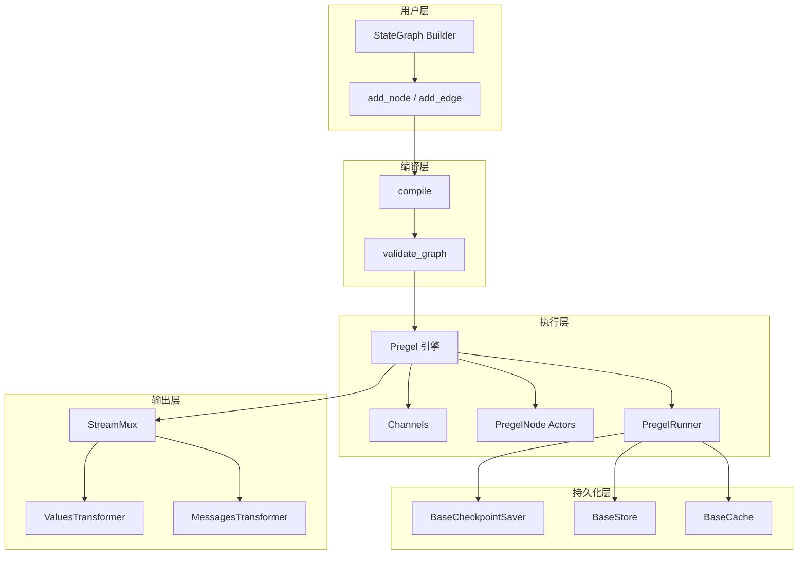
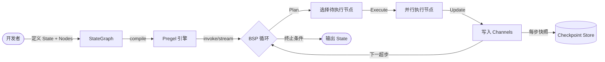
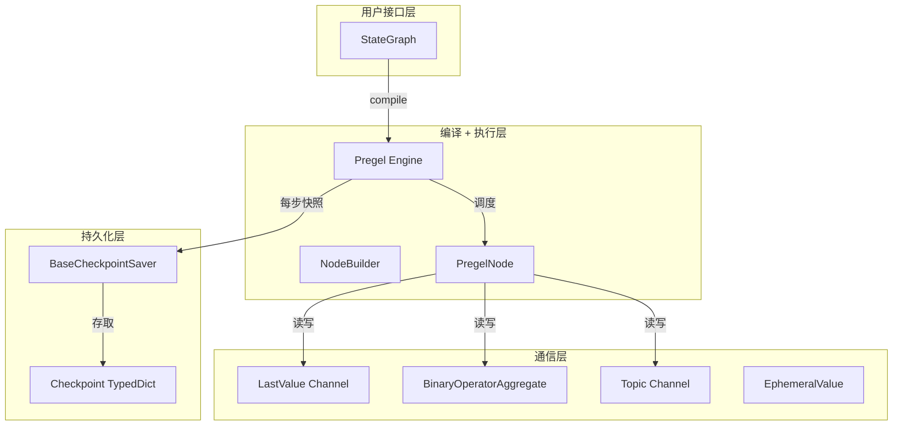
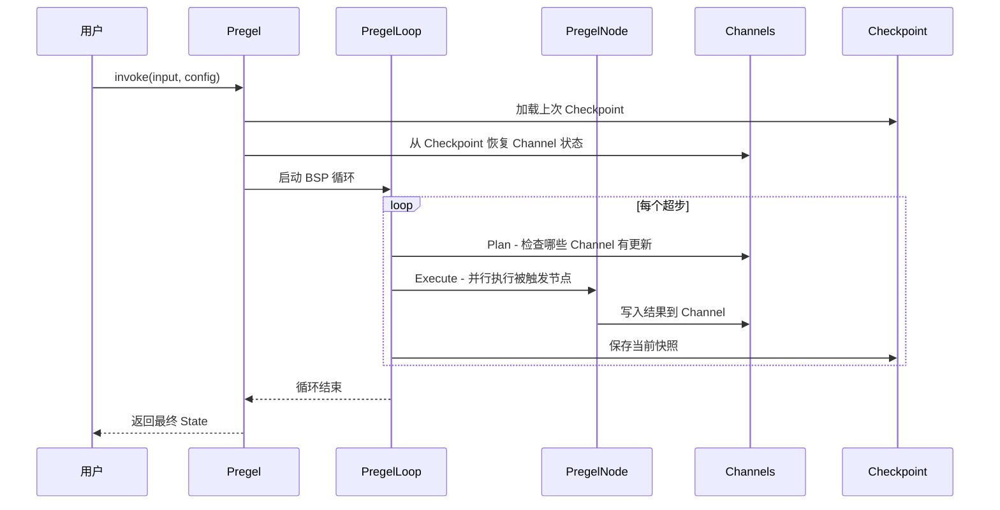

# 深度剖析 LangGraph：用图论思维驯服有状态 AI Agent

> 你的 Agent 跑到一半崩了，链式调用中间状态全丢，只能从头再来。或者你需要 Agent 执行到某个节点时暂停等人工审批，但现有框架压根没给你暂停的能力。LangGraph 就是为解决这类"Agent 需要记住自己在哪、做过什么"的问题而生的。

## 1. 项目速览

| 项目 | 内容 |
|---|---|
| 项目名称 | LangGraph |
| 一句话定位 | 构建有状态 AI Agent 的底层图编排框架 |
| GitHub 地址 | [langchain-ai/langgraph](https://github.com/langchain-ai/langgraph) |
| 官方网站 | https://langchain-ai.github.io/langgraph/ |
| 主要语言 | Python（主），TypeScript/JavaScript（副） |
| 技术栈 | LangChain 生态、Pregel 算法、Checkpoint 持久化 |
| 开源协议 | MIT |
| Star 数 | ⭐ 36.6k（2025-07） |
| 最新版本 | v0.x（v1 路线图已公布，正在推进） |
| 维护状态 | 活跃开发（v1 roadmap #4973） |
| 适合人群 | 需要持久化执行、人工审批、复杂多步骤编排的 Agent 开发者 |

## 2. 它解决了什么问题

普通 LLM Chain 有个根本缺陷：**无状态**。一次调用结束，中间数据就没了。当 Agent 需要以下能力时，链式调用完全不够用：

- **持久化执行**：Agent 跑到一半挂了（网络超时、模型限流），你想从断点恢复而不是从头开始
- **人工审批卡点**：Agent 准备发邮件或转账时，你希望它停下来等你确认，而不是一口气冲到底
- **多 Agent 协作**：5 个 Agent 并行处理不同子任务，结果汇聚到同一个共享状态里，谁先写完谁的结果立即可见？还是等全部完成再合并？这个控制权必须给开发者

LangGraph 的解法是把 Agent 的执行抽象成一张**有向图**：节点是处理逻辑，边是状态流转，图运行时维护一个全局 State——可持久化、可回溯、可暂停恢复。

## 3. 核心功能特性

### 3.1 核心功能

- **StateGraph 构图 API**：用 `add_node()` / `add_edge()` / `compile()` 三步声明式构建执行图，节点签名是 `State → Partial<State>`，学习曲线相当于会写函数就行
- **Checkpoint 持久化**：每一步执行结果自动存档，默认支持内存、SQLite、PostgreSQL。断点恢复只需传同一个 `thread_id`
- **Human-in-the-Loop 中断**：通过 `interrupt()` 在任意节点暂停执行，等人工确认后用 `Command(resume=...)` 继续
- **并行执行与 BSP 隔离**：同一"超步"内多个节点并行运行，写入结果互不可见（Bulk Synchronous Parallel 模型），下一步才能读到上一步的全部产出

### 3.2 特色能力

- **Pregel 执行引擎**：不是简单的 DAG 执行器。灵感来自 Google Pregel 论文——图中节点像 Actor 一样通过 Channel 通信，适合表达循环、条件分支、子图嵌套等复杂拓扑
- **TypedDict + Annotated Reducer**：状态 Schema 用 Python 原生 TypedDict 定义，对同一字段多次写入怎么合并？加个 `Annotated[list, reducer]` 注解搞定，不需要学新 DSL
- **流式输出**：`stream()` 支持 values/messages/updates/debug 等多种模式，token 级别的流式回调开箱可用
- **子图嵌套**：一个 StateGraph 编译后可以作为另一个图的节点，支持层级化编排和 Map-Reduce 模式

### 3.3 功能边界

- ✅ 适合：需要持久化、中断恢复、多步编排的生产级 Agent；需要精确控制执行流程的场景
- ❌ 不适合：一问一答的简单 Chain（杀鸡用牛刀）；不需要状态管理的批量推理任务
- ⚠️ 使用前确认：底层框架，调试成本比高层封装（如 Deep Agents、CrewAI）高不少；与 LangChain 生态深度绑定

<!-- IMAGE_PROMPT: gpt-image2
生成一张「LangGraph 功能结构全景图」信息图。

布局：
- 顶部标题：LangGraph 功能结构全景图 + 副标题「有状态 Agent 编排框架」+ ⭐ 36.6k 徽章
- 左侧输入层：用户定义（State Schema、Node 函数、Edge 条件）
- 中间核心层：StateGraph Builder → Pregel 执行引擎 → Channel 通信 → Checkpoint 持久化 → Human-in-the-Loop 中断/恢复 → Stream 输出
- 底部支撑层：LangChain Runnable / BaseCheckpointSaver(Memory|SQLite|Postgres) / BaseStore / BaseCache
- 右侧输出层：流式响应 / 状态快照 / 可视化图谱

视觉风格：
- 现代技术架构图，干净克制，16:9 画幅
- 主色 #3366CC，辅色 #5B8FF9，浅色背景 #F5F7FB
- 模块间清晰箭头连接，体现从声明到执行到输出的流程
- 中文文字清晰可读，PingFang SC 字体
-->

## 4. 架构设计

### 4.1 整体架构



### 4.2 数据流



### 4.3 核心设计思想

- **图即程序**：把 Agent 的控制流显式画出来，不藏在代码逻辑里。开发者看图就知道 Agent 会怎么走
- **BSP 隔离**：借鉴 Google Pregel——同一步骤内并行节点的写入互不干扰，避免竞态问题。这比 Actor 模型的异步消息传递更容易推理正确性
- **Channel 抽象通信**：节点不直接互调，而是通过 Channel 读写状态。`LastValue`（保留最新值）、`BinaryOperatorAggregate`（用 reducer 聚合多次写入）、`EphemeralValue`（用完即弃）——不同 Channel 类型满足不同场景
- **编译时验证**：`compile()` 阶段就能检查出死循环、未连接节点、Schema 不匹配等问题，比运行时报错省调试时间

## 5. 社区热点（Issues 分析）

### 5.1 精选 Issue

| # | 标题 | 讨论要点 | 状态 |
|---|---|---|---|
| [#4973](https://github.com/langchain-ai/langgraph/issues/4973) | 🚧 LangGraph v1 roadmap – feedback wanted! | v1 规划征集社区反馈，重点：API 清理、StateGraph 易用性改进、向后兼容 | Open |
| [#3716](https://github.com/langchain-ai/langgraph/issues/3716) | langgraph-checkpoint-postgres SSL error | PostgreSQL checkpoint 在 SSL 连接时出 bad length 错误，跨多个版本 | Open |
| [#7417](https://github.com/langchain-ai/langgraph/issues/7417) | Long tool calls re-executed from checkpoint | 180s+ 的工具调用会从 checkpoint 重新执行，Cloud 环境下的持久化超时问题 | Open |
| [#8026](https://github.com/langchain-ai/langgraph/issues/8026) | Feature Request: ApprovalNode for HITL | 社区希望有开箱即用的高层 HITL 节点，降低 interrupt/resume 的使用门槛 | Open |
| [#6731](https://github.com/langchain-ai/langgraph/issues/6731) | Agent infinite looping until recursion limit | Agent 无限循环直到递归上限报错，和条件边/循环检测机制有关 | Closed |

### 5.2 社区健康度

- **维护响应**：核心团队（Sydney Runkle 等）活跃回复，大多数 Issue 48h 内有标记
- **Release 节奏**：月均 2-3 个 patch 版本，主版本正在推进 v1
- **社区参与**：v1 roadmap 主动征集反馈，接受社区 PR
- **文档完整度**：官方文档覆盖面广，但社区反馈"概念太多、入门曲线陡"

## 6. 竞品对比

| 维度 | LangGraph | CrewAI | AutoGen(微软) |
|---|---|---|---|
| 核心定位 | 底层图编排引擎 | 高层多 Agent 协作框架 | Actor 模型多 Agent 系统 |
| 抽象层级 | 低（你画图你负责） | 高（角色+任务声明式） | 中（Actor 消息传递） |
| 状态管理 | 一等公民：TypedDict + Channel + Checkpoint | 有限：Task 间传递 | AgentChat GroupChat 状态 |
| 持久化恢复 | 内置：内存/SQLite/Postgres | 无原生支持 | 无原生支持 |
| Human-in-the-Loop | 原生 interrupt/resume | 有限支持 | 通过 Agent 拦截 |
| 上手成本 | 高：需要理解 Graph/Channel/Pregel 概念 | 低：写 YAML 配置就能跑 | 中：理解 Actor + 消息类型 |
| 生态绑定 | LangChain 生态深度集成 | 独立但集成 LangChain | 独立，已进入维护模式 |
| 适合场景 | 需要精确控制 + 持久化的生产 Agent | 快速搭建多角色协作 Demo | 研究性多 Agent 实验 |

说实话，如果你只是想快速搭个多角色对话 Demo，CrewAI 的门槛低很多。LangGraph 的价值体现在**生产环境**——当你需要 Agent 断点恢复、人工审批、精确控制哪个节点在什么条件下执行时，LangGraph 的底层控制力无可替代。AutoGen 在架构设计上有不少有意思的想法（Actor 模型、Pub/Sub），但微软已经把它转为维护模式了。

## 7. 快速上手

```bash
pip install langgraph
```

```python
from langgraph.graph import StateGraph, START, END
from typing import TypedDict, Annotated

def reducer(a: list, b: list) -> list:
    return a + b

class State(TypedDict):
    messages: Annotated[list, reducer]

def chatbot(state: State) -> dict:
    # 这里接你的 LLM 调用
    return {"messages": [{"role": "assistant", "content": "Hello!"}]}

graph = StateGraph(State)
graph.add_node("chatbot", chatbot)
graph.add_edge(START, "chatbot")
graph.add_edge("chatbot", END)

app = graph.compile()
result = app.invoke({"messages": [{"role": "user", "content": "Hi"}]})
print(result["messages"])
```

运行成功后应该看到：`messages` 列表包含用户输入和 assistant 回复两条消息。

## 8. 源码深度分析

> 我聚焦了 3 个核心模块：StateGraph（构图层）、Pregel（执行引擎）、Checkpoint（持久化）。代码量分别是 1965 行、4365 行、861 行——Pregel 引擎占了大头。

### 8.1 模块全景

| 模块 | 目录 | 核心职责 | 代码量 | 分析级别 |
|---|---|---|---|---|
| StateGraph | `langgraph/graph/state.py` | 声明式构图 API，Schema 验证 | ~1965行 | P0 深度分析 |
| Pregel 引擎 | `langgraph/pregel/main.py` | BSP 执行循环、Actor 调度 | ~4365行 | P0 深度分析 |
| Checkpoint | `libs/checkpoint/langgraph/checkpoint/base/` | 状态快照存取、版本管理 | ~861行 | P1 关键流程 |
| Channels | `langgraph/channels/` | 节点间通信原语 | ~200行/类型 | P1 关键流程 |
| Prebuilt | `langgraph/prebuilt/` | 高层封装（create_react_agent） | 未公开行数 | P2 简要说明 |



### 8.2 核心模块剖析：StateGraph

**定位**：用户直接交互的 Builder API。你定义 State Schema、添加节点和边、调用 `compile()` 得到可执行的 Pregel 实例。StateGraph 本身不执行任何逻辑。

**核心类与接口**：

| 类/接口 | 文件 | 核心方法 | 设计说明 |
|---|---|---|---|
| `StateGraph` | `graph/state.py` | `add_node()`, `add_edge()`, `compile()` | 泛型类 `Generic[StateT, ContextT, InputT, OutputT]`，编译时验证 |
| `_NodeDefaults` | `graph/state.py` | — | dataclass 存储全局默认策略（retry/cache/timeout） |
| `StateNodeSpec` | `graph/_node.py` | — | 节点元数据容器 |

**关键代码解读**：

```python
# 文件：langgraph/graph/state.py
# 说明：StateGraph 的 Channel 类型推断——从 TypedDict Annotated 注解自动选择通信原语

# 用户写的 State：
class State(TypedDict):
    messages: Annotated[list, reducer]  # → BinaryOperatorAggregate
    count: int                          # → LastValue（默认）

# StateGraph.__init__ 调用 _add_schema(state_schema)
# 内部对每个字段：
#   - 有 Annotated + callable reducer → BinaryOperatorAggregate(reducer)
#   - 无注解 → LastValue（只允许单次写入，多次写入报错）
#   - EphemeralValue：标记为临时字段，每步结束后清空
```

**设计解读**：

- 用 Python 原生 `TypedDict` + `Annotated` 做 Schema，不需要学新 DSL。这是个聪明的选择——IDE 自动补全、mypy 类型检查开箱可用
- `compile()` 是 Builder→Runtime 的桥梁：验证图连通性、生成 Channel 映射、创建 PregelNode 实例。编译后的对象不可变
- `set_node_defaults()` 支持全局设置 retry/cache/timeout 策略，per-node 设置优先级更高。这个设计减少样板代码

### 8.3 核心模块剖析：Pregel 执行引擎

**定位**：编译后图的运行时。名字直接来自 Google 2010 年的 Pregel 论文（大规模图并行计算系统）。核心职责是管理 BSP 执行循环。

**BSP 三阶段循环**：

```python
# 文件：langgraph/pregel/main.py
# 说明：Pregel 执行引擎的核心循环——每个"超步"(superstep) 分三阶段

class Pregel(PregelProtocol[StateT, ContextT, InputT, OutputT]):
    """
    每步执行包含三个阶段：
    1. Plan: 查看哪些 Channel 被更新 → 确定触发哪些 Actor
    2. Execute: 所有选中的 Actor 并行执行
    3. Update: 将 Actor 的写入应用到 Channels
    
    重复直到没有 Actor 被选中 或 达到 max steps
    """
    # 关键属性：
    # nodes: dict[str, PregelNode] — 编译后的节点映射
    # channels: dict[str, BaseChannel] — 通信通道
    # stream_mode: StreamMode — 输出模式
```

**核心类与接口**：

| 类/接口 | 文件 | 核心方法 | 设计说明 |
|---|---|---|---|
| `Pregel` | `pregel/main.py` | `invoke()`, `stream()`, `ainvoke()` | 实现 `PregelProtocol`，4365 行 |
| `NodeBuilder` | `pregel/main.py` | `subscribe_to()`, `do()`, `write_to()` | 底层链式 API 构建 PregelNode |
| `PregelRunner` | `pregel/_runner.py` | — | 实际的并行执行调度器 |
| `PregelLoop` | `pregel/_loop.py` | — | Sync/Async 循环实现 |

**关键代码解读**：

```python
# 文件：langgraph/pregel/main.py（NodeBuilder 链式 API）
# 说明：底层构图方式——subscribe_to 声明监听的 Channel，do 指定处理函数，write_to 声明输出

node = (
    NodeBuilder()
    .subscribe_to("input_channel", "context_channel")  # 监听这些 Channel 的更新
    .do(my_processing_function)                        # Channel 更新时执行此函数
    .write_to("output_channel")                        # 结果写入目标 Channel
    .add_retry_policies(RetryPolicy(max_attempts=3))
    .set_timeout(30.0)
    .build()  # → PregelNode 实例
)
```

**设计解读**：

- BSP 模型的核心价值是**确定性**：同一步骤内的节点看不到彼此的写入，消除竞态。这比 Actor 模型的异步消息传递更容易测试和调试
- `NodeBuilder` 是面向框架开发者的低层 API，普通用户用 `StateGraph.add_node()` 就够了。分层设计让两种用户各取所需
- 4365 行代码量里大量是流式输出和异步兼容的胶水代码，核心调度逻辑集中在 `_algo.py` 的 `prepare_next_tasks()` 和 `apply_writes()`

### 8.4 核心流程追踪

#### 流程 1：用户调用 `graph.invoke({"messages": [...]})`

**调用链追踪**：

```text
用户 invoke(input, config)
  → Pregel.invoke()                           // 入口，合并配置
  → channels_from_checkpoint(checkpoint)       // 从上次快照恢复 Channel 状态
  → map_input(input, channels)                // 将用户输入映射到 Channel
  → SyncPregelLoop.run()                      // 进入 BSP 循环
    → prepare_next_tasks(channels, nodes)     // Plan: 找出被触发的节点
    → PregelRunner.execute(tasks)             // Execute: 并行执行节点
    → apply_writes(channels, task_writes)     // Update: 写入 Channel
    → create_checkpoint(channels)             // 持久化当前快照
    → [重复直到无节点被触发]
  ← read_channels(output_channels)           // 读取最终状态作为输出
```

**关键决策点**：
- `prepare_next_tasks` 里通过比对 `channel_versions` 和 `versions_seen`（每个节点上次看到的版本）决定谁该执行
- 如果节点返回了 `Command(goto="next_node")`，运行时在 `apply_writes` 阶段额外触发目标节点



#### 流程 2：Human-in-the-Loop 中断与恢复

**调用链追踪**：

```text
节点函数中调用 interrupt("请确认是否发送邮件")
  → 抛出特殊异常 → PregelLoop 捕获
  → create_checkpoint(含 pending_writes)     // 保存中断现场
  → 返回给用户（包含 interrupt 信息）

[人工确认后]
用户 invoke(Command(resume="确认发送"), config={thread_id: 同一个})
  → channels_from_checkpoint(上次的 checkpoint)  // 恢复到中断点
  → 将 resume 值写入 RESUME Channel
  → 中断的节点从 interrupt() 返回，继续执行
```

### 8.5 设计模式与技术亮点

| 设计模式/技术 | 使用位置 | 解决的问题 | 为什么选这个方案 |
|---|---|---|---|
| BSP（Bulk Synchronous Parallel） | `pregel/main.py` | 并行节点间状态隔离 | 比锁/CAS 简单，比纯串行快 |
| Builder 模式 | `StateGraph` + `NodeBuilder` | 声明式构图 + 编译时验证 | 运行时不可变，减少调试难度 |
| Channel 通信 | `channels/` 目录 | 解耦节点直接依赖 | 节点不知道彼此存在，只知道读写哪个 Channel |
| 模板方法 | `BaseCheckpointSaver` | 统一 Checkpoint 存取接口 | 内存/SQLite/Postgres 只需实现 4 个方法 |
| TypedDict + Annotated | `graph/state.py` | 利用 Python 类型系统做 Schema 声明 | IDE 补全 + mypy 检查，零学习成本 |

**Channel 类型设计**值得展开说：

```python
# LastValue：只保留最后一个值，每步最多接收一次写入
# → 适合：当前步骤的决策结果、用户输入
channel.update([new_value])  # 第二次 update 会抛 InvalidUpdateError

# BinaryOperatorAggregate：用 reducer 函数合并多次写入
# → 适合：消息列表（多个节点同时追加消息）
channel.update([msg1])  # 内部调用 reducer(current, msg1)
channel.update([msg2])  # 内部调用 reducer(result, msg2)

# EphemeralValue：每步结束后自动清空
# → 适合：一次性信号、临时标记
```

这个设计的 trade-off 是：开发者需要理解 Channel 语义才能正确选型。`LastValue` 的"每步只能写一次"限制初学者经常踩坑（Issue #740）。

### 8.6 代码质量观察

- **类型安全**：全面使用 `Generic`、`TypeVar`、`overload` 装饰器，mypy strict 模式下基本无警告。StateGraph 有 4 个类型参数 `[StateT, ContextT, InputT, OutputT]`，强约束贯穿编译到执行
- **错误处理**：自定义 `ErrorCode` 枚举 + `create_error_message()` 工具函数，错误信息包含具体修复建议（如"Use an Annotated key to handle multiple values"）
- **测试覆盖**：monorepo 结构，每个 lib 有独立测试目录，CI 覆盖 Python 3.9-3.12
- **文档化**：核心类有完整的 docstring + 示例代码，`Pregel` 类文档占 200+ 行
- **依赖管理**：核心包依赖 `langchain-core`，checkpoint/store 作为独立包发布，解耦做得不错

## 9. 安装与集成

### 环境要求

| 项目 | 要求 |
|---|---|
| Python | ≥ 3.9 |
| 依赖 | langchain-core |
| 可选 | langgraph-checkpoint-sqlite / langgraph-checkpoint-postgres |

### 带持久化的用法

```bash
pip install langgraph langgraph-checkpoint-sqlite
```

```python
from langgraph.checkpoint.sqlite import SqliteSaver

with SqliteSaver.from_conn_string(":memory:") as checkpointer:
    app = graph.compile(checkpointer=checkpointer)
    # 首次调用
    result = app.invoke(input, config={"configurable": {"thread_id": "t1"}})
    # 断点恢复：传同一个 thread_id 即可
    result = app.invoke(new_input, config={"configurable": {"thread_id": "t1"}})
```

## 10. 社区声量

### 英文社区

LangGraph 在 Hacker News 和 Reddit r/LangChain 上讨论频繁。主要声音：

- 正面：官方团队维护，与 LangSmith 可观测性平台深度集成，生产用户包括 Klarna、Replit、Elastic
- 争议：概念太多（Graph/Channel/Pregel/Checkpoint），入门曲线比竞品陡；与 LangChain 绑定被部分开发者视为限制

### 中文社区

中文技术社区对 LangGraph 的讨论集中在：

- "为什么不直接用 LangChain 的 LCEL？"——答：LCEL 是无状态 Chain，LangGraph 解决的是有状态编排
- 实战教程以官方翻译为主，原创深度分析相对较少
- 部分开发者反馈：文档翻译质量参差，概念理解靠看源码

## 11. 深度总结

### 项目定位与价值判断

LangGraph 选了一条正确但困难的路：不做高层 Agent 框架的"好看"抽象，而是提供底层图执行基础设施。这意味着它的学习曲线比 CrewAI 陡，但当你的 Agent 需要生产级可靠性（断点恢复、审批流、精确状态管理）时，其他框架根本没有对应能力。

从源码来看，Pregel 引擎的设计确实来自图计算论文而非随意命名。BSP 模型在正确性（无竞态）和性能（并行执行）之间找到了好的平衡点。

### 技术架构评价

| 维度 | 评价 | 依据 |
|---|---|---|
| 架构合理性 | 优秀 | Builder/Runtime 分离 + BSP 执行模型 + Channel 通信解耦，层次清晰 |
| 代码质量 | 高 | 全面类型注解、自定义错误码、4 泛型参数的 StateGraph |
| 可扩展性 | 好 | BaseCheckpointSaver 4 方法接口、Channel 类型可扩展、子图嵌套 |
| 维护友好度 | 中上 | monorepo 结构清晰，但 pregel/main.py 单文件 4365 行略重 |
| 性能意识 | 好 | 并行执行 + 增量 Checkpoint（DeltaChannel）+ Cache 策略 |

### 适用场景与边界

- ✅ **最适合**：生产级有状态 Agent——需要持久化、中断恢复、Human-in-the-Loop 审批
- ✅ **也适合**：多步骤 RAG 管道、复杂条件分支的 AI Workflow
- ⚠️ **勉强可用**：简单的多 Agent 协作 Demo——能做但上手成本不低
- ❌ **不适合**：一问一答的无状态 LLM 调用、不需要状态管理的批量推理

### 与同类项目的本质差异

LangGraph 和 CrewAI/AutoGen 的根本区别不在功能多少，而在**抽象层级**：

- CrewAI 说："你告诉我有几个角色、要完成什么任务，我帮你编排"
- AutoGen 说："你定义 Agent 和消息类型，通过 Pub/Sub 通信"
- LangGraph 说："你自己画图，定义每个节点怎么读写状态，我负责正确执行你画的图"

这不是谁好谁差的问题。需要快速出 Demo → CrewAI；需要研究多 Agent 协议 → AutoGen；需要上生产、要求可靠性和可控性 → LangGraph。

### 我的建议

- **对于生产 Agent 开发者**：LangGraph 目前是持久化 Agent 编排的最成熟方案。建议从官方 tutorial 的 ReAct Agent 例子入手，先理解 StateGraph → Checkpoint → HITL 三件套
- **对于框架选型者**：如果你的 Agent 不需要持久化和中断恢复，LangGraph 有点大材小用。先用 LangChain LCEL 或 CrewAI 快速验证，需求复杂了再迁移
- **源码学习价值**：Pregel 引擎的 BSP 实现、Channel 类型系统的设计、TypedDict + Annotated 的 Schema 方案——这三块对理解图计算和状态管理很有参考价值

---

> 📌 项目地址：https://github.com/langchain-ai/langgraph
> 👤 作者：langchain-ai ｜ 💻 语言：Python / TypeScript ｜ 📜 License：MIT

<!-- IMAGE_PROMPT: gpt-image2
生成一张「LangGraph 封面图」。

画面主体：一个发光的有向图网络漂浮在深蓝色太空中，图的节点是圆形光球（代表 Agent 节点），节点之间用流动的光线连接（代表状态流转）。图的中心有一个更大的核心节点，上面写着「State」。

左上角：⭐ 36.6k Stars 徽章
右下角：LangGraph 文字 logo，白色 PingFang SC 字体

画面传达：有向图 + 状态管理 + 底层引擎的精密感
宽高比：16:9
色调：深蓝 (#0f172a) 为背景，节点用 #3366CC 和 #5B8FF9 的渐变光效，连接线用淡蓝色光流
-->
