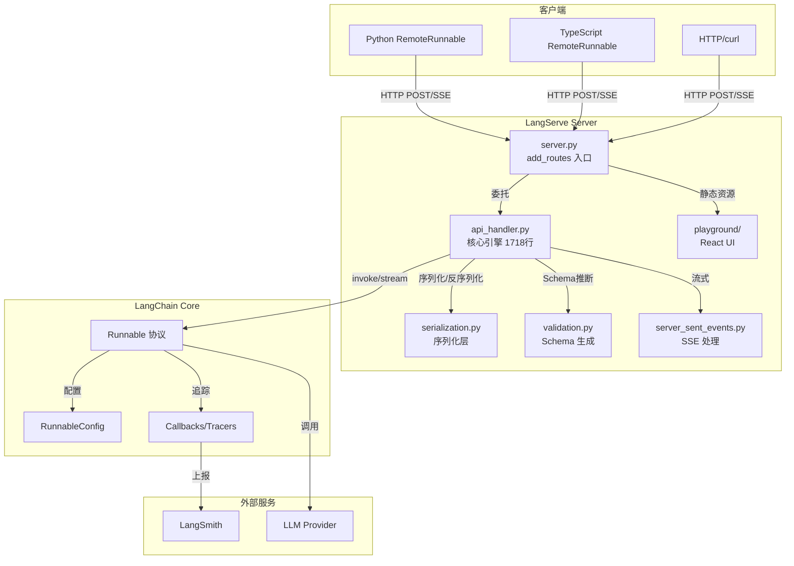
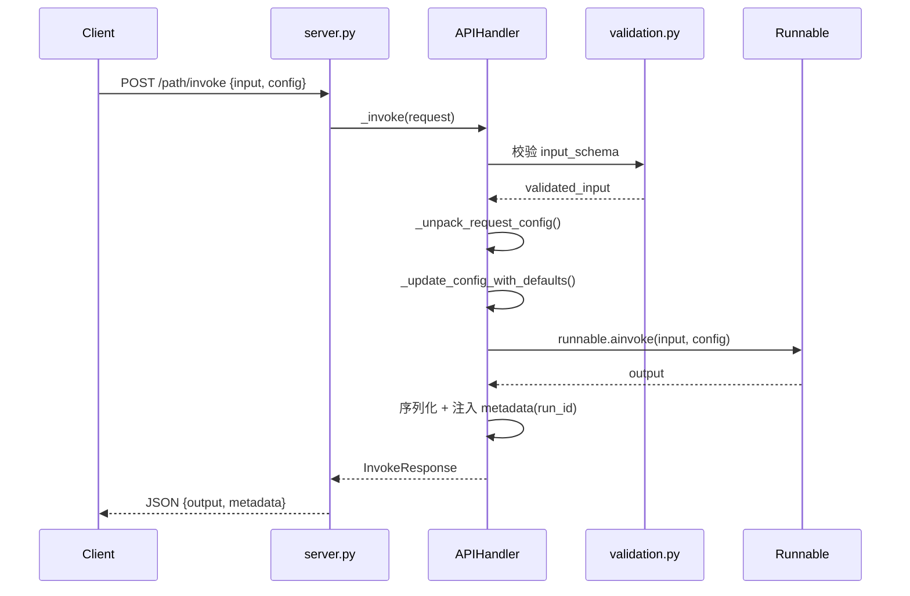
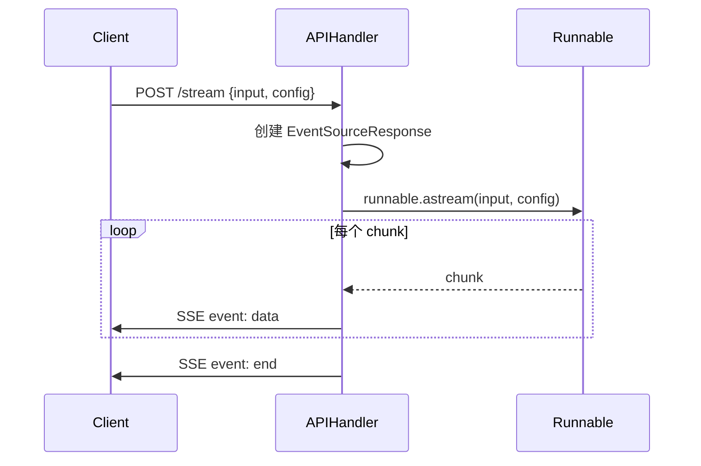

# LangServe：一行代码把 LangChain 链部署成 REST API，为什么官方自己把它废弃了？

> 2328 Star，271 Fork，2024 年 11 月正式标记 DEPRECATED——LangServe 用 14 个月走完了从"明星框架"到"功成身退"的生命周期。它做对了什么？踩了哪些坑？接替它的 LangGraph Platform 又补了哪些短板？

## 1. 项目速览

| 维度 | 数据 |
|------|------|
| 仓库 | [langchain-ai/langserve](https://github.com/langchain-ai/langserve) |
| Star / Fork | 2,328 / 271 |
| 创建时间 | 2023-09-29 |
| 废弃时间 | 2024-11-18（[#791](https://github.com/langchain-ai/langserve/issues/791)） |
| 最终版本 | v0.3.3（2025-10-17，兼容 langchain-core 1） |
| 主语言 | Python 29%、JavaScript 58%（Playground UI）、TypeScript 12% |
| 技术栈 | FastAPI + Pydantic + uvloop + sse-starlette + httpx |
| 许可证 | 自定义（非标准 OSI） |
| 项目状态 | **已归档（Archived）** |
| 继任者 | LangGraph Platform |

## 2. 它解决了什么问题

2023 年下半年，LangChain 生态的 Runnable 协议已经稳定，但把一个链从 Jupyter Notebook 搬到生产环境依然需要手写：
- FastAPI 路由注册
- 输入输出 Schema 定义
- 流式 SSE 处理
- 并发 batch 逻辑
- Playground 调试界面

LangServe 把这 5 件事压缩到一行 `add_routes(app, chain, path="/xxx")`。

## 3. 核心能力拆解

### 3.1 自动暴露 8 个端点

```
POST /invoke          同步调用
POST /batch           批量调用
POST /stream          SSE 流式输出
POST /stream_log      流式 + 中间步骤
POST /astream_events  v2 事件流
GET  /input_schema    输入 JSON Schema
GET  /output_schema   输出 JSON Schema
GET  /config_schema   配置 Schema
```

开发者只需传入任何 `Runnable` 对象，LangServe 自动推断 Schema 并生成 Swagger 文档。

### 3.2 内置 Playground

每个路由附带 `/playground/` 页面，支持：
- 实时流式输出展示
- 中间步骤可视化
- Configurable 参数动态控件
- Chat 模式（支持消息列表输入）
- LangSmith 反馈按钮（thumbs-up/down）

### 3.3 客户端 SDK

`RemoteRunnable` 把远程 API 伪装成本地 Runnable，同一套 `.invoke()` / `.stream()` / `.batch()` 接口跨本地和远程：

```python
from langserve import RemoteRunnable

chain = RemoteRunnable("http://localhost:8000/joke/")
result = chain.invoke({"topic": "cats"})

async for chunk in chain.astream({"topic": "cats"}):
    print(chunk, end="")
```

TypeScript 侧通过 `@langchain/core/runnables/remote` 对齐。

### 3.4 认证与权限

提供 3 层方案：
1. **全局依赖**：FastAPI `Depends` 保护所有端点
2. **路径依赖**：单路径级别中间件
3. **per_req_config_modifier**：按请求动态修改 Config（支持用户级隔离）

对于需要完全控制的场景，可直接使用 `APIHandler` 类替代 `add_routes`。

## 4. 架构设计



### 4.1 数据流路径（invoke 为例）



### 4.2 流式处理（stream）



## 5. 源码深度分析

### 5.1 模块全景

| 模块 | 目录/文件 | 职责 | 代码量 | 分析级别 |
|------|-----------|------|--------|----------|
| 核心引擎 | `langserve/api_handler.py` | 请求处理、Schema 管理、流式 | 1718 行 | P0 深度 |
| 路由层 | `langserve/server.py` | FastAPI 路由注册、端点开关 | 1077 行 | P0 深度 |
| 客户端 | `langserve/client.py` | RemoteRunnable 实现 | 866 行 | P0 深度 |
| 序列化 | `langserve/serialization.py` | JSON 序列化策略 | ~300 行 | P1 |
| 校验层 | `langserve/validation.py` | 动态 Pydantic 模型生成 | ~400 行 | P1 |
| Playground | `langserve/playground/` | React 前端 | JS/TS | P2 |
| SSE | `langserve/server_sent_events.py` | SSE 连接管理 | ~150 行 | P2 |

### 5.2 核心模块：api_handler.py

这是整个项目的心脏，1718 行代码完成了从请求接收到响应返回的全链路。

**关键类：`APIHandler`**

```python
class APIHandler:
    def __init__(self, runnable, *, 
                 path, per_req_config_modifier, ...):
        # 1. Schema 推断：从 runnable.input_schema / output_schema 生成 Pydantic 模型
        # 2. 命名空间：用路径前缀避免多 runnable 的 Schema 名冲突
        # 3. 端点配置：根据参数决定暴露哪些端点
```

**设计模式 1：动态 Schema 注册（全局注册表防重复）**

```python
_MODEL_REGISTRY: Dict[str, Type[BaseModel]] = {}
_SEEN_NAMES: set = set()

def _resolve_model(type_, default_name, namespace):
    hash_ = _schema_json(model)
    if hash_ not in _MODEL_REGISTRY:
        _SEEN_NAMES.add(model.__name__)
        _MODEL_REGISTRY[hash_] = model
    return _MODEL_REGISTRY[hash_]
```

同一 Schema 只注册一次，内容相同但名称不同时自动加命名空间前缀。这解决了 FastAPI OpenAPI 文档中模型名冲突的问题。

**设计模式 2：Config 三层合并（last-writer-wins）**

```python
config = merge_configs(
    overridable_default_config,  # 可覆盖默认值
    incoming_config,             # 客户端传入
    non_overridable_default_config,  # 服务端强制值
)
```

确保服务端始终能覆盖客户端配置（安全边界），同时允许客户端自定义合理范围内的配置。

**设计模式 3：per_req_config_modifier（请求级定制）**

```python
if per_req_config_modifier:
    if inspect.iscoroutinefunction(per_req_config_modifier):
        projected_config = await per_req_config_modifier(config, request)
    else:
        projected_config = per_req_config_modifier(config, request)
```

同时支持同步和异步修改器，从 HTTP Request 中提取用户信息注入 Config——实现了认证与业务逻辑的解耦。

### 5.3 路由层：server.py

`add_routes` 是用户唯一需要调用的 API。内部逻辑：

1. 创建 `APIHandler` 实例
2. 根据 `_EndpointConfiguration` 判断启用哪些端点
3. 为每个端点注册 FastAPI 路由
4. 全局 WeakSet 追踪已注册的 App/Path 组合防重复

**路径去重机制**：

```python
_APP_SEEN = weakref.WeakSet()
_APP_TO_PATHS = weakref.WeakKeyDictionary()
```

WeakRef 确保当 App 被 GC 时自动清理注册信息，避免内存泄漏。

### 5.4 客户端：RemoteRunnable

继承自 `langchain_core.runnables.Runnable`，让远程服务在调用方看来和本地 Runnable 没有区别。

**核心技术点**：
- 基于 `httpx` 的异步 HTTP 客户端
- SSE 流解析支持 `astream` / `astream_log` / `astream_events`
- Config 清洗：发送前过滤不可序列化字段（如 langgraph 的 channel 对象）
- 回调转发：将服务端返回的 callback events 投喂到本地 CallbackManager

### 5.5 关键设计决策总结

| 决策 | 选择 | 原因 | 代价 |
|------|------|------|------|
| Schema 推断 | 运行时从 Runnable 类型提取 | 零配置体验 | Pydantic v1/v2 兼容痛苦 |
| 流式协议 | SSE (Server-Sent Events) | 浏览器原生支持、单向够用 | 无法双向通信 |
| 序列化 | 自定义 JSON + langchain-core 的 load/dump | 支持 LangChain 原生对象 | 与 OpenAI 格式不兼容 |
| Playground | 内嵌 React 静态资源 | 零部署即用 | 前端定制困难 |
| Client | 继承 Runnable 接口 | 透明远程调用 | 仅支持 LangChain 生态 |

## 6. 社区热点与已知问题

### 6.1 内存泄漏（#717，41 条评论）

生产环境下每个请求都会导致 RAM 增长、连接不释放，最终触发 `OSError: Too many open files`。核心问题在 SSE 连接生命周期管理。

### 6.2 AgentExecutor 流式失效（#314，35 条评论）

AgentExecutor 在 Playground 中只能等待完整响应，无法逐 token 流式。根因：AgentExecutor 的输出不是逐步 yield，而是最终一次性返回。

### 6.3 invoke 返回空输出（#301，13 条评论）

使用 PydanticOutputParser 时 `/invoke` 返回 `{}`，但 `/stream` 正常。Pydantic 模型序列化在不同端点路径上行为不一致。

### 6.4 OpenAI 兼容格式需求（#396，13 条评论）

社区多次请求 OpenAI API 兼容的端点格式，方便替换 OPENAI_BASE_URL。LangServe 始终未实现此需求。

### 6.5 社区健康度

| 指标 | 状态 |
|------|------|
| 维护者 | @eyurtsev（LangChain 核心团队） |
| 最后提交 | 2025-05 |
| 生命周期 | 已归档（Archived） |
| Issue 响应 | 废弃后停止响应 |
| 未关闭 Issues | 139 个 |
| 文档完整度 | README 详尽，含 15+ 示例 |

## 7. 为什么被废弃？

LangServe 被废弃不是因为它做得差，而是 LangChain 生态的需求升级了：

1. **Agent 复杂度上升**：LangServe 设计时假设 "Chain 是线性的"，无法处理 LangGraph 的循环图、人类反馈节点
2. **状态管理缺失**：无内置会话持久化，需用户自行拼装 `RunnableWithMessageHistory`
3. **双向通信**：SSE 只支持服务端→客户端的单向流，无法实现 Human-in-the-loop
4. **部署运维割裂**：LangServe 只负责 "把链变成 API"，不管扩缩容、版本管理、AB 测试

LangGraph Platform 通过状态持久化 + 双向流 + 托管部署一站式解决这些问题。

## 8. 迁移指引

官方提供了 [MIGRATION.md](https://github.com/langchain-ai/langserve/blob/main/MIGRATION.md)。核心变化：

| LangServe | LangGraph Platform |
|-----------|--------------------|
| `add_routes(app, chain)` | `langgraph.json` 配置 + `langgraph deploy` |
| SSE 单向流 | 双向 WebSocket |
| 无状态 | 内置 checkpointing |
| 自托管 FastAPI | 托管 / 自托管可选 |
| Playground 内嵌 | LangGraph Studio |

## 9. 谁还适合用 LangServe

尽管已废弃，以下场景 LangServe 仍然可用：
- 简单的无状态 Chain（不需要对话历史）
- 内部工具原型验证（快速 Demo）
- 已有稳定运行的旧服务（v0.3.3 兼容 langchain-core 1）
- 不需要 Agent/Graph 能力的纯 RAG 查询

记住：Bug fix 社区还会接受，新功能不再合入。

## 10. 深度总结

LangServe 的核心贡献在于验证了一个理念：**LLM 应用的部署层可以完全自动化**。`add_routes` 这个 API 设计证明，只要 Runnable 协议足够规范，从 Schema 推断到 Playground 生成都能做到零手写。

它的局限也同样清晰：线性链假设、单向流、无状态。这些不是 Bug，而是时代产物——2023 年 Q4 大家还在写简单的 prompt chain，到 2024 年 Agent 爆发后，这套架构天然不够用了。

从工程视角看，LangServe 留下了几个值得学习的模式：
- 全局 Schema 注册表避免 OpenAPI 冲突
- WeakRef 生命周期管理
- Config 三层合并的安全边界设计
- 客户端透明代理（RemoteRunnable）

对新项目：直接上 LangGraph Platform。对存量系统：v0.3.3 还能跑，但别在上面做新投入了。

---

<!-- IMAGE_PROMPT: gpt-image2
Create a technical architecture infographic for "LangServe" project (16:9 aspect ratio, main color #3366CC):
- Top center: "LangServe 🦜️🏓" title with "⭐ 2.3K Stars" badge and a "DEPRECATED" red stamp overlay
- Left side (Inputs): Three client icons - Python SDK, TypeScript SDK, HTTP/curl
- Center (Core): A FastAPI server box containing 4 module blocks stacked vertically:
  1. "add_routes" (entry point, blue)
  2. "APIHandler" (core engine, purple)  
  3. "Serialization" (data layer, green)
  4. "Playground UI" (React frontend, orange)
- Right side (Outputs): REST API endpoints (/invoke, /stream, /batch) flowing to LLM providers
- Bottom: "LangChain Runnable Protocol" foundation bar
- Arrow from LangServe to "LangGraph Platform" with label "Successor"
- Clean flat design, dark blue background, white text, colored module blocks
-->

<!-- IMAGE_PROMPT: gpt-image2
Create a cover image for an article about LangServe (16:9 aspect ratio):
- Visual metaphor: A bridge being built between a Jupyter notebook (left) and a cloud server (right), with the bridge partially dismantled/fading in the middle to represent deprecation
- A parrot mascot (LangChain logo style) standing at the bridge entrance looking forward at a new modern highway (representing LangGraph Platform)
- Color palette: Deep blue (#1e293b) background, bright blue (#3366CC) bridge structure, golden accents
- Text overlay: "⭐ 2.3K" badge in top-right corner
- Style: Clean technical illustration, slightly abstract, professional
-->
