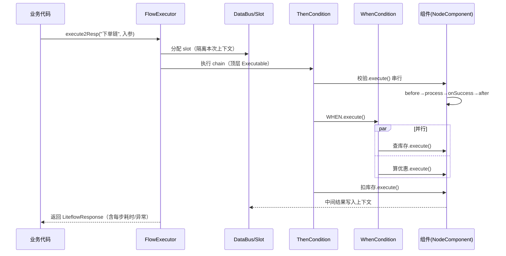
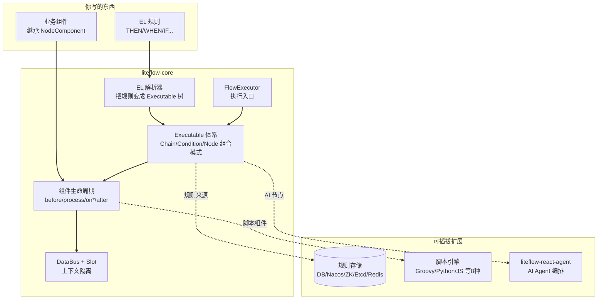

# LiteFlow 源码解剖：把"写死的 if-else 业务流程"变成一句话就能改的编排规则

> 一句话概括：LiteFlow 让你把复杂的业务逻辑拆成一个个独立的"组件"，再用一行类似 `THEN(a, WHEN(b, c), d)` 的规则把它们串起来——想改流程不用改代码、不用重启，直接改规则就行。

## 先看一眼这个项目

| 项目 | 信息 |
|---|---|
| 仓库 | [dromara/liteflow](https://github.com/dromara/liteflow) |
| Star | GitHub 约 2.8k / Gitee 约 6k（国内用户为主，Gitee 更热） |
| 出品 | dromara 开源组织，作者铂赛东（Bryan.Zhang），2020 年开源 |
| 语言 | Java |
| 协议 | MIT（很宽松，随便商用） |
| 当前版本 | 2.16.0（`com.yomahub:liteflow-spring-boot-starter`） |
| 兼容性 | JDK 8~25、Spring Boot 2.X~4.X，非 Spring 也能用 |
| 官网 | [liteflow.cc](https://liteflow.cc/)（中文文档很全） |

先说明一个容易搞混的点：LiteFlow 的 GitHub star 只有 2.8k 左右，但它在国内其实相当能打——Gitee 上 6k star、社区群 5000 多人，拿过 OSC 年度最受欢迎、Gitee GVP、2025 年度开源基础软件赛道第二名。它是那种"墙内开花"的国产项目，GitHub 数字会低估它的实际影响力。

## 它到底解决什么问题？

假设你在做一个电商下单系统，下单流程是这样：**校验参数 → 查库存 → 计算优惠 → 风控检查 → 扣库存 → 生成订单 → 发通知**。一开始你用 Service 里一长串方法调用写死了。

然后需求来了：

- "大促期间风控要加一道人工审核" → 你得改代码、加 if。
- "这个渠道不需要算优惠" → 又改代码、又加 if。
- "查库存和算优惠其实可以并行，别串着跑浪费时间" → 你得动线程池，改一堆。
- 每改一次，都要**重新发版、重启服务**。

流程一复杂，你的 Service 就变成一坨几百行、全是 if-else 嵌套的"意大利面代码"，谁都不敢动。

LiteFlow 的思路是把这件事彻底翻转：

1. **把每一步拆成独立组件**：校验是一个组件、查库存是一个组件、算优惠是一个组件……每个组件只干一件事，互不依赖。
2. **用一行"规则"把组件编排起来**：比如 `THEN(校验, WHEN(查库存, 算优惠), 风控, 扣库存, 生成订单, 通知)`——`THEN` 是串行，`WHEN` 是并行。
3. **规则可以存在外面、还能热更新**：规则放数据库/Nacos/Redis 里，想改流程直接改规则，**应用不用重启**，实时生效。

这么一来，业务流程从"埋在代码里"变成了"摆在明面上的一行编排规则"，改流程的成本从"改代码+发版"降到"改一行配置"。这就是"编排式规则引擎"的价值。

## 核心设计：一切皆组件 + 一行 EL 管编排

理解 LiteFlow，抓住两个词：**组件（Component）** 和 **EL 表达式**。

- **组件**：业务逻辑的最小单元。你写一个类，继承 `NodeComponent`，实现 `process()` 方法，它就是一个能被编排的积木块。
- **EL 表达式**：LiteFlow 自创的一套编排语言，关键字就那么几个，5 分钟能学会：

```java
THEN(a, b, c);                          // 串行：a → b → c 依次执行
WHEN(a, b, c);                          // 并行：a、b、c 同时跑
IF(x, a, b);                            // 条件：x 成立走 a，否则走 b
SWITCH(x).to(a, b, c);                  // 选择：根据 x 的返回值选一个
FOR(3).DO(a);                           // 循环：a 执行 3 次
THEN(prepare, WHEN(b, c), summary);     // 嵌套：串行里套并行
```

这套 EL 最妙的地方是**可以任意嵌套**。`THEN` 里能塞 `WHEN`，`WHEN` 里能塞 `IF`，想多复杂就多复杂——但读起来始终一目了然。这背后其实是一个很优雅的设计模式，下面拆源码时会讲到。

## 源码深挖之一：组件生命周期，一条"带前戏和收尾的流水线工位"

先看"皆为组件"这句话在源码里怎么落地。核心是 `NodeComponent` 这个抽象类（`liteflow-core` 的 `com.yomahub.liteflow.core.NodeComponent`）。

你写业务组件时只需要实现一个 `process()` 方法。但 LiteFlow 在你的 `process()` 外面包了一整套生命周期。看它的 `execute()` 方法（精简后）：

```java
public void execute() throws Exception {
    // ... 记录 step 信息、启动计时器 StopWatch ...
    try {
        self.beforeProcess();   // 前置处理（钩子）
        self.process();         // ← 你写的业务逻辑
        self.onSuccess();       // 成功回调（钩子）
        cmpStep.setSuccess(true);
    } catch (Exception e) {
        cmpStep.setException(e);
        self.onError(e);        // 失败回调（钩子）
        throw e;
    } finally {
        self.afterProcess();    // 后置处理（无论成败都跑）
        // ... 记录耗时、step 数据、性能统计 ...
    }
}
```

这个设计像什么？像工厂流水线上的一个**工位**：零件进来（beforeProcess 做准备）→ 核心加工（process）→ 检验合格盖章（onSuccess）/ 不合格记录问题（onError）→ 收尾清场（afterProcess）。你只管写"加工"这一步，前戏和收尾框架都替你搭好了。

几个值得说的细节：

**① 用 `self` 而不是 `this`。** 源码注释写得很直白——因为如果有 Spring AOP 去切这个组件，`this` 在 AOP 里是切不到的，`self` 才是那个被代理过的对象。这是踩过坑才会有的细节。

```java
// 这是自己的实例，取代this
// 为何要设置这个，用this不行么，因为如果有aop去切的话，
// this在spring的aop里是切不到的。self对象有可能是代理过的对象
private NodeComponent self;
```

**② 几个能重写的开关方法**，让组件行为可定制：

```java
public boolean isAccess()          { return true; }   // 要不要进这个组件？返回 false 就跳过
public boolean isContinueOnError() { return false; }  // 出错了要不要继续往下走？
public boolean isEnd()             { ... }            // 要不要直接结束整条链路？
```

`isAccess()` 特别实用——它让"这个组件在什么条件下才执行"成为组件自己的事，而不用在编排规则里写一堆判断。想让某组件只在 VIP 用户时才跑？重写 `isAccess()` 返回判断结果就行。

**③ 全局切面用 SPI 机制，兼容非 Spring 环境。** `beforeProcess`/`onSuccess` 这些钩子内部调的是 `CmpAroundAspectHolder.loadCmpAroundAspect()`——通过 Java SPI 拿到当前环境的实现。Spring 环境下是真切面，非 Spring 环境下是空实现。这就是它敢说"非 Spring 也支持"的底气。

## 源码深挖之二：EL 编排引擎，一套教科书级的"组合模式"

这是 LiteFlow 最见功力的地方。`THEN`、`WHEN`、`IF` 这些关键字到底是怎么变成可执行流程的？答案藏在一个叫 `Executable` 的接口里。

看它的定义（`com.yomahub.liteflow.flow.element.Executable`），注释一句话点破了全部：

```java
/**
 * 可执行器接口 目前实现这个接口的有3个，Chain，Condition，Node
 */
public interface Executable {
    void execute(Integer slotIndex) throws Exception;   // 统一的"执行"入口
    default boolean isAccess(Integer slotIndex) { return true; }
    // ... getId / setTag 等
}
```

**关键就在"实现这个接口的有 3 个：Chain、Condition、Node"。** 这是标准的**组合模式（Composite Pattern）**：

- **`Node`（叶子）**：最小单元，包着你写的那个业务组件（NodeComponent）。
- **`Condition`（枝干）**：就是 `THEN`/`WHEN`/`IF`/`SWITCH`/`FOR` 这些编排器，它内部**装着一个 Executable 列表**。
- **`Chain`（整棵树）**：一整条规则链，最顶层的容器。

因为三者都实现了同一个 `execute()` 方法，所以 `Condition` 在执行时，根本不关心自己手里的元素是"一个业务组件"还是"另一个编排器"——统统当 `Executable` 调 `execute()` 就完事。

拿"串行器" `ThenCondition` 的真实源码看最清楚：

```java
public class ThenCondition extends Condition {
    @Override
    public void executeCondition(Integer slotIndex) throws Exception {
        // ... 先跑 PreCondition ...
        try {
            // 核心：挨个取出可执行元素，依次 execute
            for (Executable executableItem : this.getExecutableList()) {
                executableItem.setCurrChainId(this.getCurrChainId());
                executableItem.execute(slotIndex);   // ← 递归的关键
            }
        }
        // ... catch ChainEndException（用户主动结束，属正常）...
        finally {
            // FinallyCondition 无论如何都执行
            for (FinallyCondition fc : finallyConditionList) { fc.execute(slotIndex); }
        }
    }
}
```

**这个 `for` 循环里的 `executableItem.execute()` 就是整个引擎的心脏。** 当你写 `THEN(prepare, WHEN(b, c), summary)`：

1. 最外层是一个 `ThenCondition`，它的列表里有三个元素：`prepare`（Node）、`WHEN(b,c)`（WhenCondition）、`summary`（Node）。
2. `ThenCondition` 循环调用它们的 `execute()`。
3. 轮到 `WHEN(b,c)` 时，它自己又是个 Condition，`execute()` 里再去并行跑 b 和 c。

一层套一层，递归下钻——**这就是为什么 EL 能任意嵌套还不乱**。用组合模式，"一个组件"和"一组编排"在代码眼里长得一模一样。这是我在国产框架里见过把组合模式用得最干净利落的案例之一。

顺带说个细节：`ChainEndException` 被单独 catch 出来。因为用户可以在组件里 `setIsEnd(true)` 主动结束整条链路，这个"异常"其实是正常业务信号，不能当错误处理。这种把控制流和异常流分清楚的细节，是成熟框架的标志。

## 一次下单请求的完整流转

把两块源码串起来，看一次 `THEN(校验, WHEN(查库存, 算优惠), 扣库存)` 是怎么跑的：



**关键点**：所有组件之间不直接传参，而是通过 `DataBus` 分配的 `Slot`（上下文槽）共享数据。每次请求分一个独立的 slot，靠 `slotIndex` 隔离——这就是官网说的"上下文隔离机制"，高并发下各请求的数据不会串。组件里通过 `getContextBean()` 拿上下文，干净又线程安全。

## 模块关系全景



实线是强依赖，虚线是可插拔能力。`FlowExecutor` 是入口，EL 解析器把规则编译成 `Executable` 树，执行时驱动组件生命周期，数据走 `DataBus`。规则存储、脚本引擎、AI Agent 都是按需挂载的扩展。

## 几个有意思的能力

- **脚本组件**：组件逻辑不一定用 Java 写，支持 Groovy、Python、JS、Kotlin、Lua、QLExpress、Aviator 等 8 种脚本语言，脚本里还能反过来调 Java 方法、发 RPC。适合那种"规则天天变"的场景，改脚本比改 Java 快。
- **平滑热刷**：规则和脚本都能热更新，改完实时生效不重启，而且高并发下刷新不会导致正在执行的流程出错。
- **组件重试**：每个组件能单独配重试次数、指定只对某些异常重试（源码里 `retryCount` + `retryForExceptions`）。
- **AI Agent 编排（v2.16.0 新增）**：这个有意思——它把一个完整的 ReAct Agent 封装成标准 LiteFlow 组件（`liteflow-react-agent` 模块），"一个组件就是一个 Agent"。于是 AI 节点能和普通业务节点用同样的 `THEN`/`WHEN`/`IF` 编排在一起。**顺便一提，这个 AI 模块底层就是基于 agentscope-java 构建的，运行需要 JDK 21+。**

## 和几个相关项目比一比

| 对比对象 | 定位差异 |
|---|---|
| **Spring StateMachine** | 状态机，擅长"状态流转"；LiteFlow 擅长"流程编排"，EL 更直观，学习成本更低 |
| **Activiti / Flowable** | 重量级 BPMN 工作流引擎，偏审批流、长流程、有流程实例持久化；LiteFlow 轻量、偏代码逻辑编排、无状态 |
| **Drools** | 老牌规则引擎，擅长"规则匹配/决策表"，学习曲线陡；LiteFlow 偏"流程编排"，上手快得多 |
| **原生 if-else / 手写编排** | 零依赖，但流程一复杂就变意大利面，改一次发一次版；LiteFlow 用一点框架开销换来可维护性和热更新 |

一句话选型建议：**要做审批流、有复杂状态和持久化需求** → Activiti/Flowable 更专业；**要做复杂决策、规则匹配** → Drools 更对口；**要把一堆业务步骤解耦、灵活编排、还想热更新** → LiteFlow 很合适，尤其是国内团队，中文文档和社区响应是实打实的优势。

## 快速上手

引入 starter（Spring Boot 环境）：

```xml
<dependency>
    <groupId>com.yomahub</groupId>
    <artifactId>liteflow-spring-boot-starter</artifactId>
    <version>2.16.0</version>
</dependency>
```

写一个组件（继承 `NodeComponent`，实现 `process`）：

```java
@LiteflowComponent("checkCmp")
public class CheckComponent extends NodeComponent {
    @Override
    public void process() {
        // 从上下文拿数据
        OrderContext ctx = this.getContextBean(OrderContext.class);
        // ... 你的校验逻辑 ...
    }
}
```

配一条规则（比如放在 `flow.el.xml` 里），然后执行：

```java
// 规则：THEN(checkCmp, WHEN(stockCmp, couponCmp), createOrderCmp)
LiteflowResponse resp = flowExecutor.execute2Resp("orderChain", request, OrderContext.class);
// resp 里能拿到是否成功、异常、每一步的耗时
```

想改流程？改 `execute2Resp` 用的那条规则就行，组件代码一行不动。

## 深度总结：它做对了什么

拆完源码，LiteFlow 有几点判断值得记下来：

1. **组合模式用得干净**。`Chain`/`Condition`/`Node` 共用 `Executable` 接口，让 EL 能无限嵌套还保持代码简洁——这是整个框架优雅的根基。
2. **组件生命周期设计到位**。before/process/on*/after 的钩子 + `self` 代理解决 AOP + SPI 兼容非 Spring，细节里都是踩坑经验。
3. **把"改流程"的成本打下来了**。规则外置 + 热刷新，让业务流程从"代码资产"变成"配置资产"，这是它最实在的价值。
4. **持续迭代 + 紧跟潮流**。2020 年至今高速迭代，2.16.0 还把 AI Agent 编排接了进来，紧跟 AI 潮流。

它的短板也得实话实说：**它是"编排引擎"，不是"工作流引擎"**——没有 BPMN 那种图形化流程设计器、没有流程实例持久化和人工任务管理，你要做 OA 审批流它不合适。另外它**在海外知名度有限**（GitHub 2.8k），英文社区较小，遇到问题主要靠中文社区和文档。还有个现实约束：想用最新的 AI Agent 编排能力，得上 JDK 21+。

但如果你是 Java 团队、手上有个 if-else 缠成一团的复杂业务、又想让流程能灵活调整甚至热更新，LiteFlow 是国产开源里性价比很高的一个选择。它的中文文档详细程度（作者自称能解决 95% 的使用问题）和社区响应速度，是很多海外框架给不了的。

---

<!-- IMAGE_PROMPT: gpt-image2
A clean 16:9 technical architecture infographic for "LiteFlow", primary color #3366CC on white background. Top center: bold title "LiteFlow" with a subtitle "Orchestration Rule Engine" and star badges "GitHub 2.8k / Gitee 6k". Left side: input — a messy tangle of if-else spaghetti code with an arrow transforming into a clean one-line rule "THEN(a, WHEN(b,c), d)". Center: three module blocks — "EL Parser (rule -> executable tree)", "Executable Tree: Chain/Condition/Node composite pattern shown as a tree of blocks", "Component Lifecycle (before -> process -> onSuccess/onError -> after)". Bottom: infrastructure row with icons labeled "Rule Storage: DB / Nacos / ZooKeeper / Redis", "Script Engines: Groovy/Python/JS", "DataBus context isolation". Right side: output — a clean orchestrated pipeline of connected component blocks, plus a small robot icon labeled "AI Agent node". Modern flat design, thin lines, generous whitespace, professional developer-tool aesthetic, English labels.
-->

<!-- IMAGE_PROMPT: gpt-image2
A 16:9 conceptual cover image symbolizing LiteFlow as LEGO-style business orchestration. Central metaphor: a hand snapping together colorful LEGO-like component blocks along a flowing assembly line, where some blocks run in a single line (serial) and some branch into parallel tracks, and one glowing block has a small AI robot face. Above the assembly line floats a single line of code "THEN(a, WHEN(b,c), d)" as the blueprint driving the assembly. Color palette dominated by #3366CC blue with green and orange accent blocks. Small badges "Gitee 6k" in a corner. Clean, modern, slightly playful tech-illustration style, minimal text.
-->
